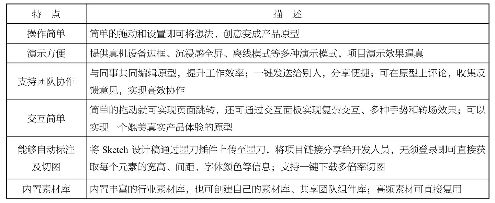

## **交互设计的常用软件**

常用的交互设计软件有Visio、Teambition、墨刀、Axure RP和Adobe XD等。如果追求交互细节，可以使用Axure RP，它的特点是功能全面；而说到做交互流程图、产品概念图，更多使用的是Visio，它操作起来简单快捷。这些交互设计软件各有千秋，可以根据项目需求选择合适的工具，以提高工作效率。

### **1.5.1**

#### **Visio**

#### **1. Visio简介**

Visio是Office软件系列中负责绘制流程图和示意图的软件。Visio是一款便于IT（互联网技术）人员和商务人员就复杂信息、系统和流程进行可视化处理、分析和交流的软件。使用具有专业外观的Visio图表，可以促进用户对系统和流程的了解，通过深入了解复杂信息并利用这些信息做出更好的业务决策。

#### **2. Visio的下载与安装**

在开始使用Visio前，需要先将Visio软件安装到本地计算机中，大家可以在Microsoft官网下载该软件，软件安装部分见附录。

### **1.5.2**

#### **Teambition**

我们在工作和学习中总是要与其他人进行沟通和协调，包括与上级和下级沟通，甚至与其他部门的同事或客户沟通。而在沟通和协调中确定的决议或者安排，往往都停留在口中或者脑海中，能把所有的事按时完成的人还是比较少的。因此需要使用团队协作软件Teambition来进行团队管理。

#### **1. Teambition的使用方向**

Teambition具有无纸化、移动办公、及时沟通和工作标准化等特点，团队的领导人员使用该软件可以让自己的团队做到目标清晰、分工明确、协作高效。

Teambition在管理方面可以实现跨项目、跨部门协调工作。

#### **2. Teambition的功能**

Teambition以项目管理见长，在此基础上又衍生出通信、存储等功能。通过Teambition，企业不仅可以进行项目管理，还可以进行流程审批、工作沟通、文档库建立等操作。

项目是Teambition的基本协作单元，当创建一个项目的时候，里面会包含一些工具和应用，有任务看板、分享墙、文件库、日程等。利用这些不同的工具和应用，可以快速展示项目中需要呈现的信息。

### **1.5.3**

#### **墨刀**

#### **1.墨刀简介**

墨刀是一款在线原型设计与协同工具，用户群体包括产品经理、设计师、研发人员、运营人员、销售人员、创业者等，能够搭建产品原型、演示项目效果。墨刀同时也是协同操作平台，项目成员可以协作编辑、审阅相关文件，还可以展示产品想法、向客户进行demo展示，以及在团队内部进行项目管理等操作。

#### **2.墨刀特点**

墨刀特点介绍如表1-1所示。

表1-1 墨刀特点介绍

### **1.5.4**

### **Axure RP**

Axure RP是一款专业的快速原型设计工具，Axure是公司名称，RP则是Rapid Prototyping（快速原型）的缩写。

#### **1. Axure RP简介**

Axure RP主要针对负责定义需求、定义规格、设计功能、设计界面的人群，用户包括体验设计师、交互设计师、信息架构师、业务分析师、UI设计师和产品经理。

Axure RP能帮助设计者快速创建基于网站架构图的带注释页面的示意图、操作流程图以及交互设计原型，并可自动生成用于演示的网页文件和规格文件。此版本有助于快速实现交互功能的建立和窗口布局。此外，该版本还具有内嵌文本链接、旋转形状等原型制作功能，并具有新的硬件加速渲染引擎，旨在加快保存和加载的文件结构，以及用于平滑缩放和更快编辑的流线型画布。

#### **2. Axure RP 9的下载与安装**

在开始使用Axure RP 9之前，需要先将Axure RP 9软件安装到本地计算机中，可以在Axure官网下载该软件，软件安装部分见附录。

### **1.5.5**

#### **Adobe XD**

Adobe XD是一站式UX/UI设计平台。在这款软件中，用户可以进行移动应用制作、网页设计与原型制作。它的特殊之处在于将UI设计与原型建立等功能进行了结合。设计师使用Adobe XD可以高效、准确地完成UI设计图或框架图到交互原型的转变。Adobe XD支持Windows和macOS平台。

#### **1. Adobe XD简介**

Adobe XD主要用于设计UI并为其添加简单的交互效果。它能够实现设计页面到原型页面的转换，并将文档共享给项目团队的其他人员。

Adobe XD已实现与Photoshop、Illustrator和After Effects的良好集成，使设计师可以在这些软件中进行设计，再将相关资源导入Adobe XD中，然后使用Adobe XD创建和共享原型。

Adobe XD支持SVG文件和位图文件，且不会降低保真度。用户在使用软件过程中可以与其他相关设计人员进行实时协作，共同编辑，并添加具有组件状态的交互式元素，支持使用多种交互方式创建高保真原型。

#### **2.下载和安装Adobe XD 2021**

Adobe XD 2021中文版能够为用户提供专业的App设计、UI设计、网站设计等功能，还支持Mac（苹果计算机）、PC（个人计算机）、移动App等多端协同、数据同步等。

该版本最大亮点之一就是能够与Illustrator、Photoshop等软件进行无缝协作，软件安装部分见附录。

