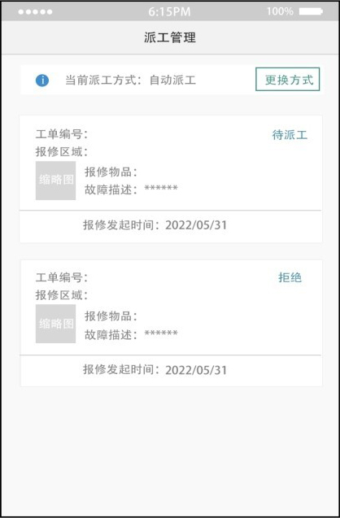
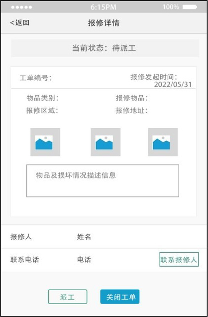
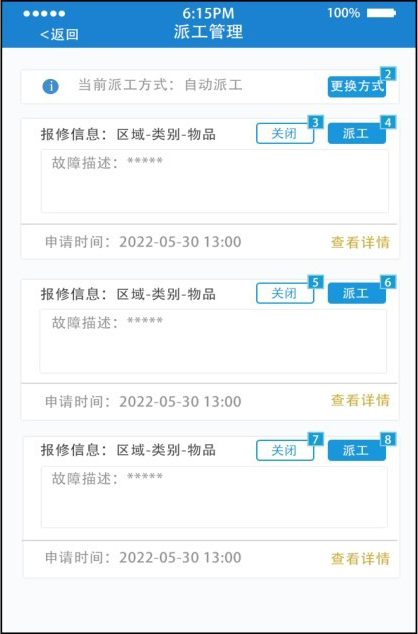
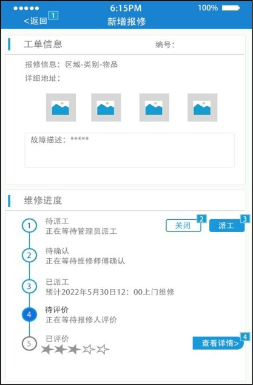
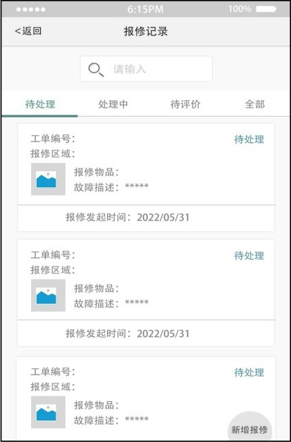
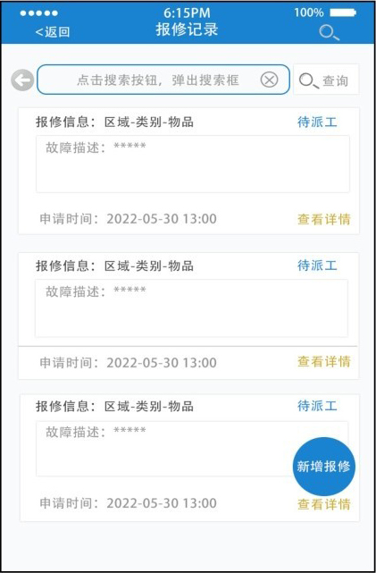

## **项目实施**

——交互设计案例分析

我们在设计一个高保真交互原型之前，要先了解以下几个概念。

① 产品思维：从用户价值出发，在满足商业战略和业务目标的同时，寻求产品实现路径，满足用户需求。

② 线框图、原型图、效果图：线框图是框架，是一种低保真的设计产物；原型是一个应用程序/网页的工作模型，原型的目标是模拟用户和界面之间的交互，原型图的保真度应与思维的保真度相匹配，并且原型图的保真度可以是低保真度、中保真度和高保真度；效果图是高保真的。

③ 扁平化设计：去除冗余的装饰效果，强调抽象化、极简化和符号化，看起来更直观，目前主流的扁平化设计风格降低了我们制作高保真交互原型的门槛。

下面我们来举例说明制作高保真交互原型设计时，将产品的用户体验作为设计思路，同时考虑在交互设计时如何保持产品思维的设计过程。

（1）用户行为路径

我们以电商App售后平台管理界面作为示例，需求简单描述为：报修人在平台填写保修单，管理员收到信息后指派维修人员进行维修。首先，我们要进行低保真原型图的交互设计，如图1-21和图1-22所示，用户的行为路径：在列表页查看待派工的工单，然后进入详情页，看完工单的详细信息以后，在最下方安排维修人员前去维修。

▲图1-21 原型图示例1

图1-22 原型图示例2

做高保真交互设计时，我们通常会参考一些竞品，如淘宝、京东、美团等比较成熟的产品，我们发现这些App中不仅有信息的展示，还有操作按钮、评价、收货等信息。所以在做高保真交互设计时，要运用产品服务用户的思维进行如下改进。

① 对于管理员，进入软件的目的是进行派工，在进入列表页后直接指派即可，所以添加“派工“按钮既提高了效率，也更符合用户的思维，如图1-23所示。

② 当列表页的信息不足以支撑管理员做决定时，管理员才会查看详情页，上方是信息展示，下方是操作按钮，这样管理员查看完详细信息后，就可以更精准地进行后续操作，如图1-24所示。

▲图1-23 原型图示例3

图1-24 原型图示例4

（2）功能优先排序

工单通常有很多条，因此需要有一个搜索功能。在做低保真交互设计时，绘制一个搜索框即可，如图1-25所示。在做高保真交互设计时，参考竞品后我们发现常见的搜索方式有两种：一种是明显的搜索框，另一种是搜索按钮。对于我们做的这个电商App售后平台的用户来说，他们使用产品的主要目的是处理当前事务，而对历史数据的查询功能使用较少，也不存在对其他类型数据的查询，看到的大多是和自己相关的工单数据。因此在做高保真交互设计时可以进行图1-26所示的设计，将搜索框改为搜索按钮，使画面更简洁。

▲图1-25 原型图示例5

图1-26 原型图示例6

## **1.7**

## **项目小结**

上面这个案例通过用户行为路径和功能优先排序方面对交互界面设计进行了分析，我们在做高保真交互原型时，关注的重点仍然是用户需求，保持产品思维，才能设计出符合用户思维并且用户体验度高的交互产品。

## **1.8**

## **素养拓展小课堂**

当我们开发一款产品时，通常都是由一个团队来完成的，而团队的特点是以目标为导向，以协作为基础，团队成员需要遵守相同的规范和方法，在技术或技能上形成互补。

团队协作的本质是共同奉献，这种共同奉献需要一个切实可行、具有挑战意义且能让团队成员共同奋斗的目标。只有这样，才能激发团队成员的工作动力和奉献精神，在一个团队里，并不需要每一个成员各方面能力都特别突出，而是需要成员能够很好地取团队其他成员的长处来补自己的短处，也把自己的长处分享给大家，互相学习交流，共同进步，遇到问题及时交流，这样才能让团队的力量发挥得淋漓尽致。

## **1.9**

## **巩固与拓展**

我们在日常生活中会接触很多的App交互产品，这些产品既是网页的功能补充，也是独立的功能应用。请你搜集一些有关App交互设计理念的资料，思考一下App交互设计与网页设计的共通性及其特有的设计特点；同时对行业网站交互需求进行架构剖析，并尝试设计网站构架。

## **1.10**

## **习题**

### **一、填空题**

1.交互设计的英文缩写为\_\_\_\_\_\_。

2.原型设计阶段需要编写\_\_\_\_\_\_文档。

### **二、单选题**

1.信息架构的基本单位是（ ）。

A.节点

B.控件

C.组件

D.页面

2.结构层要解决的需求是（ ）。

A.产品目标

B.呈现给用户的元素的“模式”和“顺序”

C.确定功能

D.产品的逻辑排布

3.以下选项中，不属于Web产品的框架层设计的是（ ）。

A.界面设计

B.导航设计

C.功能需求

D.信息设计

### **三、多选题**

1.交互设计流程的几个重要阶段包括（ ）。

A.需求分析阶段

B.原型设计阶段

C.视觉设计阶段

D.收集用户反馈阶段

2.尼尔森交互设计可用性原则包括（ ）。

A.灵活高效原则

B.状态可见原则

C.环境贴切原则

D.用户可控原则

3.收集用户反馈的方式通常有（ ）。

A.测试用例评审

B.用户调研

C.可用性测试

D.各种用户反馈渠道

### **四、思考题**

思考低保真原型和高保真原型的特点及使用场景。

