## **交互UI布局设计**

交互UI布局设计的基本理论包括格式塔原理、栅格系统、菲茨定律、希克定律、7±2法则、复杂度守恒定律、奥卡姆剃刀定律等。

### **2.2.1**

### **基本理论的分析**

#### **1.格式塔原理**

格式塔（Gestalt）心理学诞生于1912年，由德国心理学家组成的研究小组试图解释人类视觉的工作原理，其中最基础的发现是人类的视觉是整体的。

我们的视觉系统自动对视觉输入构建结构，并在神经系统层面上感知形状、图形和物体，而不是只看到互不相连的边、线和区域，如图2-1所示。这体现了格式塔原理的封闭性，即我们的视觉系统自动尝试将“敞开”的图形“关闭”起来，从而将其感知为完整的物体。

图2-1 格式塔原理的封闭性

最重要的格式塔原理包括接近性原理、相似性原理、连续性原理、封闭性原理、对称性原理、主体/背景原理、共同命运原理，如图2-2所示。

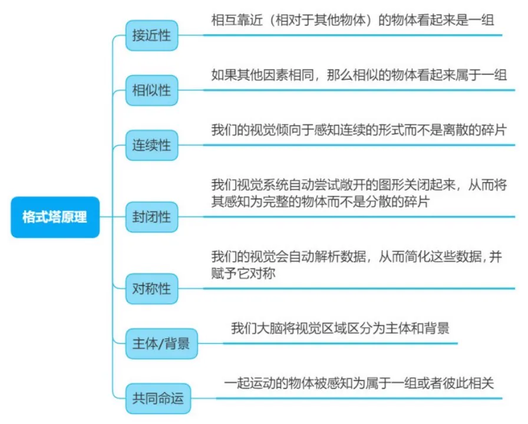

图2-2 格式塔原理

用户界面设计并不都是关于生动的图形，它主要是与沟通、性能和易用有关的图形。所以格式塔原理是应用比较广泛的布局设计理论，它是根据人类感知和认知而总结提炼的视觉规则，为视觉设计师、交互设计师在设计产品时提供了理论依据。

#### **2.栅格系统**

栅格系统（Grid Systems）也叫“网格系统”，网页栅格系统是从平面栅格系统发展而来的，以规则的网格阵列来指导和规范网页中的版面布局以及信息分布，如图2-3所示。

下面对栅格系统进行详细的讲解。

网格：网格是栅格系统最小的单位，栅格是由一系列规律的小网格组成的；在网页设计中经常将网格的大小定义为8，以8为基础倍数，元素大小可以被大多数浏览器识别并整除，最大程度避免出现半像素的情况，且元素以8像素为步进单位，元素的大小、间距有规律可循。目前前端开源组件库也多基于8为最小单位来设计，如图2-4所示。

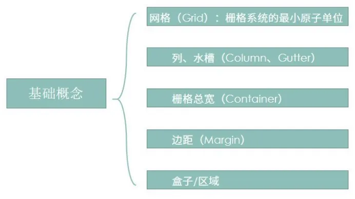

▲图2-3 栅格系统

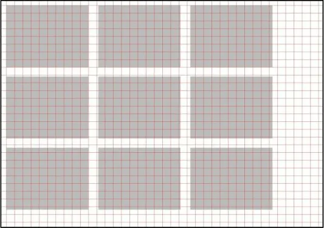

图2-4 网格

列：列是栅格的数量单位，通常设定栅格数量说的就是设定列的数量，如12栅格就有12个列；设定列的内边距（Padding）来定制槽（Gutter）的大小，剩余的部分称为栏。

槽：页面内容的间距，槽的数值越大，页面留白越多，视觉效果越松散，槽的数值通常是固定的，如图2-5所示。

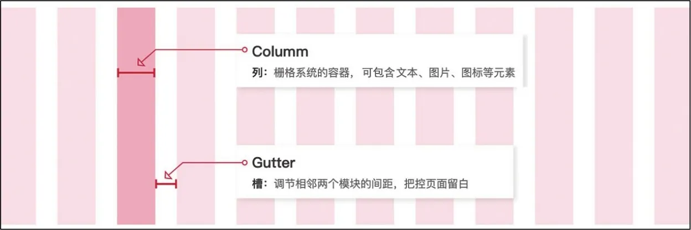

图2-5 列和槽

栅格宽度：页面栅格系统的总宽度。

边距：栅格外边距，与屏幕边缘保持一定的安全距离，如图2-6所示。

盒子/区域：建立好基础栅格之后，一块内容通常会占用一定的区域，我们把这个区域称为内容盒子，如图2-7所示。

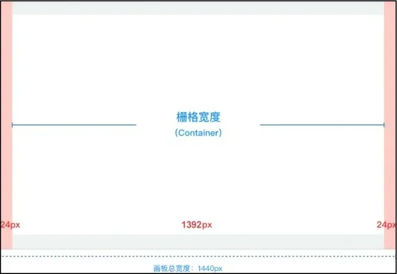

▲图2-6 格栅宽度、边距

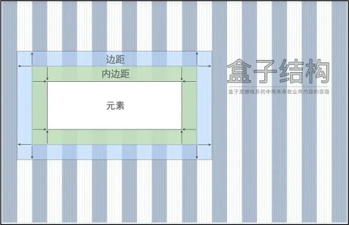

图2-7 盒子/区域

#### **3.菲茨定律**

菲茨定律（Fitts' Law）是由保罗·菲茨（Paul M. Fitts）博士在对人类操作过程中的运动特征、运动时间、运动范围和运动准确性进行研究之后提出的，该定律是被用来预测从任意一点到目标位置所需时间的数学模型，在人机交互（Human-Computer Interaction,HCI）和设计领域的影响深远，如图2-8所示。

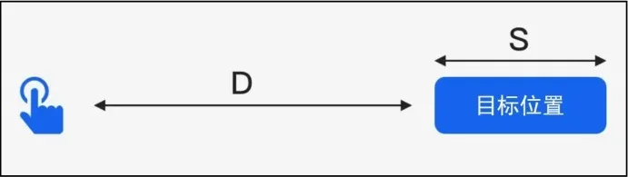

图2-8 菲茨定律

下面举例说明菲茨定律在设计中的应用。

● 界面中可点击区域在合理的范围内越大，越容易被点击，如图2-9所示。

图2-9 菲茨定律的应用1

● 屏幕的边角处很适合放置菜单栏和按钮等元素，不管移动多远，鼠标指针最终会停在屏幕的边缘，并定位到按钮或菜单的上面，如图2-10所示。

● 出现在用户操作的对象旁边的右键菜单比下拉菜单和工具栏打开得更快，因为不需要移动鼠标指针到屏幕的其他位置，如图2-11所示。

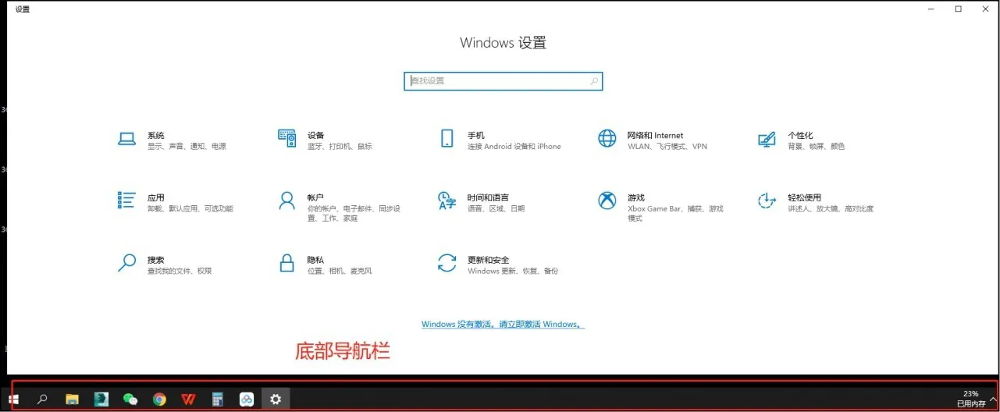

▲图2-10 菲茨定律的应用2

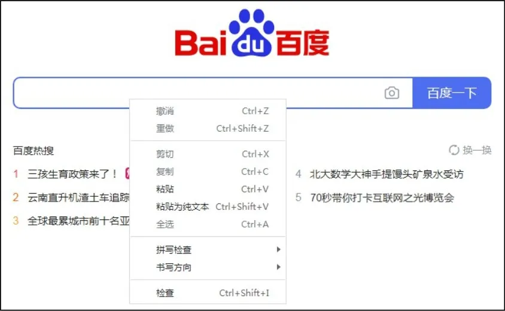

图2-11 菲茨定律的应用3

#### **4.希克定律**

希克定律（Hick' s Law）指的是一个人面临的选择越多，做出决定所需要的时间就越长。希克定律多应用于软件/网站界面的菜单及子菜单的设计中，在移动设备中也比较适用，如图2-12所示。设计中应给用户尽量少的选择，降低用户的决策成本。

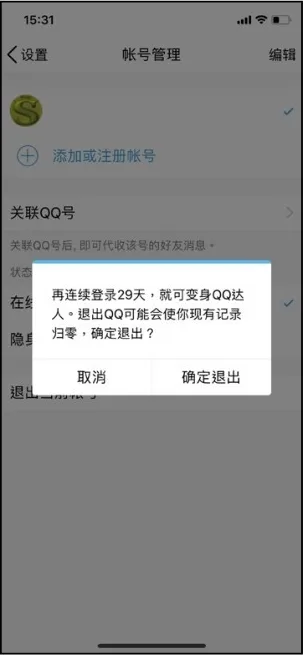

图2-12 希克定律的应用

#### **5. 7±2法则**

1956年，乔治·米勒（George Miller）对短时记忆能力进行了定量研究，他发现人类头脑最好的状态能记忆7（±2）项信息，在记忆5～9项信息后人的记忆就容易开始出错。与希克定律类似，7±2法则也经常被应用于移动应用交互设计，移动应用的选项卡一般不会超过5个。

下面举例说明7±2 法则在设计中的应用。

● PC端导航或选项卡尽量不要超过9个，移动应用的选项卡不要超过5个，如图2-13所示。

图2-13 7±2法则的应用1

● 如果导航或选项卡的内容很多，可以用一个层级结构来展示各段及其子段，并注意其深度和广度的平衡，如图2-14所示。

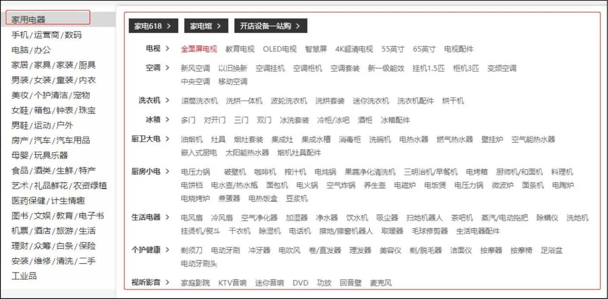

图2-14 7±2 法则的应用2

● 把大块整段的信息分成各个小段，并显著标记每个信息段和子段，以便清晰地显示各自的内容，如图2-15所示。

#### **6.复杂度守恒定律**

复杂度守恒定律（Law of Conservation of Complexity），由泰斯勒（Larry Tesler）于1984年提出，也称泰斯勒定律（Tesler' s Law）。该定律认为每一个过程都有其固有的复杂度，存在一个临界点，超过这个点，过程就不能再简化了，只能将固有的复杂度从一个地方移动到另外一个地方，如图2-16所示。

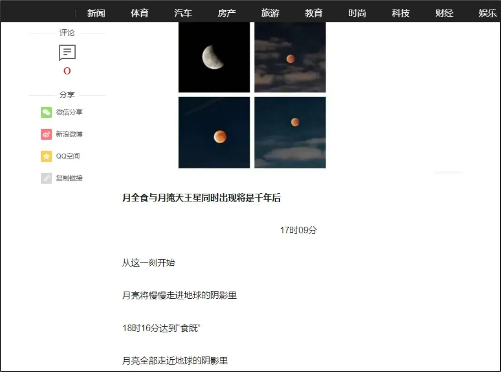

▲图2-15 7±2法则的应用3

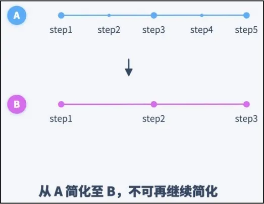

图2-16 复杂度守恒定律

下面举例说明复杂度守恒定律在设计中的应用。

每个应用程序都具有其内在的、无法简化的复杂度。无论是在产品开发环节，还是在用户与产品的交互环节，这一固有的复杂度都无法依照我们的意愿去除，只能设法调整、平衡。这一观点主要被应用在交互设计领域，如个性化信息推荐，如图2-17所示。

除了首页置顶内容，推荐内容对于每个人都是不一样的，它是根据个人的浏览爱好或者倾向进行的推荐。要实现这样的效果或者体验，需要很强的技术和大量服务器的支持，这种做法就是通过技术手段，将用户复杂度降低，将基于用户的协同过渡技术转移给了开发者。

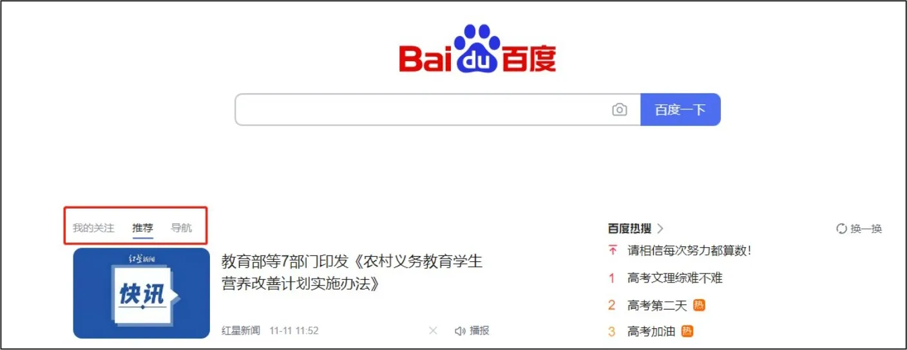

图2-17 复杂度守恒定律的应用

#### **7.奥卡姆剃刀定律**

奥卡姆剃刀定律（Occam' s Razor）是由14世纪逻辑学家奥卡姆（William of Occam）提出，这个定律是指“如无必要，勿增实体”，又被称作“简单有效原理”。不必要的元素会导致设计效率的降低，并且会增加不可预期的后果。在设计中我们可以去掉不必要的干扰元素，这样页面会比较纯粹、简洁。

下面举例说明奥卡姆剃刀定律在设计中的应用。

（1）只放置必要的东西

简洁网页最重要的一个方面是只展示有用的东西，但这并不意味着我们不能提供给用户很多的信息，我们可以用“更多”链接来实现，如图2-18所示。

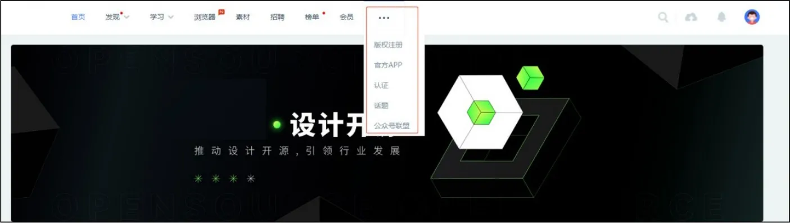

图2-18 奥卡姆剃刀定律的应用1

（2）减少单击次数

让用户通过很少的单击就能找到他们想要的东西，能提升产品的用户体验，如图2-19所示。

图2-19 奥卡姆剃刀定律的应用2

（3）减少段落个数

每当网页增加一个段落，页面中主要的内容就会被挤到一个更小的空间。有些段落并没有起到重要的作用，而是让用户知道更多他们不想了解的东西。图2-20中段落数量过多，用户进入首页看到大量的无关信息，这样会影响用户的正常操作。

（4）“外婆”规则

如果年龄大的人也能轻松地使用我们的产品页面，则会拓宽我们的用户群体，该产品可视作一个好的交互产品，如图2-21所示。

（5）给予更少的选项

做过多的决定也是一种压力，总的来说，用户希望在浏览网页的时候思考得少一点，如图2-22所示。

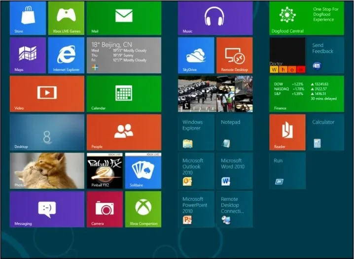

▲图2-20 段落数量过多的页面示例

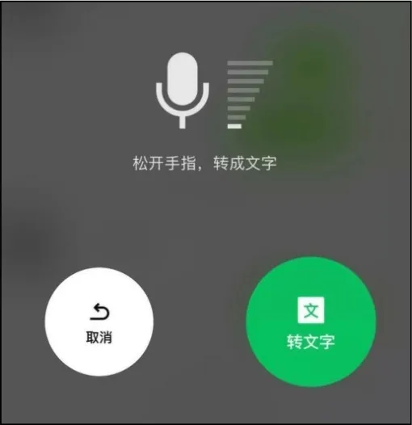

▲图2-21 奥卡姆剃刀定律的应用3

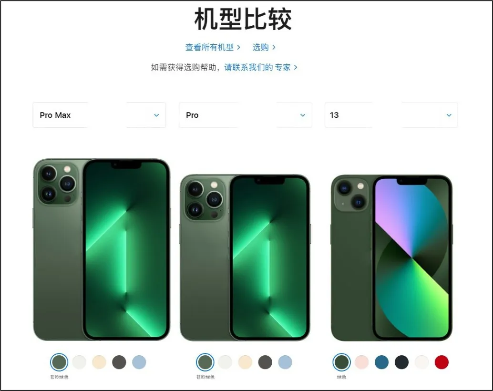

图2-22 奥卡姆剃刀定律的应用4

### **2.2.2**

### **版式设计常见布局类型与分析**

版式设计是设计人员根据设计主题和视觉需求，在预先设定好的有限版面内，运用造型要素和形式原则，根据特定主题与内容的需要，将文字、图片、图形及色彩等视觉传达信息要素进行有组织、有目的的组合排列的设计行为与过程。

版式设计的范围涉及平面设计各个领域。下面介绍常用的几种Web端界面布局设计类型。

#### **1.国字型布局**

国字型布局又称同字型布局，是一些大型网站常采用的布局类型，最上面是网站的标题和横幅广告条，这种布局主要用于首页，如图2-23所示。它的特点是页面容纳内容多，信息量大。

#### **2.匡字型布局**

匡字型布局去掉了国字型布局的右边部分，给主内容区释放了空间，常用于政府机关类网站、学校学术类网站，如图2-24所示。

▲图2-23 国字型布局

图2-24 匡字型布局

#### **3.三字型布局**

三字型布局是在页面上由横向两条色块将网页整体分为三部分，色块中大多放置广告条与版权提示，如图2-25所示。

#### **4.川字型布局**

这种布局将整个页面在垂直方向分为3列，网站的内容按栏目分布在3列中，最大限度地突出主页的索引功能，如图2-26所示。

▲图2-25 三字型布局

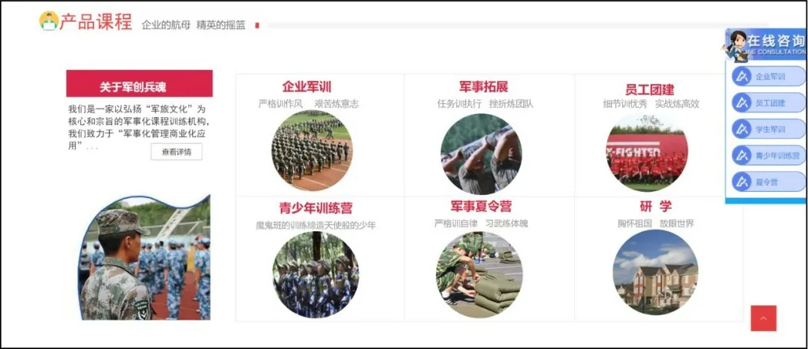

图2-26 川字型布局

#### **5.海报型布局**

海报型布局的首屏是一个大海报，很多企业官网都采用这种布局类型，给人简单、大气的感觉，同时首屏也可以播放视频，如图2-27所示。

图2-27 海报型布局

#### **6.标题文本型布局**

标题文本型布局的页面最上面往往是标题或类似的一些内容，标题下面是正文，这种布局在一些学术类网站或者一些文章页面很常见，如图2-28所示。

图2-28 标题文本型布局

#### **7.综合型布局**

综合型布局就是上述几种布局类型的综合运用，比较灵活，图2-29所示的网页就包含匡字型、标题文本型等布局类型。

图2-29 综合型布局

