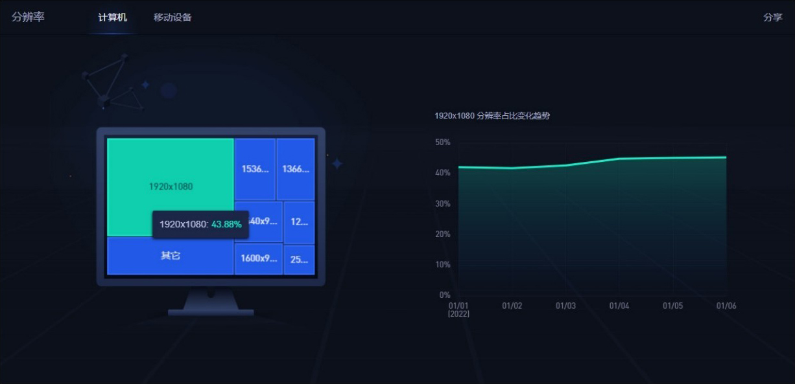
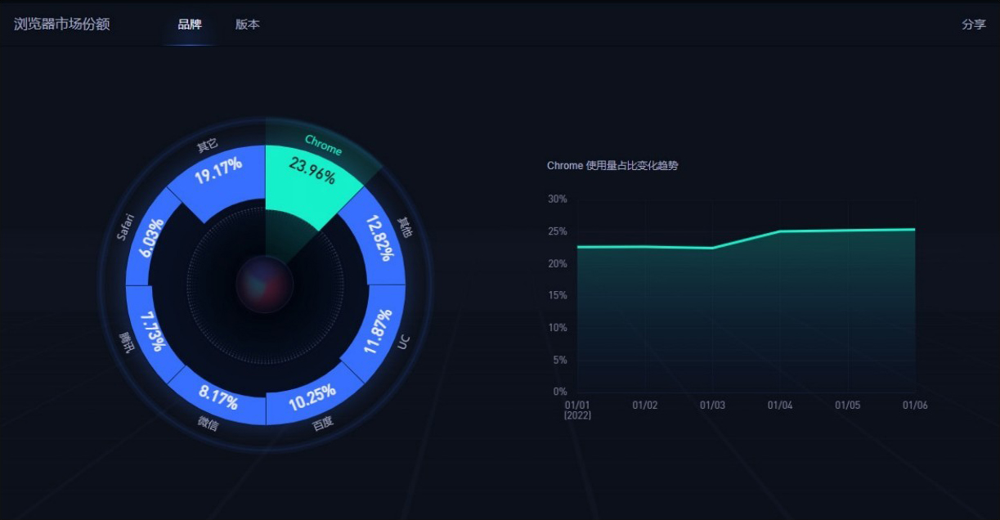
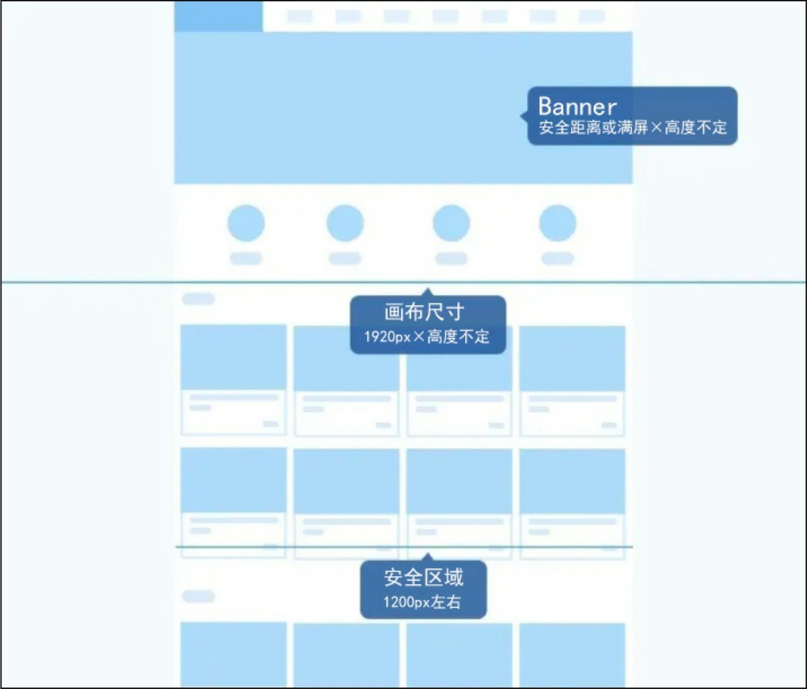
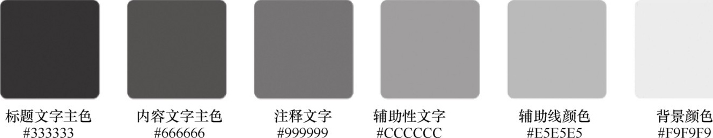
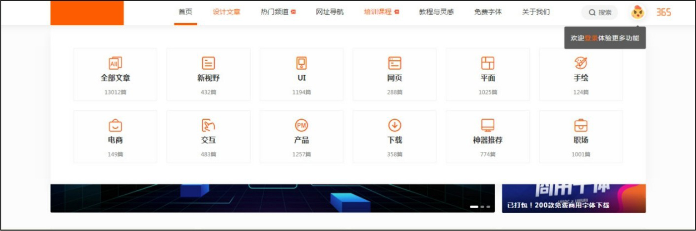

## **基本元素**

UI界面是由多个不同的基本视觉元素组成的。它们通过图形的组合、色彩的搭配、材质和风格的统一、合理的布局构成一个完整的界面。优秀的基本视觉元素是UI界面成功的基础，而UI基本元素设计规范，是以用户为中心根据产品的特点制定的。

### **2.3.1**

### **界面尺寸**

一般情况下，网页界面以1920px宽度作为设计标准。这个数据并不是我们想象出来的，而是由相关的统计网站统计出来的。百度流量研究院统计，市面上占比最多的显示器的分辨率为1920px×1080px，如图2-30所示。

图2-30 百度流量研究院的统计数据

不同浏览器对交互的实现方式不一样，如果都兼顾，实现起来会很复杂，甚至会影响网页的加载速度，从而影响用户体验，所以我们最好根据主流浏览器进行设计，如图2-31所示。

图2-31 百度的统计数据

安全尺寸：在设计和实现PC端网页时，我们通常选用1200px宽度作为安全区域的设计标准。这主要是因为目前市面上设备的主流分辨率为1920px×1080px，我们的产品最终要供用户查看，那么需要兼顾大部分用户的屏幕分辨率。查询当前计算机屏幕分辨率的使用情况可得出主流屏幕的最小宽度为1280px。

由于考虑到屏幕左右两侧可能还会放置广告及返回顶部按钮等，因此原型宽度最好小于1280px。以1920px宽度作为设计标准，在整个页面中，网页的安全区域则为1200px。换句话说，我们只要保证网页的实际内容展示区域控制在1200px以内，就能保证整个页面在不同尺寸的浏览器访问时能够完整地显示出所有的内容，如图2-32所示。

图2-32 安全尺寸

### **2.3.2**

### **文字**

网页文字设计包含字体、字号、字间距及字体颜色等设计。

（1）字体

字体设计的原则是可辨识性和易读性。

网页的文字是系统默认的字体，如宋体、微软黑体、苹果系统黑体，英文则建议使用Arial无衬线字体。

（2）字号

常用的字号有以下几种。

● 12px是应用于网页的最小字号，适用于非突出性的日期、版权等注释性内容。

● 14px则适用于非突出性的普通正文内容。

● 16px、18px和20px适用于突出性的标题内容。

（3）间距

● 字间距：相邻两个文字的间距，除了特殊的需求，可以使用默认的字间距。

● 行间距：推荐以字体大小的1.5～2倍作为参考进行设置。

● 段间距：推荐以字体大小的2～2.5倍作为参考进行设置。

如当选用14px的字体时，行间距为21～28px，段间距为28～35px。

（4）字体颜色

主文字颜色建议使用公司品牌的VI颜色，可提高公司网站与公司VI之间的关联，增加可辨识性和记忆性。

正文字体颜色选用易读性好的深灰色，建议选用#333333到#666666之间的颜色。

辅助性、注释类的文字则可以选用#999999这种比较浅的颜色，如图2-33所示。

图2-33 字体颜色

### **2.3.3**

### **色彩**

色彩搭配遵循统一性配色原则，设计时要使用Web安全色，在Photoshop中选择RGB/8位，其他模式的色域很宽、颜色范围很广，在不同显示屏上可能会出现失色现象；通常，活动专题页可以不按这个规范执行。

设计时尽量保持色相一致，这样会给人页面一致化的感受，颜色尽量不要超过3种——主色、辅色、点缀色，特殊情况可以稍微偏离主色或使用邻近色，如图2-34所示。

图2-34 统一性配色

