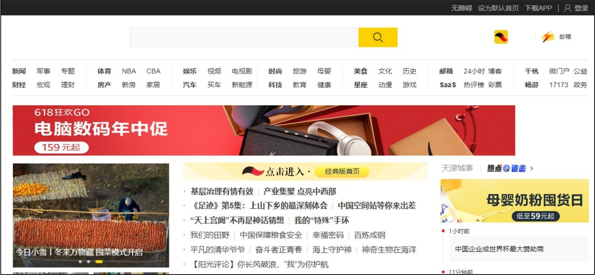
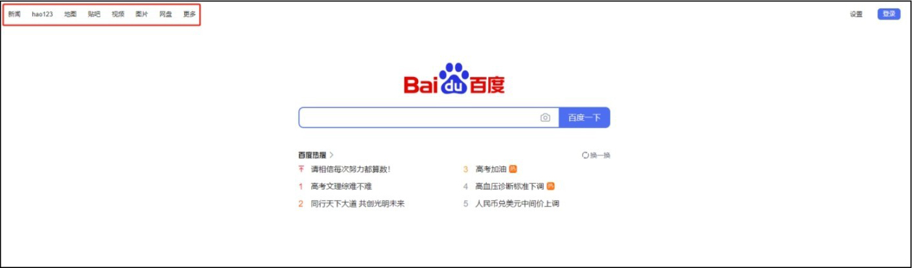

## **网页和网页交互UI组件的分类**

下面介绍网页和网页交互UI组件的分类，了解这些内容有助于我们设计出符合用户需求的交互UI。

### **2.4.1**

### **网页的分类**

网页设计其实就是一个网站的设计，包含网站的各个页面。那么对于设计，首先考虑的是布局，布局是否合理将直接影响到用户的阅读体验及访问时长。网页大概分为以下几类。

（1）综合资讯类网页

综合资讯类网页以提供信息资讯为主，是目前最普遍的网页形式之一，大部分企业的综合门户类网页都属于这类。其特点是信息量大，访问群体广，功能比较简单，基本包含检索、留言等简单的交互，如图2-35所示。

▲图2-35 综合资讯类网页

▼微课视频

网页的分类和设计规范

（2）企业品牌类网页

企业品牌类网页以展示为主，展示企业综合实力、体现企业品牌理念，对创意、美工、内容的组织策划等的要求较高；利用多媒体交互技术、视频、动态网页技术等，达到营销传播的目的。

（3）交易类网页

交易类网页以实现交易为目的，网站的内容基本是商品的展示、订单的生成等。

（4）社区论坛类网页

社区论坛类网页由同一地区或同一类型用户构成，把用户集中在一个平台，如猫扑、天涯社区等。

（5）办公及政府机构类网页

办公及政府机构类网页包括人力资源系统、办公事物管理系统等，基本的功能是提供多数据接口，实现业务系统的数据整合。

（6）互动游戏类网页

互动游戏类网页是近年来流行的一种网页。如传奇，联众等，这类网站的投入是根据所承载游戏后复杂程度来定的。

（7）有偿资讯类网页

有偿资讯类网页与综合资讯类网页相似，也是以提供资讯为主，但这类网页的业务模式一般要求访问者按次、时间或量付费，如知乎的付费咨询等业务。

（8）功能类网页

功能类网页的主要特征是将一个具有广泛需求的功能扩展开，开发一套强大的支撑体系，看似简单的页面，往往投入却很大，如图2-36所示。

（9）综合类网页

综合类网页的特点是提供两个以上类型的服务。

图2-36 功能类网页

### **2.4.2**

