## **网页交互UI组件的分类**

UI组件就是用户界面成套元件，是界面设计常用控件或元件。网页交互UI组件根据用途，可以分为如下六大类。

● 反馈类：各种提示、提醒框。

● 表单类：输入框、级联选择器、单选框、复选框等。

● 基础类：按钮、布局等。

● 数据类：徽标数、上传、进度条、加载条等。

● 导航类：导航菜单、面包屑、下拉菜单等。

● 其他类：表格、列表、卡片等。

微课视频

网页交互UI组件使用详解

#### **1.反馈类**

反馈就是用户做了某项操作后，系统给用户的一个响应。

（1）吐司提示

当用户产生操作或输入错误时，会出现吐司提示，如图2-37所示。

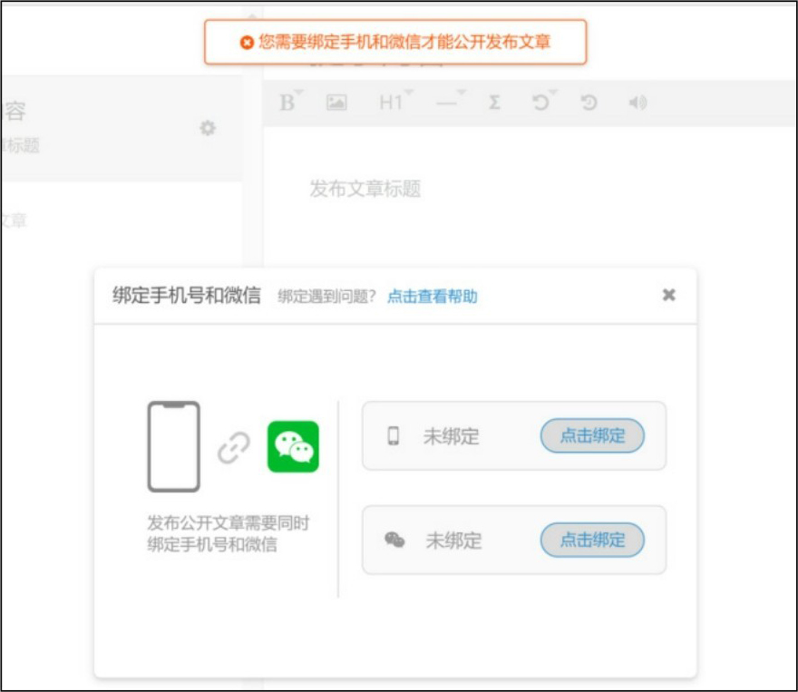

图2-37 吐司提示

吐司提示告知用户需要了解的信息，让用户在使用过程中得到反馈和帮助。

（2）气泡提示

气泡提示常用于解释操作按钮。

鼠标指针移入则立即显示提示，移出提示则立即消失，不承载复杂文本和操作，如图2-38所示。

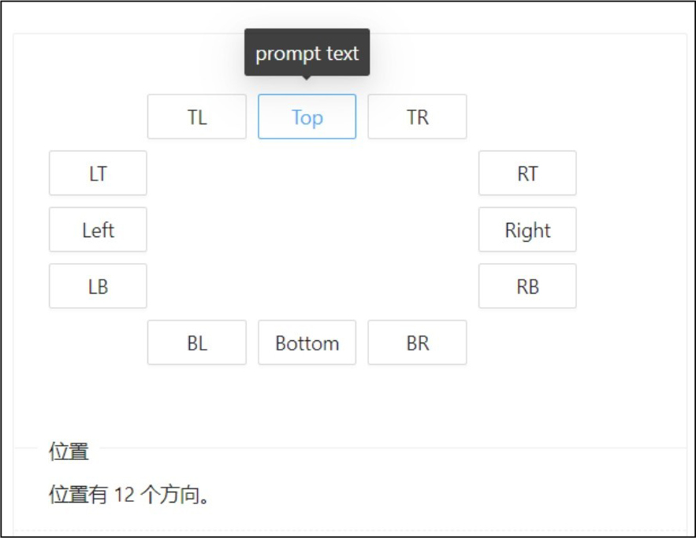

图2-38 气泡提示

#### **2.表单类**

表单在网页中主要负责数据采集，用户输入数据后表单需要将数据提交到数据库。

（1）输入框

输入框主要用于用户输入文本，是以字符串的方式将输入内容提交到数据库，如图2-39所示。

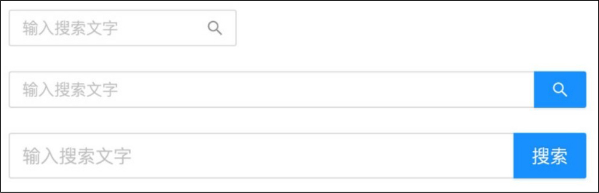

图2-39 输入框

（2）级联选择器

当一个数据集合有清晰的层级结构时，我们可以通过级联选择器进行逐级查看并选择，如图2-40所示。

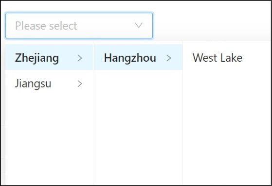

图2-40 级联选择器

（3）单选框

单选框用于在多个备选项中选中单个选项，如图2-41所示。

（4）复选框

复选框用于在一组可选项中进行多项选择，如图2-42所示。

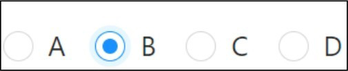

▲图2-41 单选框

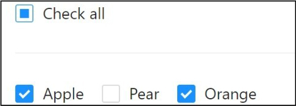

图2-42 复选框

#### **3.基础类**

这个类型在网页中主要表现为按钮和页面的整体布局。

（1）按钮

按钮用于开始一个即时操作。在设计中，有5种基本按钮类型：主要按钮、默认按钮、虚线按钮、文本按钮、链接按钮，如图2-43所示。

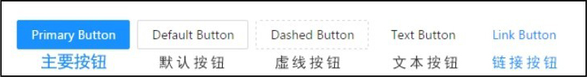

图2-43 按钮类型

（2）布局

布局主要是协助进行页面的整体布局，通常用于应用型网站，如图2-44所示。

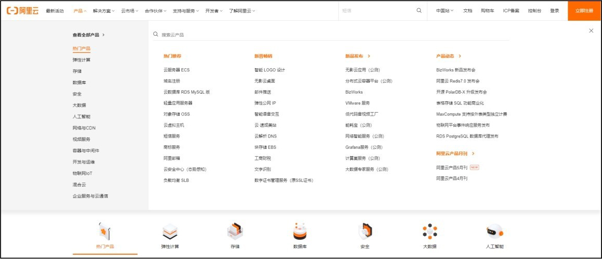

图2-44 顶部侧边布局

#### **4.数据类**

这种类型在网页中主要负责展示将数据进行标记、上传及加载的过程。

（1）标记/徽标数

标记/徽标数一般出现在通知图标或头像的右上角，用于显示需要处理的消息条数，通过醒目的视觉形式吸引用户处理，如图2-45所示。

（2）上传

上传是通过单击或者拖动上传文件，将信息（网页、文字、图片、视频等）通过网页或者上传工具发布到远程服务器上的过程，如图2-46所示。

▲图2-45 标记/徽标数

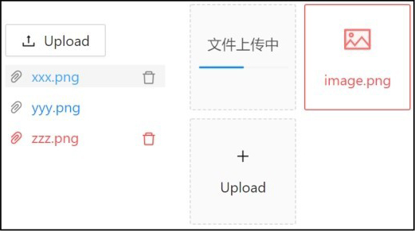

图2-46 上传

（3）进度条

进度条用于展示当前操作进度，告知用户当前状态和预期，如图2-47所示。

（4）加载

当加载数据时网页中会显示动效，合适的加载动效会有效缓解用户的焦虑情绪，如图2-48所示。

▲图2-47 进度条

图2-48 加载

#### **5.导航类**

导航类组件主要用于作为导航提示的组件，如导航菜单、面包屑、下拉菜单等。

（1）导航菜单

导航菜单是一个网站的灵魂，是为用户提供页面和功能导航的菜单列表，用户依赖导航菜单在各个页面中进行跳转。

导航菜单一般分为顶部导航和侧边导航，如图2-49和图2-50所示。

▲图2-49 顶部导航

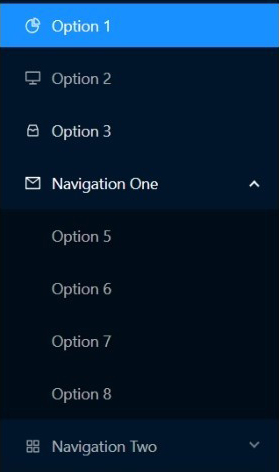

图2-50 侧边导航

（2）面包屑

面包屑显示当前页面在系统层级结构中的位置，并能向上返回，提供一个有层次的导航结构，并标明当前位置，如图2-51所示。

（3）下拉菜单

下拉菜单是弹出的菜单列表，可将动作或菜单折叠到下拉菜单中，如图2-52所示。

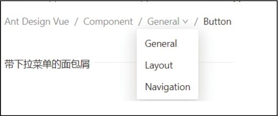

▲图2-51 面包屑

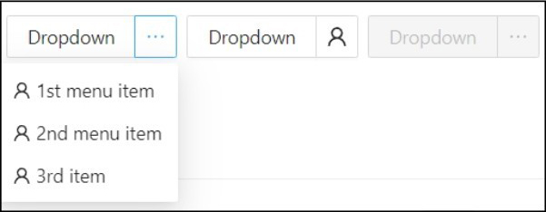

图2-52 下拉菜单

#### **6.其他类**

其他类通常是表格、通用列表及卡片等用于后台展示的组件。

（1）表格

表格是为页面和功能提供导航的菜单列表，展示行、列数据，如图2-53所示。

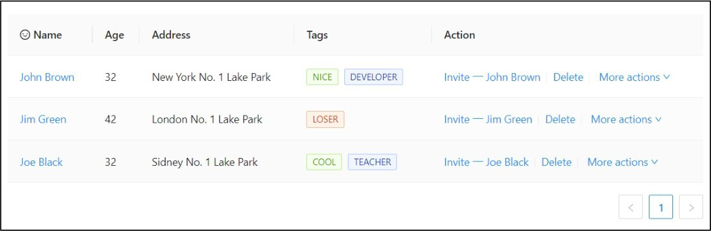

图2-53 表格

（2）通用列表

通用列表是最基础的列表展示，可以承载文字、列表、图片、段落，常用于后台数据展示页面，如图2-54所示。

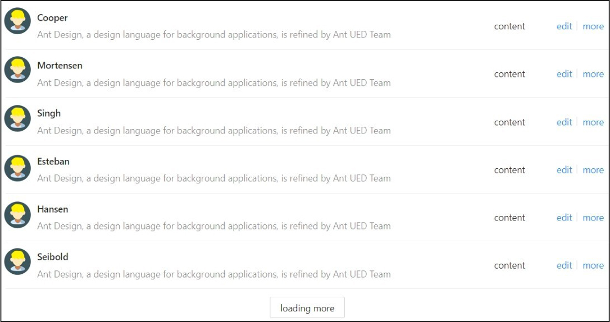

图2-54 通用列表

（3）卡片

卡片组件是一种通用卡片容器，用户可以将信息聚合在卡片组件中展示。该组件可承载文字、列表、图片、段落，常用于后台概览页面，如图2-55所示。

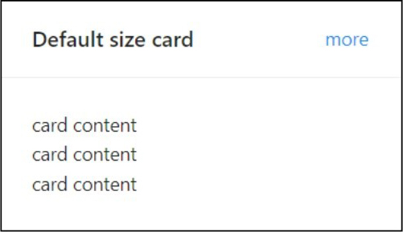

图2-55 卡片

### **2.5**

