## **项目实施**

——Web端“家居”网页交互UI设计

在进行网页交互UI设计之前，首先要确定页面风格，然后根据设计规范及布局理论进行版式设计，同时我们要知道我们要制作的网页包含哪些区域设计。下面以对“家居”网页高保真原型的UI设计为例进行讲解。

### **2.5.1**

### **设计“家居”首页**

网站的首页统览网站的主要内容，并提供通往各个页面的链接，下面以“家居”首页为例对页面进行分析与设计。

#### **1.确定页面风格**

网页设计越来越趋向简约自然的设计风格，去除繁杂装饰。简约的网页设计风格主要围绕两个点：一个是视觉上看起来简单自然，另一个是优化功能的体现。

本着统一配色的设计规范，在配色上采用橙、灰、白为主色调，为了更简单明了地突出主体，提供更舒适的体验，我们对“家居”首页采用全屏网页设计，利用精心挑选的背景和合理的页面布局，增强视觉冲击力，从而吸引浏览者的注意。通常页面内的文字内容不会特别多，少量文字加上以图片展示为主的合理排版将会变得更加吸引人，如图2-56所示。

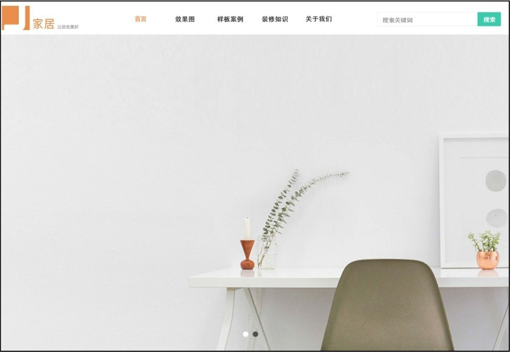

图2-56 页面风格

#### **2.确定网页类型**

对于Web端“家居”网页，我们将其定位为企业品牌类网页，以展示为主，体现企业品牌理念，对创意、美工、内容的组织策划等的要求较高；利用多媒体交互技术、视频、动态网页技术等，达到营销传播的目的。

#### **3.版式设计类型**

版式上，我们采用综合型布局，比较灵活。首先将网页整体横向分割为三部分，类似三字型版式，可以让浏览者快速找到目标，如图2-57所示。

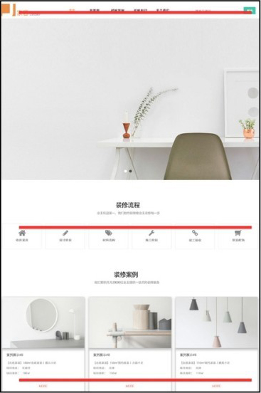

图2-57 三字型版式设计

同时，在Banner处，我们设计为满屏展示，类似海报型版式设计。很多企业官网都采用这种布局类型，给人简单、大气的感觉。

#### **4.设计规范**

● 网页尺寸上，根据百度流量研究院的统计，我们采用主流的显示分辨率1920px×1080px的尺寸进行页面设计，便于适配及通用。

● 文字参考网页文字规范，标题字号采用16～20px，突出标题内容，14px作为正文字号大小，12px作为非突出性文字和用户注释等内容字号大小；字体颜色采用易读的深灰色，色值在#333333到#666666之间；行间距采用字号大小的1.5～2倍，如图2-58和图2-59所示。

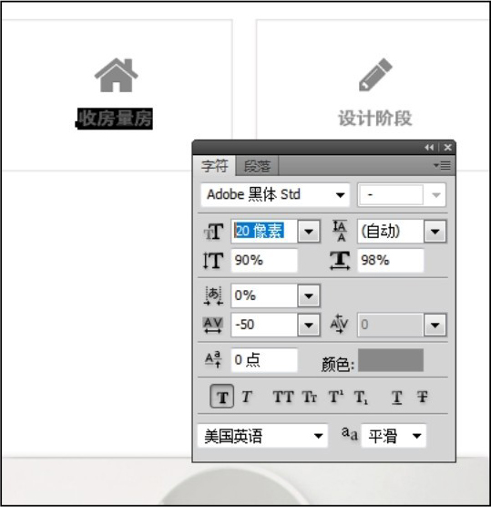

▲图2-58 标题字号

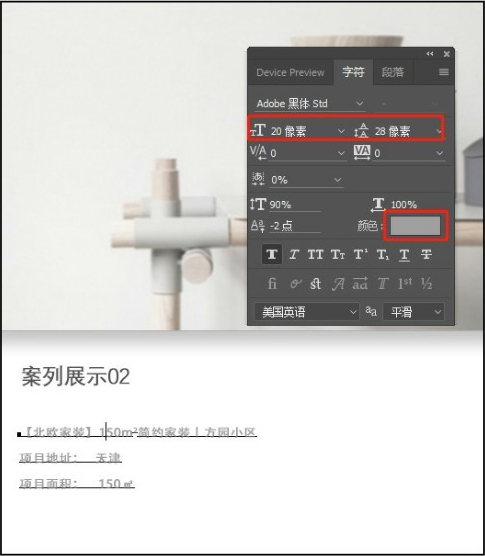

图2-59 正文字号及行间距

#### **5.布局设计**

（1）首页设计包括的内容区域

● 页头部分：客户企业的Logo和标语；主要告诉用户这是什么网站，它是做什么的。

● 品牌理念：最有价值的位置之一是靠近Logo的地方，当我们看到一个和客户企业的Logo相关联的短语时，就知道这是口号，然后我们会把它当作整个网站的描述；口号是一条精练的语句。

● 主页：网站提供的服务的概貌，既要包括内容，也就是能在这里找到什么；也要包括功能，即该网站能做什么。

● 搜索：大多数网站需要在主页上设置一个突出显示的搜索框，它是一个站内给用户直接到达目的地的通道，起到引导用户的作用，如图2-60所示。

图2-60 页头及搜索区域

● 主体：内容区域，是展示部分的主体，以展示为主，如图2-61所示。

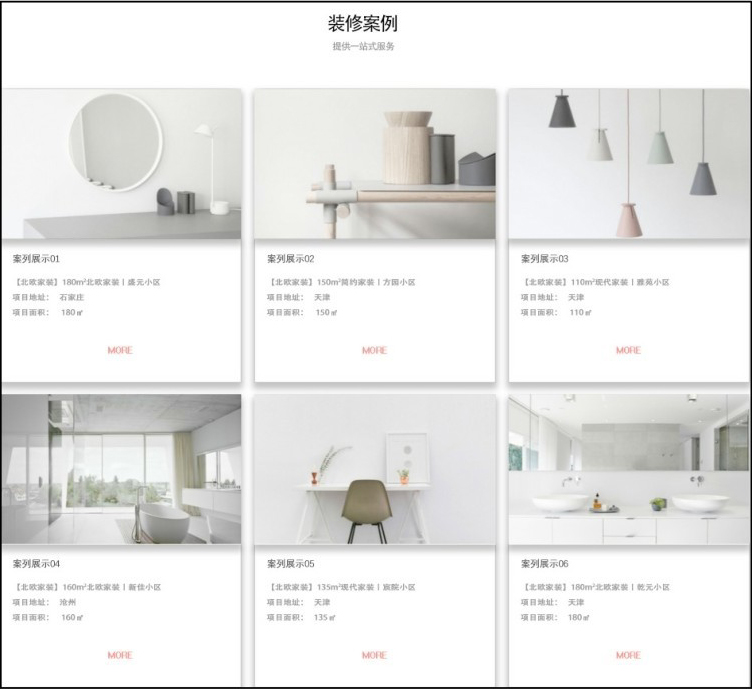

图2-61 页面主体区域

● 页脚部分：这部分包含一些版权信息、友情链接、联系方式、备案信息等；通常页头和页脚是整个网站通用的部分，如图2-62所示。

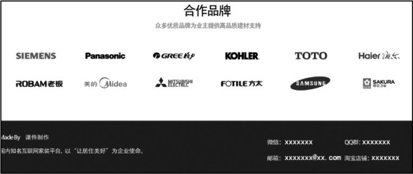

图2-62 页脚

（2）搭建栅格系统

首先，确定屏幕尺寸，确定安全范围。当我们开始着手设计页面时，首先应考虑在多大的范围内做设计，也就是确定栅格区域的宽度，我们采用主流分辨率设定界面的宽度为1920px，以布局“全屏”为例进行设计。栅格区域的宽度=响应式区域-页边距×2，由于我们采用全屏设计，所以，栅格区域的宽度=响应式区域，如图2-63所示。

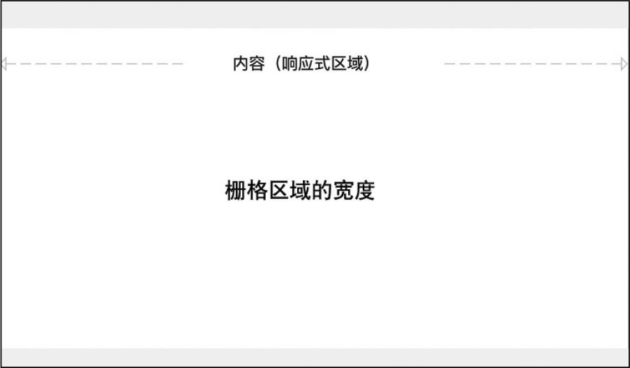

图2-63 确定栅格区域的宽度

其次，确定关键数据，也就是列的数量和栏的宽度。栅格系统通常被划分为12栅格或24栅格。划分的格子越多，承载的内容越精细，但也容易显得琐碎。一些商业网站、门户网站通常将栅格系统划分成12栅格，我们以12栅格为例进行页面设计。根据内容区域宽度为*W*（weight）、列宽为*C*（column）、列数为*n*、槽为定宽*G*，可以得出*W*=*C*×*n*的计算公式；由于槽不可以放置内容，可以得出*W*=*C*×*n*-*G*的计算公式；以屏宽1920px的项目划分栅格，满屏设计内容区域宽度为1920px,12列栅格，槽为定值24px，那么可以得出列宽为160（即1920÷12）px、栏为136（即160-24）px，根据场景将栅格区域划分成三等份，如图2-64所示。

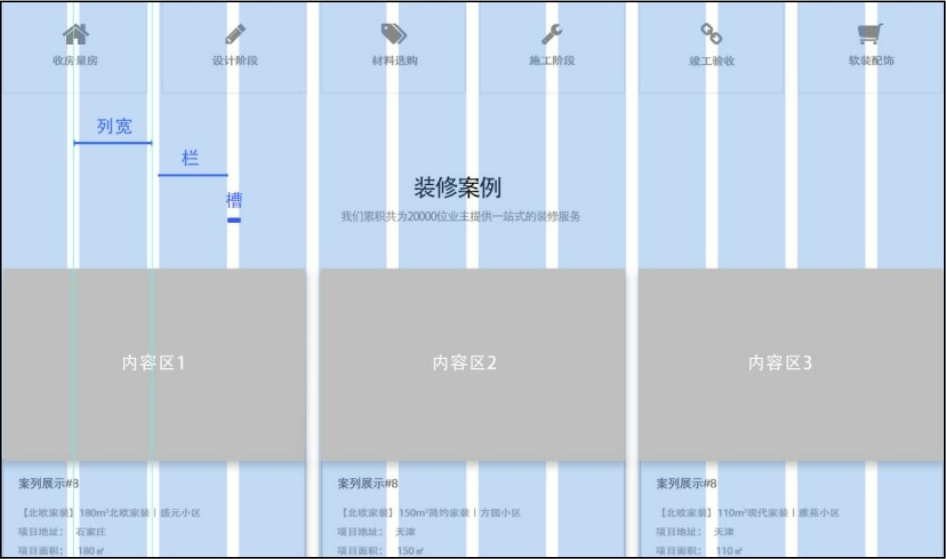

图2-64 确定列的数量和栏的宽度

这样，一个基本的网页栅格系统就搭建完成了。

（3）布局设计——相似性原则

布局依据格式塔原理的相似性原则设计，即内容相似的归为一组，使不具有相似特征的元素更像一个整体，如图2-65所示。

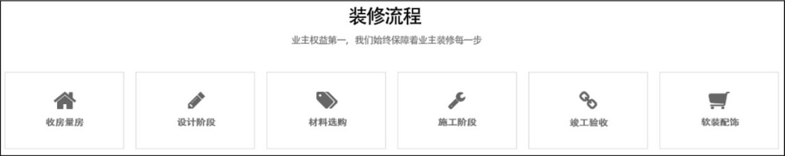

图2-65 布局设计——相似性原则

（4）布局设计——对称性原则

无论距离远近，对称元素都会被认为属于一体，给人一种坚固和有序的感觉，我们的眼睛会寻求这些属性，因此对称对快速有效地传递信息非常有用。对称性原则通常用于产品展示、列表、导航、Banner和任何内容丰富的页面中，如图2-66所示。

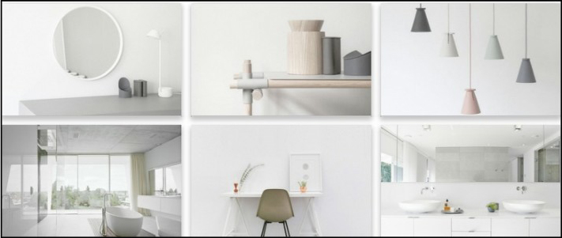

图2-66 布局设计——对称性原则

以上，应用我们所讲的设计规范、布局设计理论，以及搭建的栅格系统，就完成了Web端“家居”首页的设计工作。

### **2.5.2**

### **设计“家居”网页交互UI导航菜单组件**

导航菜单组件中，通常导航位于页面顶部或者侧边区域；轮播图片上边或下边的一排水平导航按钮，起着链接网站内的各个页面的作用。此外，其中还包含用户登录、注册、个人中心等信息。

我们先新建一个图层组，命名为导航或nav，然后确定首个文字在页面中的位置，字号按照网页文字设计规范，正文或一级标题字号为14px～16px，颜色不要用纯黑，颜色亮度为40%，然后等间距输入后面的导航菜单文字，如图2-67所示。

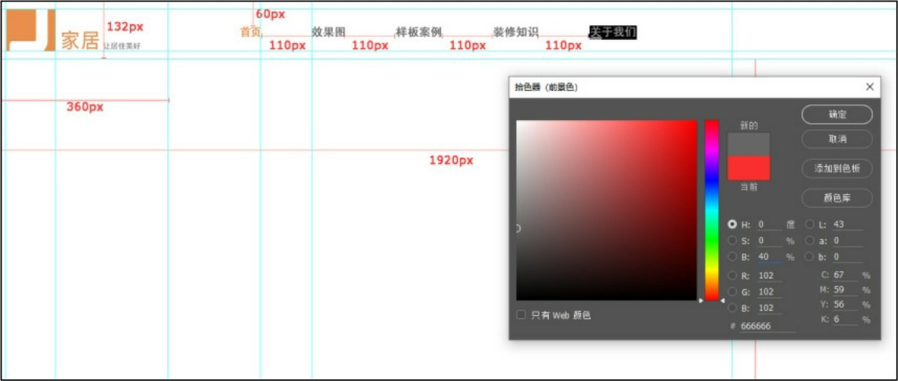

图2-67 导航菜单文字

接下来我们制作搜索栏，同样在参考图中用选区的方法确定搜索栏长宽比、位置等信息，然后在新建的画布中使用工具栏中的矩形工具进行绘制，如图2-68所示。

设置矩形宽380px，高56px，无填充，描边1px，倒角5px，如图2-69所示。

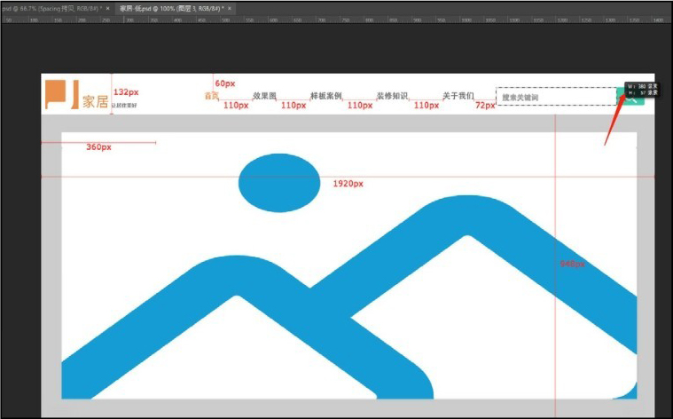

▲图2-68 搜索栏制作

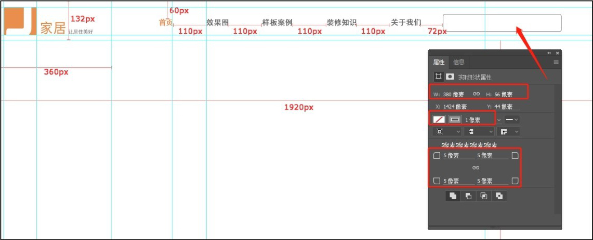

图2-69 绘制矩形框

置入搜索框里的“搜索图标”，将其放到合适的位置，如图2-70所示。

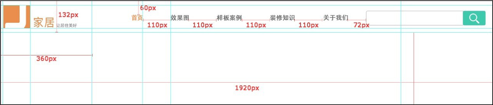

图2-70 置入“搜索图标”

这样就完成了导航菜单组件的制作，如图2-71所示。

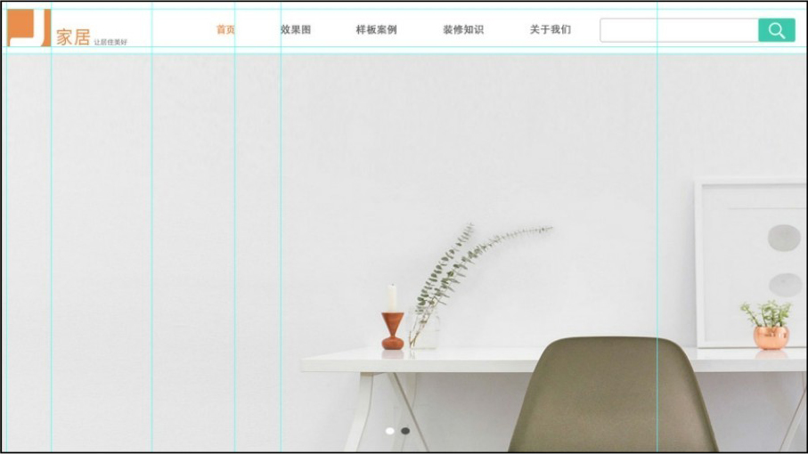

图2-71 导航菜单组件

制作好的页面如何与原型设计工具进行衔接？这就需要我们对设计完成的页面进行切图、标注和存储操作。

首先，我们对制作好的首页进行切图，文字及矩形框等是不需要进行切图的，图片、Logo以及图标需要进行切图。我们如果使用手动切图的方法，当页面需要的切图量很大时，效率比较低，时间成本高。

我们可使用Cutterman插件进行切图，单击“窗口\>扩展功能\>Cutterman”，打开“Cutterman-切图神器”面板，选中要切图的层，设定输出文件夹后，选择“Web\>PNG8”，单击“导出选中图层”按钮就可以一键输出切好的图，如图2-72所示。

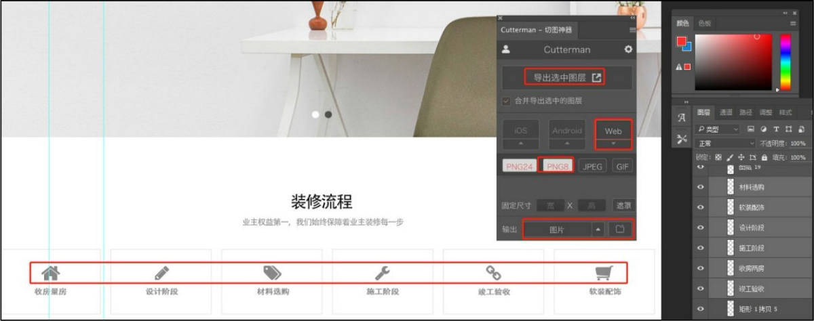

图2-72 “Cutterman-切图神器”面板

依次将需要的Logo、图标、图片等元素，使用插件导出到设置好的输出文件夹就可以了，如图2-73所示。

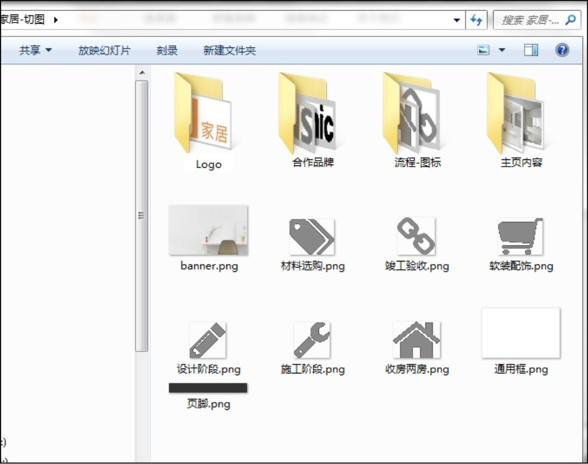

图2-73 输出文件夹

但对于有些图片，如导出的文件信息比较多，我们可以使用“文件”菜单中的“存储为Web所用格式”命令进行优化。我们可以设置存储格式为JPEG或PNG，对颜色数、图像大小等进行优化，在不失真的情况下，选择最佳设置方案，设置后单击“存储”按钮，如图2-74所示。

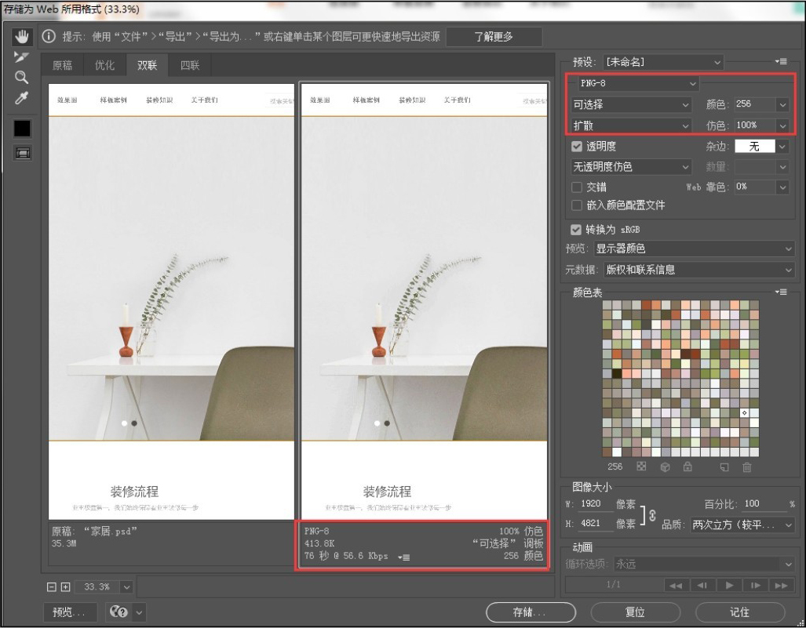

图2-74 使用“存储为Web所用格式”命令优化图片

对文字、矩形框等没有切图的图层元素进行标注，如字号、字间距、字体颜色，以及矩形框的透明度、倒角数值等信息，为后续的原型工具设计提供参考，如图2-75所示。

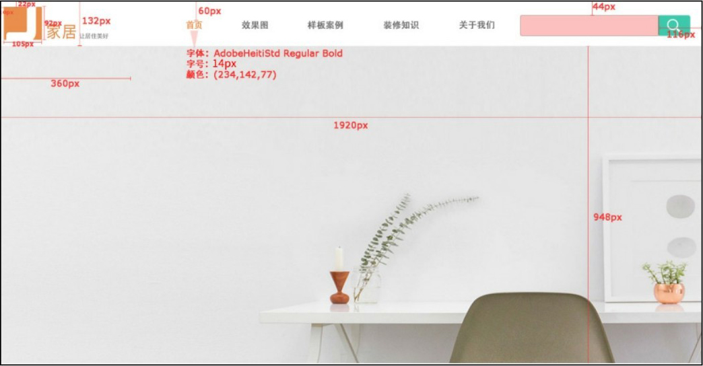

图2-75 标注

## **2.6**

## **项目小结**

通过本项目，我们对网页布局设计理论有了一定的掌握，这些理论是从用户的行为逻辑中总结出来的，掌握这些设计理论能让我们迅速有效地完成网页交互设计，我们可以依据这些理论和相关的设计规范，按照功能需求直接调用规范中的标准交互组件。

同时，可以通过常见的网页UI设计类型及应用场景分析，给我们的产品做一个定位，便于我们在进行Web端交互UI设计时有个明确的方向，包括会采用哪些元素、设计风格等，为我们后面做网页交互原型设计做一个铺垫。

## **2.7**

## **素养拓展小课堂**

交互设计同样要秉承与时俱进、尊重科学的精神，在高校领域，尤其是对于艺术类院校学生而言，知识与技术、艺术并存，要注重个性化的培养，对创新意识和创造能力的训练更是不容忽视的一个环节。将格式塔原理引入本次项目设计，目的是希望界面交互设计向理性化发展，在设计时要遵照人类的认知规律，并将这些规律正确地应用到设计实践中。

## **2.8**

## **巩固与拓展**

前面我们讲到了网页交互设计组件的作用、区别和应用场景，这对后续进行网页原型交互设计有着很重要的作用，请你思考一下UI设计组件的分类以及几种提示组件的区别。另外，请你从日常使用的网页中寻找、收集常用的UI设计组件及样式，针对用途尝试分析它们属于哪一类交互设计组件，这有助于强化我们对交互设计组件的理解和实践应用。

## **2.9**

## **习题**

### **一、单选题**

1.以下选项中，不属于国字型布局特点的是（ ）。

A.页面容纳内容多

B.信息量大

C.左侧会固定

D.常用于首页设计

2.现今主流的网页尺寸为（ ）。

A.1366px×768px

B.1600px×900px

C.1920px×1080px

D.1280px×720px

### **二、多选题**

1.格式塔原理包括的内容有（ ）。

A.接近性原理

B.相似性原理

C.连续性原理

D.封闭性原理

2.以下选项中，属于页面布局的基本理论有（ ）。

A.栅格系统

B.希克定律

C.菲茨定律

D.奥卡姆剃刀定律

### **三、操作题**

根据界面设计规范及常用组件，设计购物类网页的界面，界面数量不少于5个。

