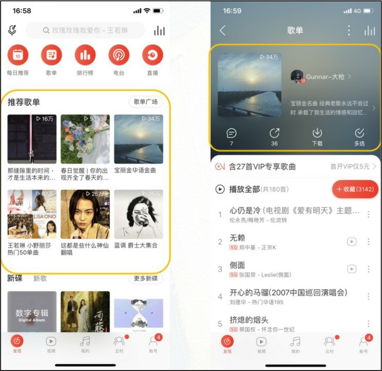
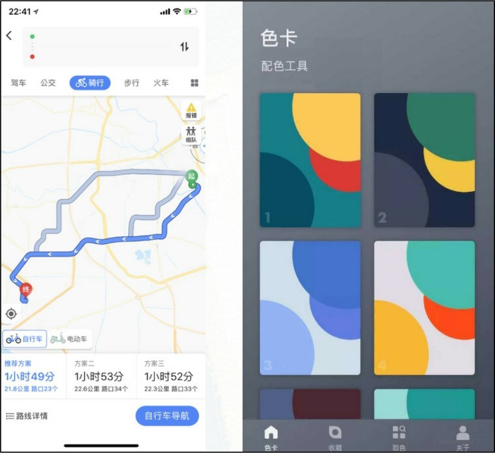
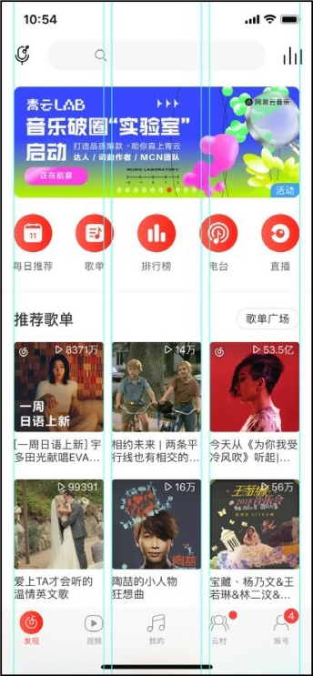
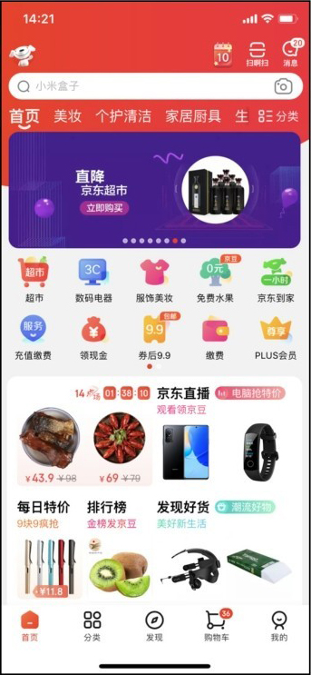
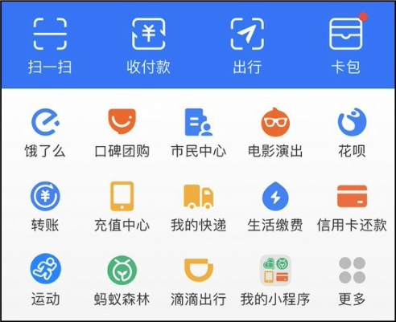
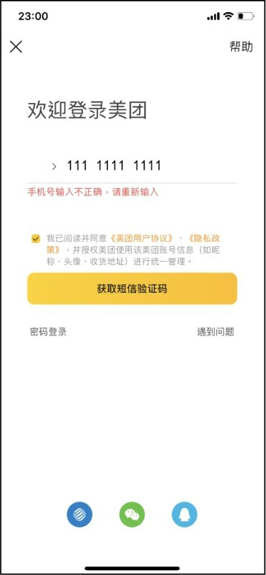
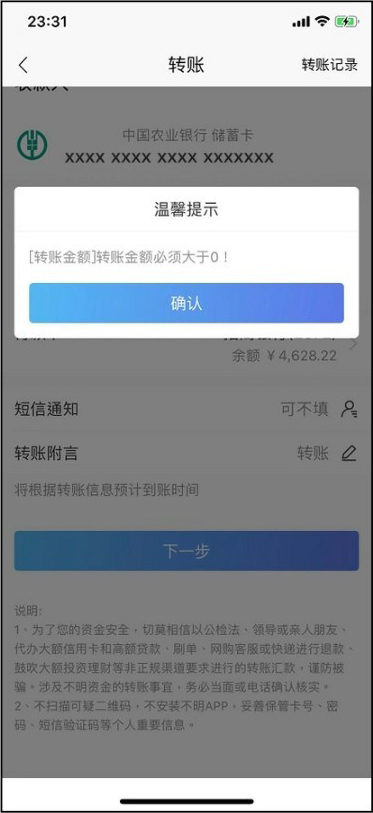
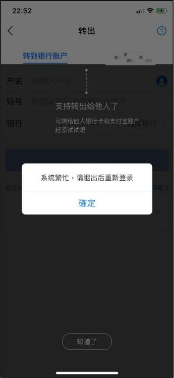

## **视觉层次结构与视觉引导**

视觉层次结构也是内容的构成布局，合理的布局便于更有效地传达信息。合理的布局依据重要性排列设计元素，可以将用户首先引导到最重要的信息处，然后引导到次要的内容处。

### **3.3.1**

### **视觉层次结构的构建**

用户对视觉元素的理解都是基于构图中的其他元素和项目背景的。设计人员应对界面中的构成元素进行相应处理，形成视觉关系，从而在整个设计中建立视觉层次。

视觉层次结构的基础主要通过视觉语言的基本元素，如尺寸、颜色、字体、布局等来构成，具体内容如下。

（1）尺寸和比例

对一些重要的内容进行放大显示，通过放大主体内容或者标题来突出视觉层次关系，从而突出主要内容，如图3-1所示。

▲图3-1 尺寸大小和比例

▼微课视频

视觉层次结构的创建

（2）颜色

人们对每种色彩的认知是不一样的，鲜艳的颜色更容易吸引人们的注意力。通常在UI设计中，蓝色文字代表可点击，红色代表出错或警示；浅色就没有那么强的吸引力（如图中的灰色和淡黄色等），如图3-2所示。

图3-2 颜色

（3）字体

使用字体的大小粗细来创建视觉层次结构，这样信息结构会更加清晰。在设计时运用不同的字体形成强烈的视觉层次，可以使更重要的文字信息突出展示出来，如图3-3所示。

（4）布局

可通过参考线和网格进行布局设计，每组元素都会变得紧密关联。

图3-3 字体

在App界面中，内容都会显示在中间的内容区域里，内容区域与屏幕的左右两端之间的空间称为外边距，如图3-4所示。外边距越大，页面显得越宽松，外边距越小，页面显得越饱满，因此我们需要根据实际的情况去确定具体数值，如图3-5所示。

（5）分组、对齐

分组和对齐页面元素在一定程度上可以引导视觉，可以运用格式塔原理中的相似性、接近性、连续性、封闭性原理进行布局，如图3-6所示。

▲图3-4 外边距1

▲图3-5 外边距2

图3-6 分组、对齐

### **3.3.2**

### **视觉引导和反馈**

在快节奏的生活方式下，用户通常以扫描的方式快速获取界面的信息，那么我们需要知道，如何让我们的App更加高效、快速地帮助用户轻松地浏览到所需要的信息。使用移动端设备大多数是在碎片时间，所以要让用户更高效、便捷地扫描到要浏览的内容，就需要进行视觉引导和反馈。

#### **1.视觉引导**

我们在App产品中会看到各种样式的图标，有些图标与内容比较贴合，标识引导性强，同时也让内容显得严谨、专业，如图3-7所示。这就是视觉引导。

在颜色的构成、元素的形状、丰富的程度等细节方面遵循一致性原则，可以使图标显得更加专业，如图3-8所示。这也是一种视觉引导。

▲图3-7 视觉引导

图3-8 图标一致性

#### **2.反馈**

我们在App中进行各种操作时，会遇到不同的反馈，如等待加载、信息确认、错误提示等。反馈设计的目的是让用户知道操作的结果是什么，将要发生什么。反馈设计可以分为以下几个步骤来完成。

首先，确定恰当的模式。

从交互类型来看，可以把反馈分为两种类型，一种是非模态反馈，另一种是模态反馈。

非模态反馈是将反馈以干扰度最小的方式传达给用户，如图3-9所示；模态反馈则是强调反馈信息的重要性，一般带有可操作的选项，如图3-10所示。这两种类型最大的差别在于“反馈是否会中断当前的操作流程”。

▲图3-9 非模态反馈

图3-10 模态反馈

其次，设计清晰的内容。

从认知方式出发，反馈设计要遵循人的认知心理过程，反馈的内容也要符合用户的认知。反馈内容的呈现可以通过视觉暗示，如图3-11所示；也可以为异常流程提供解决方法来优化反馈设计，如图3-12所示。

▲图3-11 视觉暗示

图3-12 提供解决方法

最后，反馈响应要及时告知用户。

反馈响应要及时告知用户主要指反馈信息的及时性，很大程度影响着反馈设计的体验度。App要让用户明白现在发生什么、未来结果可能会如何发展，应该在当前页及时地给予用户提醒，如图3-13所示。

图3-13 反馈及时告知用户

反馈设计需要遵循以下一些设计原则。

● 反馈响应及时，即反馈结果要及时告知用户，为用户在各个阶段提供必要、积极、即时的反馈。

● 避免过度反馈，以免给用户带来不必要的打扰。除了考虑根据不同场景选择不同的反馈模式之外，采用的反馈模式应尽可能将对用户当前操作的打扰程度降到最低。

● 反馈模式合理，为不同类型的反馈做差异化设计，虽然我们在设计反馈时会考虑避免打扰用户，但在对应的场景应选择最合理的反馈模式。

● 所提供的反馈要能让用户用最便捷的方式完成选择。

● 避免遮挡用户可能会去查看或操作的对象。

### **3.4**

