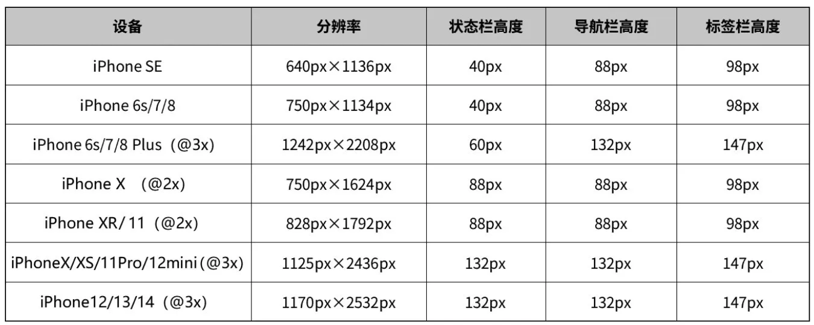
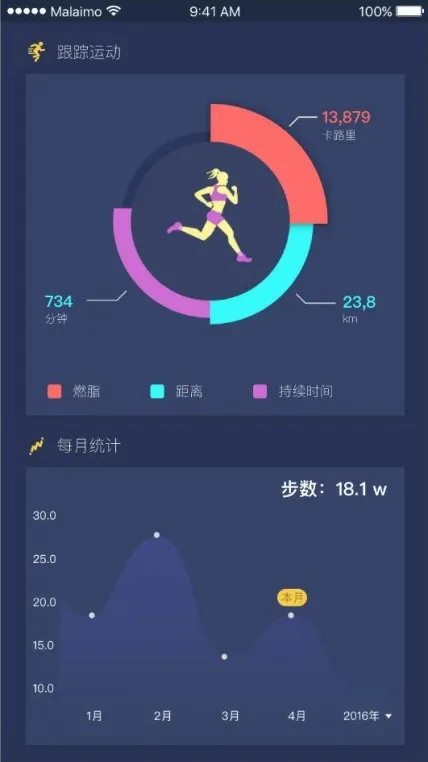
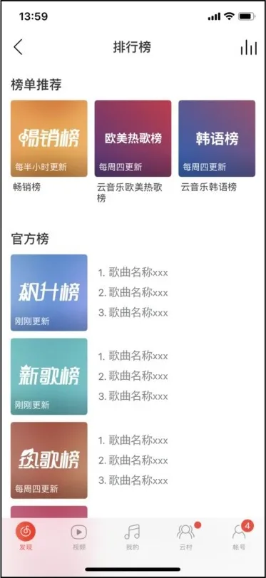
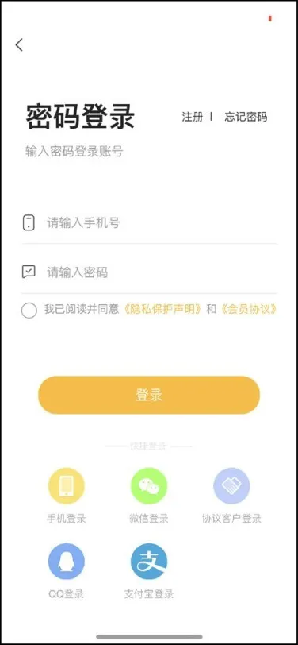

## **App界面元素构成设计**

App界面元素构成设计的一个要点是选择正确的界面元素。

界面元素既要能帮助用户完成操作反馈的任务，还要容易被理解和使用；某个功能要在某个或某些界面上完成，这些在交互设计中就已经决定了；而这些功能在界面上如何被用户认知到，就属于UI交互设计的范畴。

设计复杂系统的界面首先要面临的一个挑战，就是弄清楚用户不需要知道哪些内容，并且减少它们的可发现性。

我们可以采用一些技巧，使用户完成目标的过程变得容易些。比如，当我们把界面第一次呈现给用户的时候，应仔细考虑每一个选项的默认值，如图3-14和图3-15所示。

▲图3-14 提升用户体验感1

图3-15 提升用户体验感2

一个设计良好的界面要组织好用户最常采用的行为，同时让这些界面元素以最容易的方式被获取和使用。

### **3.4.1**

### **App界面的构成**

App界面包括启动页、引导页、登录注册页、首页等界面。

#### **1.启动页**

启动页是启动App时的初始界面，一般由Logo、Slogan（口号）、版本号、产品名、公司名、版权信息等组合而成，出现时长一般在3秒内，如图3-16和图3-17所示。

▲图3-16 启动页1

▲图3-17 启动页2

▼微课视频

### App界面的构成

#### **2.引导页**

引导页一般起产品的功能性引导作用，使用户能快速了解产品特性；界面数通常为1～5个，3个最为常见；内容由主题、图/文简介、页面指示器、跳过按钮等构成，如图3-18和图3-19所示。

设计时需要注意的是文字信息不宜过多，主题内容要突出，图片要符合品牌调性的同时数量也不宜太多。

▲图3-18 引导页1

图3-19 引导页2

#### **3.登录注册页**

登录注册方式一般有以下几种。

● 第三方账号登录，用户不需要注册账号，直接用第三方账号登录，流程简单。

● 手机号注册，一般会结合密码或是动态验证码。

● 邮箱注册，这种方式较早，设计之初是在网页版注册时使用。

#### **4.首页**

App首页通常由以下几个标准的信息区域构成。

● 公共导航区：包括导航栏、状态栏，它是对软件操作进行宏观操控的区域。

● 状态栏：也叫状态指示器。在iOS 7以后，苹果系统开始慢慢弱化状态栏的存在，将状态栏和导航栏组合在了一起其他系统也是类似的。

通常导航栏高度为88～132px，分别对应iPhone SE～ iPhone 14的尺寸（部分设备），iOS严格规定了标准信息区域的高度，所我们也需要严格遵守，如图3-20所示。

图3-20 iOS界面信息区域高度

● 主菜单栏：也叫标签栏，承载的内容包括软件Logo、软件版本、信息框架，以及相关图文信息等。

● 底部标签栏：具有很强的包容性，可以形成最基本的信息框架，然后用其他的导航模式来承载具体的功能和内容；展现形式有文字+图标、纯图标，常用的是文字+图标的形式，可以减小用户记忆负担，如图3-21所示。

● 功能操作区：也叫内容区域，它是软件的核心部分，也是版面中占用面积最大的部分，如图3-22所示。

注意：iPhone X及之后版本的底部要预留68px的主页指示器的位置。

▲图3-21 底部标签栏

▲图3-22 功能操作区

▼微课视频

### App界面元素的设计

### **3.4.2**

### **App界面元素的设计**

App界面元素的设计主要从显著性元素、视觉和心理需求，以及用户的定势和期望这几方面来进行考量。

（1）显著性元素

显著性元素主要分为感觉和认知两大类。

感觉类元素主要体现在颜色、位置、大小等物理特征上，而认知类元素则反映物体与人的关系，如图3-23和图3-24所示。

▲图3-23 感觉类元素

图3-24 认知类元素

合理地运用这些元素可以有效地引起浏览者的注意，形成和谐统一的界面，但要注意采用的元素不要过多，否则会给用户造成视觉上的负担。

（2）视觉和心理需求

我们的大脑中枢在处理看见的内容时，会根据自己的兴趣对视觉刺激强的事物首先分配注意力，这就要求我们在设计App界面时要同时考虑用户的视觉需求和心理需求，随着界面的即时性来改变设计。

在设计界面时，为了减轻用户的认知负荷，获得良好的用户体验，在信息的布局上要构建科学合理、舒适愉悦的视线流与操作流。

视线流是用户视觉焦点在界面上的运动轨迹，操作流是用户在操作界面形成的触点移动轨迹。人的视线习惯是从上到下、从左到右，且水平运动快于垂直运动，所以界面中左上象限比其他象限更容易获得注意，如F形布局、Z形布局的形式更符合我们的视线习惯，如图3-25和图3-26所示。

▲图3-25 F形布局

图3-26 Z形布局

（3）用户的定势和期望

定势指的是某种活动前的心理预备状态，期望是指对某个事物发展的预设。

在交互设计中，用户更期待高效操作和降低认知负荷，当用户对界面中某个元素不能产生定势和预期，就会给用户认知造成不利影响，也容易诱发视觉盲区。

