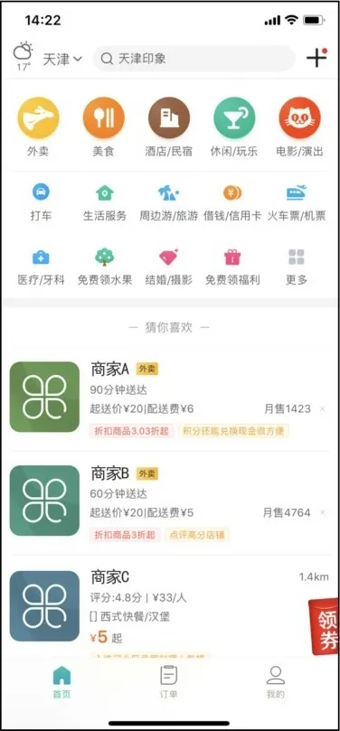
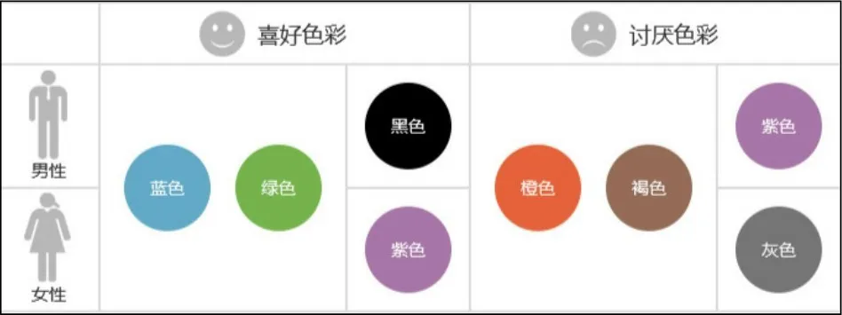
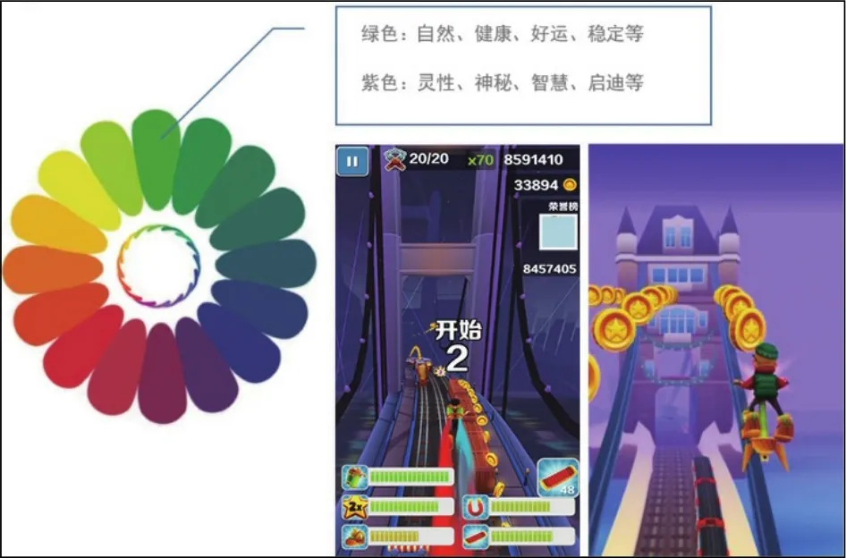

## App界面设计风格

② 现在主流的设计风格是扁平化设计，它的优点如下。

● 界面美观、简约大方、条理清晰。

● 设计元素上强调抽象、极简、符号化，去除冗余的装饰效果，突显App的文字图片等信息内容。

● 完美兼容PC网站、Android、iOS等不同系统的平台和不同屏幕分辨率的设备，适应性强，如图3-29和图3-30所示。

▲图3-29 扁平化设计风格1

图3-30 扁平化设计风格2

③ 在设计风格表现上，颜色占据用户大部分的视觉体验。

要做好设计风格，首先要做好界面的颜色搭配和分布，如图3-31所示。

图3-31 男性/女性的喜好色彩/讨厌色彩

设计风格的配色除了要注意男性/女性的喜好差别之外，还应该重视通过冷暖色彩加明暗度的搭配方式传递给用户的印象和心理感受，如图3-32所示。

图3-32 冷暖色彩加明暗度的搭配方式

### **3.6**

