## **移动端平台的界面设计规范**

iOS和Android系统占据当今智能移动终端的主流市场，因此我们进行交互设计时，需要考虑二者不同的设计规范，以满足不同操作系统用户的使用需求。

### **3.6.1**

### **Android平台**

Android是一个开源的系统，国内外有很多的手机厂商，这就导致有非常多的Android手机品牌，如国内的小米、OPPO、vivo、魅族等。

#### **1.基本概念**

每英寸点数（Dots Per Inch,DPI）：表示屏幕密度，是测量空间点密度的单位，最初应用于打印技术中，表示每英寸能打印上的墨滴数量。

后来DPI的概念也被应用到了计算机屏幕上，计算机屏幕一般采用PPI（Pixels Per Inch）来表示一英寸屏幕上显示的像素点的数量。

屏幕密度计算公式如图3-33所示。

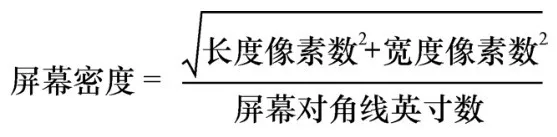

图3-33 屏幕密度计算公式

屏幕分辨率为1080px×1920px设备的屏幕密度的计算方法如图3-34所示。

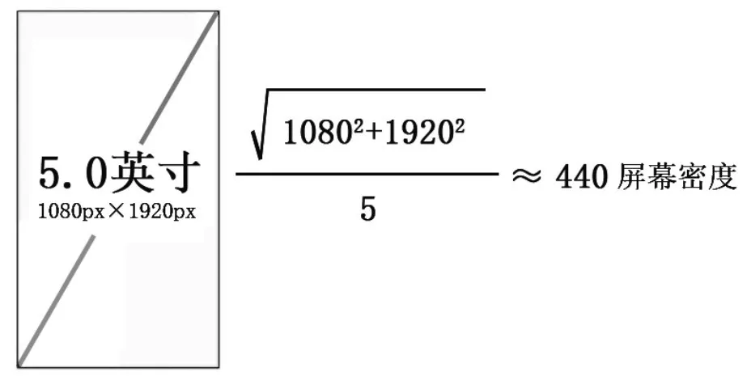

图3-34 Android屏幕密度的计算方法

#### **2.屏幕密度划分**

Android硬件设备尺寸多且不统一，这就给界面适配带来了很大的工作量。为了解决这个问题，Android手机屏幕有自己初始的固定密度，界面根据这些屏幕不同的密度会自行适配，这涉及设计稿的尺寸和切图的相关内容，这点我们同时需要掌握，为后面的设计工作打下基础。以下是Android的密度划分以及代表的分辨率，如图3-35所示。

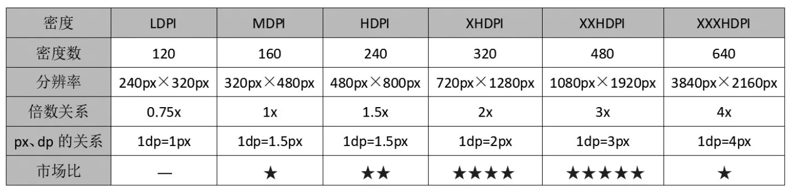

图3-35 Android密度划分

#### **3.界面设计尺寸及控件尺寸**

（1）界面设计尺寸

根据目前市场占比大的主流设备尺寸，建议使用1080px×1920px来做Android设计稿尺寸，如图3-36所示。

以1080px×1920px作为设计稿标准尺寸的理由如下。

● 从中间尺寸向上和向下适配的时候界面调整的幅度最小，最方便适配。

● 大屏幕时代依然以小尺寸作为设计尺寸，会限制设计师的设计视角。

● 用主流尺寸来做设计稿尺寸，极大地提高了视觉还原和其他机型适配的能力。

（2）控件尺寸

我们以主流设备的尺寸来看，界面中各控件的尺寸设计如图3-37所示。

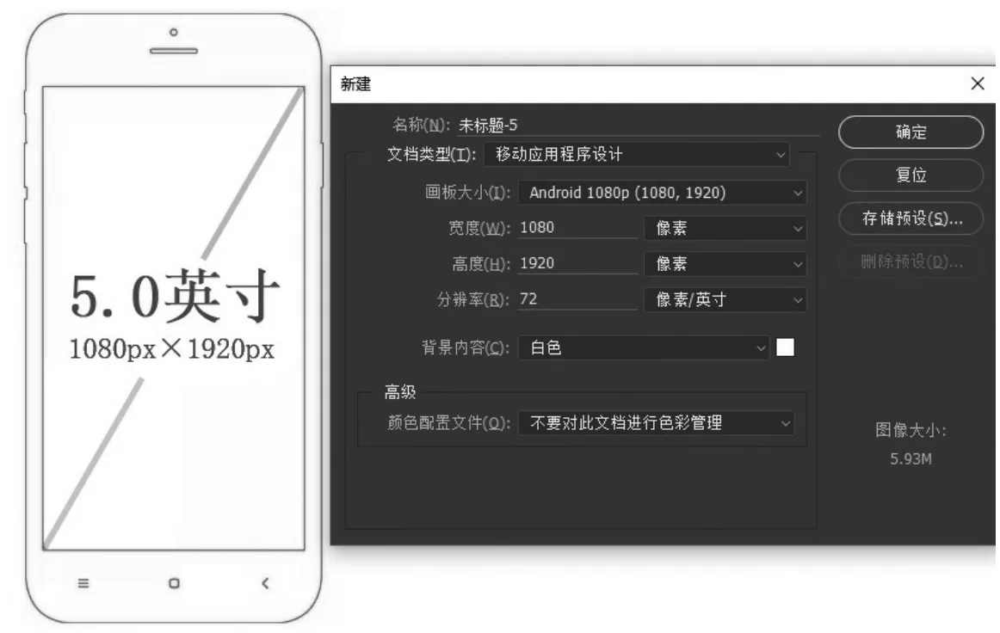

▲图3-36 设计稿尺寸

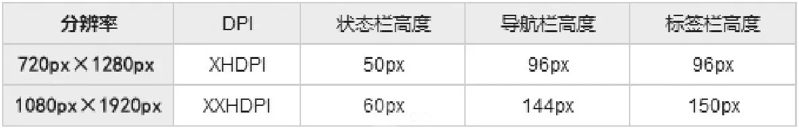

图3-37 界面中各控件的尺寸设计

#### **4.图标规范**

对于分辨率众多的Android设备，为了方便界面适配，Google公司按照DPI大小将它们分成了4种模式（MDPI、HDPI、XHDPI和XXHDPI），如图3-38所示。

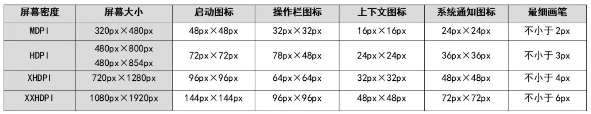

图3-38 图标规范

#### **5.字体规范**

在Android平台中使用的英文字体为Roboto字体，中文字体为思源黑体；在Android 5.0之后，使用的是思源黑体，如图3-39所示。字体文件有两个名称，即“Source Han Sans”和“Noto Sans CJK”。

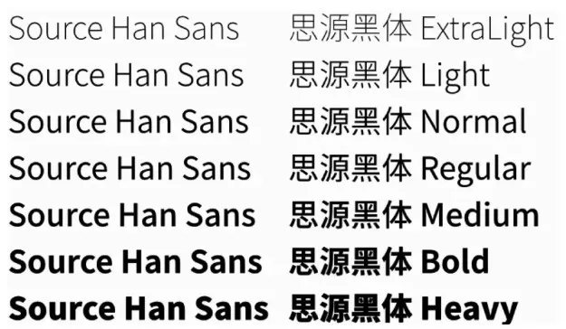

图3-39 思源黑体字重展示

### **3.6.2**

#### **iOS平台**

iOS平台在界面设计中制定了常用的一些尺寸规范和方法，如界面布局尺寸、间距、文字、图标、适配等，设计师在设计时要严格遵守，并融会贯通。

#### **1.基本概念**

● 物理分辨率：屏幕的实际分辨率，例如iPhone 6/7/8的750px×1334px、iPhone 6/7/8 plus的1242px×2208px。

● 逻辑分辨率：物理分辨率是硬件所支持的，逻辑分辨率是软件可以达到的像素，例如iPhone 6/7/8的375pt×667pt、iPhone 6/7/8 plus的414pt×736pt等，如图3-40所示。

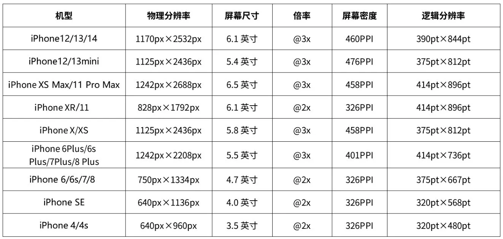

图3-40 物理分辨率与逻辑分辨率

● 单位pt:iOS开发单位，即point，绝对长度，1pt=1/72英寸，pt = px×72 / DPI。

在视网膜屏出现之前，苹果规定1px=1pt，也就是说pt和像素点是一一对应的。但随着iPhone 4型号出现以后，高分屏也就是视网膜屏出现了，这个时候1pt对应2px。所以用固定长度pt作为开发单位，这样做的优势是在同一种类不同型号设备上的图形大小可以得到统一。而如果用像素作为单位的话，就会出现混乱，因为在不同像素密度的屏幕里，像素本身大小是不一样的。

如果界面设计师提供的是2倍图，要先转成逻辑像素，即px/2，然后算出的pt就是逻辑像素下的字号大小。

Photoshop默认的分辨率是72DPI，如图3-41所示。也就是说，通常界面设计师提供的设计图，如果字体大小单位是px,2倍图，则iOS中的字号pt = px / 2。

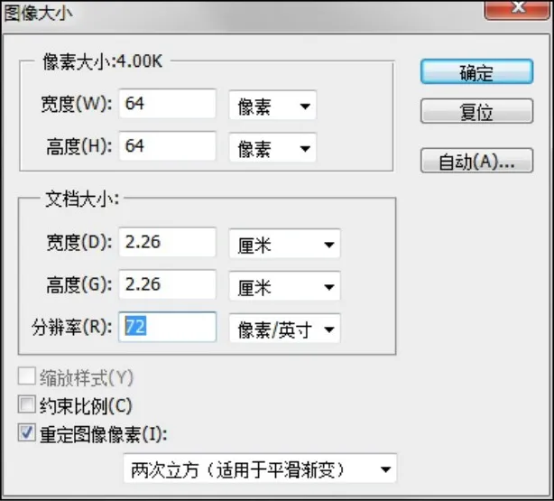

图3-41 Photoshop中的DPI

需要注意的一点是，我们需要确认界面设计师提供的设计图的DPI，再进行转换。

#### **2.栏高度**

iOS应用中的界面包括状态栏、标签栏、导航栏等，iOS严格规定了各个栏的高度，我们需要严格遵守，如图3-42和图3-43所示。

#### **3.标准色规范**

字体的颜色设置很少用纯黑色，一般用深灰色和浅灰色、粗体和细体来区分重要信息和次要信息，从而进行信息层级的划分。

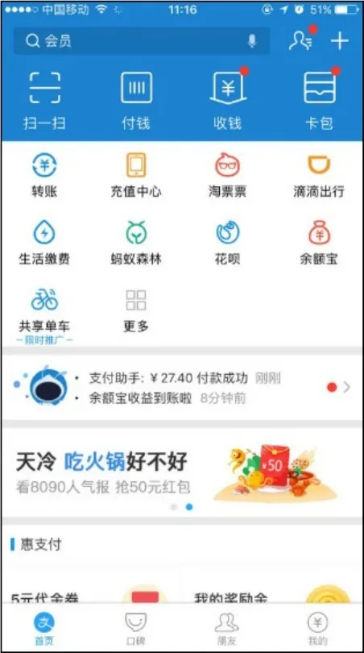

▲图3-42 界面布局

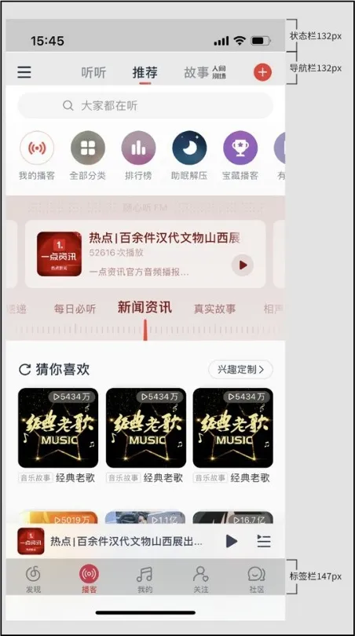

图3-43 栏高度

标准色规范分为重要、一般、较弱，如图3-44所示。

● 重要：重要颜色一般不超过3种，红色需要小面积使用，用于特别需要强调和突出的文字、按钮和图标；而黑色用于重要级信息，如标题、正文等。

● 一般：都是相近的颜色，而且要比重要颜色弱，普遍用于普通级信息、引导词，如提示性文案。

● 较弱：普遍用于背景色和不需要突出的边角信息。

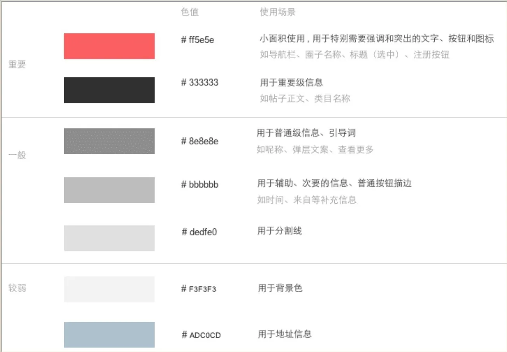

图3-44 标准色规范

#### **4.文字规范**

App内的文字大小设置与所在界面、所在层级、所表达内容密切相关；App中字号范围一般为20px～36px（@2x），所有的字号设置都必须为偶数，上下级内容字号的极差关系为2px～4px。

百度公司曾经做过一项调查，关于App字体大小的调查结果如图3-45所示。

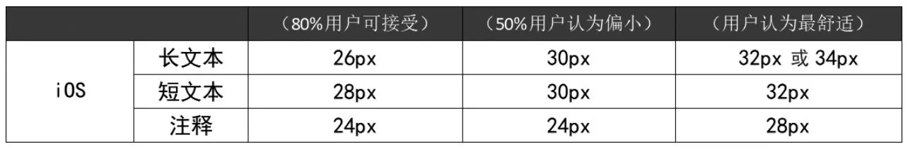

图3-45 iOS中App字号调查结果

（1）标准字规范

这里主要规范标准字的大小，标准字要注意与上面讲的标准色进行组合，从而突出App重要的信息和弱化次要的信息。

标准字规范分为重要、一般、弱，如图3-46所示。

● 重要：大字号普遍用于大标题、上导航标题，较小字号用在分隔模块的标题上。

● 一般：主要用于大多数文字，如正文。

● 弱：普遍与一般标准色组合，用于辅助性文字，如一些次要的文案说明。

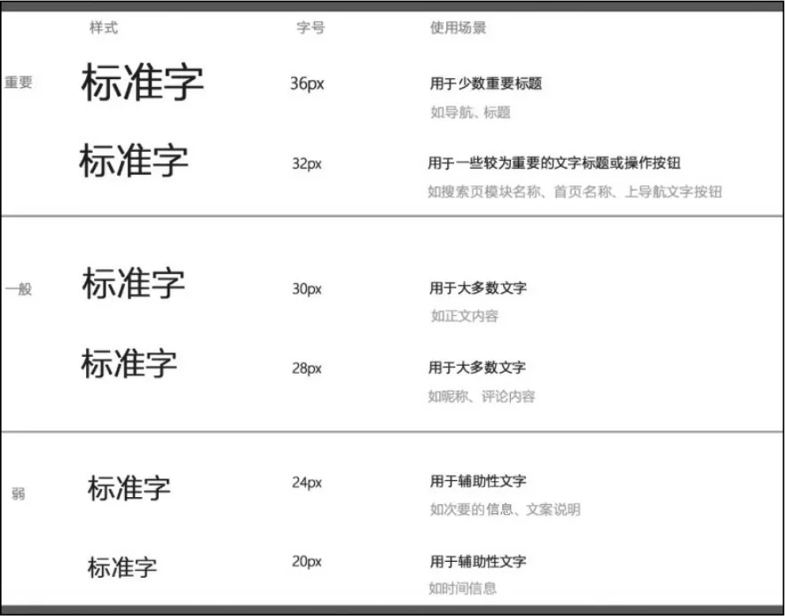

图3-46 标准字规范

不同界面区域中不同功能字体的大小如图3-47所示。

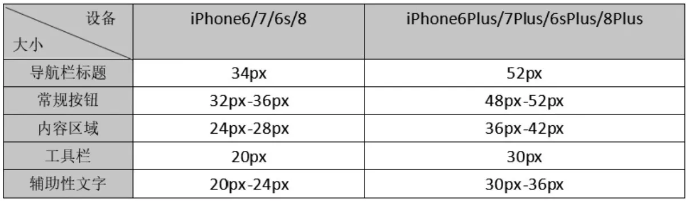

图3-47 不同界面区域中不同功能字体的大小

（2）字体

在iOS中，中文方面默认使用苹方字体，如图3-48所示。该字体字形纤细、中宫饱满，利于阅读。iOS还提供了6个字重供设计开发者使用，所以后面的设计趋势中，字重的使用开始变得多元化起来，使用semibold中粗体、大字号作为界面的标题变得更为流行起来。

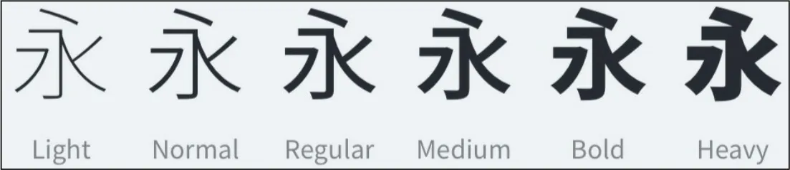

图3-48 苹方字体

而在英文方面，iOS使用San Francisco字体。

#### **5.图标规范**

在Photoshop中绘制App界面设计里的图标时应尽可能用形状来绘制，这样可以保证图标和按钮是矢量图，切图的时候的格式都是PNG；同时图标和按钮的尺寸必须为偶数。

● 图标还应该根据不同的功能需求设计成不同的状态，如常态、选中态、点击态等，如图3-49所示。

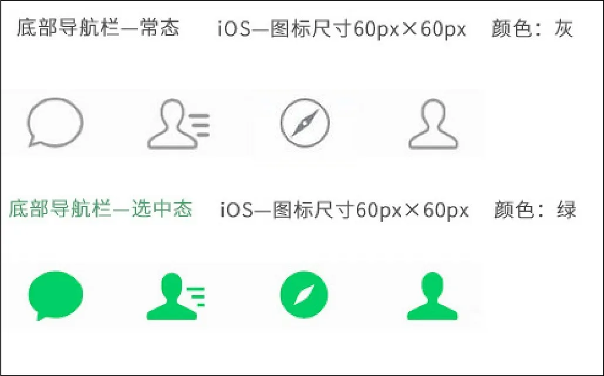

图3-49 图标常态及选中态

● 导航栏与工具栏图标的标准大小都是24pt×24pt，最大不超过28pt×28pt，如图3-50所示。

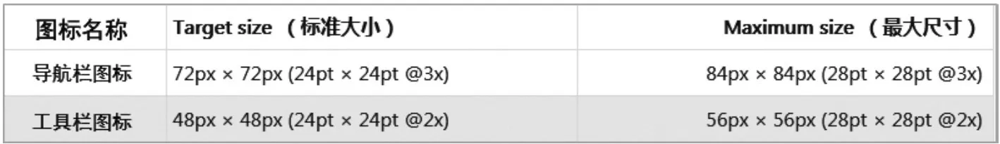

图3-50 导航栏与工具栏图标的尺寸

● 标签栏图标的尺寸如图3-51所示。

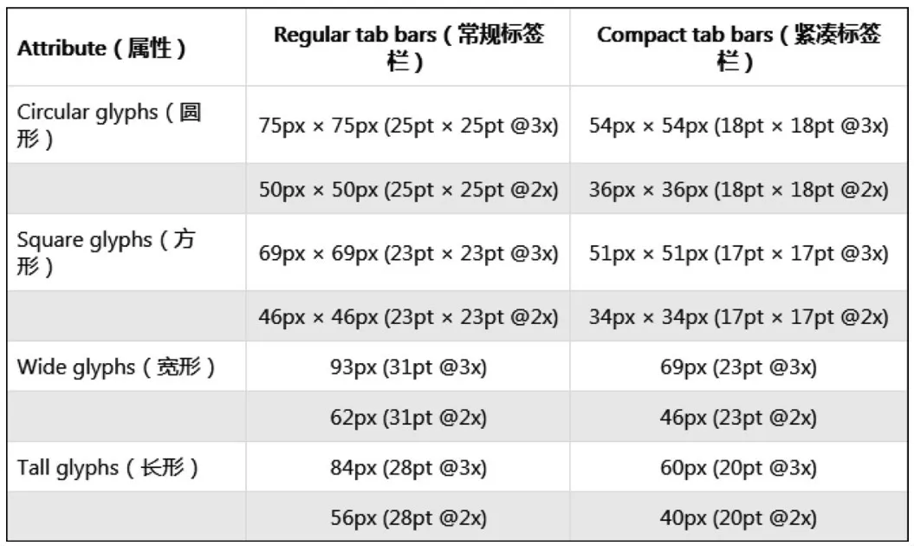

图3-51 标签栏图标的尺寸

### **3.7**

