## **App交互UI设计流程分析**

在进行UI设计时，除了要考虑界面层次结构的构建、确定界面的构成及设计风格，还要考虑版式设计的布局。当界面设计完成后，为了便于和原型交互设计师进行衔接，同时为了原型交互设计师可以高度还原UI设计稿，还需要平面设计师对UI进行切图、标注以及元素的优化存储操作。

### **3.7.1**

#### **版式设计**

版式设计也叫版面编辑，也就是在有限的版面空间里，将版面的构成要素，如文字、图片、控件等元素根据特定的内容进行组合排列，设计时要考虑内容布局、图片比例、对齐、对称、分组等。

微课视频

#### 版式设计

#### **1.内容布局**

内容的布局形式有很多种，我们介绍最常用的两种布局形式。

（1）列表式布局

列表式布局能够在较小的屏幕中显示多条信息，用户可以通过上下滑动来获得大量的信息，如图3-52所示。

（2）卡片式布局

卡片式布局中每张卡片的内容和形式都可以相互独立，互不干扰，所以可以在同一个界面中出现不同的卡片来承载不同的内容，如图3-53所示。

#### **2.图片比例**

在UI设计中，图片的比例没有严格的规范，我们可以运用科学的手段设置图片的尺寸，以获得最优的方案。常见的图片比例有16︰9、4︰3、2︰1等，如图3-54和图3-55所示。

#### **3.对齐**

对齐是贯穿版式设计的最基础、最重要的原则之一，它能建立起一种整齐划一的外观，给用户带来有序一致的浏览体验，如图3-56所示。

#### **4.对称**

对称是设计中非常常见的一种形式，能给人平衡感和稳定感，同时能展现完整性、专业性和一致性，如图3-57所示。

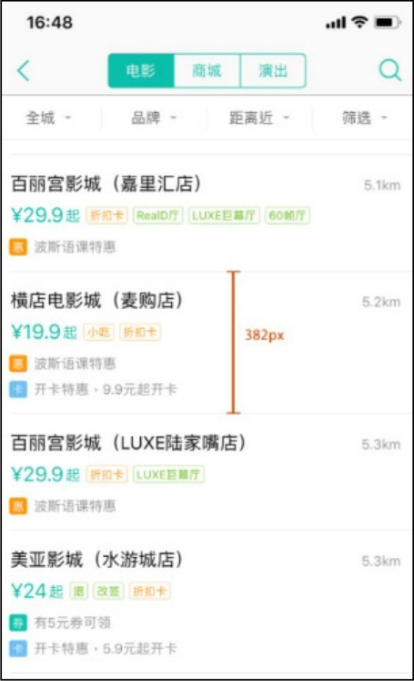

▲图3-52 列表式布局

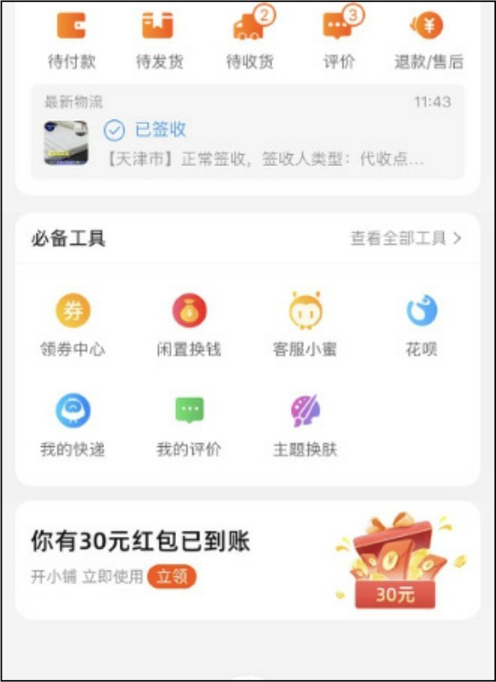

▲图3-53 卡片式布局

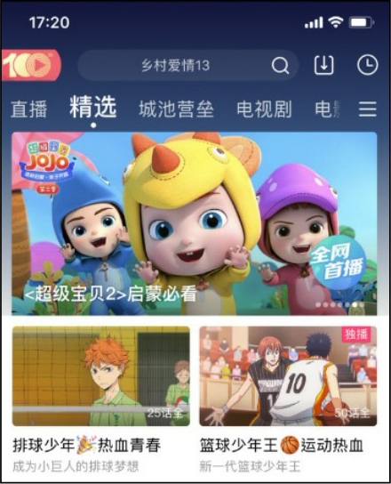

▲图3-54 比例2︰1

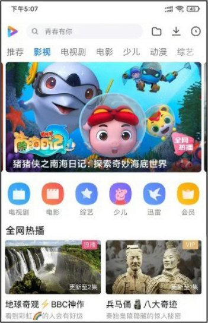

▲图3-55 比例16︰9

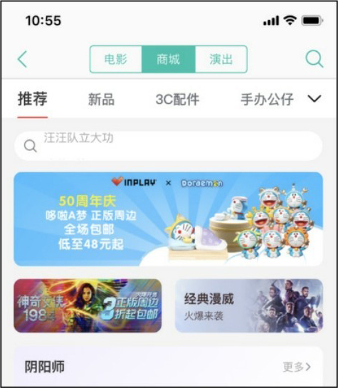

▲图3-56 对齐

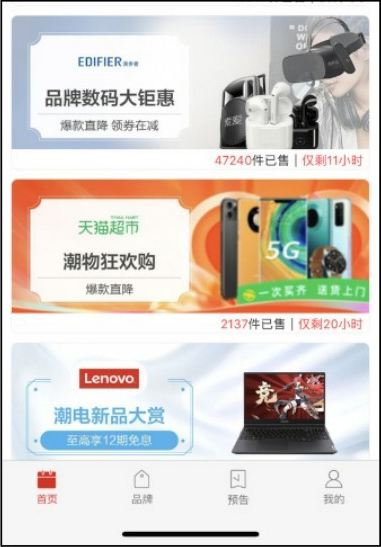

图3-57 对称

#### **5.分组**

分组是将同类别的信息组合在一起，直观地呈现给用户，这样的设计能够减小用户的认知负担。在移动端界面的设计中最常见的分组方式就是卡片，如图3-58和图3-59所示。

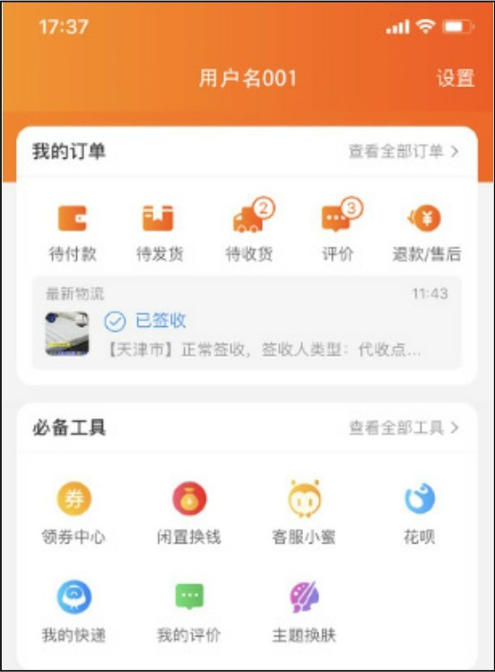

▲图3-58 分组1

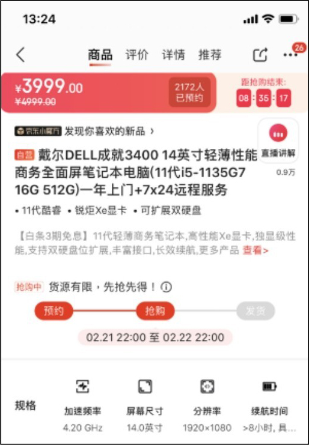

图3-59 分组2

### **3.7.2**

### **切图的重要性**

设计切图输出的目的是与前端的工程师团队协同工作。那么在团队协作过程中，首先应该保证切图输出能够满足工程师设计效果图的高保真还原需求。

其次，切图输出应该尽可能减少工程师的开发工作量，避免因切图输出错误而导致不必要的工作。

最后，输出的切图应当尽可能地压缩大小，以降低App或Web端网页的总大小，提升用户使用时的加载速度。切图输出应当做到切图精准，便于团队协同工作。

### **3.7.3**

### **界面标注的注意事项**

界面标注的作用是给开发工程师提供参考，因此在标注之前需要和原型开发工程师进行沟通，了解他们的工作方式，从而更快捷、高效地完成工作，并最大限度地还原平面设计稿。

标注注意事项如下。

● 合理划分，界面再复杂，信息也不要挤在一起，如图3-60所示。

● 标注之间也要注意对齐方式，干净整洁的标注能让开发人员一眼找到所需要的目标，如图3-61所示。

● 任何细节和要求都要写清楚，要做到有据可查。

需要标注的内容整理如下，如图3-62所示。

① 文字：字体、大小、字体颜色。

② 图标：大小、区域。

③ 列表：列表高度、颜色、列表内容的上下间距。

④ 布局控件属性：控件宽高、填充颜色、圆角大小。

⑤ 间距：控件之间的距离、左右边距。

⑥ 段落文字：字体大小、字体颜色、行距。

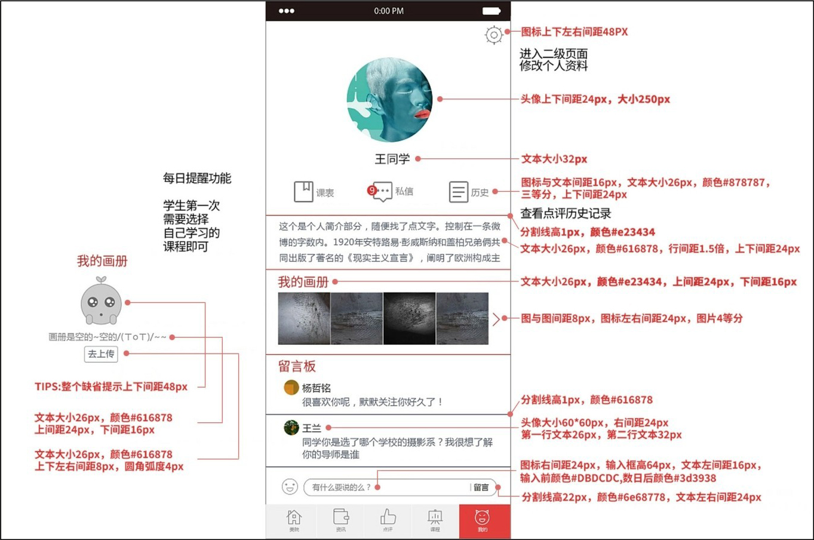

▲图3-60 标注注意事项

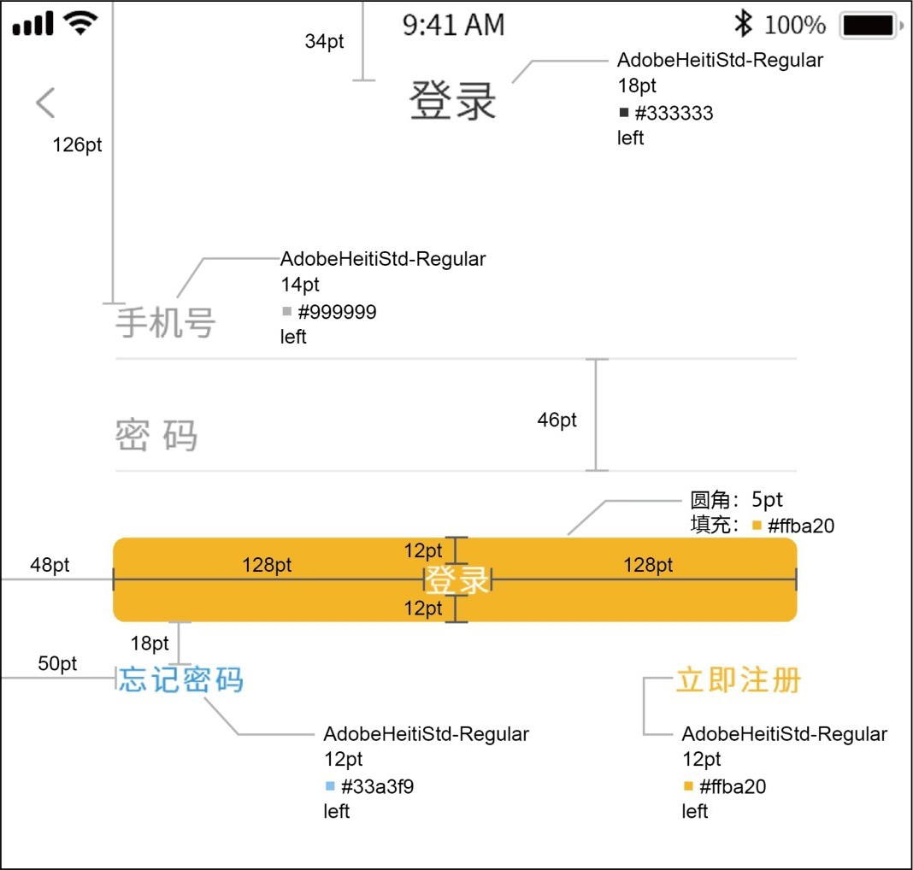

▲图3-61 标注示例1

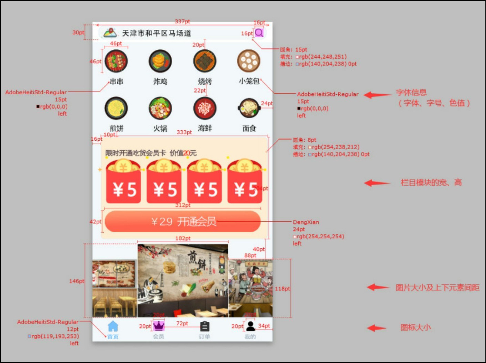

图3-62 标注示例2

### **3.7.4**

### **动态元素的优化存储设置**

在App交互设计中需要加入一些动画，那就需要掌握好技巧，才能够让做出来的动画元素贴合App的风格，看起来更美观。一般App交互动态元素设计需要掌握以下要点。

（1）告知用户正在运行

用户想知道在每一步中发生了什么，如果超过3秒没有反馈，用户在不确定性等待中极易关闭应用。

（2）告知用户进度

通常只是让用户知道程序正在运行是不够的，用户还要能够看到载入速度和加载时长，进度条的作用得以突显，如图3-63所示。

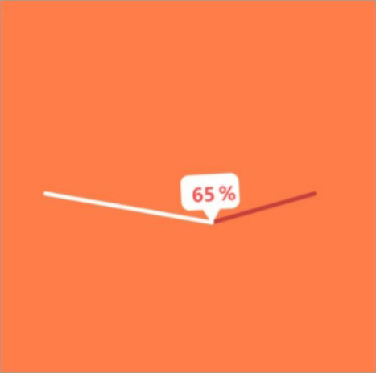

图3-63 告知用户当前的载入进度

（3）不要提供多余、无效的内容

用户在观看动态图的时候，很容易被过多的内容分散注意力，尤其是设计师想要借助动态图来传达特定的引导时，多余的色彩和内容很容易弱化重点。

（4）在动态图中建立一致的视觉

在设计的时候使用品牌的配色来对动态图进行设计，将品牌的形象、Logo和其他元素在gif图中呈现，可以让品牌、企业和产品以更加富有活力的方式呈现出来，而用户则能够将这些元素与品牌本身产生关联。

（5）颜色越少越好

颜色越少不仅可使最终文件越小，而且单位体积内可容纳的动画越多，这样既可以做出足够长的动画，又可以把文件控制在很小的范围，如图3-64所示。

（6）gif图要尽可能小

不同平台的图片规格不同，使用场景也不同，因此，gif图需要足够小才能兼容不同的需求。缩小gif图的方法：精简动画特效、减少颜色值、丢掉重复帧等。

（7）在上传动态图的时候，保持良好的可访问性

尽量兼顾到用户群体的需求，文字内容尽量放在动态图之外单独显示，并且避免频繁的闪烁效果，如图3-65所示。避免动态图自动播放，这样可以让用户感到可控，并且可以节省流量。

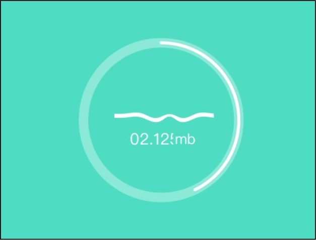

▲图3-64 尽量少的颜色

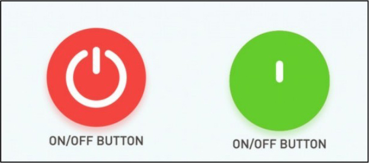

图3-65 避免频繁的闪烁效果

### **3.8**

