## **项目实施**

——移动端“美食小吃”App交互UI设计

下面从界面UI设计、如何进行界面适配使界面匹配不同设备，以及界面的切图和标注方面，对项目案例进行详细讲解。

### **3.8.1**

### **设计“美食小吃”App界面UI**

在设计“美食小吃”App之前，我们需要思考界面如何设计才能留住用户。首先，方便快捷的操作界面是重要基础，如何能够让用户快速了解到自己需要的信息十分重要；其次，精致美观的界面设计必不可少，要最大程度地呈现食物的美味。

我们先来了解一下主流外卖App饿了么、美团外卖的首页，如图3-66所示。

在产品功能类似的情况下，用户体验能最大程度地影响用户的忠诚度。因为它们是主流的外卖App产品，在产品的易用性和基本用户体验上很值得我们学习。优秀的交互设计，不能只注重产品的易用性，在设计用户行为、帮助用户完成目标的同时，还应该给用户带来愉快、有意义的体验。

对于一款美食小吃类App产品，用户行为应该是这样的，浏览美食→确认下单→等待送达（催单、退单）→订单送达（评价），这为我们界面的构成提供了设计的基础。下面进行App的UI设计。

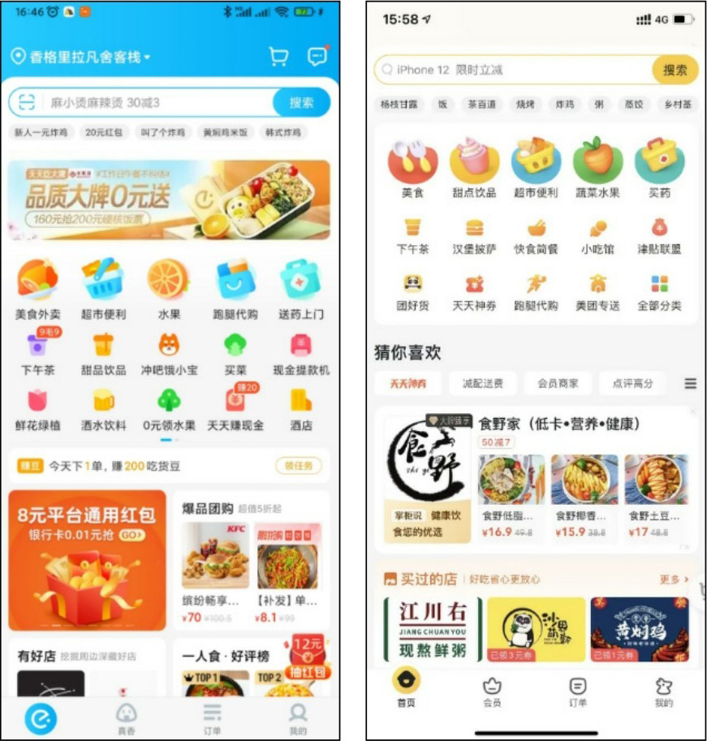

图3-66 主流外卖App首页

#### **1.确定界面风格**

在进行App界面设计时，首先要做的是确定界面的风格，通过颜色和布局的搭配给用户呈现整体的视觉感受。我们采用现在主流的扁平化设计风格，优点是可以兼容不同系统平台和不同分辨率、设计元素极简、突出图文信息等。

颜色上以红色、黄色、白色为主，这几种颜色具有动力、刺激、欢庆、幸福等氛围，可以给用户传递购买的欲望，如图3-67所示。

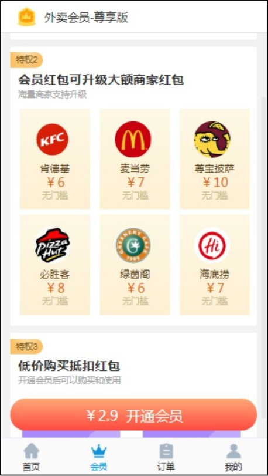

图3-67 界面风格

#### **2.使用设计规范**

正确地使用设计规范可以统一我们的App界面风格，同时减少界面元素的重复设计，控制设计素材的大小。设计规范参考Android、iOS平台的设计规范。

#### **3.确定界面的构成**

确定设计风格及设计规范后，设计师根据风格进行细化设计。根据外卖App的特点，我们设定美食小吃App由引导页、登录页、首页、会员页、订单页、个人中心页等内容构成，如图3-68所示。

① 引导页：进行设计时主要突出美食主题，1～2页即可。

② 登录页：摒弃邮箱注册，采用主流的手机号登录及第三方账号登录，这样可以简化登录流程。

③ 首页：设计几个标准信息区域，包括公共导航区（状态栏、导航栏）、标签栏、内容区域、主页指示器，同时根据平台设计规范设计各栏的高度。

④ 会员页：主要展示优惠、跨店红包领取、开通会员等信息，如图3-69所示。

图3-68 界面构成

⑤ 订单页：展示配送、评价、取消订单等信息，如图3-70所示。

⑥ 我的页面：展示个人信息设置、常用功能分类、购物车、评价等信息，如图3-71所示。

▲图3-69 会员页

▲图3-70 订单页

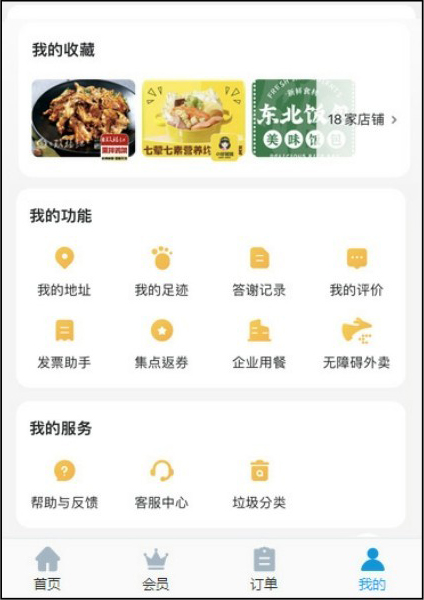

图3-71 个人中心页

#### **4.设计页面层次**

我们通过视觉语言的基本元素——尺寸、颜色、字体、版式、布局来对“美食小吃”App进行视觉层次的设计。

① 从按钮或交互的主题尺寸大小来进行设计，因为移动端App受屏幕大小的限制，如果按钮或可点击区域过小，则不易点击，且层次不突出，所以我们通过放大主体内容或按钮来突出层次关系。尺寸参考前面的Android、iOS平台设计规范。

② 设置字体的粗细和字重，可以使信息结构更清晰，如图3-72所示。为了突出店铺名称，我们增加了字重和字号。具有不同大小和权重的字体也会增加层次结构，使更重要的文字信息突出展示。

③ 布局上，页面侧重表现图片的冲击力，因此页面内容区域的比例比较大，外边距数值设置为48px，通过留白来产生视觉层次关系，给予内容充足的空间，提升整齐度，如图3-73所示。

▲图3-72 设置字体的粗细及字重

图3-73 外边距设置

④ 版式设计上首页采用了卡片式布局，可以在同一页面展示不同内容，内容间相互独立；订单页采用列表式布局，便于在屏幕中展示多条订单信息，可通过上下滑动来进行查看，如图3-74和图3-75所示。

▲图3-74 卡片式布局

图3-75 列表式布局

通过以上流程，我们确定了界面的风格、遵循了相应平台的设计规范、确定了界面的构成，以及完成了页面视觉层次的构建和布局设计，基本完成了“美食小吃”App的设计工作。

### **3.8.2**

### **界面适配**

在浏览App的时候，我们会遇到在部分机型中图片变形、界面不协调、文案被裁剪等问题。这就需要我们进行界面适配操作，适配是为了使界面在不同手机设备上，保持相对统一的展示效果。

在适配界面前，我们先了解什么是@2x、@3x，如图3-76所示。

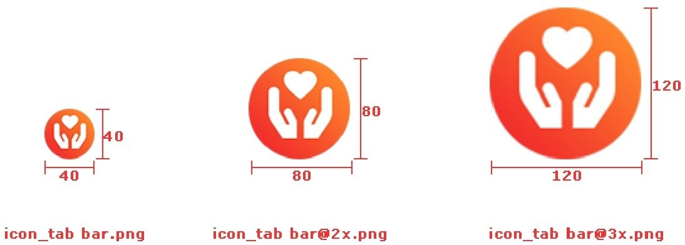

图3-76 @2x、@3x

@2x、@3x可以简单地理解为倍数关系，如果使用750px×1334px（iPhone 6/7/8）尺寸做设计稿（其他尺寸可参见前面的介绍），那么切片输出就是@2x，缩小2倍就是@1x，扩大1.5倍就是@3x，如图3-77所示。

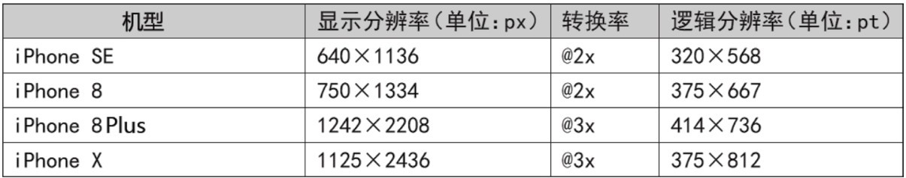

图3-77 iPhone倍数转换

iOS现行主流设备的分辨率分别是750px×1334px（@2x）（iPhone 6s/7/8）、1242px×2208px（@3x）（iPhone 6s/7/8 Plus及以上机型）、1125px×2436px（@3x）/750px×1624px（@2x）（iPhone X）。在设计中，设计师需要设计一套基准设计图来达到适配多个分辨率的目的，我们可以选择中间尺寸750px×1334px作为基准，向下适配640px×1136px，向上适配1242px×2208px和750px×1624px/1125px×2436px，如图3-78所示。

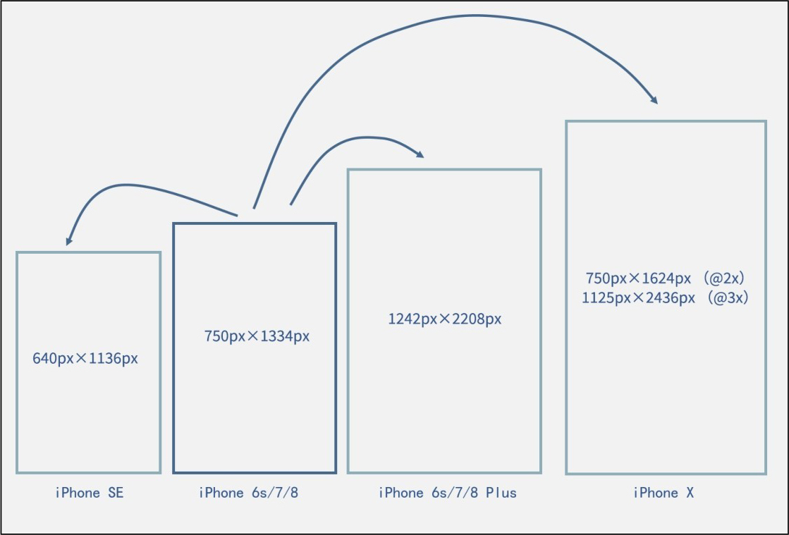

图3-78 基准适配

### **3.8.3**

### **实现美食App界面素材切片输出**

微课视频

#### 切图

当界面设计定稿之后，设计师需要对图标进行切片，将结果提供给原型交互设计师。把设计稿中有用的部分剪切下来作为网页或移动端制作时的素材，这个过程就是切图。

通常我们只需要对图标进行切图，文字、线条和一些标准的几何形状是不需要切图的。例如搜索框，只需要在标注中描述它的尺寸、圆角大小、背景色值、不透明度即可，开发工程师可以用代码实现这种效果，如图3-79和图3-80所示。

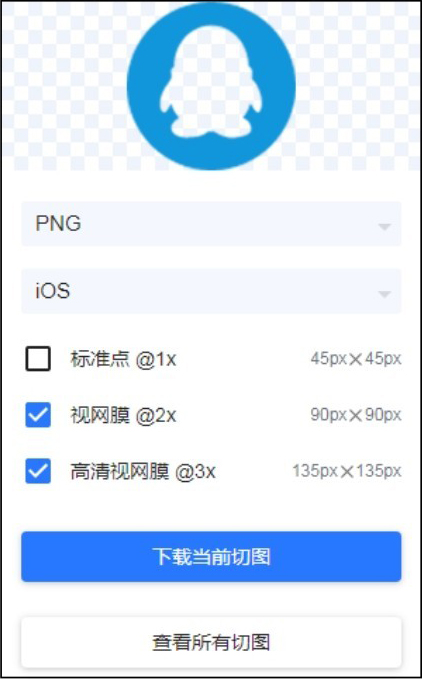

▲图3-79 切图

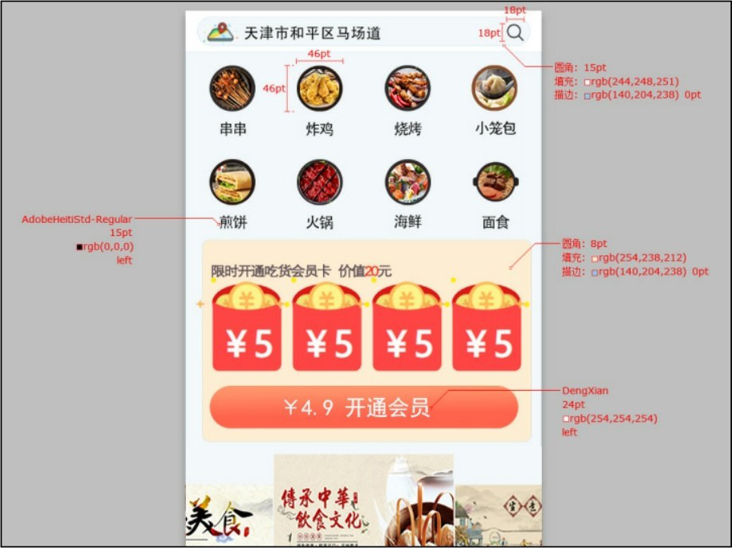

图3-80 标注

切图和标注是为了满足开发人员对效果图的高度还原。最早的切图、标注是设计师手动进行的，花费的时间成本比较大，而且对于开发人员来讲看到的通常是一个标满了尺寸的界面。为了迎合市场的需求，出现了各种切图和标注的软件、插件，想看元素的标注只需单击相应的元素就会自动出现，还会有相应的代码供开发人员参考，极大地节省了程序开发的时间成本，减少了很多不必要的沟通与重复切图、标注等工作。

微课视频

尺寸标注插件

当完成App界面设计后，设计师便可依据切图规范和命名规范对设计稿进行切图工作，在进行切图、标注的时候，设计师需要先确认开发的平台是Android还是iOS。

#### **1.切图规范**

① 切图资源尺寸为双数，这样保证切图资源在工程师开发时是高清显示。因为1px是智能手机能够识别的最小单位，换句话说就是1px不能在智能手机中被分为两份。所以如果是单数切图的话，手机系统就会自动拉伸切图元素，从而导致切图元素边缘模糊，造成开发出来的App界面效果与原设计效果相差甚远，如图3-81所示。

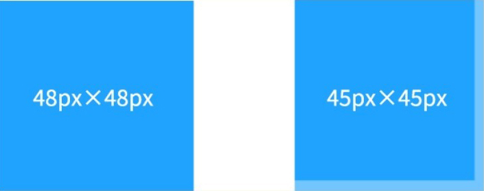

图3-81 切图资源尺寸为双数

② 同一模块内，切图大小应保持一致，如图3-82所示。

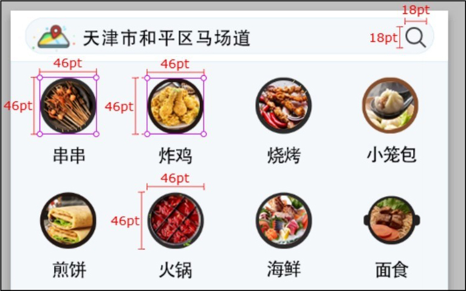

图3-82 切图大小一致

③ 为了提升App使用速度，应尽量降低图片文件大小。在切图资源输出中，图片切图是很重要的部分，如新手引导页、启动页面、默认图、广告图等。图片切图一般情况下文件相对较大，不利于使用过程中的加载，因此图片切图要尽量压缩图片文件的大小。

④ 要把可点击的部件的相关状态都切图输出，如正常状态、点击状态、不可点击状态。

在切图过程中，不仅要输出正常状态的切图，更要注意不要遗漏其他状态的切图。设计师经常会出现这样的失误，如在按钮切图的过程中可能会忽略点击状态的切图。所以设计师在做设计图时，尽量把页面中会出现的各种状态展示出来，避免后期切图的时候遗漏。

⑤ 无须切图的元素

很多元素是不需要切图输出的，直接使用系统原生的设计元素即可。

设计师需要知道哪些元素需要切图，哪些元素使用系统自带的，避免不必要的切图。如文字、卡片背景、线条和一些标准的集合图形是不需要提供切图的。

例如搜索框，只需要在标注中标明尺寸大小、圆角大小、描边粗细、色值即可，开发工程师会根据设计效果通过代码来实现，如图3-83所示。

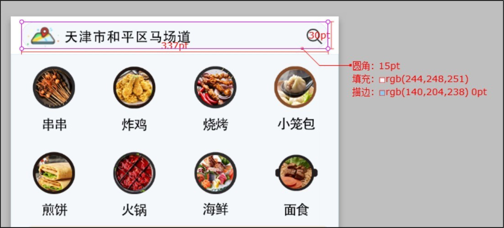

图3-83 搜索框不需要切图

#### **2.切图命名规范**

在工作中对图标的命名规范、有良好习惯是很重要的，便于平面设计师与原型开发人员进行交接，图片的名称中尽量不要有中文、特殊符号以及空格，使用下划线进行连接。

建议切图名称：页面（类别）\_功能_状态.png。

举例：button_search_default@2x.png（对应中文：按钮_搜索_默认@2x.png)。

登录界面的命名如图3-84所示。常用切图命名图表见附录。

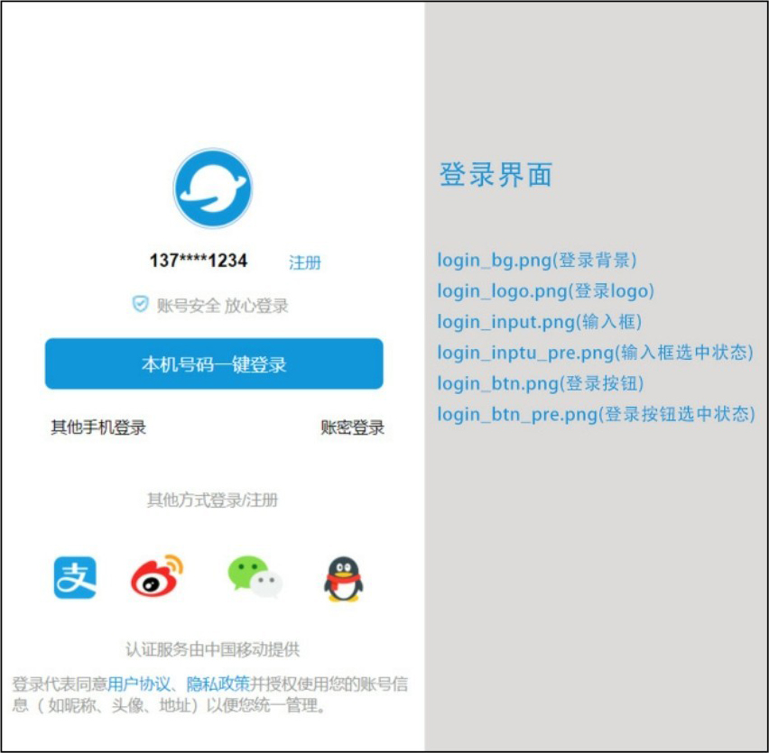

图3-84 登录界面的命名

#### **3.使用Cutterman切图工具对“美食小吃”App切图**

使用Cutterman，只需要单击“导出选中图层”按钮，选中的图标就会根据我们的需要自动输出为不同倍数的图片；同时需要设定图片的输出路径，如图3-85所示。

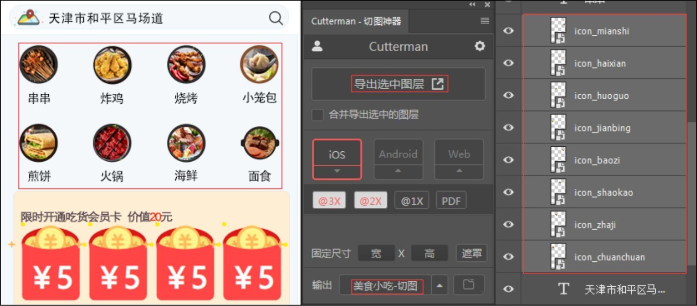

图3-85 一键导出

（1）Cutterman输出支持iOS平台

Cutterman输出支持iOS平台的@1x、@2x、@3x，如图3-86所示。

（2）Cutterman输出支持Android平台

Cutterman输出支持Android平台的多种主流分辨率大小图片，如XXXHPDI、XXHPDI、XHDPI、HDPI、MDPI等，如图3-87所示。

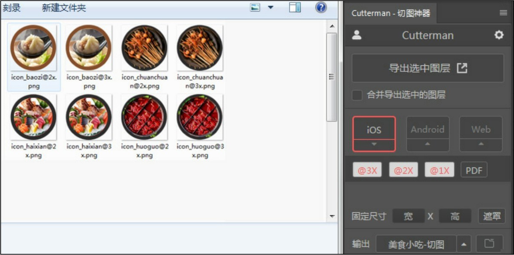

▲图3-86 支持iOS平台

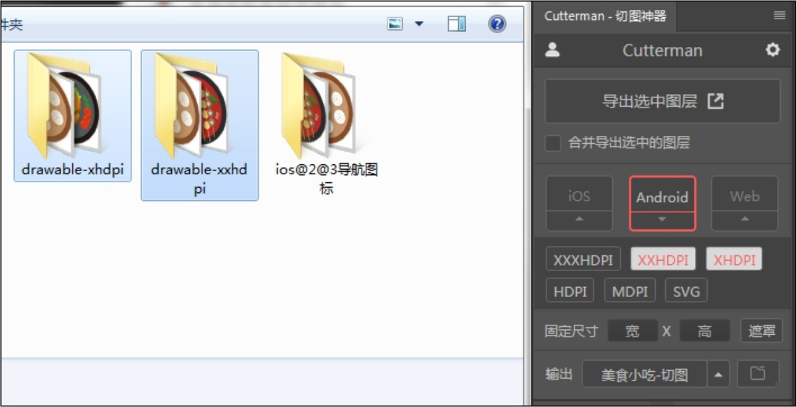

图3-87 支持Android平台

#### **4. Android平台切图尺寸规范**

Android手机的尺寸非常多，且不统一，总的来说分为LDPI、MDPI、HDPI、XHDPI、XXHDPI、XXXHDPI。

设计师一般以720px×1280px做设计图，如图3-88所示。

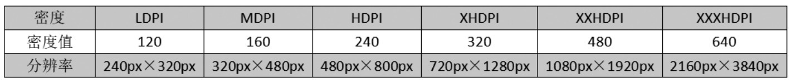

图3-88 Android平台对应的屏幕密度

在Android中，以320px×480px分辨率为基准屏幕，即密度值为160时，1dp = 1px。

所以Android的切图需要3个尺寸：HDPI、XHDPI、XXHDPI，如图3-89所示。

dp和px的换算公式：dp×PPI/160=px;px/（PPI/160）=dp。

Android设计时使用sp作为字体单位，如在PPI=160、字体大小为100%时，1sp=1px。

sp和px的换算公式：sp×PPI/160 = px,sp = px/（PPI/160），对应的单位换算如图3-90所示。

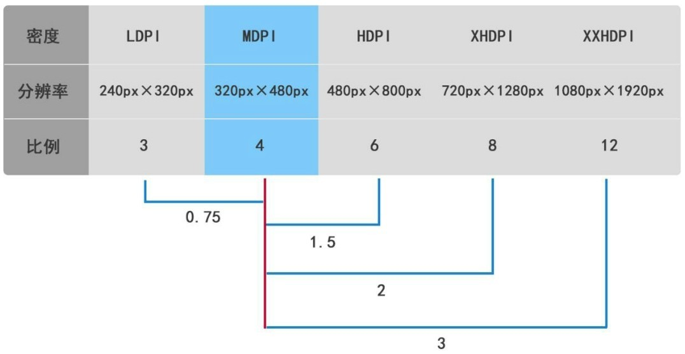

▲图3-89 Android平台需要切图的套数

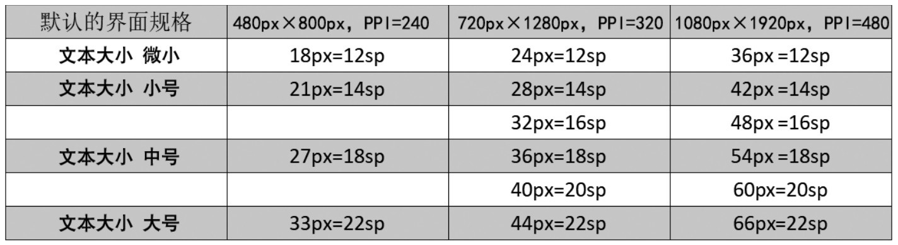

图3-90 Android平台不同密度对应的文字单位换算

#### **5. iOS平台切图尺寸规范**

设计师在作图时一般以iPhone 6（750px×1334px）为标准进行界面设计，让开发进行适配。原因是向上和向下适配的时候界面调整的幅度最小，最方便适配，图3-91所示提供了iOS平台手机的主要型号对应的切图倍数。

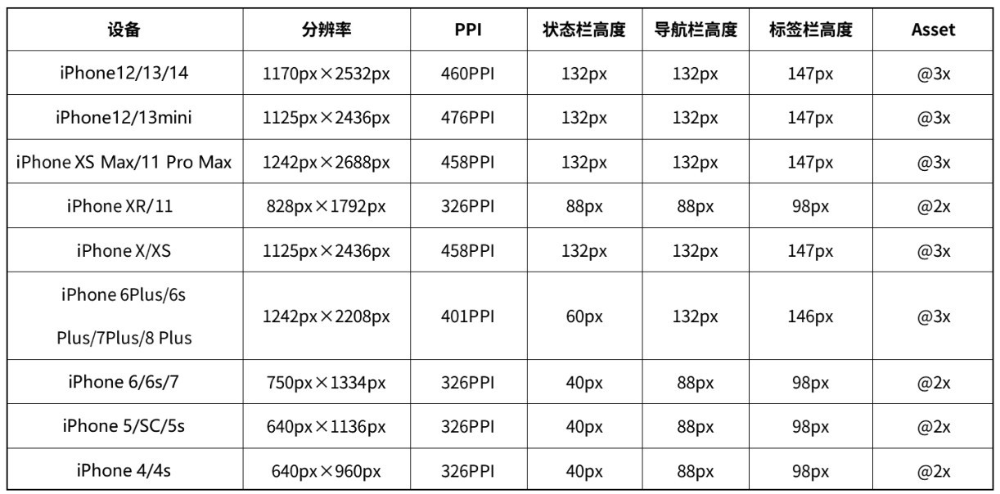

图3-91 iOS平台手机型号对应切图倍数

### **3.8.4**

### **使用Pxcook标注“美食小吃”App界面**

当界面设计定稿之后，设计师需要对界面进行标注，以供开发工程师在还原界面时作为参考。在一份设计稿中需要标注的内容是文字的字号大小、粗细、颜色、不透明度、色值，界面的背景颜色、不透明度，以及各个图标、列表、文字之间的间距，如图3-92所示。

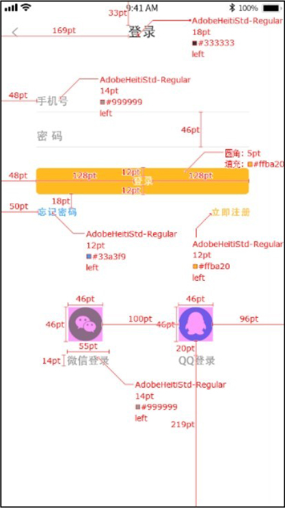

图3-92 界面的标注

借助一些专业的标注工具有利于我们提高工作效率，常用的标注工具有MarkMan、Assistor PS和Pxcook，本项目主要讲使用Pxcook进行标注的方法。

Pxcook也叫像素大厨，是一款切图标注设计工具软件，支持PSD文件的文字、颜色、距离自动智能识别等。它是基于Adobe AIR的跨平台桌面应用程序，优点是将标注、切图这两项集成在一个软件内完成，支持Windows和MacOS双平台，操作界面如图3-93所示。

Pxcook是一款连接设计师与开发者的协作工具。当软件安装完成后，双击运行，进入项目列表界面，如图3-94所示。

给项目命名，如图3-95所示，平台选择“iOS”，单击“创建项目”按钮后，就可以将需要标注的PSD设计稿导入软件中，如图3-96所示。

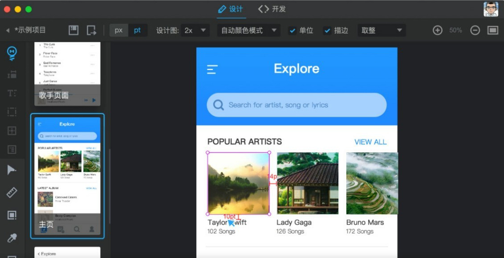

▲图3-93 操作界面

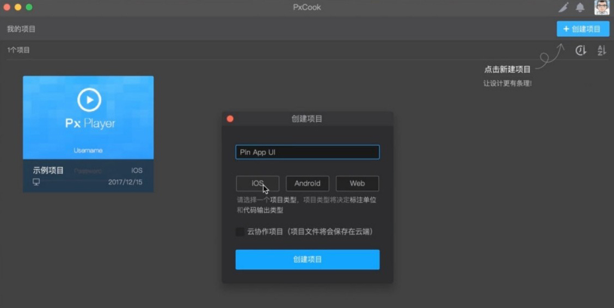

▲图3-94 项目列表界面

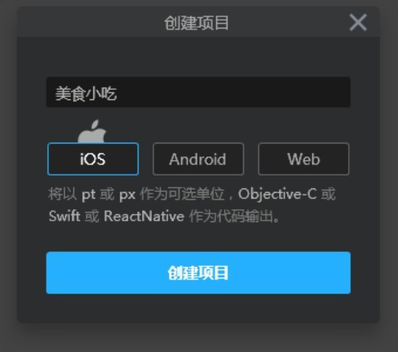

▲图3-95 创建项目

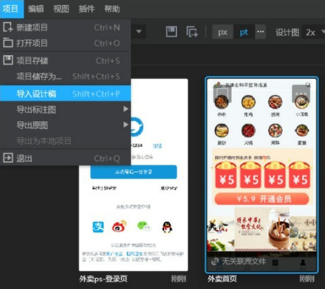

图3-96 导入设计稿

导入设计稿后，进入操作界面，如图3-97所示，软件的标注分为“设计”和“开发”模式。

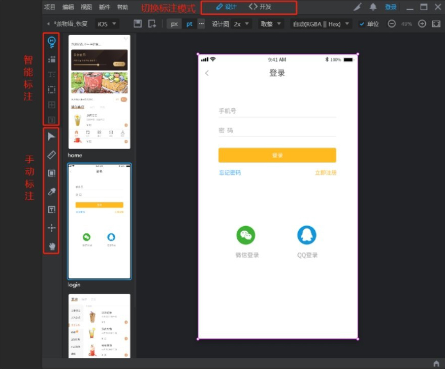

图3-97 操作界面

其中，单位类型的设置会直接作用于“设计”和“开发”两个模式。不同的项目设备类型对应不同的单位类型，具体如下。

● iOS类型：支持px和pt两种单位切换，以及@1x、@2x、@3x之间的分辨率切换。

● Android类型：支持px和dp/sp两种单位切换，以及ldpi、mdpi、hdpi、xhdpi、xxhpdi和xxxhpdi之间的分辨率切换。

● Web类型：支持px、rem、vw/vh和rpx这4种单位切换，以及1x和2x之间的分辨率切换，如图3-98所示。

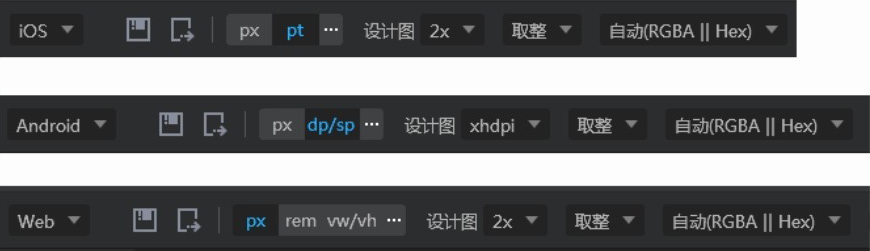

图3-98 不同设备对应的单位类型

其中设计模式主要是设计师进行智能标注和手动标注时用，建议只标注出原型交互设计师需要特别注意的部分即可。这样可以大大减少原型交互设计师的工作量，同时也不会影响设计图的整体性，便于观看。

下面我们分别使用智能标注和手动标注的方法对设计稿进行标注。

#### **1.智能标注**

智能标注是软件对设计稿的图层和元素进行了提示，我们可以更加精准地标注图层的尺寸、图层与图层的间距，以及图层的样式等。智能标注需要设计稿是PSD、SKETCH或XD格式，且具有图层数据。如果设计稿中仅包含一个位图图层，那么是无法使用智能标注的。

（1）尺寸标注

快捷键为数字键“1”。可以选中设计稿中需要标注的元素，并单击智能标注中对应的工具生成尺寸标注，如图3-99所示。

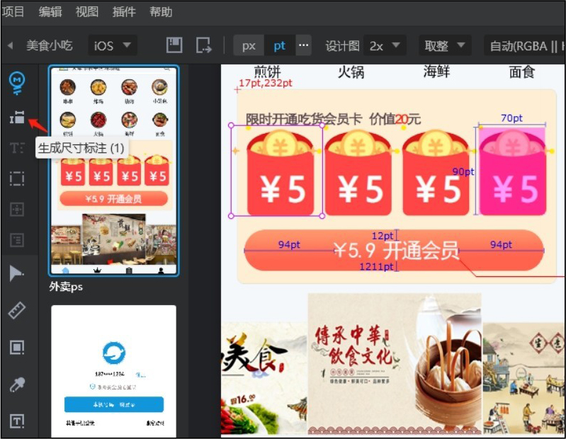

图3-99 尺寸标注

（2）文本样式标注

快捷键为数字键“2”。选中设计稿中的文字元素，并单击智能标注中对应的工具生成文本样式标注，如图3-100所示。

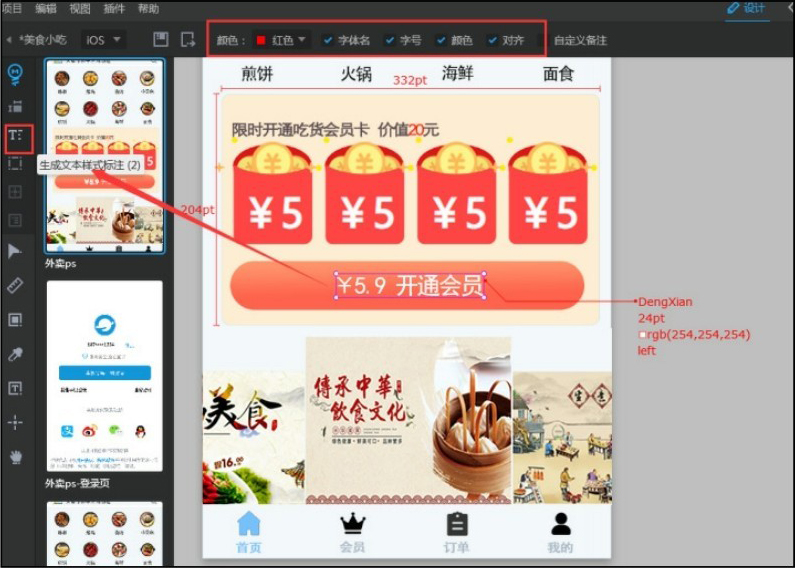

图3-100 文本样式标注

选择已创建的文本样式标注，顶栏会显示属性设置；在其中，可以修改标注的颜色，以及对应的信息显示与否，同时也可以加入自定义的备注。

（3）区域标注

快捷键为数字键“3”。选中设计稿中的图片元素，并单击智能标注中对应的工具来生成区域标注，如图3-101所示。

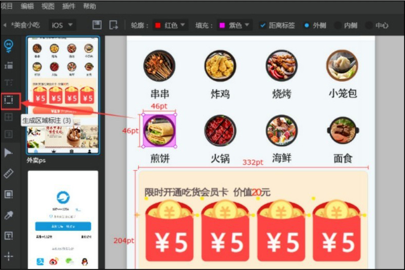

图3-101 区域标注

（4）内间距标注

快捷键为数字键“4”。按Ctrl/CMD键的同时选中设计稿中两个嵌套的元素，并单击智能标注中对应的工具生成内间距标注，如图3-102所示。

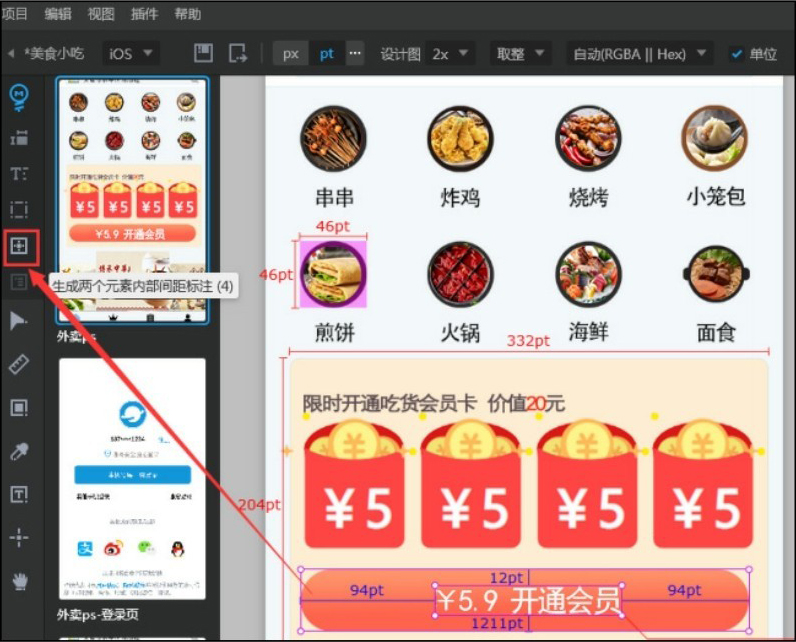

图3-102 内间距标注

（5）样式标注

快捷键为数字键“5”。选中设计稿中的矢量元素，并单击智能标注中对应的工具生成样式标注，如图3-103所示。选择已创建的样式标注，顶栏会显示属性设置；在其中，可以修改标注的颜色，以及对应的信息显示与否，同时也可以加入自定义的备注。

#### **2.手动标注**

对于没有图层信息的位图设计稿，可以使用手动标注工具对其进行标注。

（1）选择工具

快捷键为“V”。此工具可以选择我们已经创建的标注信息，选择标注之后可以通过软件的顶栏修改标注的属性，如图3-104所示。

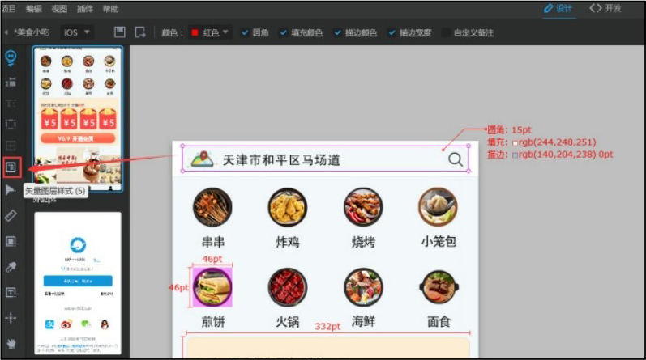

▲图3-103 样式标注

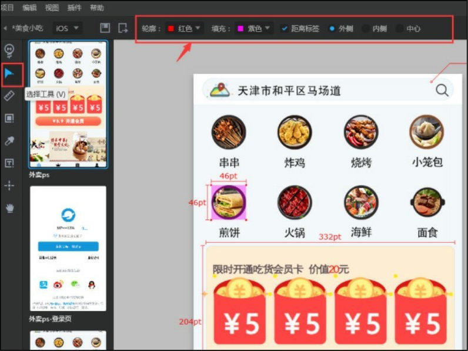

图3-104 选择工具

（2）距离标注

快捷键为“R”。创建一个距离标注，顶栏会显示图3-105所示的属性设置，可以修改距离标注的颜色，以及距离文本所在的位置。

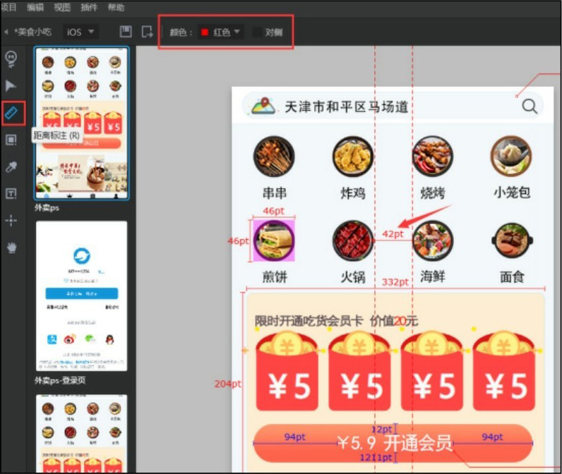

图3-105 距离标注

（3）区域标注

快捷键为“M”。创建一个区域标注，顶栏会显示图3-106所示的属性设置，可以修改区域标注的颜色、是否显示距离标签，以及距离标签的位置。

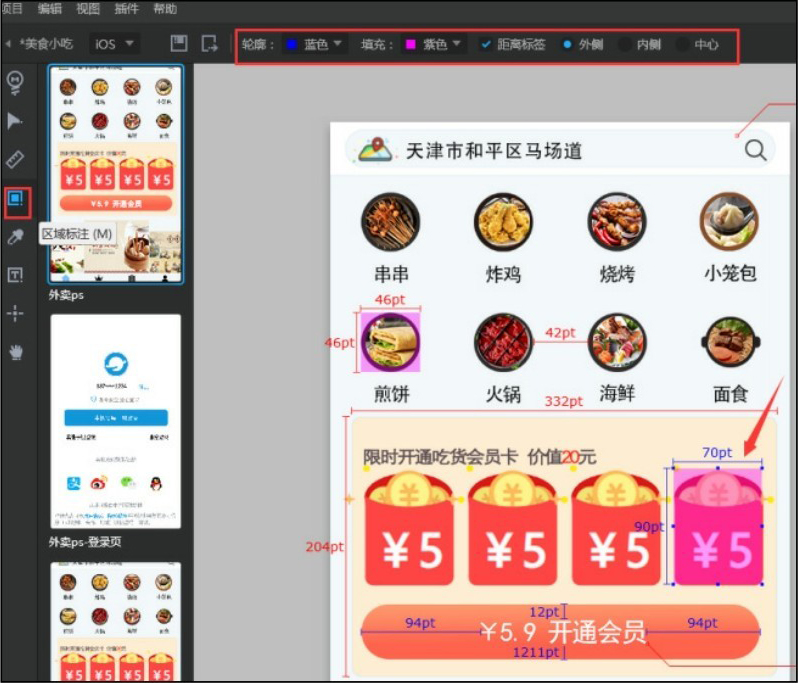

图3-106 区域标注

（4）颜色标注

快捷键为“C”。创建一个颜色标注，顶栏会显示图3-107所示的属性设置，可以修改标注的颜色。

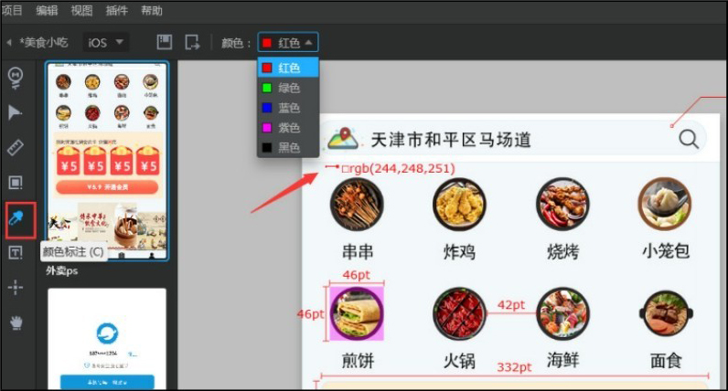

图3-107 颜色标注

（5）文字标注

快捷键为“T”。使用该工具可创建一个可输入文本的文字标注，如图3-108所示。

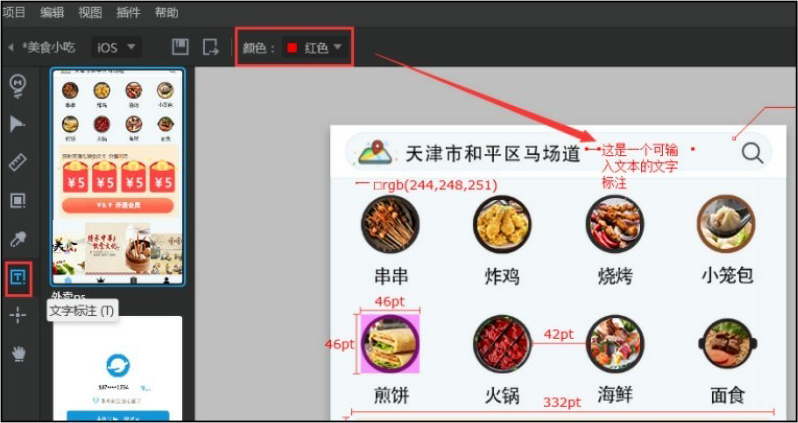

图3-108 文字标注

（6）坐标点标注

快捷键为“P”。使用该工具可创建一个坐标点标注，标记元素的行、列起始坐标点，如图3-109所示。

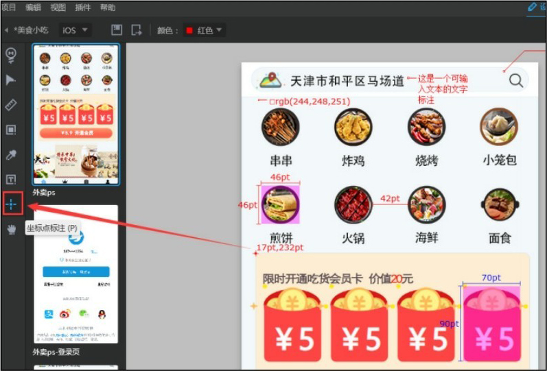

图3-109 坐标点标注

设计稿标注完成后，将文件导出为带有标注信息的“.png”格式的图片，或者保存为“.pxcp”格式的标注文件，如图3-110所示。

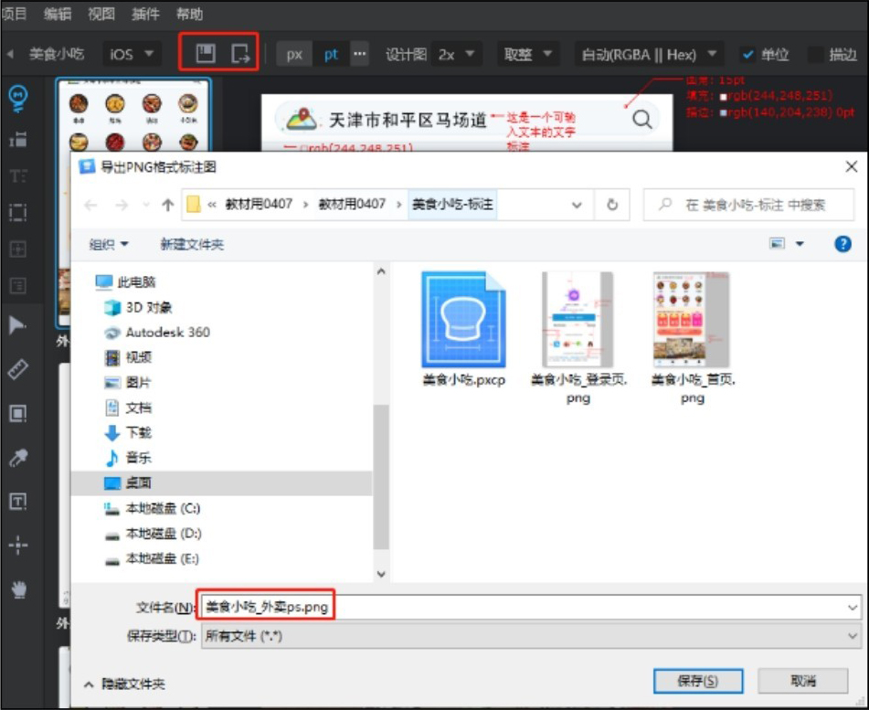

图3-110 导出标注文件

### **3.8.5**

### **“美食小吃”App动态加载画面优化**

App交互设计中，很多设计师都会采用动态效果来吸引用户的注意。相对于静态的界面，动态效果能更生动地传达信息，同时也更能感染用户，吸引眼球。但是动态效果相对于静态效果来说，在设计中需要注意很多问题，因为如果一不小心动态设计过度，不仅会影响页面加载的进程，更会影响用户的体验。

一般App动态元素的设计可以从以下几个方面进行优化。

（1）调整图像大小

打开Photoshop，选择菜单栏中的“图像→图像大小”，快捷键是Ctrl+Alt+I，即可打开“图像大小”对话框，输入我们需要的大小即可，如图3-111所示。

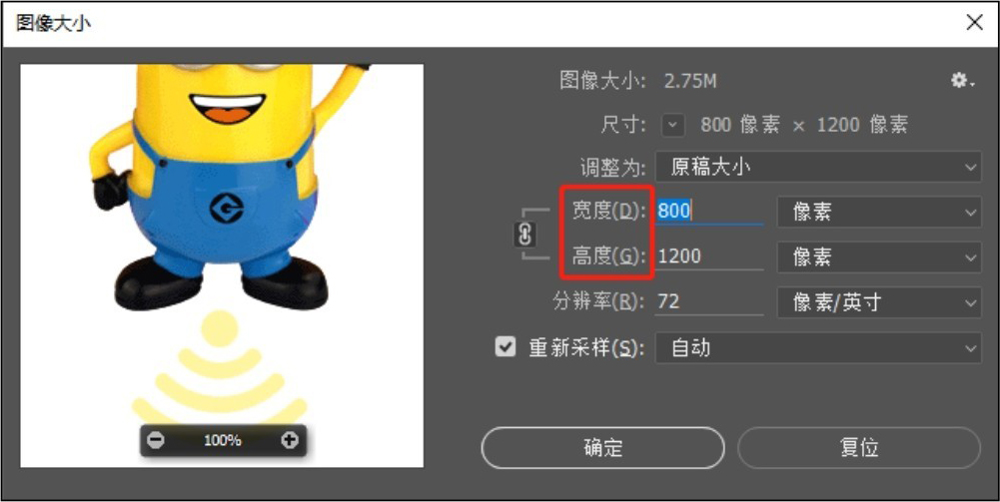

▲图3-111 调整图像大小

▼微课视频

App动态元素的几种优化设置

（2）减少帧

删掉重复帧，只留关键帧，通过增加关键帧的延迟时间，保持动画的节奏，因为每一帧都占用着GIF动图的大小，所以帧越少文件也就越小，如图3-112所示。

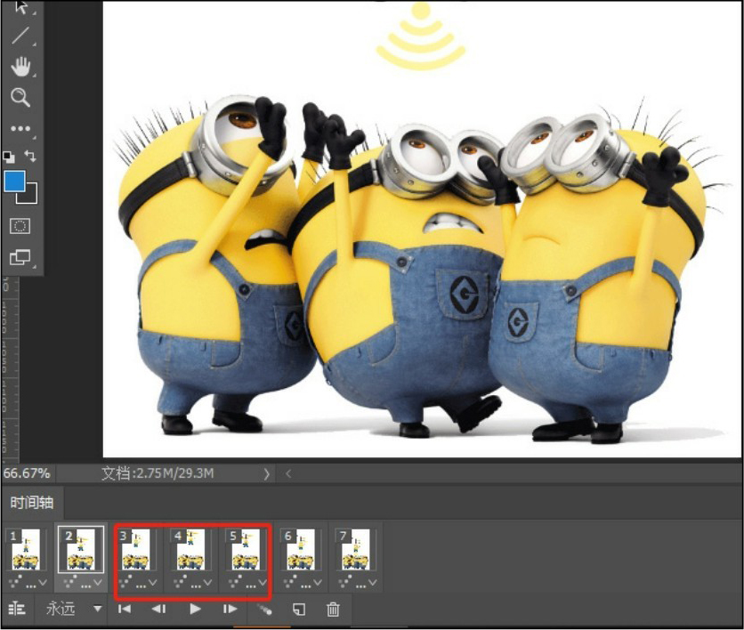

图3-112 减少帧数

（3）减少颜色数

选择“文件→导出→存储为Web所用格式”，打开“存储为Web所用格式”对话框，如图3-113所示，单击下拉列表框，有多个位数可选择。对于颜色不是太鲜艳的GIF动图来说，可以先尝试选择64种颜色来查看效果，这将有效减小文件大小；除了预设的几个数值外，还可以手动输入自己想要的颜色数，如图3-114所示。

（4）调整色彩损耗值

可通过调整色彩损耗值来缩小GIF文件的大小，调整损耗值前后该GIF文件大小的对比如图3-115所示。

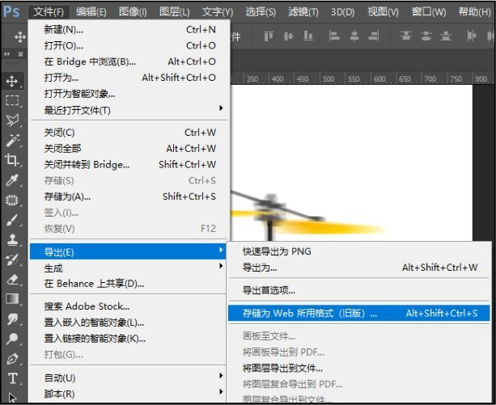

▲图3-113 打开“存储为Web所用格式”对话框

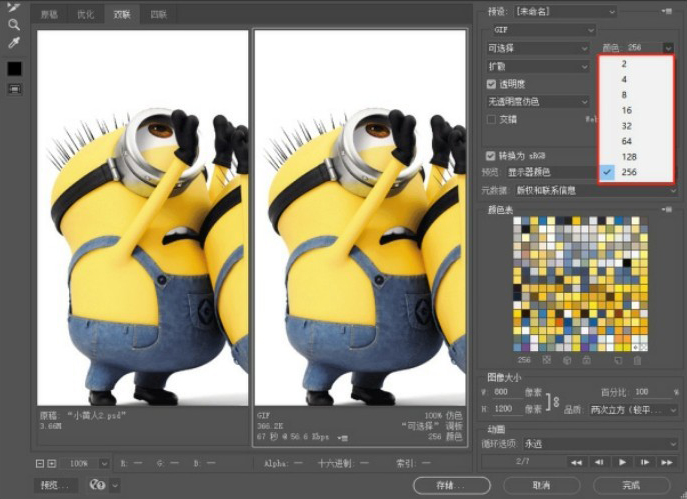

▲图3-114 减少颜色数

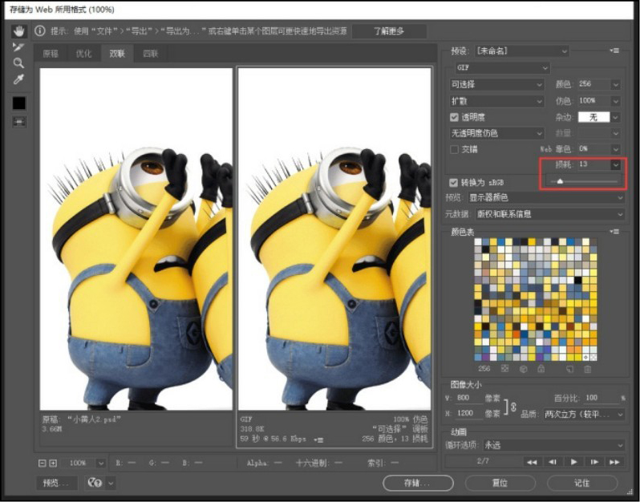

图3-115 调整色彩损耗值

（5）优化文件大小和保存预设

单击“存储为Web所用格式”对话框右上角的上下文菜单，然后选择“优化文件大小”命令，在弹出的对话框中输入我们的文件大小需求即可，如图3-116所示。

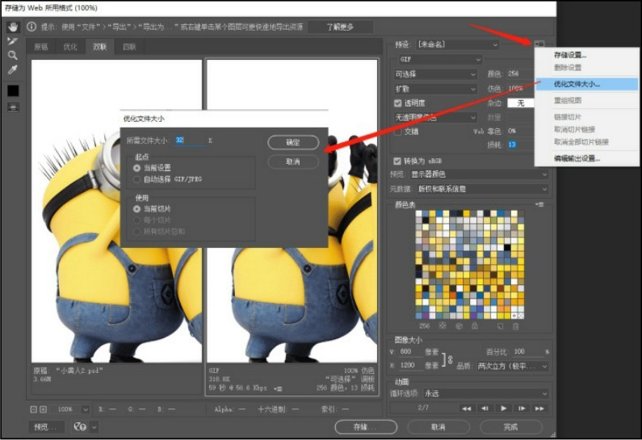

图3-116 优化文件大小

设置好后，单击“预览”按钮查看最终GIF效果，也可以将设置保存为预设。

## **3.9**

## **项目小结**

本项目讲解了当界面设计定稿之后，使用切图软件根据Android和iOS平台的规范进行切图以及命名。设计师需要对界面进行标注，以供原型交互开发工程师在还原界面时进行参考，可使用Pxcook软件来提高标注的效率。另外，本项目还讲解了几种优化静态图片和GIF动图的方法，避免由于图片过大或平台的限制影响界面加载的进程，同时增强用户的体验。设计师在设计时并不一定要拘泥于某种软件或方法，但应对这些规范有所了解，并融会贯通，为原型交互设计制作提供理论基础。

## **3.10**

## **素养拓展小课堂**

在App交互UI设计过程中，我们要严格遵守设计规范，使设计出的界面更符合用户的操作习惯并提高用户的交互体验。设计过程中要体现专注的精神内涵，内心笃定而着眼于细节，耐心、执着、坚持，是一切“工匠”所必须具备的精神特质。从中外实践经验来看，工匠精神都意味着一种执着、坚持与韧性。“术业有专攻”，一旦选定行业，就一门心思扎根下去，心无旁骛，在一个细分产品上不断积累优势，在各自领域成为“领头羊”。

## **3.11**

## **巩固与拓展**

本项目讲解了App界面视觉层次结构的构建及引导和反馈模式等相关理论，并结合实例进行了场景应用分析，想必你对如何构建视觉层次结构有了一定的了解和掌握。反馈模式对App交互设计的用户体验有着很重要的作用，请你思考一下当反馈信息可以同步获取时，使用哪种反馈模式更合理。

在浏览App产品的时候，你可以用专业的角度去分析，哪些设置会吸引用户，好在哪里，通过不断地分析和积累来提升自己在视觉层次结构设计这方面的认知，这样也有助于对知识点的深入理解。

## **3.12**

## **习题**

### **一、填空题**

1.强调反馈信息的重要性，一般带有可操作的选项的是\_\_\_\_\_\_。

2.Android的虚拟尺寸单位中，用于元素的单位是\_\_\_\_\_\_，用于字体的单位是\_\_\_\_\_\_。

### **二、单选题**

1.切图命名规范中，描述错误的是（ ）。

A.可以使用无意义字符

B.尽量使用语义相近的英文或英文简写命名

C.较长的单词可以取单词的头部几个字母形成缩写

D.如需使用符号，使用_做连接

2.切图插件Cutterman可以输出多个平台使用的图片尺寸和格式，但不包括（ ）。

A.Web

B.iOS

C.Html5

D.Ardroid

### **三、多选题**

1.Photoshop中优化动态元素的方法包括（ ）。

A.减小图像大小

B.减少帧数

C.减少颜色数

D.调整色彩损耗值

2.切图的目的有（ ）。

A.保证清晰度

B.提高组件的复用性

C.让网页浏览更快

D.减小文件容量

3.层次结构，主要通过视觉语言的基本元素来构成，包括（ ）。

A.尺寸

B.颜色

C.字体

D.布局

### **四、操作题**

根据设计的App界面，要求依据切图及标注规范进行页面和图标的切图和标注，供后续原型交互设计阶段使用；涉及软件工具：Photoshop、Cutterman、Pxcook。

