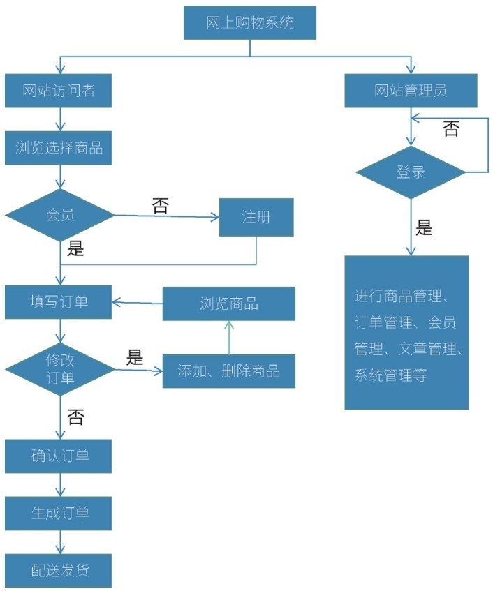

## **Web端“电商平台”产品交互设计开发项目需求分析**

Web端“电商平台”产品交互设计开发项目主要从目标顾客、功能规划、业务流程等方面进行需求分析。

### **1.目标顾客**

该产品适用于各种对数码电子产品感兴趣且有需求的人士，包括学生、上班族等。

### **2.提供的功能与服务**

用户可以直接在网站上对比各种产品之间的功能、结构、性能，十分方便快捷地进行商品之间的比较，很快地选出自己感兴趣的商品，节省了大量的时间。

### **3.运行环境**

Windows操作系统。

### **4.功能规划**

（1）网站前台部分功能模块介绍

① 用户管理：注册新用户、登录、修改用户个人资料。

② 商品浏览：在商品的介绍页面，可以收藏商品或者将商品加入购物车。

③ 购物车：添加产品到购物车、购物车信息修改、下单。

④ 订单模块：查询个人订单列表、查询某笔订单的详细信息。

⑤ 个人账户：订单查询，对收藏夹、地址的管理。

（2）后台功能模块介绍

① 管理员身份验证：为合法用户提供一个后台入口。

② 订单管理模块：网站管理者对用户订单进行管理。

③ 商品管理模块：增加商品的品牌或商品的种类，向商品表中插入前台首页展示的商品信息。

④ 会员管理模块：查询所有注册用户，对一些非法或失信用户进行删除操作。

⑤ 系统管理模块：管理员向前台首页添加友情链接信息。

### **5.业务流程**

业务流程如图4-1所示。

图4-1 业务流程

### **4.3**

