## **Axure RP 9介绍**

Axure RP 9是一款备受瞩目的产品原型设计软件，它可以让设计师在操作界面上任意构建草图、框线图、流程图以及产品模型，还能够注释一些重要的地方。这款交互式原型设计工具可以帮助设计者高效制作出高水准的产品原型图，快速创建应用程序和网站的线框，被广泛应用于各行各业。本节重点学习Axure RP 9基础功能的使用方法。

### **4.3.1**

### **Axure RP 9的工作界面**

微课视频

### Axure RP 9的工作界面

在熟悉Axure RP 9的基础操作之前，先要弄清Axure RP 9工作界面中每个板块的功能划分，这样比较方便我们操作时更快地找到对应的功能选项，所以本小节主要熟悉此软件的工作界面，如图4-2所示。

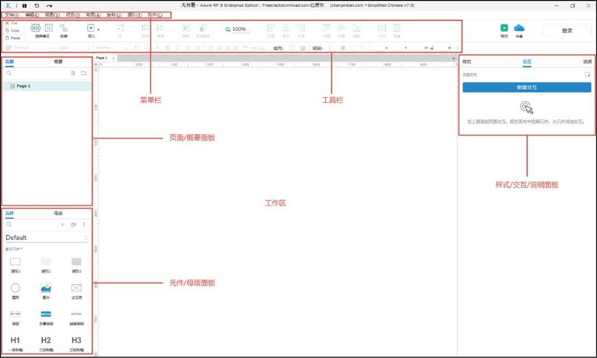

图4-2 Axure RP 9的工作界面

#### **1.菜单栏**

Axure RP 9的每个菜单包含同类的操作命令，我们可以根据要执行的操作类型在对应的菜单中选择操作命令。

#### **2.工具栏**

Axure RP 9的工具栏由上半部分的工具按钮和下半部分的样式按钮组成，如图4-3所示。

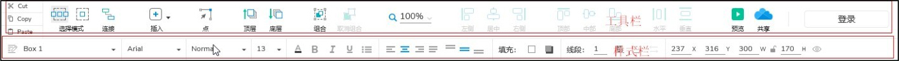

图4-3 工具栏

#### **3.“页面”和“概要”面板**

“页面”面板主要用于显示当前Axure文件的所有页面，同时管理Axure文件页面；“概要”面板显示当前操作页面的所有元件，可以控制某个、某些或全部元件是否在“概要”面板中展示，“页面”面板和“概要”面板如图4-4和图4-5所示。

#### **4.“元件”和“母版”面板**

“元件”面板自带Default元件、Flow元件、Icons元件，通过“元件”面板可管理外部元件库，如图4-6所示。

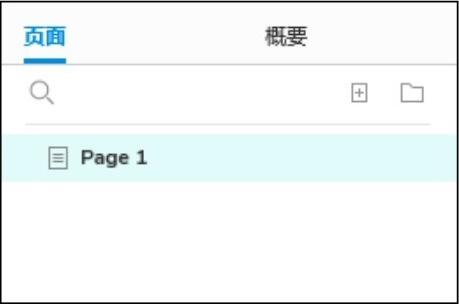

▲图4-4 “页面”面板

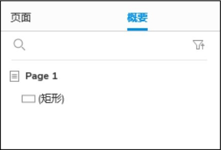

图4-5 “概要”面板

Axure RP 9中的母版可以简单理解为公共元件模板，将母版应用到相应页面中后，母版内容或样式发生变化，那么引用母版的页面内容或样式同样会跟着变化，常用于制作页面头部或底部内容，如图4-7所示。

注意：选中“元件”面板中的元件，将其拖动到工作区中即可使用；另外，可将自己做好的组合元件保存在元件库中，再次使用时直接将其拖动到工作区即可。

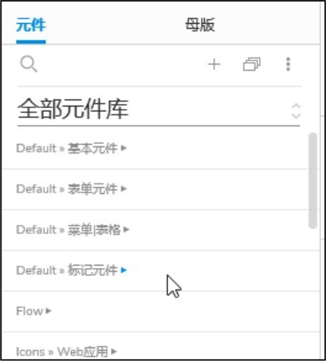

▲图4-6 “元件”面板

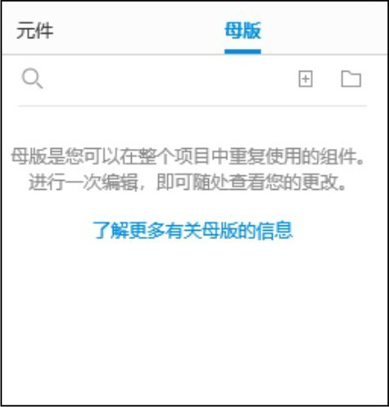

图4-7 “母版”面板

#### **5.“样式”“交互”“说明”面板**

“样式”面板：包含元件样式、页面样式，如图4-8所示。

① 元件样式：名称、位置、尺寸、是否显示、颜色、字体、字号、边框、对齐、填充、透明度、阴影等样式，不同元件的样式稍有差别。

② 页面样式：页面尺寸、页面排列、页面背景填充。

“交互”面板：包含页面交互、元件交互，其中元件交互又分为样式交互、事件交互，如图4-9所示。

① 页面交互：页面载入时、窗口尺寸改变时、窗口滚动时、页面单击时、页面鼠标操作时等交互。

② 样式交互：鼠标悬停、鼠标按下、选中、禁用、获取焦点时等交互。

③ 事件交互：单击、双击、鼠标按下、鼠标移入、鼠标移出、移动时、旋转时、尺寸改变时、焦点获取时、内容改变时等交互，不同元件的事件交互稍有差别。

“说明”面板：主要用于管理元件的注释，目前仅支持文本注释，可对注释内容进行文本编辑，如图4-10所示。

#### **6.工作区**

工作区也就是操作区域，所有的元件操作应用都基于工作区进行，如图4-11所示。

可通过“样式”面板的页面尺寸设置工作区大小。

也可通过基本工具栏中的缩放工具放大、缩小工作区。

当页面过多时，可以通过单击工作区右上角的“选择与管理标签”按钮，在弹出的菜单中选择命令，执行相应的操作。

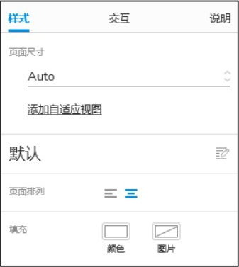

▲图4-8 “样式”面板

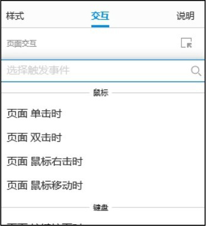

▲图4-9 “交互”面板

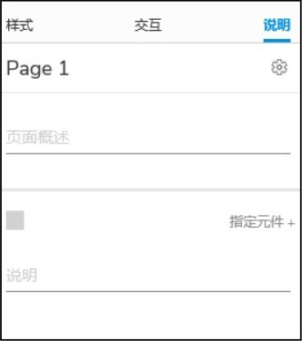

▲图4-10 “说明”面板

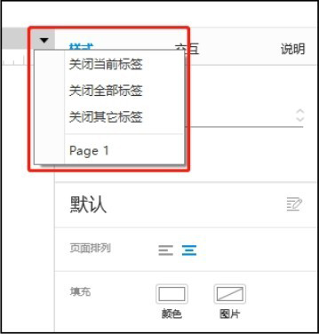

图4-11 工作区

### **4.3.2**

### **Axure RP 9的元件库**

元件是原型产品中最基础的组成部分，使用元件可以制作出丰富的产品原型效果。

在Axure RP 9中，用于绘制原型设计的用户界面元素被称为“元件”，元件被放在“元件库”面板中。

#### **1. Default元件**

Default元件分为4个类型，如图4-12所示，这些元件可以满足原型设计中的一些基本需求，图4-13所示为基本元件。

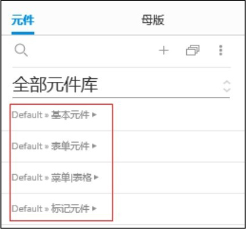

▲图4-12 Default元件

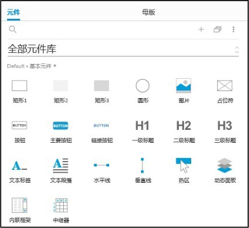

图4-13 基本元件展示

#### **2. Flow元件**

Flow元件即“流程图元件”，Axure RP 9为用户提供了专用的Flow元件，如图4-14所示。使用Flow元件可以更好地设计制作流程图页面，如图4-15所示。

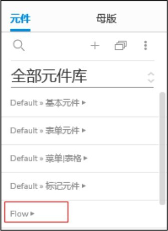

▲图4-14 Flow元件

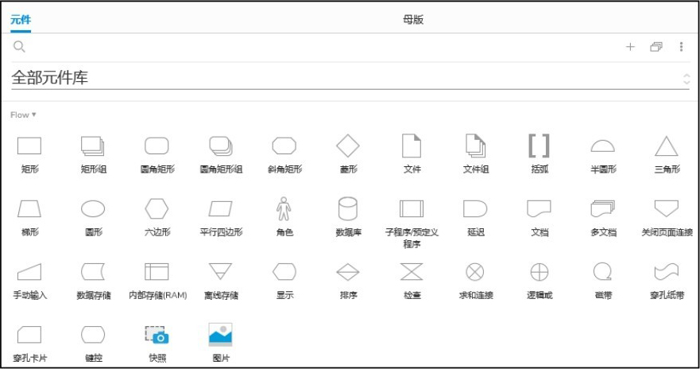

图4-15 Flow元件展示

#### **3. Icons元件**

Icons元件即“图标元件”。Axure RP 9为用户提供了专用的Icons元件，如图4-16所示。使用Icons元件可以更好地制作页面原型，如图4-17所示。

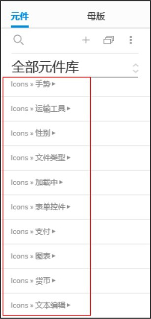

▲图4-16 Icons元件

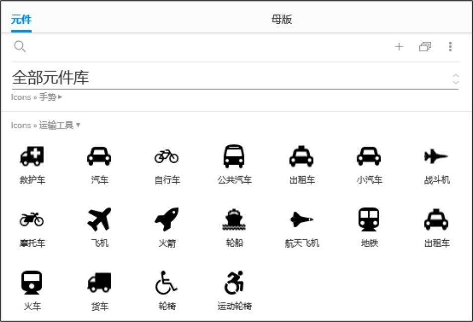

图4-17 Icons元件展示

### **4.3.3**

### **Axure RP 9中的交互功能**

微课视频

### Axure RP 9中的交互功能

在Axure RP 9中，可通过添加元件来展示原型设计的静态页面，而实现动态效果则需要使用Axure RP 9中的交互功能。

交互定义了一个元件或者页面的动态行为。在Axure RP 9的右侧“交互”面板中创建和管理交互。可以在面板底部设置交互，也可以单击“新建交互”按钮来创建交互。

注意：当窗口空间不够大时，可采用以下方法来打开“交互编辑器”对话框，如图4-18所示。

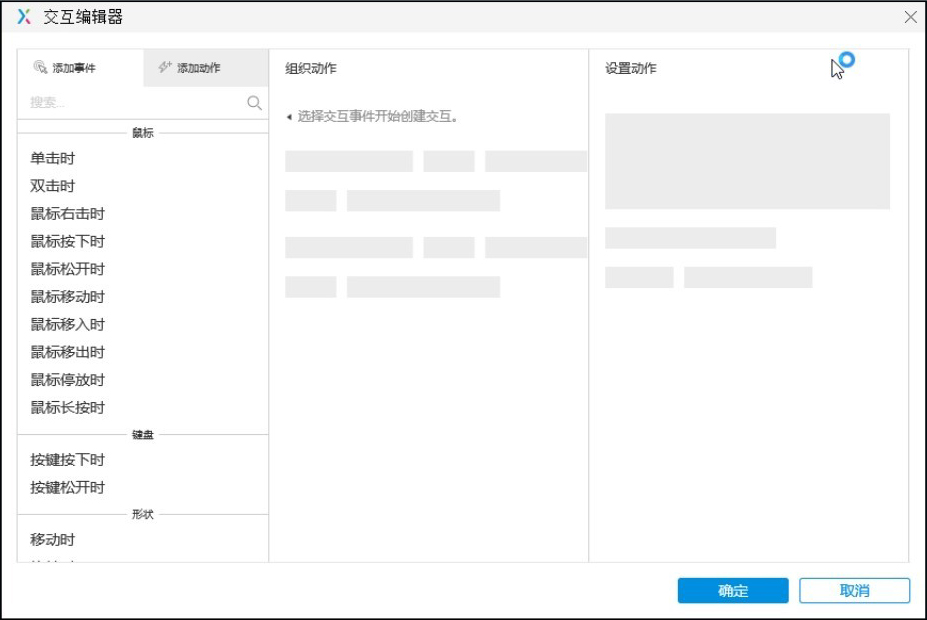

图4-18 “交互编辑器”对话框

① 单击“交互”面板中的窗口图标，如图4-19所示。

② 双击某一个事件即可打开“交互编辑器”对话框，如图4-20所示。

Axure RP 9原型交互设计中实现交互行为需要以下三部分。

① 元件或页面的事件。

② 在此事件上的情形。

③ 针对该情形的动作。

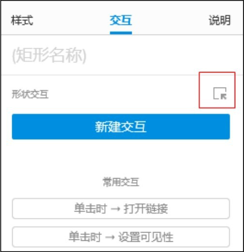

▲图4-19 打开“交互编辑器”对话框1

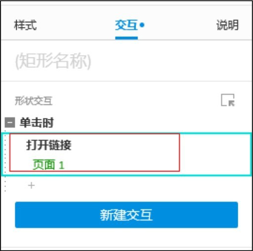

图4-20 打开“交互编辑器”对话框2

事件是通过不同的情形和动作来对外界输入做出的一种反映。所以，事件包含一个或多个情形，而情形中又可包含多个动作，不同的情形通过判断各自的条件决定将要做什么，也就是说，不同的情形是不会同时发生的，就类似编程所写的“if()”语句。

if（条件1）

｛执行case1中actions;｝

if（条件2）

｛执行case2中actions;｝

…….

用集合的概念来描述上面三者的关系：事件\>情形\>动作。因此事件可以理解为函数if()，情形可以理解为条件1、条件2、条件3，而动作则可理解为actions。

#### **1.事件**

查看一个元件或页面的事件：单击元件或页面，在右侧“交互”面板中可查看选中的元件或页面，如图4-21和图4-22所示。

事件的删除：选中某一个事件后，按Delete键。

#### **2.情形**

一个事件可以有多个情形，当鼠标指针悬停在事件上时，可以看到其右侧的“添加情形”按钮，如图4-23所示。可以设置触发条件来设置情形的启动，如图4-24所示。

情形的删除：选中某一个情形后，按Delete键。

注意：可用鼠标来调整情形的顺序，特别是使用条件逻辑时，情形的顺序是非常重要的。

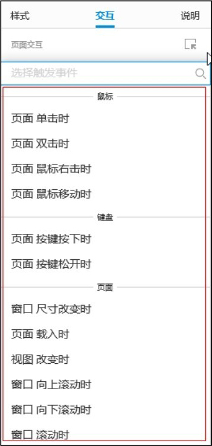

▲图4-21 元件的交互事件

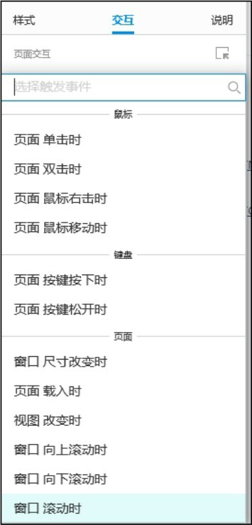

▲图4-22 页面的交互事件

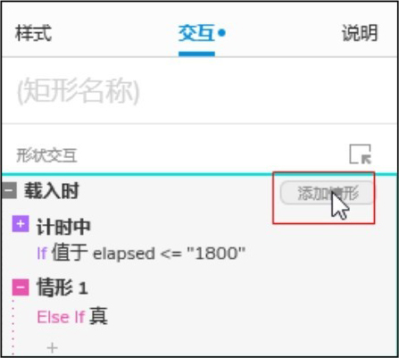

▲图4-23 添加情形

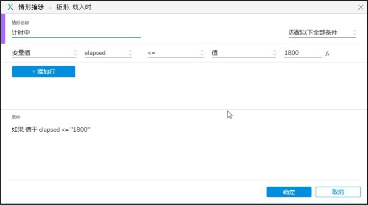

图4-24 为情形添加条件逻辑

#### **3.动作**

动作是在某一情形下的操作。

动作的添加：单击情形下方的“+”按钮（此时，显示为添加动作），如图4-25所示。

可用鼠标来调整动作的顺序，如图4-26所示。

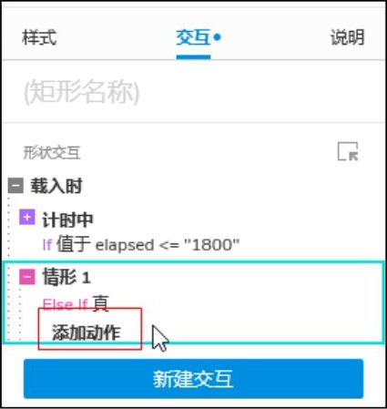

▲图4-25 添加动作

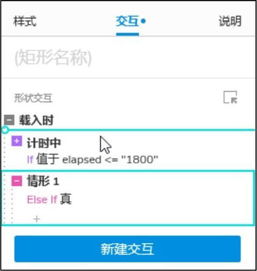

图4-26 调整动作顺序

### **4.3.4**

### **Axure RP 9交互使用说明**

#### **1. Axure RP 9不同对象的事件分类**

页面和母版的事件如表4-1所示。其余元件适用的事件见附录。

表4-1 页面和母版的事件

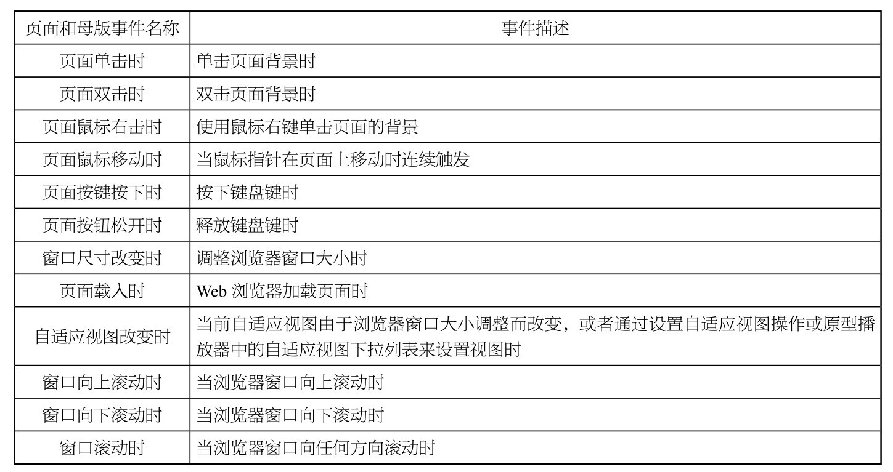

#### **2.元件的动作集**

链接如表4-2所示。其余动作集列表见附录。

表4-2 链接

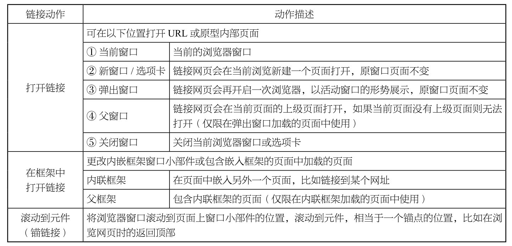

### **4.3.5**

### **变量说明**

变量是储存文本和数值的容器。变量的值可在其他元件中显示为文本，也可以在条件逻辑中使用。

● 变量的本质：数值的获取和使用。

● 变量分两大类，系统函数和自定义变量，而自定义变量又包括全局变量和局部变量。

#### **1.系统函数**

系统函数是系统已经创建好的函数变量，用于直接获取对象的特定属性值，可划分为以下10类：中继器/数据集函数、元件函数、页面函数、窗口函数、鼠标指针函数、数字函数、字符串函数、数学函数、日期函数和布尔函数，如图4-27所示。

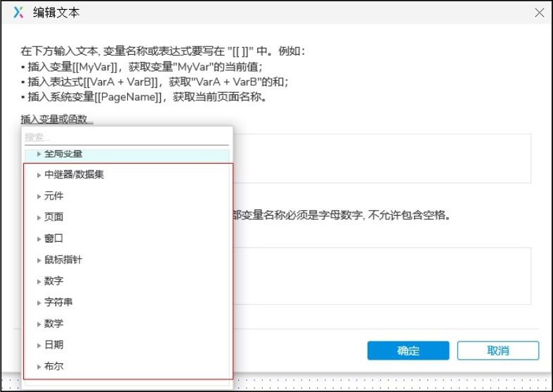

图4-27 系统函数

元件函数主要服务于Axure RP 9中的元件，使用这些函数完成的交互事件一般是一些基础的交互效果，表4-3所示为元件函数的名称和用途。其余函数列表见附录。

表4-3 元件函数的名称和用途

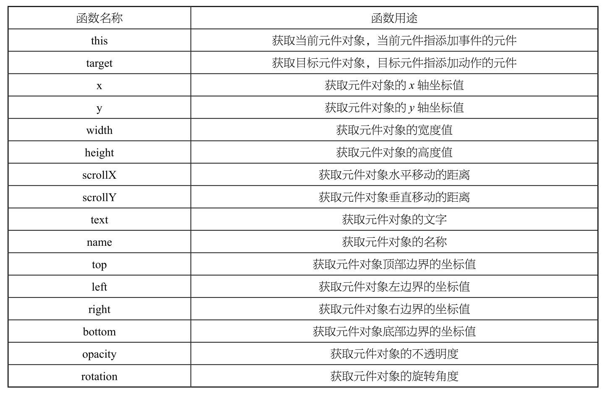

#### **2.自定义变量**

（1）全局变量

全局变量主要用于不同页面之间值的传递。

在菜单栏中，选择“项目→全局变量”，在弹出的“全局变量”对话框中，单击“添加”按钮，可以设置全局变量的名称及默认值（通常情况下默认值为空），如图4-28所示。之后在页面或元件的交互中动态地设置全局变量的值。

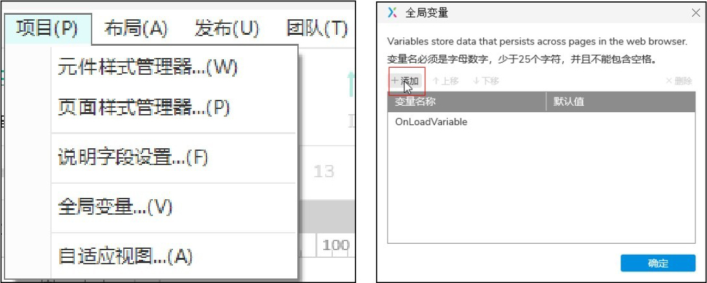

图4-28 创建全局变量

（2）局部变量

局部变量主要用于指定页面内某个特定对象，往往和系统函数配合使用。

使用局部变量，需要单击“fx”按钮，打开“编辑文本”对话框，先设置局部变量，如图4-29所示。然后在“编辑文本”对话框中，选择“插入变量或函数”选项，打开下拉列表，进行局部变量的选择，如图4-30所示。

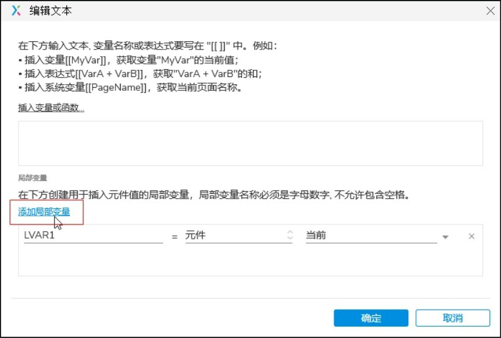

▲图4-29 “编辑文本”对话框

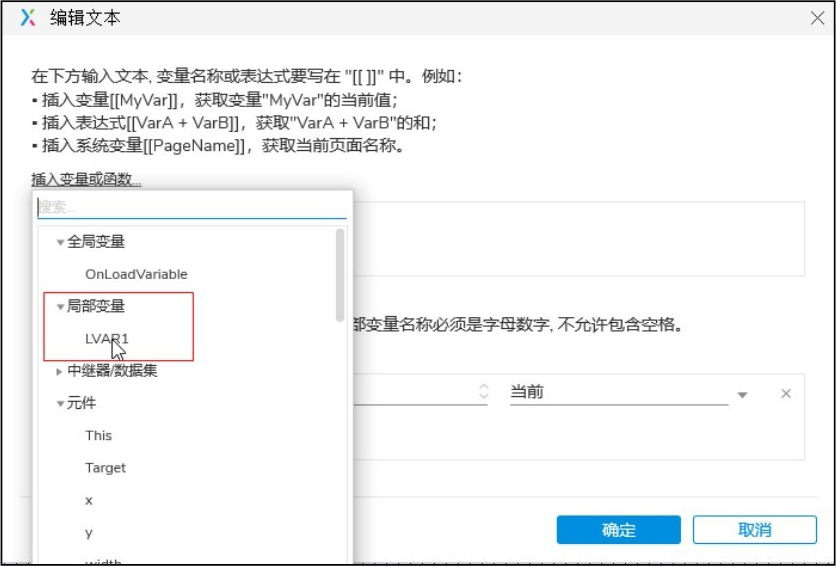

图4-30 局部变量的选择

局部变量只能在“编辑文本”对话框中创建和使用，创建局部变量后，通过局部变量获取元件文字、选中状态和被选项等内容，并将局部变量的内容读取出来，填写到值的栏目中，参与计算或与其他字符串连接。

#### **3.函数变量的语法**

Axure RP 9的函数变量的基本语法是：用“\[\[ \]\]”（英文双中括号）括住变量值和函数，变量值和函数用英文句号“.”连接。

例如，\[\[LVAR.width\]\]表示变量LVAR的宽度。\[\[This.width\]\]表示当前元件的宽度，如图4-31所示。

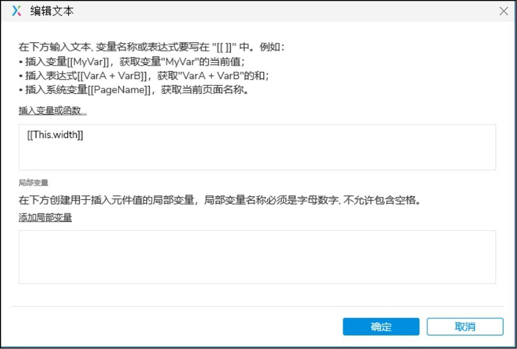

图4-31 函数变量的语法

### **4.3.6**

#### **元件交互样式**

交互样式指元件的样式，当元件进入触发状态时，效果样式将被应用；当元件退出触发状态时，样式效果被取消，元件恢复为基本样式。

微课视频

页面及互交样式设置

#### **1.交互样式常见的例子**

① 按钮被单击时边框颜色发生改变。

② 鼠标指针悬停在元件上时，元件的样式发生改变。

③ 可以为元件自定义样式效果。

操作方法：“选择元件→单击鼠标右键→交互样式”，或者在元件的“交互”面板中找到“交互样式”，单击“+”按钮添加新的交互样式，如图4-32所示，即可打开“交互样式”对话框。

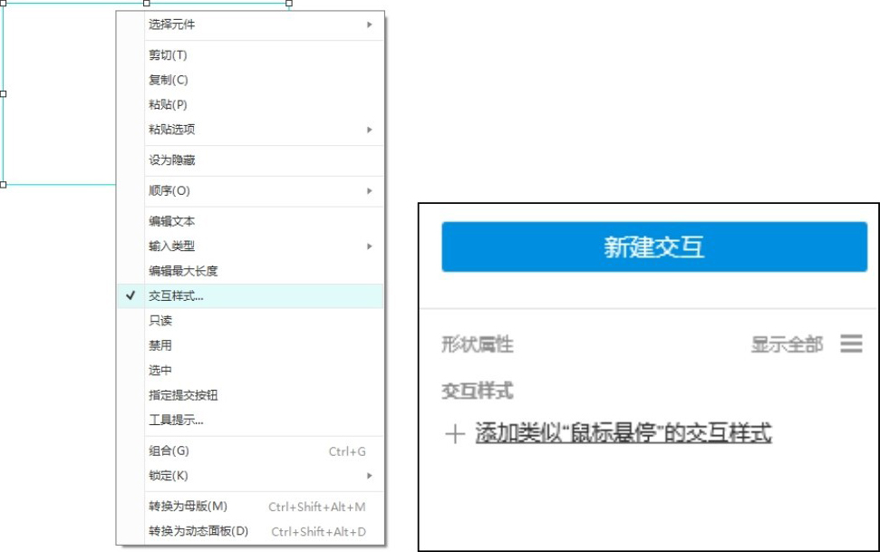

图4-32 添加元件交互样式

#### **2. Axure RP 9中的元件交互样式**

Axure RP 9中的元件交互样式有如下几种，如图4-33所示。

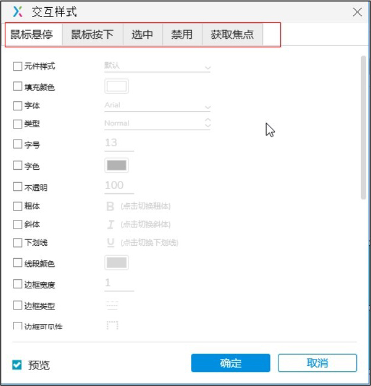

图4-33 “交互样式”对话框

① 鼠标悬停：鼠标指针悬停在元件上时元件的显示样式。

② 鼠标按下：鼠标在元件处被按下时，元件的显示样式。

③ 选中：元件被选中时的显示样式。

④ 禁用：元件被停止使用时的显示样式。

⑤ 获取焦点：鼠标指针聚焦在元件（如文本框）上时元件的显示样式。

### **4.3.7**

### **动画和边界**

在Axure RP 9中可以为动作设定动画，以丰富视觉效果。一个动画通常有两个参数，即效果和时间，如图4-34所示。

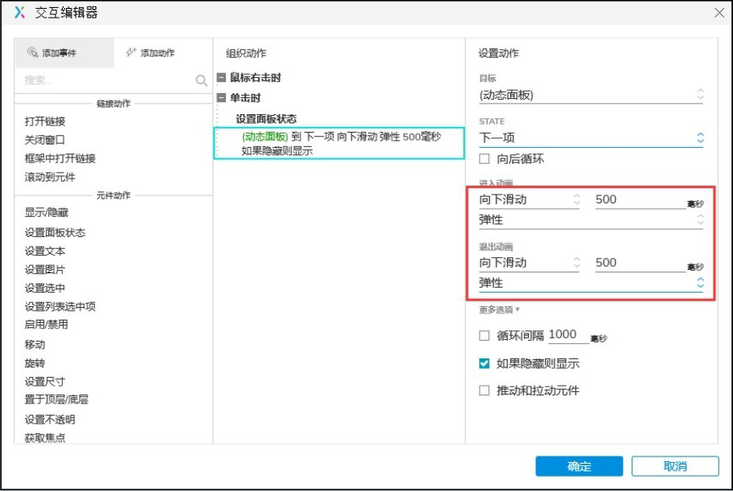

图4-34 动作动画

#### **1.可见性效果**

通常有9种可见性效果可供选择，如图4-35所示。这些效果适用于“显示/隐藏”及“设置面板状态”动作。

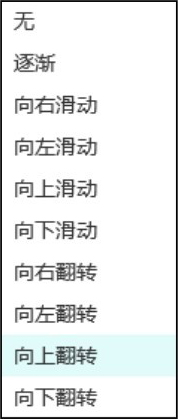

图4-35 可见性效果

#### **2.运动效果**

运动效果定义了在某一时间内该动作被触发后的动态表现形式，可以用于方向性的动作、元件或页面本身。运动效果主要适用于这些动作：“滚动到元件”“移动”“旋转”“设置尺寸”“设置不透明度”。运动效果如图4-36所示。

#### **3.设置边界（指定范围内移动）**

“移动”动作可以指定目标元件（部件）的移动范围。在更多选项中，单击“添加界限”按钮，即可对边界的顶部、左侧、右侧、底部进行设置，如图4-37所示。

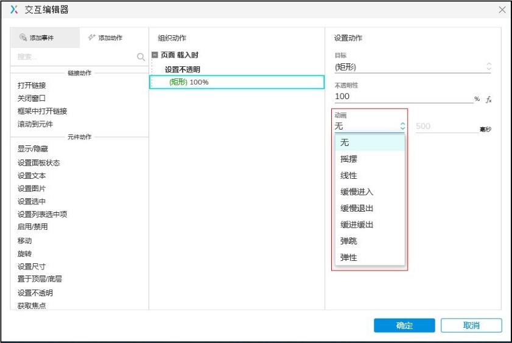

▲图4-36 运动效果

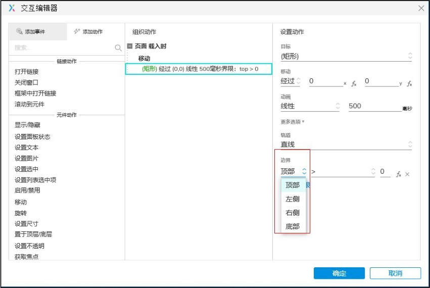

图4-37 设置边界

