## Axure RP 9的常用元件

### **4.4.1**

#### **动态面板**

动态面板是一个容器。多个小元件组成的集合称为状态，多个状态的集合构成动态面板。动态面板每次只能呈现一个状态，状态的可见性由动态面板的“设置面板状态”交互功能控制。因此，动态面板非常适合创建轮播图或者侧边栏。

动态面板是Axure RP 9中唯一具有拖动属性和滑动属性的元件，也是唯一可以固定到浏览器中的元件，在滚动页面时该动态面板不会随之移动。因此它是作为导航栏和侧边栏的最佳选择。

#### **1.创建动态面板**

微课视频

动态面板的使用

① 创建动态面板的第一种方法：在元件库中找到“动态面板”元件，将其拖入画布中，松开鼠标左键即可创建动态面板，如图4-38所示。

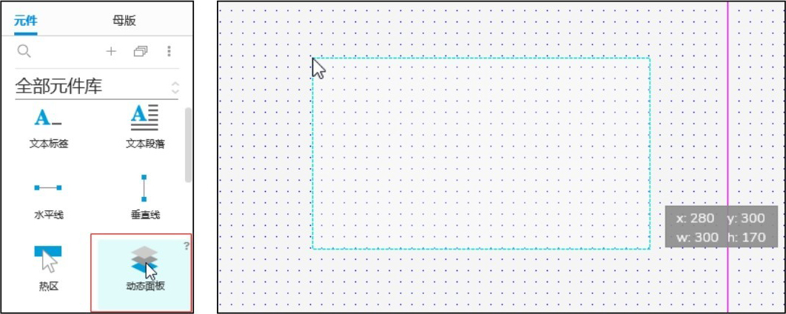

图4-38 创建动态面板

注意：默认情况下，此动态面板的尺寸是固定的，因此如果希望自动调整大小以适合其包含的内容（其他元件），请勾选“自适应内容”复选框，如图4-39所示。

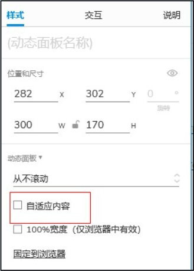

图4-39 “自适应内容”复选框

将动态面板设置为自适应内容，允许其宽度和高度自动调整大小，以适合其包含的元件。当在不同大小的面板状态之间切换时，面板会自动调整大小。

也可取消勾选“自适应内容”复选框选中动态面板，并用鼠标手动调整其大小。

② 创建动态面板的第二种方法：使用现有元件创建，即在画布中选择已经有的元件组合，单击鼠标右键，然后在快捷菜单中选择“转换为动态面板”命令，这种方式更方便、更常见，如图4-40所示。

#### **2.动态面板的遮罩**

默认情况下，动态面板覆盖有蓝色遮罩，以便更容易在画布上被识别。可以在Axure RP 9菜单栏中的“视图→遮罩”中切换遮罩开关，如图4-41所示。

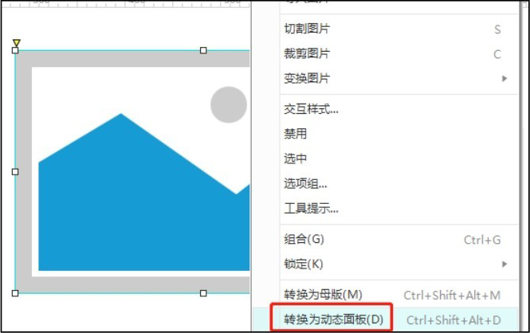

▲图4-40 第二种创建动态面板的方法

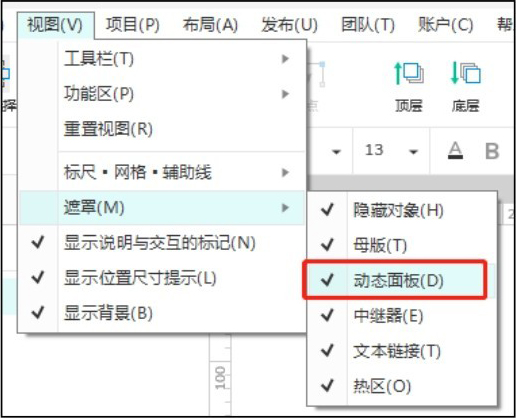

图4-41 动态面板的遮罩

注意：遮罩不会在浏览器中呈现。

#### **3.设置单个面板状态**

双击画布上的动态面板，进入状态编辑模式，会看到一个青色的边框及画布顶部的工具栏指示。

在此模式下，可以在动态面板的每一个状态中添加、删除和编辑包含在单个状态里面的元件，如图4-42所示；还可以通过单击画布右上角的“隔离”按钮来切换外部元件的可见性，如图4-43所示。

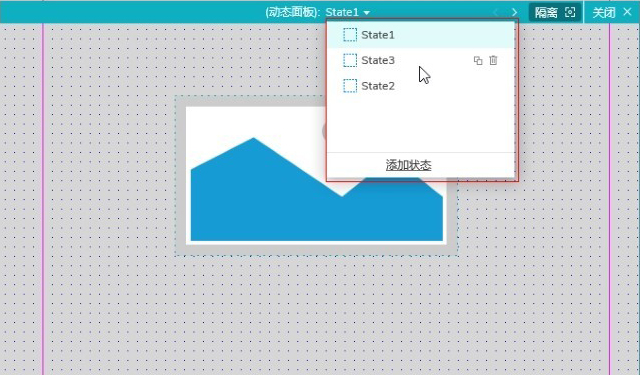

▲图4-42 动态面板单个状态设置

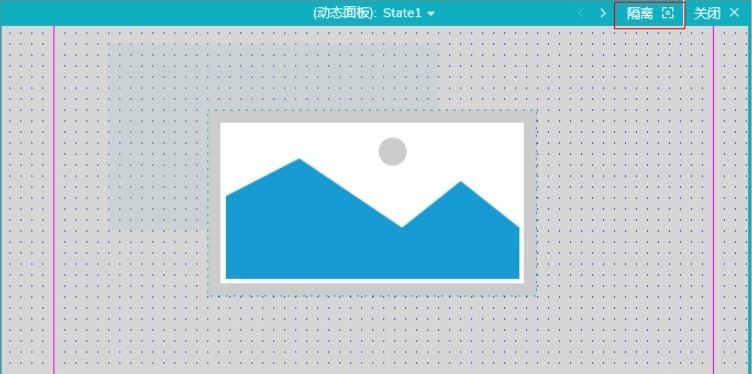

图4-43 “隔离”按钮

#### **4.在“概要”面板中设置动态面板**

在“概要”面板中可以直接选中动态面板中的状态或单个状态包含的元件，然后在画布中编辑选中的元件，如图4-44所示。

在此区域亦可进行状态的复制、删除、新增操作，按住并拖动状态可进行排序，如图4-45所示。

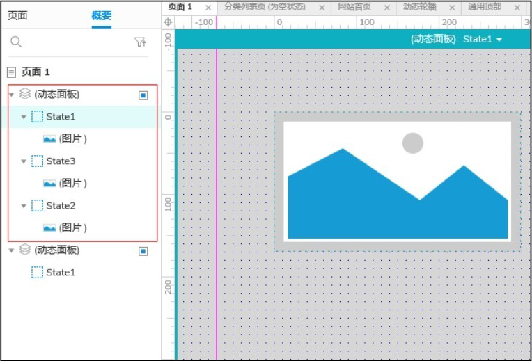

▲图4-44 “概要”面板

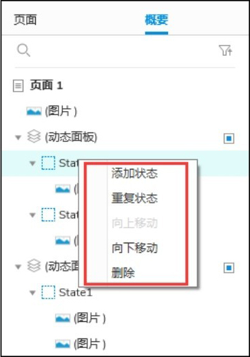

图4-45 动态面板设置

#### **5.从首个状态脱离**

该功能可以使第一个状态从动态面板中脱离，并将该状态所包含的元件全部释放到画布上。使用鼠标右键单击动态面板，在快捷菜单中选择“从首个状态脱离”命令，如图4-46所示。

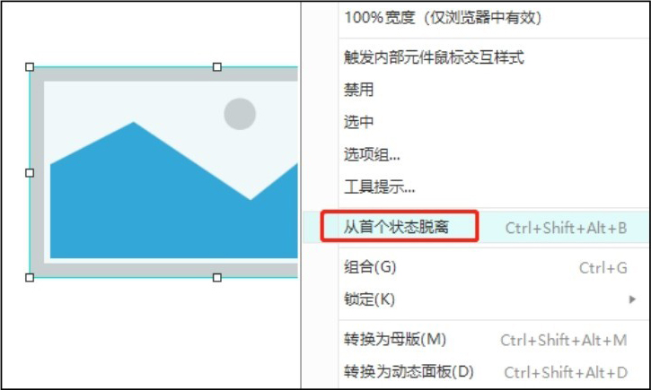

图4-46 “从首个状态脱离”命令

### **4.4.2**

#### **中继器**

中继器是Axure PR 9中一个高级的元件，用于显示文本、图像和其他元素的重复集合。中继器是存放数据集的容器，通常使用中继器来显示商品列表、联系人信息和数据表，容器中的每一个项目称作“item”，由于item中的数据由数据集驱动，因此每一个item可以在展示的时候与其他item不同。

中继器由数据集（可以理解为轻量级的数据库）驱动，因此它可以用来显示动态排序和过滤。中继器元件在Axure左侧的“元件”面板，将其直接拖至画布（中间的区域）中，如图4-47所示。

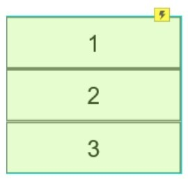

图4-47 中继器元件

选中后双击中继器元件，就会进入中继器编辑界面，如图4-48所示，在这里可以对中继器进行编辑和设置。在“样式”面板中可以对中继器的行数、列数、行中内容进行设置，如图4-49所示。

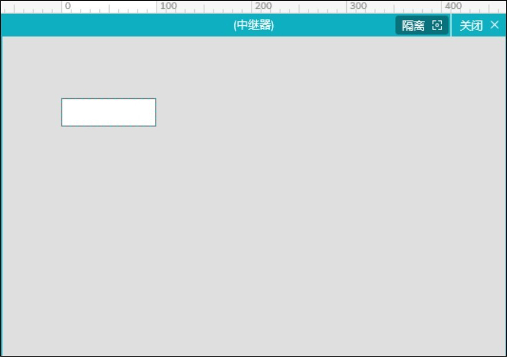

▲图4-48 中继器编辑界面

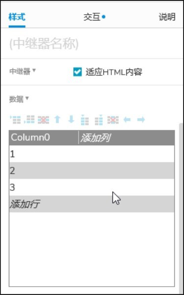

图4-49 “样式”面板

#### **1.间距、布局和分页**

默认情况下，所有中继器的item都是可见的，并在一列中垂直分布，item之间没有空格。可以使用“样式”面板中的“间距”“布局”“分页”中的选项对其进行更改，如图4-50所示。

① 间距：每个item之间的间距像素。

② 布局：可选择水平或垂直布局。

③ 分页：默认情况下中继器不分页，所有数据以水平、垂直或网格的方式显示在界面上。如果从页面布局上不想让中继器占用太多空间，可以对中继器进行分页。

注意：如果分页每页展示数大于item数，则展示直观上只有一页。

#### **2.适应HTML内容**

“适应HTML内容”复选框位于“样式”面板中数据集的正上方，默认情况下处于勾选状态。勾选此复选框后，每个中继器的item将自动调整大小以适合其包含的小部件，如图4-51所示。

如果取消勾选此复选框，则每个中继器的item将保持固定大小，而不管其包含的小组件的大小、位置或可见性是否发生任何更改。如果小部件超出其自身item的固定边界，则动态移动或显示的小部件可能会与其他中继器的item重叠。

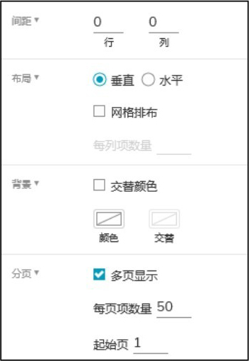

▲图4-50 “间距”“布局”“分页”

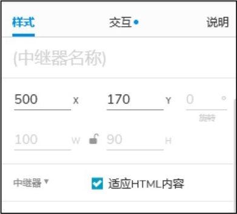

图4-51 “适应HTML内容”复选框

#### **3.中继器的遮罩**

默认情况下，中继器覆盖有绿色遮罩，以使其包含的小部件更容易与画布上的其他小部件区分开来。可以在Axure RP 9菜单栏中的“视图→遮罩”中切换中继器遮罩的开关，如图4-52所示。

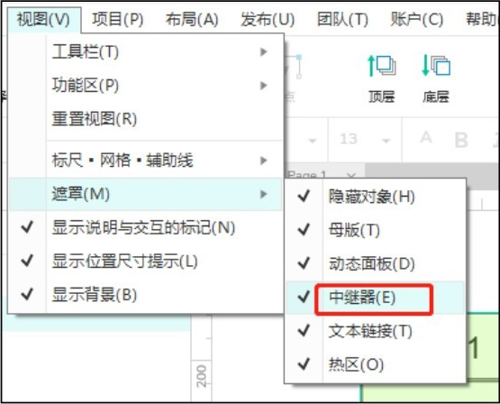

图4-52 中继器的遮罩

在中继器中，文本、矩形图片和其他元素的重复集合称为item。可以直接双击画布上的中继器元件，或者在“概要”面板中直接双击中继器元件或中继器item包含的元件进入item，如图4-53所示。在编辑item时，将只看到其包含的窗口小元件的一个实例，如图4-54所示。

注意：如果进入中继器编辑界面后其他组件对中继器的item有影响，可以通过单击画布右上角的“隔离”按钮来隐藏界面上的其他部件。

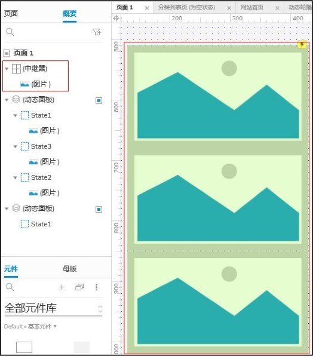

▲图4-53 中继器

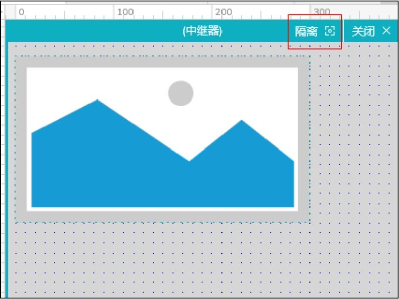

图4-54 中继器编辑界面

#### **4.数据集**

（1）添加数据

控制中继器item数据展示的数据表称为“数据集”。可以在“样式”面板中查看和编辑中继器的数据集。单击“添加列”“添加行”或表格上方的按钮，可以增加行或者列。同时，也可以在下面的单元格中通过右键快捷菜单来增加/减少行或者列，如图4-55所示。

往中继器数据集里导入图片，需要在每行的图片列里单击鼠标右键，选择“导入图片”命令，找到需要的图片，如图4-56所示。

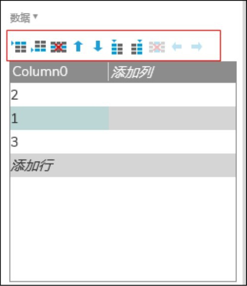

▲图4-55 往中继器数据集中添加数据

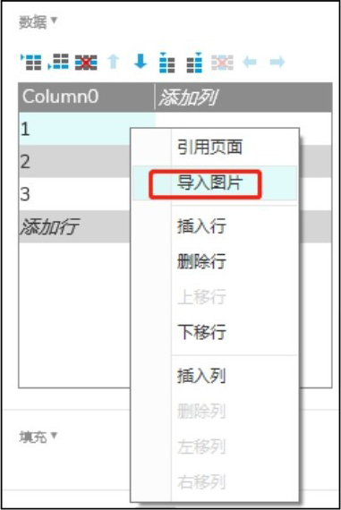

图4-56 往数据集中导入图片

注意：有多少行就说明有多少个重复的item；有多少列就说明有多少个需要传递的变量（数据）。

可以通过按Ctrl+V（Windows）或者CMD+V（macOS）组合键将数据直接粘贴到这里（当然，图片还是需要单独导入的）。

（2）数据集的数据显示

文本的输入：选中右侧数据集中的单元格，输入文本，如图4-57所示。

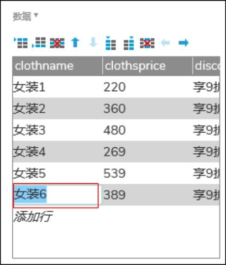

图4-57 往数据集中添加文本数据

文本值在item里面的展示：依次单击“每项加载”→“目标”→“矩形”，然后单击“设置为”→“文本”，单击“fx”按钮，如图4-58所示，在“插入变量或函数”框中选择一个中继器的列名，如图4-59所示，单击“确定”按钮。

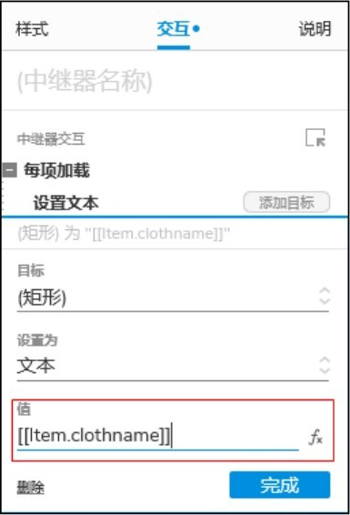

▲图4-58 设置文本

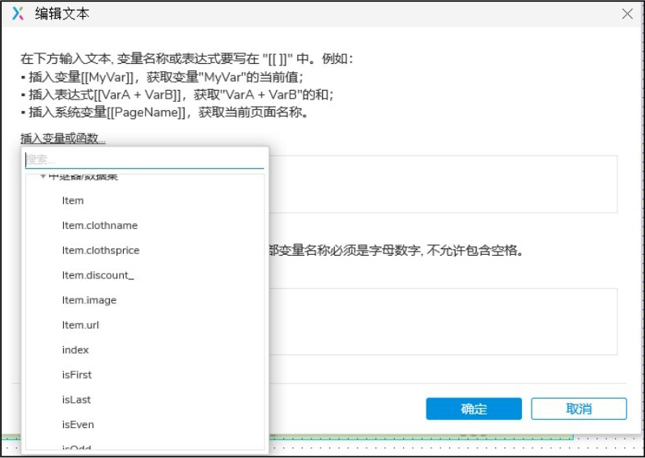

图4-59 选择中继器的列名

### **4.4.3**

#### **内联框架**

内联框架可以将HTML、视频、音频和其他媒体文件嵌入Axure RP 9中，如优酷视频和百度地图，也可以将原型中的其他页面嵌入其中。

在元件库中找到内联框架，将其拖入工作区后松开鼠标左键即可开始使用，如图4-60所示。双击内联框架元件，弹出“链接属性”对话框，如图4-61所示，此处可以选择链接至Axure文件中的其他页面或者外部URL。

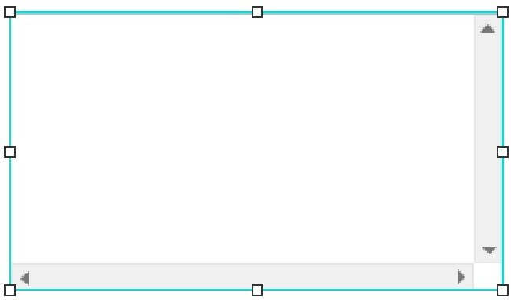

图4-60 内联框架元件

默认情况下，内联框架有边框，可以通过勾选或取消勾选“样式”面板中的“隐藏边框”复选框来显示或隐藏边框，如图4-62所示。当内联框架内的内容超过其本身大小时，可以设置内联框架进行滚动。

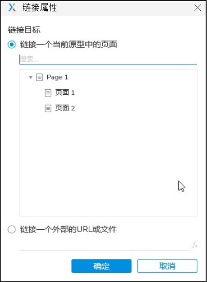

▲图4-61 “链接属性”对话框

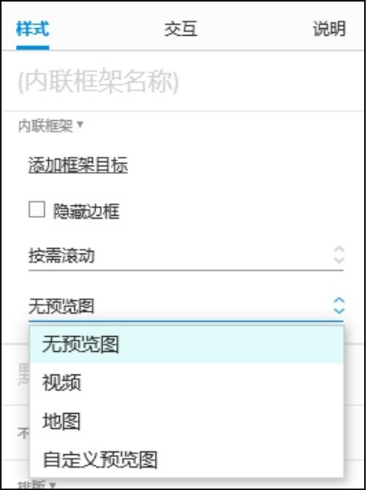

图4-62 “样式”面板

#### **1.内联框架样式**

内联框架中的内容会在Web浏览器中加载，但不会在Axure RP 9的画布中加载，为方便在画布中展示，可对预览的样式进行如下设置。

① 无预览（默认）。

② 视频。

③ 地图。

④ 自定义预览（允许导入自己的图像）。

注意：预览图像仅出现在Axure RP 9的画布上，它不会在网络浏览器中显示。

#### **2.内联框架特殊交互**

可以通过其他元件在内联框架上使用交互事件，如在一个按钮上设置一个鼠标单击时的动作，打开内联框架中的一个链接或者页面，如图4-63所示。注意，在上述操作中可选择在父级框架中打开链接或者页面，此时会在框架的上一级中打开链接，如图4-64所示。

#### **3.内联框架的限制**

① 某些网站可能会被限制应用内联框架，如Yahoo、Facebook。

② 内联框架和框架内的内容页面之间变量的传递在大多数浏览器中不适用。

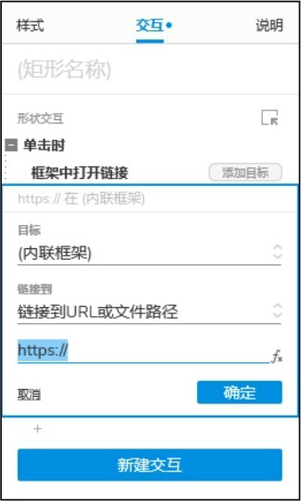

▲图4-63 框架中打开链接

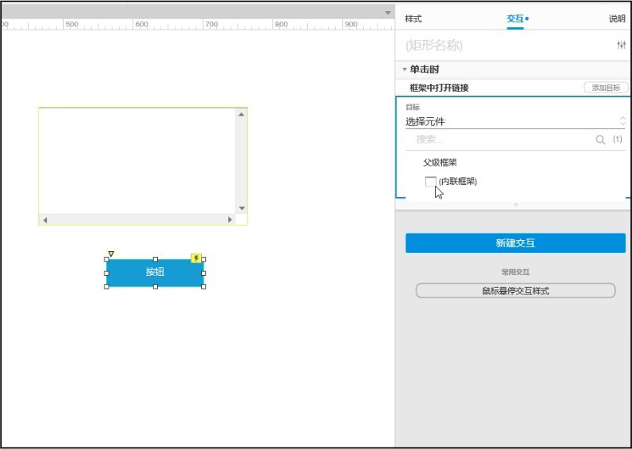

图4-64 添加链接

### **4.5**

