## **查看原型**

当产品经理在Axure RP 9中完成原型设计后，接下来可以在浏览器中预览原型、生成HTML本地文件、生成Word说明书，还可以把原型发布在Axure云中。

### **4.5.1**

### **快速预览原型**

当项目完成后，单击工具栏中的“预览”按钮或按F5键，如图4-65所示，即可在浏览器中查看原型效果。也可在菜单栏中选择“发布→预览”，如图4-66所示。

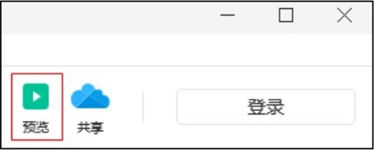

▲图4-65 “预览”按钮

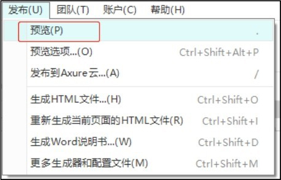

图4-66 “预览”命令

### **4.5.2**

### **预览选项设置**

在进行预览时，会看到默认页面的预览效果，如图4-67所示。选择“Project pages”选项，弹出“站点地图”窗格，如图4-68所示。

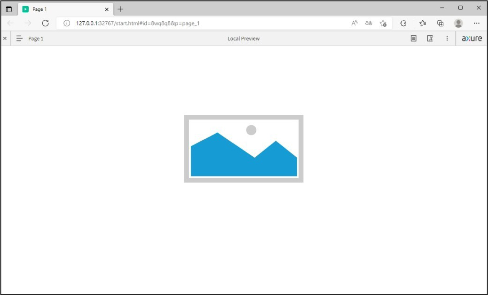

▲图4-67 默认预览

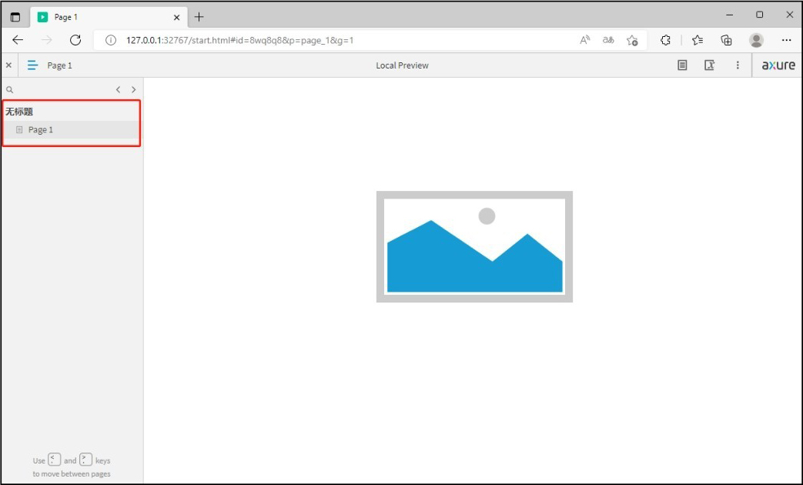

图4-68 “站点地图”窗格

在Axure RP 9中，选择“发布→预览选项”，弹出“预览选项”对话框，如图4-69所示。在此对话框中可以设置在默认情况下，用哪种浏览器进行原型预览。

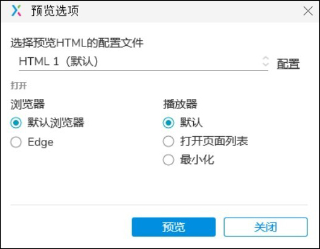

图4-69 “预览选项”对话框

### **4.5.3**

### **生成HTML文件**

选择“发布→生成HTML文件”，如图4-70所示，弹出“发布项目”对话框，选择想要保存项目的位置，如图4-71所示。单击“发布到本地”按钮即可把项目生成为HTML文件，在默认浏览器预览该原型。

“发布项目”对话框中有配置默认HTML生成器的选项。可以创建多个HTML生成器，在大型项目中将图形切成多个部分输出，以加快生成的速度。生成之后可以在Web浏览器中查看。

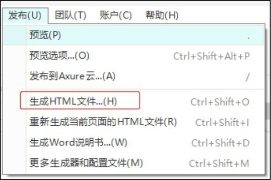

▲图4-70 选择“生成HTML文件”命令

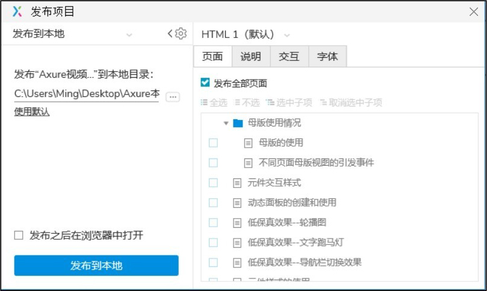

图4-71 “发布项目”对话框

可以在菜单栏中选择“发布→更多生成器和配置文件”，弹出“生成器配置”对话框，如图4-72所示。双击其中的选项，会弹出更多设置对话框，用于对生成器进行设置。例如双击“打印”选项，可以在弹出的对话框中完成更多设置，如图4-73所示。

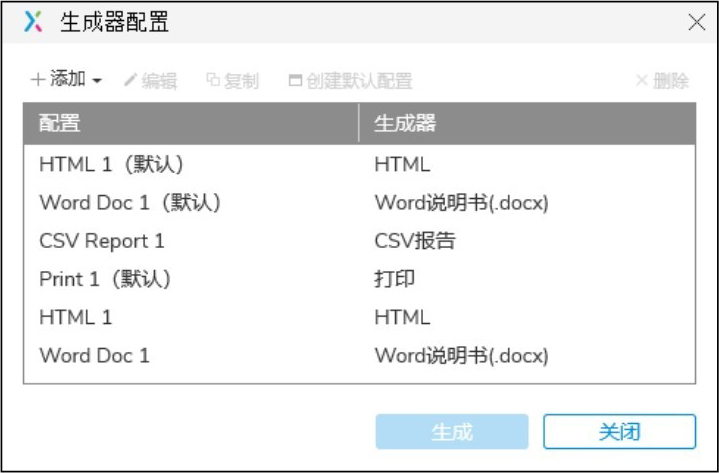

▲图4-72 “生成器配置”对话框

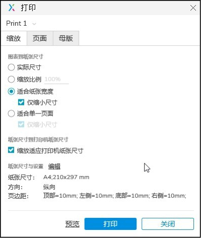

图4-73 打印设置

### **4.5.4**

### **生成Word说明书**

选择“发布→生成Word说明书”，弹出“生成说明书”对话框，如图4-74所示。

在“生成说明书”对话框中，选择“页面”选项卡，可以设置生成说明书的页面选项，如图4-75所示。

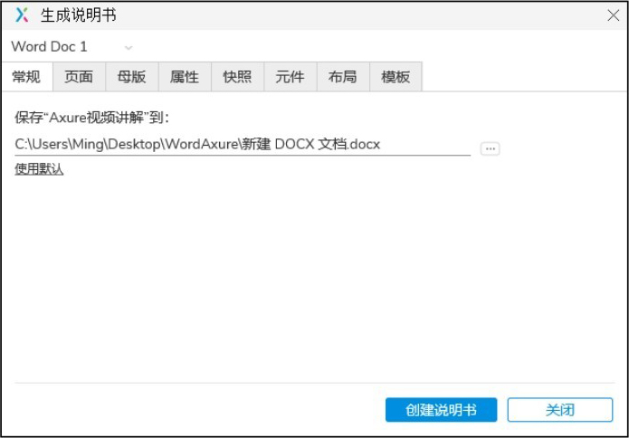

▲图4-74 “生成说明书”对话框

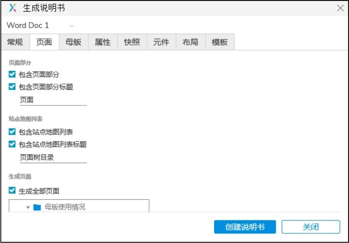

图4-75 页面设置

在“母版”选项卡中，可以选择Word文档中需要出现的母版及形式，如图4-76所示。在“属性”选项卡中，可以选择生成时需要包含的页面，而且该选项卡还提供了多种选项和配置页面信息，这些配置可以应用于Axure文件中所有的页面，如图4-77所示。

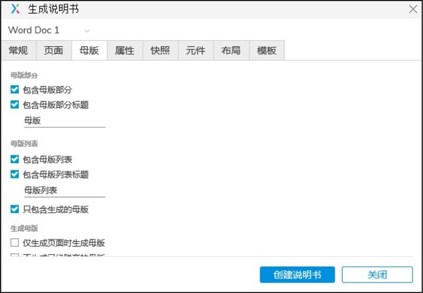

▲图4-76 “母版”选项卡

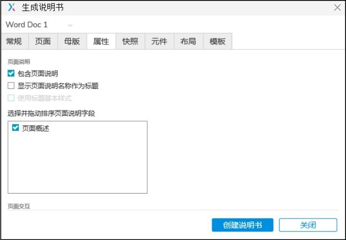

图4-77 “属性”选项卡

在“快照”选项卡中，Axure RP 9生成Word文档功能特别节省时间的原因是它可以自动生成所有页面的快照，如图4-78所示。在“元件”选项卡中，提供了多种元件表选项配置功能，可以对Word文档中包含的元件说明信息进行管理，如图4-79所示。

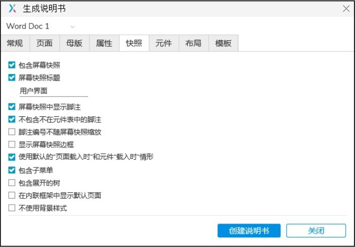

▲图4-78 “快照”选项卡

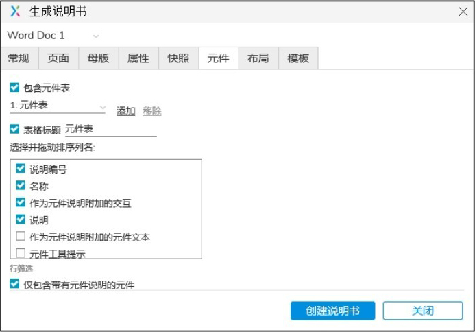

图4-79 “元件”选项卡

在“布局”选项卡中，可以对Word文档页面布局进行选择，如图4-80所示。而在“模板”选项卡中，Axure RP 9会使用一个Word模板，基于前面格式选项的设置，将所有内容组织起来，在Word模板中可以导入模板，还可以创建模板，如图4-81所示。

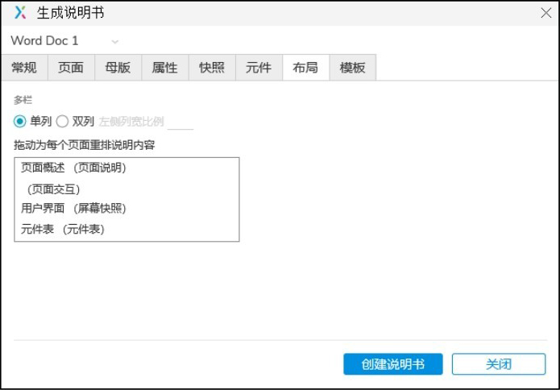

▲图4-80 “布局”选项卡

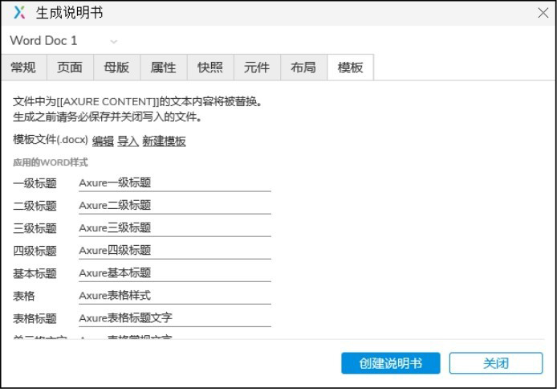

图4-81 “模板”选项卡

### **4.6**

