## **项目实施**

——Web端“电商平台”产品交互设计开发

学习Axure RP 9原型设计开发工具的最终目的是在Web端原型项目设计开发中可以熟练使用，我们通过以下案例来感受Axure RP 9在交互设计开发中的具体作用。

微课视频

### 制作Web端Banner轮播效果

### **4.6.1**

### **制作Web端Banner轮播效果**

本小节需要设计和制作购物网页的商品轮播图效果，最终效果是通过动态面板元件，让4张商品图片按一定顺序进行循环播放，图片中的圆点也会随着图片的改变而发生相应的变化。

轮播效果实现的原理是，多张图片被放进一个动态面板的不同状态里，图片载入时具有切换动态面板的状态的交互效果。这里使用4张图片来演示效果，将4张图片转换为动态面板，放在4个不同的状态下，4个圆点对应图片状态的一个切换设置，之后需要在交互中进行图片轮流播放的设置，图片切换的效果如图4-82所示。

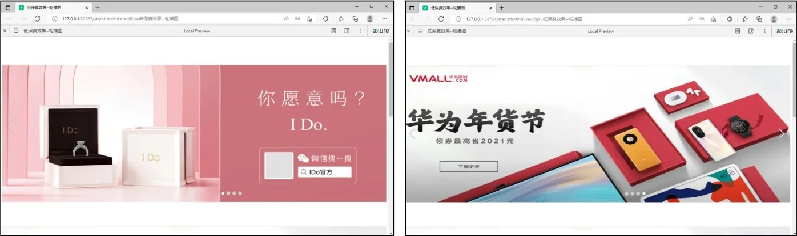

图4-82 商品轮播图的效果展示

制作步骤如下。

#### **1.元件基础样式设置**

① 在元件库中，选中“动态面板”元件，将其拖入工作区内，如图4-83所示。在“交互”面板中，设置动态面板的名称为“轮播”，如图4-84所示。

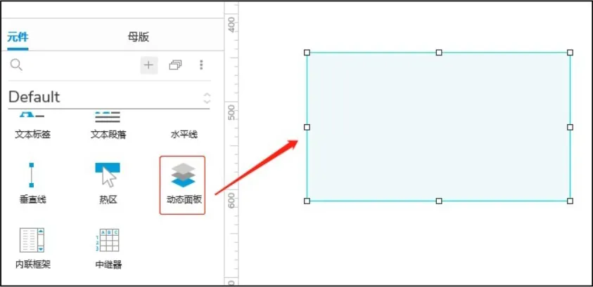

▲图4-83 添加动态面板

图4-84 重命名

② 双击动态面板，进入动态面板的编辑界面，连续单击“添加状态”按钮，新建3个状态，如图4-85所示。在每个状态中都添加一张图片，如图4-86所示。

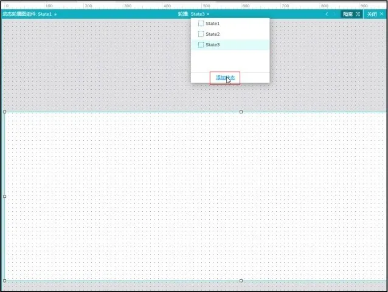

▲图4-85 “添加状态”按钮

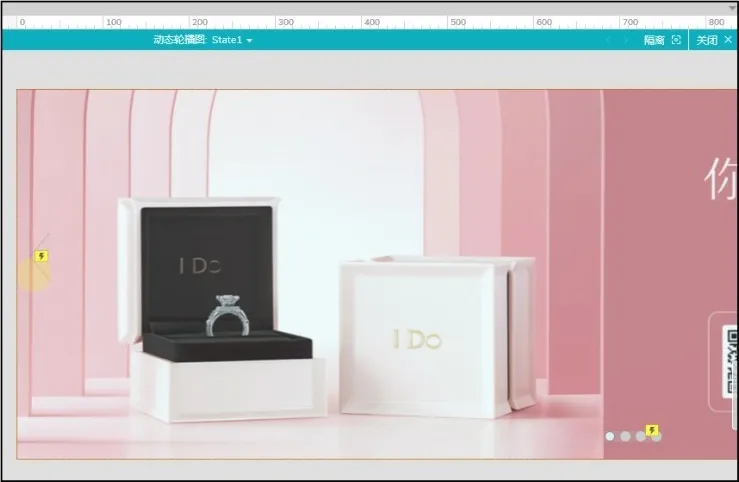

图4-86 添加图片

添加完成后，可以在“概要”面板中看到图片和状态，如图4-87所示。

③ 在左侧元件库中找到“动态面板”元件，将其拖入工作区内，设置名称为“but-one”，如图4-88所示，然后复制状态3次，每个状态中都添加4个圆形，设置大小为12px×12px，然后分别在4个状态中按顺序给代表不同顺序图片的圆形设置一个不同的颜色，其他保持默认颜色，如图4-89所示。

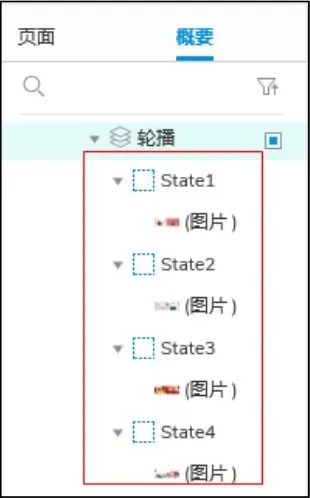

▲图4-87 “概要”面板

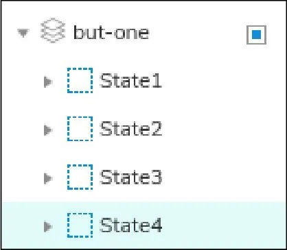

▲图4-88 “but-one”动态面板

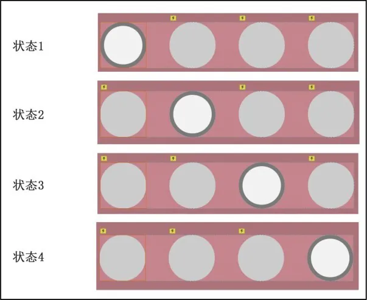

图4-89 4个状态的设置

④ 添加两个控制左/右切换的按钮，并在开始时设置为“隐藏”，如图4-90所示。之后将两个动态面板和控制按钮全部选中并单击鼠标右键，选择“转换为动态面板”命令，命名为“动态轮播图”，如图4-91所示。

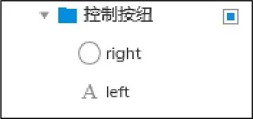

▲图4-90 控制按钮

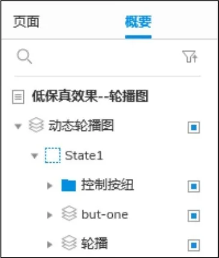

图4-91 最终元件的结构

#### **2.设置元件自动轮播的交互效果。**

① 给“动态轮播图”动态面板添加交互。在“交互”面板中，单击“新建交互”按钮，在下拉列表中选择“鼠标移入时”事件，“目标”设为“控制按钮”，并设置为“显示”，动画效果设为“弹出效果”，如图4-92所示。

② 为“轮播”动态面板添加交互。单击“新建交互”按钮，在下拉列表中选择“载入时”事件，打开“交互编辑器”对话框，选择“设置面板状态”动作，“目标”设为“轮播”，设置详细参数，如图4-93所示。

③ 为“but-one”动态面板添加交互。单击“新建交互”按钮，在下拉列表中选择“载入时”事件，打开“交互编辑器”对话框，选择“设置面板状态”动作，“目标”设为“but-one”，设置详细参数，如图4-94所示。

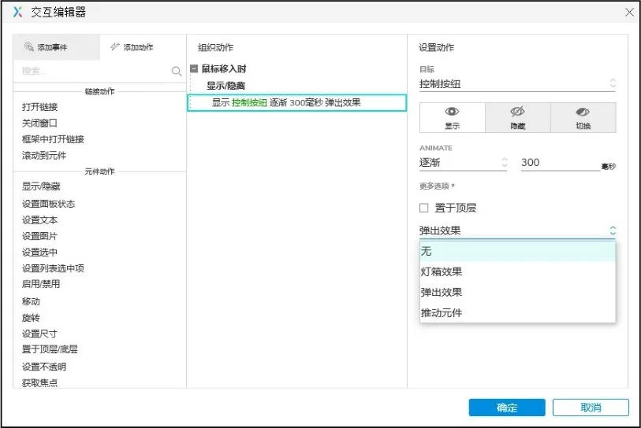

▲图4-92 为“动态轮播图”动态面板添加交互

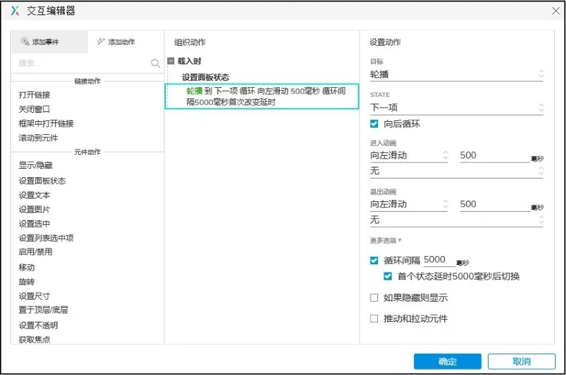

▲图4-93 为“轮播”动态面板添加交互

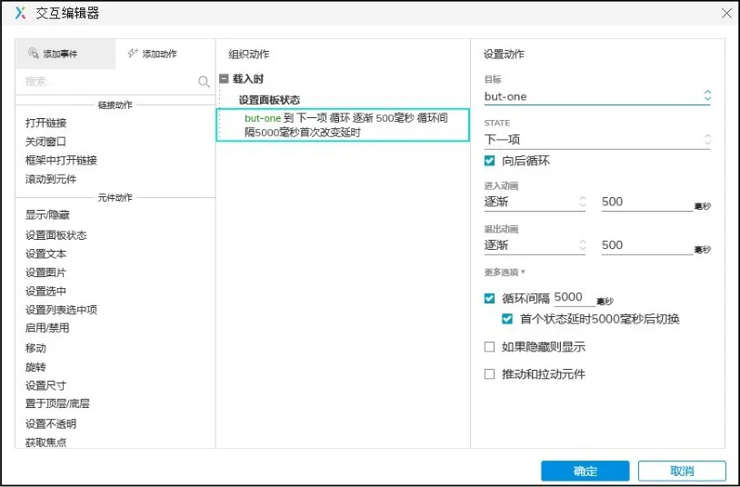

图4-94 为“but-one”动态面板添加交互

④ 设置“控制按钮”以及“but-one”动态面板中图片切换的效果。在“but-one”动态面板中，为4个不同状态里的4个圆形分别添加交互事件。在状态1中，对第二个按钮进行单击交互的设置，单击“新建交互”按钮，在下拉列表中选择“单击时”事件，打开“交互编辑器”对话框，选择“设置面板状态”动作，两个“目标”分别设为“轮播”和“but-one”。因为此时是需要单击某个按钮切换到相应的页面，所以设置的切换状态不需要循环，只需要切换好指定的状态，状态切换完后如果没有交互操作，需要再次让两个动态面板开始重新循环切换状态，参数详细设置如图4-95和图4-96所示。

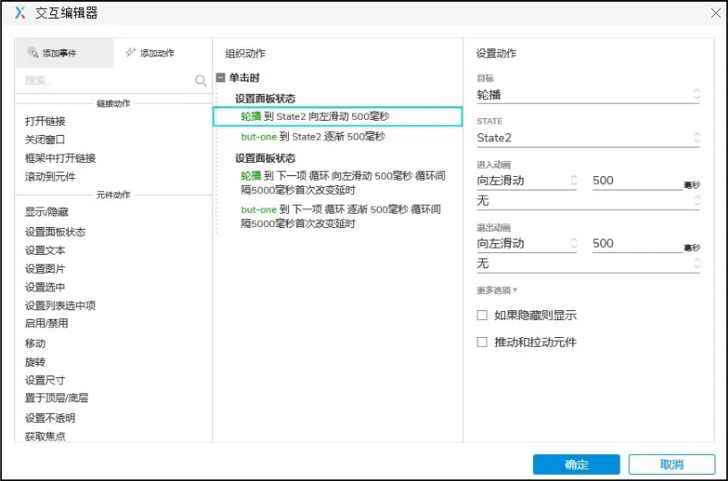

▲图4-95 为状态1的第二个圆形添加交互

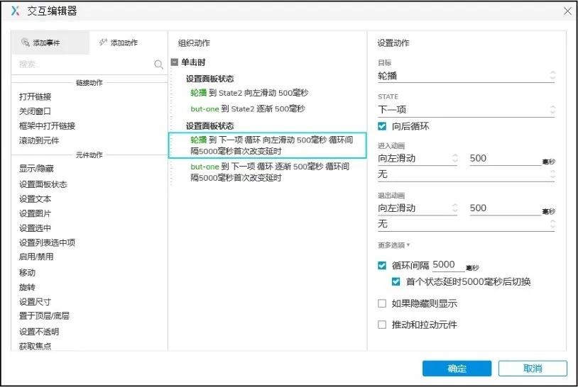

图4-96 单击状态1的第二个圆形后正常循环

⑤ 给状态1中的第三个圆形添加交互动作，如图4-97和图4-98所示。

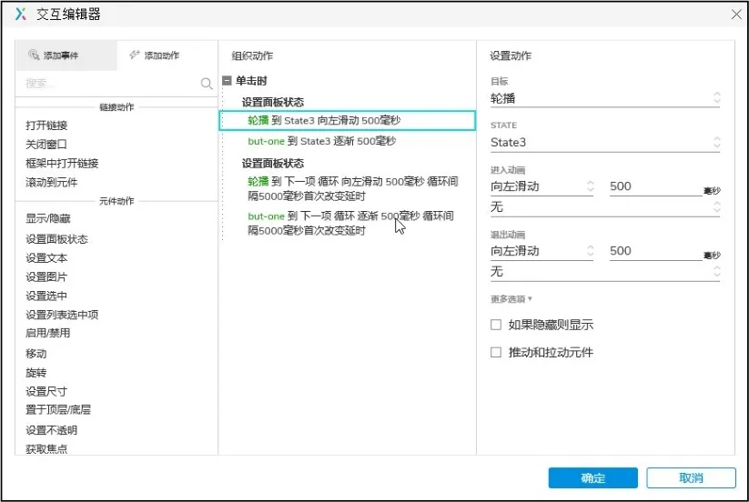

▲图4-97 为状态1的第三个圆形添加交互

图4-98 单击状态1的第三个圆形后正常循环

为状态1中其他圆形添加的交互事件，和为其他3个状态里的圆形添加的交互事件类似，只不过需要注意切换到相应的状态。

给控制按钮中的左右两个箭头添加交互，选中“右箭头”元件，在“交互”面板中，单击“新建交互”按钮，选择“设置面板状态”动作，两个“目标”分别设为“轮播”和“but-one”，参数详细设置如图4-99和图4-100所示。“左箭头”的设置跟“右箭头”的设置除了切换状态的顺序和动画方向不一样外，其他都一样。

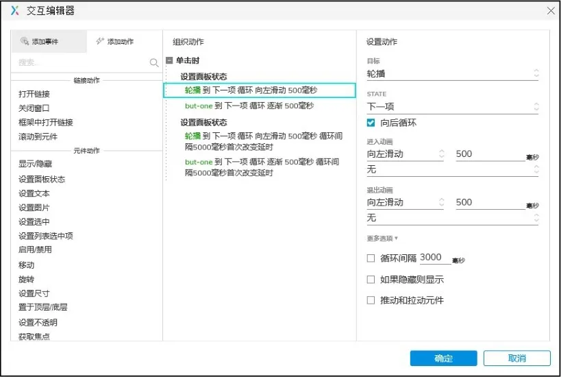

▲图4-99 为控制按钮添加交互

图4-100 未单击控制按钮时正常循环

交互都设置完成后，单击“预览”按钮，打开浏览器预览广告轮播页面，可以发现图片切换和圆形变化是对应的，如图4-101所示。

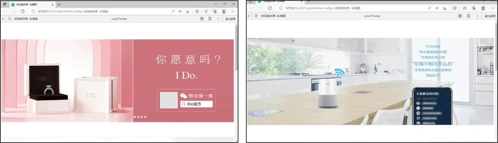

图4-101 预览效果

### **4.6.2**

### **制作悬浮按钮的显示与隐藏效果**

本小节实现在浏览网页时，显示与隐藏某些悬浮按钮的效果。

实现悬浮按钮的显示与隐藏效果的原理是：利用“动态面板”元件，通过交互来切换状态，并根据相应的尺寸进行移动，以及设置动态面板显示的大小。悬浮按钮的显示与隐藏效果如图4-102所示。

图4-102 悬浮按钮的显示与隐藏效果

制作步骤如下。

#### **1.元件基础样式设置**

① 利用元件库提供的元件搭建一个悬浮按钮，设置尺寸为50px×50px，如图4-103所示。再制作一个用于弹出的工具按钮，尺寸为130px×130px，如图4-104所示。这两个尺寸在添加交互功能时会用到，所以在设置尺寸时尽量设置成比较好计算的尺寸。

▲图4-103 悬浮按钮

图4-104 工具按钮

② 选中悬浮按钮，单击鼠标右键，在弹出的快捷菜单中选择“转换为动态面板”命令，如图4-105所示。设置名称为“悬浮按钮”，如图4-106所示。

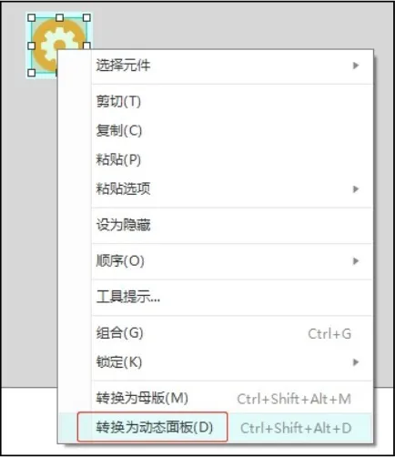

▲图4-105 将悬浮按钮转换为动态面板

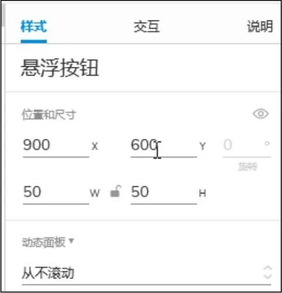

图4-106 将动态面板命名为“悬浮按钮”

③ 双击“悬浮按钮”动态面板，进入动态面板编辑界面，在顶部单击“添加状态”按钮，并将其命名为“工具按钮”，如图4-107所示。状态添加完后，把之前做的工具按钮放进动态面板的“工具按钮”状态里，并注意一下此时的位置为（0,0），如图4-108所示。

动态面板设置完成后，为了能在浏览器中有一个直观的感受，在元件库中找到“矩形”元件，将其拖入工作区，命名为“背景”，设置尺寸为960px×660px，如图4-109所示。把“悬浮按钮”动态面板放在背景的右下角，“悬浮按钮”动态面板所在位置为（900,600），如图4-110所示。

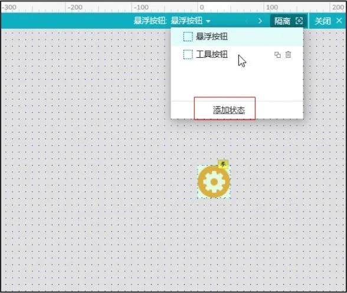

▲图4-107 添加工具按钮状态

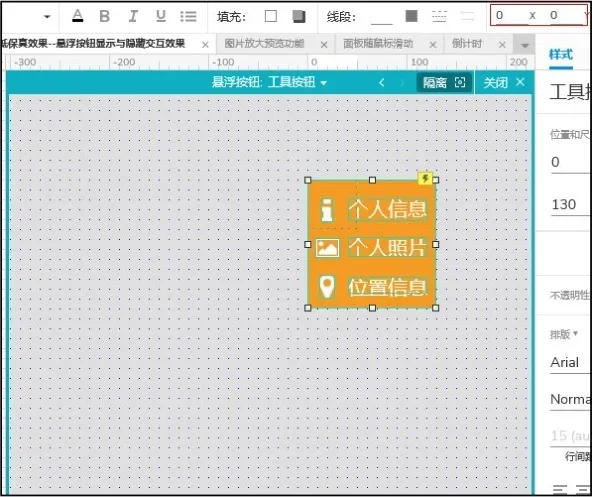

▲图4-108 将工具按钮放入“工具按钮”状态里

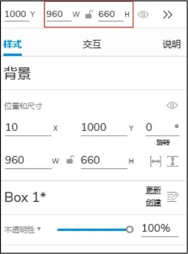

▲图4-109 背景设置

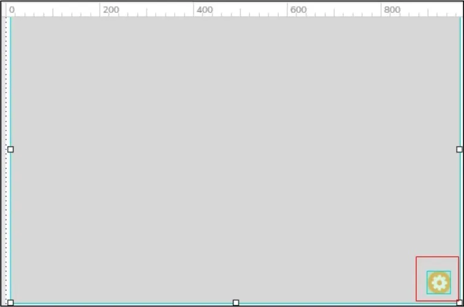

图4-110 设置“悬浮按钮”动态面板位置

#### **2.元件设置交互效果**

① 进行交互的设定。双击“悬浮按钮”动态面板，进入悬浮按钮状态，为悬浮按钮覆盖一个热区：在元件库中找到“热区”元件，将其拖入工作区中，调整“热区”的尺寸，使其完全覆盖“悬浮按钮”动态面板的区域。设置完之后，在“热区”的“交互”面板中，单击“新建交互”按钮，在下拉列表中选择“单击时”事件，打开“交互编辑器”对话框，选择“移动”动作，让“悬浮按钮”动态面板移动到工具按钮状态的中心位置，即“悬浮按钮”动态面板到达（835,535），“目标”设为“悬浮按钮”，参数详细设置如图4-111所示。为了能把移动效果看完，再添加“等待”动作，参数设置详细如图4-112所示。

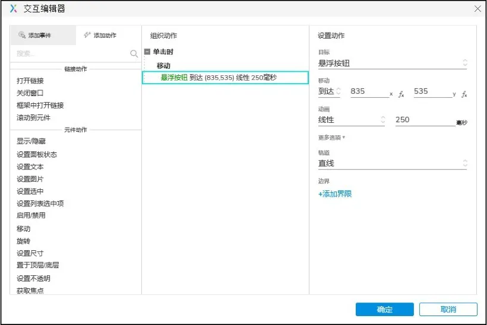

图4-111 “单击时”事件设置移动

② 当“悬浮按钮”动态面板移动到（835,535）后，添加交互动作，设置“悬浮按钮”动态面板切换到工具按钮状态，参数详细设置如图4-113所示。因为“悬浮按钮”动态面板的尺寸为50px×50px，而“工具按钮”尺寸为130px×130px，所以此时是无法完全显示工具按钮的。为了让工具按钮全部显示，并且显示时是从中心向四周伸展显示，需要先把工具按钮状态中的工具按钮的中心放到显示区域的中心，此时工具按钮位置为（-40,-40），再添加“设置尺寸”动作，“目标”设为“悬浮按钮”，参数设置详细如图4-114所示。

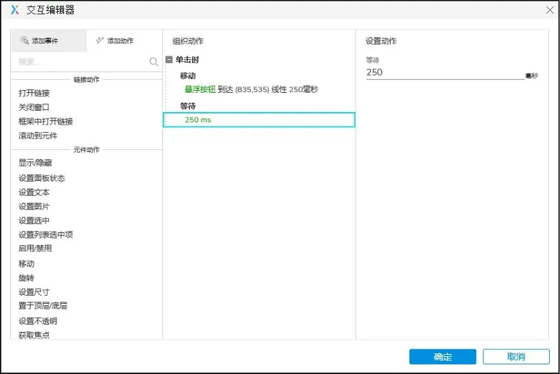

▲图4-112 “单击时”事件设置等待

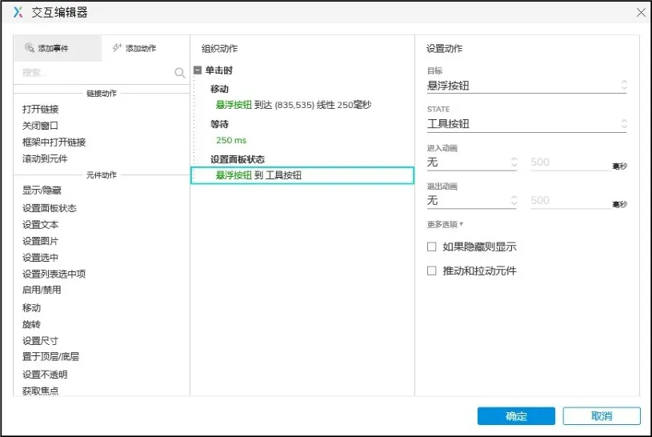

▲图4-113 设置悬浮按钮切换状态

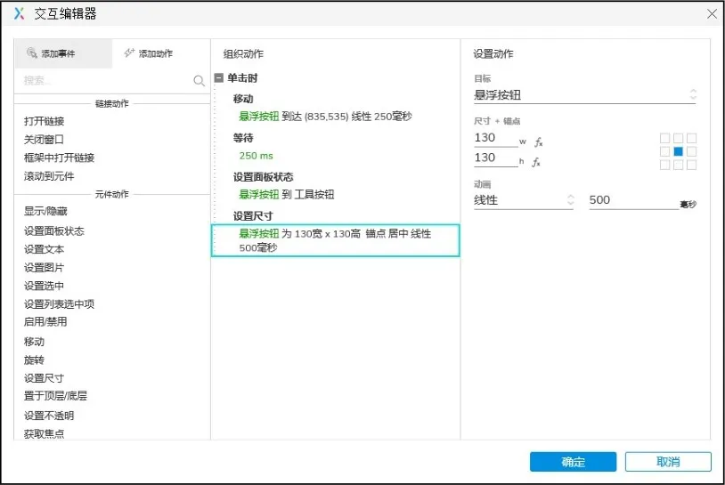

图4-114 设置悬浮按钮显示尺寸

③ 此时由于工具按钮状态中的工具按钮所在位置为（-40,-40），当设置“悬浮按钮”动态面板的尺寸后，它的位置依然会在（-40,-40），有部分在显示区域之外，因此需要再添加“移动”动作，“目标”设为“工具按钮”，参数详细设置如图4-115所示。

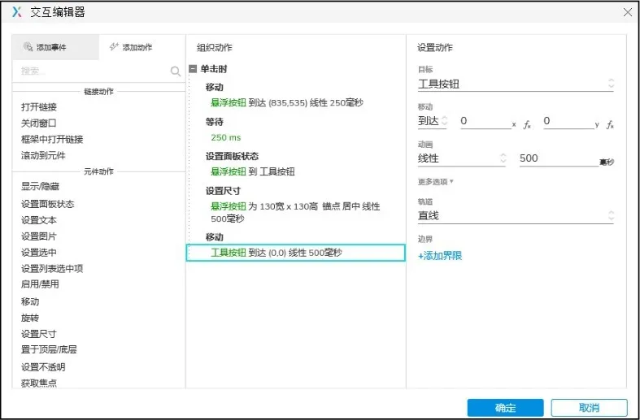

图4-115 设置工具按钮移动到动态面板显示区域

以上是设置工具按钮显示的操作，接下来是隐藏工具按钮的操作，本质上就是把需要显示时设置的交互动作，反着再设置一遍。

④ 在工具按钮状态中的工具按钮的“交互”面板中，单击“新建交互”按钮，选择“单击时”事件，添加“设置尺寸”动作，“目标”设为“悬浮按钮”，参数详细设置如图4-116所示。此时需要把工具按钮状态中的工具按钮的中心移到“悬浮按钮”动态面板的显示区域的中心位置，工具按钮的位置为（-40,-40），参数详细设置如图4-117所示。

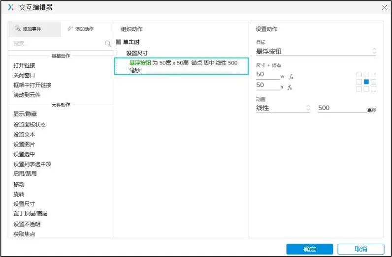

▲图4-116 设置尺寸

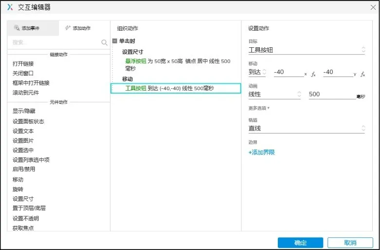

图4-117 移动工具按钮

⑤ 为了把设置的动作完整看完，需要添加“等待”动作，参数详细设置如图4-118所示。此时“悬浮按钮”动态面板的尺寸已经恢复到了原来的50px×50px，可以添加“设置面板状态”动作，设置“悬浮按钮”动态面板，切换面板状态到悬浮按钮状态，参数详细设置如图4-119所示。

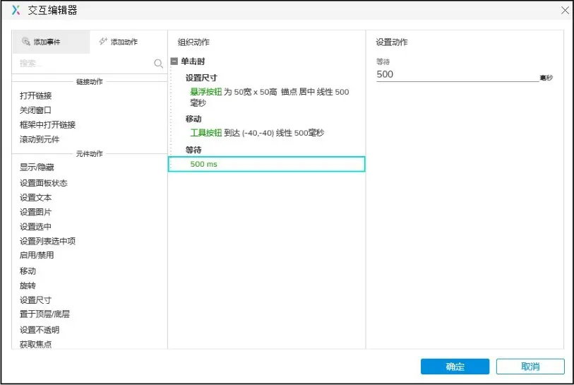

▲图4-118 设置等待

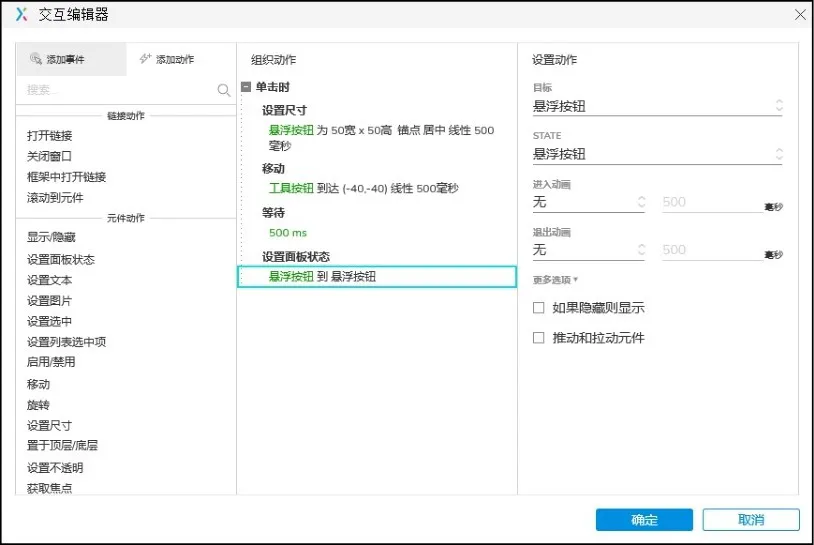

图4-119 设置面板状态

⑥ 此时所有的状态都已经恢复到开始的设置，最后一步需要把“悬浮按钮”动态面板移动到背景的右下角，即（900,600）处，因此添加“移动”动作，“目标”设为“悬浮按钮”，参数详细设置如图4-120所示。

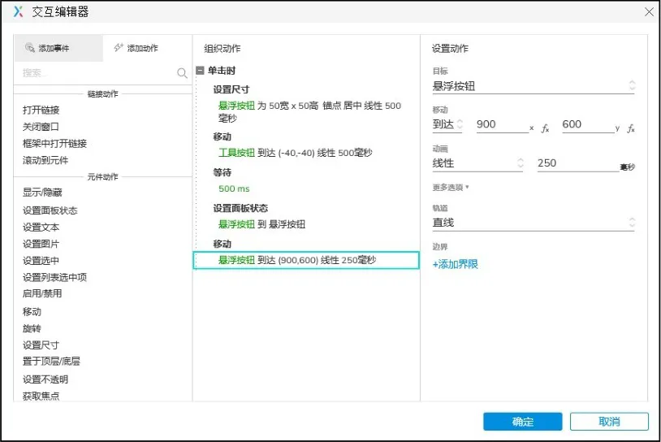

图4-120 设置悬浮按钮的移动

交互都设置完成后，单击“预览”按钮，打开浏览器预览悬浮按钮的显示与隐藏效果，如图4-121所示。

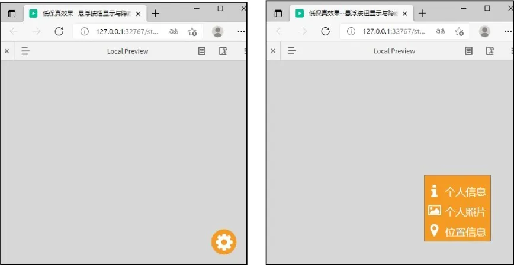

图4-121 悬浮按钮的显示与隐藏效果

### **4.6.3**

### **制作文字跑马灯效果**

微课视频

### 制作文字跑马灯效果

本小节实现浏览网页时，文字的跑马灯效果：一段文字沿着一个方向进行移动显示，等文字完全移出显示区域后，再从开始位置移动显示，如此循环。图4-122所示为文字跑马灯效果展示。

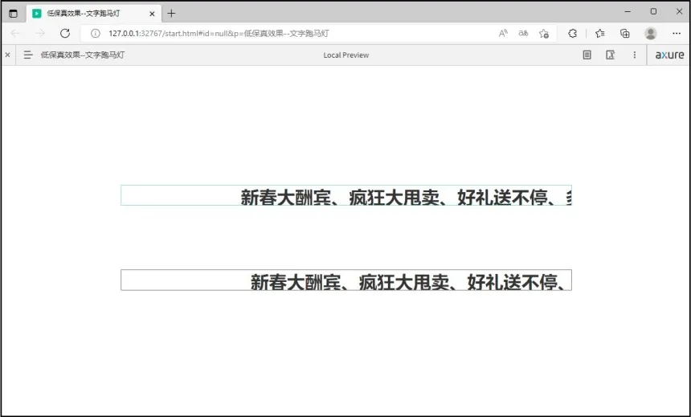

图4-122 文字跑马灯

制作步骤如下。

#### **1.元件基础样式设置**

① 在左侧元件库中找到“动态面板”元件，如图4-123所示，将其拖入工作区，在“样式”面板上，将其重命名为“广告文字动态面板”，如图4-124所示。

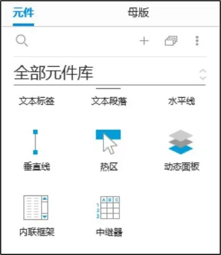

▲图4-123 找到“动态面板”元件

图4-124 重命名

② 双击“广告文字动态面板”，进入动态面板编辑界面，单击“动态面板”的状态1，在左侧元件库中找到“文本”元件，将其放入“动态面板”的状态1中，如图4-125所示，然后给“文本”元件添加一段广告文字内容，根据需要调整文本的样式，如图4-126所示。

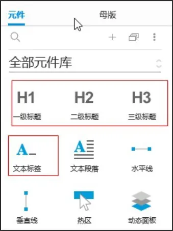

▲图4-125 “文本”元件

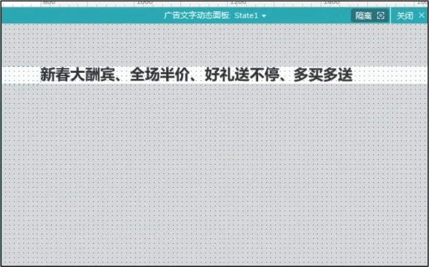

图4-126 添加广告文字

③ 文字内容设置完成后，“文本”元件的尺寸为800px×37px，如图4-127所示，设置“广告文字动态面板”显示区域的尺寸为800px×37px，如图4-128所示。尺寸设置完之后就能保证“广告文字”可以在一次循环中全部在“广告文字动态面板”的显示区域完全显示出来。

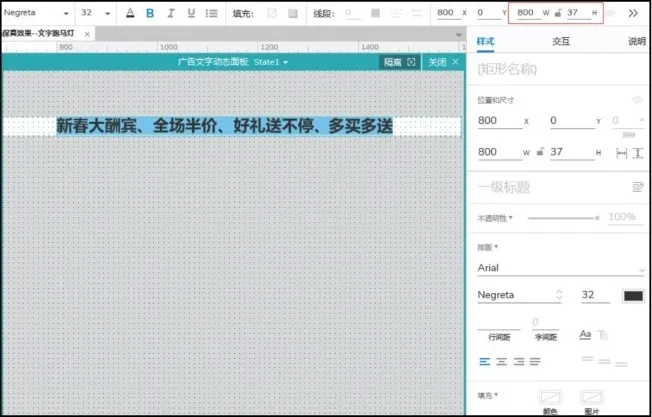

▲图4-127 “文本”元件的尺寸

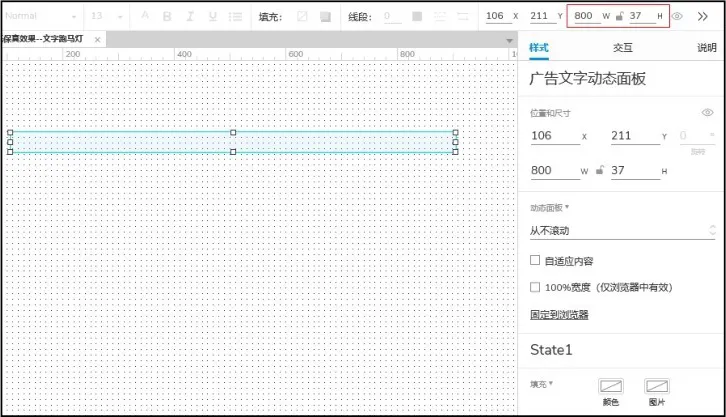

图4-128 “广告文字动态面板”显示区域的尺寸

文本尺寸设置完成后，调整“文本”元件的位置到“广告文字动态面板”显示区域外边，由于“广告文字动态面板”显示区域的尺寸是800px×37px，所以“文本”元件位置设置为（800,0），如图4-129所示。

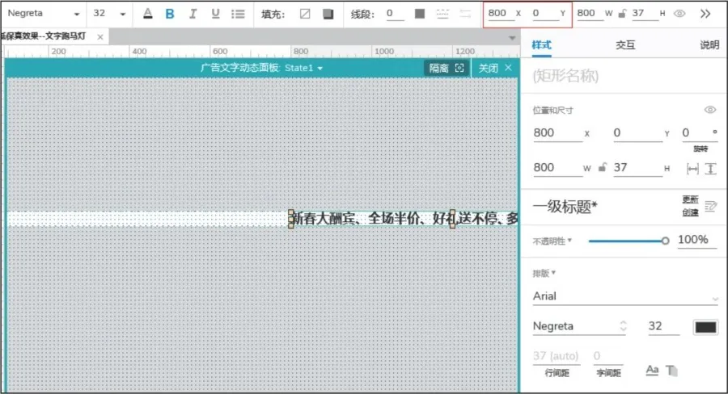

图4-129 “文字”元件位置设置

④ 要实现“文本”元件循环移动的效果，需要“文本”元件不停地移动，因此需要不停地设置“文本”元件的位置。此时需要一个不停检测的功能，这个功能可以利用“动态面板”在“载入时”的“设置面板状态”交互事件，在后续“状态改变时”进行不断的循环检测。

添加一个“动态面板”元件，尺寸不需要太大，可以设置得很小，因为需要切换状态，所以“动态面板”元件至少要有两个状态，如图4-130所示，将其命名为“循环”，如图4-131所示。

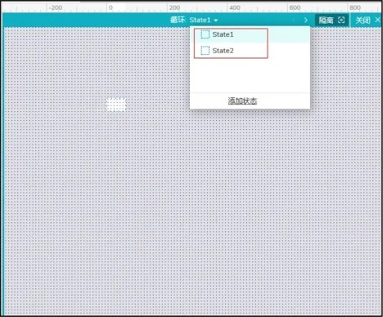

▲图4-130 添加状态

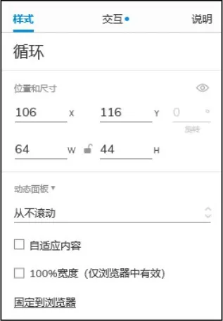

图4-131 命名为“循环”

#### **2.元件交互效果设置**

① 元件的尺寸和内容设置完成后开始进行移动控制。选中“循环”动态面板，在“交互”面板中，单击“新建交互”按钮，在下拉列表中选择“载入时”事件，打开“交互编辑器”对话框，选择“设置面板状态”动作，“目标”设为“当前”，勾选“向后循环”让“循环”动态面板不断循环切换面板状态，参数详细设置如图4-132所示。

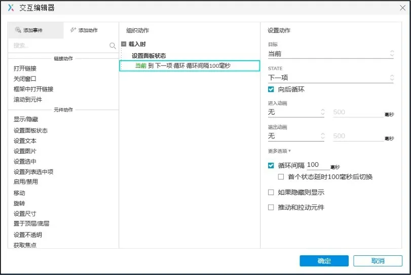

图4-132 设置“循环”状态面板的切换状态

② 设置完“循环”状态面板切换状态后，开始移动“文本”元件，接着给“循环”状态面板添加“状态改变时”动作，此时需要注意的是，在进行循环移动“文本”元件时，需要判断“文本”元件所处的位置，如在开始时，“文本”元件的位置为（800,0），此时需要向左移动“文本”元件进行显示，直到完全移出“广告文字动态面板”的显示区域，此时判断“文本”元件位置是否到达（-800,0），然后把“文本”元件放回初始位置点，开启第二个循环移动周期。在“状态改变时”中开启“情形”，第一个情形判断“文本”元件位置的x坐标是否为800，如图4-133和图4-134所示。

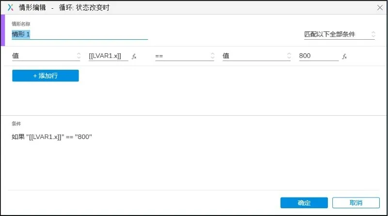

▲图4-133 添加情形1

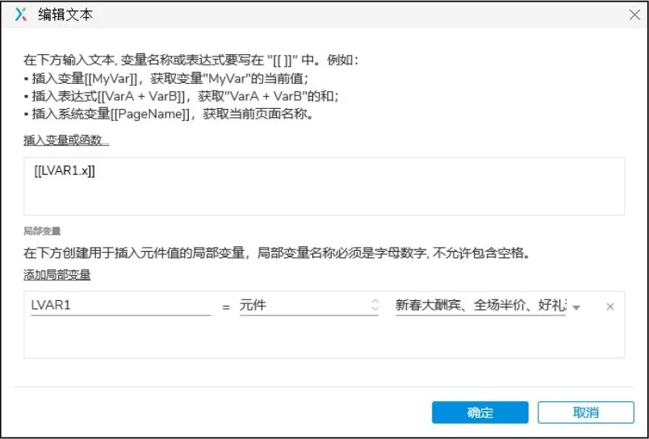

图4-134 设置情形1判断的元件

③ 在“情形1”中设置“移动”动作，“目标”设为“文本”，参数详细设置如图4-135所示。注意在“移动”动作中，选择“到达”一个位置，而不是“经过”一个位置。“到达”是元件移动到指定的坐标位置，是一个绝对位置；而“经过”是从现有位置开始移动一定距离后的位置，是相对位置的改变，这两个是有区别的。

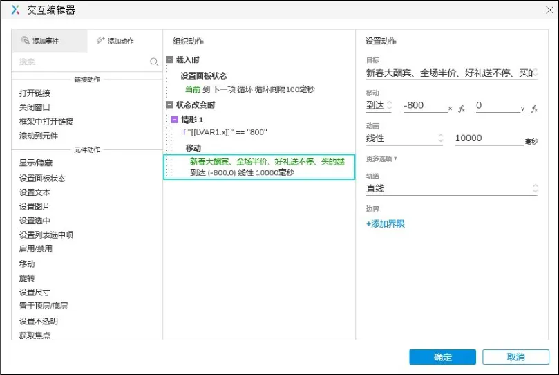

图4-135 移动文本元件

④ 添加“情形2”，判断“文本”元件位置的x坐标是否为-800，如图4-136和图4-137所示。

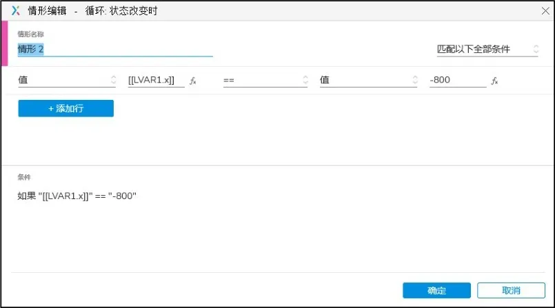

图4-136 添加情形2

⑤ 在“情形2”中设置“移动”动作，“目标”设为“文本”元件，参数详细设置如图4-138所示。

此时需要的是“文件”元件直接到达初始位置，所以不需要动画效果。

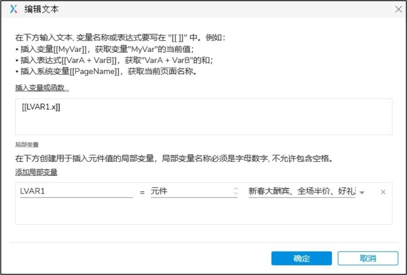

▲图4-137 设置情形2判断的元件

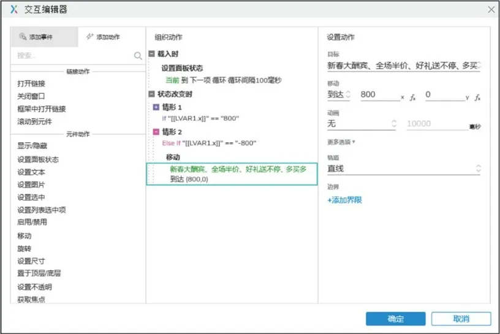

图4-138 移动“文本”元件到初始位置

交互都设置完成后，单击“预览”按钮，打开浏览器预览文字跑马灯效果，如图4-139所示。

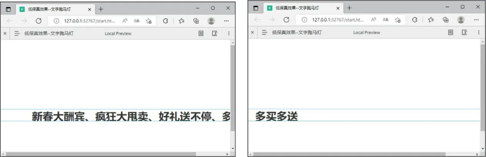

图4-139 文字跑马灯预览效果

### **4.6.4**

### **制作商品列表页**

微课视频

### 制作商品列表页

本小节设计和制作展示商品的页面，使用“中继器”元件和“样式”面板中的数据栏目，对4个商品进行特定的展示，展示内容包括商品名称、商品价格、商品图片和商品链接等，如图4-140所示。

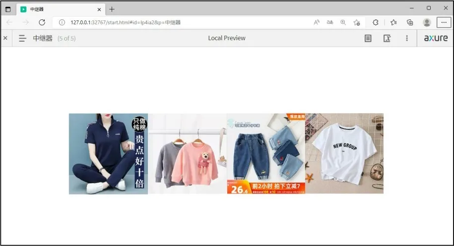

图4-140 商品展示效果

制作步骤如下。

#### **1.元件基础样式设置**

① 在左侧的元件库中找到“中继器”元件，将其拖入工作区，重命名为“商品列表”，如图4-141所示。

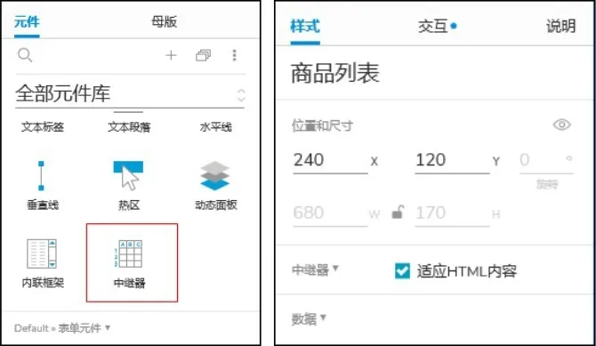

图4-141 添加“中继器”元件

② 双击“中继器”元件，进入中继器编辑器界面，调整中继器的大小，如图4-142所示。

③ 在中继器中添加一个“图片”元件、两个“文本标签”元件，并为各个元件重命名，如图4-143所示。

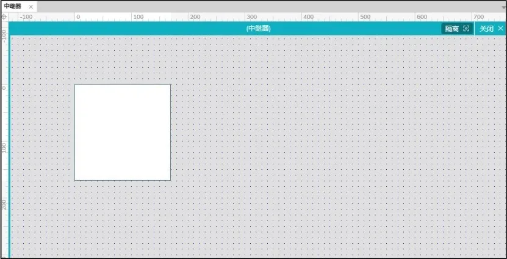

▲图4-142 编辑中继器

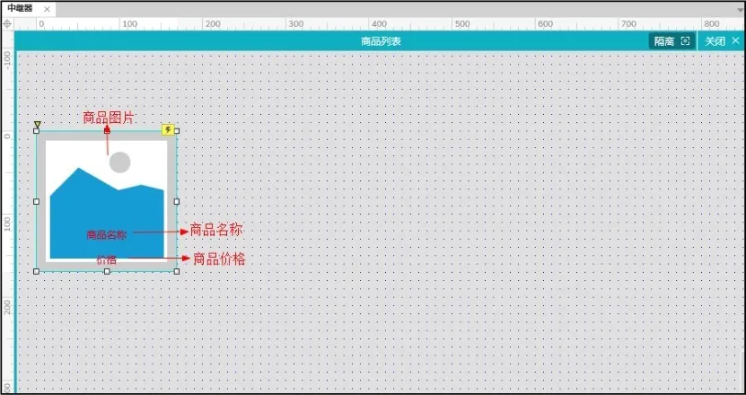

图4-143 添加元件

④ 在“样式”面板中，设置“数据”栏中的表格参数，让各行名称与元件名称保持对应，在每个表格中添加相应的商品信息，如图4-144所示。设置完成后，在“image”列中单击鼠标右键，在弹出的列表中选择“导入图片”命令，逐一导入图片，如图4-145所示。

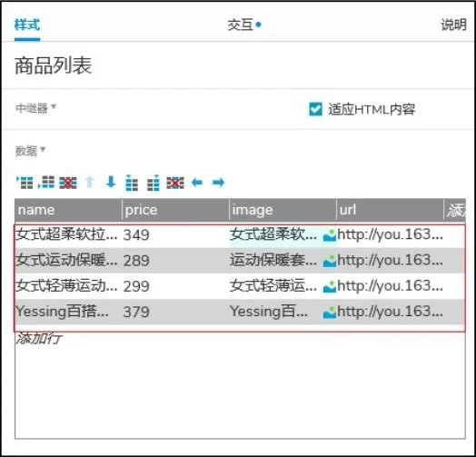

▲图4-144 添加商品信息

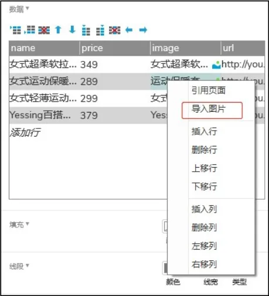

图4-145 导入商品图片

#### **2.元件交互效果设置**

① 元件基础样式设置完成后，找到“交互”面板，单击“新建交互”按钮，在下拉列表中选择“每项加载”事件，如图4-146所示。在打开的“交互编辑器”对话框中，再次单击“设置文本”动作，在“设置动作”栏中，单击“fx”按钮，如图4-147所示。

▲图4-146 添加交互

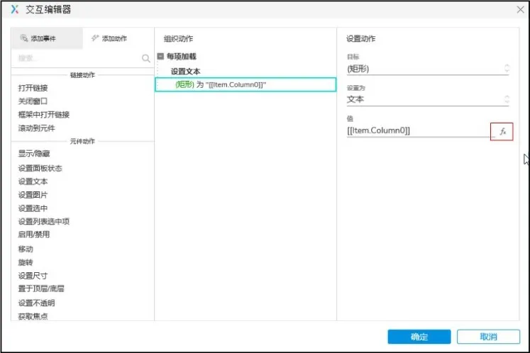

图4-147 设置文本

② 打开“编辑文本”对话框，单击“插入变量或函数”按钮，弹出变量和函数列表，选择“Item.name”选项，如图4-148所示。

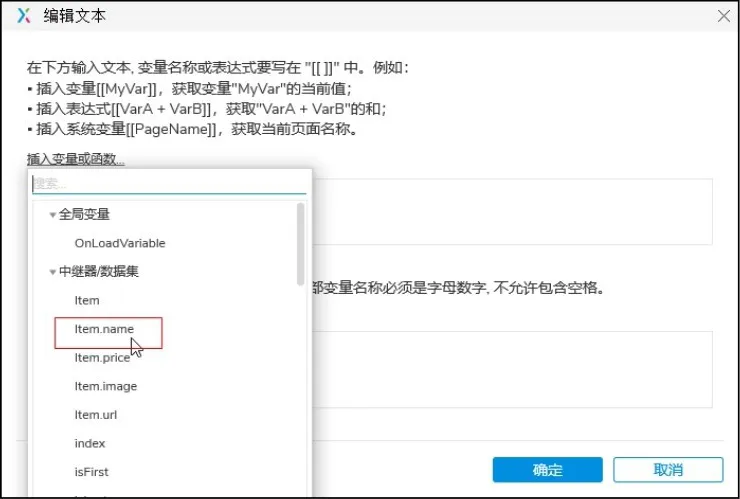

图4-148 添加变量

③ 单击“确定”按钮。回到“交互编辑器”对话框中，可以看到给动作设置的参数，如图4-149所示。

④ 使用之前的方法完成“商品价格”动作的设置，如图4-150所示。

⑤ 添加“设置图片”动作，设置商品图片的“值”为“\[\[Item.image\]\]”，如图4-151所示。设置完成后“，交互”面板如图4-152所示。

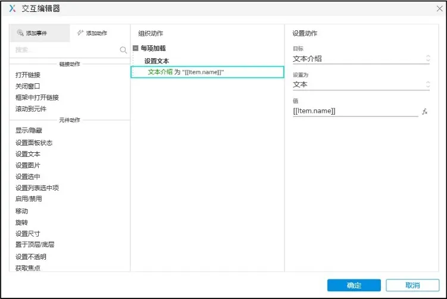

▲图4-149 动作参数

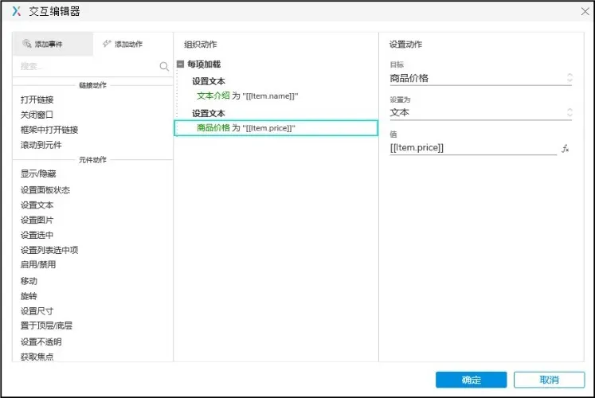

▲图4-150 设置参数

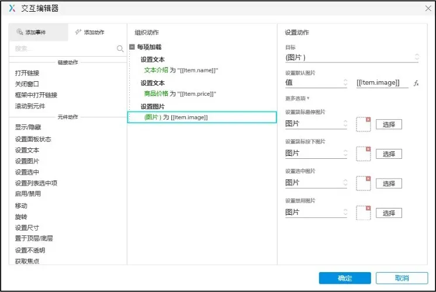

▲图4-151 “设置图片”动作参数

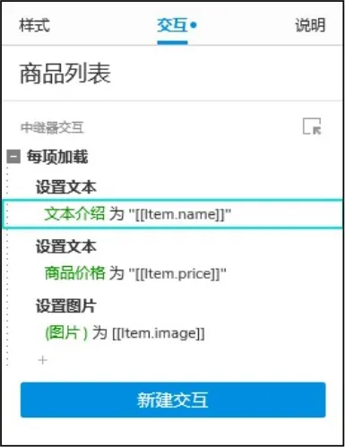

图4-152 “交互”面板

⑥ 给每个商品图片添加单击跳转的交互效果。双击“中继器”元件，进入中继器编辑界面。单击图片，在“交互”面板中，单击“新建交互”按钮，在下拉列表中选择“单击时”事件，选择“打开链接”动作，选择“链接到URL或文件路径”，如图4-153所示。在“交互”面板中，单击“fx”按钮，如图4-154所示。

⑦ 打开“编辑值”对话框，单击“插入变量或函数”按钮，弹出变量和函数列表，选择“Item.url”选项，如图4-155所示。

⑧ 以上交互动作设置完成后，在“样式”面板中，设置中继器的“边距”“间距”“布局”等参数，如图4-156所示。完成后，工作区中的中继器如图4-157所示。

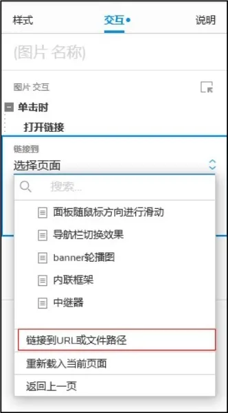

▲图4-153 添加“打开链接”动作

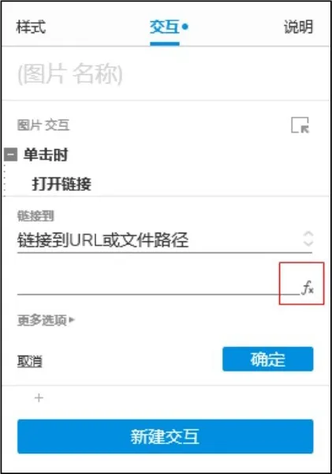

▲图4-154 设置值

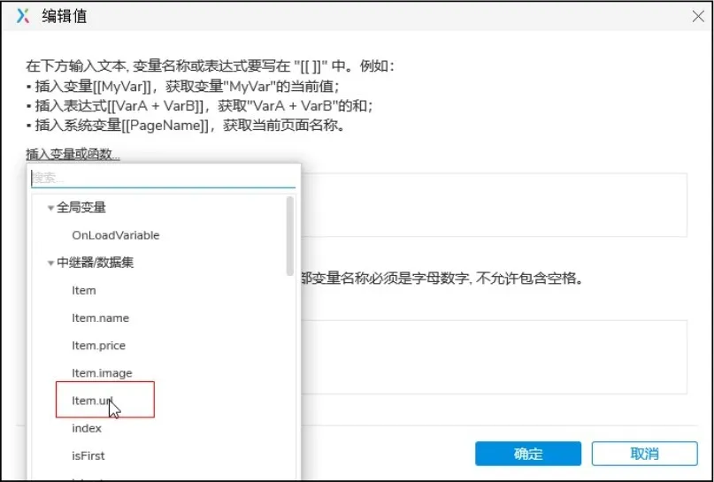

▲图4-155 添加变量

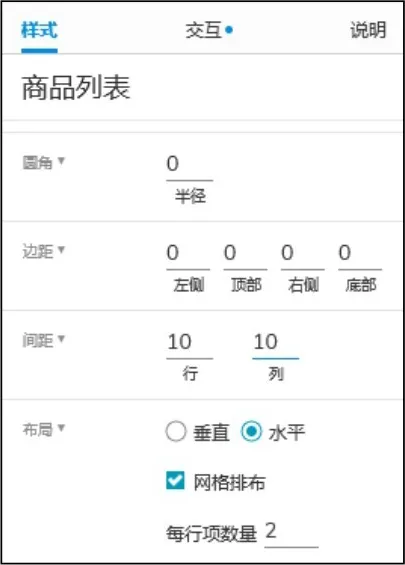

▲图4-156 “样式”面板

图4-157 工作区中的中继器

单击工具栏中的“预览”按钮，可以在打开的浏览器中看到刚刚设置好的商品展示页面，如图4-158所示。单击图片打开链接效果如图4-159所示。

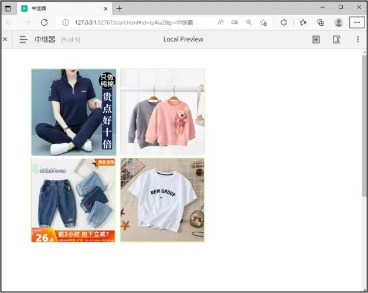

▲图4-158 预览效果

图4-159 单击图片打开链接效果

### **4.6.5**

### **制作商品秒杀倒计时效果**

微课视频

### 制作商品秒杀倒计时效果

本小节设计和制作商品秒杀倒计时效果，使用“全局变量”设置值来实现，如图4-160所示。

制作步骤如下。

#### **1.元件基础样式设置**

① 在左侧的元件库中，找到“矩形”和“文本”等基础元件，将其拖入工作区，进行倒计时页面的布局设计。此处主要用到的是3个用来显示时间的元件，分别命名为“时”“分”“秒”，如图4-161所示。

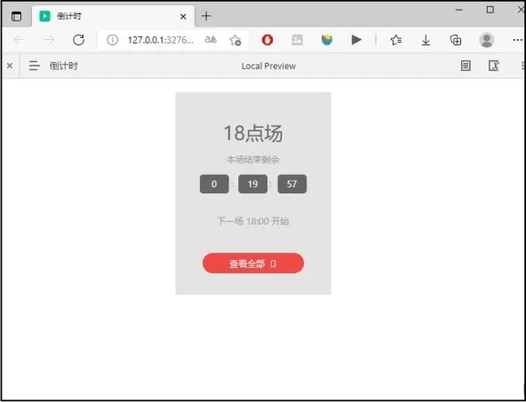

▲图4-160 商品秒杀倒计时效果

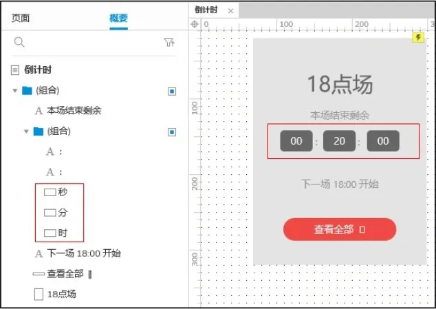

图4-161 倒计时显示时间元件

② 元件都设置完成后，需要使用“全局变量”。在菜单栏中选择“项目→全局变量”（见图4-162）。打开“全局变量”对话框，单击“添加”按钮，添加两个全局变量，变量名称为“dataobject”和“elapsed”，如图4-163所示。其中“elapsed”表示已经经过的时间，“dataobject”表示设定的倒计时的时长，此处设置的是20分钟倒计时，所以“dataobject”表示的是20分钟。

#### **2.元件交互效果设置**

① 元件与变量设置完成后，可以对元件添加交互事件。此处是为名称为“18点场”的元件添加交互事件，在“交互”面板上，单击“新建交互”按钮，在下拉列表中选择“载入时”事件。因制作的是20分钟倒计时效果，所以需要倒计时的时间是在20分钟内才需要进行时间的设置，需要判断经过的时间“elapsed”是否在20分钟内，也就是1800秒内。在“交互编辑器”对话框中单击“启用情形”按钮，如图4-164所示。在“情形编辑”对话框中设置全局变量“elapsed”的值小于1800，如图4-165所示。

② 添加“等待”动作，在载入时等待1秒再进行倒计时，如图4-166所示。

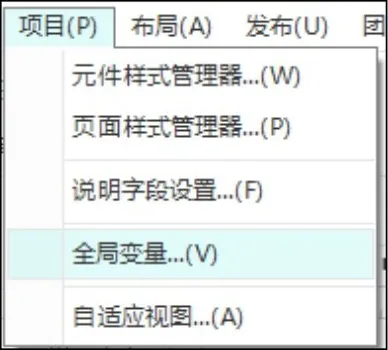

▲图4-162 “全局变量”命令

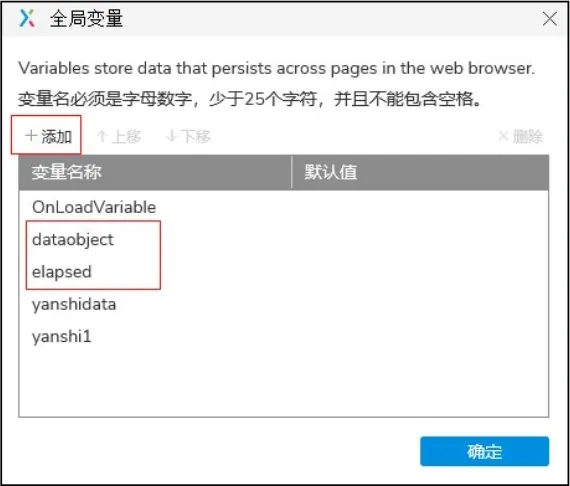

▲图4-163 添加全局变量

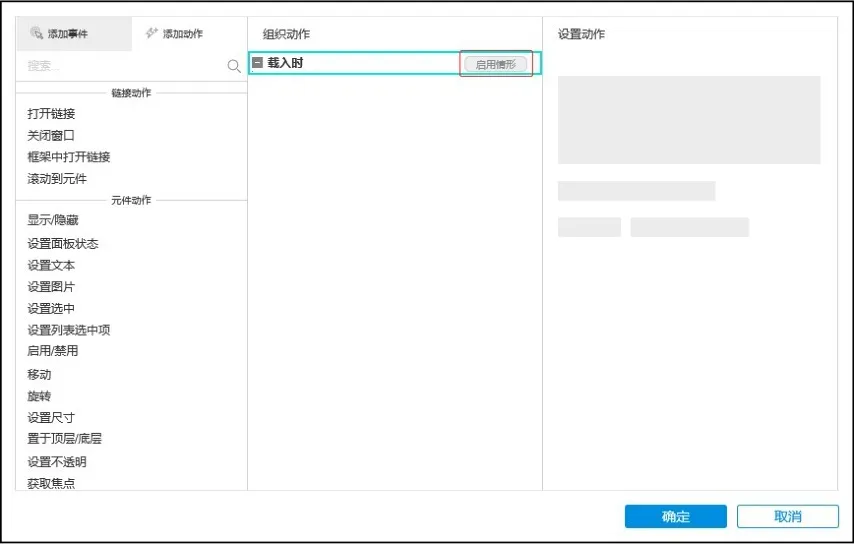

▲图4-164 “启用情形”按钮1

图4-165 设置全局变量“elapsed”

③ 等待1秒后，需要对全局变量“elapsed”进行时间的累加，因此单击“设置变量值”动作，选择“elapsed”全局变量，如图4-167所示。在“编辑文本”对话框中单击“插入变量或函数”按钮，选择“elapsed”，然后对它进行“+1”运算，如图4-168所示，表示经过1秒后，“elapsed”都会进行增加来表示已经经过时长。

④ 设置“dataobject”的值为此次需要设置的倒计时的时长，选择“dataobject”全局变量，单击设置值右侧的“fx”按钮，如图4-169所示，在“编辑文本”对话框中设置“dataobject”为“1 Jan 1970 00:20:00 GMT”，如图4-170所示。

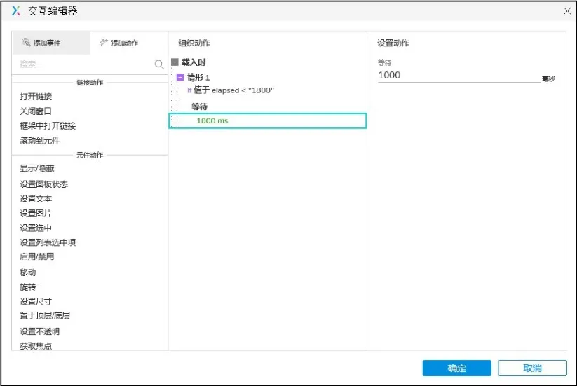

▲图4-166 等待1秒

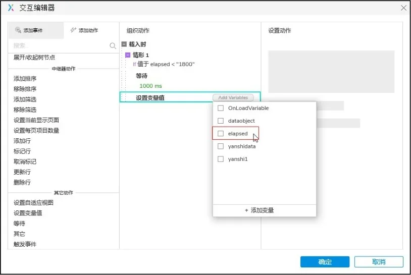

▲图4-167 选择“elapsed”全局变量

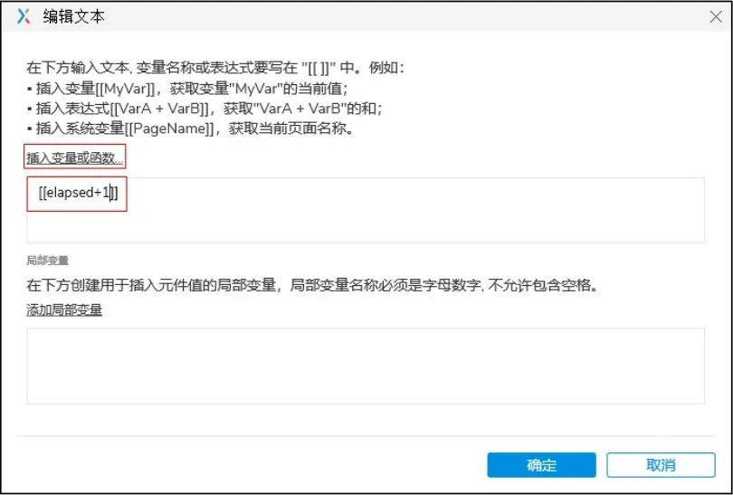

图4-168 对“elapsed”的值进行增加设置

这里时间的设定用到了一个技巧：“1 Jan 1970 00:00:00 GMT”表示1970年1月1日0点0分0秒的时间戳是第0秒；如果要倒计时20分钟，那么在这个时间上加20分0秒就是倒计时的初始时间，即“1 Jan 1970 00:20:00 GMT”，注意这个字符串是固定格式。

⑤ 变量设置完成后就可以对显示时间的元件进行文本设置了。添加“设置文本”动作，首先设置的是“秒”元件的文本数值，“目标”设为“秒”，单击设置值右侧的“fx”按钮，如图4-171所示。在“编辑文本”对话框中，为元件设置时间，这个时间需要进行运算获得，例如获取当前的倒计时的秒数：需要全局变量“dataobject”时间减去已经过去的时间，通过日期函数获取当前倒计时的秒数，然后将其赋给“秒”元件的文本。单击“插入变量或函数”按钮，在“时间函数”类找到AddSeconds(seconds)函数，把“elapsed”的值转为负值作为参数写入“dataobject.addSeconds(-elapsed)”，再在函数后边插入日期函数getUTCSeconds()来获取当前的秒数，完整函数写法如图4-172所示。

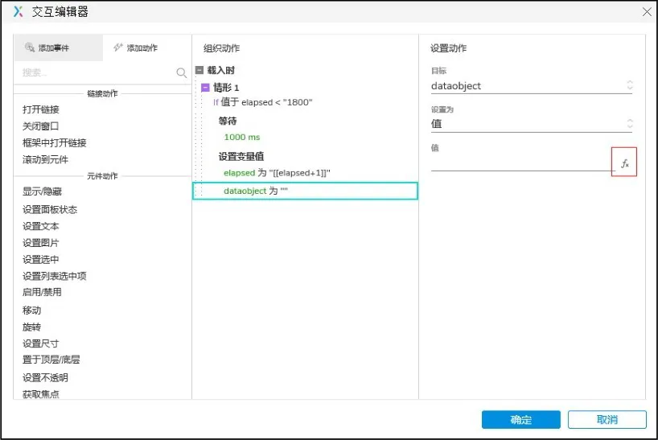

▲图4-169 设置“dataobject”的值

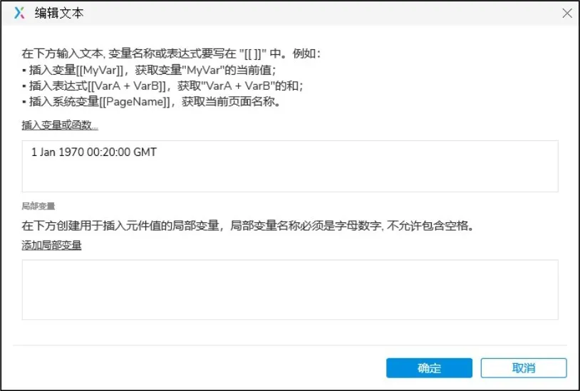

▲图4-170 设置倒计时时长

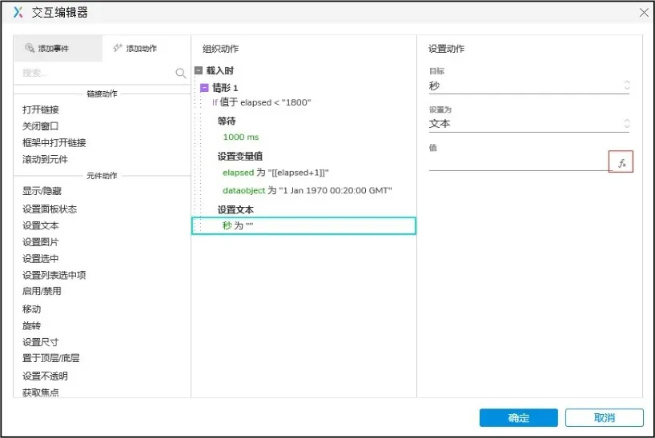

▲图4-171 设置文本

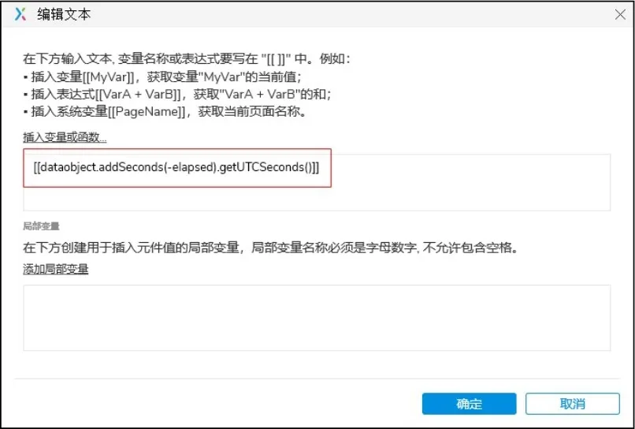

图4-172 获取倒计时秒数函数的完整写法

⑥ 在“设置文本”动作中添加“目标”，分别设为“分”和“时”，设置文本的值的方法与设置“秒”的类似，只是获取当前时间的“分”和“时”的函数不一样，图4-173所示为获取当前时间“分”函数的完整写法，图4-174所示为获取当前时间“时”函数的完整写法。

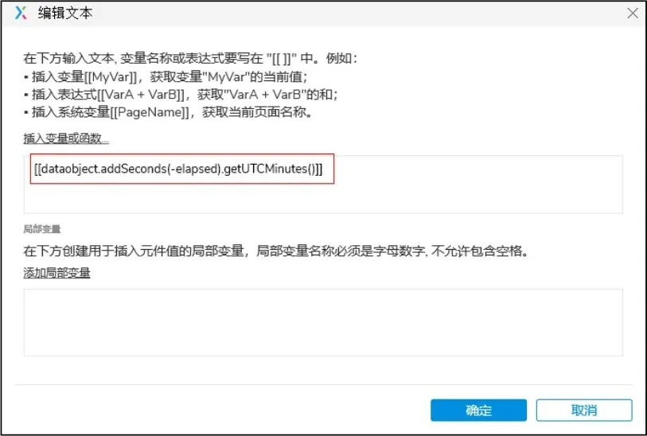

▲图4-173 获取当前时间“分”函数的完整写法

图4-174 获取当前时间“时”函数的完整写法

⑦ 到这里已经设置完经过1秒后元件显示的样式。因为时间是不断地进行设置的，所以需要添加“触发事件”动作，添加“载入时”事件，就可以实现经过1秒后，再次调用“载入时”事件，从而在倒计时的时长范围内不断设置倒计时的时间，如图4-175所示。再启用一个空的情形，不设置其他动作，只是用来判断倒计时是否结束，如图4-176所示。

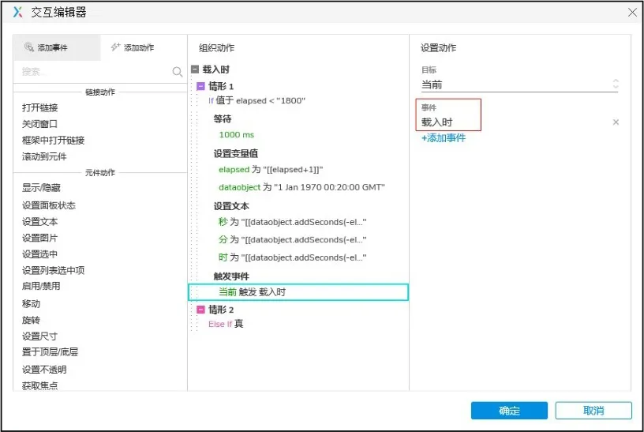

▲图4-175 添加“触发事件”动作

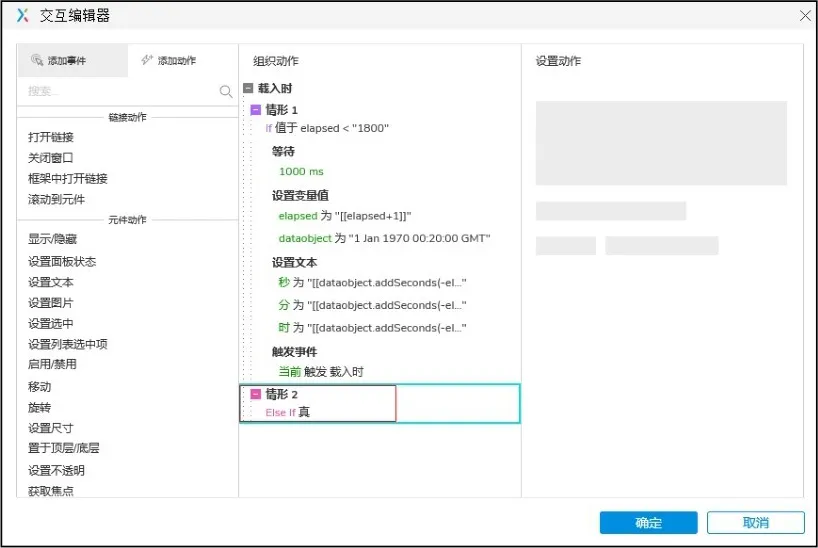

图4-176 启用一个空的情形

单击工具栏中的“预览”按钮，可以在打开的浏览器中看到刚刚设置好的商品倒计时秒杀效果，如图4-177所示。

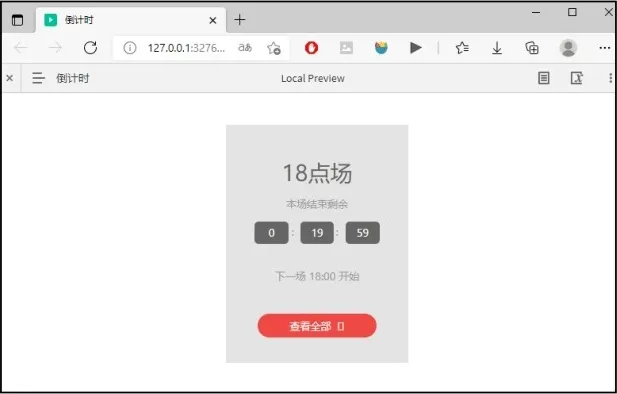

图4-177 商品倒计时秒杀效果

### **4.6.6**

### **制作面板随鼠标指针滑动效果**

本小节设计和制作商品面板随鼠标指针滑动的效果，使用“动态面板+热区”制作面板随鼠标指针从不同方向移入和移出图片区域时，浮层显示信息的效果，如图4-178所示。

制作步骤如下。

#### **1.元件基础样式设置**

微课视频

### 制作面板随鼠标指针滑动效果

① 在左侧的元件库中，找到“图片”元件，将其拖入工作区，添加需要展示的商品图片；接着找到“矩形”元件，将其拖入工作区中，设置矩形的颜色和透明度，调整形状完全覆盖图片区域，使用“文本”元件展示商品信息。选中矩形和商品信息并单击鼠标右键，在快捷菜单中选择“转换为动态面板”命令，将动态面板命名为“浮层显示”，如图4-179所示。

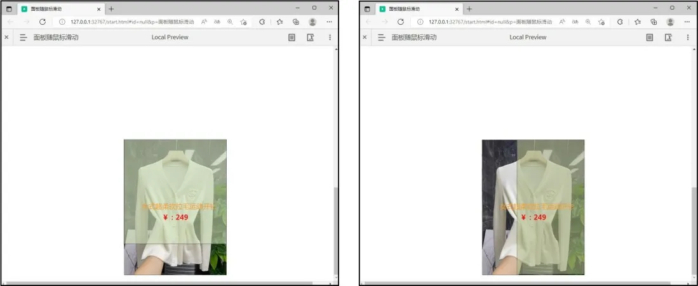

▲图4-178 面板随鼠标指针滑动

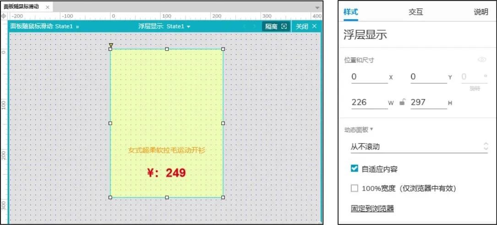

图4-179 “浮层显示”动态面板

② 选中商品图片和“浮层显示”动态面板，单击鼠标右键，选择“转换为动态面板”命令，将动态面板命名为“面板随鼠标滑动”，如图4-180所示。

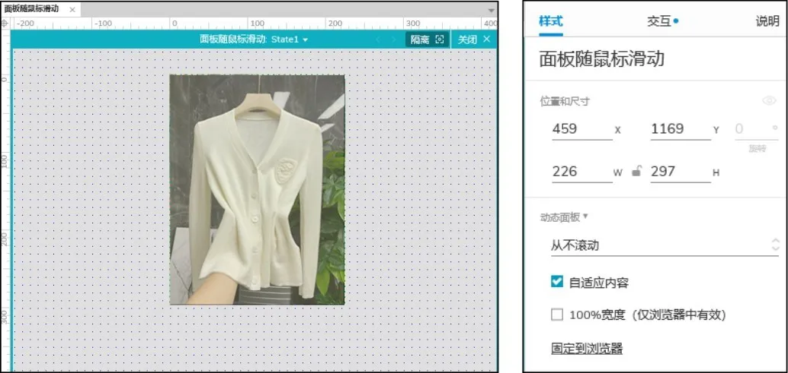

图4-180 “面板随鼠标滑动”动态面板

③ 在元件左侧的元件库中找到“热区”元件，如图4-181所示，将其拖入工作区，调整大小使其可以覆盖图片部分左边界，命名为“左边”，如图4-182所示。

④ 使用“热区”元件对图片的其他3个边界也使用类似的方法进行设置，并分别命名为“右边”“上边”“下边”，最终效果如图4-183所示。设置完成后需要把4个“热区”元件放在“面板随鼠标滑动”动态面板的下边，“概要”面板如图4-184所示。

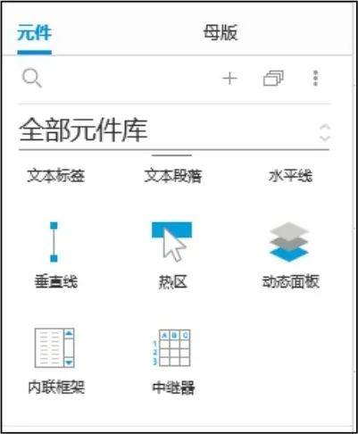

▲图4-181 “热区”元件

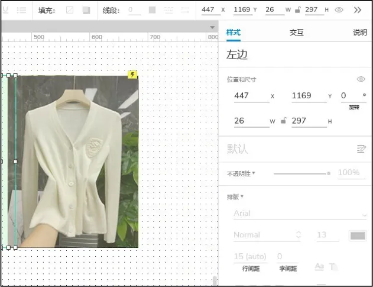

▲图4-182 “左边”热区

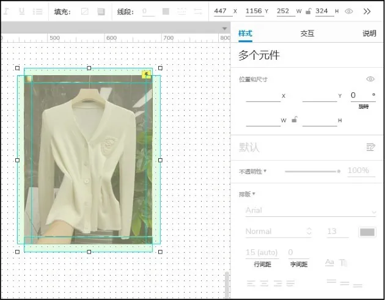

▲图4-183 图片四边的“热区”元件

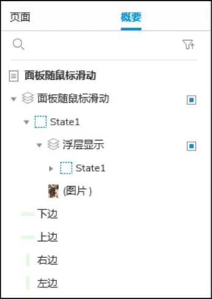

图4-184 “概要”面板

#### **2.元件交互效果设置**

① 所有元件设置完成后，可以对动态面板进行交互事件的添加。选中“面板随鼠标滑动”动态面板，在“交互”面板中，单击“新建交互”按钮，在下拉列表中选择“鼠标移入时”事件，如图4-185所示。此时需要考虑鼠标指针从动态面板哪个边界移入，所以需要启用情形，打开“交互编辑器”对话框，单击“启用情形”按钮，如图4-186所示。

▲图4-185 添加移入时的交互效果

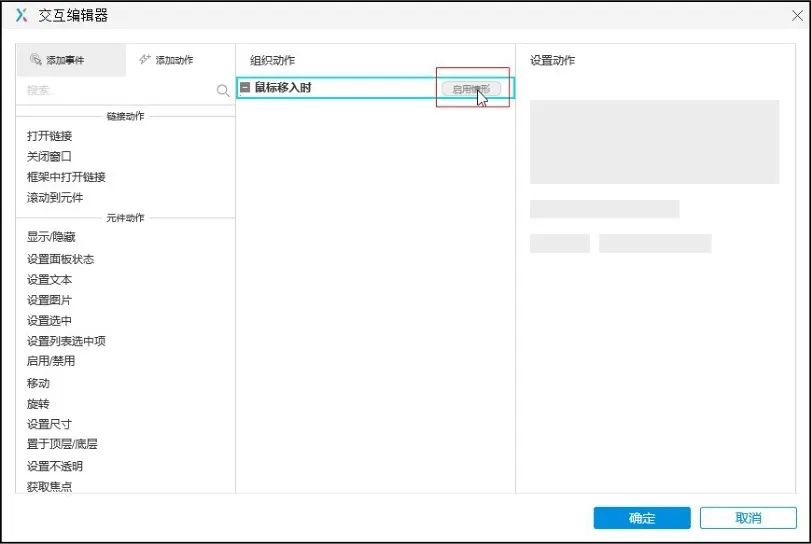

图4-186 “启用情形”按钮2

② “情形1”判断鼠标指针在移入时“接触”的“元件范围”是不是“左边”热区，如图4-187所示。

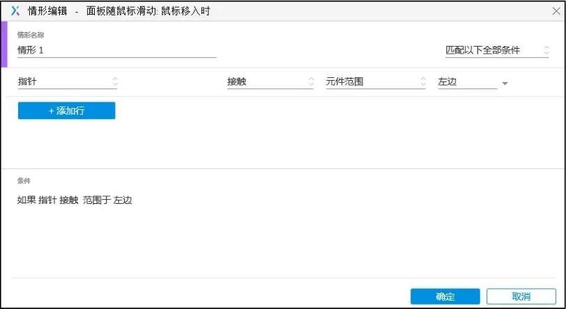

图4-187 左边移入情形

③ 添加并设置“显示/隐藏”动作，“目标”设为“浮层显示”，设置“显示”，动画为“向右滑动”，参数具体设置如图4-188所示。

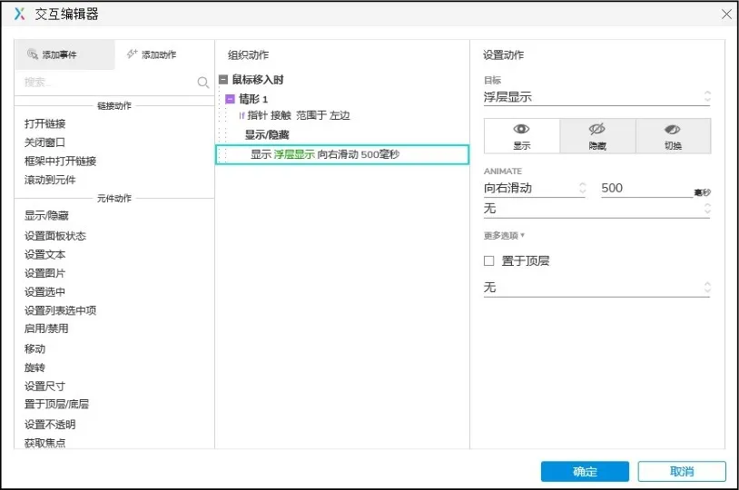

图4-188 设置“浮层显示”动态面板从左向右滑入显示

④ 设置鼠标指针分别从“面板随鼠标滑动”动态面板的“右边”“上边”“下边”3个方向移入时的情形，根据不同的情形设置“浮层显示”动态面板滑入显示的动画效果，具体设置如图4-189所示。

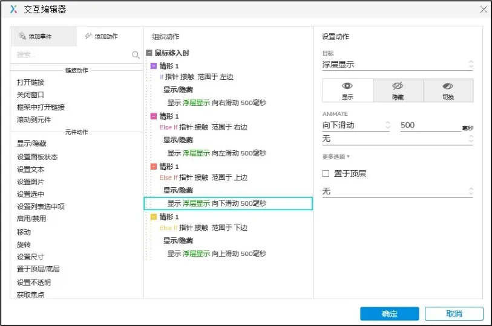

图4-189 鼠标指针移入时4个情形下显示的效果

以上设置的是鼠标指针在移入“面板随鼠标滑动”动态面板区域时的交互效果。

⑤ 鼠标指针从“面板随鼠标滑动”动态面板区域移出时的交互效果的设置和移入时类似，也是4种情形。单击“新建交互”按钮，选择“鼠标移出时”事件，如图4-190所示。打开“交互编辑器”对话框，单击“启用情形”按钮，如图4-191所示。

▲图4-190 添加移出时的交互效果

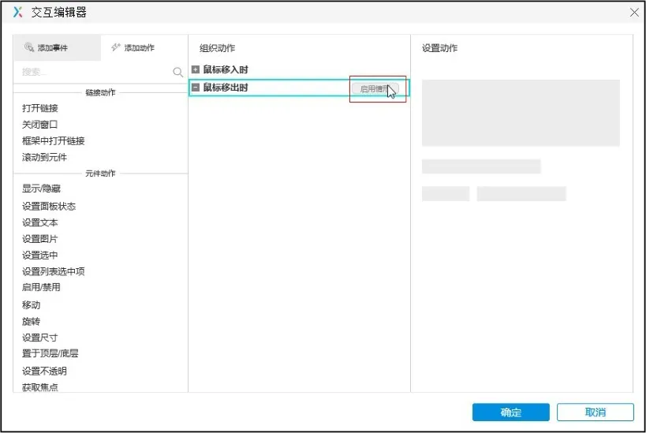

图4-191 “启用情形”按钮3

⑥ “情形1”判断鼠标指针在移出时“接触”的“元件范围”是不是“左边”热区，如图4-192所示。

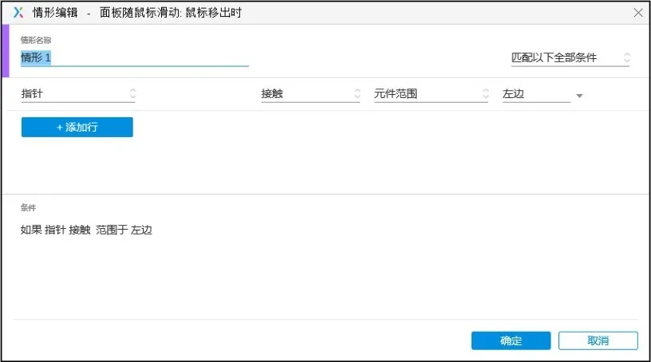

图4-192 左边移出情形

⑦ 添加并设置“显示/隐藏”动作，“目标”设为“浮层显示”，设置“隐藏”，动画为“向左滑动”，这个动画方向是根据“浮层显示”动态面板实际滑动方向进行设置的，参数具体设置如图4-193所示。

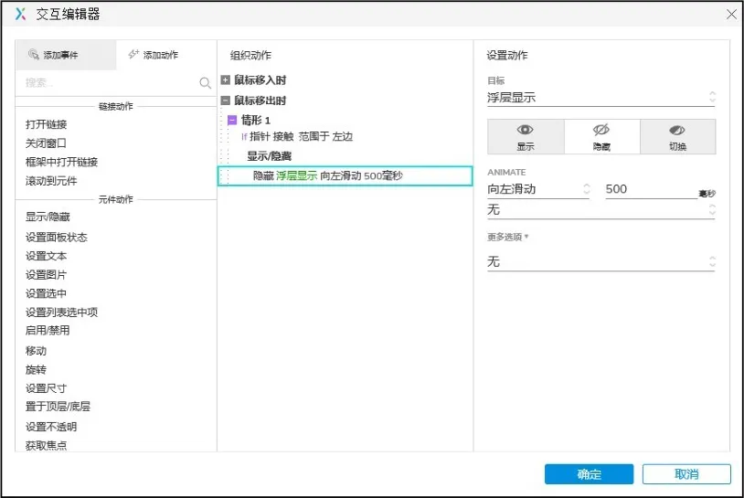

图4-193 设置浮层显示从右向左滑出并隐藏

⑧ 设置鼠标指针分别从“面板随鼠标滑动”动态面板的“右边”“上边”“下边”3个方向移出时的情形，根据不同的情形设置“浮层显示”动态面板滑出隐藏的动画效果，具体设置如图4-194所示。

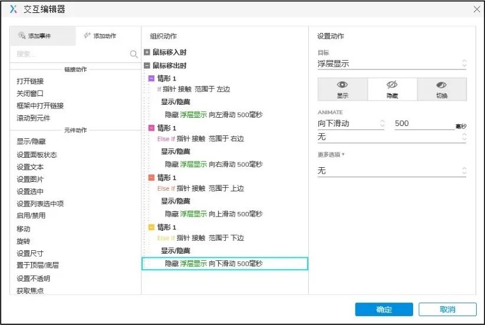

图4-194 鼠标指针移出时4个情形下隐藏的效果

设置完成后，可以多复制几个，修改图片和商品信息内容，然后单击工具栏中的“预览”按钮，在打开的浏览器中可以看到刚刚设置好的面板随鼠标指针滑动显示的效果，如图4-195所示。

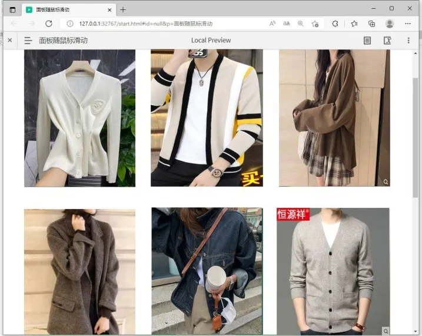

图4-195 面板随鼠标指针滑动效果

### **4.6.7**

### **制作播放视频效果**

微课视频

### 制作播放视频效果

本小节设计和制作播放视频效果，使用“内联框架”元件完成，如图4-196所示。

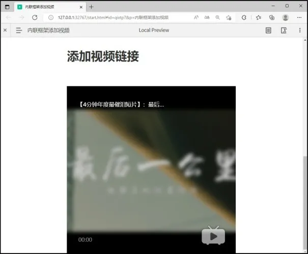

图4-196 播放视频效果

制作步骤如下。

使用“内联框架”元件添加视频有两种方法：一种是添加网络视频链接，另一种是添加本地视频。

#### **1.添加网络视频链接**

（1）元件基础样式设置

① 在左侧的元件库中，找到“内联框架”元件，将其拖入工作区，如图4-197所示。

② 设置“内联框架”元件的位置和尺寸，“内联框架”元件的样式设为“隐藏边框”“从不滚动”，预览图设置为“视频”，如图4-198所示。

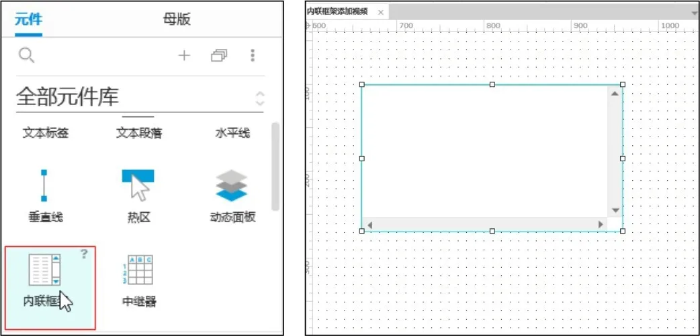

▲图4-197 添加“内联框架”元件

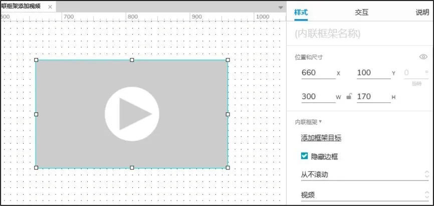

图4-198 “内联框架”元件的样式设置

（2）元件交互效果设置

① “内联框架”元件设置完成后就可以添加视频链接了。首先需要去网络上找到可以外部嵌入的视频链接，此处以优酷视频网站为例，找到一个可以播放的视频，如图4-199所示，然后单击“分享”按钮，单击“复制通用代码”按钮。

图4-199 复制网络视频链接代码

② 单击“内联框架”元件，在“交互”面板中单击“新建交互”按钮，在下拉列表中选择“载入时”事件，添加“框架中打开链接”动作，如图4-200所示。单击“fx”按钮，打开“编辑值”对话框，粘贴视频通用代码，如图4-201所示。

▲图4-200 添加“载入时”事件

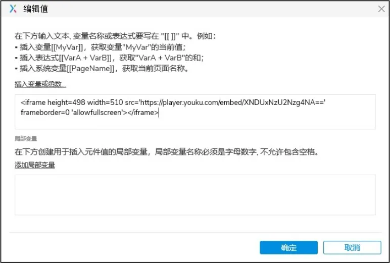

图4-201 粘贴视频通用代码

③ 这段通用代码需要进行截取才能正常使用，找到通用代码引号中的一段代码进行截取，如图4-202所示，删除其他部分的代码，单击“确定”按钮。完整的交互事件如图4-203所示。

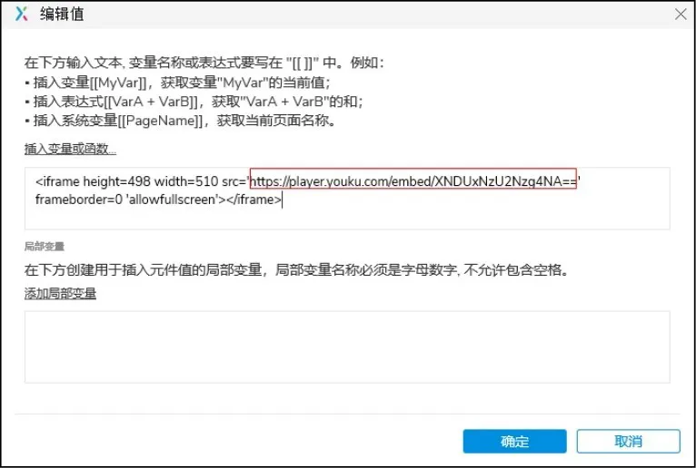

▲图4-202 截取通用代码

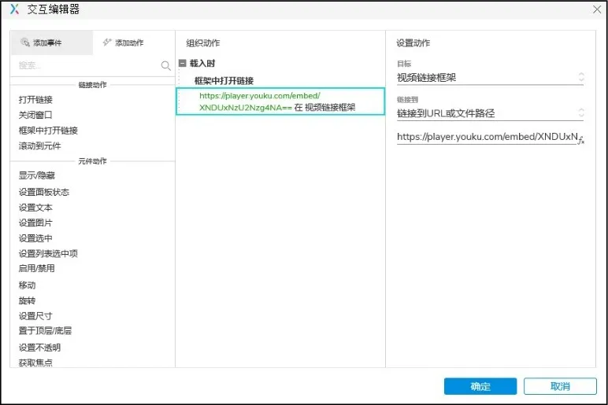

图4-203 完整的交互事件

设置完成后，单击工具栏中的“预览”按钮，可以在打开的浏览器中看到刚刚设置好的播放视频效果，如图4-204所示。

图4-204 添加网络视频链接的播放视频效果

#### **2.添加本地视频**

（1）元件基础样式设置

① 在左侧的元件库中，找到“内联框架”元件，将其拖入工作区，命名为“本地视频框架”，然后设置“内联框架”元件的位置和尺寸，样式设为“隐藏边框”“从不滚动”，预览图设置为“视频”，如图4-205所示。

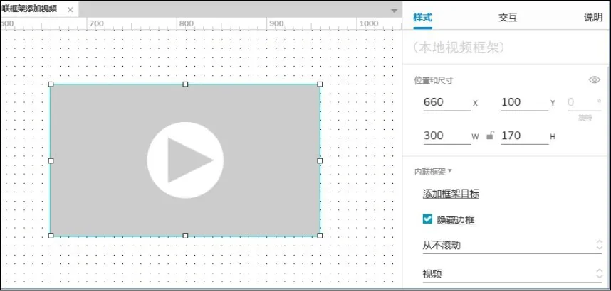

图4-205 添加并设置“内联框架”元件

② 在“内联框架”元件中添加本地视频，需要使用“发布—生成HTML文件”命令，如图4-206所示。选择要发布的页面，如图4-207所示。

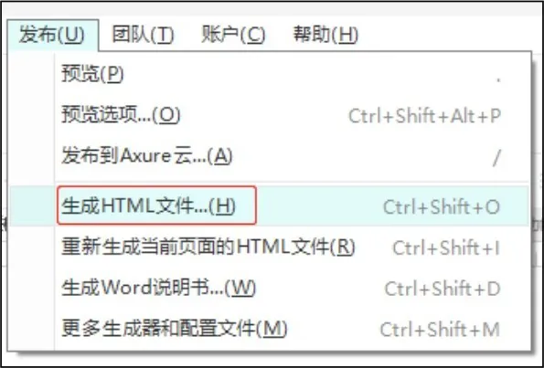

▲图4-206 “生成HTML文件”命令

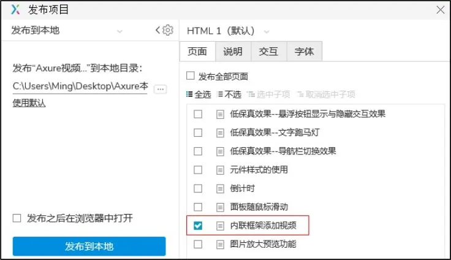

图4-207 选择要发布的页面

③ 选择文件的保存位置，如图4-208所示，单击“发布到本地”按钮，生成的HTML文件如图4-209所示，之后单击start.html进行预览。

④ 把本地视频放到生成的HTML文件所在的文件夹里，如图4-210所示，然后在“内联框架”元件的“交互”面板中单击“新建交互”按钮，在下拉列表中选择“载入时”事件，如图4-211所示。

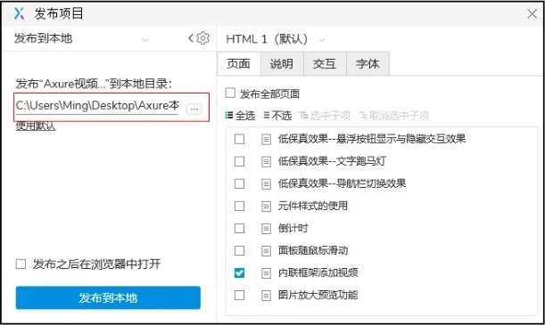

▲图4-208 选择文件的保存位置

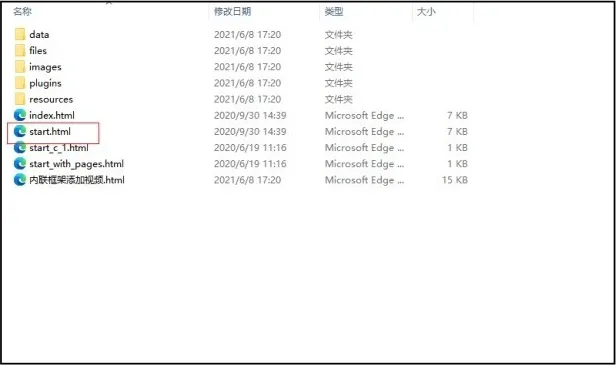

▲图4-209 生成的HTML文件

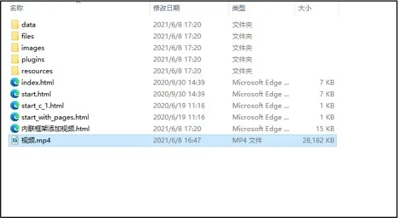

▲图4-210 把本地视频放在HTML文件所在的文件夹里

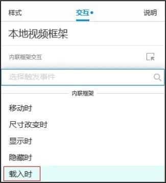

图4-211 添加交互事件

（2）元件交互效果设置

① 打开“交互编辑器”对话框，添加“框架中打开链接”动作“，目标”设为“本地视频框架”，单击“链接到URL或文件路径”按钮，如图4-212所示。单击“fx”按钮，如图4-213所示，打开“编辑值”对话框。

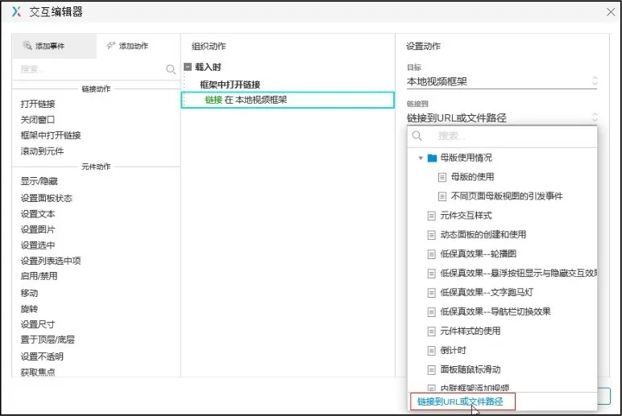

▲图4-212 添加动作

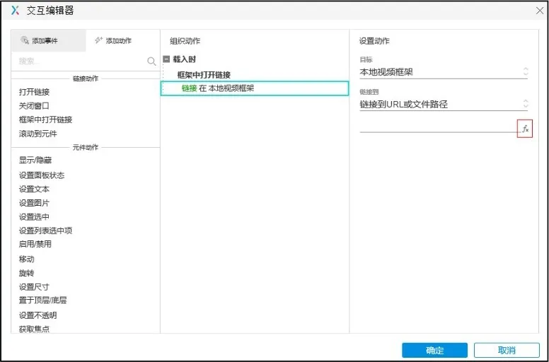

图4-213 单击“fx”按钮

② 在“编辑值”对话框中添加本地视频，如图4-214所示。选择“重新生成当前页面的HTML文件”命令，如图4-215所示。

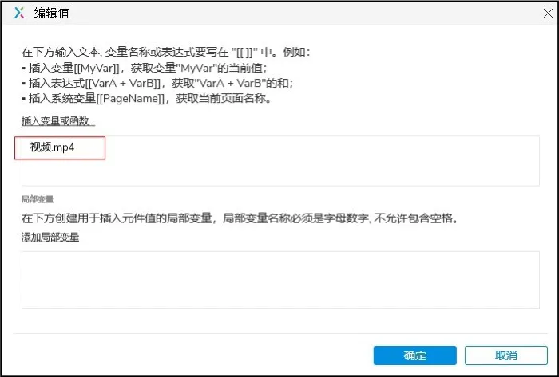

▲图4-214 添加本地视频

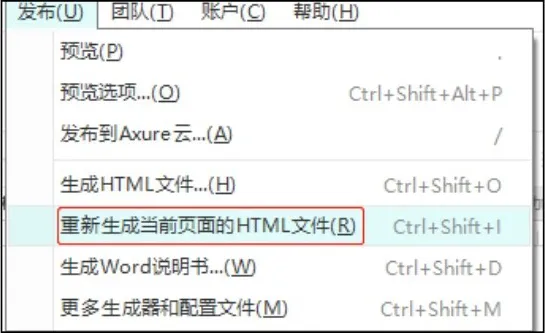

图4-215 “重新生成当前页面的HTML文件”命令

注意：添加的本地视频只能在文件中找到对应的页面进行双击预览，无法在Axure中进行实时预览。

设置完成后，在生成的HTML文件里找到“start.html”文件双击进行预览，可以在打开的浏览器中看到刚刚设置好的播放本地视频效果，如图4-216所示。

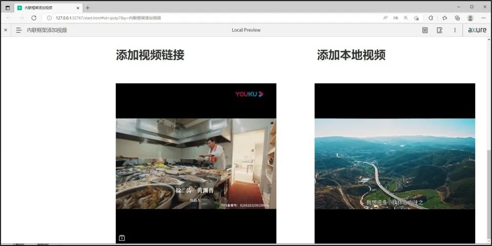

图4-216 播放本地视频效果

### **4.6.8**

### **制作图片放大预览效果**

微课视频

### 制作图片放大预览效果

本小节设计和制作图片放大预览效果，使用动态面板+移动元件位置功能实现。案例实现效果：左侧为商品图片，当鼠标指针移入商品图片区域时，右侧的商品图片局部放大面板对预览框中的内容进行放大显示，如图4-217所示。

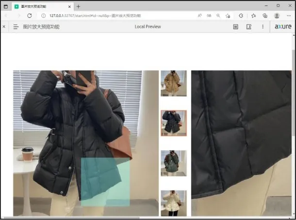

图4-217 图片放大预览效果

制作步骤如下。

#### **1.元件基础样式设置**

① 在左侧的元件库中找到“动态面板”元件，如图4-218所示，将其拖入工作区，命名为“左面板1”，尺寸设为450px×450px，如图4-219所示。

② 双击“左面板1”动态面板，进入动态面板编辑界面，在左侧的元件库中找到“图片”元件，将其拖入动态面板的默认状态中，把图片位置调整到（0,0），大小与动态面板的尺寸一样，再填充需要显示的商品图片，如图4-220所示。

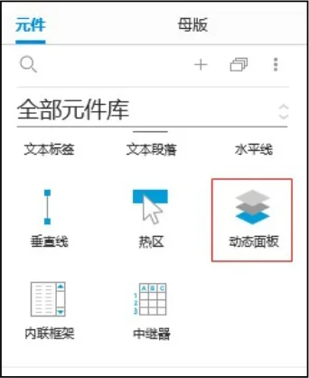

▲图4-218 “动态面板”元件

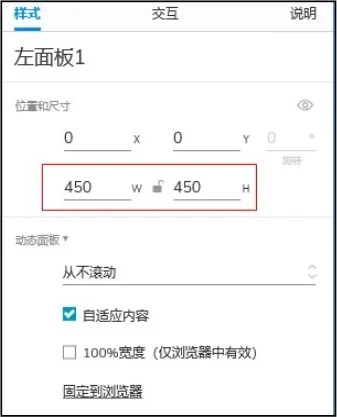

▲图4-219 设置动态面板

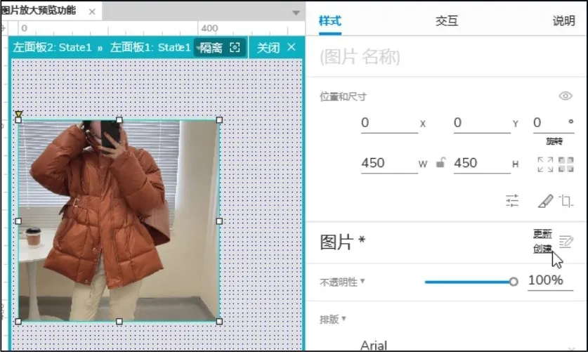

图4-220 设置“左面板1”动态面板默认状态中元件的样式

③ 状态1设置好后，利用动态面板编辑界面顶部的菜单栏，复制得到3个状态，如图4-221所示，然后修改复制得到的状态中的填充图片，如图4-222所示。

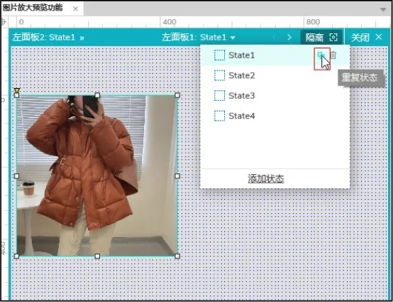

▲图4-221 复制状态

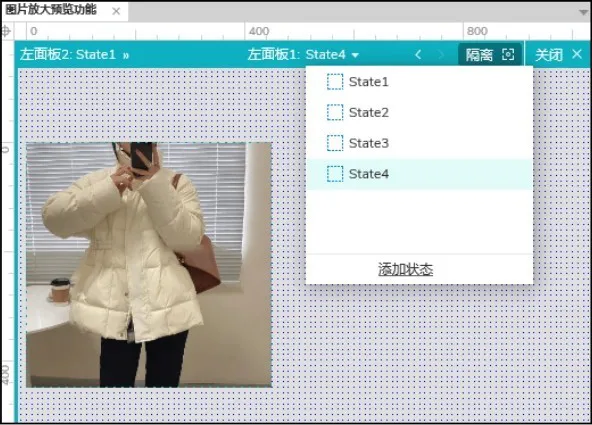

图4-222 修改3个状态中图片的填充

④ 将元件库中的“矩形”元件拖入工作区中，命名为“演示预览框”，调整矩形的尺寸为150px×150px，把线段的宽度设置为“0”，如图4-223所示。颜色和透明度设置如图4-224所示。把“演示预览框”设置为隐藏状态。

⑤ 选中“左面板1”和“演示预览框”两个元件，单击鼠标右键，在快捷菜单中选择“转换为动态面板”命令，如图4-225所示。将动态面板命名为“左面板2”，“左面板2”的概要视图如图4-226所示。

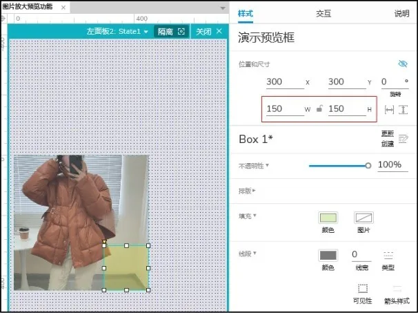

▲图4-223 “演示预览框”元件

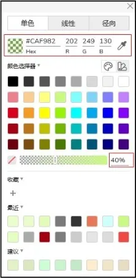

▲图4-224 颜色和透明度设置

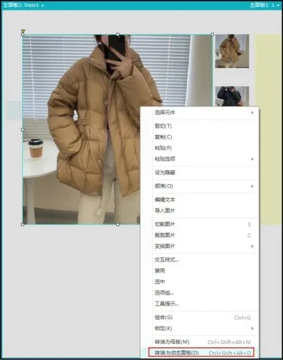

▲图4-225 “转换为动态面板”命令

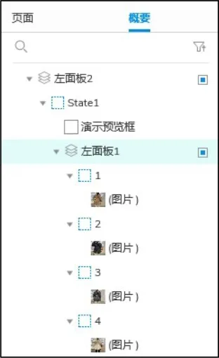

图4-226 “左面板2”的概要视图

⑥ 在“左面板2”的右侧制作显示放大图片效果的元件，右侧的元件结构和“左面板2”的结构类似。由于“左面板1”元件和“演示预览框”元件的尺寸是3︰1，所以右侧的实际显示放大的图片的尺寸和显示区域比例也是3︰1。将元件库中的“动态面板”元件拖入工作区，命名为“右面板1”，设置“右面板1”动态面板的尺寸为1350px×1350px，如图4-227所示。同样需要4个状态来与“左面板1”中的商品图片一一对应，只不过此时图片的尺寸变成了1350px×1350px，如图4-228所示。

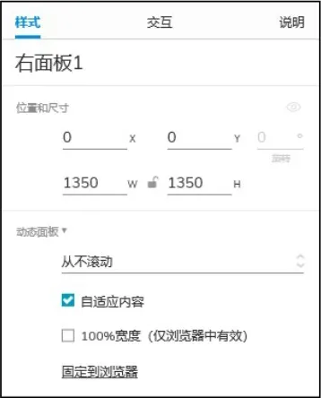

▲图4-227 “右面板1”动态面板

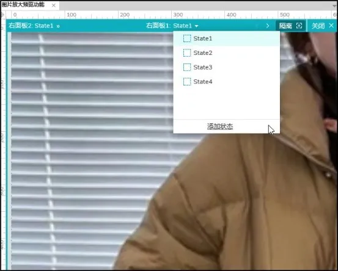

图4-228 “右面板1”动态面板的状态

⑦ “右面板1”动态面板设置完成后，选中“右面板1”动态面板，单击鼠标右键，选择“转换为动态面板”命令，将动态面板命名为“右面板2”，设置面板的显示尺寸为450px×450px，取消勾选“自适应内容”复选框，如图4-229所示。把“右面板2”动态面板设置为隐藏状态。“右面板2”动态面板的概要视图如图4-230所示。

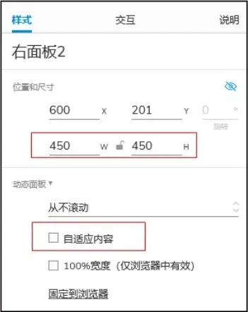

▲图4-229 “右面板2”动态面板的设置

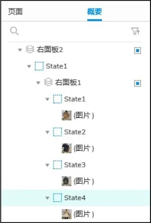

图4-230 “右面板2”动态面板的概要视图

⑧ 添加4个用来切换商品图片的小图，如图4-231所示。再添加一个“动态面板”元件，命名为“图片放大循环”，用于进行循环判断的操作，不需要其他设置，只需要通过循环切换面板状态来移动“演示预览框”动态面板和“右面板1”动态面板，实现图片局部放大预览。“图片放大循环”动态面板如图4-232所示。

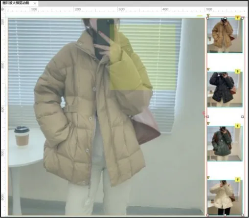

▲图4-231 切换商品图片的小图

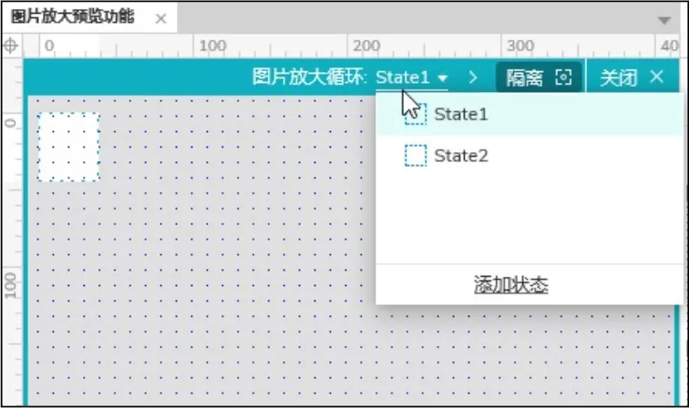

图4-232 “图片放大循环”动态面板

#### **2.元件交互效果设置**

① 元件设置完成后，可以开始进行交互事件的添加。为“左面板2”动态面板添加交互，在“交互”面板中单击“新建交互”按钮，在下拉列表中选择“鼠标移入时”事件，打开“交互编辑器”对话框，添加“显示/隐藏”动作，目标分别设为“演示预览框”和“右面板2”，参数详细设置如图4-233所示。

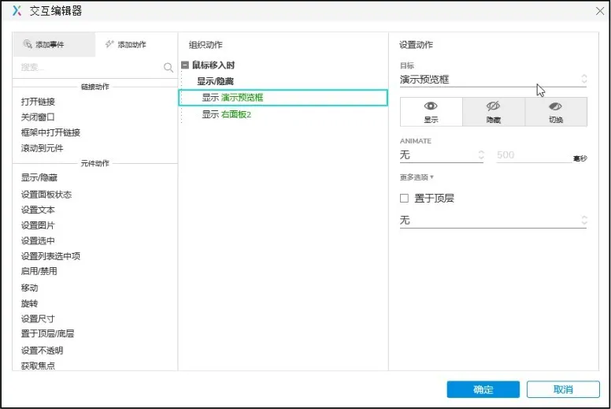

▲图4-233 添加交互控制元件显示

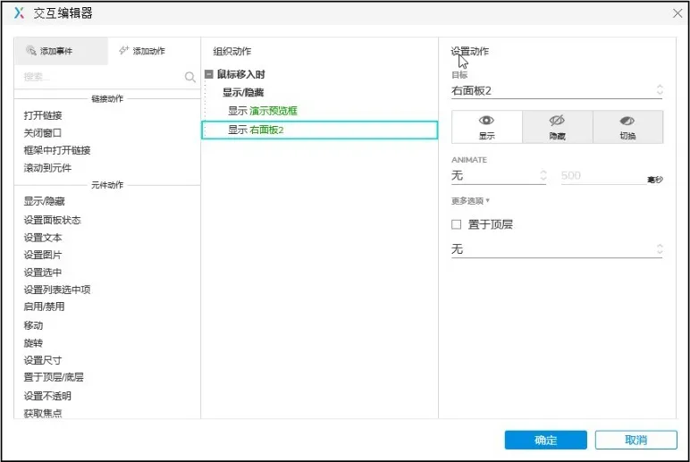

图4-233 添加交互控制元件显示（续）

② 添加“鼠标移出时”事件。在“交互编辑器”对话框中添加“显示/隐藏”动作，目标分别设为“演示预览框”和“右面板2”，参数详细设置如图4-234所示。

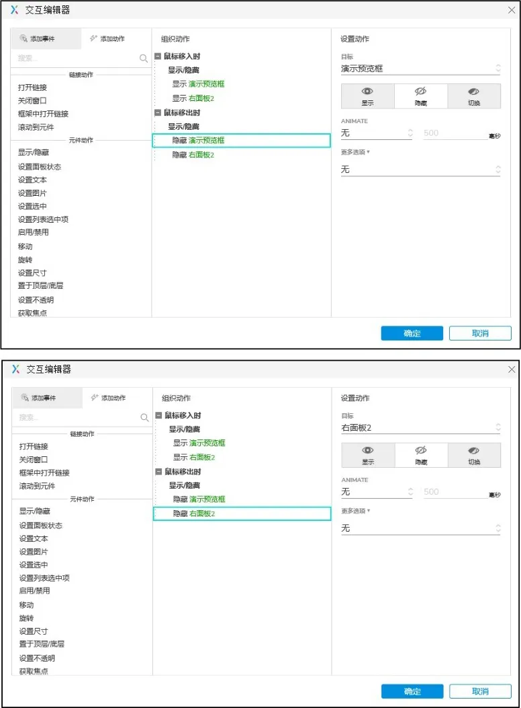

图4-234 添加交互控制元件隐藏

③ 给4个切换商品图片的小图添加交互。选中4个小图，单击鼠标右键，在快捷菜单中选择“选项组”命令，如图4-235所示。在“选项组”对话框中设置4个图片的“组名称”，如图4-236所示。

④ 给4个小图分别添加切换面板状态的交互事件。单击“新建交互”按钮，选择“鼠标移入时”事件，添加“设置选中”动作，参数详细设置如图4-237所示。设置选中后的交互，添加“选中”事件，添加“设置面板状态”动作，参数详细设置如图4-238所示。其他3个的交互设置与这个一样，只是切换的面板状态需要与小图所对应的状态一致。

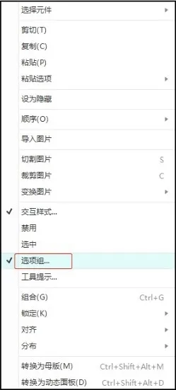

▲图4-235 “选项组”命令

▲图4-236 设置“组名称”

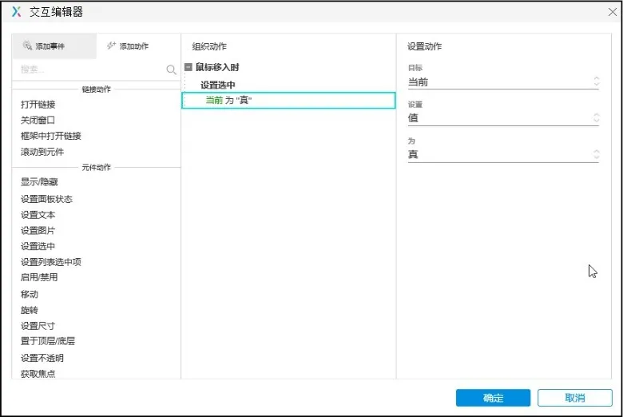

▲图4-237 “设置选中”动作

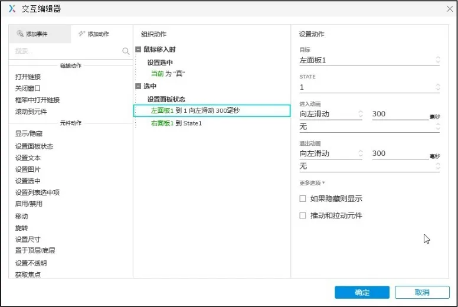

图4-238 切换动态面板到对应的商品图片状态

⑤ 设置“图片放大循环”动态面板的交互效果。单击“图片放大循环”动态面板，在“交互”面板中单击“新建交互”按钮，选择“载入时”事件，在“交互编辑器”对话框中添加“切换面板状态”动作，参数详细设置如图4-239所示。

⑥ 添加“状态改变时”事件。添加“移动”动作，打开“交互编辑器”对话框，将“目标”设为“演示预览框”，移动方式选择“到达”，需要让“演示预览框”跟随鼠标指针移动，而鼠标指针的坐标是相对于整个工作区的左上角来说的，“演示预览框”的坐标是相对于“左面板2”的左上角来说的，所以要实现“演示预览框”在移动时跟随鼠标指针，并且鼠标指针位于“演示预览框”的中心位置，那么需要使用鼠标指针的*x*坐标，减去“左面板2”所在位置的*x*坐标，本案例中“右面板2”的坐标为（50,201），再减去“演示预览框”宽度的一半，*y*方向的移动原理也是如此，分别单击设置*x*和控制*y*方向的“fx”按钮，如图4-240所示。打开设置*x*坐标的“编辑值”对话框，单击“插入变量或函数”按钮，如图4-241所示。

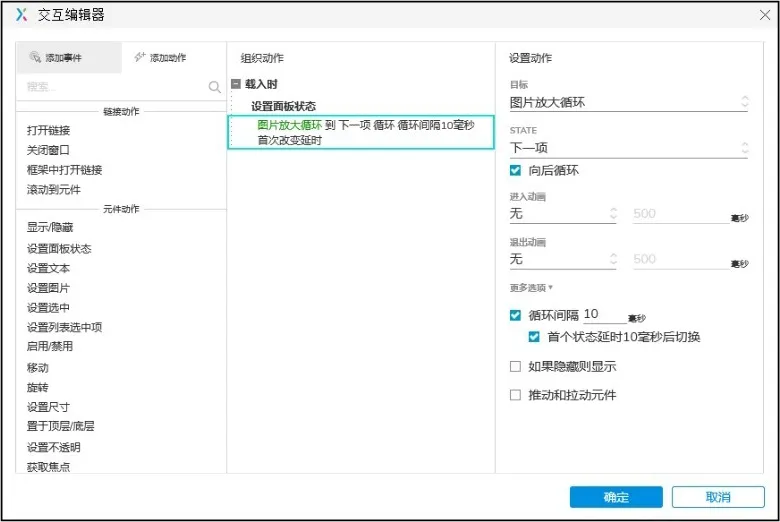

▲图4-239 添加切换面板状态的交互

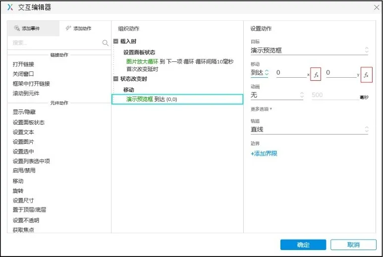

▲图4-240 添加“移动”动作

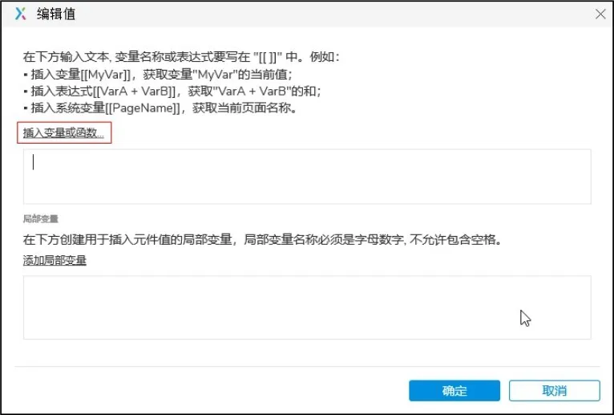

图4-241 “插入变量或函数”按钮

⑦ 在“鼠标指针”函数中找到“Cursor.x”，如图4-242所示。通过鼠标指针*x*坐标减去“左面板2”所在位置的*x*坐标和“演示预览框”宽度的一半，最终就得到了“演示预览框”的*x*坐标，如图4-243所示。

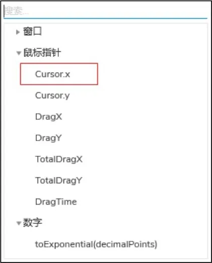

▲图4-242 “鼠标指针”函数

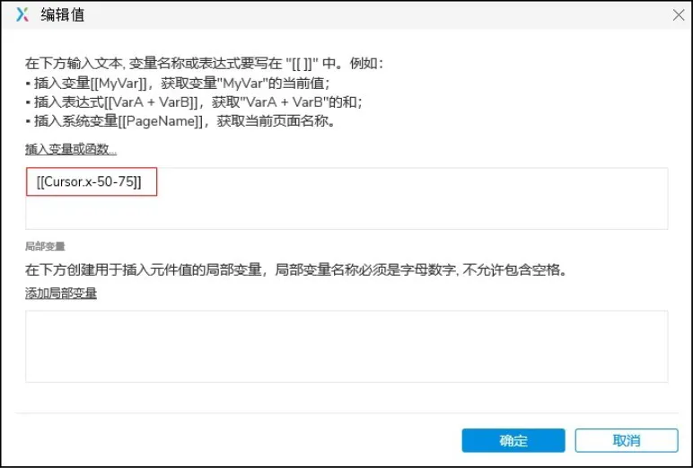

图4-243 “演示预览框”跟随鼠标x坐标

⑧ 设置“演示预览框”的*y*坐标，原理同上，“演示预览框”的*y*坐标设置如图4-244所示。

图4-244 “演示预览框”跟随鼠标y坐标

⑨ 为了不让“演示预览框”超出“左面板2”的边界，如图4-245所示，需要给“演示预览框”添加边界条件，设置“演示预览框”的上、下、左、右4个方向都不能超出边界，即只能在“左面板2”的显示区域中移动，如图4-246所示。

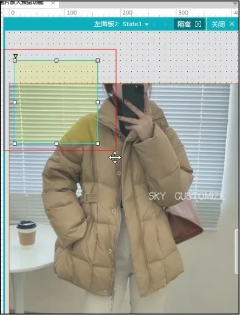

▲图4-245 超出边界

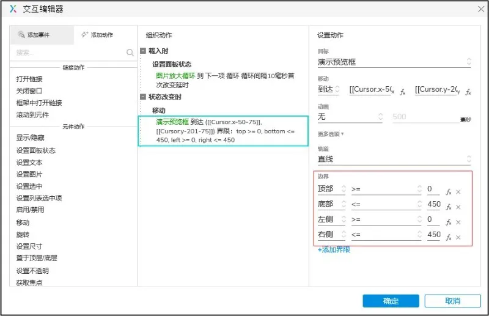

图4-246 为“演示预览框”添加移动边界

⑩ 设置完“演示预览框”的移动边界后，继续设置“右面板1”的移动边界，原理和设置“演示预览框”的移动边界是一致的，不过需要注意它们之间的对应关系。如“演示预览框”相当于“右面板2”，“左面板2”相当于“右面板1”，而在左边，是“演示预览框”在移动，“左面板2”是不移动的；在右边是“右面板1”进行移动，“右面板2”则不动，“右面板1”移动的方向正好和“演示预览框”移动的方向相反，而移动的坐标是“演示预览框”坐标的3倍。通过相应的计算得到“右面板1”移动时的*x*坐标，如图4-247所示，“右面板1”移动时的*y*坐标如图4-248所示。

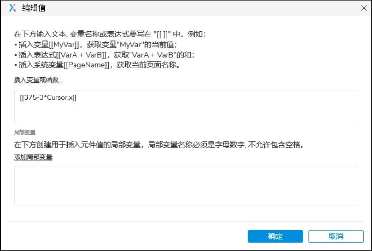

▲图4-247 “右面板1”移动时的x坐标

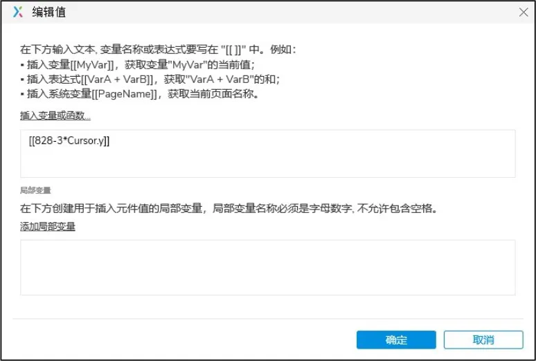

图4-248 “右面板1”移动时的y坐标

⑪给“右面板1”的移动添加边界，此时的边界就不只是“右面板2”的显示区域了，有两个临界的移动效果，就是“右面板1”的左上角在“右面板2”的左上角时，也就是在（0,0）位置时，它的右下角坐标为（1350,1350）；当“右面板1”的右下角正好在“右面板2”的右下角时，它的左上角的坐标为（-900,-900），这样就可以分析出“右面板1”在移动时的边界条件，如图4-249所示。

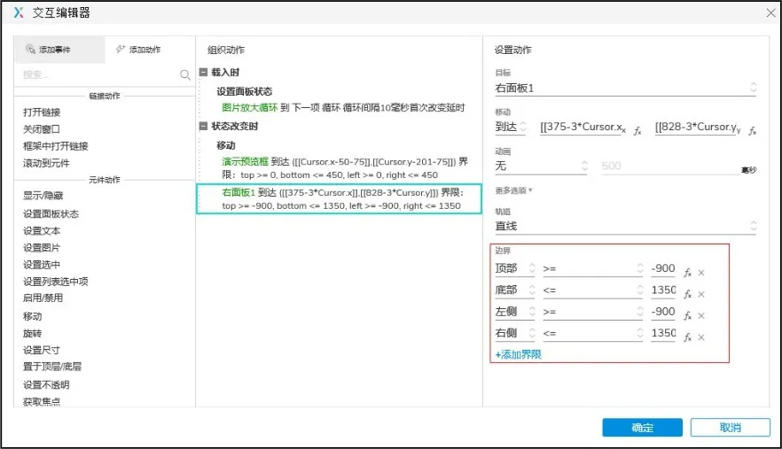

图4-249 为“右面板1”添加移动边界

设置完成后，单击工具栏中的“预览”按钮，可以在打开的浏览器中看到刚刚设置好的图片随鼠标指针移动放大预览的效果，如图4-250所示。

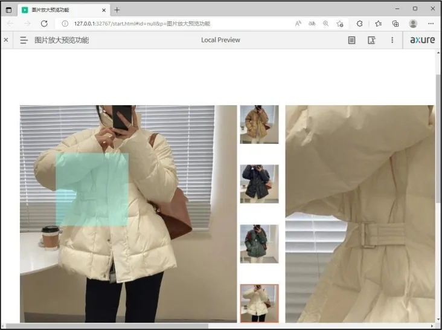

图4-250 图片随鼠标指针移动放大预览的效果

## **4.7**

## **项目小结**

本项目主要介绍了关于Axure RP 9原型设计工具的基础知识，包括软件的基础使用方法、面板及工具的使用方法。其中，着重介绍了Axure RP 9中的函数，Axure RP 9中的函数是整个软件中非常重要的部分，读者想要熟练使用软件，必须掌握函数部分的内容。

## **4.8**

## **素养拓展小课堂**

交互设计努力去创造和建立的是人与产品及服务之间有意义的关系，以“在充满社会复杂性的物质世界中嵌入信息技术”为中心。

Web端轮播图是Axure RP 9中元件相互结合使用实现的效果，离开任何一个元件交互的设置都将无法完成轮播效果。类比于多人组合在一起构成一个团队，一人无法完成某些任务，但一个团队只要互相取长补短，每个人都发挥相应的作用，就可以完成。本项目的预期：促进读者对团队意义的理解，培养读者的团队精神和集体荣誉感。

## **4.9**

## **巩固与拓展**

本项目主要介绍了Axure RP 9原型设计工具的界面、基本交互方法和重点的元件使用（动态面板的使用、中继器的使用）等，对项目实施案例——Web端“电商平台”产品交互设计开发做了详细的介绍，用专业的眼光分析网页交互产品的元件动作设计方法和网页交互中的逻辑条件概念，有助于读者更深入理解Axure RP 9原型设计工具。

同时我们要注意，在以后的市场产品设计中，切不可一味追求高保真的交互设计效果，网页原型设计的交互效果是采用高保真效果还是低保真效果要根据具体工作要求来进行选择，切不可因一味追求高保真交互效果而延误其他工作。另外，请你从现实生活中的各类媒体中寻找、收集有关功能性网站的交互样例，针对样例尝试着制作其中部分交互效果。

## **4.10**

## **习题**

### **一、单选题**

1.目前常用的原型设计工具不包括以下哪种工具（ ）。

A.Photoshop

B.Visio

C.Axure

D.IC.oWorkshop

2.以下不属于页面（站点地图）管理的是（ ）。

A.添加页面

B.重命名页面

C.删除页面

D.页面载入

3.下列选项中不属于Axure RP 9核心功能的是（ ）。

A.原型

B.交互

C.协作

D.草图

### **二、多选题**

1.Axure RP9元件交互样式有（ ）。

A.鼠标悬停

B.鼠标按下

C.选中

D.禁用

2.下列选项中属于Axure RP 9内置元件的有（ ）。

A.按钮

B.图片

C.导航

D.下拉式菜单

### **三、填空题**

1.“中继器”元件的功能特点是\_\_\_\_\_\_。

2.交互是由\_\_\_\_\_\_触发的，并由它来执行相应的动作。

