## **墨刀概述**

墨刀是一款特别容易上手的在线原型设计与协同工具，特别是在新项目规划和演示、流程梳理方面，其优势非常明显；丰富的基础功能组件和小图标，让原型页面显得更高保真；团队协作功能更是能让大家实时同步产品规划的进度、表达意见，大大提高了工作和沟通效率。

### **5.3.1**

### **工作界面**

墨刀工作界面是墨刀的主要操作区，认识墨刀工作界面可以帮助我们更好地掌握墨刀的使用方法。

墨刀工作界面由7部分组成，分别是功能区、工具栏、页面栏、图层栏、元件栏、设置栏、工作区，如图5-1所示。以下是各个部分的具体介绍。

#### **1.功能区**

功能区上有很多功能按钮，可以协助完成组件布局、图层顺序的调整等常见操作。

① 常规操作：功能区左侧第一部分按钮可以帮助我们完成保存、撤销和重做操作，如图5-2所示。

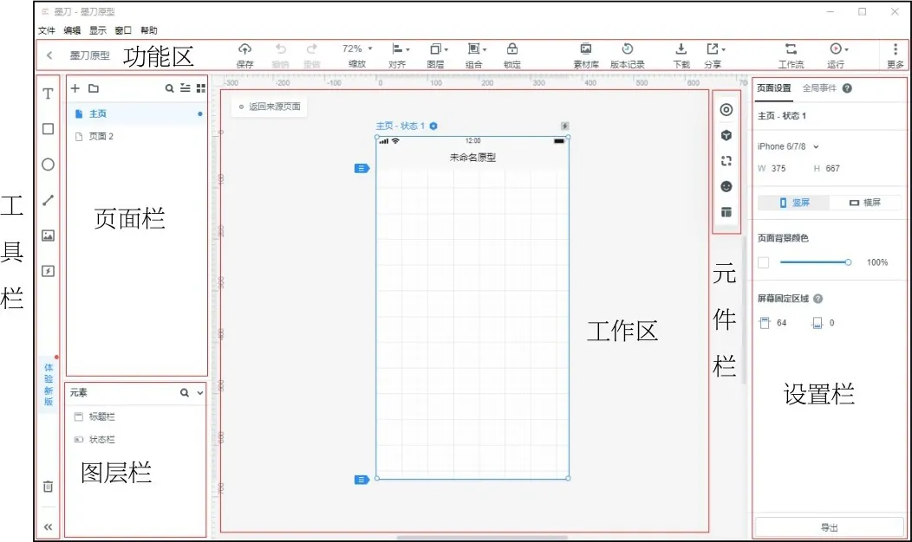

图5-1 墨刀工作界面

② 缩放：对整个工作区进行缩放设置，如图5-3所示。

③ 对齐/分布：对齐功能仅适用于两个及两个以上的组件，分布功能适用于3个及3个以上的组件；主要控制多组件的对齐方式以及分布情况，如左/中/右对齐、上/中/下对齐，以及水平/垂直等间距，如图5-4所示。

④ 图层：控制组件的层级显示关系，选中组件后可单击“置顶”“置底”“上/下移一层”按钮进行调整，如图5-5所示。

▲图5-2 常规操作

▲图5-3 缩放

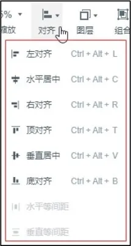

▲图5-4 对齐/分布

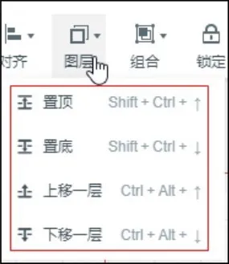

▲图5-5 图层

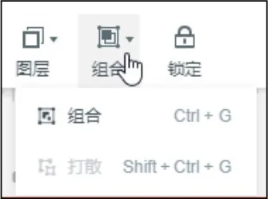

图5-6 组合

关于图层设置有以下事项需要注意。

● 新拖入的组件默认处于顶层，覆盖其他组件。

● 组合或组件复制后，图层信息也会一并复制。

● 某组件设置了“运行时固定位置”后，其他任何组件都无法置顶覆盖该组件。

⑤ 组合：选中多个组件后，单击“组合”按钮即可完成编组，编组成功后可对当前组合进行整体拖动操作，如图5-6所示。

⑥ 打散：选中某组合，单击“打散”按钮即可取消编组，然后便可重新编辑单个组件样式及位置。

⑦ 锁定：可以暂时将某些组件的位置锁定，以便更好地进行页面设计；锁定后的组件无法编辑、移动、旋转和设置链接，选中组件后单击该按钮，可取消锁定。

⑧ 素材库：完成图片上传或素材管理，如图5-7所示；当墨刀内置组件或素材库不能满足设计需要时，可以上传个人素材图片；支持上传PNG、JPEG、GIF格式的图片。

⑨ 下载：一键下载原型的离线演示文件，如图5-8所示。

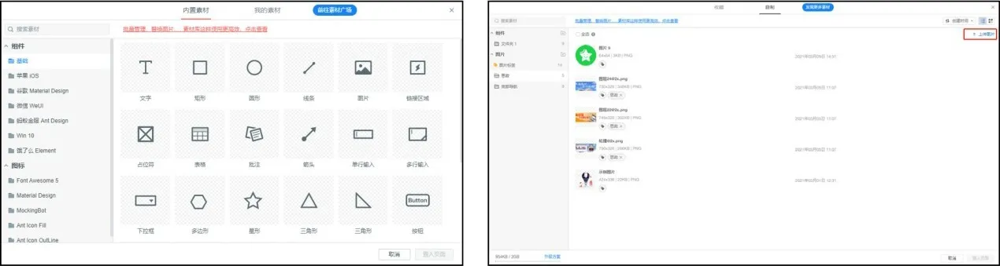

图5-7 素材库

⑩ 分享：一键将做好的项目通过链接、二维码的形式发送给其他人预览，如图5-9所示。

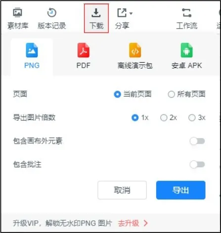

▲图5-8 下载

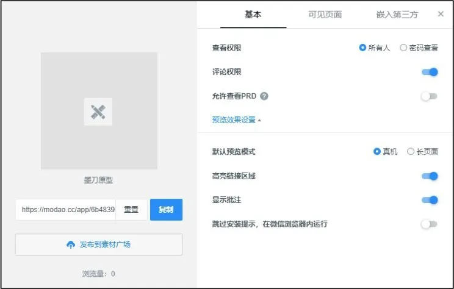

图5-9 分享

⑪ 工作流：一键打开工作流编辑界面，快速掌握项目全局交互信息，如图5-10所示。

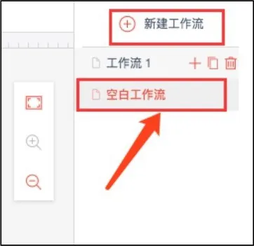

图5-10 工作流

⑫ 运行：一键预览原型文件演示效果。

⑬ 标注：快速打开项目页面信息标注页，如图5-11所示。

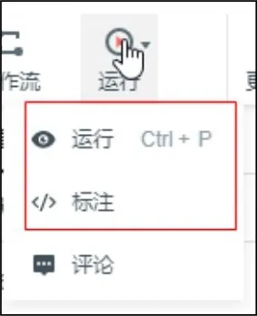

图5-11 标注

#### **2.工具栏**

工具栏包含一些基本图形设计工具，如文本、矩形、圆形、直线和图片，用来绘制基础图形，如图5-12所示。

页面回收站：保留14天内删除的页面，如图5-13所示。

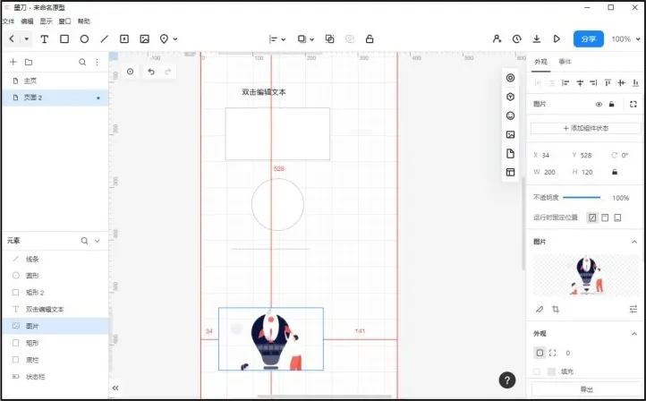

▲图5-12 图形设计工具

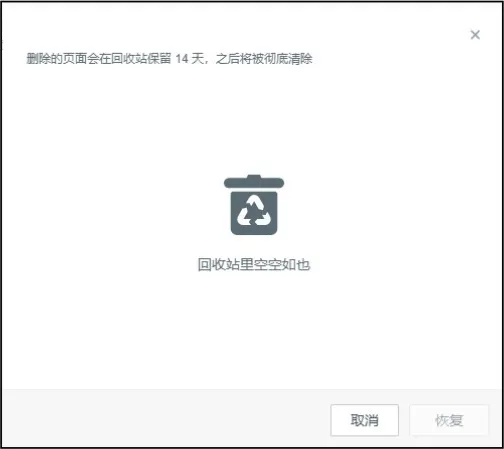

图5-13 页面回收站

收起工具：可以隐藏或显示页面栏和图层栏，如图5-14所示。

#### **3.页面栏**

在页面栏中可以完成有关页面的所有操作，如新建页面、删除页面和查找页面等，如图5-15所示。

#### **4.图层栏**

图层栏显示当前面板中的所有元件，如图5-16所示。

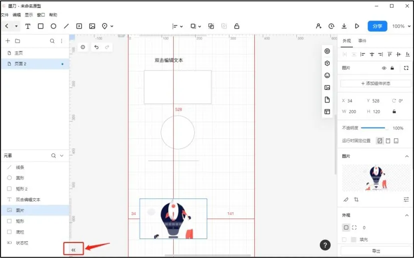

▲图5-14 收起工具

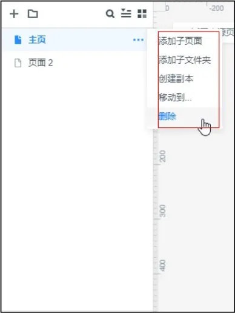

图5-15 页面栏

#### **5.元件栏**

元件栏中有状态、内置组件、我的组件、图标以及母版等，其中内置组件包含设计原型所需的大量元件，如图5-17所示。

#### **6.设置栏**

设置栏可以对元件的一些样式进行设置，如宽、高、旋转角度和文字样式等，如图5-18所示。

“全局事件”面板可以为元件添加交互效果，如图5-19所示。

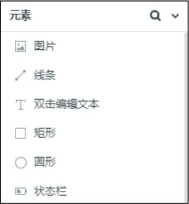

▲图5-16 图层栏

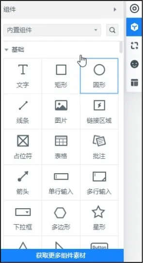

▲图5-17 内置组件

▲图5-18 设置栏

图5-19 “全局事件”面板

#### **7.工作区**

工作区是创建原型的区域，显示当前页面的所有内容，如图5-20所示；在“页面设置”面板中可以对页面进行背景颜色和大小的设置，如图5-21所示。

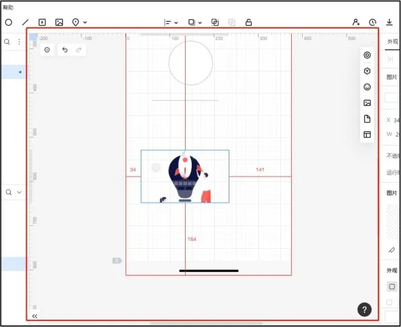

▲图5-20 工作区

图5-21 “页面设置”面板

### **5.3.2**

#### **元件**

所有的内置组件都在右侧的元件栏中，分为5类：基本组件、形状组件、输入组件、工具栏组件及其他组件。

#### **1.内置组件中的重点组件**

（1）轮播图组件

内置组件中新增了轮播图组件，自带自动轮播和左滑右滑功能，操作更加智能、便捷。

添加轮播图：从内置组件中拖出“轮播图”组件，如图5-22所示；右侧“外观”面板上自动出现图片占位，鼠标指针悬浮于上，可以选择“从本地替换”或者“从素材库替换”，如图5-23所示。

“轮播图”组件设置如图5-24和图5-25所示。

● 调整轮播图顺序，直接拖动缩略图，即可调整轮播图顺序。

● 可以设置横向和纵向两种滚动模式，指示点自动归于恰当位置。

● 选择自动轮播，可以设置轮播的时间间隔。

● 设置指示点及指示点颜色，选择是否显示指示点。

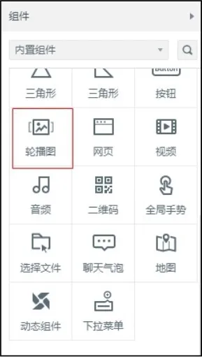

▲图5-22 “轮播图”组件

▲图5-23 设置轮播图图片

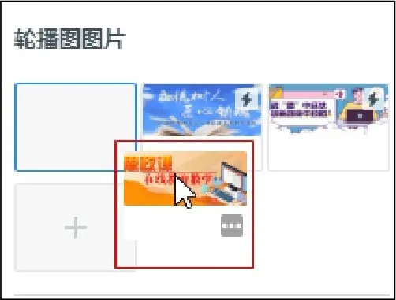

▲图5-24 调整顺序

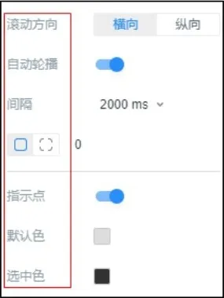

图5-25 其他设置

（2）网页组件

从内置组件中拖出“网页”组件，如图5-26所示，可以添加音频、视频或者地图URL。

输入想要展示的网页的完整URL，只能预览支持HTTP的网页，并且该网站要允许被嵌入其他网站。组件尺寸会影响预览时网页展示区域大小，也就是网页内容只会在此组件内部显示。

① 添加音频：使用“网页”组件添加音频效果，进行音乐播放器的制作。

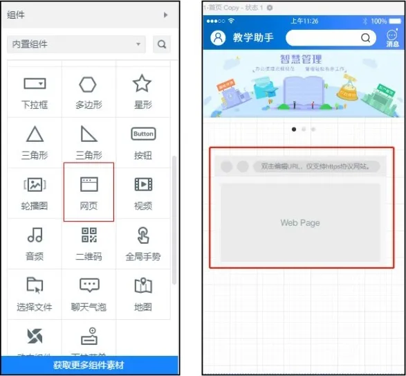

图5-26 添加“网页”组件

● 添加一个“网页”组件。（注意：“网页”组件只能预览支持HTTP且允许被嵌入其他网站的网页。）

● 访问一个音乐网址，选择某一首歌曲，然后单击“生成外链播放器”按钮，如图5-27所示。滚动到最下方，找出这段代码里的网址，如图5-28所示，在其前面补充上“https:”即可使用。将网址设为上面得到的播放器地址，如图5-29所示。

● 单击“预览”按钮，效果如图5-30所示。

② 添加地图

● 添加一个“网页”组件。（注意：“网页”组件只能预览支持HTTP且允许被嵌入其他网站的网页。）

● 使用“腾讯地图”来添加地图，腾讯地图开放平台：http://lbs.qq.com/。首先，注册腾讯地图账号，然后创建个人的key，如图5-31所示。

▲图5-27 生成外链播放器

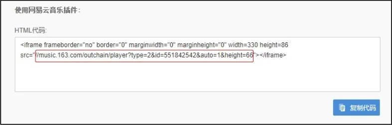

▲图5-28 HTML代码

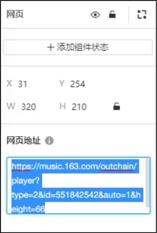

▲图5-29 在“网页”组件里添加音频链接

▲图5-30 播放音频

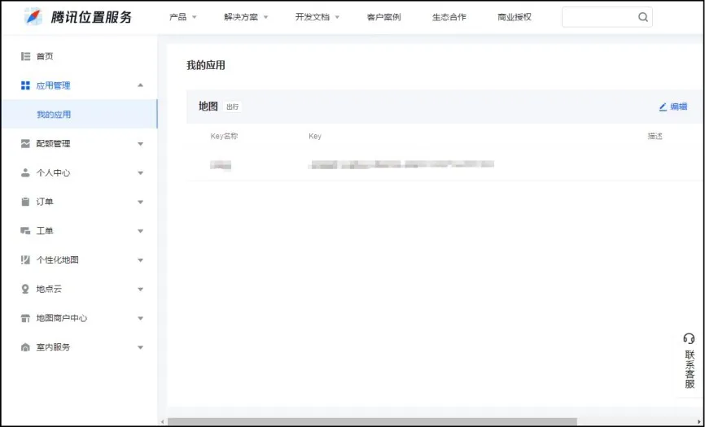

图5-31 创建用户key

● 在官网顶部，单击“开发文档”，选择“地图组件”查看详情，如图5-32所示。

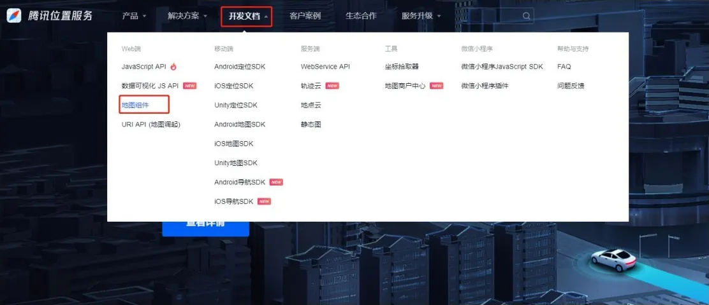

图5-32 查看详情

● 地图组件页内有一个“调用地址”部分，会看到这样一个URL:http://apis.map.qq.com/tools/poimarker?type=0&marker=coord:39.96554,116.26719;title：成都；addr：北京市海淀区复兴路32号院\|coord:39.87803,116.19025;title：成都园；addr：北京市丰台区射击场路15号北京园博园\|coord:39.88129,116.27062;title：老成都；addr：北京市丰台区岳各庄梅市口路西府景园六号楼底商\|coord:39.9982,116.19015;title：北京园博园成都园；addr：北京市丰台区园博园内&key=yourkey&referer=myApp。其中“key=yourkey”部分需要换成自己在腾讯地图创建的key。

● 将这个URL中的http替换为https，然后将里面的地址替换为想要展示的地址，进入墨刀的“外观”面板，将组件的URL设为上面的URL即可，如图5-33所示。

● 单击“预览”按钮，就可以看到地图的显示效果，如图5-34所示。

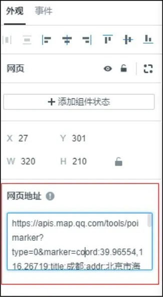

▲图5-33 添加地图URL

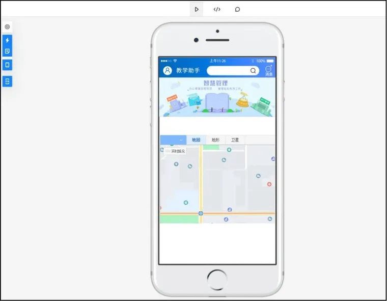

图5-34 地图的显示效果

③ 添加视频：使用“网页”组件可实现在原型中嵌入在线视频。

● 添加一个网页组件。（注意：“网页”组件只能预览支持HTTP且允许被嵌入其他网站的网页。）

● 从网站中选择要置入的视频，单击视频下方的“分享”按钮，单击“复制通用代码”按钮，如图5-35所示。

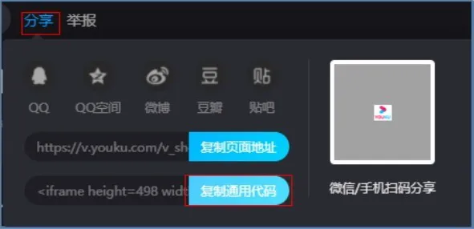

图5-35 复制通用代码

复制的代码为，找出里面的视频地址：https://player.youku.com/embed/XNDU0MjMzOTIyMA==。如果地址开头不是https，则需要改为https，然后双击“网页”组件粘贴这个地址，如图5-36所示。

● 单击“预览”按钮，在预览页面中可看到视频播放效果，如图5-37所示。

▲图5-36 粘贴地址

图5-37 视频播放效果

#### **2.我的组件**

“我的组件”面板在工作区右侧的元件栏中，它用于放置个人保存的组件，如图5-38所示。可以将可能会复用的组件或组合添加到“我的组件”面板当中，便于制作时直接拖动使用。

“我的组件”是跟随账号的，因此无论是使用墨刀的客户端还是网页端，只要登录账号，就可以在任何项目里使用里面的组件，从而提升设计效率。

创建“我的组件”有以下两种方式。

① 选中组件，单击鼠标右键，选择“添加组件素材到→我的组件”命令，如图5-39所示。

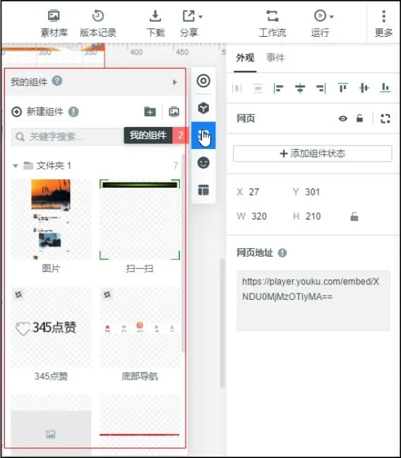

▲图5-38 “我的组件”面板

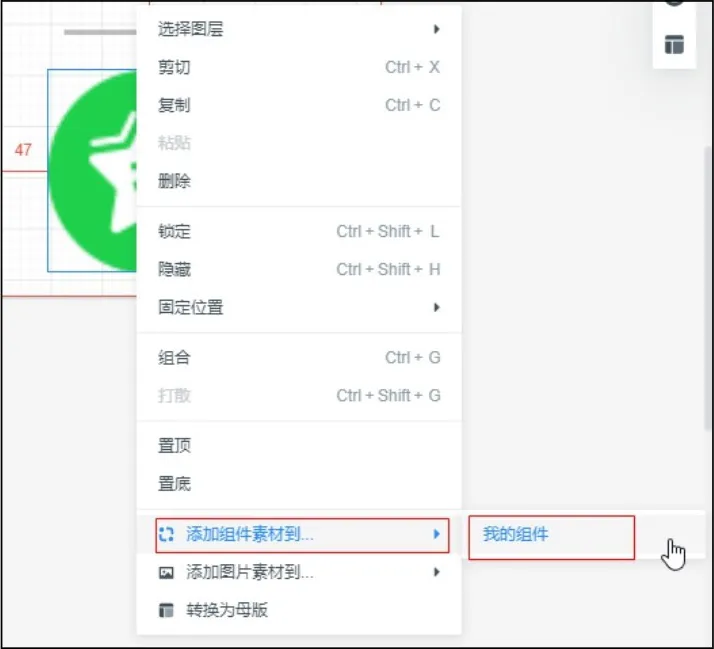

图5-39 创建“我的组件”

② 选中元素后，在“我的组件”面板中单击“新建组件”按钮，给组件设置名称，如图5-40所示。

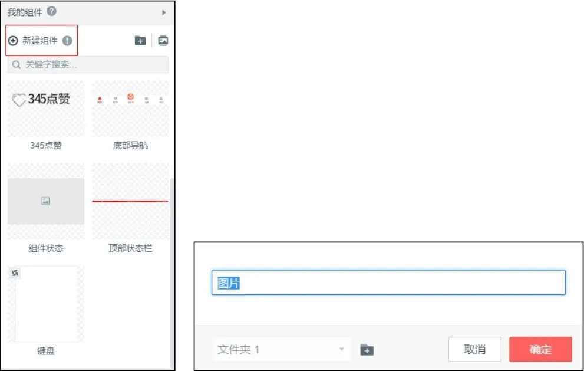

图5-40 新建组件

创建成功后，便可以通过双击或者拖动的方式进行使用，如图5-41所示。如果自定义的组件数量很多，还可以使用“搜索”功能来提升工作效率，如图5-42所示。

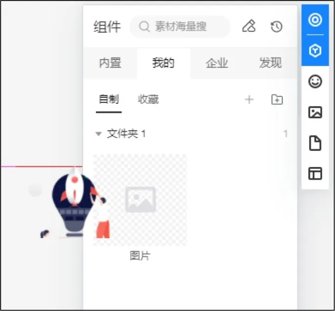

▲图5-41 使用“我的组件”

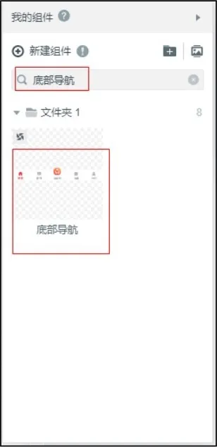

图5-42 搜索“我的组件”

#### **3.图标**

（1）添加图标

“图标”面板在工作区右侧的元件栏中，打开“图标”面板后，可以通过搜索或分类查找的方式选用图标库中的开源图标，可以在“图标”面板设置图标的默认颜色及尺寸，如图5-43所示。

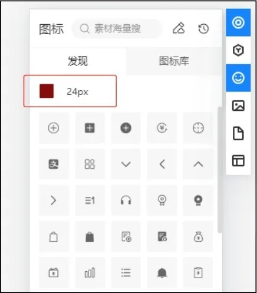

图5-43 “图标”面板

（2）下载图标

墨刀提供了下载内置图标的功能，下载格式为SVG/PNG，目前最大支持3倍倍数导出，具体操作方式如下。

在工作区，选中需要下载的图标后，单击右下角的导出按钮即可保存SVG/PNG格式的图标到本地。如需批量下载SVG图标，可按住Shift键的同时用鼠标左键点选，多选完成后，单击导出按钮，如图5-44所示。

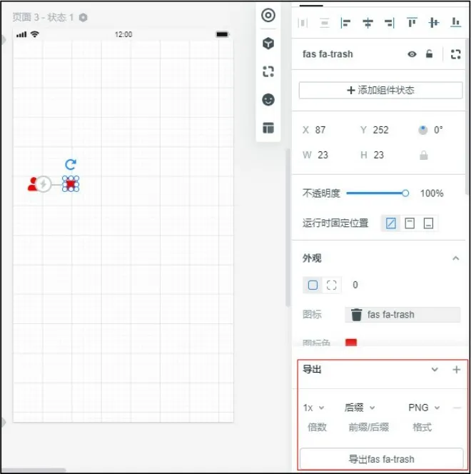

图5-44 下载图标

#### **4.母版**

在画原型时或许会面临这样的问题：同一个组件（组合）在多个页面多处都会用到，后期修改时，想一次性修改所有这样的组件。此时就可以利用墨刀的母版进行同步修改。

墨刀支持将任何组件（无论是静态的还是动态的）转换成母版。

母版的特点是具备“继承性”：只要改动母版，那么它所有的实例都能同步更新改动。

（1）新建母版

选中组件，单击鼠标右键，选择“转换为母版”命令，命名。在该项目创建的所有母版都会存放在“母版”面板中，如图5-45所示。

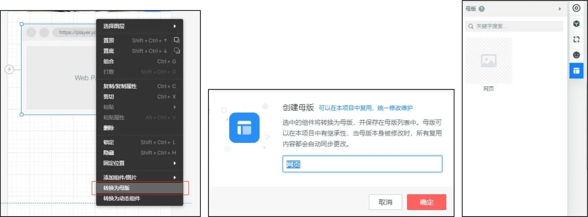

图5-45 新建母版

（2）编辑母版

鼠标指针悬浮在母版缩略图上方，单击“…”在弹出的下拉菜单中再单击“编辑”选项，即可进入母版编辑界面。修改完成后，母版在该项目里所有的实例都会同步更新修改，如图5-46所示。

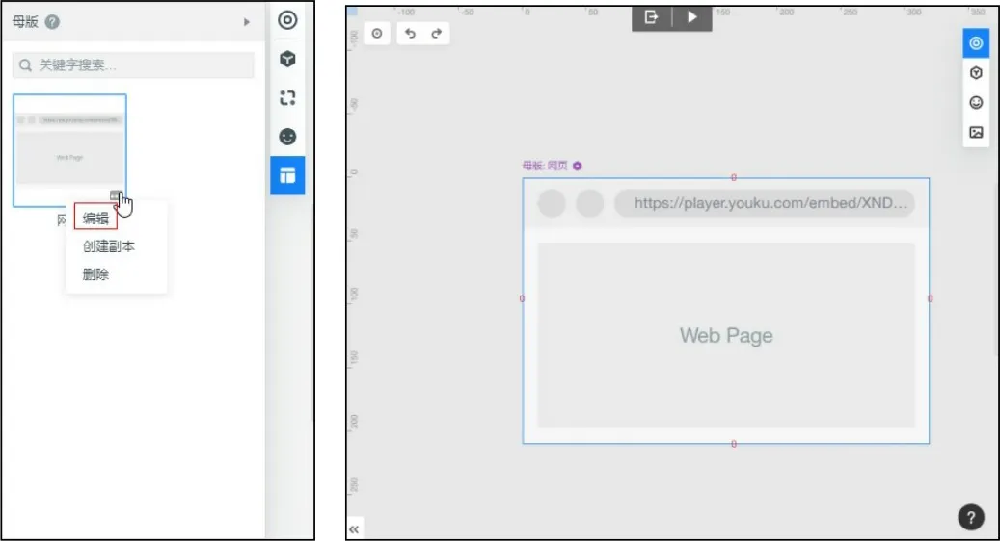

图5-46 编辑母版

### **5.3.3**

### **添加交互事件**

#### **1.添加交互链接**

第一种办法是选中组件，在“事件”面板单击“添加事件”按钮，如图5-47所示。

第二种办法是选中组件，然后拖动组件左边出现的闪电图标到目标页面，如图5-48所示。

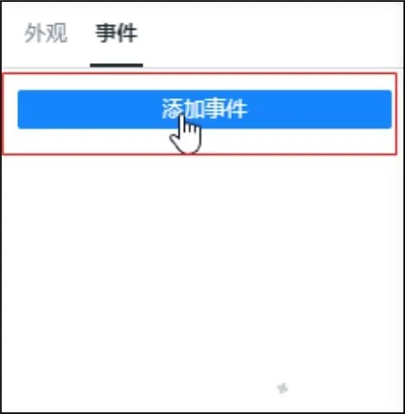

▲图5-47 添加交互链接方法1

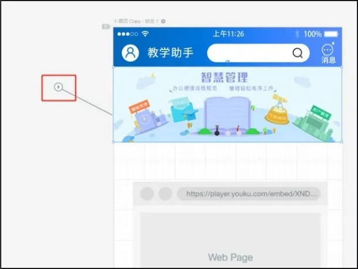

图5-48 添加交互链接方法2

如果想要删除某个链接，只需单击该链接上的剪刀图标，如图5-49所示。

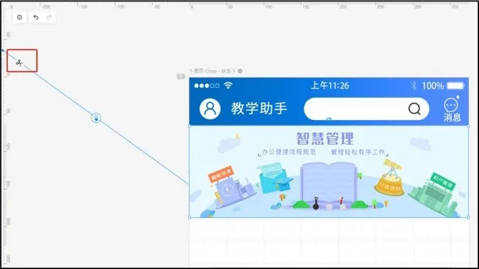

图5-49 删除链接

#### **2.添加事件**

① 全局事件：全局事件是对整个页面来说的，所以添加全局事件时不需要选中任何组件。单击整个页面，在右侧“全局事件”面板中进行事件的添加，如图5-50所示。

② 事件：事件是对所有组件来说的，需要选中某个组件之后，在右侧的“事件”面板中进行事件的添加，如图5-51所示。

▲图5-50 添加全局事件

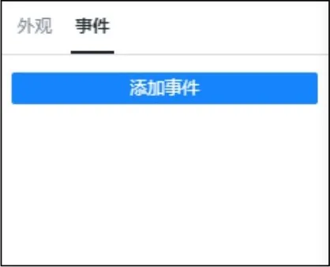

图5-51 添加事件

全局事件可以使用“定时器”进行计时交互的操作。

#### **3.事件的触发分类**

① 手指触发的事件包含单击、左滑、右滑、上滑、下滑、长按、双击和摇一摇等，如图5-52所示。

② 鼠标触发的事件包含单击、双击、长按、鼠标移入、鼠标移出和右键等，如图5-53所示。

#### **4.事件行为**

事件行为包含跳转页面、跳转超链接、切换页面状态和切换组件状态4种，如图5-54所示。选择完行为动作后即可对相应的页面或者组件进行效果的设置，如图5-55所示。

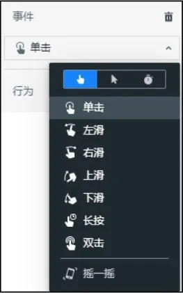

▲图5-52 手指触发事件

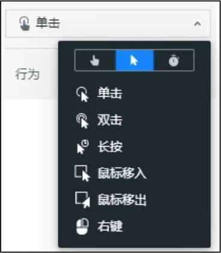

▲图5-53 鼠标触发事件

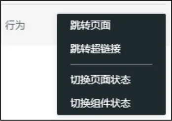

▲图5-54 事件行为

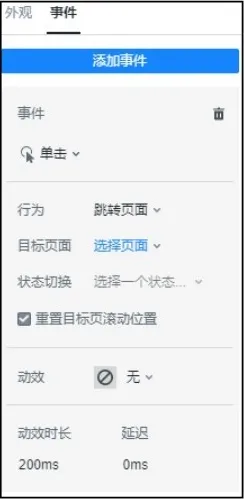

图5-55 添加交互事件

### **5.3.4**

### **演示分享**

项目做好后如需分享给其他人查看，有如下两种操作方式。

① 在功能区单击“分享”按钮，复制“分享”面板中的链接发给对方即可。

② 在项目管理页选中项目，单击“更多分享”，复制“分享”面板中的链接发给对方即可，如图5-56所示。

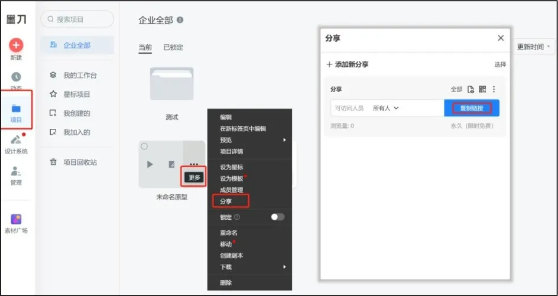

图5-56 分享

#### **1.分享时仅部分页面可见**

用链接分享墨刀项目时，可以隐藏部分页面，不进行展示，具体设置如图5-57所示。

单击右上角的“分享”按钮，在面板中切换到“可见页面”选项卡，关闭“展示全部页面”选项，然后勾选需要分享出去的页面，设置完成后，复制链接即可。

#### **2.重置分享链接**

单击“分享”按钮，在“分享”面板中单击“重置”按钮即可让旧链接失效，生成新链接，如图5-58所示。

#### **3.手机端离线演示的两种方式**

（1）墨刀App离线演示

打开墨刀App，打开需要离线演示的项目，调出“设置”面板，单击“开启离线”，如图5-59所示。

（2）安卓APK离线演示

在功能区中单击“下载”按钮，选择“安卓APK”选项，将其下载到安卓设备上，如图5-60所示。

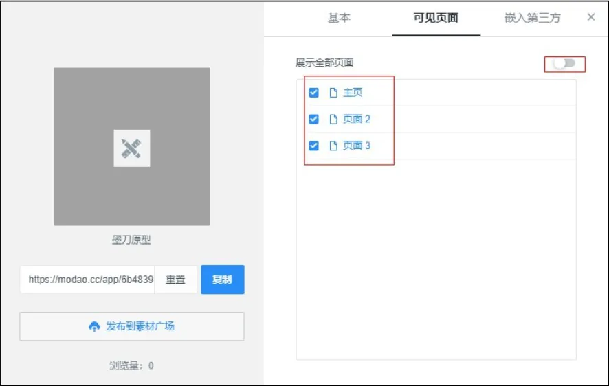

▲图5-57 设置部分页面可见

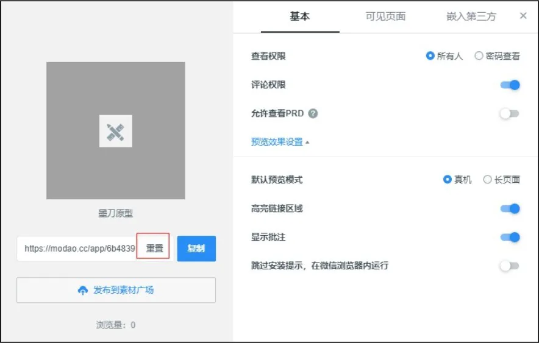

▲图5-58 重置分享链接

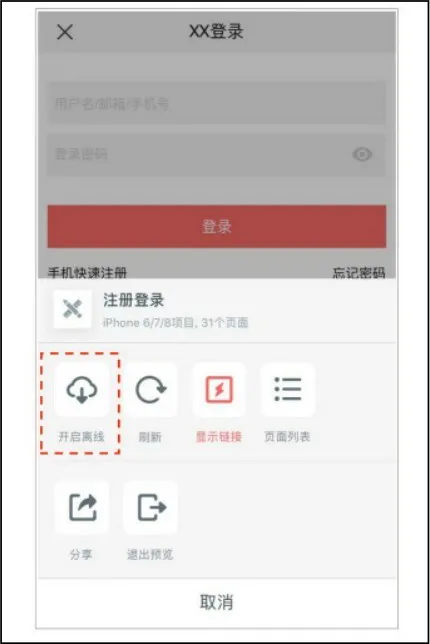

▲图5-59 墨刀App离线演示

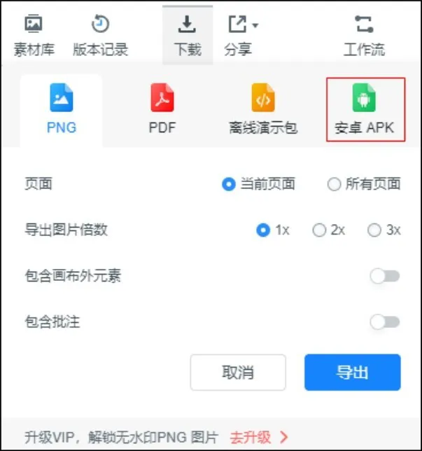

图5-60 安卓APK离线演示

#### **4.下载原型**

下载原型：单击“下载”按钮，选择要下载的文件类型即可。

注意：墨刀是在线产品，数据存在云端，没有离线源文件，下载的文件均属于演示文件；如需跨设备编辑同一个原型，在新设备登录墨刀账号即可；如需给其他人项目源文件，可以通过企业项目转移的方式实现。

① 下载HTML文件并用浏览器将其打开，可以实现在电脑端离线演示项目。HTML下载是付费功能，个人版付费用户和企业版付费用户均可下载HTML文件，免费版不支持下载HTML文件。

HTML文件的具体使用步骤。

● 在电脑端的顶部工具栏，单击“下载”按钮，选择“离线演示包”。

● 下载完文件，解压文件，双击index文件即可用浏览器打开（建议用Chrome浏览器打开），如图5-61所示。

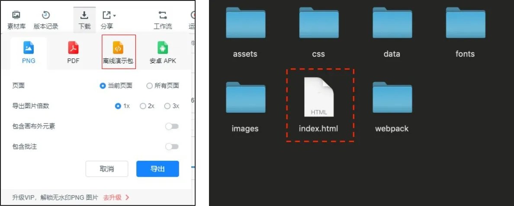

图5-61 下载HTML离线演示文件

② 下载PNG格式的文件：在功能区单击“下载”按钮，即可选择下载PNG格式的文件。下载PNG格式的文件时可以选择下载当前页面或者打包下载所有页面，并且可以选择是否包含画布外元素，如图5-62所示。

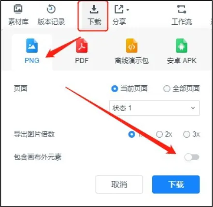

图5-62 下载PNG格式的文件

#### **5.显示、隐藏项目边框**

选中项目，单击“分享”按钮，在“分享”面板中可以设置是否显示项目边框；如需临时设置显示/隐藏项目边框，可以在运行界面左上角单击“设置”按钮来进行调整，如图5-63所示。

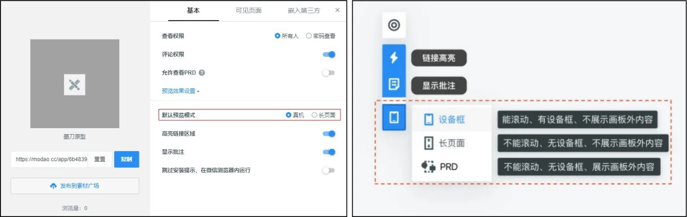

图5-63 显示/隐藏项目边框

#### **6.“PRD”模式**

在“PRD”模式的工作区中，放置在画板外的元素也可以在运行预览时显示出来。这一模式在某种程度上将“画板”无限延展，可以在这一区域内放置想展示的任意内容，支持图片、文字、表格等格式。

（1）使用“PRD”模式

① 在编辑项目的时候，在工作区内正常制作（图5-64中绿色区域）；在工作区外，可以放置产品迭代记录表格、产品流程图等（图5-64中红色区域）。

② 项目编辑完成后，可以通过单击右上角的“分享”按钮，设置“允许查看PRD”选项打开，且设置“默认预览模式”为“PRD”，如图5-65所示。

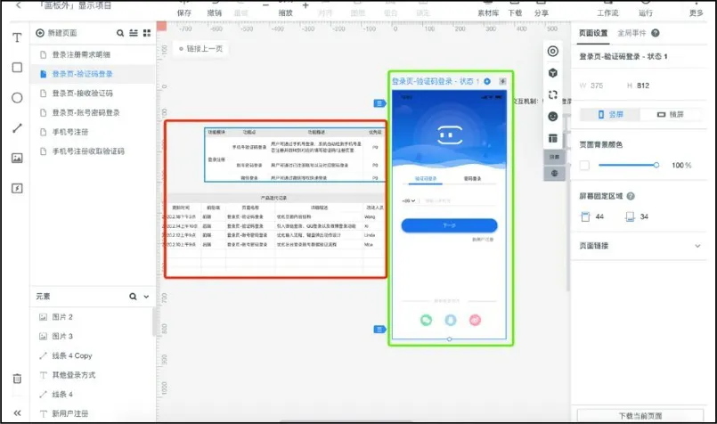

▲图5-64 工作区外放置元素

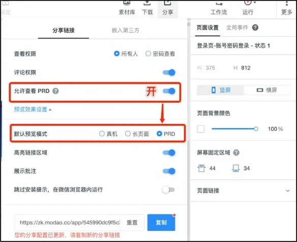

图5-65 设置“允许查看PRD”和“默认预览模式”

③ 设置好之后，将项目链接分享给其他同事，他们在获取链接后，就可以查看PRD的内容，如图5-66所示。

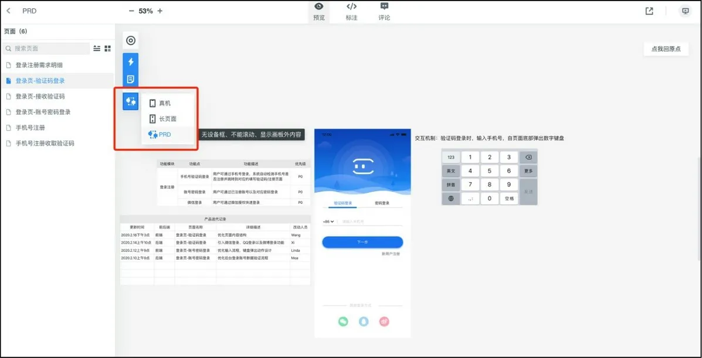

图5-66 分享PRD

（2）导出“PRD”模式的内容

在分享设置中，允许查看“PRD”模式，那么导出HTML时，可以将画板外的内容一起导出；导出PNG格式的文件功能，暂时还不支持将“PRD”内容一起导出。

（3）“长页面”模式

在项目中会遇到制作的页面高度超过“一屏”的情况。如果页面高度超过“一屏”，那么在运行的时候可以通过上下滚动来实现全页面的预览，但是上下滚动不利于用户了解页面全局分布。

为了更方便预览整个页面，墨刀提供了“长页面”模式，即“无设备框、不能滚动、不显示画板外内容”的模式，如图5-67所示。

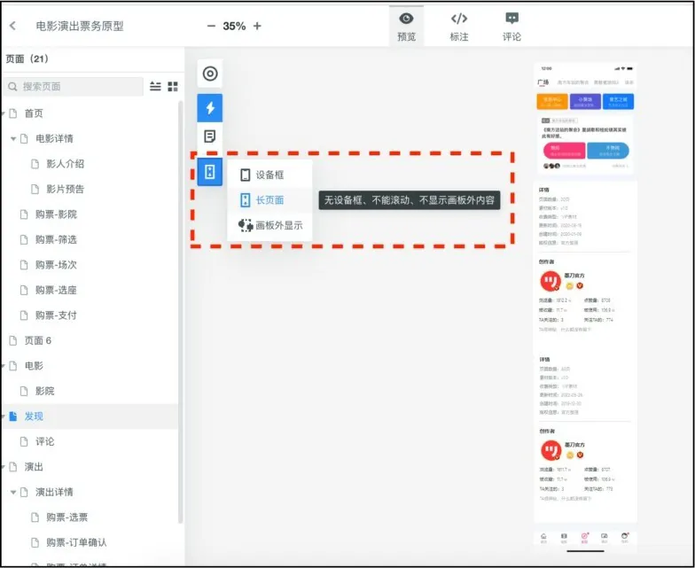

图5-67 “长页面”模式

### **5.3.5**

### **工具状态功能详解**

在设计产品原型时，可能需要用到交互动画，状态功能就是墨刀里用于设计交互动画效果的功能，类似于PPT的动画功能和Axure的动态面板功能。

状态指一个组件在不同时间点所呈现的位置、大小、颜色等属性的变化。

#### **1.状态的分类**

① 页面状态：基于页面设计，效果跟随页面，交互动画无法直接复用到其他页面。

② 组件状态：基于组件设计，效果跟随组件，交互动画能以复制组件的方式应用到其他页面。

#### **2.页面状态的基本操作**

单击右上方的小圆圈，如图5-68所示，可以打开“页面状态”面板，可以看到有一个状态1。单击“新建”按钮可以新建状态2，新建的状态没有任何组件，如果想要在不同的状态中放置不同的组件，可以选择新建状态，如图5-69所示；也可以选择状态1，单击“复制”按钮，复制出来的状态内容和状态1是一样的。如果对复制的状态的组件进行大小、位置等属性的修改，然后在状态1中添加一个点击交互效果，设置动效为“神奇移动”，就可以出现交互动画效果。所谓的“神奇移动”，是不同状态间同一个组件的平滑过渡效果。

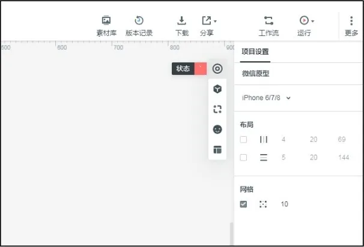

▲图5-68 “页面状态”面板

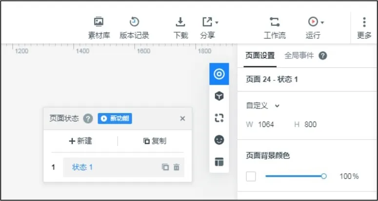

图5-69 新建状态

如果有多个状态，需要对每个状态进行重命名操作，如图5-70所示，以方便后续选择相应的状态，单击某个状态然后拖动它就可以调整状态的顺序，如图5-71所示。

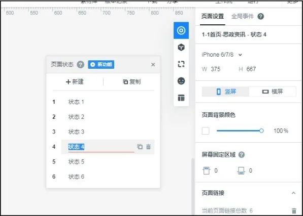

▲图5-70 状态重命名

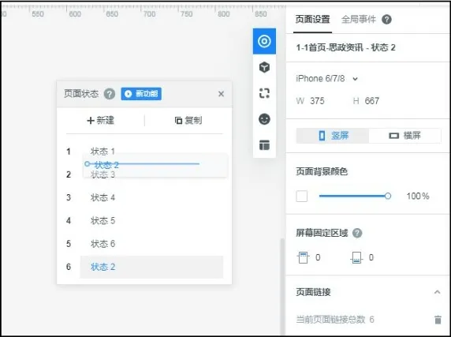

图5-71 调整状态的顺序

如果希望修改某个状态里的组件时，同步修改其他状态里该组件的样式。如文字内容需要保持一致，那么选中修改后的组件，单击鼠标右键，选择“添加/替换到其他状态”命令，如图5-72所示。

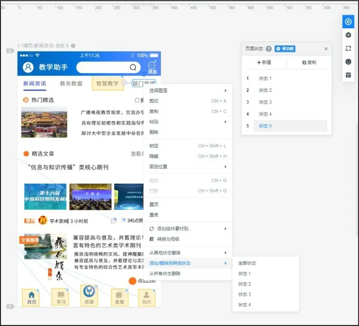

图5-72 “添加/替换到其他状态”命令

删除某个状态里的组件，对其他状态里的该组件没有影响，不过在这个状态里该组件是灰色的。如果要恢复该组件，就选中该组件，单击鼠标右键，选择“从其他状态替换”命令，就可以将替换状态中的组件恢复到这个状态中。如果想从所有的状态中删除这个组件，选中组件后单击鼠标右键，选择“从所有状态删除”命令即可，如图5-73所示。

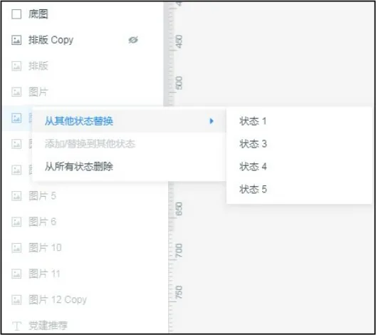

图5-73 删除状态中的组件

上面针对的是页面状态的使用，在实际原型设计中需要对页面的局部添加交互动画效果，并复用到其他页面中，这样页面状态就不适用了，因为页面状态效果跟随页面，所做的交互动画效果无法快速复用到其他页面，此时可以使用组件状态来实现。

#### **3.组件状态的使用**

组件状态的添加有如下两种方式。

第一种方式是选中组件，单击“添加组件状态”按钮，就可以为选中的组件添加组件状态，如图5-74所示。

第二种方式是将组件添加到“我的组件”中，然后在“我的组件”面板中找到该组件，单击“编辑”按钮，就可以为该组件添加组件状态，如图5-75所示。

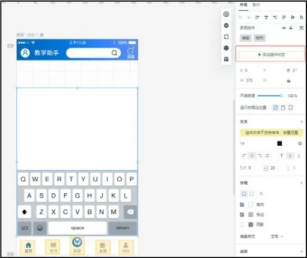

▲图5-74 添加组件状态的方式1

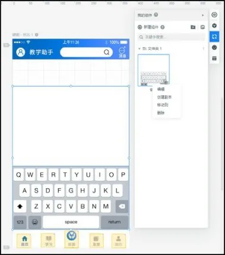

图5-75 添加组件状态的方式2

如果这个组件状态需要在多个地方用到，并且需要同步修改，可以将制作好的组件状态转换为母版，如图5-76所示。这样就可以在不同页面中复用同一个组件状态，并且在对母版进行修改编辑后，如图5-77所示，其他使用该母版的地方也会同步进行修改。

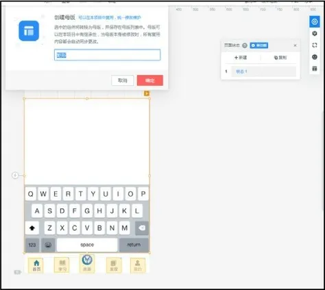

▲图5-76 将组件状态转换为母版

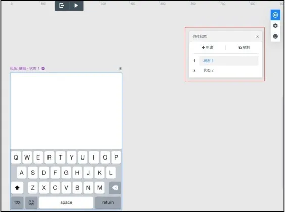

图5-77 修改组件状态的母版

### **5.4**

