## **项目实施**

——移动端“教学助手”App产品交互设计开发

借助墨刀，产品经理、设计师、开发人员、销售人员、运营人员及创业者等用户群体，能够搭建产品原型，演示项目效果。以下是使用墨刀开发项目过程中一些常见的交互功能的制作步骤。

### **5.4.1**

### **制作底部导航栏切换效果**

本小节设计和制作底部导航栏切换效果。

微课视频

▲墨刀高保真交互效果制作

▼微课视频

墨刀高保真状态功能讲解

底部导航栏切换效果的原理是：利用墨刀组件状态，通过新建交互来切换状态，并根据相应的页面来实现底部导航栏组件状态的切换。底部导航栏切换效果如图5-78所示。

制作步骤如下。

#### **1.元件基础样式设置**

① 使用元件库中的元件进行底部导航栏的制作，如图5-79所示。根据需要选择导航栏图片，如图5-80所示。

▲图5-78 底部导航栏切换效果

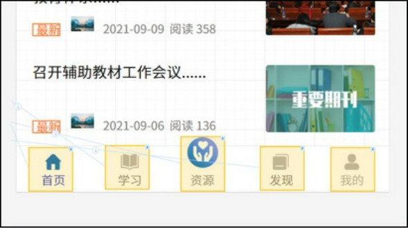

▲图5-79 底部导航栏

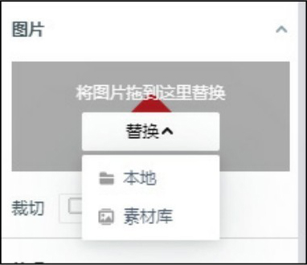

图5-80 替换图片

② 选中底部导航栏组件，在右侧的“外观”面板中单击“添加组件状态”按钮，如图5-81所示。

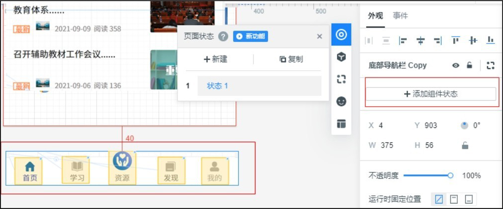

图5-81 为底部导航栏组件添加组件状态

③ 进入组件状态编辑界面后，鼠标指针悬浮在状态1上，单击右边的“复制状态”按钮，如图5-82所示。

④ 底部导航栏是5个按钮的状态切换，复制状态14次，如图5-83所示。然后修改每个状态的名称，以方便后续对状态的选择，如图5-84所示。

⑤ 修改学习状态中的首页和学习的图标样式，如图5-85和图5-86所示。

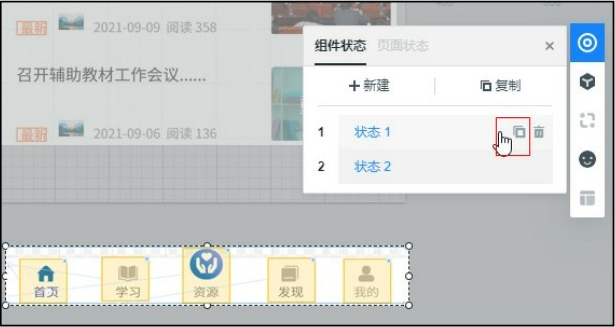

▲图5-82 “复制状态”按钮

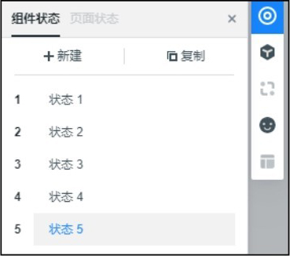

▲图5-83 复制状态

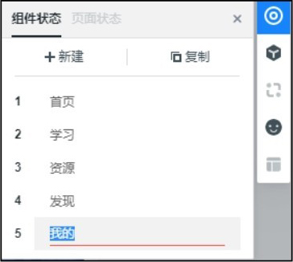

▲图5-84 修改状态的名称

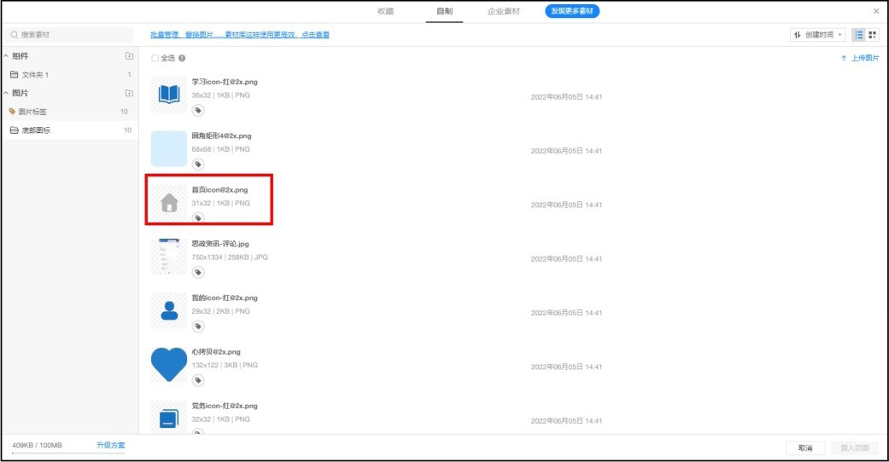

▲图5-85 修改首页的图标样式

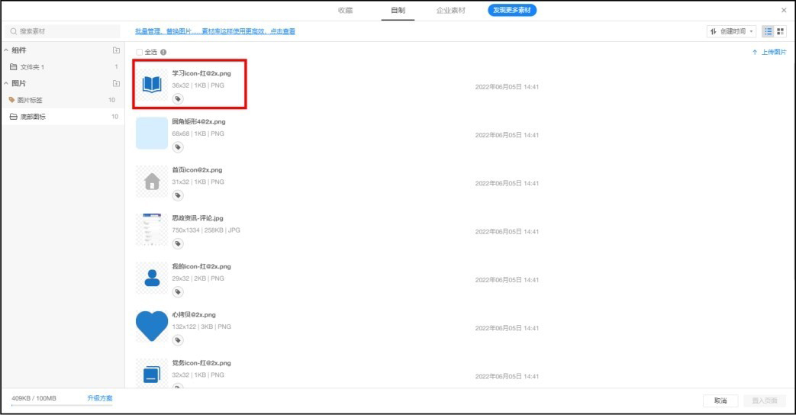

图5-86 修改学习的图标样式

⑥ 修改完成后的学习状态下的导航栏样式如图5-87所示。

⑦ 因为首页导航菜单选中样式只需要在首页状态中出现，而其他4个状态都不选中，所以需要对其他4个状态的首页菜单进行修改，单击首页图标和文本，单击鼠标右键，在快捷菜单中选择“添加/替换到其他状态”命令，选中其他3个状态，如图5-88所示。

⑧ 按照相同的方法，修改其他3个状态的导航栏样式，最终状态如图5-89所示。

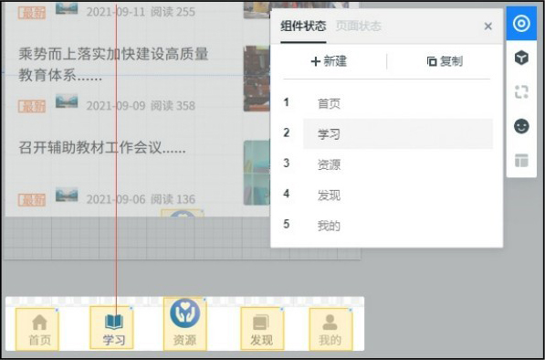

▲图5-87 学习状态下的导航栏样式

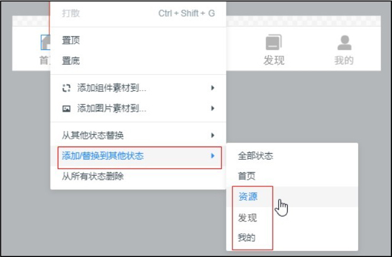

▲图5-88 快速替换其他状态中元件的样式

图5-89 其他3个状态的导航栏样式

#### **2.元件交互效果制作**

① 给每个状态的导航栏按钮覆盖一个“链接区域”元件，如图5-90所示，效果如图5-91所示。

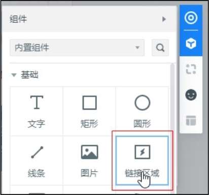

▲图5-90 添加“链接区域”元件

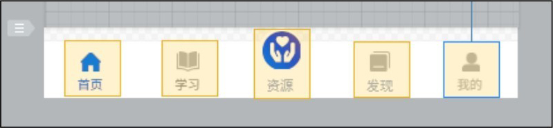

图5-91 覆盖“链接区域”元件后的样式

② 单击导航栏组件状态，单击鼠标右键，在快捷菜单中选择“转换为母版”命令，如图5-92所示，命名为“底部导航栏Copy”，如图5-93所示。转换为母版后，组件状态的样式和交互链接有继承性，稍后设置链接时就不需要重复设置了。

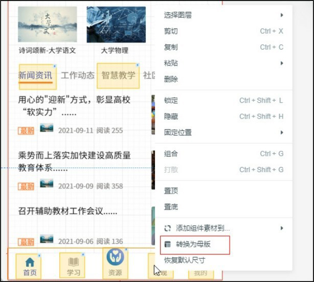

▲图5-92 将底部导航栏转换为母版

图5-93 母版命名

③ 双击进入导航栏母版编辑界面，选中首页的“链接区域”元件，拖动闪电图标，如图5-94所示，链接到“首页”页面。将后边4个“链接区域”元件也链接到相应的页面，进行交互跳转功能，状态1链接完成的效果如图5-95所示。用同样的方法，进行其他状态的交互链接。

④ 把设置好的导航栏母版，放在每个页面的下方，并且设置运行时固定在页面底部，如图5-96所示。

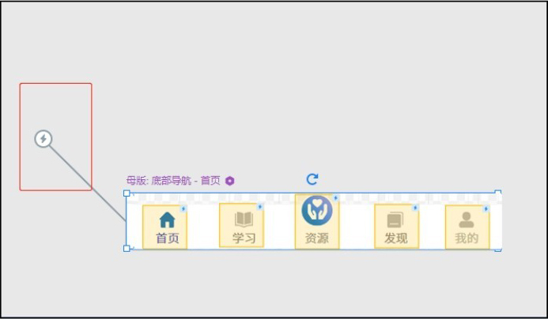

▲图5-94 为“链接区域”元件添加交互链接

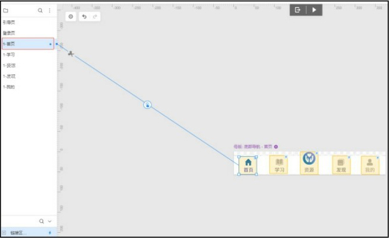

▲图5-95 状态1链接完成的效果

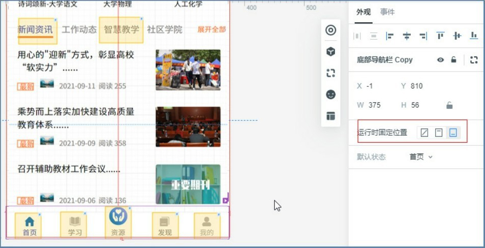

图5-96 调整母版位置

每个页面设置完成后，单击右上角的“运行”按钮，预览设置的交互效果：单击下方的导航栏菜单时，会进行导航栏上的高亮选择并显示不同的页面，如图5-97所示。

图5-97 预览效果

### **5.4.2**

### **制作TAB标签切换效果**

本小节设计和制作TAB标签切换效果。在讲解具体操作前，先看一下TAB标签切换的运行效果：运行时可以看到，TAB标签会变色，TAB标签下的指示条也会跟着移动，下边内容也跟着切换，如图5-98所示。该效果就是利用墨刀的状态切换功能，设置神奇移动效果来实现的。

图5-98 TAB标签切换效果

制作步骤如下。

#### **1.元件基础样式设置**

① 在工作区中，对“新闻资讯”页面进行搭建，如图5-99所示。选中“新闻资讯”页面后，单击右侧元件栏中的“状态”按钮，如图5-100所示。

▲图5-99 “新闻资讯”页面

图5-100 添加页面状态

② 打开“页面状态”面板后，单击“新闻资讯”页面后边的“复制”按钮，复制一个新的页面状态，并改名为“智慧教学”，如图5-101所示。

图5-101 复制“新闻资讯”页面

③ 添加“智慧教学”页面后，因为这个页面是复制的“新闻资讯”，所以需要把“智慧教学”页面的内容修改一下。修改后的“智慧教学”页面如图5-102所示。

图5-102 “智慧教学”页面

④ 在“智慧教学”页面中把“智慧教学”文本设置为蓝色选中样式，把“新闻资讯”文本设置为灰色不选中样式，把文本下边的指示条移动到“智慧教学”文本下，如图5-103所示。

⑤ 页面设置完成后，分别在“新闻资讯”页面和“智慧教学”页面中，在两个文本上放入一个“链接区域”元件，设置尺寸覆盖文本单击的区域，用来制作交互效果。

#### **2.元件交互效果设置**

① 在“新闻资讯”页面选中“智慧教学”文字上方的“链接区域”元件，拖动闪电图标到“页面状态”面板的“智慧教学”状态上，如图5-104所示。

同样，在“智慧教学”页面中，选择“新闻资讯”文字上的“链接区域”元件，拖动闪电图标到“新闻资讯”状态上，如图5-105所示。

② 在右侧的“事件”面板中，可以看到交互事件的详细设置，如图5-106所示。

▲图5-103 调整TAB标签样式

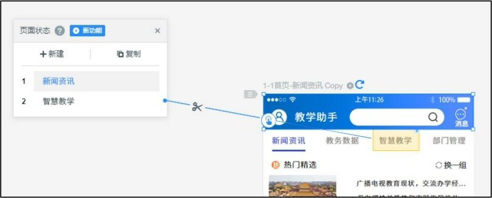

▲图5-104 “智慧教学”链接交互

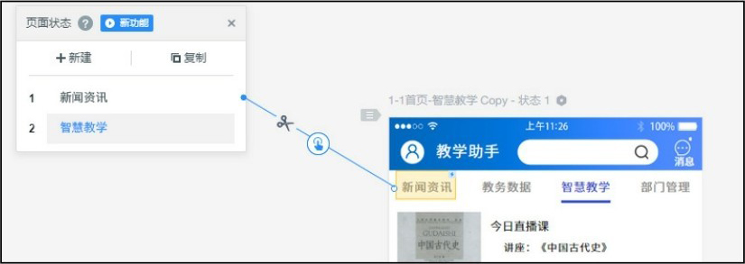

▲图5-105 “新闻资讯”链接交互

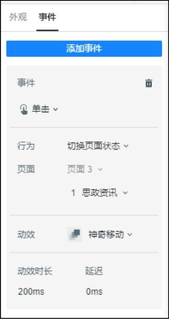

图5-106 交互事件设置面板

设置完成后，单击墨刀右上角的“运行”按钮进行预览，查看设置的交互效果，切换TAB标签时可以看到指示条的移动和标签的切换效果，如图5-107所示。

图5-107 预览效果

### **5.4.3**

### **制作点赞效果**

本小节设计和制作点赞效果。在讲解具体操作前，先看一下点赞效果，如图5-108所示，在点赞时爱心会变成红色，并跳动一下，再次点击就会取消点赞。该效果是利用墨刀工具的状态切换功能，设置元件的动效来实现的。

图5-108 点赞效果

制作步骤如下。

#### **1.元件基础样式设置**

① 在工作区中设置好需要的点赞图片和文本说明，如图5-109所示。设置完成后把这两个元件全部选中，然后在右侧的“外观”面板中单击“添加组件状态”按钮，如图5-110所示。

② 进入组件状态编辑界面后，可以看到两个状态，如图5-111所示。在状态2中设置点赞后的效果，把点赞图片修改为红色的心形图片，文字点赞内容数量增加1，如图5-112所示。

③ 为点赞图片设置动效，在状态2中选中心形图片，在右侧的“外观”面板上，打开“动效”下拉列表，选择“橡皮筋”效果，如图5-113所示。

▲图5-109 点赞图片和文本说明

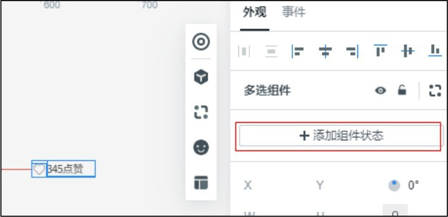

▲图5-110 “添加组件状态”按钮

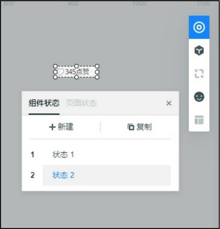

▲图5-111 组件状态编辑界面

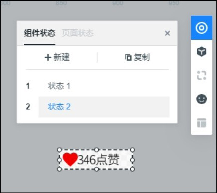

▲图5-112 编辑状态2中的点赞样式

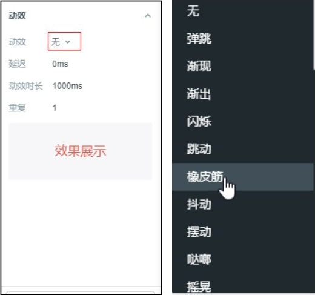

图5-113 点赞动效设置

#### **2.元件交互效果设置**

样式设置完成后，就可以添加交互效果了。在组件状态编辑界面中，设置点赞图片交互链接到状态2，如图5-114所示。在状态2中，设置点赞图片交互链接到状态1，如图5-115所示。这样点赞和取消点赞效果就制作完成了。

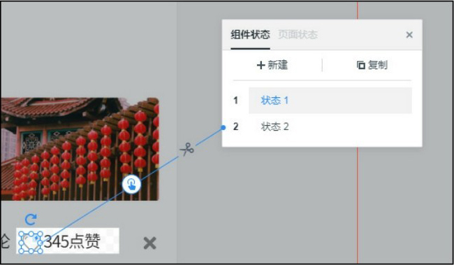

▲图5-114 点赞交互链接设置

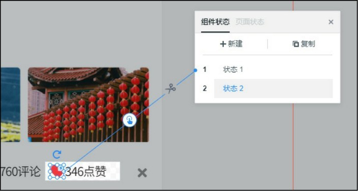

图5-115 取消点赞交互链接设置

设置完成后，单击右上角的“运行”按钮进行点赞和取消点赞效果的预览，如图5-116所示。

图5-116 点赞和取消点赞效果

### **5.4.4**

### **制作图片左右滚动效果**

本小节设计和制作图片左右滚动效果。当一行的内容无法一次性全部显示时，可以通过左右滑动鼠标来显示未显示的内容，如图5-117所示。该效果是利用墨刀工具的组件状态来实现的。

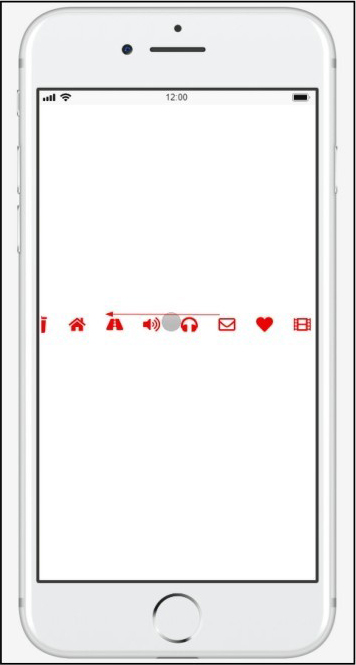

图5-117 图片左右滚动效果

制作步骤如下。

① 在墨刀工作区中放入一些元件，元件需要超出页面的宽度，如图5-118所示。设置完后选中全部元件，在右侧“外观”面板中单击“添加组件状态”按钮，如图5-119所示。

② 进入组件状态编辑界面，有两个状态，如图5-120所示。我们不需要对组件状态做其他的调整，退出组件状态编辑界面后，单击这个组件，然后调整组件的宽度。可以看到当组件的宽度调小后，里面的内容会只显示组件宽度内的内容，如图5-121所示。

设置完成后单击右上角的“运行”按钮，预览图片左右滚动显示的效果，如图5-122所示。

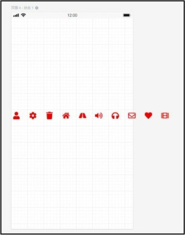

▲图5-118 设置元件

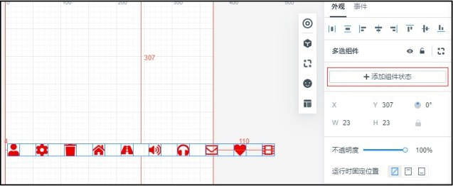

▲图5-119 “添加组件状态”按钮

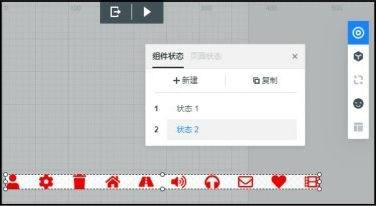

▲图5-120 组件状态

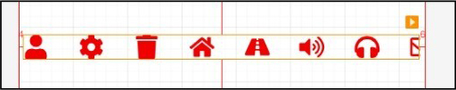

▲图5-121 调整组件的宽度

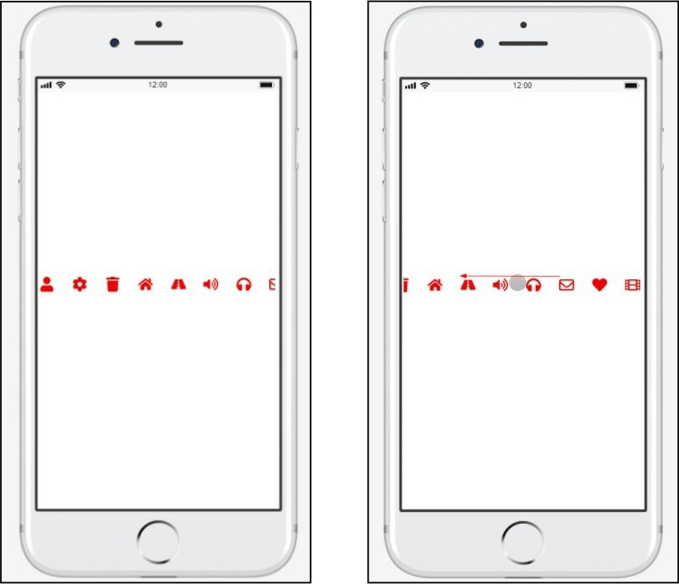

图5-122 预览效果

### **5.5**

## **项目小结**

本项目介绍了墨刀原型设计工具的基础知识，包括软件的使用方法、面板及工具的使用方式。其中，本项目着重介绍了软件中的状态功能，墨刀中的状态功能是整个软件中非常重要的部分，可以帮助用户制作很多交互效果。想要使用墨刀软件制作原型，必须熟练掌握状态功能的用法。

## **5.6**

## **素养拓展小课堂**

在众多原型设计工具中，国产原型设计软件——墨刀具有很多优点，墨刀的特点体现出了国产原型设计工具方便、快捷、高效的设计定位，增强了用户的民族自豪感和对国家的自信心。

同时，本项目采用实际素养拓展素材为原型，进行原型交互效果实现，培养学生爱岗、敬业的社会主义核心价值观。

#### **5.7**

## **巩固与拓展**

本项目主要介绍了墨刀原型设计工具组件、素材和母版的使用，交互功能的添加，以及状态功能。在实际的市场产品设计中，App交互设计的组件使用以及功能操作都是完整设计的基础，最终根据实际项目需求通过一个个基础效果的叠加完成完整的App产品。因此，请同学们搜集新的交互效果案例，思考其中交互实现的方法，并通过自主学习，不断提高使用墨刀的能力。

## **5.8**

## **习题**

### **一、单选题**

1.墨刀是一款（ ）工具。

A.草图设计

B.离线原型设计

C.线框图设计

D.在线原型设计与协同

2.下面关于墨刀的描述，错误的是（ ）。

A.墨刀是一款位图编辑设计软件。

B.墨刀是一款在线原型设计与协同工具。

C.墨刀是协作平台，项目成员可以协作编辑、审阅。

D.墨刀具有真机设备边框、沉浸感全屏、离线模式等多种演示模式。

3.以下对墨刀功能的介绍，错误的是（ ）。

A.操作简单：简单拖动和设置，即可将想法、创意变成产品原型

B.团队协作：与同事共同编辑原型，效率提升；一键分享发送给别人，分享便捷；还可在原型上打点、评论，收集反馈意见，高效协作

C.交互简单：简单拖动就可实现页面跳转，还可通过“交互”面板实现复杂交互，具有多种转场效果，可以实现各种交互效果

D.素材库：内置丰富的行业素材库，也可以创建自己的素材库、共享团队组件库，实现高频素材直接复用

### **二、多选题**

1.下列（ ）是常用的原型制作工具。

A.墨刀

B.PowerPoint

C.InDesign

D.Axure

2.状态指一个组件在不同时间点所呈现的（ ）等属性的变化。

A.位置

B.显示、隐藏

C.大小

D.颜色

3.下列对页面状态和组件状态描述正确的有（ ）。

A.页面状态：基于页面设计，效果跟随页面，交互动画无法直接复用到其他页面

B.页面状态：基于页面设计，效果跟随页面，交互动画可以直接复用到其他页面

C.组件状态：基于组件设计，效果跟随组件，交互动画不能以复制组件的方式应用到其他页面

D.组件状态：基于组件设计，效果跟随组件，交互动画能以复制组件的方式应用到其他页面

4.下列选项中，属于墨刀内置组件的有（ ）。

A.轮播图

B.网页

C.视频

D.下拉菜单

