## **Adobe XD概述**

Adobe XD是一款集视觉设计、交互设计、原型制作、共享功能于一体的协作式跨平台设计软件，在这款软件上用户可进行移动应用和网页设计与原型制作。

### **6.3.1**

### **Adobe XD的基础操作**

当启动这个软件时，欢迎界面会提供不同标准屏幕尺寸模板以及用户自己设定的文件尺寸模板。此外，欢迎界面还包含很多可以访问的资源，通过这些资源用户可以进一步学习Adobe XD工具的使用方法。

微课视频

Adobe XD的基础操作和基本工具

#### **1.新建、打开和保存文件**

打开Adobe XD的菜单，选择“新建”命令，即可新建一个Adobe XD文件，如图6-1所示。选择“保存”命令，即可保存Adobe XD文件，如图6-2所示。

选择“打开”命令，如图6-3所示，即可打开Adobe XD文件。双击Adobe XD文件的图标，也可打开该Adobe XD文件。

在“主页”屏幕中选择一个预设尺寸，进入工作界面即是创建好的新文件。也可以自定义文件的大小，然后按Enter键完成新建文件操作。

在工作界面顶端中间，可以看到文件名称和三角形图标，如图6-4所示。

单击三角形图标，弹出“重命名您的文档”对话框，如图6-5所示，在此对话框中可重新为文件命名。

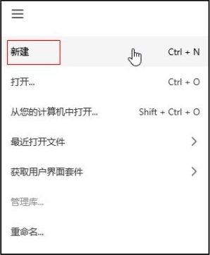

▲图6-1 新建文件

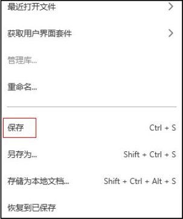

▲图6-2 保存文件

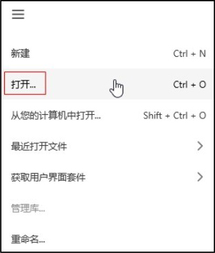

▲图6-3 打开文件

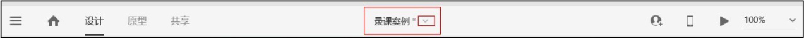

图6-4 文件名称

#### **2.画板**

画板通常是设计师为移动端应用程序或网站设计的界面。一个Adobe XD文件中可以包含多个画板，如图6-6所示。

（1）创建画板

首次创建项目或文件时，可以在“主页”屏幕中选择一项预设来决定画板的大小。如果想要指定画板的大小，可以选择“自定义大小”选项，设置完成后进入工作界面，如图6-7所示。

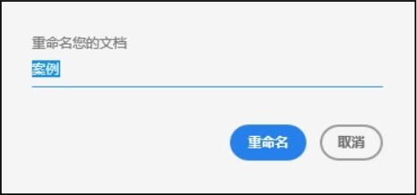

▲图6-5 重命名文件

▲图6-6 一个文件中的多个画板

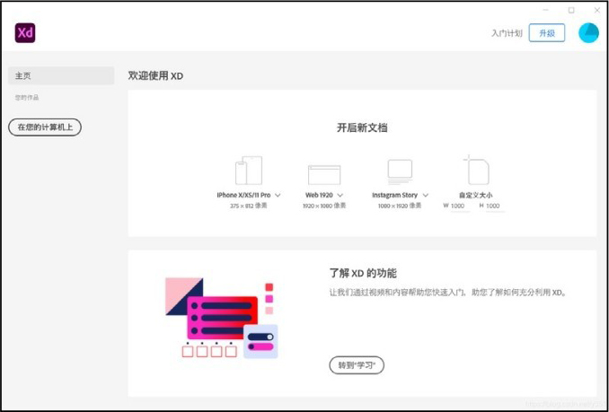

图6-7 设置画板尺寸

还可以选择“画板”工具，然后单击右侧属性面板上的任一画板，如图6-8所示。选择的画板将出现在工作界面中，这样可以添加更多的画板到现有文档中。

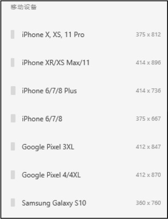

图6-8 画板预设

（2）复制画板

按住Alt键的同时拖动一个画板，可以进行画板的复制操作，如图6-9所示。

或者选择需要复制的画板，单击鼠标右键，在弹出的快捷菜单中选择“复制”命令，随后在需要的位置再次单击鼠标右键，在弹出的快捷菜单选择“粘贴”命令，如图6-10所示。

（3）调整画板大小

单击画板，使用出现在边缘上的圆形手柄可以调整画板的大小。

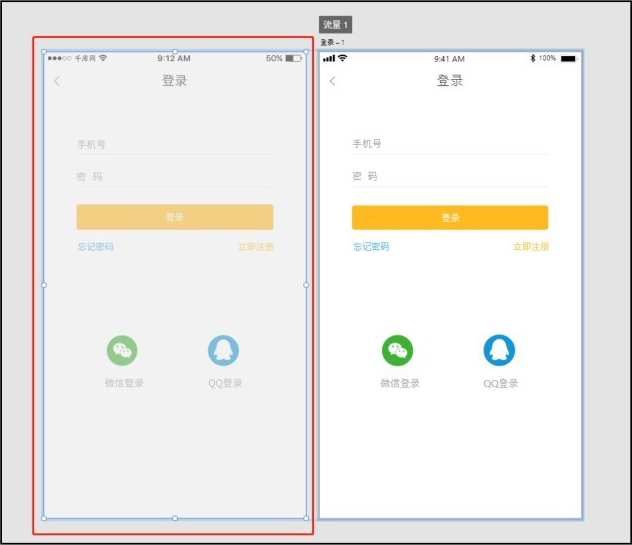

▲图6-9 复制画板1

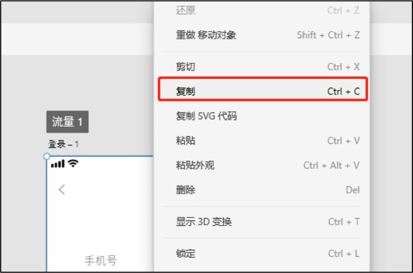

图6-10 复制画板2

（4）重命名画板

Adobe XD默认情况下会根据选择的预设对画板命名，并按顺序给画布编号。想要为画板指定名称，可以双击画板标题并输入新的名称，如图6-11所示。

也可以在图层面板中重命名画板，双击或右击画板标题并选择“重命名”命令，输入新名称，如图6-12所示。

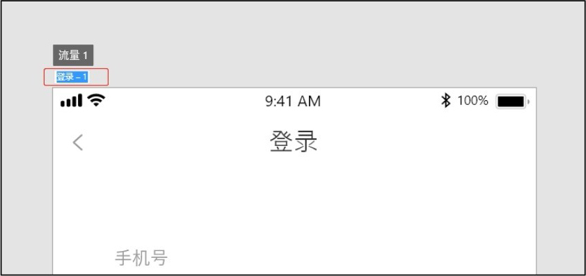

▲图6-11 重命名画板1

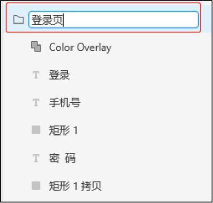

图6-12 重命名画板2

#### **3.导入对象**

在Adobe XD中，我们可以将其他资源导入工作区，进一步改进这些资源，最后使用其开发交互式原型；也可以在Adobe XD中打开其他资源，改进或添加交互链接后储存为Adobe XD文件。

使用“打开”命令，可以将Photoshop和Illustrator文件转换为Adobe XD文件。使用“导入”功能，可以把这些文件内容添加到现有的Adobe XD文件中。

（1）在Adobe XD中打开Photoshop文件

可以直接在Adobe XD中打开Photoshop文件，并将其转换为Adobe XD文件。打开Photoshop文件后，可以在Adobe XD中进行编辑，通过连线构建交互，并以原型或设计规范的形式进行共享。在菜单中选择“打开”命令，找到所需的文件夹并选择“.psd”文件，然后单击“打开”按钮，如图6-13所示。

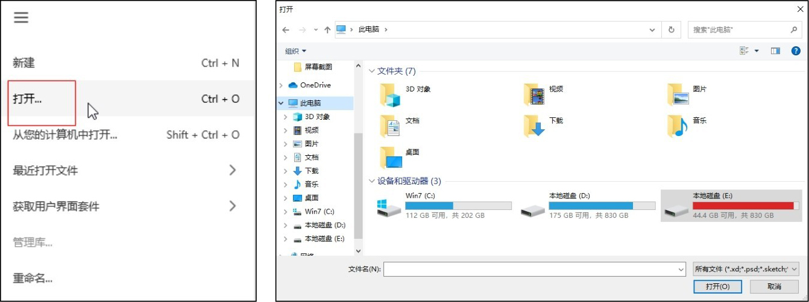

图6-13 在Adobe XD中打开Photoshop文件

（2）将Photoshop文件导入Adobe XD

在菜单中选择“导入”命令，可以将Photoshop文件导入Adobe XD。如果导入的Photoshop文件有画板，这些画板将被放在Adobe XD画板之下。如果Adobe XD画板下方没有空间，则导入的画板将被放在可用空间中。如果导入的Photoshop文件没有画板，其资源将被放在画布的中心，如图6-14所示。

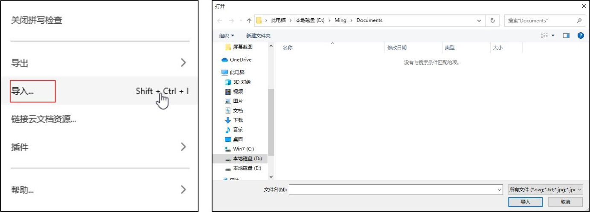

图6-14 将Photoshop文件导入Adobe XD

使用相同的方法，可以在Adobe XD中打开Sketch和Illustrator文件。也可以使用相同的方法，在Adobe XD中导入PNG、JPEG、TIFF、GIF或SVG文件。

#### **4.画布中关于对象的操作**

可以通过单击和框选两种方式来选择对象。选择对象后可以对其进行调整、旋转、复制、编组和锁定等操作。

（1）选择对象

先将一个对象与其周围的对象区分开来，然后选择该对象，在选择对象或者对象的一部分后，才可以根据需要对其进行编辑操作。

选择“选择”工具，单击对象或对象组将其选择，如图6-15所示。使用“选择”工具在对象周围绘制选框，或按住Shift键再连续单击对象可选择多个对象，如图6-16所示。

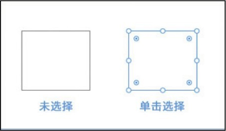

▲图6-15 单击选择对象

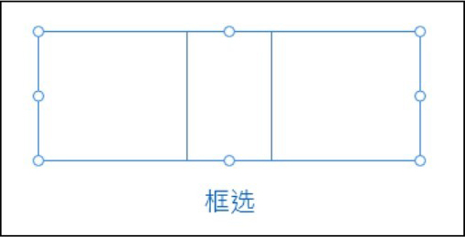

图6-16 框选多个对象

（2）调整对象

选择对象或对象组时，对象或者对象组的边界框会出现圆形手柄，向任意方向拖动这些手柄可调整对象或对象组的大小，如图6-17所示。

在属性面板中单击锁定图标，可以在调整对象大小时锁定对象的宽高比，如图6-18所示。

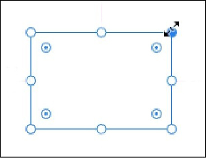

▲图6-17 调整对象的大小

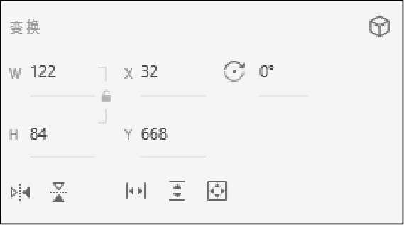

图6-18 锁定宽高比

（3）旋转对象

选择对象或对象组，将鼠标指针悬停在圆形手柄上，然后将鼠标指针略微移动到手柄外部，可看到旋转图标。在看到旋转图标时，朝所需方向拖动手柄即可旋转对象或对象组，如图6-19所示。

也可以在属性面板中对对象进行旋转设置，不过在属性面板中设置的是具体旋转值，如图6-20所示。

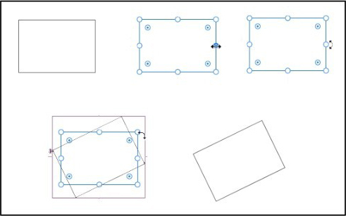

▲图6-19 旋转对象

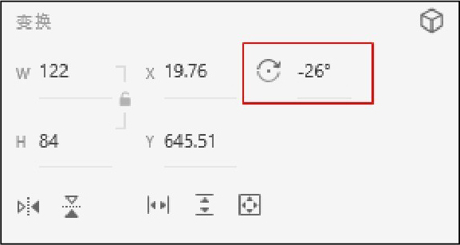

图6-20 设置旋转值

（4）复制对象

选择一个或多个对象，按住Alt键并拖动所选对象即可复制该对象；也可以通过单击鼠标右键，在弹出的快捷菜单中选择“复制”命令来复制对象，如图6-21所示。

（5）粘贴对象

可以选择一个对象或一个对象组，按快捷键Ctrl+C进行复制，然后按快捷键Ctrl+V将其粘贴到多个画板上。粘贴时，Adobe XD可以智能地将对象放置在与原始对象相同的位置上。

还可以复制对象样式，并将该样式粘贴到项目中的其他对象或文本元素上。复制对象后，选择需要粘贴样式的对象并单击鼠标右键，在弹出的快捷菜单中选择“粘贴外观”命令，这时只会粘贴对象的样式，如图6-22所示。

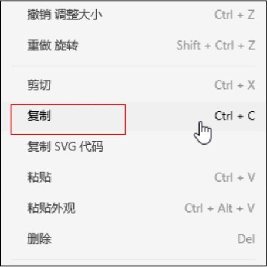

▲图6-21 复制对象

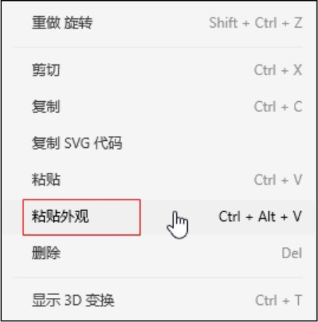

图6-22 粘贴对象的样式

（6）编组对象

可以将若干个对象编入一个组中，把这些对象作为一个单元进行处理，这样就可以同时移动或变换一组对象，且不会影响其属性或相对位置。

将徽标设计中的所有对象选中，单击鼠标右键后，在弹出的快捷菜单中选择“组”命令，将其编成一组作为一个单元进行移动和缩放，如图6-23所示。可以取消编组，重新获取对单个组成部分的编辑控制权。

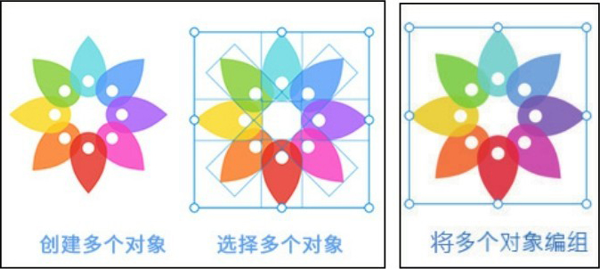

图6-23 编组对象

还可以编辑组内所有对象的填充和笔触属性，以及嵌套组，即将组编入其他对象或组中，进而组成更大的组。

通常情况下，只需要单击一个对象即可将其选中。如果对象属于一个组，当单击该对象时会选择整个组。要在多个组中选择对象，可按住Ctrl+Shift组合键并单击，将对象添加到所选内容中，而不影响它们所属的组。选择后，可以在属性面板中轻松更改属性，如分组、锁定、切换可见性等。

（7）锁定对象和解锁对象

锁定对象可以防止对象被选择和编辑。选择对象，然后单击鼠标右键，从弹出的快捷菜单中选择“锁定”命令，即可将对象锁定。

如果锁定了一个对象，当选择它时会出现锁定图标，如图6-24所示。要解锁对象，可以选择它们并单击锁定图标，或者单击鼠标右键，在弹出的快捷菜单中选择“解锁”命令，如图6-25所示。

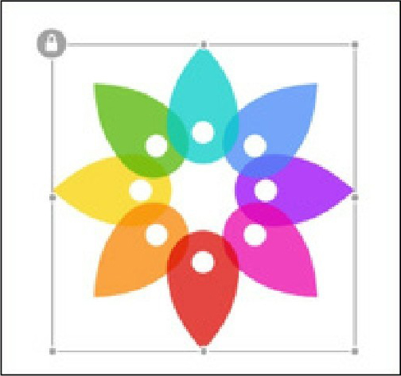

▲图6-24 锁定图标

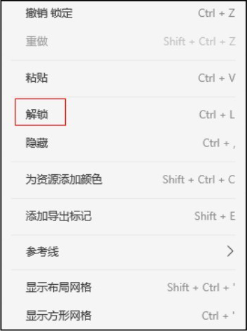

图6-25 解锁对象

（8）翻转对象

使用翻转功能可以翻转对象，以便在设计画布上实现更快速、更精确的设计。我们可以在属性面板中，为对象快速进行垂直翻转和水平翻转的设置，如图6-26所示。

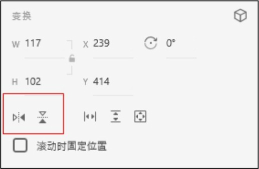

图6-26 水平翻转和垂直翻转

（9）移动对象

使用“选择”工具拖动选择的对象，可实现对对象的移动操作，也可以按键盘上的箭头键来移动对象，还可以在属性面板中输入精确的值来移动对象，如图6-27所示。

按Shift键可以约束一个或多个对象的移动，使其沿着当前x轴或y轴的方向移动，如图6-28所示。

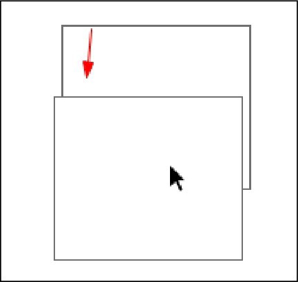

▲图6-27 移动对象

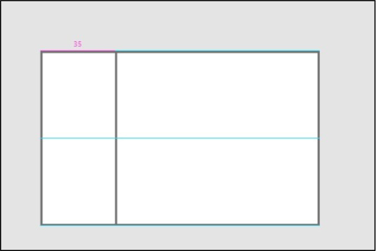

图6-28 按Shift键约束对象移动

（10）对齐对象和分布对象

使用对齐功能，可以将选定的对象沿水平或垂直方向对齐到选区或画板。

对象的对齐操作是根据对象之间的相对位置进行分布或排列的。选择要对齐的所有对象，在属性面板中单击任意对齐选项，这时选择的对象将按照单击的对齐方式进行排列或分布。

对齐选项包括顶对齐、居中（垂直）对齐、底对齐、左对齐、居中（水平）对齐、右对齐、水平分布和垂直分布，图6-29所示为对齐选项的操作展示。

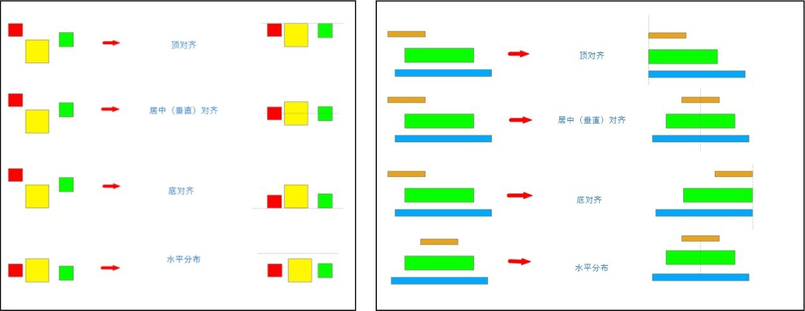

图6-29 对齐选项的操作展示

（11）排列对象

Adobe XD从绘制的第一个对象开始会依次堆积所绘制的对象。可以使用图层面板在不同图层中选择、排列和移动对象。还可以在工作界面选择一个对象，单击鼠标右键，然后在弹出的快捷菜单中选择“排列→置为顶层”命令，如图6-30所示。

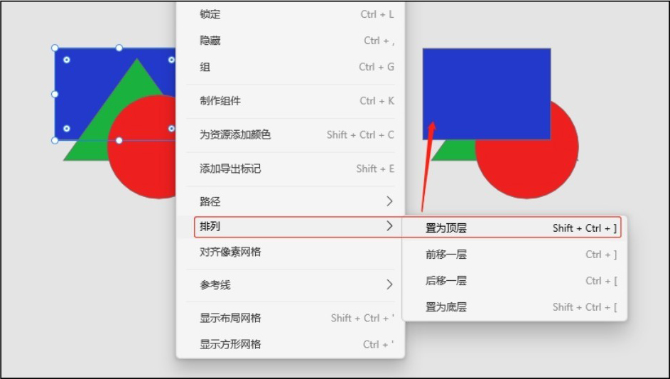

图6-30 排列对象

### **6.3.2**

### **Adobe XD的基本工具**

Adobe XD工具栏中具有如下工具。

#### **1.“选择”工具**

“选择”工具是Adobe XD工具栏中的第1个工具，在大多数情况下默认选择“选择”工具，可以通过单击工具栏中的指针图标，或者直接按键盘上的V键激活“选择”工具，如图6-31所示。

激活“选择”工具后，在画布上单击任意元素即可选择该元素，如图6-32所示，可对选择的元素进行移动、缩放和旋转等操作。按住键盘上的Shift键，可以同时选择多个图层。

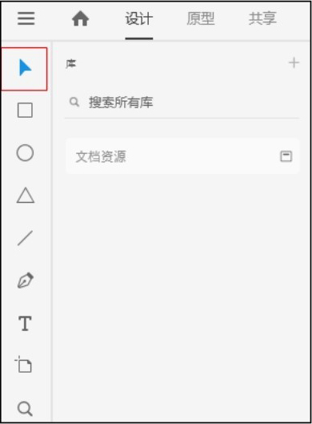

▲图6-31 激活“选择”工具

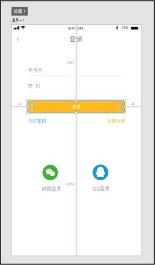

图6-32 选择元素

#### **2.“矩形”工具**

“矩形”工具是Adobe XD工具栏中的第2个工具，可以通过单击工具栏中的矩形图标，或者直接按键盘上的R键激活“矩形”工具，如图6-33所示。

激活“矩形”工具后，在画板上按住鼠标左键并拖动可绘制一个矩形，按住键盘上的Shift键，同时拖动鼠标可绘制正方形，如图6-34所示。在Adobe XD中默认的填充色为纯白色。

绘制的矩形4个角上分别会出现一个圆点符号，可以通过拖动任意一个角的圆点符号，设置矩形的圆角半径，如图6-35所示。

按住Option键（macOS）或者Alt键（Windows）并拖动与该角对应的圆点符号可以只改变该角的圆角半径，如图6-36所示。

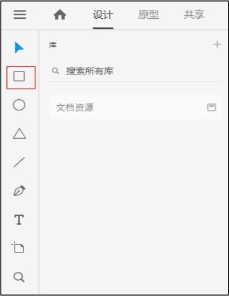

▲图6-33 激活“矩形”工具

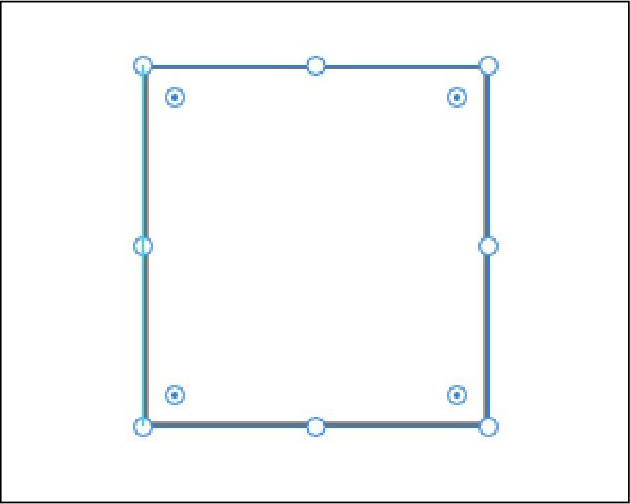

图6-34 绘制正方形

绘制好矩形后，可以通过属性面板设置其属性，如图6-37所示。属性面板用来设置元素的对齐、变换以及样式等。

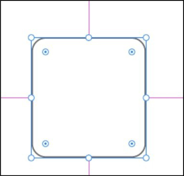

▲图6-35 设置矩形的圆角半径

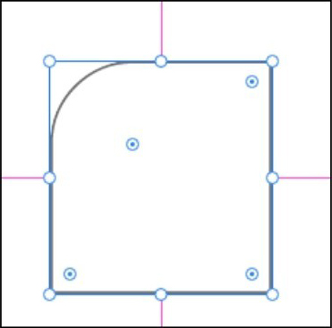

▲图6-36 调整一个角的圆角半径

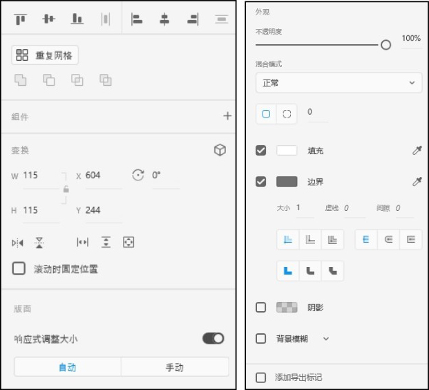

图6-37 属性面板

#### **3.“椭圆”工具**

“椭圆”工具是Adobe XD工具栏中的第3个工具，可以通过直接单击工具栏中的椭圆图标，或者直接按键盘上的E键激活“椭圆”工具，如图6-38所示。

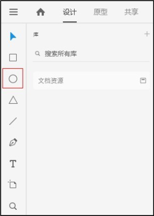

图6-38 激活“椭圆”工具

激活“椭圆”工具后，在画布上按住鼠标左键并拖动鼠标可绘制椭圆，按住键盘上的Shift键则可以绘制圆，如图6-39所示。

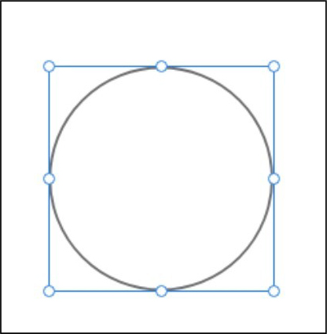

图6-39 绘制圆形

#### **4.“多边形”工具**

“多边形”工具是Adobe XD工具栏中的第4个工具，可以通过直接单击工具栏中的三角形图标，或者直接按键盘上的Y键激活“多边形”工具，如图6-40所示。

激活“多边形”工具后，在画布上按住鼠标左键并拖动鼠标可绘制多边形，按住键盘上的Shift键可绘制等边多边形，如图6-41所示。

在元素的属性面板中，“外观”属性可以设置“多边形”的“角个数”“圆角半径”“星形比”，如图6-42所示。

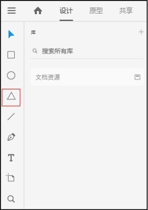

▲图6-40 激活“多边形”工具

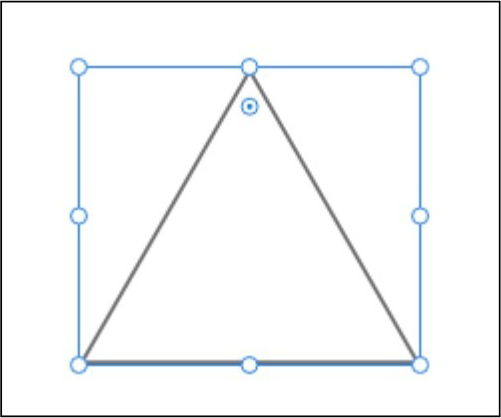

▲图6-41 绘制等边多边形

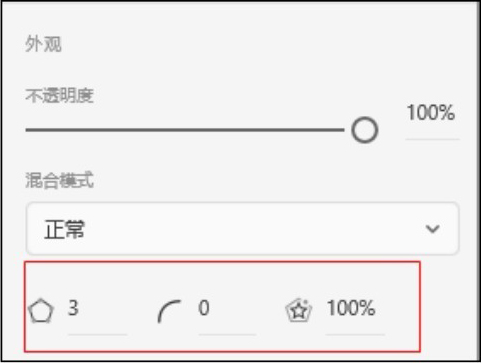

图6-42 设置多边形属性

#### **5.“直线“工具**

“直线”工具是Adobe XD工具栏中的第5个工具，可以单击工具栏上的直线段图标，或者直接按键盘上的L键激活“直线”工具，如图6-43所示。

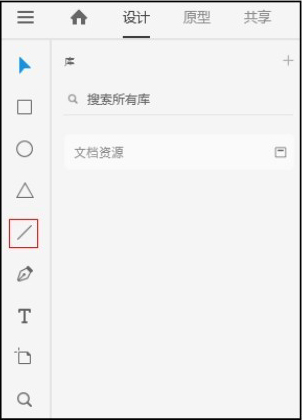

图6-43 激活“直线”工具

使用“直线”工具绘制直线段时，首先在画布上单击以确定直线段的起点，然后按住鼠标左键并拖动鼠标，在终点处释放鼠标左键，即可绘制出一条直线段。如果在绘制直线段的同时按住Shift键，可以以固定的角度绘制直线段；如果鼠标从左往右拖动，则在水平方向绘制；如果是上下拖动，则绘制出一条垂直线；如果是往左上、右上、左下、右下等方向拖动，则会在45°的方向绘制直线段，如图6-44所示。

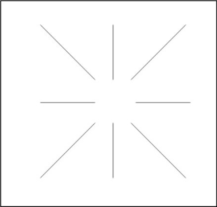

图6-44 绘制直线段

#### **6.“钢笔”工具**

“钢笔”工具是Adobe XD工具栏中的第6个工具，可以用该工具绘制各种路径。可以单击工具栏上的钢笔图标，或者直接按键盘上的P键激活“钢笔”工具，如图6-45所示。

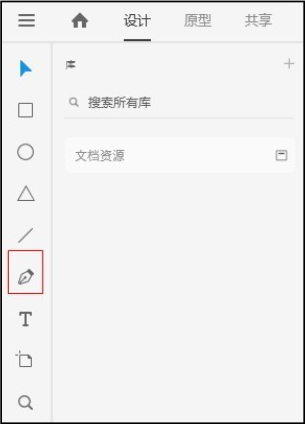

图6-45 激活“钢笔”工具

激活“钢笔”工具，在画板上单击，创建一个锚点，然后将鼠标指针移动到另一个位置并单击，创建另一个锚点，这时两个锚点之间会自动出现一条直线段路径，此时可以再移动鼠标指针添加第3个锚点，则第3个锚点和第2个锚点之间也会出现一条直线段路径，如图6-46所示。在起点处单击，然后将鼠标指针移动至需要的位置，再按住鼠标左键并拖动，即可在两个锚点之间绘制曲线。

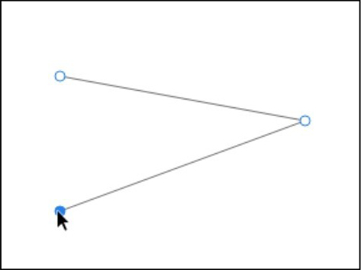

图6-46 使用“钢笔”工具

#### **7.“文本”工具**

“文本”工具是Adobe XD工具栏中的第7个工具，使用该工具在画板中单击即可创建文本。可以单击工具栏上的T字图标，或者直接按键盘上的T键激活“文本”工具，如图6-47所示。

选择“文本”工具，默认情况下是单行文本，不换行。如果想强制换行，需要按Enter键。

创建区域文本需要在选择“文本”工具后按住鼠标左键拖动创建一个文本框，如图6-48所示。这时当文本达到区域框的宽度后会自动换行。按Esc键可退出文本编辑。

单击文本，在属性面板中指定文本类型、字体大小和文本对齐方式。还可以选择文本块中的单个单词或字符，为其单独设置文本格式。

可使用属性面板中的“段落间距”选项更改段落间距，根据需要填写间距值。图6-49所示为属性面板中关于文本的参数设置。

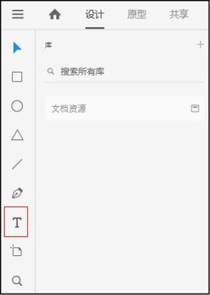

▲图6-47 激活“文本”工具

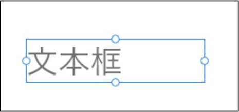

▲图6-48 文本框

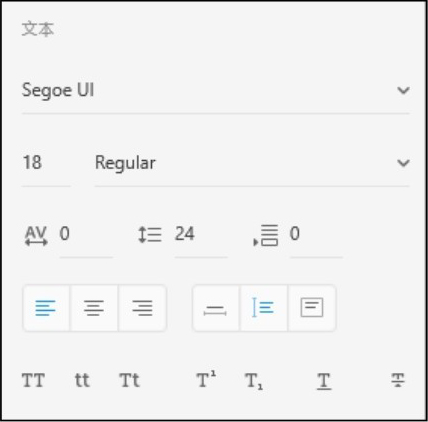

图6-49 文本的参数设置

#### **8.图层面板**

单击左下角的“图层”按钮，可以查看图层面板。

单击任意画板中的对象，会显示所选画板中所有元素的图层。图层的显示顺序是从上到下排列的，可以快速地对图层进行重新排序、重命名、显示/隐藏和锁定/解锁等操作。

默认情况下，项目中的每个对象均位于自己的图层上。例如，绘制一个矩形时，Adobe XD将会为此矩形创建一个新图层，图层名称默认为“矩形1”。在绘制另一个矩形时，将创建一个名称默认为“矩形2”的单独的图层，如图6-50所示。

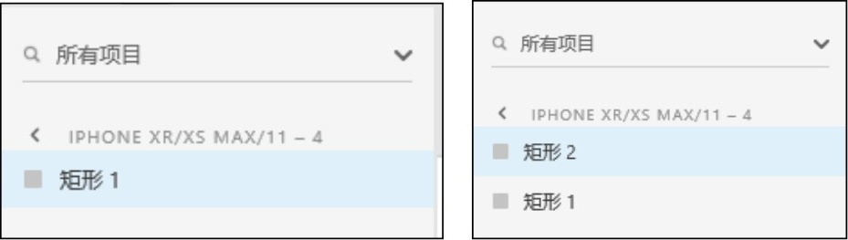

图6-50 图层面板

在面板上为对象编组时，已编组的对象也会在图层面板中编组。在使用布尔运算组合对象时，组合对象的多个图层将被合并为一个图层且名称会被替换，被替换的图层名称就是执行的布尔运算选项的名称。

#### **9.资源面板**

单击左下角的“库”按钮，会展示文件中的所有资源，包括颜色、字符样式和组件，在资源面板中的各个资源可以在文件的各个位置使用，大大地提高了设计效率，如图6-51所示。

单击任意画板中的对象，然后在左侧资源面板中单击资源分类中右侧的加号按钮，即可把画板中对应的资源属性添加到资源面板中，如图6-52所示。使用鼠标右键单击需要删除的资源，然后选择“删除”命令即可把该资源删除。

添加的组件可以作为资源存在画板中，当调整主要组件的样式时，使用该组件样式的任意位置也会进行相应修改，如图6-53所示。

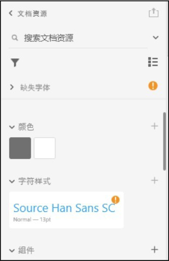

▲图6-51 资源面板

▲图6-52 添加资源

图6-53 编辑主要组件

#### **10.布尔运算**

Adobe XD的布尔运算工具组包含添加、减去、交叉、排除重叠工具。使用布尔运算工具，可以将简单的形状组合产生新的形状。它仅适用于多个形状，单独选择某个形状时无法使用，当选择多个形状后布尔运算就可以使用了。布尔运算使用效果如图6-54所示。

图6-54 布尔运算使用效果

#### **11.使用蒙版**

蒙版用于隐藏Adobe XD文件中的部分内容，例如隐藏大图片的部分内容，用于制作标题等。蒙版有两种使用方法。

（1）将图片拖到形状中

在刚开始没有图片的时候，为图片设计某种形状，例如圆形头像，就可以直接将图片拖到这个形状中。图片会自动适配该形状，位于形状边界之外的部分将会被隐藏或遮盖。

将图片从文件夹拖到XD文件对应的形状中，形状高亮显示后，松开鼠标左键，图片就会被置于该形状中，如图6-55所示。

图6-55 将图片拖到形状中

选择形状，拖动边框上的点可以调整形状及其中图片的大小，如图6-56所示。

图6-56 调整形状及其中图片的大小

提示：要替换形状中的图片，可直接将其他图片从文件夹拖动到该形状中，新的图片会自动适配形状的大小。要编辑形状中的内容，双击形状以选择其中的内容，然后即可对内容进行各种调整，如图6-57所示。

图6-57 编辑形状中的内容

（2）将某个形状作为蒙版遮盖图片中的内容

把用作蒙版的形状拖动或放置在要保留的内容上，形状以外的内容会被遮盖或隐藏。同时选中图片和形状（蒙版），如图6-58所示，选择“对象→形状蒙版”（macOS），或者用鼠标右键单击所选内容，然后选择“带有形状的蒙版”命令（Windows）命令，如图6-59所示。

▲图6-58 形状蒙版遮盖图片

图6-59 “带有形状的蒙版”命令

#### **12.创建重复元素**

在进行UI或者原型设计时，通常需要定义重复元素或内容列表，由于创建这些元素十分耗时耗力，于是就有了“重复网格”这个功能。

重复网格功能可以将一个或一组元素更改为一个重复元素，向任意方向拉伸元素时，元素就会重复出现。在修改某个元素的样式时，网格中的所有元素都将更改。

如果网格中有一个文本元素，则仅复制该文本元素的样式，而不复制内容。因此可以快速设置文本元素的样式，同时保持网格元素中的内容有所不同。

可以通过将写好的文本文件拖到重复网格中来替换该网格中的占位符文本。

（1）创建重复网格

重复网格的核心是一种特殊类型的组。可以选择一个对象或一组对象然后将其转换为重复网格。

选择想要转换为重复网格的图像缩略图和文本组合，单击属性面板上的“重复网格”按钮，如图6-60所示，即可将其转换为重复网格。元素边界上将显示重复手柄，如图6-61所示。

▲图6-60 “重复网格”按钮

图6-61 重复手柄

拖动元素底部的手柄，可以令重复网格的元素垂直，如图6-62所示。拖动元素右侧的手柄，可以令重复网格中的元素水平，如图6-63所示。选择要编辑的网格并双击，可进入编辑模式。如果想要取消网格元素的编组并单独处理它们，需要单击属性面板中的“取消网格编组”按钮。

（2）处理重复网格中的文本

可以更新重复网格中的各个文本对象，也可以将预先编辑好的文档拖至重复网格中，并让文本文件的内容自动填充为重复网格中的文本对象。

▲图6-62 拖动元素底部的手柄

图6-63 拖动元素右侧的手柄

如果想要调整网格中两个元素之间的空白区域，可以将鼠标指针悬停在元素的间隙上。当鼠标指针变为双箭头时，可向任意方向拖动来增大或减小空白区域，如图6-64所示。

图6-64 调整重复网格元素的间距

#### **13.设置描边、填充、投影和模糊**

（1）设置纯色填充

选择需要填充的对象，在属性面板中单击“填充”选项的矩形色卡，此时工作界面会出现“拾色器”对话框，如图6-65所示。在“拾色器”对话框中选择一个颜色作为对象的填充颜色，可以在“拾色器”对话框中将使用的颜色保存为色板，供以后重复使用。单击“拾色器”对话框底部的“+”按钮即可把颜色保存为色板。

图6-65 “拾色器”对话框

（2）创建渐变颜色

渐变是指两种或多种颜色之间或同一颜色的不同色调之间的渐变混合。Adobe XD可支持线性渐变和径向渐变。

要在Adobe XD中为对象添加渐变颜色，需要先选择对象，然后在属性面板中单击“填充”选项的矩形色卡。从“拾色器”对话框顶部的下拉列表中选择“线性渐变”或“径向渐变”，然后在渐变条中设置渐变颜色。图6-66所示为线性渐变样式，图6-67所示为径向渐变样式。

（3）创建描边并指定描边颜色

默认描边宽度为1px，选择对象后，在属性面板的“边界”选项中可指定描边的宽度值，单击“边界”选项的矩形色卡，此时会出现“拾色器”对话框，在其中可设置描边颜色，如图6-68所示。

▲图6-66 线性渐变样式

▲图6-67 径向渐变样式

图6-68 设置描边颜色

（4）创建阴影

选择想要添加阴影的对象，勾选“阴影”复选框，然后单击属性面板中的“阴影”选项的矩形色卡，在出现的“拾色器”对话框中设置阴影的颜色。

勾选“阴影”复选框后，选项下方将出现“X偏移”“Y偏移”“B模糊”3个选项。“X偏移”和“Y偏移”是指希望投影从对象处偏离的距离。“B模糊”是指希望投影到要进行模糊处理的阴影边缘距离，如图6-69所示。

图6-69 创建阴影

### **6.3.3**

### **使用Adobe XD完成原型**

在Adobe XD中完成UI的设计工作后，可以直接在软件中把这些界面快速链接起来，生成一个可交互的原型文档，并且能简单设置一些跳转效果。

#### **1.链接页面**

Adobe XD可以创建交互原型，直观地展示如何在屏幕或线框之间进行链接；也可以预览交互，这样可以验证用户体验并对设计进行迭代，从而节省开发时间。制作好页面元素后，就可以单击“原型”按钮，进入原型交互设计页面。制作交互效果至少需要两个画板，只有一个画板我们是无法制作交互效果的。

微课视频

### Adobe XD完成原型

（1）设置“主页”

“主页”是应用程序或网站的第一个页面，浏览者会从“主页”开始应用程序或网站的浏览。

切换到原型模式，画板左上角会有一个灰色的主页图标，单击主页图标，它会变成蓝色，提示该画板已被成功设置为“主页”，如图6-70所示。

（2）将交互式元素链接到目标画板

在开始链接画板之前，要适当地为画板命名，这样做有助于设计师清楚分辨画板之间的链接。

切换到原型模式，单击要链接的对象或画板。对象或画板上将会出现带箭头的连接手柄。将鼠标指针悬停在手柄上，鼠标指针会变为线条连接器，将鼠标指针移动到需要被链接的画板或对象上，如图6-71所示。

▲图6-70 设置“主页”

图6-71 链接对象或画板

#### **2.设置页面首屏内容**

当设计的内容超出既定的屏幕显示范围时，可以设置屏幕的显示范围为页面首屏，将超出的内容进行滚动显示。

（1）制作可滚动画板

使用预设的尺寸创建画板，如果内容超出画板的指定长度，可拖动画板底部到所需要的长度并继续设计。画板上的虚线表示可滚动内容的起始位置，如图6-72所示。虚线上方为页面首屏尺寸。

图6-72 首屏大小

（2）固定对象位置

当在为某个原型页面设置滚动画板时，可能需要将页面中的一个或一组对象固定在页面的顶部或底部，保持UI的完整性。

在设计模式下，选中一个或一组对象，将其摆放在需要显示的固定位置上，然后在属性面板中勾选“滚动时固定位置”复选框，如图6-73所示。勾选完成后，在页面预览时，此对象就会固定在某个位置。

图6-73 固定元素

#### **3.触发的几种操作**

在原型模式下为对象添加交互链接时，在右侧的交互设计面板中，触发默认是“点击”，还有“拖移”“时间”“按键和游戏手柄”“语音”等触发的事件类型，如图6-74所示。而元素触发的事件类型没有“时间”，如图6-75所示。

▲图6-74 画板触发的事件类型

图6-75 元素触发的事件类型

① 点击：在预览模式下，当鼠标单击相应的对象时才触发的交互事件。

② 拖移：在预览模式下，当鼠标拖动相应的对象时才会触发的交互式事件。

③ 时间：在预览模式下，当相应对象开始显示在屏幕时开始倒计时触发交互事件。

④ 按键和游戏手柄：在预览模式下，按指定的按键即可控制交互效果的显示。

⑤ 语音：在预览模式下，按住空格键然后说出设置的命令，即可进行交互效果的展示。

#### **4.操作动作**

在Adobe XD预览原型界面中，根据设置的触发操作不同，执行的反应效果也不同。在画板的交互设置面板中，操作的类型有“过渡”“自动制作动画”“叠加”“上一个画板”“音频播放”“语音播放”，如图6-76所示。而画板中的元素中多了一个“滚动至”操作，如图6-77所示。

▲图6-76 画板操作事件

图6-77 元素操作事件

① 过渡：选择“过渡”选项之后交互面板上会有一个保留滚动位置的复选框；如果勾选这个复选框，在预览窗口中滚动时就会记录滚动的位置，即使跳转了页面，返回该页面时也会停到相应的位置，而不用再次滚动到相应的位置。

② 自动制作动画：Adobe XD自动制作动画要求第二个画板由第一个画板复制得到，在原型模式下，将触发模式添加到第个画板手柄上拖动，将目标连接到第二个画板，并选择自动画作为类型。第二个画板的手柄也以同样的方式连接至第一个图板，查看“交互面板”，并根据效果需要，设置操作类型为“自动制作动画”，还可以选择触发条件，如点击、拖动；这样就可以单击“预览动画”按钮预览原型，点击触发过渡效果，观看生动有趣的动画，画板间内容的动态变化，是软件自动补充完成的，类似Flash的补间动画，借助自动制作动画功能，用户可以创建沉浸式过渡，以便呈现内容在画板之间的移动。

③ 叠加：在预览窗口中单击交互元素后不会进行页面跳转，而是把页面直接叠加在原有的页面上；叠加操作之后在原页面上会有一个绿色的方框，表示叠加页面的区域，如果叠加画板区域超出画板实际尺寸，那么就只能显示这一部分的页面；而当叠加的画板尺寸小于画板区域，那么就可以单击中间的加号进行调整，之后再预览时单击交互元素叠加的页面就只在绿色方框中显示，如图6-78所示。

④ 滚动至：如果页面超过正常显示的页面，如滚动到最下方后，想快速定位到某个元素的位置，那么就可以在对象框中选择这个元素，之后在预览窗口中单击相应的交互，就会快速滚动到这个元素的位置。

⑤ 上一个画板：当有多个界面都能跳转到这个界面时，若需要返回，就可以设置操作为“上一个画板”，即跳转回到上一个画板。

⑥ 音频播放：需要选择一个本地的音频，然后在预览时单击就会播放一个音频文件。

⑦ 语音播放：需要自定义一段文字内容，之后在预览时即可语音播放设置的文字内容。

交互设置面板中动画包含“无”“溶解”“左滑”“右滑”“上滑”“下滑”“向左推出”“向右推出”“向上推出”“向下推出”，如图6-79所示。

图6-78 叠加操作

溶解效果就是当前画板在设置时间内匀速消失，跳转画板匀速显示，如图6-80所示。滑动效果就是根据设置的方向进行滑动显示直到新画板完全显示。推出效果就是把当前的画板和跳转的画板同时按照设置进行推动，直至新的画板显示出来。

▲图6-79 交互动画

图6-80 动画设置

### **6.3.4**

### **使用Adobe XD输出成果**

选择“导出”命令，弹出“导出”选项，如图6-81所示。选择任意一个选项后，弹出“导出资源”对话框，如图6-82所示。在对话框中设置所需要的参数，单击“导出”按钮即可导出资源。

▲图6-81 “导出”选项

图6-82 导出参数设置

导出资源或画板的注意事项如下。

① 想要导出所有画板，需要确保没有选择画板或资源。

② 导出特定资源或画板时，必须选择需要导出的特定资源或画板才行。可以标记稍后要导出的资源或画板，然后将它们批量导出，如图6-83所示。

③ 选择目标平台和文件格式，目标平台包含Web、iOS或Android，文件格式则包括PNG、SVG、PDF和JPG。指定目录即可保存输出文件，如图6-84所示。

▲图6-83 添加导出标记

图6-84 导出资源格式设置

