## **项目实施**

——移动端“茶物语”App产品交互设计开发

使用Adobe XD的基础功能完成页面设计后，Adobe XD创建的交互式原型会直观地展示如何在屏幕或线框之间进行链接。通过预览交互，验证用户体验并对设计进行迭代，从而节省开发时间。以下是移动端“茶物语”App产品设计开发中一些简单的交互效果的制作。

微课视频

Adobe XD设计效果演示

### **6.4.1**

### **“茶物语”Loading动画效果**

本小节制作一个加载元素时的等待效果。

制作步骤如下。

#### **1.元件基础样式设置**

使用“椭圆”工具在画布中创建一个圆形，在属性面板中设置圆形的边界。使用周长公式计算出周长1/4的长度2πr/4，间隙设置为130，之后在画板上看到有4个点的样式。具体设置如图6-85所示。

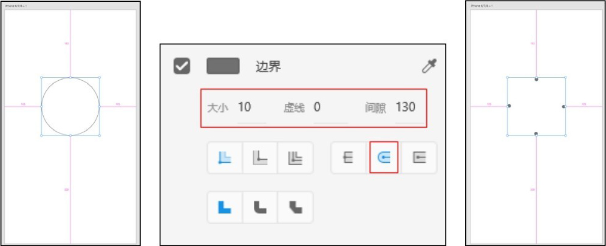

图6-85 圆形属性设置

复制画板1，然后修改复制出来的画板2中圆形边界的样式，让它有一个近似圆形的外观，如图6-86所示。

再次复制画板1，然后修改画板3中圆形的旋转角度为180°，这样在运行时显示效果会更好，具体设置如图6-87所示。

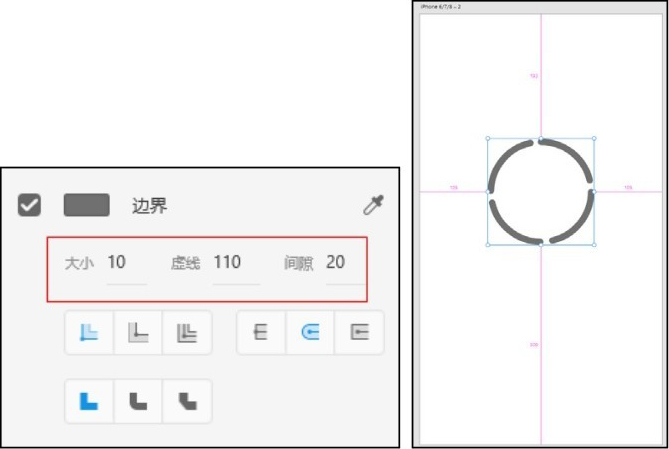

▲图6-86 设置画板2中圆形边界的样式

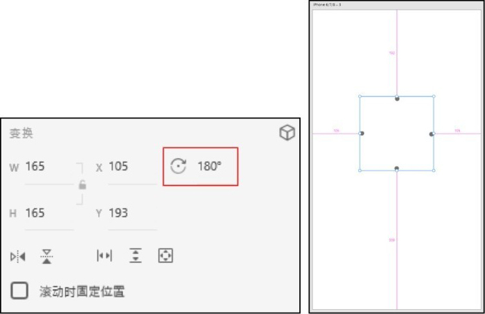

图6-87 旋转画板3中的圆形

#### **2.元件交互效果设置**

元素样式设置完成后，进入原型模式，为3个画板添加交互效果，添加的交互顺序为画板1跳转到画板2，画板2跳转到画板3，之后画板3跳转到画板1，从而实现加载动画效果循环演示，设置“触发”为“时间”，操作“类型”为“自动制作动画”，动画效果为“渐入渐出”，持续时间为“0.6秒”，其他两个画板也如此设置，如图6-88所示。

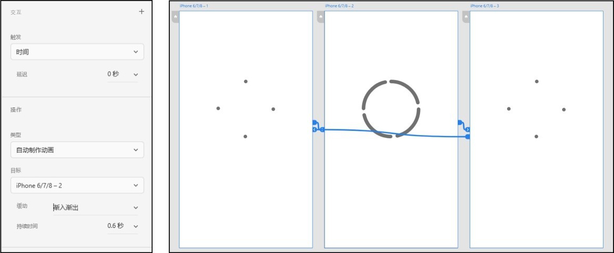

图6-88 添加跳转交互

设置完成后单击右上角的“运行”按钮查看运行效果，如图6-89所示。

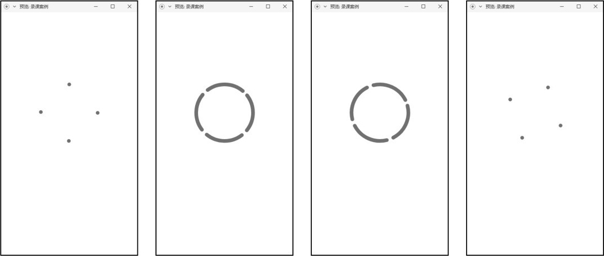

图6-89 查看运行效果

### **6.4.2**

### **“茶物语”左右滑动交互的效果**

本小节设计和制作一个左右滑动元素的效果，如图6-90所示。

图6-90 左右滑动元素的效果

制作步骤如下。

#### **1.元件基础样式设置**

在Adobe XD画布中设置好需要的元件样式。

#### **2.元件交互效果设置**

要想实现左右滑动的效果，需要全部选中需要滑动的元素，如图6-91所示，然后在右侧属性面板中对“变换”选项进行设置。水平滑动、垂直滑动、水平和垂直同时滑动的按钮，如图6-92所示。再设置在滑动过程中展示的区域大小即可实现滑动效果。以水平效果为例设置图形在水平方向左右滑动展示的效果，如图6-93所示。

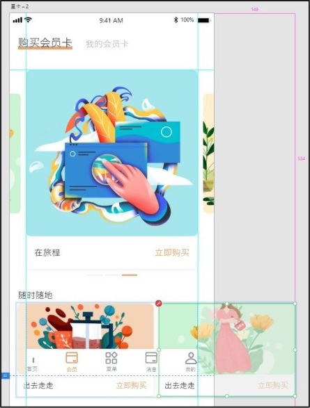

▲图6-91 全部选中需要滑动的元素

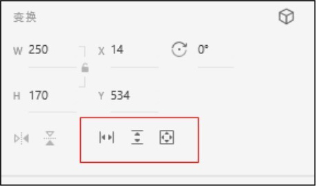

▲图6-92 设置滑动方向

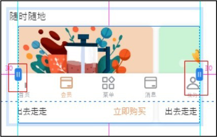

图6-93 设置滑动显示区域大小

制作完成后单击右上角的“运行”按钮，预览效果如图6-94所示。

图6-94 预览效果

### **6.4.3**

### **“茶物语”轮播图的演示效果**

本小节设计和制作轮播图效果，图片随着鼠标的拖动不停地循环切换，如图6-95所示。

图6-95 轮播图效果

制作步骤如下。

#### **1.元件基础样式设置**

首先把需要展示的图片放进画板中，然后将这3张图片设置成组，如图6-96所示。

因为在Adobe XD中，位于上层的元素会遮挡住下层的元素，为防止出现在拖动时造成元素有遮挡而使轮播图无法正常显示的情况，需要对3个画板中的图片进行位置调整，如第一个画板中图片的堆放顺序是123，第二个画板中图片的堆放顺序就是231，同理，第三个画板中图片的堆放顺序就是312，这样设置完成后就可以添加交互事件了，如图6-97所示。

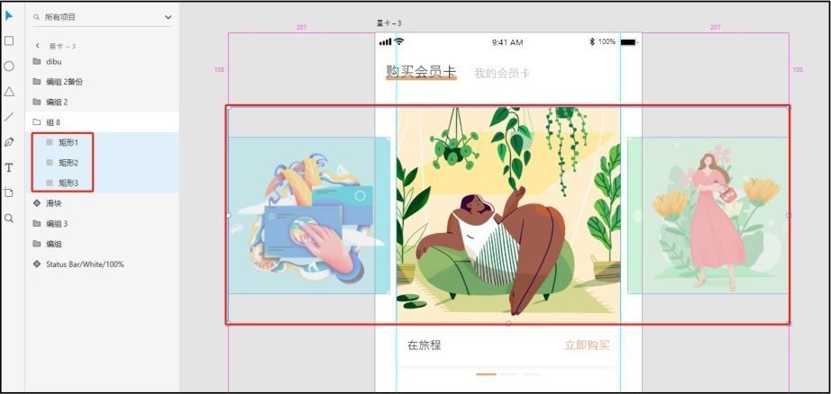

▲图6-96 添加轮播图片

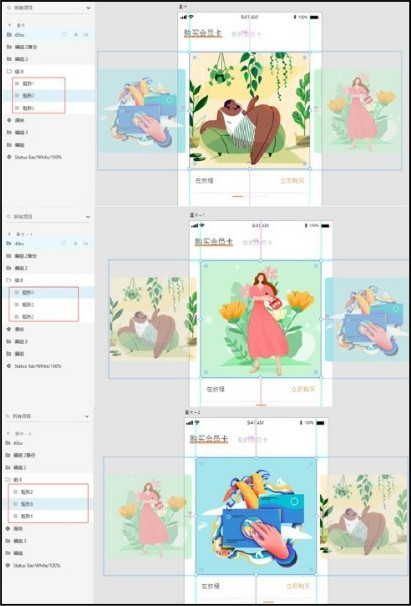

图6-97 3个画板中的轮播图的堆放顺序

#### **2.元件交互效果设置**

将3个画板分别设置成循环拖移切换的效果，详细设置如图6-98所示。

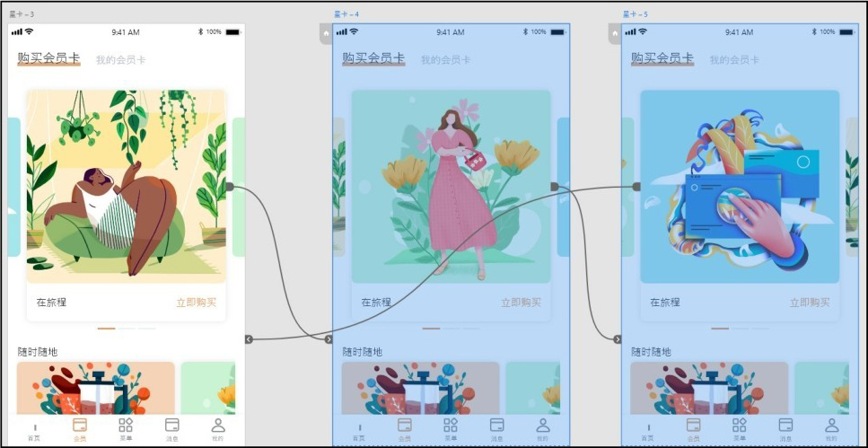

图6-98 设置交互效果

设置完成后单击右上角的“运行”按钮，即可预览轮播图效果，如图6-99所示。

图6-99 轮播图效果预览

### **6.5**

## **项目小结**

本项目介绍了Adobe XD的基础知识，包括软件的基本操作、工具的使用、原型的设计和导出文档等内容。工具的使用及原型的设计等功能是整个软件中非常重要的部分，可以帮助用户制作很多交互效果，因此需要熟练掌握Adobe XD软件。

### **6.6**

## **素养拓展小课堂**

以用户体验为基础进行的人机交互设计要考虑用户的背景、使用经验，以及在操作过程中的感受，从而设计出符合用户需求的产品，使得用户在使用产品时愉悦，能高效操作。本项目重在培养学生热爱生活、服务社会的理念。

### **6.7**

## **巩固与拓展**

本项目介绍了Adobe XD工具的基础操作以及Adobe XD软件中交互链接的操作，通过几个小的案例对Adobe XD工具的基础操作和交互进行了详细说明。通过对项目实施中各个功能的练习，你可以对Adobe XD原型设计工具有初步了解。

建议你搜集相关交互案例，用专业的眼光分析App交互产品的元件动作设计规范和交互中的逻辑条件概念，这样有助于你更加深入的理解Adobe XD软件。

在实际的市场产品设计中，App产品的元素基本动作设计是组成整体设计的基础，最终形成完整的App交互设计产品。请你关注一些Adobe XD在App产品设计中出色的基础元件交互设计资料；另外，从现实生活的各类媒体中寻找、收集有关功能性App产品的样例，针对案例尝试着模拟设计其中部分元件的样式。

### **6.8**

## **习题**

### **一、单选题**

1.Adobe XD工具栏中的第1个工具，也是绝大多数情况下默认选中的工具是（ ）工具。

A.选择

B.矩形

C.椭圆

D.笔

2.如果要在Adobe XD中选中多个图层，可以按住键盘上的（ ），然后单击选择需要选中的多个图层。

A.Ctrl键

B.Alt键

C.Shift键

D.Windows键

3.使用椭圆工具绘制椭圆时，按住键盘上的（ ），则可以绘制一个圆形。

A.Ctrl键

B.Shift键

C.Alt键

D.Windows键

### **二、多选题**

1.Adobe XD是一款集（ ）功能为一体的软件。

A.框线图设计

B.视觉设计

C.交互设计

D.原型设计

2.在资源面板中，可以使用的资源类型有（ ）。

A.颜色

B.字符样式

C.组件

D.交互

### **三、填空题**

1.Adobe XD是一款轻便的\_\_\_\_\_\_绘制软件。

2.使用“文本”工具，默认情况下是单行文本，不会换行。如果想强制换行需要按\_\_\_\_\_\_键。

▲扫此二维码查看

本书慕课视频
