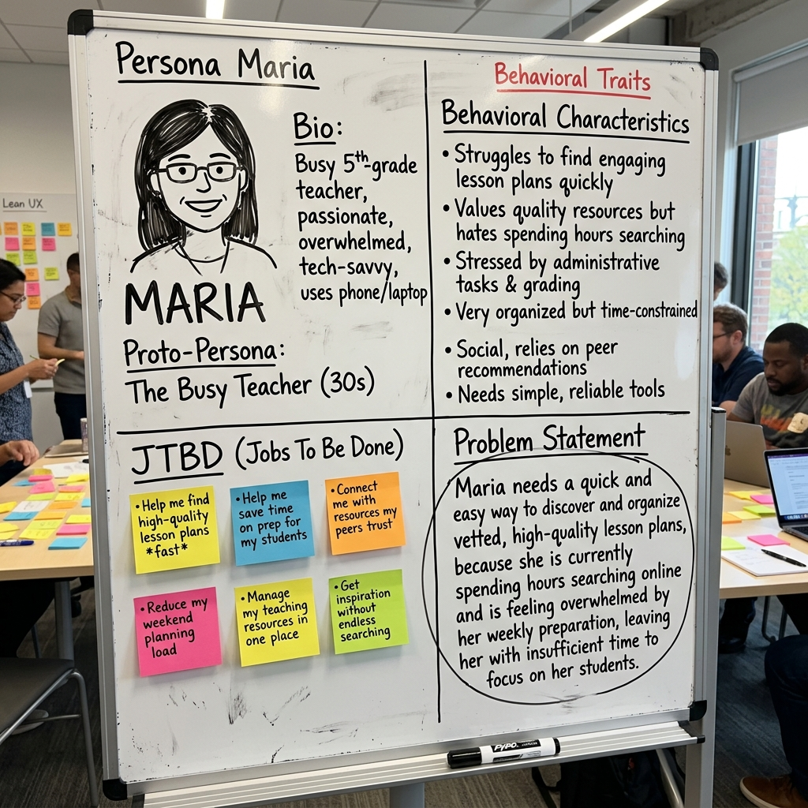
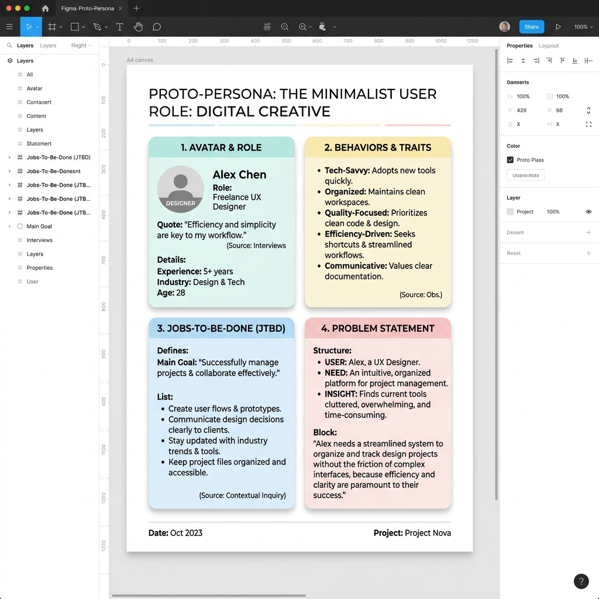

# 学生版实操指南：实验 2 — Proto-Persona 用户画像制作

> **课程名称**：交互产品开发
> **实验类型**：设计性 · 必做 · 个人独立完成
> **前置条件**：必须先完成实验 1 的痛点挖掘并产出 `/总结` 数据卡。

---

## 一、🎯 实验目的

通过本次实验，你将：

1. 掌握 **Proto-Persona（原型用户画像）** 的四大标准模块格式，能将访谈数据转化为结构化的视觉画像。
2. 理解 **人口统计学陷阱 (Demographic Trap)** 的危害，自觉规避用“人口学标签”替代“行为差异特征”的错误做法。
3. 掌握将文字调研数据**视觉化表达**的基本能力，能使用设计工具在 A4 版面上完成清晰、有层次的画像卡设计。
4. 理解 Proto-Persona 作为 **Lean UX 假设验证起点** 的定位——它是一份「待验证的假设」，而非已确认的结论。

---

## 二、🛠️ 实验条件与工具

1. **输入材料**：你在实验 1 中获得的 `/总结` 数据卡文本。
2. **参考素材**：本指南下方提供的两大风格标准参考图。
3. **制作工具（任选其一）**：
   - **Figma / Adobe Illustrator / Procreate / 其他绘图软件**
   - **纸笔手绘（强烈鼓励）**：回归 Lean UX 敏捷核心，降低工具门槛，把精力放在逻辑梳理上！

---

## 三、🚀 实操步骤

### 步骤 1 (S1)：准备阶段与工具选择

- **输入就绪**：准备好实验 1 的 `/总结` 数据卡文本或截图作为输入材料，这是你本次设计的“原始数据”。所有视觉内容必须有数据支撑，**严禁凭空捏造**。
- **选择工具**：选择你最熟练的制作工具，创建一个 **A4 尺寸**的版面。

> 📝 **报告单提示**：在学生报告的此步骤下，需填写你最终选择的排版与制作工具。

---

### 步骤 2 (S2)：四大标准模块设计与排版

严格遵循 Proto-Persona 的四窗格布局规范，将画布划分为四个区块并填入数据。你可以参考以下两种风格的范例：

#### 🎨 参考范例 1：Lean UX 敏捷工作坊风格（手绘白板风）
非常适合团队早期头脑风暴，强调快速记录假设，无需精湛画技。

#### 🎨 参考范例 2：高保真数字交付物风格（Figma/UI 洁净风）
如果你使用数字设计工具排版，可以参考这种干净、模块化的布局，适合作为最终报告的正式交付物。

#### 🔍 四大模块拆解指南（必须严格对应）：

1. **模块一：背景档案 (Demographics & Context)**
   - 放置在左上角。画一个简单的头像，给角色起个具体的名字和一句话身份。
2. **模块二：行为核心特征 (Behavioral Quirks)**
   - 放置在右上角。列出核心的行为和怪癖。
   - ⚠️ **高危预警**：**绝对禁止**在此处出现人口学标签（如“男，25岁，月薪五千”）。写出用户的具体行为（如“每天凌晨刷视频寻找灵感”）。
3. **模块三：JTBD 三维任务拆解 (Functional/Social/Emotional)**
   - 放置在左下角。列出用户试图完成的 功能任务、社会任务（别人的看法）和 情感任务（自己的感受）。
4. **模块四：痛点陈述 (Problem Statement)**
   - 放置在右下角。严格套用公式：**「[具象用户] 非常需要 [动词+任务]，因为 [深层动机]。」**

> 📸 **报告单提示**：在学生报告的此步骤下，请粘贴你制作中或排版完成的 Proto-Persona 画像卡草稿截图。

---

### 步骤 3 (S3)：整体审查与最终成果输出

将枯燥的文字调研数据进行视觉化表达后，请务必进行自查：

- 结构是否严格划分了四个窗格？
- 是否规避了“人口统计学陷阱”？重点是否全在行为特征和差异上？
- ⚠️ 注意：不要用“画技掩盖逻辑”，精美的视觉表现不能替代行为特征的深度分析！粗糙的载体（如草稿纸）只要逻辑严密同样能拿高分。

> 📸 **报告单提示**：在学生报告的此步骤下，请粘贴最终导出的高清晰度 Proto-Persona 用户画像成品图。

---

## 四、📝 实验结论（反思要点）

完成画像制作后，在报告末尾的结论区，请围绕以下方向进行反思：

1. **数据转化可视化的难点**：文字数据卡转视觉画像时，哪些信息最难呈现？
2. **规避人口学陷阱的思考**：在模块二中，你是否下意识想写年龄/收入？你是如何将其转化为实际行为特征的？
3. **定位理解**：结合本次体验，为什么说 Proto-Persona 是一份“待验证的假设”，它在后续设计中应该如何使用？
