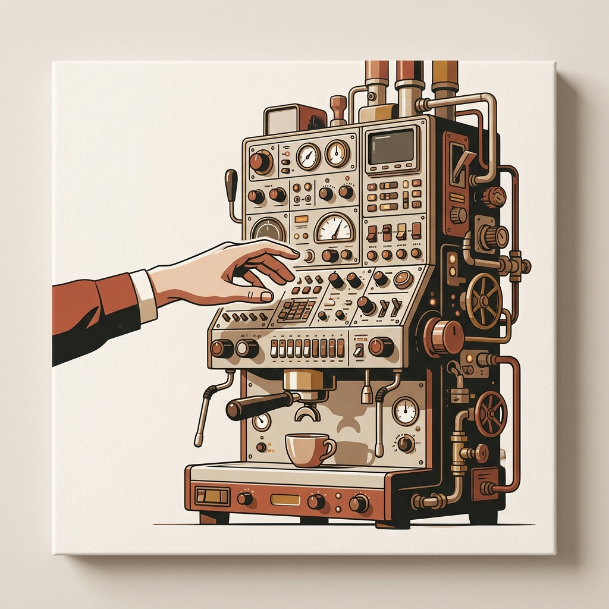
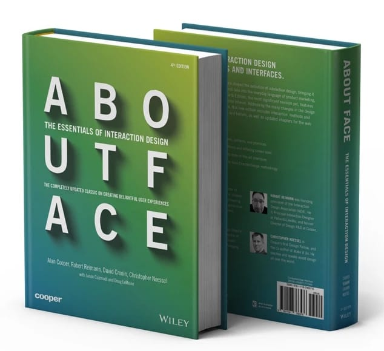
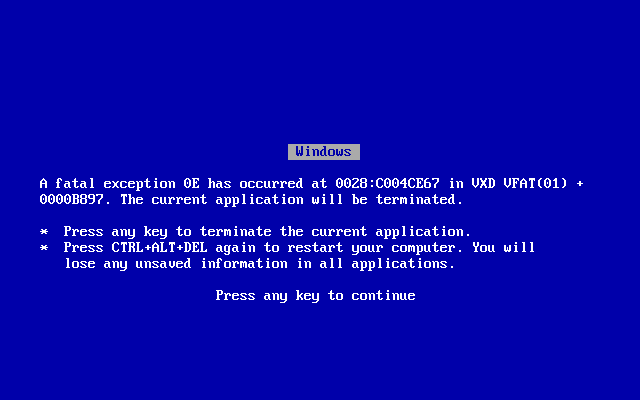
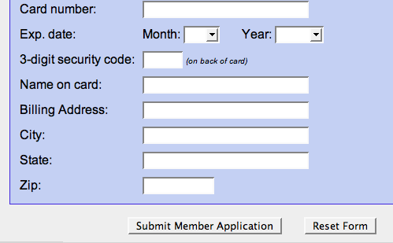
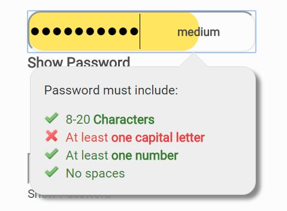
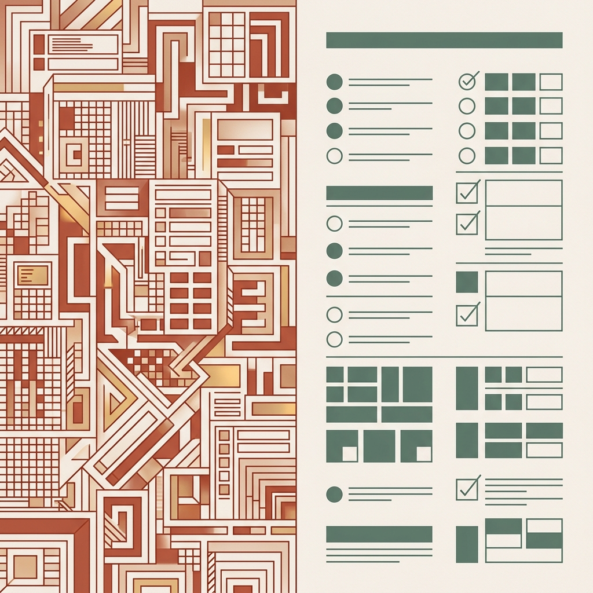
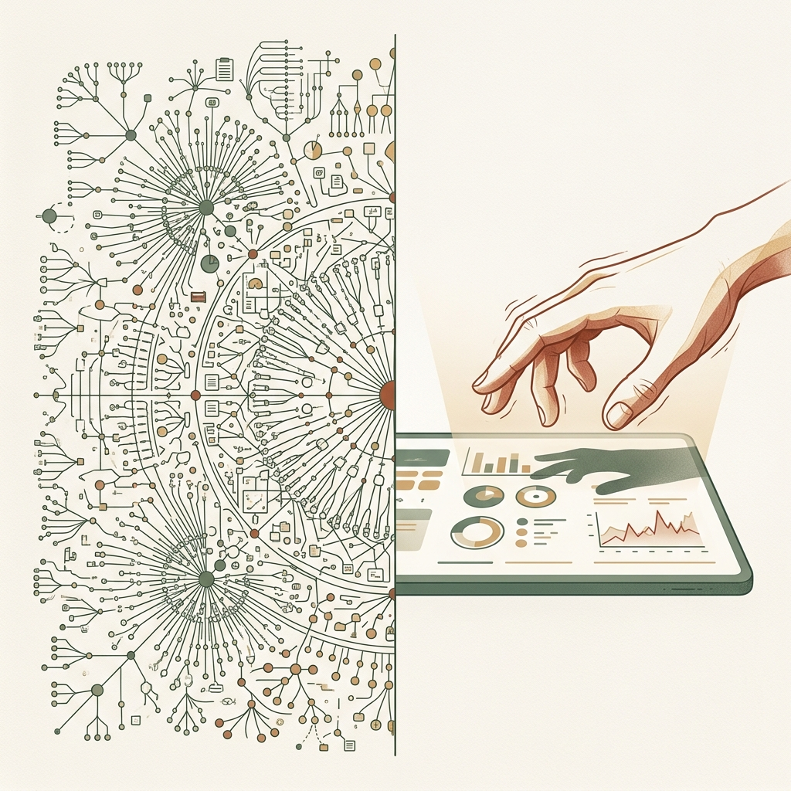
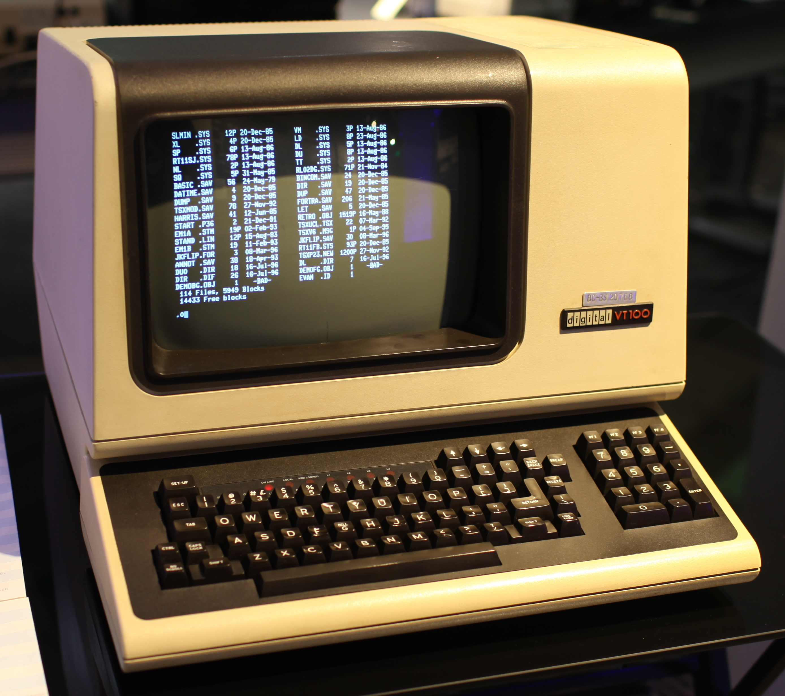
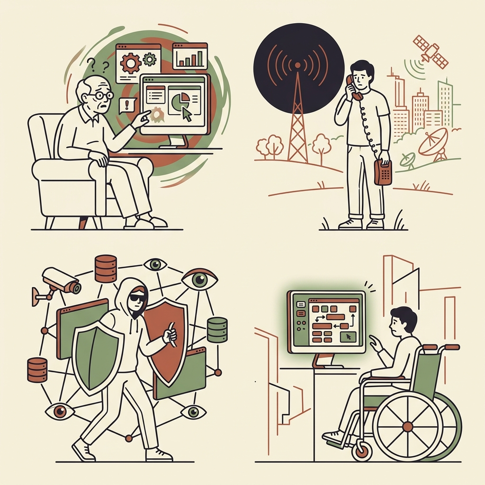
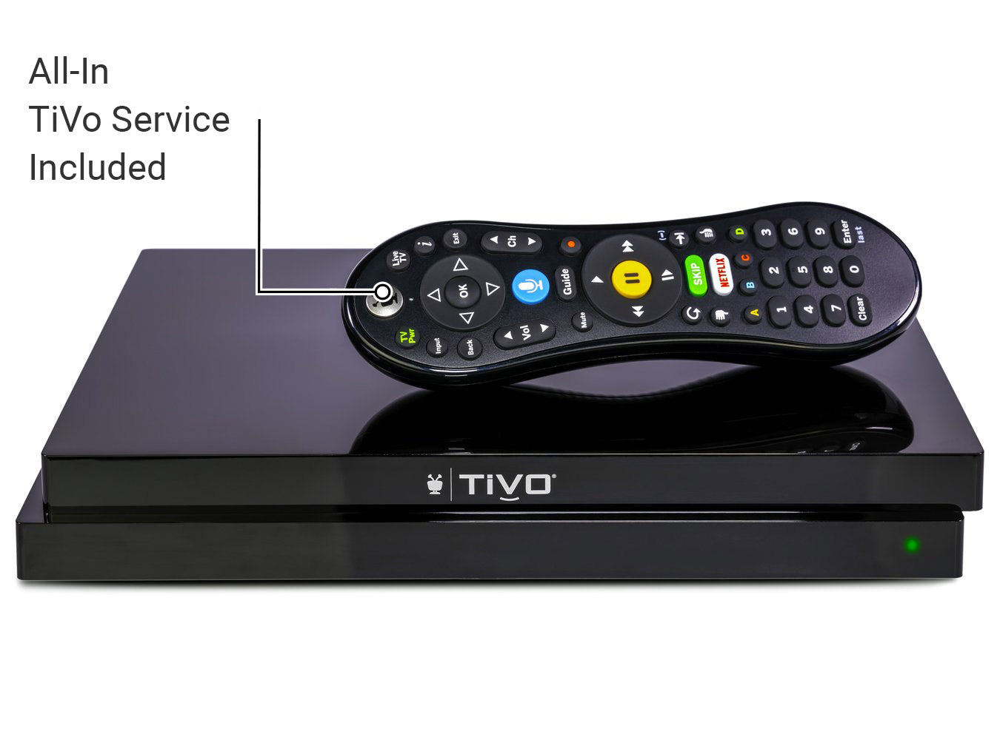

## 模块 1: 数字产品之殇 —— 我们为什么会抓狂？ (约 25 分钟)
<!-- BUDGET: 4500 chars | SLIDES: ≥9 | STATUS: done -->

---

### 1.1 现状断言：失控的产品行为正在瓦解用户体验
> [VISUAL]
> **Slide**: W01_S00
> **Layout**: `Full`
> *   **Asset**: 
> **Scene**: 概念插画：一台操作面板如飞机驾驶舱般复杂的豪华咖啡机。一只手在上方犹豫，只为求一杯热水。学术极简暖灰调，赤陶红点缀认知摩擦。
> **Text**: 为什么一台咖啡机就能让你抓狂？

在正式开始之前，我想先请大家回忆一个场景。你站在茶水间，面前是一台价值过万的高级咖啡机，面板上闪烁着蒸汽、萃取、清洗的各种指示灯，而你——只想接一杯能泡茶的**热水**。你按下了那个看起来最像水滴的图标，结果它开始磨豆子了。你的手指僵在半空中，感觉自己像个面对核按钮的白痴。**这种深深的挫败感，究竟是谁的错**？

---

> [VISUAL]
> **Slide**: W01_S01
> **Layout**: `Full`
> *   **Asset**: 
> **Source**: `Video`
> **Duration**: `0m15s`
> **TimeCategory**: `lecture`
> **Scene**: 纪实摄影或视频片段：一位满头白发的老人在公交车前部，举着老旧的智能手机焦急地试图扫码，身后隐约可见排队等待、神情焦躁的乘客。画面带有强烈的无助感和年龄带来的技术鸿沟，无需任何文字排版。
> **Text**: 被数字系统拒之门外的人

这个场景，在座每个人大概都经历过。但现在换一个视角：如果你是一位 70 岁的老人呢？2020 年 8 月，黑龙江哈尔滨一段广为流传的视频记录了真实的一幕——一位老人因没有智能手机无法出示健康码，被公交司机当场拒载，车上乘客非但没有帮助反而指责老人，最终民警赶到将老人带离。他不是不愿意付钱，他是**无法操作手机完成支付**。疫情期间更极端：无法出示健康码的老人被拒于地铁站外、超市门前、医院挂号窗口。一整个群体，被数字系统拒之门外。

<!-- Pause: 3s -->

---

> [VISUAL]
> **Slide**: W01_S01a
> **Layout**: `Split`
> *   **Asset**: 
> **Scene**: 概念肖像：Alan Cooper 望着由复杂咖啡机与混乱菜单交织的“数字高墙”。学术极简暖白背景，致敬经典配色风格。
> **Text**: 学会让人"不抓狂" — 交互产品开发第一课

这就是我们这门课要解决的核心问题。欢迎来到交互产品开发。这门课不是教你怎么画出漂亮的渐变色，或者写出花哨的代码动画——我们第一件事，是要学会怎么 **“不让人抓狂”**。

无论是那台让你**不知所措**的咖啡机，抑或是**被数字系统拒之门外**的老人，这些让人抓狂的场景究竟在暗示什么？

---

> [VISUAL]
> **Slide**: W01_S01_Book
> **Layout**: `Full`
> *   **Asset**: 
> **Scene**: 《About Face 4》原版封面，展示经典的白绿蓝渐变与大号镂空排版。
> **Text**: "Digital Products Fail" — Cooper 的核心诊断

Alan Cooper 在这本被称为交互设计“圣经”的《About Face》中尖锐地指出了一点：数字产品常常失败——也就是原文所述的 Digital products fail，**不是因为技术不够强，而是因为它们表现出了极其恶劣的“产品行为”**——所谓的 Behave badly。

---

> [VISUAL]
> **Slide**: W01_S01b
> **Layout**: `Grid`
> *   **Asset**: 
> **Scene**: 一个极度自私的“傲慢巨婴”四分格隐喻插画。四格分别概念化地展示：粗暴地甩脸色发脾气、强硬地要求世界适应它的形状、到处乱扔垃圾留烂摊子、理直气壮地把重物行李甩给别人扛。学术极简暖灰调。
> **Text**: 机器的“四宗罪”——伺候一个傲慢巨婴
> **List**: 1.态度问题：粗暴越权 / 2.沟通问题：强迫适配 / 3.习惯问题：拒绝收拾残局 / 4.职责倒挂：转嫁剥削苦力

机器到底能有多恶劣？Cooper 将这些糟糕的表现提炼为四个递进的维度，就像是系统在我们面前犯下的 **"四宗罪"**。从态度到沟通，从习惯到职责，他像在痛批一个**极度自私、难伺候的“傲慢巨婴”**：先看它怎么动不动对人“甩脸”，再看它如何强硬地要求整个世界适应它的脑回路，接着看它毫无收拾烂摊子的教养，最后看它怎样理直气壮地把最繁琐的剥削苦力甩给了你。

#### 1.1.1 第一宗罪（态度问题）：粗暴越权与暗黑操控

> [VISUAL]
> **Slide**: W01_S01b_Case1
> **Layout**: `Half`
> *   **Asset**: 
> **Source**: 经典系统截图 / Fair Use
> **Scene**: 真实的 Windows 95 Fatal Exception 0E 十六进制报错提示原图。
> **Text**: 粗鲁：毫无预兆的系统挂起

数字产品经常表现得像个不懂人情世故的暴君。在 MS-DOS 与 Windows 95 时代，这种粗鲁是弹出一个带红叉的 **Fatal Exception 0E** 蓝屏报错。底层程序员没处理好内存指针异常，反而粗暴挂起系统，逼迫你在毫无头绪的十六进制崩溃码前按任意键“背锅”。

> [VISUAL]
> **Slide**: W01_S01b_Case2
> **Layout**: `Half`
> *   **Asset**: 
> **Source**: `Video` — YouTube / Weather Reporter Can't Stop Laughing
> **Duration**: `0m30s`
> **TimeCategory**: `lecture`
> **Scene**: 新闻电视直播实录：气象女主播正在播报天气时，演播室大屏幕突然不受控制地弹出巨大的 Windows 10 强制升级倒计时预警，导致播报被迫完全中断。
> **Text**: 霸权：系统强制夺走控制权

如今，这种粗鲁演变成了更隐秘的霸权。第一种傲慢是**强制夺权**。比如引发全球公愤的 Windows 10 早期强制更新策略，它经常在你接上投影仪准备路演时，突然黑屏并开启长达半小时的升级。系统底层完全践踏了你的物理现实语境，无情褫夺这台设备的控制权。

> [VISUAL]
> **Slide**: W01_S01b_Case3
> **Layout**: `Half`
> *   **Asset**: 
> **Source**: `Video` — 抖音实测录屏 / Fair Use
> **Duration**: `5m14s`
> **TimeCategory**: `activity`
> **Scene**: 难以寻觅的退出按钮，以及充满“社交诅咒”意味的取消选项灰字。
> **Text**: 暗黑：情感绑架 (Confirmshaming)

第二种傲慢，则是以 360 安全卫士或拼多多等国内本土代表极爱滥用的**情感绑架**——也就是暗黑模式里的 Confirmshaming。你想卸载全家桶或关掉拉新弹窗，它偏不给直截了当的关闭叉号，而是逼你点击屏幕边缘极隐蔽的灰字：“残忍卸载，我不在乎电脑裸奔危险”，或是“放弃特权，我不需要省钱”。这种居高临下、暗藏社交诅咒的设计，根本没把你当成一个拥有独立意志的人。

#### 1.1.2 第二宗罪（沟通问题）：强迫适配机器思维

> [VISUAL]
> **Slide**: W01_S01b_Case4
> **Layout**: `Half`
> *   **Asset**: 
> **Source**: 经典系统截图 / Fair Use
> **Scene**: 经典的 Windows "The action can't be completed because the file is open" 报错弹窗。
> **Text**: 荒谬：强迫使用者服从底层锁机制

这也是软件工程里最臭名昭著的极客惯性。举一个 Alan Cooper 重点抨击的案例：在 Word 2003 以及更早的经典版本中，你想给当前正在编辑的文档改名，系统会直接弹窗拒绝。为什么？因为在 Windows 的 FAT32 或 NTFS 操作系统底层，这叫“文件句柄——或者说底层系统的 File Handle——已被占用”。但在真实的三维世界里，我们给一个装满纸张的实体文件夹换个标签，根本不需要先把里面的纸锁起来。Word 的荒谬之处，就在于它**把操作系统的底层指针索引逻辑，原封不动地砸在了用户的脸上**。它强迫人类去迁就 C++ 的运行规则，而不是让代码去适配人类的直觉。

#### 1.1.3 第三宗罪（习惯问题）：拒绝收拾残局的邋遢
大家注意，Cooper 批评系统邋遢，不是指 UI 界面画得丑，而是指**软件体系极其缺乏自我收拾残局的教养**。

> [VISUAL]
> **Slide**: W01_S01b_Case5
> **Layout**: `Half`
> *   **Asset**: 
> **Source**: `Video` — 动态模拟真实表单失忆场景
> **Duration**: `0m08s`
> **TimeCategory**: `lecture`
> **Scene**: 动态录屏实录演示：用户在出入境签证申请表单中输入了大量护照和个人信息。为了“切出去看短信验证码”，用户切换了标签页。当切回表单瞬间，页面因前端无本地暂存而触发全盘刷新，所有已填信息当着用户的面瞬间清空并报错。
> **Text**: 失忆症：缺乏收拾状态残局的教养

有没有体会过第一种邋遢——**状态失忆**？在填写出入境签证网申或早期个税 App 的超长申请表时，你只是切出去看了一眼短信验证码，再切回来，由于前端开发偷懒没有调用 **LocalStorage** 等浏览器本地暂存 API，页面竟全盘刷新清空。它没有审问歧视你的恶意，它只是像个低能的巨婴，懒得管理内存流。

> [VISUAL]
> **Slide**: W01_S01b_Case6
> **Layout**: `Half`
> *   **Asset**: 
> **Source**: UX Stack Exchange / Fair Use
> **Scene**: 视觉权重完全一致的 Submit 与 Reset 按钮危险地紧贴在一起。
> **Text**: 埋雷：将清空键与提交键危险相邻

第二种邋遢更要命，那就是**雷区排版**。为什么在大量经典的基于 HTML 远古标准建立的 SAP 财务后台里，“清空全表 (Reset)”按键极其荒谬地紧贴着右上角的“确认提交 (Submit)”？这并不是系统故意设下致人破产的陷阱，只是因为前端代码里这俩按钮默认属于挨在一起的内联元素——也就是前端代码里的 Inline elements。这就好比粗心地装潢，把图钉撒在了沙发缝里，让用户的灾难性误触变成了必然。

#### 1.1.4 第四宗罪（职责倒挂）：让人类承担数据苦力

> [VISUAL]
> **Slide**: W01_S01b_Case7
> **Layout**: `Half`
> *   **Asset**: 
> **Source**: Stack Overflow / Fair Use
> **Scene**: 填卡号时因包含空格引发 "no spaces allowed" 非法格式的强硬报错。
> **Text**: 苦役：傲慢且死板的正则表达式

但这还不是最荒诞的。计算机 CPU 被发明的初衷本来是执行高频运算代替人类做苦力，为什么现在反而让人变成了机器的搬运工？想一想你给招商银行或是国航 App 输入银行卡号或护照号的场景。你中间随手多打了一个空格，或者加上了全角的横杠，验证系统就会傲慢地亮起红灯报错拦截。它宁愿让活生生的人类退回光标一个个去删，也不愿意在提交前，自己跑一行极其廉价的代码——比如在 JavaScript 里写一句 `str.replace(/\s+/g, '')` 正则清洗函数，来顺手抹掉这些无意义的连字符。

系统服务器趾高气昂地坐在那里挑刺，却把最基础的数据清洗苦差事全按在了人类的肩上。这在本质上是一种严重的**职责倒挂**——机器违背了它作为"省力工具"——即 labor-saving device——的承诺，反过来对人类进行了一场明目张胆的苦力转嫁。

<!-- Pause: 3s -->

---

### 1.2 溯源诊断：体验坍塌源于组织内部的结构性缺陷

> [VISUAL]
> **Slide**: W01_S01d
> **Layout**: `Grid`
> *   **Asset**: 
> **Scene**: 产品失败四大根因卡片，配对应图标：天平倾斜、蒙眼人偶、拉扯箭头、断裂流程线。
> **Text**: 体验坍塌的四大组织根因
> **List**: 1.优先级错位 (Misplaced Priorities) / 2.对用户的无知 (Ignorance About Users) / 3.利益冲突 (Conflicts of Interest) / 4.缺乏设计流程 (Lack of a Design Process)

那么，这些 **"反人类"** 的行为究竟是谁放出来的怪物？是程序员为了敷衍了事吗？绝不仅仅如此。Alan Cooper 进一步剖析了**四大组织级根因**。请看屏幕图示的四个维度。

#### 1.2.1 错置优先：为开发期限牺牲体验
首先是优先级的错位。你的团队把什么放在第一位？这是 Alan Cooper 提出的首层拷问。管理层最常问的是"能不能在**Deadline**前上线"，而不是"用户用着会不会抓狂"。这种妥协带来的结果是什么？产品虽然按时发布了，但用户一打开就感到痛苦。在硅谷，**苹果**之所以特别，是因为他们敢为了一个按键触感而推迟生产线，将**体验前置**。很多公司却只能先堆叠功能再慢慢填坑。

#### 1.2.2 迷信代码：用纯代码思维做决策
第二个根因，是对用户的结构性无知。最危险的并不是不知道用户要什么，而是过度自信的自以为知道。工程师天然倾向于把底层代码结构直接糊在界面上。但在审计了成百上千个失败项目后，Alan Cooper 极其严肃地指出：最终用代码掌控功能的程序员，其实常年被关在被称作“需求文档”的信息茧房里。他们几乎从未获准去前线看看真实的使用场景。**“写界面的见不到用户”**，这就必然剥夺了代码背后的同理心。为了修补这个致命隔离，Alan Cooper 后来被逼无奈，才**发明了“人物角色 (Persona)**”。既然你们见不到活人，那就贴一张“虚拟用户画像”在墙上强迫共情。

---

#### 1.2.3 屈从买单：让出资需求凌驾体验
第三个根因更残酷：**谁掏钱，谁才是大爷**。这就是 Alan Cooper 警示的**设计倒挂**。一个 IT 主管采购系统只看价格与合规度，而真正要每天使用的员工，只关心它是否好用。当两者的需求激烈冲突时，往往设计就会完全倒向掏钱的那一方。

> [ACTIVITY]
> *   **Type**: `QA`
> *   **Duration**: `2min`
> *   **Desc**: 快速知识点回顾
> 教师提问互动，校验此前核心法则的理解情况。

> [VISUAL]
> **Slide**: W01_S01e
> **Layout**: `Comparison`
> *   **Asset**: 
> **Scene**: 左侧：SAP 典型操作界面截图，密密麻麻的字段。右侧：CIO 评估清单——功能数量与价格。底部大字："购买者的暴政 (Tyranny of the Buyer)"。
> **Text**: 利益冲突：购买者的暴政
> **List**: 仓库管理员的日常：密密麻麻的代码/无穷的文本框 vs 购买者的决策：功能清单/合规报告/许可证价格

来看看这个典型的利益冲突。可能有人没听过 SAP，但这套复杂的系统支配着全球过半的交易额。看左边，这位仓库管理员面对的几乎是一堆密码本；而右边，CIO 拍板时只数清单有几行。这就是 Alan Cooper 嘲讽的"购买者的暴政"：**只要掏钱的与受苦的不是一个人，体验质量就注定是垫底的考量。**

#### 1.2.4 漠视设计：在产品生命彻底缺位
最后，也就是最可怕的一点，项目流程中设计环节的缺位。在《About Face》中提到，很多项目**有严密的代码评审和测试，却偏偏没有负责灵魂拷问的"设计评审"**。如果没有严格的设计介入，界面的好坏就完全变成了抽盲盒——全看程序员个人的下意识品味。这无异于让砌砖的泥瓦匠直接决定摩天大楼的空间美学。请记住，在代码写完后找几个人点一点，那叫**粉饰**，不叫设计。

> [VISUAL]
> **Slide**: W01_S01e2
> **Layout**: `Split`
> *   **Asset**: 
> **Scene**: 概念隐喻图：左半屏极度复杂密集的网状连线与医学分类树（代表生硬复杂的底层系统逻辑/领域专家心智），右侧是表现高压紧急环境下，一只正在屏幕上焦虑且不知所措的手指。对比展示「领域复杂性」与「交互直觉性」的冲突。采用学术极简风与暖灰色调。
> **Text**: 领域专家 ≠ 设计专家

> [DID YOU KNOW]
> 这四大根因里，Alan Cooper 观察到一个极其有趣的现象：法律和医疗，这两个最常由**领域专家**直接主导决定界面设计的行业，恰恰拥有世界上最难用的软件。
> 
> 很多人会反问：“医生做系统给医生自己用，不是最懂需求吗？”这里藏着一个极大的错觉，即**领域专家极容易被“专业知识的诅咒”蒙蔽。** 例如，让一位顶尖的主治医生来主导设计系统，他往往会把底层的 ICD-10 疾病编码谱系和深度的解剖学分类树，原封不动地做成多层嵌套菜单。
> 
> 在安静的办公室里，这套系统显得极其严谨；但当这位医生自己在凌晨三点、同时处理四个急诊病人时，连他自己都不得不在多层菜单里满头大汗地寻找一个日常操作。**懂疾病的严谨分类学，绝对不等于懂人类在高压状态下操作屏幕的交互认知规律。** 领域越是复杂，就越需要专业的设计师来进行底层结构到操作体验的翻译，而不能单靠领域专家自己越俎代庖。

<!-- Pause: 3s -->

---

> [VISUAL]
> **Slide**: W01_S01f
> **Layout**: `Comparison`
> *   **Asset**: 
> **Scene**: 左侧物理三支柱（重力/即时因果/物理一致）。右侧数字断裂裂痕（无重力/延迟/一致性崩塌）。中央标注"认知摩擦"。
> **Text**: 认知摩擦的诞生：物理可预测性的崩塌
> **List**: 物理世界可预测性：重力/因果即时性/物理一致性 vs 数字世界三支柱断裂：无重力/反馈延迟/一致性崩塌

### 1.3 恶果显现：数字化的鲁莽正在造成系统排斥

#### 1.3.1 诱发摩擦：物理可预测性的崩塌

刚才我们梳理了产品失控的成因，那么这种失控在用户意识中究竟埋下了怎样的隐患？这引出了 Alan Cooper 的核心概念——**认知摩擦**。

请大家看这组底层逻辑的对比图。为什么我们用铁锤不会感到困惑，用手机却常常不知所措？因为物理世界自带**天然的可预测性**。它的运转依赖三根支柱：先是“重力”，石头脱手即落；再是“因果的即时性”，碰到火焰立马尖叫收手；接着是“物理一致性”，门把手的开合轨迹被铰链焊死，绝不会在明天突然改版。

> [TECH NOTE]
> **认知摩擦 (Cognitive Friction)**：用户为理解数字界面底层逻辑而被迫过度消耗的脑力负担。
> <!-- [SSOT] 认知摩擦在此为先导预告。W02 将从认知心理学的病理学视角系统性拆解其四大根源。 -->

然而，在屏幕打造的赛博空间里，**这三根支柱遭遇了断崖式的崩塌**。首先，代码里没有重力。屏幕上的方块到底是个按钮还是图片？看不出来。其次，反馈极易断连。点完提交屏幕没反应，是卡了还是崩溃了？最后，是一致性的瓦解。早在 2014 年 业界就认识到更新一个版本可能让熟悉的操作流作废。数字信息不再像物理世界那般“自解释”，它逼迫你不断动脑干预。一旦机器的底层逻辑赤裸裸地暴露在明面上，用户遭遇挫败就不再是偶然，而是必然。

---

#### 1.3.2 酿成血案：医疗界面欺骗的悲剧

> [VISUAL]
> **Slide**: W01_S01g
> **Layout**: `Full`
> *   **Asset**: 
> *   **Asset (AI fallback)**: 
> **Source**: `Locked` — Wikimedia Commons / Fair Use; 已有真实档案图，无需事故纪录片视频
> **Scene**: 真实的 DEC VT100 实体终端机（当年操作员面临的物理设备硬件）与 Therac-25 放射治疗仪的机器构造档案合集。虽然没有直接展示那块“撒谎的屏幕”，但通过冰冷笨重的医疗设备实体，传递出了机器逻辑对脆弱人体的物理压迫感。**（注：此为真实历史档案图引用，严禁利用图像 AI 生成）**
> **Text**: 认知摩擦害死人：Therac-25 放射治疗仪事故

> [CASE STUDY]
> 认知摩擦在绝大多数时候只是让你骂两句——但在某些场景下，它能杀人。1985 年到 1987 年间，加拿大一台名叫 **Therac-25** 的放射治疗仪，因为界面设计缺陷造成至少 6 起严重辐射过量事故，3 名患者死亡。其中一位患者本应接受 180 拉德的治疗剂量，实际却被注入了**数万拉德**——正常值的一百倍以上。他在 5 个月后去世。
> 
> 最可怕的不是Bug本身，而是**界面对操作员撒了谎**。机器屏幕全程显示“no dose”——没有剂量，一切正常。操作员看到一个叫 “Malfunction 54” 的报错代码，但没有任何说明告诉她这意味着什么。由于机器平时小毛病不断，她早已习惯了按 “P” 键（Proceed，继续）跳过报错。这一次，按下 P 键，就是按下了死亡按钮。
> 
> 这个案例，我们在后面的模块中还会回来彻底解剖——到时候你会看到，这台机器的屏幕为什么敢于对操作员面不改色地撒下弥天大谎。

---

#### 1.3.3 制造排斥：无视弱势人群的演进

Yvonne Rogers 在《Interaction Design》中花了大量篇幅讨论一个容易被忽视的问题：当我们把物理世界的活动搬到数字世界时，我们究竟**失去了什么**？曾经，哪怕在路边停车，扔几个硬币进咪表就完事了。现在似乎更高级了：掏手机、扫码、绑卡结算。看似进步，但这种便利隐藏了怎样的隐形门槛？它极其傲慢地假设了：**所有用户都有智能手机且随时满电、精通操作。**如果没有呢？请看数字大门外的人。

> [VISUAL]
> **Slide**: W01_S01c
> **Layout**: `Split`
> *   **Asset**: 
> **Scene**: 数字化排斥的四类典型人群图示（老人、断网者、隐私敏感者、残障人士）。
> **Text**: 数字化排斥的四类人群
这种一刀切的数字化展现出极强的排斥性。不会扫码的老人被困在站外；临时没电的路人被拒载；甚至那些依赖辅助读取工具的残疾群体，也统统被阻挡。我们要清醒地意识到，这些人绝不是所谓的“边缘极少数”。他们就是你的父母长辈，甚至就是几天后碰巧手机欠费关机时的你自己。如果公交车强拆投币口只准扫码，这绝非单纯的技术变迁，而是粗暴的**系统性过滤**。

---

> [VISUAL]
> **Slide**: W01_S01i
> **Layout**: `Full`
> *   **Asset**: 
> **Source**: `Video` — 真实新闻报道实录
> **Duration**: `0m42s`
> **TimeCategory**: `activity`
> **Scene**: 新闻现场真实视频实录：湖北广水市 94 岁老人为了激活社保卡，在银行大厅被两名家属极其艰难地抱离轮椅，勉强站立并试图将脸对准自助机高处的面部识别网络摄像头。非专业的手机偷拍感，充满颤抖与视觉刺痛。
> **Text**: 数字化转型 ≠ 一刀切淘汰

> [STORY TIME]
> 2020 年 11 月，湖北广水市一名 **94 岁的老人**为了激活社保卡，被家人抱到银行柜台进行人脸识别。画面中老人双腿颤抖、无法站稳，被两名家属架着勉强对准摄像头。这张照片在社交媒体广泛传播，成为"数字鸿沟"最具冲击力的视觉符号。

> [STORY TIME]
> 同月，湖北秭归一名老人冒雨前往社区缴纳医保，被告知"不收现金"，只能通过手机完成。

央视网当年数据显示，中国 60 岁以上网民仅占总网民的 **10.3%**，疫情期间因"无健康码"无法就医的老年人投诉量日均超过 **2 万次**。

> [VISUAL]
> **Slide**: W01_S01i_cases
> **Layout**: `Full`
> *   **Asset**: 
> *   **Asset**: 
> **Scene**: 数字鸿沟主题视觉海报。中央：一位老人被家属架起对准银行柜台摄像头的剪影。周围环绕关键数据标签："60 岁以上网民仅占 10.3%"、"日均 2 万次无健康码投诉"、"94 岁，被迫适配机器"。底部以警示色标注："数字化转型 ≠ 一刀切淘汰"。
> **Text**: 数字化转型 ≠ 一刀切淘汰

当我们谈论"数字化转型"时，请永远记住这个画面——一个 94 岁老人被迫"适配"机器，而不是机器适配她。

> [ACTIVITY]
> *   **Type**: `QA`
> *   **Duration**: `2min`
> *   **Desc**: 痛点场景共情反思
> 在进入下一步怎样设计过渡性方案前，我想请大家用一分钟快速回想，刚才提到种种数字排斥的瞬间：上一次你的父母或长辈为了应付哪个软件的弹窗要求而向你求助时，他们眼里的那个"报错"究竟是什么样子的？

---

### 1.4 伦理主张：回归以人为本的包容与数字克制

#### 1.4.1 引入过渡：保留并行的物理退路

那么，面对这种由不平等制造的困局，**设计能做什么**？

> [VISUAL]
> **Slide**: W01_S01h
> **Layout**: `Comparison`
> *   **Asset**: 
> **Scene**: 对比插画：左侧红调强硬的一刀切数字封闭闸门；右侧绿调包容的物理与数字双轨通行入口。
> **Text**: 过渡性设计：保留并行的物理退路
> **List**: ❌ 一刀切：强制消灭旧方式 vs ✅ 并行路径：物理与数字手段双通道

面对这种困局，Rogers 提出了一道关键解药：**过渡性设计**——即所谓的 Transitional Design。如屏幕所示，优秀的转型绝不能是暴戾的。它不该一刀切地封堵旧路，而必须保留如纸质表单、现金窗这类平缓的“并行入口”。这不是技术落后，这是刻意为脆弱者兜底的**设计伦理**。难道让老人买票只能硬着头皮迎战扫码系统就是进步吗？绝不是。好在，这个克制的理念正在成为各地基建设计的第一准则。

---

> [VISUAL]
> **Slide**: W01_S01h_Cases
> **Layout**: `Grid`
> *   **Asset**: 
> **Scene**: 三个并列的复古静物特写组合，采用学术简约的低饱和暖色调。从左至右依次为：带零钱槽的老式公交车投币口、复古的医院电话听筒、一本经典的纸质银行存折。画面必须纯净，没有文字、字母或数据排版幻觉，仅通过物本质感传达“保留退路”的温度。
> **Text**: 用克制换包容的实体实践
> **List**: 1. 交通：新西兰保留硬币投币 / 2. 医疗：英国 NHS 保留电话预约 / 3. 金融：日本银行保留纸质存折

> [STORY TIME]
> 新西兰的公共交通系统在 2024 年推出全国统一的电子票务卡时，明确承诺在至少三年的过渡期内保留所有公交车上的**现金投币**功能——因为他们发现，强制数字化会不成比例地影响老年乘客、游客和低收入群体。

> [STORY TIME]
> 英国的 NHS（国家医疗服务体系）在推行在线预约系统时，同样保留了**电话预约**和**柜台到访**两条通道，并培训前台人员协助不会使用智能手机的患者。

> [STORY TIME]
> **日本的银行系统** 虽然提供了高度先进的手机银行，但至今仍保留着遍布全国的**实体自动柜员机**网络和**存折打印**服务——他们深知，60 岁以上人口占全国三分之一，任何"全面数字化"的举措都必须提供退路。

---

#### 1.4.2 抵抗繁殖：用克制对抗蔓延欲望

> [VISUAL]
> **Slide**: W01_S01j
> **Layout**: `Comparison`
> *   **Asset 2**:  
> **Source**: `Locked` — 已有实物对比图，无需视频替换
> **Scene**: 强烈的实物照片对比图：左侧是早期典型的满布几十个密密麻麻相似按键的、患有“按钮繁殖症 (Buttonitis)” 的普通电视遥控器；右侧是著名的「TiVo 花生遥控器 (Peanut Remote)」原版实物图，按键极少且形状分区明显，符合人体工学。底部标注："按钮繁殖症 (Buttonitis) 及其解药"。**（注：此幻灯片适用从网络/教材引入两张真实的历史设备照片，避免由 AI 生成，以维护案例的绝对真实感）**
> **Text**: 按钮繁殖症与其极简解药
> **List**: 典型遥控器: 满是形状相同的按键 vs TiVo「花生」遥控器: 克制的核心物理按键

> [CASE STUDY]
> Rogers 在教材中还引用了一个极具启示性的正面案例。TiVo（早期的数字录像设备）的产品设计总监在设计遥控器时，做了一个不寻常的决策——让真实用户参与设计的每一个细节，从手握感到电池仓位置。为了对抗当时消费电子领域极其泛滥的一种被称为 **"按钮繁殖症"**——即 Buttonitis 的行业灾难——每当工程师想到一个新功能，就加一个新按钮，TiVo 团队做出了极其艰难的选择：他们把物理按钮严格限制在核心功能，其余复杂功能全部转移通过屏幕菜单呈现。TiVo 遥控器后来获得了众多设计大奖。这个案例证明了 **克制**，而非堆砌，才是好设计的本质。

所以，当你在 实验1(Exp1) 中去发现"痛点"时，不要只盯着"怎么让这个功能更顺畅"——有时候，**数字化本身就是痛点的来源**。一个真正有同理心的交互设计师，必须考虑到那些被数字化浪潮抛在身后的人群。这也是为什么我们强调"以人为本 (People-Centered Design)"而非"以技术为本"——Rogers 用了一个更精准的术语：**People-Centered Design**，刻意用"人"替代"用户"，因为我们要设计的对象不仅仅是"用户"这个抽象标签，而是活生生的、有情绪、有局限、有文化背景的完整的人。

<!-- Pause: 3s -->

---
