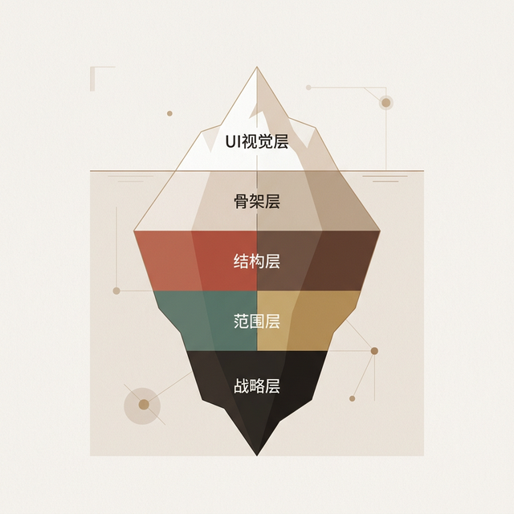

## 模块 2.5: 可用性 vs. 体验 (约 10 分钟)
<!-- BUDGET: 1800 chars | SLIDES: ≥5 | STATUS: done -->

### 1.1 理性底线：可用性目标的生死线

如果不能衡量它，就不能设计它。我们将目标分为两类：可用性目标和体验目标。首先是作为"理性底线"的**七大可用性目标**——注意，传统教材列出六项，但 Yvonne Rogers 在最新版中特别强调了**满意度 (Satisfaction)** 作为第七维的重要性。这七个维度是我们评估任何产品生死准入的刚性红线：

> [VISUAL]
> **Slide**: W01_S02a
> **Layout**: `Grid`
> *   **Asset**: 
> **Scene**: 2x3 网格卡片，展示可用性六维雷达图。每个维度附带一个典型失败案例的灰度小图。
> **List**: 有效性 (无法挂号) / 效率 (冗长表单) / 安全性 (航空键盘) / 效用性 (核心功能缺失) / 可学习性 (厚重说明书) / 易记性 (迷宫般菜单)

在这七大维度中，**效率 (Efficiency)** 的极致案例莫过于 Amazon 的 One-Click 购买。这是一个教科书级的效率突破——亚马逊为这个"一键下单"设计全方面扫清了地址验证、信用卡二次核验等步骤。对于极高频的消费场景，用一个点击替代曾经的五个步骤，能节省下的跳出率成本超过数亿美元。效率评估的核心提问是：**完成极其常规的一项任务需要多少步骤？**

而**安全性 (Safety)** 在医疗或航空领域则是生死攸关的防线。
大家必须破除一个观念：这里的安全，不是防范外部黑客的攻击网络安全，而是指"防止系统合法用户在疲惫时犯下致命操作错误"。比如医院里护士每天要设置的"智能输液泵"。以往的界面允许随意输入数值，如果不小心把给婴儿注射的 10mg 打成了 100mg，这直接导致了医疗致死事故。
现在的输液系统内置了 DERS（剂量错误减少体系）。系统存在两级拦截：**"软停止"** 在输入值超限时发出警告，并弹窗提示“该剂量偏离常规，是否继续”，但考虑到临床医嘱的特殊性，允许强行覆盖；**"硬停止"** 则在数值达到该药物危险毒性极限时，直接锁定设备界面，强制要求重新编程，不给人类任何反悔操作的空间。这就是"安全性"可用性要求——它甚至要在物理界面上"替人类阻止愚蠢"。

其他维度同样承担了产品的生死线：
* **有效性 (Effectiveness)**：这是基准。如果一款号称秒杀抢票的引擎在最后付款环节频频白屏，那么它哪怕交互极具科技感，也是彻底无效的。
* **效用性 (Utility)**：评估功能集是否跨越了必要的业务边界。比如供专业报表人员使用的财务工具，强制抹除了宏逻辑编辑器，这就是低效用性。
* **可学习性 (Learnability)**：最直观的标准是——是否需要一本厚达五十页的说明书？优秀的工具通过"渐进式暴露"（Progressive Disclosure）引导新人，例如剪映首页只展示“一键成片”，只有进入高级编辑才会暴露“音频关键帧”，新用户五分钟就能掌握工作流。
* **易记性 (Memorability)**：为什么 Photoshop 那么复杂，即便设计师长达半年没有操作，依然能快速找回模糊的工作记忆？因为 Adobe 设定了极其稳定的区域隐喻分布：左侧全为生产工具、右侧是视图管理、上层是渲染指令。空间位置取代了机械背诵。

> [DID YOU KNOW]

但大家必须知道，这些可用性维度之间存在着剧烈的**致命冲突与权衡 (Trade-offs)**。
不可能有一款产品在六个维度拿满分。如果你将安全性拉到最高级别的满分体验，比如每移动一个电脑文件都要弹窗要求输入三次确认密码，防止误删文档——那么你的效率和满意度就会直线跌入低谷。
同样，如果专业工具（如同 CAD 建模软件）追求极端的效用性，塞得满满当当的功能就会把可学习性完全摧毁。在未来的课程测试中，你们不仅要评分，更要指出设计者为了哪个核心维度妥协了其他维度。

### 1.2 感性上限：用户体验的审美飞跃

如果全部踩中理性底线，你做出来的仅仅是一个合格的工具箱。对于数字媒体艺术专业的同学，产品的感性上限正是**用户体验目标 (UX Goals)** 能够起飞的地方。

> [VISUAL]
> **Slide**: W01_S02b
> **Layout**: `Comparison`
> *   **Asset**: 
> **Scene**: 体验目标天平。左端堆满引发正面体验的筹码，散发绿光；右端堆满具有压迫感的深色重物，呈现警戒氛围。
> **List**: 正面体验: 愉悦、启发、美学沉浸 / 负面体验: 挫败、受辱、毛骨悚然

正面目标极容易辨认：**愉悦的 (Delightful)、启发灵感的、带来心流沉浸的 (Flow)**。
但真正拉开高级设计师和普通从业人员差距的，是你如何识别和量化**反面负面体验**。很多时候我们甚至没有建立描述这些负面情绪的词汇库。

你的设计是否让用户觉得被**愚弄和受辱**？想象一下那些在提交出错时，采用醒目的红字斥责“您连邮箱格式都填不对”的表单界面，这是最快的破坏品牌信任的方式。
它是否具有**高高在上的压迫感 (Patronizing)**？比如过去那种不让人关掉的强制电脑操作指引精灵。
是否让人感到仿佛被暗中监视般的**毛骨悚然 (Creepy)**？想想看当你和朋友在微信聊天里只是随机提了一句某个品牌的猫粮，五分钟后，你在刷另一个新闻阅读平台时，第一条广告就是这款猫粮。虽然它在机器推荐算法的逻辑中是绝佳的高效匹配，但在人性体验的尺度上，它跨过了安全感的界限。

同一个设计决策往往会像利刃切开用户的两端体验群体。

> [CASE STUDY]

> [VISUAL]
> **Slide**: W01_S02_InstagramLikes
> **Layout**: `Split`
> *   **Asset**: 
> **Scene**: 同样的 Instagram 贴文并列。左侧展示显式的获得 15 万点赞的具体数字；右侧则完全隐藏了数字。
> **List**: 获取成就感 / 社交排斥与容貌焦虑

让我们看一个完美表明体验目标如何波动的例子：Instagram “隐藏点赞数”测试。
2019 年，Instagram 官方在全球多个地区开始隐藏动态中的具体点赞数字。初衷是为了斩断年轻人在这片网络社交场里的攀比心态，降低日益严重的“低赞羞耻”以及引发的社交容貌焦虑。
这个改动被应用后，情况变得无比胶着：对一部分渴望减轻压力的普通年轻人而言，它极大地释放了他们在摄影创作时的自由，实现了“减轻焦虑”的正面体验。但对于一整套围绕点赞量建立商业营收的网红群体以及网络营销公司而言，这种修改带来了庞大的商业迷茫和由于失去透明数据导致的极度“挫败感”。一个极简的 UI 数字是否呈现，能够同时掀开两个截然相反的用户体验象限，这也是用户体验指标最难以捉摸的艺术。

> [ACTIVITY]
> **Type**: `Practice`
> **Duration**: `课后延展`
> **Desc**: 校园数字摩擦自查（课后任务）
> 课后作业：请打开你们每天必须打卡的教务系统页面。通过查阅前面讲解的 7 大可用性原则，逐一列举该平台在哪一项得分最低，导致了哪些具体后果，写出明确的负面体验词汇如（受辱感/毛骨悚然）。下周课前提交。
