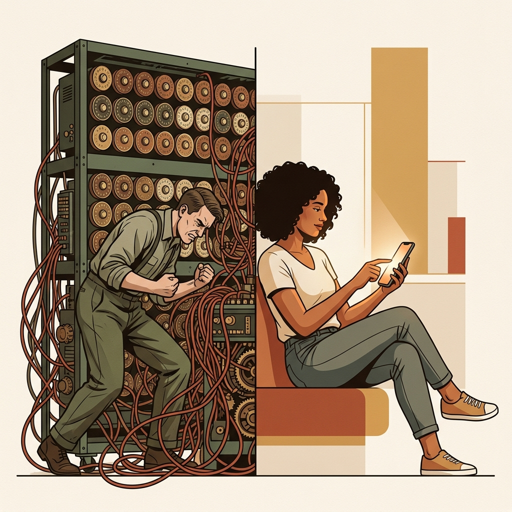
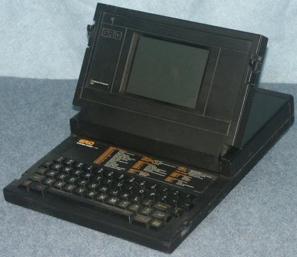
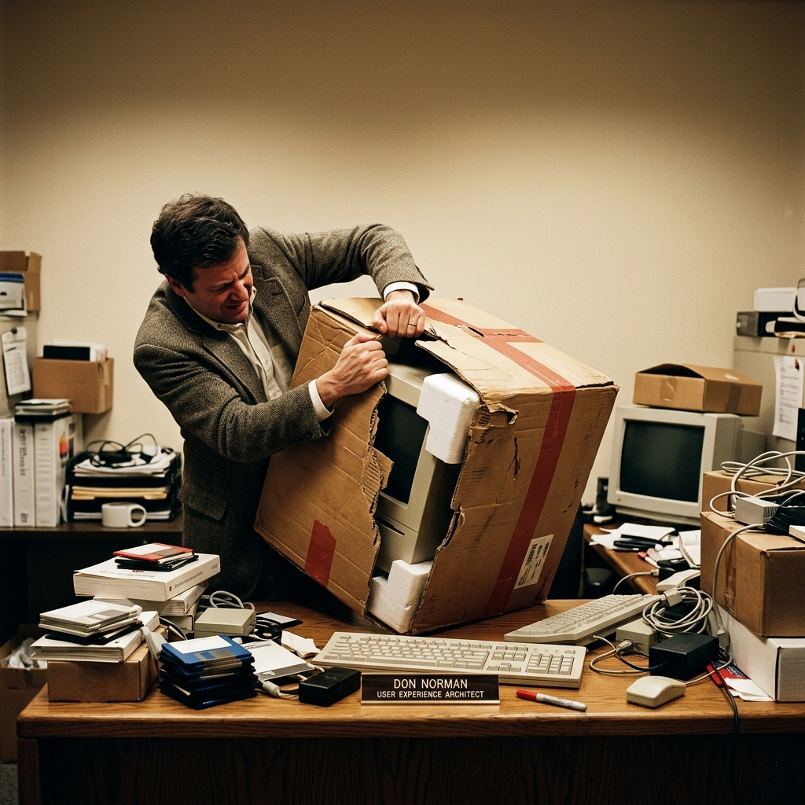
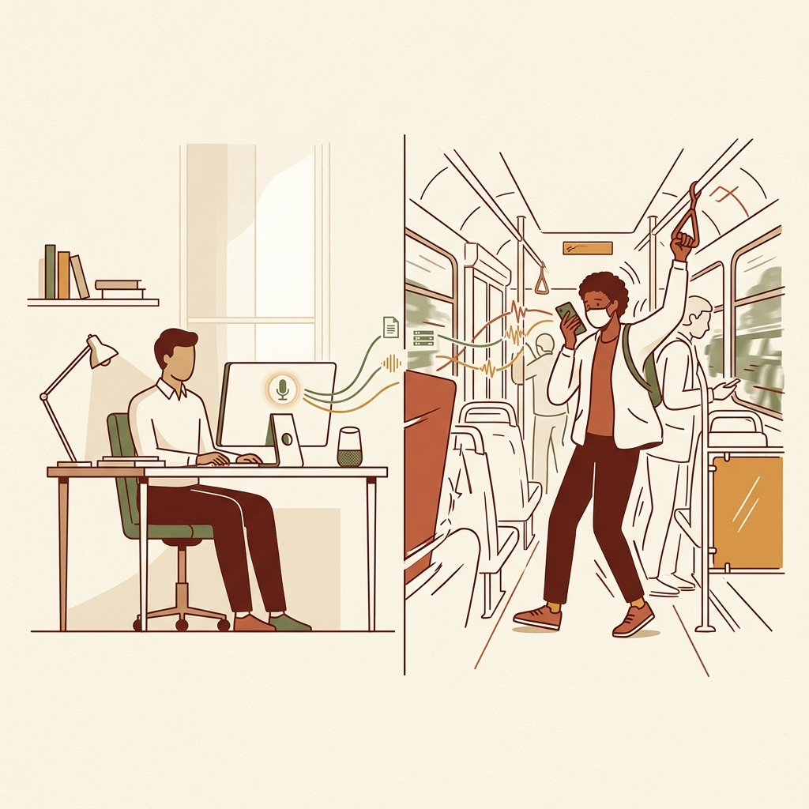
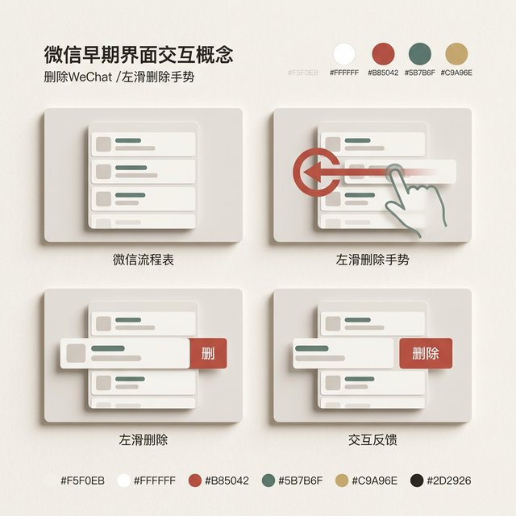
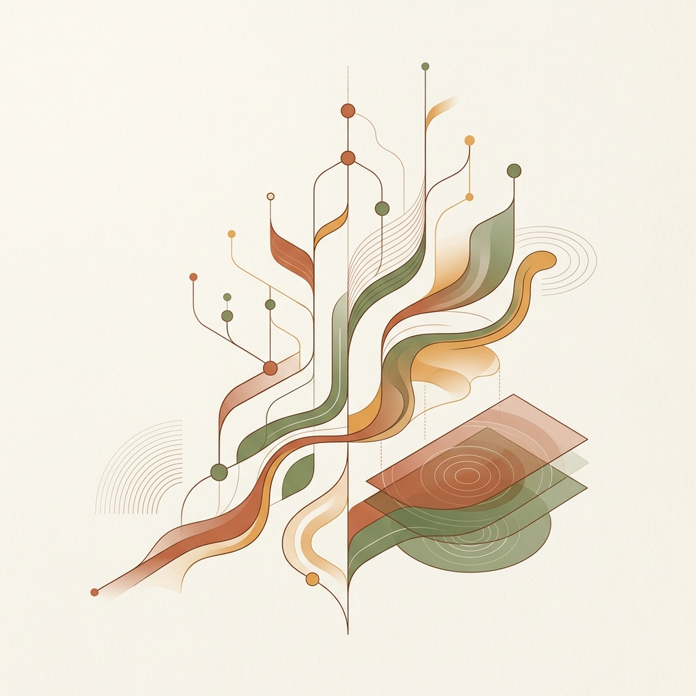
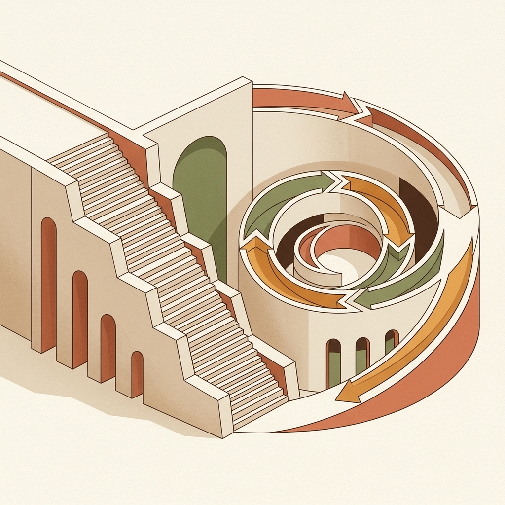
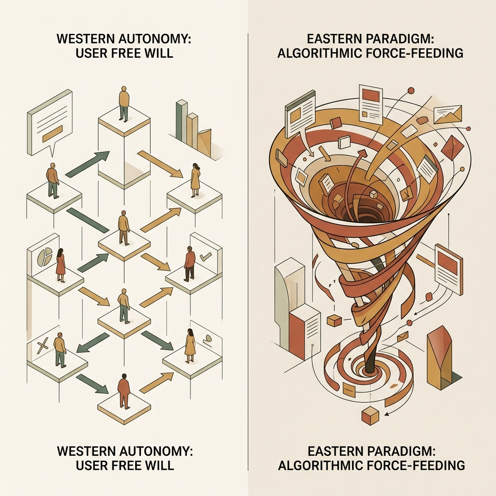
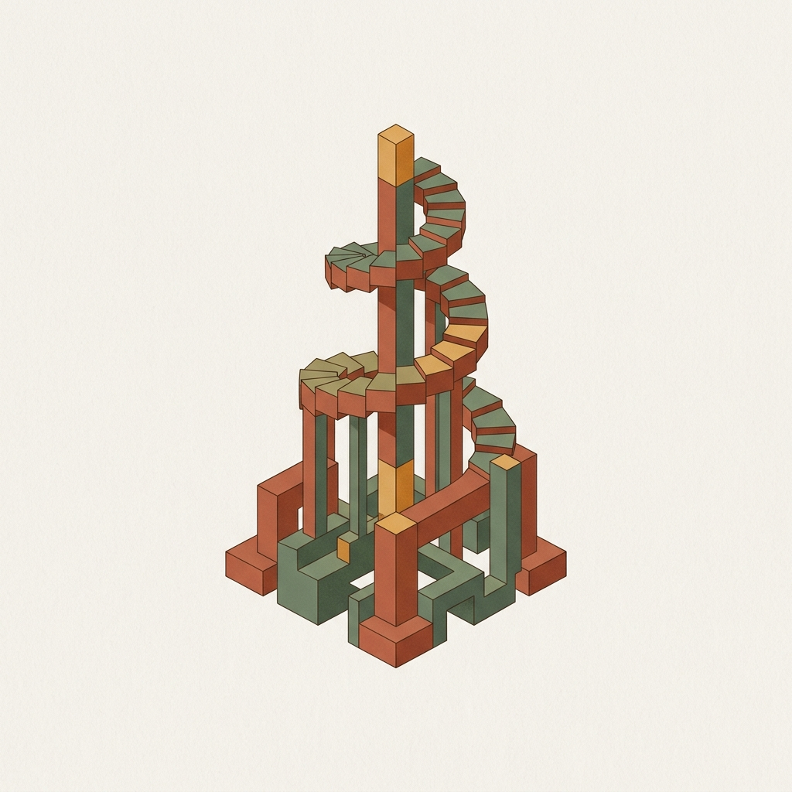

## 模块 2: 定义与边界：我们到底在交互什么 (约 20 分钟)
<!-- BUDGET: 3500 chars | SLIDES: ≥7 | STATUS: done -->

### 2.1 概念溯源：交互设计是一门将机器行为译为人类直觉的工程

> [VISUAL]
> **Slide**: W01_S02
> **Layout**: `Center`
> *   **Asset**: 
> **Scene**: 早期计算机的密码破解机器（类似电影《模仿游戏》中巨大的图灵 Bombe 机器，布满无数旋转表盘和错综复杂的红色线缆，散发着冰冷的机械感，一位工程师正在艰难寻找线索）与现代 iPhone 用户的并排对比。左侧代表极其复杂的机器语言时代；右侧的用户正在悠闲地单手滑动智能手机屏幕。
> **Text**: 交互是一场心智的翻译工程
> **List**: 机器语言时代 / 直觉响应时代

正如画面左侧那台复杂的早期计算机所展现的，软件开发初期，并没有“交互”的概念。当时人类和机器的交流叫“**批处理**”。工程师写好代码，用打孔机在纸带上凿出无数个小孔，然后排队把纸带喂给一台占满整个房间的机器。如果有哪怕一个孔打错，机器就会在两天后吐出一行冰冷的错误码：Syntax Error。

那个年代，机器极其昂贵，人类极其廉价。人类必须忍受机器的怪癖，去学习那种**反直觉的汇编指令**。当时的计算机不需要设计交互界面，因为能使用它的人，脑子里本身就已经长出了“机械神经”。

直到 **1968 年**。

> [VISUAL]
> **Slide**: W01_S02_Engelbart
> **Layout**: `Split`
> *   **Asset**: [展示素材：The Mother of All Demos 3-8分钟实录 (带中文字幕烧录版)](../public/videos/MotherOfAllDemos_3to8_Final.mp4)
> **Source**: `External` — 1968 "Mother of All Demos" 实录截取
> **Duration**: `5m00s`
> **TimeCategory**: `activity`
> **Scene**: 采用无声 GIF 截取：Douglas Engelbart 在 1968 年秋季发布会（“The Mother of All Demos”）中操作鼠标的实录片段。画面左侧是世界上第一只带三个按钮的方形木质鼠标原型，他在屏幕底端移动鼠标，光标跟随手指移动；动图循环播放强化直觉操作感。
> **Text**: 1968: The Mother of All Demos

> [CASE STUDY]
> 在旧金山的一场秋季计算机联合大会上，斯坦福研究所的 Douglas Engelbart 博士走上台，完成了一场被后世称为“演示之母 (The Mother of All Demos)”的发布会。在这 90 分钟里，他向台下的一千名工程师展示了超文本链接、基于视频的远程协作、动态重排的文档编辑窗口，以及——台下人从未见过的一个长方形小木盒。这个底部装有两个金属轮子的木盒，可以通过手部滑动，控制屏幕上的一个光标。

这是世界上第一只鼠标。这场演示宣告了**人机交互，也就是 HCI** 这个学科的诞生。HCI 时代确立了一个核心命题：人类不再需要通过打孔卡片去迎合机器，机器必须通过视觉和肢体反馈，将自身内部的计算状态，翻译成人类能够理解的物理动作。

随着个人电脑的微缩化，焦点**再次发生了转移**。

> [VISUAL]
> **Slide**: W01_S02_Compass
> **Layout**: `Grid`
> *   **Asset**: 
> **Scene**: 上下对比。上方是 1982 年的 GRiD Compass 1101（世界上第一台翻盖式笔电），下方是设计师 Bill Moggridge 本人的档案照，搭配引用语："I was designing the software's behavior, not just its physical shell."
> **Text**: 让交互越过物理边界
> **List**: 1982: GRiD Compass / 界面行为的物理映射

请看画面上方。1982 年，一家硅谷初创公司发布了世界上第一台贝壳式翻盖笔记本电脑 GRiD Compass。售价 8150 美元，美国航天局买它上太空，美国总统带着它用作核按钮手提箱。而屏幕下方的大胡子学者，正是这款机器外观的工业设计师 Bill Moggridge。在设计这台机器时，他遇到了一个棘手的麻烦。

作为工业设计师，他的专长是塑料模具、金属外壳的曲面反馈。但他发现，无论他的外壳打磨得多完美，使用者每天花超 90% 的时间在盯着这块黑白相间发光的屏幕看。**屏幕内部到底发生了什么？** 屏幕里的软件指令极度晦涩，用户按下一个物理按键后，屏幕里反馈的字符常常让人不知所措。

Moggridge 意识到，他的工业设计必须越过物理外壳的边界，向屏幕内部延伸。按下一个真实的按键，屏幕里的菜单应该如何弹出？翻阅文档时，光标应该用什么速率下潜？这已经不是在设计“图形”，而是在设计由机器和人类共同参演的“对话”。1984年，他与另一位学者 Bill Verplank 凑在一起讨论这种全新的工作范式，他们创造了一个词：**交互设计，即 Interaction Design**。

> [VISUAL]
> **Slide**: W01_S02_Norman
> **Layout**: `Center`
> *   **Asset**: 
> **Text**: 体验涵盖了所有的数字与物理触点
> **Scene**: 1993 年的苹果办公区。一名员工拆开包装卡住的 Mac 电脑纸箱，旁边附有文字标签“The box was part of the experience.” 以及 1993年，Don Norman 入职苹果公司。他马上发现桌面软件团队和硬件工业团队水火不容。电脑造得再漂亮，软件如果让人崩溃，体验就是垃圾。于是，Norman 在苹果内部拉起了一支队伍，并创造了一个全新的专业头衔发在了自己的名片上：**User Experience Architect (用户体验架构师)**。1993`, `Vintage Macintosh 1990s box packaging unboxing`, `Cumbersome retro Apple computer boxes`

**1993年，Don Norman 入职苹果公司。他马上发现桌面软件团队和外包装团队是存在巨大壁垒的。当时的电脑外包装通常既笨重又繁杂，不仅很难塞进消费者的汽车后备箱，用户开箱的过程甚至会让人感到“恐惧”（Scary）。一台拥有顶级操作系统的 Mac，如果装在了一个由于纸板过硬导致消费者撕破手皮都拿不出来的纸箱里，它的体验在开机点亮屏幕之前就已经破产了。**

**Norman 把产品定义拓宽到了极致。他后来在访谈中回忆道：“我发明 UX 这个词，是因为我觉得 UI，也就是人机界面，和可用性都太狭隘了。我希望囊括一个人感受系统的方方面面。”设计不能只停留在屏幕里的系统界面，必须覆盖工业设计、包装、拆解、说明书、客服等一切消费者与品牌接触的物理与数字触点。他将这个全域视角正式命名为用户体验，也就是 UX，并在苹果公司获封“用户体验架构师 (User Experience Architect)”，这也是历史上第一个将 UX 作为头衔的正式职位。**

Yvonne Rogers 在标准教材《Interaction Design: Beyond Human-Computer Interaction》中，把这 50 年的演变提炼为一句话：**“设计支持人们在日常工作和生活中进行沟通和交互的产品。” (designing interactive products to support the way people communicate and interact in their everyday and working lives)**

> [VISUAL]
> **Slide**: W01_S02_SiriContext
> **Layout**: `Comparison`
> *   **Asset**: 
> **Scene**: 强烈的视觉对比。左侧是一个安静的桌面计算机工作环境（代表过去）；右侧是一个人在拥挤颠簸的公交车厢内单手拿着手机（代表不可预测的日常空间）。表现交互已经像空气一样从“界面”渗透进不可预期的“物理环境”中。
> **Text**: 交互发生地：溢出物理边界
> **List**: 完美受控的桌面环境 / 充满摩擦的日常空间

要理解这句定义，我们可以把它浓缩为一个非常直观的法则：**交互设计的终极目的，是解决真实物理空间中的问题，而不是制造数字空间里的羁绊。**

学术定义里的两个重音都在印证这一点：第一是**“日常”**。当你两手沾满面粉在厨房脱口而出“Siri 定个闹钟”时，交互早就脱离了“人坐在电脑前”的限定，渗透进了你生活的三维空间。第二是**“沟通与交互”**。大家点开微信或导航，不是为了把玩精美的界面，而是为了跨越界面的阻力，去真实物理世界中碰面、办事。数字产品仅仅是一个**透明的介质**。

因此，**交互设计**从来不是围绕着屏幕玩弄图层与阴影。它是一门消除数字摩擦力、用最短的路径把你送回**正常的物理生活**，最终服务于现实世界的**架构工程**。

### 2.2 结构解剖：高水准的交互体验建立在四个严密的垂直维度上

要解构这门学科的实施路径，Rogers 将产品的交互层面垂直切分为了**四个维度**。

> [VISUAL]
> **Slide**: W01_S02d
> **Layout**: `Grid`
> *   **Asset**: 
> **Scene**: 2×2 网格分析工具模式，四个维度各占一格。左上角绘制大脑网络，右上角绘制设备握持点，左下角展示色彩与字体排版，右下角展示鼠标点击的时间线反馈波形。
> **Text**: UI/UX/IxD 的四大维度边界
> **List**: 概念设计 (Conceptual Design) / 物理设计 (Physical Design) / 界面设计 (Interface Design) / 交互设计 (Interaction Design)

这**四个维度**，构成了你们未来职业生涯的护城河。在《Interaction Design》的系统理论中，它们是拆解复杂业务的**终极手术刀**。

#### 2.2.1 锚定概念：确立业务逻辑的底层骨架
在概念设计中，我们构建的是 100% 纯粹的**业务逻辑和隐喻的蓝图**。你要做一款日历，它的概念设计回答了极宏观的问题：这款日历的组织方式是什么？它是一个“墙挂式”的网格视图，还是一个“连续流动”的时间流视图？它要不要引入天气模型？当年，Trello 首创“看板”隐喻——把任务作为卡片，在分为“待办-进行中-已完成”的列中来回拖动，这是它在项目管理工具中杀出重围的底层概念设计。

#### 2.2.2 敬畏终端：丈量碳基设备的物理边界
数字世界必须依托碳基设备的物理特性。软件设计师极容易遗忘这层边界。你正在设计的界面是运行在可以多指捏合的电容触摸屏上，还是运行在需要在颠簸公路上盲操的汽车中控屏上？甚至是像 Apple Vision Pro 那样依赖眼球注视锚定的头显里？物理尺寸、视距和设备的传感器配置，在下笔画线框图前就已经锁死了交互的范式。

> [VISUAL]
> **Slide**: W01_S02_PuckMouse
> **Layout**: `Image`
> *   **Asset**: 
> **Text**: 1998年 iMac G3 冰球鼠标
> **Scene**: 1998年发布的 iMac G3 经典鼠标（Apple USB Mouse，俗称“冰球鼠标”）俯视图。这是一只罕见的完美正圆形鼠标，强调这种极致的物理对称如何导致了方向感与示能的完全丧失。

1998年，苹果随 iMac G3 发布的一款鼠标“Apple USB Mouse”（俗称冰球鼠标）在历史上留下了恶名。它的界面非常整洁统一，是个完美的正圆形。结果就是：用户的手掌一旦离开鼠标去打字，再盲抓回来时，由于正圆形没有物理方向指示性（示能），鼠标的光标往往会朝着完全不可控的反方向飞出去。物理设计的败北摧毁了所有的数字体验。

> [ACTIVITY]
> *   **Type**: `QA`
> *   **Duration**: `2min`
> *   **Desc**: 快速知识点回顾
> 教师提问互动，校验此前核心法则的理解情况。

#### 2.2.3 铺排界面：调配视觉感知的网格系统
真正被肉眼感知的一层：字体字号、色彩调配、网格布局系统。这是传统视觉设计的射程范围。

#### 2.2.4 激活交互：编排动态序列的反馈时机
这里特指动态动作的编排和状态转移机制。比如你在屏幕上下拉刷新列表（Pull-to-Refresh）时，它提供的阻尼感、松手后转圈加载的处理时间、以及加载完毕后新内容是硬切出现还是带有 300 毫秒透明度渐变出现。这一层关注的只有两个词：**序列与时机**。

> [LIFE CONNECT]

> [VISUAL]
> **Slide**: W01_S02_Wechat
> **Layout**: `Flow`
> *   **Asset**: 
> **Text**: 国民级应用：跨越四维的完美执行
> **Scene**: 微信四个维度的演变轨迹分解图。概念：社交即OS系统；物理：大拇指扫拂区重构；界面：深邃克制的留白体系；交互：自然语言拖拽操作流。

微信是完美执行四维切片的最高标杆。早在 2011 年 微信的诞生就证明了这一点。

> [TEACHING MOMENT]
> 张小龙在概念设计层面，拒绝了单纯的通讯录模型，将所有的支付、出行需求挂载在一个名为“聊天流”的时间线上，打造了移动互联网时代的操作系统底座。在物理设计层面，随着手机屏幕从 4 英寸膨胀到 6.8 英寸，微信强制将所有返回键、呼出菜单的高频落点配置在屏幕下半部的拇指热区，避开了难以触达的屏幕顶角。在界面设计层面，你很难在微信主列表里看到高饱和度的粗体红字，它将信噪比维持在极其静谧的状态，为信息本身让路。在交互设计层面，下拉显示小程序的阻尼感经历了上百次调优，确保了“拉下抽屉”的物理质感。由于四个维度的精确配合，造就了今天的国民级应用。

### 2.3 范式倡导：交互设计必须通过高频试错的螺旋迭代来规避灾难

> [VISUAL]
> **Slide**: W01_S03_AgileSpiral
> **Layout**: `Split`
> *   **Asset**: 
> **Scene**: 左侧展示传统的建筑“瀑布流模型”（线性阶梯状，隐喻不可逆）。右侧展示包含“发现需求-设计方案-原型化-评估”的交互产品四阶段螺旋迭代模型。
> **Text**: 敏捷螺旋：以低成本验证不确定性
> **List**: 瀑布流模型 / 敏捷螺旋迭代

如果你是一个传统的土木工程师，建造一栋大楼的逻辑是绝对 100% 不可逆的单向瀑布流：拿需求、画图纸、打地基、建主体、封顶验收。一旦主体建成，如果客户抱怨客厅朝向太暗，整栋楼无法推倒重来。

然而数字交互产品的边际成本趋向于 0%，它的生命线在于**四阶段的螺旋迭代**：

1. **发现需求 (Establishing Requirements)**
传统的需求靠问：“老板，你要什么？”而交互设计需要实地挖坟掘墓，挖掘暗流中未被察觉的使用场景。

2. **设计替代方案 (Designing Alternatives)**
面对问题，永远不能只交一张图。你必须给出截然不同的发散路径，在内部撕咬与碰撞中找到最优解。如果只带着一个原型去评审，那就是强加上帝视角去蒙蔽真实反馈。

3. **原型化 (Prototyping)**
在《Interaction Design》书中特别强调，抛弃花好几个月写代码的行为。用纸、用剪刀、甚至用 Figma 实现一个能互动的幻觉。测试者无法对着两张静态图片告诉你操作起来到底累不累。体验只能在动态的过程中被检验。

4. **评估 (Evaluating)**
这是整个行业的**判决时刻**，所有的量化指标必须达到 100% 真实。把这个极其粗糙的原型扔进被测群体的实际环境里。根据测试出的漏洞指标，无情地抛弃你的心血，重新回到第一阶段。

> [VISUAL]
> **Slide**: W01_S03_FailFast
> **Layout**: `Center`
> **Text**: "Fail fast, fail often."
> **List**: 早点死，多死几次

对于这种循环，Yvonne Rogers 提醒我们有一句金科玉律："**Fail fast, fail often.**"，翻译过来就是：早点死，多死几次。在代码被正式编写成庞大的二进制文件之前，我们要用原型在低成本的泥坑里完成上千次的试错。

这种“用极低成本快速验证假设”的敏捷思想，正是我们在本周最后**模块 5** 将要部署实战的 **Lean UX（精益用户体验）** 框架的核心基石。届时我们将基于迭代思想，彻底抛弃瀑布流完成实践项目。

### 2.4 语境透视：文化属性与商业内卷重塑了截然不同的交互法则

> [VISUAL]
> **Slide**: W01_S02_ChinaParadigm
> **Layout**: `Comparison`
> *   **Asset 1**: 
> *   **Asset 2**: 
> **Source**: `Video` — TikTok 真实滑动录屏
> **Duration**: `0m34s`
> **TimeCategory**: `activity`
> **Scene**: 强烈的范式冲突并排对比。左侧：欧美典型的网格与分类树界面树（强调用户主动思考、寻找入口）。右侧是真实手机录屏录像：手指快速上下滑动极简的沉浸式全屏视频流（强调系统接管用户疲劳、单指多巴胺灌注）。
> **Text**: 欧美主动搜寻 vs 中国被动沉浸

在最后，我们要剥离一种潜意识的自卑。现代交互设计的发源地确实在北美，无论是 Xerox PARC 的桌面环境，还是 Apple 的自然手势体系。但在进入移动互联网的全盛时期后，数字世界的人口结构、设备下沉与信息过载，迫使东方语境生长出了极其霸道的交互范式。

> [CASE STUDY]

早期硅谷崇尚绝对的结构清晰与自由选择路线，典型如美国 Craigslist 网站：满屏的蓝字分类链接，你需要一层一层点击检索，它的隐藏假设是“用户拥有充足的时间与充沛的认知资源进行计算”。

然而，TikTok 在全球刮起的旋风是由中国算法工程师架构的颠覆级交互：**全屏单排上下滑（Swipe-up）**。

TikTok 砍掉了所有并排的分栏，取消了用户的自主选择权。一屏只展现唯一一段视频内容，没有任何多余的干扰元素能分散视线。用户的交互动作极度退化，仅需要一个最省力的大拇指上滑动作。在这里，体验目标从硅谷教条式的“提高查询效率”，演变为了近乎病态的“极致心流沉浸与多巴胺榨取”。算法系统彻底接管了使用流程，用户进入了一个近乎催眠的被动灌注状态。目前，这种范式已逼迫包括 YouTube Shorts、Instagram Reels 在内的所有硅谷巨头妥协甚至完全照搬。

> [VISUAL]
> **Slide**: W01_S02_EcommerceParadigm
> **Layout**: `Comparison`
> *   **Asset**: 
> **Scene**: 欧美古典电商与中国下沉电商的视觉范式对比。左侧：Chanel 官网界面，大面积黑白留白，营造缓慢高冷的呼吸感；右侧：SHEIN 的闪购界面，高密度的红色弹窗与倒计时，极速榨取用户的决策时间。
> **Text**: 视觉范式的跨文化冲突
> **List**: 欧美范式：留白与呼吸感 / 中国范式：无缝滑落与倒计时迫切感

另一个例子是电商霸主 SHEIN 的全球战役。如果你登录海外的老牌奢侈品网站 (如 Chanel) 或是高档百货网购站点，充斥着大面积的留白隔离，试图营造缓慢的展示呼吸感。而在 SHEIN 的体系下，“无缝滑落”占据统治地位。用户在浏览商品流的时候，不需要任何翻页阻断，算法结合极其紧凑的低价闪购弹窗以及极短的倒计时数字跳动，直接在视觉层面构建了巨大的虚幻紧迫感。通过在每一个细微的环节剥夺深思熟虑的时间，SHEIN 的转化漏斗成为了同类产品中最锋利的镰刀。

> [VISUAL]
> **Slide**: W01_S02_ActivityAfricanPay
> **Layout**: `Title`
> *   **Asset**: 
> **Scene**: 抽象背景。概念风格黑板或任务板，罗列出几个极限条件关键词：【非洲市场 / 极低识字率 / 2G-3G 网络环境】，营造出问题探讨的悬停氛围。
> **Text**: 极限挑战：重建金融基础设施

> [ACTIVITY]
> *   **Type**: `Practice`
> *   **Duration**: `3min`
> *   **Desc**: 模块终点自习局
> 大声回答一个问题：如果我们现在准备外包开发一款非洲市场的极简移动支付系统，面对识字率极低、网络带宽在 2G 到 3G 之间频繁波动的当地特殊人群，在刚才提到的【概念设计、物理设计、界面设计、交互设计】四层中，哪一层的突破会起决定性的生死作用？请分组拿出 1 个具体的切入点。

无论是西方的古典克制法则，还是东方的超高频次留存算法，本质上都是在回应那个终极问卷：这群身处某一具体文化位面中的目标用户，他们的感知通道和决策捷径究竟长什么样？这就正式引入了我们下一个模块将要讨论的核心尺度——**可用性与体验的刻度**。

---
