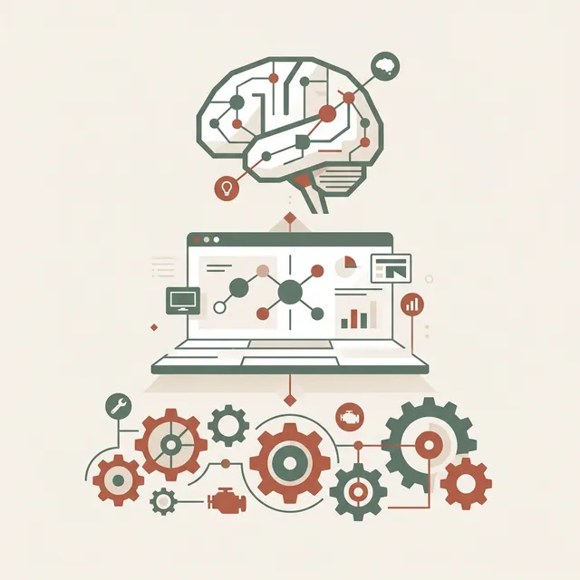
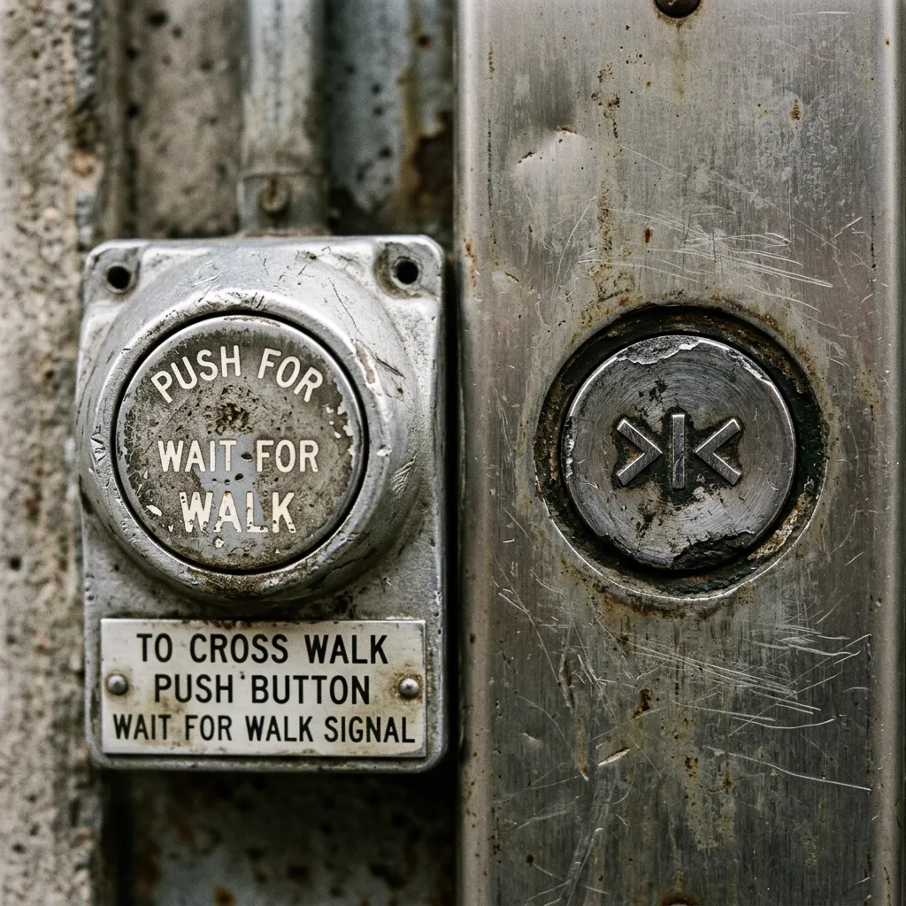
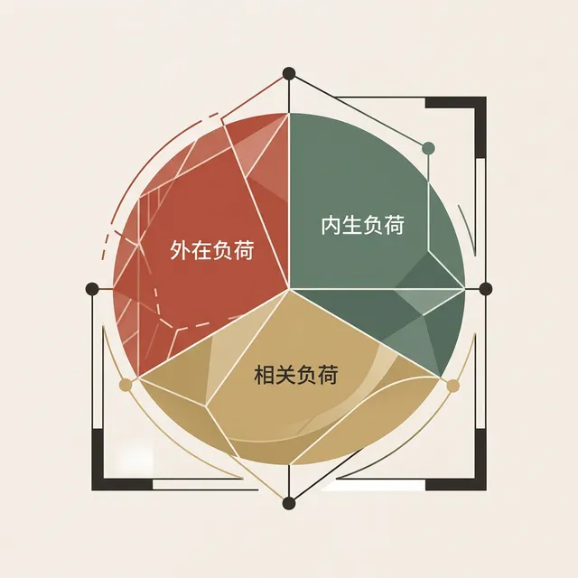
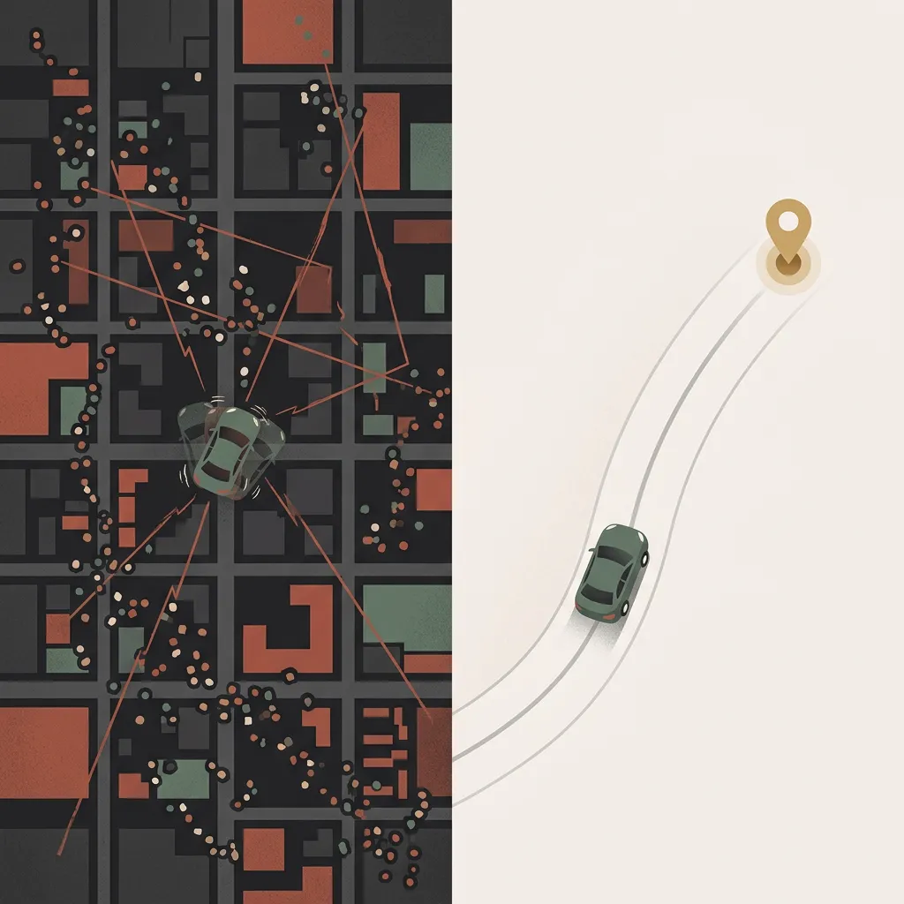
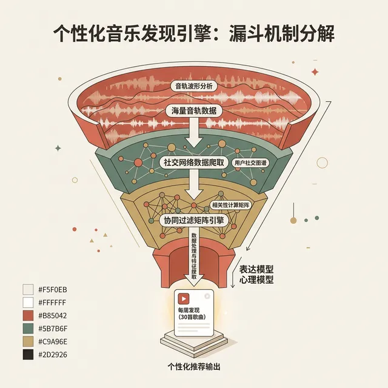
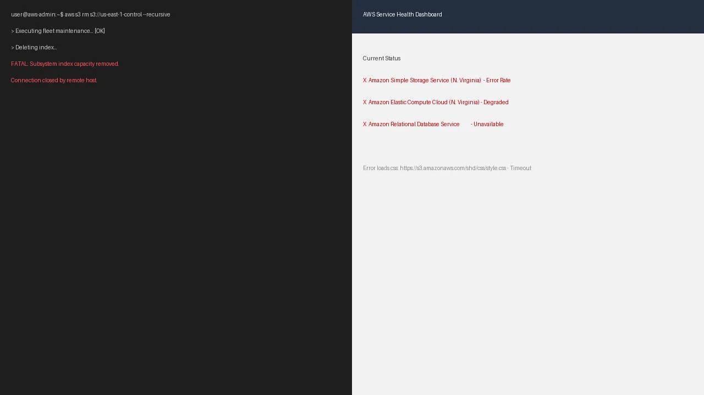

## 模块 3: 模型失控 —— 当表现层背叛真相 (约 25 分钟)
<!-- BUDGET: 4500 chars | SLIDES: ≥10 | STATUS: done -->

### 3.1 现状断言：常人心理预期与机器底层架构存在巨大鸿沟
> [VISUAL]
> **Slide**: W01_S03
> **Layout**: `Flow`
> *   **Asset**: 
> **Scene**: 一个三环交叉的文氏图或者阶梯图：工程实施模型 (底部满布生硬齿轮) -> 表现模型 (中间的平滑界面层) -> 用户心理模型 (顶端的大脑结构)。
> **Text**: 认知失调的本源
> **List**: 工程实施模型 (Implementation Model) · 用户心理模型 (Mental Model) · 表现模型 (Represented Model)

数字设计灾难的核心，源头完全归结于认知模型的严重错位。正如画面中这三环交叉的架构图所揭示的，从底层的**工程实施齿轮**，到中间作为善意翻译官的**平滑表现界面**，再到顶端回归直觉的**大脑心智图景**，三者之间的断裂将是灾难性的。当工程师绕过中间的“表现模型”，直接将生硬的后台结构暴露给普通用户时，就会遭遇惨烈的系统崩溃。要彻底剖析这种错位，我们必须引入 Alan Cooper 提出的这三大心智模型框架。

> [VISUAL]
> **Slide**: W01_S03a
> **Layout**: `Flow`
> *   **Asset**: 
> **Scene**: 三层蛋糕结构解剖图。最底部的基座是裸露的齿轮、集成块与粗糙电线（后台代码）。中层的夹心是一块打磨得平滑的玻璃面板，带有一个可控制的实体滑块（表现模型）。最顶端是一团漂浮的思想气泡，勾勒着简单的抽象图案（用户心理模型）。
> **Text**: 三大核心模型
> **List**: 后台代码 (底层机制) / 表现模型 (可视界面) / 心理模型 (用户预期)

正如这幅三层蛋糕状的解剖图所示，位于整个系统物理最底层的基座构架是**工程实施模型 (Implementation Model)**。它犹如那层布满粗糙电线与裸露齿轮的深渊，反映了代码真实的存储状态和数据结构。对于一台网络资源共享服务器，后台代码呈现为复杂的树状遍历目录、各类协议指令与布尔权限位掩码。掌握这种模型需要极为深厚的技术背景。

而在结构的最顶端，存在着**用户内化预期 (Mental Model)**。这是普通大众凭借早年生活经验，对某个设备如何运转所抱有的刻板预期与信仰假设。在一位习惯于纸质办公的行政人员脑中，云端存储盘的默认观念就是一个位于天上的无底洞抽屉，它不需要建立文件夹层级，只需要把照片放进去就能永远保存。脑内逻辑具备一项极其务实的属性：**它根本不关心底层物理或代码的客观真相，只要能应付日常操作、建立起安全感，在交互的语境下，它就是“绝对正确”的。**

> [LIFE CONNECT]

> [VISUAL]
> **Slide**: W01_S03b
> **Layout**: `Split`
> *   **Asset**: 
> *   **Asset (AI fallback)**: 
> **Source**: Wikimedia Commons / Public Domain (Historical Archive)
> **Text**: 电影的视觉驻留幻象
> **Scene**: 影院放映系统真相解构。左侧剖析放映机的机械转轴，详细标注"每秒 24 帧静止胶片叠加全黑无痕切割间隔"（后台代码）；右侧则是沉浸在无缝战斗场面里的观众，大脑认为自己看到的是"真实连贯的时空动作"（心智图景）。

Alan Cooper 在专著中引入过数个绝妙的物理类比来揭示这种错位。如图中右侧沉浸的观众一样，观赏电影的过程即是对**内化预期**的完美利用。电影观众在漆黑的放映厅内，大脑接收到的默认观念是“一段连续时空中发生的真实运动”。由于人类视觉驻留效应的存在，这个模型在感官上逻辑自洽。但其背后的工程实施模型，正如左侧那台切分光影的机械转轴所示，是胶片机以极快的速度更迭静止的照片，并在每一帧之间穿插了一瞬间的纯黑快门遮挡。如果向观众强行暴露那一片片机械的死黑间隔，观影魔术便会立刻破碎。

> [VISUAL]
> **Slide**: W01_S03c
> **Layout**: `Split`
> *   **Asset**: 
> **Text**: 荒谬但有用的水流隐喻
> **Scene**: 电力网络输送流。左侧绘制出狂暴的交流电波形震荡图，重点标注"在 1/60 秒内正负极狂乱更迭"（后台代码）。右侧描绘一个插画风格的水龙头连着电线，点亮灯泡，标注"电就如同水管里的储流水"（错误但有用的脑内逻辑）。

另一个普世的案例如出一辙。你看右侧这个具象化且实用的水流隐喻，绝大多数市民坚信，家用电流的作用机理就像那个连着发光灯泡的水龙头，等同于自来水管系统：电流从发电厂的水库出发，沿着电线水管单向奔涌，最终注入发光的灯泡。但看看左侧那张狂暴的交流电波形震荡图，从量子物理学的严谨视角看，这证实了它在客观上的不准确——交流电线路中的电子实际上每秒进行数百次的极性原地往复剧烈反转，根本不存在宏观距离的位移。但这套被显化的“**水压控制**”隐喻，是人类大脑极其高效的认知捷径。人们凭借着这个“不客观但绝对管用”的心智图景，安全无虞地拨动开关，甚至推导出电费计价的数学期望。内化预期的存在，纯粹是为了在复杂的系统面前建立起一种直觉的、原始的安全操控感。

再比如移动通信网络基站的跳频算法。行人在穿越多个街区时保持高频通话，背后的工程学动作是终端与多个基站进行惨烈的波段重联握手（Handover）。而在民众的心智空间里，只有一句唯一的预设原理：“**只要在城里，手机就有魔法连通世界**”。如果界面为了标榜技术强悍，在通话屏幕上实时打印出：“警告：正在切断 eNB#1347 基站并发起频率跳转”，由此引发的恐慌感将摧毁体验。

> [LIFE CONNECT]

> [VISUAL]
> **Slide**: W01_S03d
> **Layout**: `Full`
> *   **Asset**: 
> *   **Asset (AI fallback)**: 
> **Source**: Editorial Stock / Fair Use (Placebo buttons)
> **Text**: 安慰剂按钮效应
> **Scene**: 两张充满时间磨痕的日常照片组合。左半张是电梯内那个被手指戳得几乎掉漆的"关门"按钮，右半张是十字路口红绿灯杆上磨损严重的金属"行人过街"大按钮。中央印着巨大的医疗标记"精神安慰剂"。底部配文："用物理摩擦置换时间焦虑"。

日常生活中还蛰伏着设计者刻意纵容的默认观念骗局。就像这张图中被戳得掉漆的电梯“关门”键和磨损严重的“行人过街”按钮。自从 1990 年 美国残疾人法案（ADA）出台后，严令要求全部电梯的开门悬停时间不得低于法定的秒数警戒线。这使得市面上 100% 的电梯关门按钮全部被物理阉割，降级为线路反馈的装饰品；同样，主城区极多的人行过街按钮早已被计算机中控接管，与信号灯控制板断连。但民众的脑内逻辑强制推演“敲击带来改变”。设计者保留这些纯粹作为“**精神安慰剂**”的按钮，本质上是在用动作上的掌控错觉去抚慰等待时的庞大时间真空。
> [VISUAL]
> **Slide**: W01_S03d_Video
> **Layout**: `Full`
> *   **Asset**: 
> **Source**: `External` — YouTube 教育素材，非 AI 生成
> **Duration**: `8m48s`
> **TimeCategory**: `activity`
> **Text**: 六个"什么都不做"的按钮
> **Scene**: 视频实录揭秘日常生活中那些被设计者刻意保留的安慰剂按钮——电梯关门键、行人过街按钮等——它们从未真正连通任何控制电路，却让人们获得了虚幻的掌控感。

这种利用直觉抚慰心智的桥梁，就是位于模型图谱正中央的**交互界面 (Represented Model)**。作为设计师，我们绝不能去纠正用户的认知偏差；相反，我们必须亲自动手，精心编织这层**美丽的谎言**，把残酷生硬的后台代码，完美包装成用户大脑里那个简单、人性的幻觉模型。这，就是软件界面最初诞生的缘由。

### 3.2 范式倡导：卓越的交互必须用美丽谎言掩盖残酷的系统真相

> [VISUAL]
> **Slide**: W01_S03e
> **Layout**: `Comparison`
> *   **Asset**: 
> **Text**: 平衡系统真相与心智幻觉
> **Scene**: 物理博弈天平图解。上方：当滑块死命偏向左端（后台代码齿轮代表的真实世界）时，天平严重失衡翻倒，红色交叉标志显现。下方：滑块稳固地靠在右侧（代表云朵与错觉的心智图景端），天平达成水平平衡，绿光充盈。
> **List**: 后台代码揭露残酷真相 / 交互界面呵护心智预期

**系统崩溃的本源，全部集中于视觉投射对底层逻辑进行了剪辑的照搬。** 当程序员掌握 UI 主导权时，他们倾向于诚实地将后端数据库表格以及复杂的调用层深渊裸露给用户。

而造就商业奇迹的交互设计手法，永远是将前台面板强硬地向着用户心理那一端推压，**甚至不惜隐瞒掉残酷的系统真相**。

> [VISUAL]
> **Slide**: W01_S03e2
> **Layout**: `Split`
> *   **Asset**: 
> **Text**: GPS 坐标真相 vs 平滑驶来的谎言
> **Scene**: 出行App的工程真相与消费者幻觉对比。左侧是混沌的城市路网底图上散射着大量GPS断点坐标，车辆图标在多个幽灵位置间闪烁瞬移，赤陶色的锯齿折线连接着不规则的漂移轨迹，充满焦虑与失控感。右侧是干净极简的地图界面，一颗车辆图标沿着柔和弧线从容驶向琥珀色的目的地标记，散发着确定性与安全感。
> **List**: 工程真相：GPS 间歇断点 · 坐标疯狂瞬移 / 表现谎言：假地图 · 平滑移动 · 确定性幻觉

Uber 和滴滴等出行软件的设计演化展现了教科书级别的操作手腕。普通市民完全无法理解派单背后的 Dijkstra 寻路算法以及复杂的潮汐调度网络。出行 App 仅仅是利用一颗在假地图上平滑移动的 2D 车辆图标，就构建出了“司机正在向你驶来”的完美幻觉。它用谎言掩盖了工程的粗鄙，进而实现了**确定性**。真实情况下的工程坐标漂移则是灾难性的：受制于高频建筑群与林荫遮挡，车辆传回的 GPS 坐标常常是间歇性的闪烁断点数据。如果照搬输出，屏幕上的车辆图标只会在几个街区之间疯狂瞬移，这部分暴露的真相不仅无法提供确定性，反而会彻底摧毁乘客的安全感。

同样，早期的电子表格软件（如 Excel）的成功，正是因为它将背后的矩阵运算逻辑和数据库调用结构，完美地封装在了一个**模仿纸质账簿的心智外壳内**。它刻意回避了让大众学习代码中的矩阵运算协议，只是非常平和地递上一张巨大的带有数字坐标的“网格纸”。这套设计之所以伟大，在于它完全压制了向用户普及编程知识的冲动。

与之同理的，是对用户心智有着极佳保护机制的所谓“代码黑箱”封装。

> [CASE STUDY]

> [VISUAL]
> **Slide**: W01_S03h
> **Layout**: `Flow`
> *   **Asset**: 
> **Text**: 温情的超级黑箱：算法的极简伪装
> **Scene**: 漏斗式超级黑箱过滤演示。上层塞满了海杂乱无章的全球百万用户操作记录节点、隐晦诡谲的波形卷积神经网络（庞大的后台代码）。诸多复杂信号经过高速漏斗的挤压，在最底层产出一张拥有美丽圆角、伴有轻缓微光动画的矩形卡片（表现界面）。

流媒体巨兽 Spotify 每周的推荐算法清单，深刻说明了表现模型是如何用谎言抚慰人心的。用户的心智模型极其单线：“软件的编辑部很懂我的音乐品味”。而在机房内疯狂运转的，却是瞬间消耗海量算力的**三阶交叉引擎**：首层抓取百万级用户的听歌交点绘制协同矩阵，二层下达探针在语料库中啃咬分类词条，最底端辅以深空探测级别的声学波形剖析。这三股生硬的数据洪流交汇后，被极度收敛成了手机屏幕上一张边角圆润的极简卡片。残酷极客的数字博弈逻辑，被这层温情的表现界面死死锁在幕后。

> [ACTIVITY]
> *   **Type**: `QA`
> *   **Duration**: `2min`
> *   **Desc**: 快速知识点回顾
> 教师提问互动，校验此前核心法则的理解情况。

### 3.3 致命的失控：当表现模型彻底背叛底层机制

然而，Donald Norman 曾严肃指出，当表现模型完全隔绝了操作者与机器底层之间的神经元链路，甚至在面对系统危急时刻依然进行粉饰与谎报时，必将反噬为血淋淋的灾难。这种刻意伪装导致的表现模型背叛，在**安全苛求系统 (Safety-Critical System)** 中是绝对致命的。

> [CASE STUDY]

> [VISUAL]
> **Slide**: W01_S03k
> **Layout**: `Comparison`
> *   **Asset**: 
> **Source**: `Locked` — External 事故档案 GIF 再现，非 AI 生成，无需视频纪录片
> **Text**: 表现模型的谎言：核灾与医疗血案
> **Scene**: 采用无声 GIF 呈现：Therac-25 医疗事故的终端报错界面还原。粗糙的单色黑绿像素终端屏幕上，不断闪烁刺眼的无意义机器乱码“Malfunction 54”，接着跳出一个虚假的“no dose（无剂量输出）”提示。动图极具压迫感，渲染出由于系统反馈设计缺陷带给非技术人员的认知错乱与致命欺骗。
> **List**: 1979 年三哩岛核事故：红灯欺骗了操作员心智 / 1985 年 Therac-25：虚假的剂量报错杀死患者

八十年代发生在加拿大的 **Therac-25 放射治疗机**血案，是教科书级别的噩梦。为了缩减成本，工程师移除了机电物理安全联锁，将病患的生命完全押注在底层软件防护网上。这款设备的表现模型极其冷漠，甚至提供了虚假的安全反馈。当系统在底层崩溃时，操作屏幕只会闪过极其隐晦的机器乱码：“Malfunction 54”。长期疲劳令前线人员对高频报警严重脱敏，养成了闭眼狂按 `P` 键（Proceed 执行键）强制跳过的潜意识肌肉记忆。在操作末尾，屏幕居然会恢复平静，并宣告终极谎言：“no dose”（无剂量输出）。医务人员依照这句判断，放心让病患离场。但工程真相是：机组底座早已失锁，在极短瞬间将高出警戒线数百倍的死亡辐射贯穿了患者肺腑，造成了不可挽回的惨剧。

在此六年前，同样的悲剧早有预演。在 1979 年著名的**三哩岛核泄漏事故**中，控制面板上依然亮着红灯。但底层设计却高度反直觉：“这颗红灯常亮，仅仅代表主板对减压阀门下发了微电子控制信号”。这活生生击穿了值班工程师的心智常识：在人类大脑里，致命红灯必须等同于“该阀门已被物理卡紧”。这种工程真相与人类预期的严重裂隙，直接导致数百吨受污染的冷却水在反应延迟中流失长达两小时。这不仅摧毁了半座反应堆芯，更险些将全美大片陆地化为放射灰烬的末日深渊。

<!-- [SPIRAL] Therac-25 + 三哩岛案例将在 W02 M02 从 Norman 评估鸿沟视角做最终解剖 -->

> [CASE STUDY]

> [VISUAL]
> **Slide**: W01_S03l
> **Layout**: `Split`
> *   **Asset**: 
> *   **Asset (AI fallback)**: 
> **Source**: Wikimedia Commons, CC BY-SA 4.0 / Fair Use for Education
> **Duration**: `4m33s`
> **TimeCategory**: `activity`
> **Text**: 被彻底抹消的安全预警：波音空难
> **Scene**: 波音 737 MAX 系统断代惨剧解剖图。飞机的机身结构深处躲藏着"代码巨兽（MCAS系统）"，但它的神经引线却生生被切除，并没有跟上方全景驾驶舱大仪表盘内的任何显示红灯或者物理警告警报器发生物理连接。两名机长仍维持着旧版飞机平手柄飞行操作的心智思维，殊不知这只巨兽正试图拉下整台飞机的死角撞向海面。

时间跨度来到令人痛定思痛的 **2018 年与 2019 年**。波音公司的皇牌产品 737 MAX 客机连续两度在起飞阶段极其诡异失控坠机遇难，共夺走 346 人的无辜灵魂。这场深渊的始作俑者名为 MCAS（机动特性强化系统）。由于工程物理学更迭导致这款超级引擎由于位置阻尼改变会产生致命的上扬失速漏洞，这款仅为反向强制低头强行救场的底层强制修正程序被隐秘植入大脑中。

波音高层为了让航空公司免收千万级的飞行员复训费用，做出了令人发指的决定。他们在这架庞大客机的数字系统防线内，无底线地切断了所有与 **MCAS 模块**相关的警告蜂鸣器与光路告警。资深飞行员们满心以为，自己依旧在操纵着那台可被人工降服的老型号平台。殊不知，此时那个唯一具有感知能力的迎角探头已经遭遇鸟群撞击短路。陷入疯狂死循环的系统巨兽 MCAS，正强行夺走飞机的控制权。在这个压抑逼仄的座舱绝境里，所有能用做救命警示的信号全被锁死。机长被迫在这个刻意封锁底层机理的迷宫黑匣子里，用血肉之躯死命对抗着庞大的液压阻滞力。他们坚持到了最后一刻，直到整台客机粉身碎骨坠入深海。

<!-- [SPIRAL] Boeing 737 MAX will be re-examined in W02 M02 from Norman evaluation gulf perspective -->

> [CASE STUDY]

> [VISUAL]
> **Slide**: W01_S03m
> **Layout**: `Split`
> *   **Asset**: 
> *   **Asset (AI fallback)**: 
> **Source**: Amazon Web Services Incident Report, 2017
> **Text**: 毫无防护的前台：AWS 当机引发的震荡
> **Scene**: 发生于网络数据中心的典型灾变。左边刻画着一张极度暴露不设防、毫不具备二次确认缓冲阻挡弹窗防护甲套的纯黑极客底层底端屏幕截屏，只剩下无情感的白光命令提示符。右侧则爆发出如同多米诺骨牌级联引爆被直接倾覆掀翻的恐怖多频火警灾变警告，红黑闪爆画面吞没了各大头部互联网科创公司的标志商标牌匾落难。

在被极客视作圭臬的“全开放底层透明”生态下，同样重播着惨痛的教训。**2017 年亚马逊 AWS 大宕机**，源于一项例行的机组清退指令。仅仅是因为控制终端极度冰冷、毫无防护底线，中枢值班员失误录错了一组包含核心删除参数的指令，便按下了致命的回车。缺乏了二次确认的防呆门控，这条越轨指令迅速席卷深层网络，将关键骨干集群全线拔除。这场蒸发数亿财富的云端末日表明：完全褪去保护护盾，将权力最大的机能接口直接暴露给拥有情绪脆弱性的碳基生命，等待我们的永远是一枚随时引爆的核手雷。

<!-- [SPIRAL] AWS S3 outage will be the final case study in W02 M02 on feedback explainability -->

### 3.4 批判性设计：刻意制造摩擦以唤醒反思

经历过这些失控的深渊，所有交互设计师必定会在底线中铭记一道**绝对黄金法条**：务必殚精竭虑，保卫操作者的心智逻辑同表现层的高保真对接。若背道而驰，不仅会引发认知滑铁卢，更会酿成重大的可用性灾难。

然而，当我们将视野转向**批判性设计** (Critical Design) 乃至新媒体艺术领域时，你会深深被另一种行为震撼。在这个无需兼顾“效率至上”的维度里，先锋者们挥舞的**解构巨斧**，恰恰是“刻意且精确地拉大”受众固有期望与机器反馈之间的巨大沟壑。他们不去抚慰心灵，而是用**阻力与摩擦的错位**，逼迫受众从数字麻木中痛醒。

> [VISUAL]
> **Slide**: W01_S03n
> **Layout**: `Comparison`
> *   **Asset**: 
> **Source**: Historical Archive (Claude Shannon's "Useless Box")
> **Duration**: `0m08s`
> **TimeCategory**: `lecture`
> **Text**: 批判性设计：机器本能的反抗
> **Scene**: 香农“无用盒子”实况。左半边是一个极其普通的木盒，面板上孤零零地镶嵌着一枚电磁开关，人类凭借本能习惯将其拨到“ON”；随之木盒的小盖子冷漠弹开，一根毫无感情的机械臂探出，强硬地将原本拨开的开关原路打回“OFF”状态。
> **List**: 剥夺直觉常规以击碎工业时代的幻境 / 刻意引发认知错位探寻机器与个人的权力博弈

这种被称作“刻意制造摩擦”的艺术剥夺手法，最具有里程碑意义的诠释之一，正是信息论之父 Claude Shannon 发明的**无用盒子** (Useless Box，又称 Ultimate Machine)。

凭借我们在工具时代被牢牢灌输的霸权观念，当面对一个孤零零的开关时，我们的大脑坚信自己享有不可质疑的单向控制权。然而，当你满怀期望地触发这台机器的开关——它既没有执行任何实际性任务，也没有点亮光彩夺目的霓虹；恰恰相反，在阴暗的机身深处，它缓缓弹出一根冰冷的指头，以一种令人错愕的对抗姿态，生硬地把开关重新拨回原本关闭的状态！

在这极其离谱的“反叛与抗命”操作被完成的一瞬间，操作者会遭遇绝对的惊恐与失重。这一滑稽而尖锐的瞬间彻底剥夺了现代工业赋予你的神之权力幻觉。它强逼那些包裹在功能糖衣下的受众，退回到哲学底线外重新审视：在这个不足微米厚的开关和你那发号施令的皮肉手指之间，早已不再是绝对的主仆关系，而是一种充满荒诞博弈乃至拥有**反噬意志**的全新交互形态。

**(Pause: 3s)**

### 3.5 金法条与前瞻

经历过这些失控的深渊以及"无用盒子"那令人错愕的哲学反击，所有交互设计师必定会在底线中铭记一道**绝对黄金法条**：务必殚精竭虑，保卫操作者的心智逻辑同表现层的高保真对接。若背道而驰，不仅会引发认知滑铁卢，更会酿成重大的可用性灾难。

> [TEACHING MOMENT]
> **前瞻：从灾难诊断到目标导向设计**
> 我们今天从灾难视角看到了三大模型错位的杀伤力。但诊断只是防守——如何从防守转为进攻？如何主动设计出贴近用户心智的表现模型？Alan Cooper 给出的终极答案叫做**目标导向设计 (Goal-Directed Design)**：不要去优化那些注定被技术淘汰的执行任务，而是直取用户底层的永恒目标。这将是我们 **W05** 的绝对核心。届时我们还将掌握一件威力巨大的实战工具——**对象-动作矩阵 (OAM)**，用它来把冰冷的工程术语翻译成充满人性动能的交互方案。

> [ACTIVITY]
> **Type**: `Practice`
> **Duration**: `课后延展`
> **Desc**: 模型失控大搜查
> 各特遣小组散会后就地选择本校周遭被严重遗弃老去的公共设施（譬如城中村自助取款机或老旧办事处叫号总机）。记录下它的表现模型与你的心智期望之间的全部裂隙：哪些按钮让你猜不透功能？哪些反馈让你误判了系统状态？绘制一张"当表现模型背叛了用户心智"的诊断报告，并在下一周开启课堂时进行汇总点评。

---

