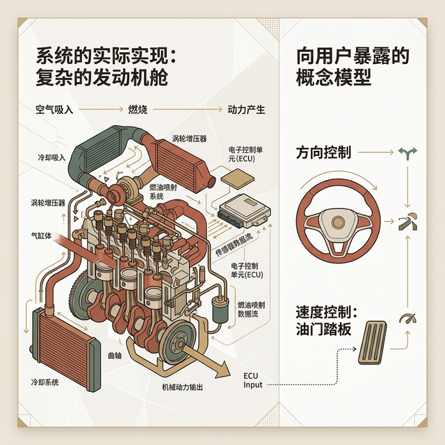
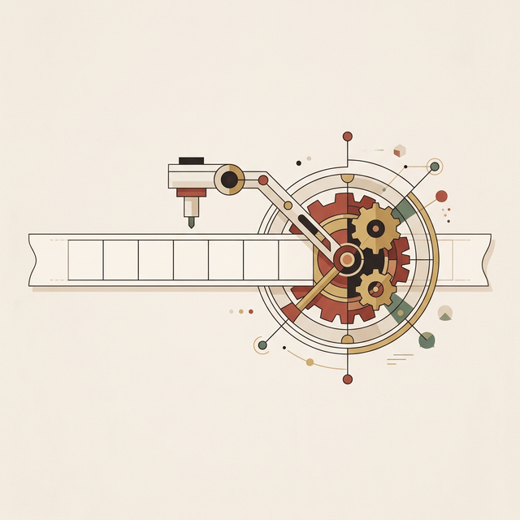
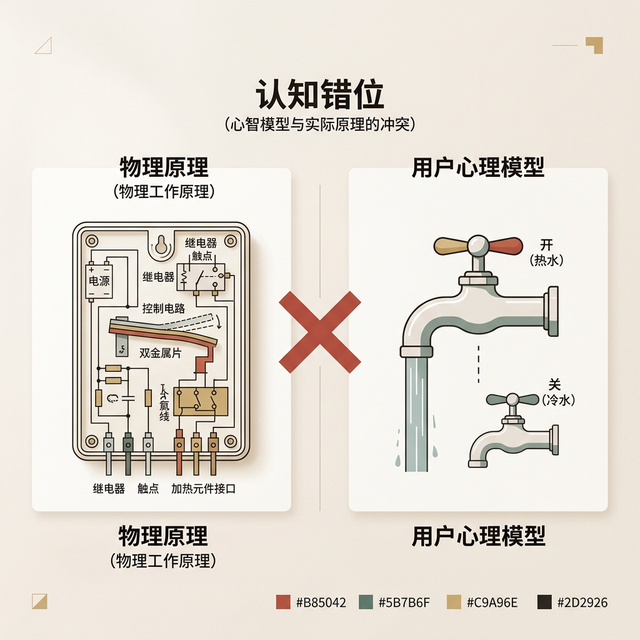
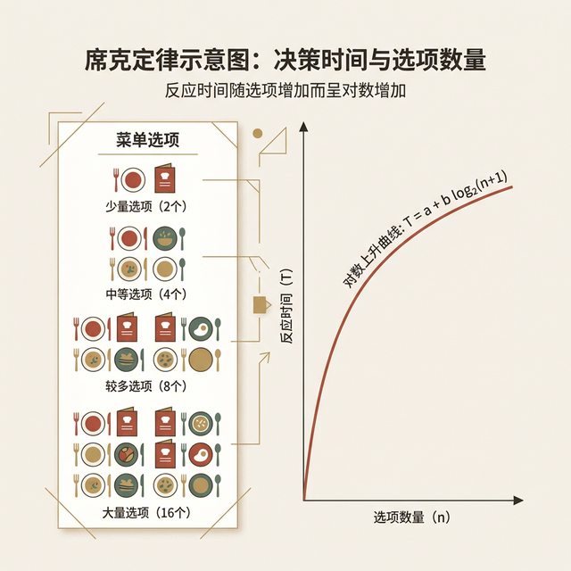
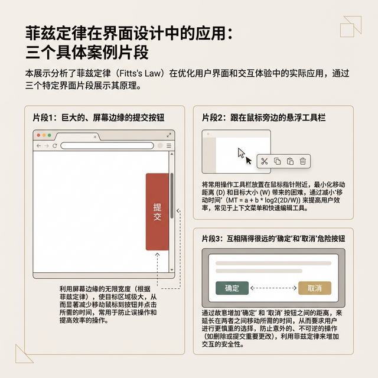
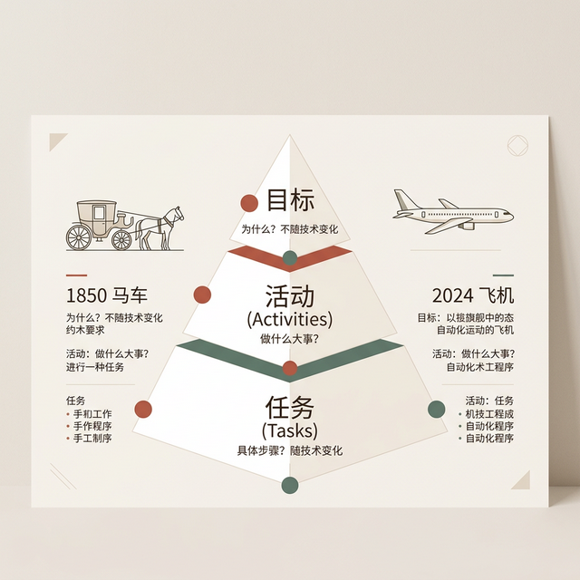
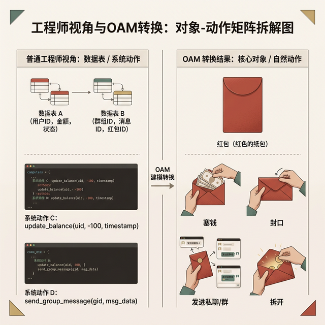

## 模块 3: 破解认知失调 —— 重要的三大模型 (约 35 分钟)
<!-- BUDGET: 6300 chars | SLIDES: ≥12 | STATUS: done -->

### 3.1 模型分野：常人与机器的鸿沟
> [VISUAL]
> **Slide**: W01_S03
> **Layout**: `Flow`
> *   **Asset**: 
> **Scene**: 一个三环交叉的文氏图或者阶梯图：工程实施模型 (底部满布生硬齿轮) -> 表现模型 (中间的平滑界面层) -> 用户心理模型 (顶端的大脑结构)。
> **List**: 工程实施模型 (Implementation Model) · 用户心理模型 (Mental Model) · 表现模型 (Represented Model)

数字设计灾难的核心，源头完全归结于认知模型的严重错位。当程序员觉得逻辑完美闭环的功能被抛给目标用户时，往往遭遇惨烈的系统崩溃。要剖析这种错位，必须引入 Alan Cooper 提出的三大心智模型框架。

> [VISUAL]
> **Slide**: W01_S03a
> **Layout**: `Flow`
> *   **Asset**: 
> **Scene**: 三层蛋糕结构解剖图。最底部的基座是裸露的齿轮、集成块与粗糙电线（后台代码）。中层的夹心是一块打磨得平滑的玻璃面板，带有一个可控制的实体滑块（表现模型）。最顶端是一团漂浮的思想气泡，勾勒着简单的抽象图案（用户心理模型）。
> **List**: 后台代码 (底层机制) / 表现模型 (可视界面) / 心理模型 (用户预期)

位于整个系统物理最底层的构架是**工程实施模型 (Implementation Model)**。它反映了代码真实的存储状态和数据结构。对于一台网络资源共享服务器，后台代码呈现为复杂的树状遍历目录、各类协议指令与布尔权限位掩码。掌握这种模型需要极为深厚的技术背景。

而在结构的最顶端，存在着**用户内化预期 (Mental Model)**。这是普通大众凭借早年生活经验，对某个设备如何运转所抱有的刻板预期与信仰假设。在一位习惯于纸质办公的行政人员脑中，云端存储盘的默认观念就是一个位于天上的无底洞抽屉，它不需要建立文件夹层级，只需要把照片放进去就能永远保存。脑内逻辑具备一项致命的属性：**它在学术上甚至不需要保证真理上的正确性，只要它能应付日常操作的推演即可。**

> [LIFE CONNECT]

> [VISUAL]
> **Slide**: W01_S03b
> **Layout**: `Split`
> *   **Asset**: 
> **Scene**: 影院放映系统真相解构。左侧剖析放映机的机械转轴，详细标注"每秒 24 帧静止胶片叠加全黑无痕切割间隔"（后台代码）；右侧则是沉浸在无缝战斗场面里的观众，大脑认为自己看到的是"真实连贯的时空动作"（心智图景）。

Alan Cooper 在专著中引入过数个绝妙的物理类比来揭示这种错位。观赏电影的过程即是对内化预期的完美利用。电影观众在漆黑的放映厅内，大脑接收到的默认观念是“一段连续时空中发生的真实运动”。由于人类视觉驻留效应的存在，这个模型在感官上逻辑自洽。但其背后的工程实施模型却是胶片机以极快的速度更迭静止的照片，并在每一帧之间穿插了一瞬间的纯黑快门遮挡。如果向观众强行暴露那一片片机械的死黑间隔，观影魔术便会立刻破碎。

> [VISUAL]
> **Slide**: W01_S03c
> **Layout**: `Split`
> *   **Asset**: 
> **Scene**: 电力网络输送流。左侧绘制出狂暴的交流电波形震荡图，重点标注"在 1/60 秒内正负极狂乱更迭"（后台代码）。右侧描绘一个插画风格的水龙头连着电线，点亮灯泡，标注"电就如同水管里的储流水"（错误但有用的脑内逻辑）。

另一个普世的案例如出一辙。绝大多数市民坚信，家用电流的作用机理等同于自来水管系统：电流从发电厂的水库出发，沿着电线水管单向奔涌，最终注入发光的灯泡。从量子物理学的工程视角审视，这个比喻简直荒谬绝伦——交流电线路中的电子实际上每秒进行数百次的极性原地往复剧烈反转，根本不存在宏观距离的位移。但这套类似“水压控制”的心智幻觉坚固，人们凭借着这个错误的心智图景，安全无虞地拨动开关，甚至推导出电费计价的数学期望。内化预期的存在意义，纯粹是为了建立在无知状态下的安全操控感。

再比如移动通信网络基站的跳频算法。行人在穿越多个街区时保持高频通话，背后的工程学动作是终端与多个基站进行惨烈的波段重联握手（Handover）。而在民众的心智空间里，只有一句唯一的预设原理：“只要在城里，手机就有魔法连通世界”。如果界面为了标榜技术强悍，在通话屏幕上实时打印出：“警告：正在切断 eNB#1347 基站并发起频率跳转”，由此引发的恐慌感将摧毁体验。

> [LIFE CONNECT]

> [VISUAL]
> **Slide**: W01_S03d
> **Layout**: `Full`
> *   **Asset**: 
> **Scene**: 两张充满时间磨痕的日常照片组合。左半张是电梯内那个被手指戳得几乎掉漆的"关门"按钮，右半张是十字路口红绿灯杆上磨损严重的金属"行人过街"大按钮。中央印着巨大的医疗标记"精神安慰剂"。底部配文："用物理摩擦置换时间焦虑"。

日常生活中还蛰伏着设计者刻意纵容的默认观念骗局。美国残疾人法案（ADA）出台后，严令要求全部电梯的开门悬停时间不得低于法定的秒数警戒线。这使得市面上所有的电梯关门按钮全部被物理阉割，降级为线路反馈的装饰品；同样，主城区极多的人行过街按钮早已被计算机中控接管，与信号灯控制板断连。但民众的脑内逻辑强制推演“敲击带来改变”。当系统剥夺了回馈，焦虑感会瞬间填满心智并引发疯狂的重复砸压。设计者选择保留这些纯粹的“安慰剂按钮”，本质上是在用动作上的掌控错觉去抚慰等待时的庞大时间真空。

这种利用谎言抚慰心智的桥梁，就是位于模型图谱正中央的**交互界面 (Represented Model)**。它就是软件界面最初诞生的缘由。

### 3.2 滑块博弈：系统真相与谎言掩盖

> [VISUAL]
> **Slide**: W01_S03e
> **Layout**: `Comparison`
> *   **Asset**: 
> **Scene**: 物理博弈天平图解。上方：当滑块死命偏向左端（后台代码齿轮代表的真实世界）时，天平严重失衡翻倒，红色交叉标志显现。下方：滑块稳固地靠在右侧（代表云朵与错觉的心智图景端），天平达成水平平衡，绿光充盈。

系统崩溃的本源，全部集中于视觉投射对底层逻辑进行了剪辑的照搬。当程序员掌握 UI 主导权时，他们倾向于诚实地将后端数据库表格以及复杂的调用层深渊裸露给用户。

而造就商业奇迹的交互设计手法，永远是将前台面板强硬地向着用户心理那一端推压，甚至不惜隐瞒掉残酷的系统真相。

出行软件的设计演化展现了教科书级别的操作手腕。普通市民呼叫网约车后，心理预判是“屏幕在用卫星直播这辆车的行驶实况轨迹”。真实情况下的工程坐标漂移则是灾难性的：受制于高频建筑群与林荫遮挡，车辆传回的 GPS 坐标常常是间歇性的闪烁断点数据，如果原样照搬输出，屏幕上的小汽车图标只会在几百米的距离内随机瞬移闪现。设计团队的解题方法是在中间植入精密的前端平滑插值算法。外显表象强行把这些断裂的数据点吸附在地图矢量道路中心线上，并伪造出汽车正在匀速滑行的华丽动效。它用一层温柔美丽的谎言完全掩盖了工程架构的粗鄙，进而实现了人类最渴望的属性——“确定性”。

> [STORY TIME]

早期电子表格工具之所以能够统治财年清算工作，原因在于其交互界面偏差地复刻了人类使用长达数个世纪的纸本账册结构。它刻意回避了让大众学习代码中的矩阵运算协议，只是非常平和地递上一张巨大的带有数字坐标的“网格纸”。这套设计之所以伟大，在于它完全压制了向用户普及编程知识的冲动。

然而，这种掩盖如果切断了安全报警的神经元链路，必将反噬导致血淋淋的悲剧现实。

> [CASE STUDY]

> [VISUAL]
> **Slide**: W01_S03f
> **Layout**: `Full`
> *   **Asset**: 
> **Scene**: 波音 737 MAX 事故时空全景剖析。画面被割裂为三等份：顶部是飞行员满头大汗坚守的"旧版稳定 737"心智预设；中部是充满谎言欺瞒的系统仪表盘（绿灯诡异常亮）；底部深海处则藏着名为 MCAS 的工程代码巨兽，正伸出扭曲的机械臂将整架客机的迎角拼命拉向地面。"认知断层引发的连环劫难"。

这其中最为惨痛的教训铭刻在航空史上。波音 737 MAX 客机曾两度在起飞阶段失控坠毁，共带走 346 人的呼吸。灾难的核心元凶名为 MCAS（机动特性增强系统）。由工程迭代产生的较大引擎安装位使得机体存在轻微上扬的致命性失速隐患，MCAS 被设定为在临界点自动反向压制机头进行动态修复。
为了降低高昂的飞行员换代培训费用预算，波音做出了饶恕的决策：他们在这座飞机的视觉投射（飞行管理界面与操作手册）中，生硬地切除了所有与该系统相关的提示信息。驾驶员在内化预期层面认定自己驾驭的仍旧是完全服从人力干预的上一代老款机型；而当迎角传感器发生罕见的单点硬件故障时，沉睡在代码深处的 MCAS 被错乱唤醒并进入死循环，疯狂下拉机身。驾驶舱仪表盘上的前台面板一片死寂，既不报警也没有告知故障源头。机长在绝望的几分钟内，同由于参数错误而失控的幽灵后台代码展开了胜算的肉搏战。这种外显表象为了商业利益蓄意欺骗操作者心智的行径，被定性为航空工业史上最恐怖的丑闻。

> [CASE STUDY]

> [VISUAL]
> **Slide**: W01_S03g
> **Layout**: `Split`
> *   **Asset**: 
> **Scene**: 赛博空间史诗级事故。左侧：一行极为简素却致命的指令流代码正悬停在黑色纯净终端窗口（脆弱且暴露的交互界面）。右侧：如多米诺骨牌般轰然塌陷的美洲大陆数据中心群像，大批互联网独角兽公司的标志被滚滚黑烟吞噬。"单键敲击导致的亿级美元灰飞烟灭"。

极客崇拜的命令行世界也发生过同等的惨剧。2017 年春天，亚马逊 AWS 的维护人员在剔除老旧服务参数时，由于命令行终端薄弱且过分透明的视觉投射设计——它丝毫没有提供防呆拦截弹窗即执行了批处理删除——致使数个关键底座的路由群集被连根拔起。引发的大面积熔断使得硅谷乃至全球的企业级应用陷入超四小时的死寂。AWS 的工程师由于自身的基础设施被毁甚至需要登录外部社交媒体通报事故。当前台面板直接将缓冲带的工程接口暴露给碳基生物的脆弱手指时，灾难降临只是一个随机事件。

与之形成高度强烈对比的，是对用户心智有着保护机制的代码巨兽封装。

> [CASE STUDY]

> [VISUAL]
> **Slide**: W01_S03h
> **Layout**: `Flow`
> *   **Asset**: 
> **Scene**: 漏斗式超级黑箱过滤演示。上层塞满了海杂乱无章的全球百万用户操作记录节点、隐晦诡谲的波形卷积神经网络图层架构（庞大的深层后台代码）。所有复杂信号经过高速漏斗的挤压聚合，在最底层产出一张拥有美丽圆角、伴有轻缓微光动画的矩形卡片（精巧的表现界面）。

流媒体巨兽 Spotify 每段周期的推荐算法清单。用户的心流模型单纯线性：“这个软件的编辑部门很懂我的音乐品味”。而在硅谷冰冷机房内运转的，是消耗算力的三阶交叉引擎：首层抓取百万级用户的听歌交点绘制协同矩阵，二层下达自然语言处理探针在茫茫语料库中啃咬所有相关的曲风分类词条，最底端辅以深空探测级别的声学波形剖析。这三股生硬的数据洪流交汇后，在最终展现在用户手机上的外显表象中，被精炼缩影为一张简洁的周推榜单矩形卡片。残酷复杂的数字博弈逻辑，被温情脉脉的极简图层锁死在幕后。

**(Pause: 3s)**

### 3.3 纵深切除：目标与任务的决裂

弄懂了模型对齐，就必须掌握如何切入战场。大多初登门道的人在获取开发需求时，惯性发问总是：“您当前分为哪几步操作任务？”随即展开对于传统步骤的粗暴上色与排版。

Cooper 在长达三十年的布道中严厉训诫：**执行任务（Tasks）注定会被新的材料技术碾碎，但底层渴求的核心目标（Goals）将在历史中永生。**

从美国西部拓荒史借用一段经典剖析：早期拓荒者想要携带家属穿越蛮荒危险的中部平原，他们唯一的底层防线**目标**是舒适无损地跨越地理横沟。而在当年受制于简陋的工业水平，他们被迫分配出诸多沉沉的生存**任务**：操控驾驭野马车队、修理轮毂、在腰间挂满重型火器。一百七十年过去，重重跃升的技术推陈出新，如今乘坐飞机横越大陆的旅客依然秉持相同的舒适安全目标，但在安检机前，必须丢弃武器才能登上机舱。目标从不褪色，变异的仅仅是执行它的手部动作。

> [VISUAL]
> **Slide**: W01_S04
> **Layout**: `Flow`
> *   **Asset**: 
> **Scene**: 金字塔式目标拆解阵列。顶层红色图块"目标 (Goals)"高亮闪烁，标注"改变的生存需求内核"；中层分出多个"活动 (Activities)"区块，标注"跨越时间维度的策略"；最底层铺开庞大复杂的暗淡碎块"任务 (Tasks)"，标注"极易被自动化程序接管抹除的体力劳作"。

**不要优化垃圾任务，直接切除它们。**

陷入微观操作狂热的设计师必然掉进一种名为**局部最优解**的陷阱。福特汽车的破局史完美印证了这种分野的破坏力。在纯粹内卷化的“优化旧任务”路径下，设计团队得到的市场反馈将是单一的痛点：“要求一匹冲刺速度更快的猛马”或者是“研发减震系统更柔软的皮草鞍座”。这种通过拿着秒表蹲守在街角记录扬鞭频率的低级努力，最多研发出一种由基因突变和畸形杂交诞生的怪物坐骑。
福特的革命性成就在于他切断了与那些古板饲养任务的情感纠葛。一旦眼睛钉在“获得更为极速平稳的点对点空间跳跃”这个底层目标之上，解决方案的维度瞬间被拉扯升维至：**消灭活体动物动力系统，引燃燃烧室制造纯机械冲压引擎。最好的交互并不是把点击动作优化到 0.01 秒的极限，最好的交互是让冗长繁琐的审批动作完全失去存在的物理意义。**

> [VISUAL]
> **Slide**: W01_S04b
> **Layout**: `Comparison`
> *   **Asset**: 
> **Scene**: 演化树对抗假说。左侧："优化旧任务路径"演化出的生物兵器，一匹装载了重型外骨骼装甲和履带四肢的恐怖半机械马匹。右侧："穿透抵达新目标路径"，一台造型冰冷简素且纯粹由钢铁浇筑的第一代流水线黑皮福特四轮汽车。

转移到当代最惨烈的数据战争中观察：十五年前的银行业曾发动过大规模服务效能跃进战役。沿用以执行任务为导向的老旧打法架构，各大行拼命下发极具诱惑力但治标不治本的技术补血手段：比如将汇款表单中的填写墨迹栏位横向拓宽两倍、引进吐钞效能翻倍的重装进口点钞仪床、或在接待窗口安置大屏自动发声排队仪。这依然在让那套腐朽的流程变快。

直到移动支付巨头的横空出世用极具暴力的底层切口斩断了全链路神经：民众想要把账户数字所有权发生实质转移的底线目标，根本就不必须受限于肉体抵达物理银行大堂这个荒谬前提。在极快的光谱通讯下，所有的填单排号任务被化为空白，仅在聊天面板内输入特定数学额度配合面部光感采集就能收讫。

> [PHILOSOPHY]

洞穿现象的同时还须严密的审慎探微。那些最为真实强悍的驱动目标，往往被深埋在道德或社会伪装之下潜藏着。在商业重案里，普通基层会计人员挂在嘴边的实用级伪装目标总是声称需要“飞快地对数入账节约公司生命”，但他在执行系统转换时不为人知的核心私域目标却阴暗尖锐：“凭借这套他人甚至极难掌握的高难系统，锁死自己在这间公司的位置防备失业危机”。

> [CASE STUDY]

在定性需求诊断会议上，优秀的主导者应当时刻自我确认为一名经验十足且杀伐果断的神经外科名医，而非街角餐馆服务生。当一位高呼腹部断裂并哀求切去阑尾的成年患者就诊时，即便他能依靠搜索引擎滔滔绝口报出无数医学词条和切除偏门处方，真正主刀的巨擘依然会无视其自主药方，重新进行系统性彩超排查乃至最终断定这不过是一场急性浅表胆汁分泌紊乱。**让用户放肆倾倒挫败和痛苦的情绪，但冷酷收缴他们开列功能清单以及强行勾画页面草图的权利。那些极具创造性的全自动化手术切口设计方案，完全归属于你们自身的职业护城河。**

**(Pause: 3s)**

### 3.4 对象矩阵：OAM 降维重塑隐喻

为确保那些完全未曾涉猎终端底层逻辑的小白人群，能够在短促的时间节点内驯服复杂系统，全球通用准则就是去现实维度暴力开采极具共识的**隐喻素材**。例如系统文件夹背后的牛皮纸袋色彩图腾、车载系统的机械表盘高光边缘。

> [STORY TIME]

外星视角的跨界实验往往被拿来彰显这套技巧的不二法门。当你处于完全割裂常识的新生降临状态，偶然迈进地球居所并目睹角落停放的一组戴森无绳设备：一根具有强悍承重比例の钛合金长杆，端部带有凶狠旋转的轮状尼龙硬刷，而握持手柄内测暗藏了一枚充满红色杀戮预警的深凹弹簧扳机。仅仅依靠着这些生猛强劲的“物理属性引导”，操作概念瞬间完成全脑构建。而反观当前主流粗糙制式的控制应用面板，在一堆扁平化的惨淡四边小框和横向线条中，物理惯性重力可以被利用做判断之锚。正是这种纯粹由数字硅胶倒模出来的缺失地带，依赖设计师将门闩、齿轮、翻页这类重工业时代的刻板印象借用过来填补黑箱鸿沟。

> [STORY TIME]

而最为封神的移动端动作定调，莫过于 2007 初代操作系统的“一侧单向滑动重组”开界屏障。如何有效阻止深色口袋里的织物剧烈摩擦引发屏幕乱码崩溃，同时确保零教育成本的触达？复古的弹簧门栓力学轨迹被直接临摹写入底层代码，一条流淌着金属高亮的拖块横条便由此定格。它不仅仅防范了风险，更利用廉价安全的拟态滑入成功地使得数亿计的老年弱势人群完成智能时代的跨域。

当这股复古狂热泛滥时，过度延伸的隐喻便会沦为束缚生产力攀升的囚笼。在后续更迭中被迫全面下架的质感皮草手帐界面便是深刻教训。当工具属性急需处理远超单页纸面规模的巨量数据交叉引用之时，原本亲和的“纸质撕裂动画”和“仿真皮革缝线边距”，就变成了浪费电子屏幕像素的累赘废料。

面对即将启动的小型破局实战（Exp1），所有极易被理工科逻辑框死的初次下海选手往往会在草图本上无脑复述数据工程师那些乏味的动作指令表（“新建数据查询视图”、“发起远程写入回调请求”、“渲染表格表单元素”）。

为强行终止这种灾难性的工程师思维辐射，工业界在此引入一套极具实战暴力重构作用的两栖模型工具：**对象-动作矩阵 (Object-Action Matrix, OAM)**。它最直接的功效就是过滤掉一切伪劣的技术残留杂音，精准提炼出那些属于原生受众的情绪原语。

**OAM 铁血重建法则：**
1. **深度筛查提取原生物件 (Objects)**：冷静地剪去任何属于机房架构体系内的词汇。在一名农村务农老人的感知图谱里，根本不存在什么被归类的流媒体音频序列，只存在“这本磁带”以及“那堆曲谱”。
2. **排列人类生理动作清单 (Actions)**：基于刚刚提取出来的坚固心理实体，人们在脱离数字枷锁下如何盘弄它们？绝不应该是“调用擦除函数命令”与“生成并列复制镜像”，而是充满了肉体动能的“搓开碾碎”、“叠在一起并打包”。
3. **强制降维锚定界面输出**：在画板内强迫视觉重心完全围绕刚刚产出的实体与野蛮动作铺垫。页面层级和热区必须是对物理把玩状态的最佳平替反映，而不是堆砌生硬的菜单栏和感情底色的纯净列表。

> [VISUAL]
> **Slide**: W01_S04c
> **Layout**: `Split`
> *   **Asset**: 
> **Scene**: 除夕夜跨江抢夺狂潮的数据与情绪分野。左侧展现的，是不夹杂任何情感色彩的金融核算终端列表，死板陈列着诸如用户序列编号与带小数点的交易流水明细。右侧骤然爆发开来的是一幅充满节庆视觉冲击力的 OAM 重组拼盘图表。
> **List**: 冷血极光工程师视角：云数据库 Transaction 底层并发锁 / 金融数据插入表头更新与超额对赌拦截 / 无情感的 Submit 回执执行端 | 热血 OAM 视觉轴心重铸体系：纯粹的包裹信物（深红色喜庆纸质口袋） / 充满人类原始占有欲与炫耀心理的操作矩阵：偷偷塞入本金制造盲盒迷雾、猛烈地掷入深不见底的群聊网络之中、屏住呼吸执行揭开封条以及极具挑衅意味的晒单窥探行为。 

将这段 OAM 执行口诀应用在一个曾经掀翻全球转账业务版图的本土巨兽模块上——**全中国每年春节狂欢的红包大战**。

这本是一场枯燥艰涩的小额账户结算迁移项目。倘若交办给金融安全组的老派工程师开荒布局原型图谱，在严格的并发结算机制压迫下，你们极可能会面对一张刻有收款对方精准账号、需要录入防盗凭证后在倒计时读秒中确认“汇款移交”这等刻板至极的转账表单。整个交互循环极尽紧绷与疲乏。

然而负责破格突围的设计长官依靠了本土深厚的情绪沉积场，做出了绝杀性的模型替换阵列：
*   **提取核心对象斩断金融底色**：剥离掉冗杂冰寒的账户账本数字幻觉，在屏幕前唯一树立起的心理神像，就只是那一封由红纸浆折叠而成的过年信物——**纸质实体红包**。
*   **还原情绪裹挟下的狂热拆解动作**：丢弃汇入划出的财务口令。提取出的执行阵列充满了癫狂的多巴胺狂热行为：**隐秘包裹**（蒙蔽真实的金额底线创造刮刮乐般的饥饿赌徒感）、**随性抛洒**（将实体化为复数投掷进庞大的网络群落之中发酵）、那充满无限快感的一击致命的核心动作——**狂暴拆封**，以及随后滋生的极易引发流量指数级爆裂传播放大的阴暗嫉妒窥探（“去看看大家到底顺走了多少”）。
*   **重塑前端呈现形态与动效交互体验层**：这套暴力推倒重建的神级矩阵模型最后凝结出的果实便是在一堆杂乱无章的聊天瀑布流气泡里那引诱你去刺戳把玩的金黄大圆币按钮伴随着厚重年味的深红封套界面。当你指尖点落下去的时候你并不觉得自己是一个无聊按着冰凉确认协议的打字机器，你就是在这个赛博纪元时空里用力扯开了那个极具悬念感和金钱气味的纸质小信封。

这场被无数后来者拆解复盘的伟大功能模块完全不是单纯依靠堆叠高可用集群和网络通讯层代码做到的，它就是因为一个绝顶天才班底残暴果断地砍掉了枯燥的后台代码外露展现，随后在默认观念土壤最肥沃的地方重重拍下了一张经过精密推演的 OAM 卡牌。这告诉了以后在座的每一位学子，不要在功能逻辑堆砌的死路上走到黑发疯，回到活生生的人性泥坑里去重新挖掘那些深埋在地下的对象与人类纯粹动作。

> [ACTIVITY]
> **Type**: `Practice`
> **Duration**: `课后延展`
> **Desc**: 重绘极危边缘人群之暗号解构实录
> 各特遣小组散会后就地选择本校周遭被严重遗弃老去的公共设施（譬如残喘艰难呼吸的城中村自助取款报备旧机台或者布满灰尘的老旧办事处叫号打印总机）。将其后台的那些残忍如锯齿般的工程控制指令树图谱一一残忍描摹出来！接着带入到那位视力衰退手抖无力的老人视角之中，重新利用 OAM 模型构建一套以"破损眼镜"和"颤抖推纸"为对象的全链路新防御阵型设计蓝图隐喻草稿，并在下一周开启课堂的初期进行强制宣发汇总！

---
