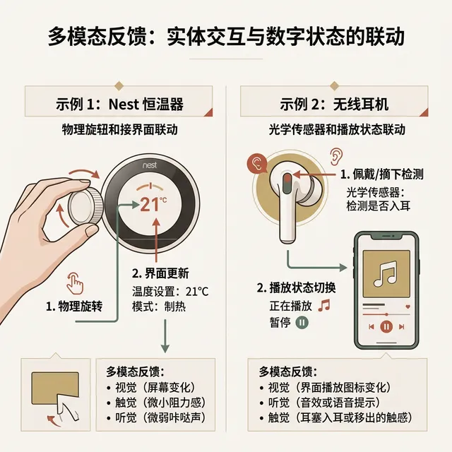
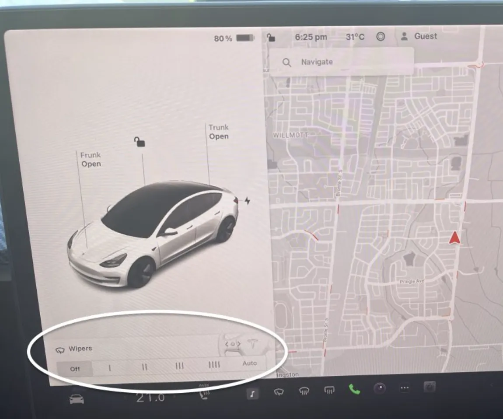
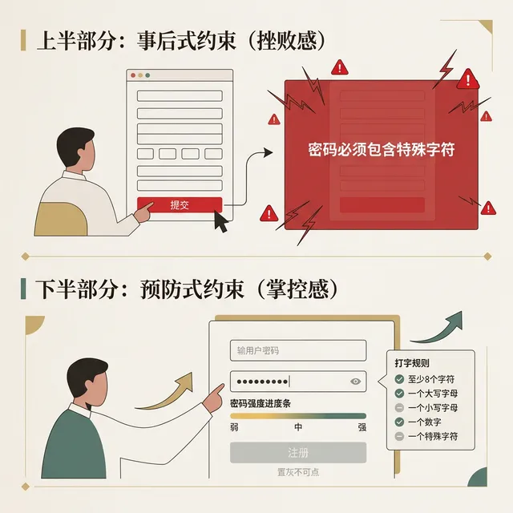
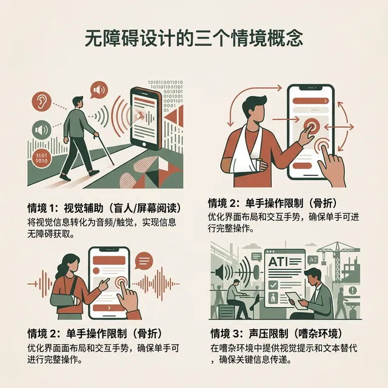

## 模块 4: 防止摩擦的五把武器：设计原则 (约 25 分钟)
<!-- BUDGET: 4500 chars | SLIDES: ≥10 | STATUS: done -->

理清了心理模型，下一步需要动用战术维度的准则来打造表现模型。在此开篇，我们需要先在脑海中建立一个关键的双层认知框架：

> [TEACHING MOMENT]
> **设计内功与排雷标尺的界限**
> 很多初学者会将本讲的**“防止摩擦的五大原则”**与后续经典工程标准**“Nielsen 十大可用性原则”**混为一谈。请大家务必记住这个时序定位差异：
> 1. **设计时的“内功心法”**：Yvonne Rogers 总结的防摩擦五原则（即本节课，聚焦可见性、反馈、约束等）是基于人类认知的心理学防线。它是你在面对一张白纸、**想从零构思**一段交互链路时的底层思维模型。
> 2. **上线前的“排雷标尺”**：而我们将在课程末期（W12 启发式评估）实战操练的 Nielsen 十大原则，则是一套严密的质检清单（Checklist）。它是等原型画完大半后，用来给系统界面**体检找茬**的手术刀。
>
> 简而言之：**五原则教你如何“生出”一个健康的系统，而十大原则教你如何测出系统界面的“隐疾”。**今天，我们先来掌握这五把防身的底层武器。

### 4.1 感官捕获层：在玻璃基底上重建物理维度的交互映射

#### 4.1.1 彰显可见：暴露关键系统状态的多维线索

> [CASE STUDY]

> [VISUAL]
> **Slide**: W01_S05a
> **Layout**: `Image`
> *   **Asset**: 
> **Source**: Generated Realism (Based on Scene)
> **Text**: 指示匮乏：被惩罚的不仅是系统更是尊严
> **Scene**: 机场自动感应水龙头特写，一个困惑的旅客手持满是泡沫的双手，正试图去拧动一个完全没有接缝的平滑金属装饰头。旁边打上一个巨大的红色问号。

在讨论极简主义之前，要直面一个现实的设计灾难。Cincinnati 国际机场的卫生间曾部署了一批全金属的自动感应水龙头。从卫生防疫角度看，非接触式设计完美规避了交叉感染。但在真实环境里，大批旅客站在洗手台前，根本无法判断水龙头是自动开启的。他们用力扭动那个不具备机械结构的顶端装饰头，甚至弯下腰去水槽底翻找隐蔽开关。这场闹剧的根源在于：水龙头的**外观抹除了触发动作的物理线索**。设计者未能将“将手掌平放入感应区”这个操作门槛可视化。这就是可见性为零的极简设计。

可见性原则定义了交互的第一道门槛：**重要的操作入口、警示状态必须显而易见**。假设一个涉及高额资金转移的确认按钮，被深深折叠在汉堡菜单的第三层。又或者，某个关键的后台任务正处于错误状态，前台却没有任何警告灯。面对这种界面，用户就像在操作一台断电的黑箱机柜。所有的操作都会陷入瞎猜的恐慌。可见性原则不仅是设计的底线，更是工程界质检的铁律。在后续 W12 周我们将展开实战的 Jakob Nielsen 十大评估清单中，位列第一项的正是“系统状态可见性 (Visibility of system status)”。当用户把信用卡插入 ATM 机时，屏幕上面哪怕仅仅是一个旋转沙漏，都能极大地舒缓操作者的吞卡焦虑。

> [DID YOU KNOW]

> [VISUAL]
> **Slide**: W01_S05b_Audio
> **Layout**: `Full`
> *   **Asset**: 
> **Source**: YouTube / JR東日本 駅ホーム盲導鈴（鳥のさえずり）
> **Duration**: `0m15s`
> **TimeCategory**: `lecture`
> **Scene**: 采用原声音效的短视频片段：展示视障人士在日本 JR 车站通过不同鸟鸣声（夜莺/布谷鸟）辨识楼梯入口的盲听导航环境声场录音。
> **Text**: 听觉导航：JR 车站盲音系统

当我们把音频作为“环境基石”时，这种设计就打造了极致的**听觉示能与空间可见性 (Sonic Signifier & Visibility)**。现实中最为顶级的应用，存在于**日本铁路系统 (JR)** 强大的**地下空间听觉导航系统 (Sonic Wayfinding)**。
东京地铁利用鸟鸣声，对不同形态的月台进行**坐标标定**。由于声音是持续循环播放的——对于开敞的岛式阶梯口播放“草地鹨”，而对于封闭型侧式阶梯口则播放“夜莺”——这意味着乘客不需要发生任何“交互触发”，系统便主动跨越了死板的视觉维度，向他们展现了地下空间的物理拓扑。这打破了视觉中心主义，向我们展示了最极致的空间状态可见性（Visibility）设计。

**(Pause: 3s)**
#### 4.1.2 反馈回执：构建多模态跨维度的即时确认

> [VISUAL]
> **Slide**: W01_S05b
> **Layout**: `Split`
> *   **Asset**: 
> *   **Asset (AI fallback)**: 
> **Duration**: `0m08s`
> **TimeCategory**: `lecture`
> **Text**: 感官反馈：填补数字的冰冷黑洞
> **Scene**: 左侧：刀刃切开硬面包的特写，标注三种感官输入（视觉：面包屑掉落；听觉：刀片摩擦硬壳的咔嚓声；触觉：刀柄传递的物理阻力）。右侧：缺乏反馈的数字黑洞，用户按下一个响应波纹的纯灰按钮，头顶冒出问号。
> **List**: 物理界的多模态即时反馈 / 屏幕界面的单一黑洞

与可见性伴生的第二项要求是**反馈 (Feedback)**：系统必须对用户的每一项动作回执一张即时的感官确认单。
> [LIFE CONNECT]

回忆物理生活中用厨刀切片面包的过程：刀尖刺破面包硬壳的脆响（听觉）、刀身切入面团引发的粘滞阻力（触觉）、切割线产生碎屑崩塌的画面（视觉）。**操作者的中枢神经在毫秒内接收了这三组数据。它会瞬间判断出“切割已生效”。**

> [VISUAL]
> **Slide**: W01_S05b_Intro
> **Layout**: `Image`
> *   **Asset**: 
> **Text**: 反馈回执的必要性
> **Scene**: 概念示意图：抽象展示用户动作触发后系统给出的即时感官确认过程。

然而到了初代 iPhone 的玻璃触摸屏上，一切物理颗粒感被绝对抹平了。当用户按压屏幕上的某个色块时，情况截然不同。如果界面没有产生色彩瞬变，没有马达震动，也没发出提示音，用户就会瞬间坠入完全的交互真空状态。
**这种反馈黑洞不仅是技术缺陷，更是一场心理折磨。**当你对着电话另一头说话却得不到任何回音时，巨大的不确定性会瞬间拉升你的认知焦虑。在界面交互中，仅仅哪怕超过 400 毫秒的视觉死寂，都会激发使用者的“战斗或逃跑”本能——这直接引来了**用户的猛烈连续狂点**。他们试图用物理暴力来唤醒系统，而这通常会导致系统指令队列无限拥堵，**最终让死机崩溃变得不可避免。**

> [TEACHING MOMENT]

在这里，必须纠正数字媒体艺术专业同学常犯的视觉中心主义。在界面反馈系统中，**声音（Audio）**拥有超越视觉图形的穿透力，应当被视作交互设计的指挥棒，这被称为**听觉示能 (Sonic Affordance)**。

1. **物理材质的数字投影**：在 macOS 将废弃文稿拖入垃圾桶的那声干脆的“揉废纸声”。这就是在用隐喻警告用户发生着破坏性操作。假设你设计了一款复古打字机 App。它的键盘音必须是厚重的机械咔嗒声。如果错用了高频的电子哔哔声，用户的心理防线就会瞬间出戏。
2. **负面约束的声带**：当用户执行了被禁止的越界动作时，系统未必需要弹出刺眼的红色警告框。只需配以低频、沉闷的撞击音效即可。这种设计不挤占任何屏幕像素。它极其温柔地传达了“此路不通”的物理边界。

> [ACTIVITY]
> **Type**: `Practice`
> **Duration**: `5min`
> **Desc**: 盲听挑战：声音隐秘的操纵逻辑
> 讲师播放 3 段经典数字产品音效（Windows 报错音底噪、Slack 活泼的消息提示音、特斯拉低频锁车声）。
> 要求学生完全闭眼倾听，并在纸上快速作答：
> 1. 这个音效的频率和质感暗示了何种物理材料属性？
> 2. 它在系统可用性指标中投射了哪种状态（警报、成功确认还是安全保护）？

#### 4.1.3 幻象示能：利用视觉谎言搭设物理操作桥

> [VISUAL]
> **Slide**: W01_S05e
> **Layout**: `Full`
> *   **Asset**: 
> **Source**: Vox - It's not you. Bad doors are everywhere.
> **Duration**: `1m08s`
> **TimeCategory**: `activity`
> **Text**: 诺曼门幻象
> **Scene**: Vox 视频片段摘要：Don Norman 解释了何为设计中的“示能”失败（诺曼门），视频生动展露了由于不当的金属把手导致无数人反复推拉碰壁的滑稽却写实的困境。

我们频繁使用**“示能 (Affordance)”**一词。它特指物体原生构造所暗示的操作方式。装有平推面板的门，天然只接纳手臂前推的动作。而深邃凹陷的门把手，则在无声引诱你去紧握与向后拉扯。

唐纳德·诺曼在此进行了无情的打假。他指出：在绝缘玻璃封装的智能手机上，**根本不存在真实的物理示能**。屏幕本身的物理特性，仅仅允许“手指摩擦滑动”。

智能手机时代早期，设计师依靠特效来拟物。那些仿立体高光、悬浮阴影和点击内凹的效仿，全部属于人为虚设的**“示能信号 (Signifier)”**。我们试图用高明的视觉谎言，在二维玻璃内搭建出一座伪 3D 的交互吊桥。

要搭建起这种安全感，必须遵从保罗·菲茨定律 **(Fitts's Law)**。它指出：到达目标的时间，与距离呈正比，与目标截面积呈反比。结论很通俗：按钮越微小、距离目光越远，我们点击它所花的时间就会指数级膨胀。

> [VISUAL]
> **Slide**: W01_S05f
> **Layout**: `Image`
> *   **Asset**: 
> *   **Asset (AI fallback)**: 
> **Source**: 真实评测截图 / Fair Use (UI Critique)
> **Scene**: 真实场景截图：初代 Tesla Model 3 中控大屏UI。在驾驶员靠近方向盘侧的屏幕底部，显示一个极其细小且密集的雨刮器调节面板（Wipers Menu）。在整个宽大的屏幕中，这个原本救命的高频物理按钮被压缩成一块微缩触控区，直观展现了违背 Fitts 定律产生的高昂交互成本与盲操危险。

这就解释了初代 Model 3 遭遇巨大安全争议的核心：它在设计上彻底击穿了 **Fitts 定律的安全阈值**。设计师将雨刮这一高频保命功能，降级为中控屏底部一个极微小的像素触控区。根据该定律，目标越小、距离视线越远，点击时的“瞄准时间”就越长。在时速 120 公里的暴雨高速上发生倒计时效应——原本依靠物理拨杆只需 0.1 秒的“肌肉盲操”，被迫变成了数秒钟的“精确视觉瞄准”。为了点击这个光斑，驾驶员被迫交出了前挡风玻璃的视觉专注力。长达数秒的低头注视，意味着汽车在盲开数十米，这直接导致了原本可以避免的追尾惨案。

> [DID YOU KNOW]
> **诺曼 (Don Norman) 的概念纠偏**
> 很多人不知道，在第一版《设计心理学》中，Norman 其实只提出了“示能（Affordance）”。但他很快痛苦地发现，全世界的设计师都在滥用这个词——他们把屏幕上画出来的一颗假按钮也叫作“示能”。
> 为了纠正这个根本性的错误，他在 25 年后的修订版中，刻意引入了“示能信号（Signifier）”一词。他郑重澄清：在那块极其僵硬平滑的玻璃触摸屏上，无论你把按钮的高光和阴影画得多么逼真，它都根本不具备物理学意义上的“按压示能”。那些全都是人为画给眼睛看的“示能信号”而已。这也是为什么在涉及盲操等硬核场景（如 Model 3 雨刮）时，无论 UI 信号画得多漂亮，依然无法取代实体物理拨杆的原因。

> [ACTIVITY]
> **Type**: `Practice`
> **Duration**: `课后延展`
> **Desc**: 虚构表象大搜捕（诺曼门鉴定）
> 课后进入各位手机中最为冷僻的一档应用。在深层菜单区截屏 3 处采用了"虚假示能"（例如伪装成文字的无法点击按钮图层）或包含"被剥夺可见性"（隐藏极深滑动动作）的设计事故，辅以标红重写改进策略，于下周课堂前归档提交。

### 4.2 系统防御层：利用底层逻辑规则严防致命性操作崩溃

#### 4.2.1 物理约束：利用防呆机制封锁逆向误操作

即便提供了充分的提示音与高可视化的按钮，根据 2012 年 的人机工学报告，人类在疲劳或信息过载状态下依然会做出致命的逆向选择。设计者被迫切换防线，使用物理与代码的双重屏障。

> [VISUAL]
> **Slide**: W01_S05c
> **Layout**: `Comparison`
> *   **Asset**: 
> **Text**: 事前预防与事后控制
> **Scene**: 上半区：事后验证惩罚机制（用户全神贯注填完两千字的繁杂注册表单并点击验证按钮后，系统突然触发全屏红框报错提示"密码因未含特殊标点而失效" = 受挫与愤怒）。下半区：前端预防式防御机制（密码输入框悬挂有强弱密码指示条及规则池，在要求尚未被完全满足前，唯一的提交按钮被铁血锁定为点击的淡灰色 = 安全可靠的控制权转移）。
> **List**: 事后惩罚带来的高昂挫败感 / 事前拦截实现的平稳控制权过渡

**约束 (Constraints)** 能够将非法操作扼杀在触发之前。Yvonne Rogers 将其划为两条不同的路线：**预防式约束**始终具备着压倒性优势。比如在日期选择时，系统可将“二月三十日”直接置灰。这便从源头上抹除了荒唐的输入。相反，**事后式约束**则是怠惰的开发表现。它放任用户在错误的道路上跑完全程。最后再以醒目的弹窗粗暴干预。

> [CASE STUDY]

约束原则起源于硬核的工业生产。丰田汽车的新乡重夫将其提炼为 **防呆设计 (Poka-yoke)**。
来看你手边的电脑配件。主板 CPU 插槽以及显卡供电线，都统一塑造了**不对称的梯形缺口**。这个形状就是一道防呆封印。不管工人注意力多么分散，只要装配方向倒置，针脚就绝对无法插入。我们在制作前端页面时也是如此。把缺乏前置条件的按钮直接隐藏或置灰，这就是信息时代的**顶级防呆机制**。
必须深刻理解“预防”与“惩罚”在心理学上的天壤之别。事后报错（惩罚）要求用户必须中断当前的心流，耗费巨大的认知资源去阅读那两段冰冷的红色报错小字，并充满挫败感地从头重来；而事前置灰（预防）则是一场优雅的降维打击。它像一位无声的向导，在用户还没来得及犯错之前，就已经极其温柔地封死了通往深渊的所有岔路。**卓越的约束设计，往往让用户根本意识不到自己曾经被拯救过。**

#### 4.2.2 机械一致：维持操作惯性触发心智盲巡航

与物理层面的约束协同作战的，是认知层级的**一致性 (Consistency)** 原则。
在成熟的平台设计中，相同概念的操作模型应当保持**机械式的复刻**。假设深层页面的“返回”在左下角。但一进设置页，它却突然跳到了右上角。这就是严重的**一致性崩塌**。
这涉及到了**双系统理论**。人类在处理熟练任务时，完全依赖条件反射的“**系统 1**”。只要交互链路保持外部与内部一致，大脑就不需要唤醒极为耗能的“**系统 2**”。这种一致性至关重要。它能确保用户在**心智盲跑**状态下，依然操作如飞。

### 4.3 伦理双面刃：从蓄意榨取的欺诈陷阱走向拯救边缘的极致包容

#### 4.3.1 暗黑侵袭：利用系统一致性漏洞劫持选择

当一致性逻辑被用于榨取用户剩余价值，约束原则用作设下陷阱的藩篱，一个罪恶的设计产物便诞生了——**欺诈套路 (Dark Patterns)**。这也是所有数字媒体从业者必须高度警备的行业恶习。

> [VISUAL]
> **Slide**: W01_S05d
> **Layout**: `Full`
> *   **Asset**: 
> **Source**: Techquickie (Linus Media Group)
> **Duration**: `4m29s`
> **TimeCategory**: `activity`
> **Text**: 暗黑模式骗局
> **Scene**: 三个高频暗黑套路案例罗列：(1) 退订黑洞，需要点击五层菜单并撰写申诉理由才能解除连续包月。(2) 偷偷在飞机票账单最底端暗中勾选极难被发现的取消险附加服务。(3) "删除历史记录"操作被设计为接近背景色的灰色小号极微弱文字。
> **List**: 偷装购物车 (Sneak into Basket) / 退订客栈 (Roach Motel) / 视觉干扰 (Visual Interference)

独立设计师 Harry Brignull 将之命名为“欺诈套路”。这是借用人性认知漏洞进行的**蓄意操纵**。图表上展示了最臭名昭著的三种模式：
首先是**退订客栈 (Roach Motel)**。为了解除订阅，系统逼你点击隐蔽的深层菜单。甚至还要你强制手写几百字申诉。这就是只进不出的“黑洞”。
其次是**偷装购物车 (Sneak into Basket)**。比如在购票应用的付款底部。系统会用极浅的灰色，悄无声息地默认勾选“附加险”。毫无防备之下，你的资金就被直接榨取。
最后一种则是**视觉干扰 (Visual Interference)**。将“删除账号”等操作，伪装设计为接近背景色的小号文字。这类套路不需要复杂的代码破解。它们专门猎捕疲惫用户的**思维盲区**。在你不经意间，干脆利落地劫持了你的选择权。

> [!WARNING] 绝触碰的法律红线
> 随着欧盟《数字服务法案》的落地，这一切变了。“欺诈套路”不再是道德谴责的边缘地带。它已正式升级为严肃的商业犯罪指控。在数起重大判例中，多家硅谷巨头因设立退订迷宫和虚假标签，接连收到上亿欧元的重罚。
> 在日后的启发式评估沙盘中，如果任何同学暴露出此类设计迷宫套路。成绩将直接归零。设计准则是用来捍卫人类免受技术侵袭的屏障。它绝对不能充当割取流量的镰刀。

#### 4.3.2 终极无障碍：填补阵发致残场景的体验鸿沟

打通这些防御机制后，Yvonne Rogers 划下了这条宏伟战线的收尾标识——**无障碍设计 (Accessibility)**。如果将目光仅仅停滞于如何收割正常人的时间与精力，那么设计工业将走向萎缩的终局。

> [VISUAL]
> **Slide**: W01_S08
> **Layout**: `Grid`
> *   **Asset**: 
> **Source**: Wikimedia Commons (CC-BY-SA, Microsoft)
> **Text**: 基于情境的包容度光谱
> **Scene**: 人群障碍状态时空衰减图解谱系。最顶层为终身性残障（依靠眼球追踪系统艰难滚动的全瘫患者）；中间层过渡到偶发临时残障（由于突发骨裂只能左手固定厚重石膏打字的学生）；底层映射到情境致残区（清晨挤在摇晃度爆表的地铁里，单手扯拉扶手，只有一根指头还能活动的普通打工人）。
> **List**: 永久性重度受损 / 阵发性临时生理受制 / 无差别的全人类情境致残

必须立即修正一个极为局限的刻板偏见：无障碍绝非只是企业为了迎合政府法案进行的所谓社会施暴与慈善福利工程。实际上，它正在**强力反哺 100% 的健康躯体**。

残障体系包含着严密的**时态断层**：
1. **永久性受损**：占总人口约 15% 的重残和需要轮椅的终身瘫痪者。
2. **阵发临时性受制**：诸如刚刚进行了眼部手术、角膜临时充血无法面对高光亮度的病患阶层。
3. **情境致残现象**：这是一个无差别覆盖 100% 全人类的情景——在正午毒辣的阳光照射下根本看不清淡雅浅灰色字体的任何人；在高铁车厢里忘带耳机而错过静音语音指令的群体。

当你为一名重度弱视的老人而将 100% 的 App 排版层级改造为支持超大黑体字符时，你本质上同样在**拯救**一名双手抱满杂物文件、只能用睫毛微弱余光偷瞄信息的急促外卖骑士。

> [STORY TIME]

历史车轮在 20 世纪中无数次证明过这条“由边缘倒逼主流”的破局定律。
今天司空见惯的移动通信基石——诞生于 1990 年代的短信息系统 (SMS)——最初仅仅是电信工程师用来发送网络测试代码的技术边角料。当它推向大众商业市场时，健全人极其嫌弃其操作麻烦：在九宫格数字键盘上费劲地敲打打字，摩擦力和认知成本极高。对于“正常人”来说，直拨语音电话显然更直接，发送短信完全是个鸡肋功能。
但这块“技术残渣”，却被缺乏实时语音交互信道的聋哑人社群截获并奉为神明。在听障人群眼中，痛苦的打字拼写不仅不是摩擦力，反而是跨越远距离沟通的零阻力桥梁。正是这个被大众冷落的隐秘信道，首次将数以千万计的普通无声人群纳入了全球实时社交网。更具戏剧性的是，由于这群“极端用户”的疯狂订阅与习惯验证，纯文本的异步通信模式最终实现认知反杀，将其社交逻辑狂暴倾泻至千禧年后的网络底座上。今天装机量过百亿的微信、WhatsApp、X，本质上都是在享受当年那 1% 听障人群蹚出的“无障碍体验红利”。

> [VISUAL]
> **Slide**: W01_S08b
> **Layout**: `Full`
> *   **Asset**: 
> **Source**: Microsoft - "We All Win" Super Bowl Commercial
> **Duration**: `2m46s`
> **TimeCategory**: `activity`
> **Text**: 极端包容：将离散碎片融回主体网络
> **Scene**: 俯视视角的 Xbox 自适应手柄（Xbox Adaptive Controller）全图呈现。纯白色的集线中枢周围，散布着各类被引出线的奇特交互部件（巨大的单体圆盘按钮、吹气管控制阀、脚踏板式外设），通过线缆连接为一套覆盖全生理受限群体的庞大输入系统阵列。

再看 2018 年被各大赛事铭记的时刻：微软 Xbox 团队推出了 **Xbox 自适应手柄**。其外部构造并非采用圆润顺滑的常规摇杆，而是将主机重构成了一块极具拼接粗粝感的白色基地。在这块面板之后排列着高达 19 组极易被忽视的 3.5mm 并联插口！这台售价仅仅控制在 99 美元的机器允许任何严重截肢的玩家，无论是使用便宜的嘴唇咬合器，还是依靠呼吸管气压侦测系统，甚至连包装外部防伪贴布都改造为可以用一只残手轻松弹开。这项极简主义的颠覆性创造向世界宣告着：包容性从来不是抛给极少数人的剩余怜悯，它是把因为造物主或战争机器导致的离散碎片，重新融回主体网络的粘合剂。

如果应用设计只为了吸取流量，它注定速朽缺氧。只有当你愿意弯下腰，去接稳那些濒临坠落的边缘双手时。你敲打下的每一行代码与交互组件，才拥有了**对抗时间腐朽**的确切意义。
