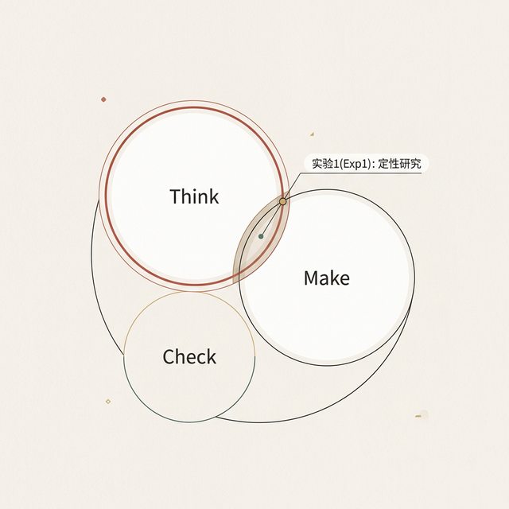
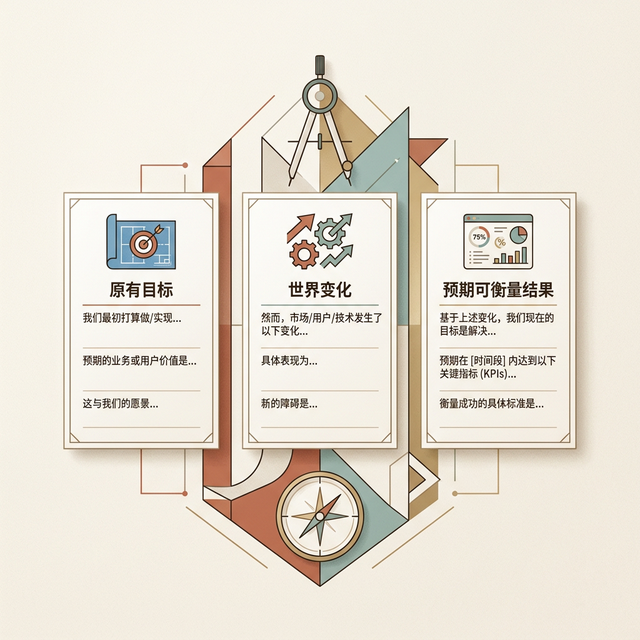
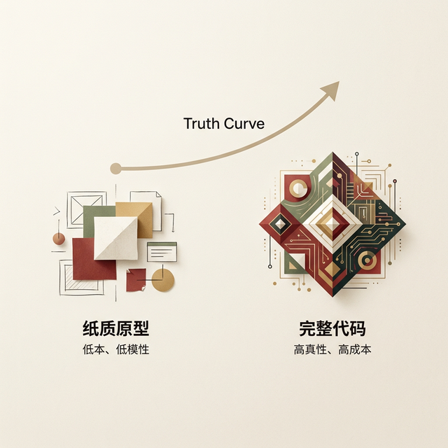
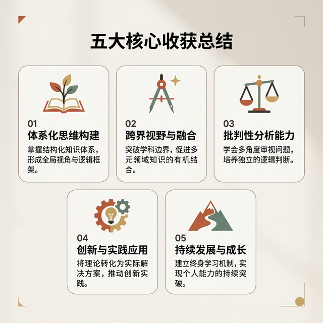

## 模块 5: 第一战场 —— 实验1(Exp1): 敏捷洞察与 MVP (约 45 分钟)
<!-- BUDGET: 1800 chars | SLIDES: ≥4 | STATUS: pending -->

### 5.1 抛弃瀑布：拥抱敏捷精益循环
> [VISUAL]
> **Slide**: W01_S06a
> **Layout**: `Flow`
> *   **Asset**: 
> **Scene**: 敏捷开发循环图（Think -> Make -> Check），高亮 "Think" 与 "Make" 的前期交界阶段，并标注 "实验1(Exp1): 定性研究与概念流向"。

在接下来的 4 周课时里，我们将并行推进第一个大型实验项目——实验1(Exp1)。这不仅仅是一个画图作业。我们要把今天讲的心理模型和可用性目标落地。

在这门课里，我们不采用先写几百页需求文档再画图的瀑布流。我们将采用 **Lean UX (精益用户体验)** 方法。Jeff Gothelf 在 Lean UX 这本书的第一章就开宗明义地写道："For Lean UX to be successful, teams must be given **problems to solve, not solutions to build**."——给团队一个要解决的问题，而不是一个要构建的方案。

这句话的意思是：当你启动 实验1(Exp1) 的时候，你的第一步不应该是打开 Figma 画界面。你的第一步应该是**用一句话精确地描述你发现了什么痛点**。Lean UX 的核心循环只有三步：**Think（假设）→ Make（最小验证物）→ Check（数据反馈）**。一切从"假设"开始，用最低成本验证假设。

> [TEACHING MOMENT]

Gothelf 提供了一个实用的**业务痛点陈述模板**，你们在 实验1(Exp1) 的第一周就需要用到它。模板的核心由三部分组成：第一，产品或系统的**原有目标**——它当初是为了解决什么问题而被创建的？第二，**世界发生了什么变化**——哪些目标现在没有达到了？第三，**明确的改进请求**——但注意，改进请求必须用"可衡量的结果"来表达，**禁止在陈述中指定具体的设计方案**。比如，你不能说"我们需要一个更直觉的 UI"（这太模糊了，每个团队都在追求这个），你应该说"任务完成率从当前的 58% 提升到 90%"。

> [VISUAL]
> **Slide**: W01_S06b
> **Layout**: `Split`
> *   **Asset**: 
> **Scene**: Gothelf 的业务痛点陈述模板拆解，用填空题的形式展示三个核心部分（原有目标、世界变化、预期可衡量结果）。
> **List**: 1. 系统设计的[原有目标] / 2. 现在[世界发生了什么变化] / 3. 我们的改进请求是[可衡量的结果]

### 5.2 任务清单：痛点发掘与体验实验
### 5.3 破局阶段：寻找真实业务痛点

> [VISUAL]
> **Slide**: W01_S06c
> **Layout**: `Full`
> *   **Asset**: 
> **Scene**: 医生问诊图对比。左边是"假医生"（听病人说切阑尾就拿刀 = 需求执行者），右边是"真医生"（拿着听诊器问症状再做判断 = 设计诊断者）。

你需要寻找一个现实生活中的真问题，着手早期的定性访谈。还记得我们刚才讲的**设计师-医生类比**吗？在访谈中，你是医生，不是服务员——你要诊断症状，而不是执行用户的自我处方。

> [!CAUTION] 反向约束 (Reverse Constraint) 与幸存者偏差
> 严禁选择“校园外卖”、“二手交易”、“选课系统”等你们自己极为熟悉的题材。这些题目由于被做过太多次，且存在严重的幸存者偏差，往往会导致你们陷入“为了设计而设计”的圈套。
> 
> 我强烈鼓励大家关注**非自身熟悉的群体**（例如视障人士、生产线工人、体力劳动者、非母语使用者等）。通过强迫自己跨出舒适区，面对完全陌生的人群，你才能真正发现预设的心智盲区，理解什么是“心理模型的不一致”，进而触达真实的认知摩擦。
**切记：绝对不要在访谈中推销你的方案！** 这是新手最常犯的错误，不要问“你觉得这个 App 好用吗？”或“你想要什么功能？”。
你可以使用以下**问题模板库**来引导：
* "请描述一下你上一次遇到这个问题时的具体情境？"
* "你当时为了解决这个问题，采取了哪些具体的操作步骤？"
* "在这个过程中，最让你感到崩溃或麻烦的环节是什么？"
去挖掘他们遭遇的“认知摩擦”，而不是迫不及待塞给他们一个解决方案。

### 5.4 验证实验：最小化可行产品构建

> [VISUAL]
> **Slide**: W01_S06d
> **Layout**: `Flow`
> *   **Asset**: 
> **Scene**: 一张从左到右递进的图形。左端是"纸质原型"（低保真、低成本），右端是"完整代码"（高保真、高成本）。上面压着一条向上弯曲的箭头曲线，标注"Truth Curve: 证据越多，投入越高"。

你们往往会想做一个包罗万象的超级 App。停下。Eric Ries 对 MVP 的原始定义是：**用最少的工作量来测试假设的实验。** 很多团队误解了 MVP，以为它是"阉割版的产品"，是为了赶进度上线而砍掉一堆功能的半成品。这是极其危险的想法。

真正的 MVP (Minimum Viable Product)，核心根本不在于"Product (产品)"，而在于 **"Viable (验证可行性)"**。MVP 不是你最终要卖给客户的东西，它是你用来**向市场提问的工具**。有时候 MVP 是一段代码，有时候它只是一张手绘草图、一个用于收集邮箱的着陆页 (Landing Page)、甚至是一段用来测试点击率的假视频。MVP 的首要关注点不是**交付价值 (Deliver Value)**，而是**获取认知 (Validated Learning)**。

> [CASE STUDY]

这里有两个经典的硅谷案例，完美诠释了什么是真正的 MVP：

**案例一：Dropbox 的"假视频" MVP**
在 Dropbox 编写出极其复杂的跨平台文件同步底层代码之前，创始人 Drew Houston 并没有直接招募庞大的工程师团队开工。他做了一件极其聪明的事：他自己用屏幕录像软件录制了一个 3 分钟的视频，演示了 Dropbox"将如何工作"——视频里的软件其实一半都是写死的硬代码，并非真实的同步系统，但他配合着极其幽默的旁白，把它发到了 Hacker News 上。结果，一夜之间他们的内测排队名单从 5000 人暴增到 75000 人。这个"假视频"就是一个 MVP，它用接近零的开发成本，完美地验证了"核心假设"：硅谷的硬核极客们确实需要一种像本地文件夹一样无缝同步的云盘。

**案例二：Zappos 的"跑腿" MVP**
全球最大的在线鞋店 Zappos，其创始人 Nick Swinmurn 当初想验证一个假设："人们愿意在网上不试穿就买鞋吗？"如果用传统的瀑布流思维，他需要先建仓储、进货几万双鞋、开发复杂的平台系统。但他没有这么做。他跑到当地的鞋店，征得店主同意后给货架上的鞋子拍了照，然后建了一个极其简陋的网页。核心来了：当客户在网上点击购买时，他会亲自跑到那家实体店以全价把鞋买下来，然后自己跑到邮局打包寄给客户！在这个 MVP 阶段，他完全是在**亏钱跑腿**。但这重要吗？根本不重要！因为每一单都在为他带回极其宝贵的认知证据：用户能接受网购鞋子，并愿意为这种便利性买单。彻底验证了这个刚需假设后，他才真正开始着手建立实质性的供应链、仓储和电商后台。

这才是真正的 Lean UX 精神。过度超前于认知证据的编码和绘画，都是原生态的浪费。在这个实验中，请反复问自己：**我们接下来最重要的、最需要验证的假设是什么？验证它的最小成本手段又是什么？** 这个问题的答案，就是你需要运行的下一个最小实验。

Gothelf 提出了一个极其实用的决策框架叫 **Truth Curve**——MVP 的投入程度应该**与你已经掌握的证据量成正比**。如果你对痛点的信心还很低（刚开始访谈），你只需要一个低保真的纸质原型来验证方向；如果你已经有了大量证据（完成了多轮访谈并确认了核心假设），这时候再投入时间做一个可交互的高保真原型才是值得的。**超出必要学习量的任何额外代码/设计工作，都是原生态的浪费 (Waste)。** 这个原则在你做 实验1(Exp1) 的过程中，会反复用到。

核心问题只有一个：**"我们接下来最重要的、最需要验证的假设是什么？"** 这个问题的答案，就是你需要运行的下一个最小实验。

### 5.5 状态流转：用白板图勾勒心智

> [VISUAL]
> **Slide**: W01_S06e
> **Layout**: `Full`
> *   **Asset**: 
> **Scene**: 粗糙但逻辑清晰的白板线框图 (Wireframe) 照片，上面贴着便利贴连着箭头，强调前期注重流转逻辑而非视觉细节。
在接下来的几周，你们需要输出包含核心心智模型与页面流向的状态流转图（哪怕只是线框草图和流程白板）。
在动手连线之前，问自己三个问题：
1. 用户的**心理模型**能通过这个页面流顺畅流转吗？
2. 每一个关键节点，是否满足了**可见性**与**反馈**？
3. 这个粗糙的流程，是否确保了底线的**有效性与安全性**？

> [ACTIVITY]
> **Type**: `Practice`
> **Duration**: `35min`
> **Desc**: 定性访谈大纲评审
> 团队建制确认。遵循“反向约束”原则，现场构思 3 个针对**非自身熟悉群体**的业务痛点候选（强烈避开“校园外卖”、“二手闲置”等老生常谈的话题），互评痛点是否真实且避免了“幸存者偏差”。利用"问题模板库"撰写针对目标用户的 5 个定性访谈核心问题清单。下课前提交大纲初版。

---

### 5.6 课程初结：人文交互的底线拾遗
<!-- BUDGET: 1800 chars | SLIDES: ≥4 | STATUS: pending -->

> [VISUAL]
> **Slide**: W01_S07a
> **Layout**: `Split`
> *   **Asset**: 
> **Scene**: 五大核心收获总结卡片，每条配一个概念图标，呼应全课核心理念。
> **List**: 1. 为行为和情绪设计 / 2. 用户心理模型够用即可 / 3. 可用性与体验双线并重 / 4. 穿透任务直达目标 / 5. 用约束与可见性赋能

（讲师口述）：
好，同学们，我们来回顾今天四个小时的核心收获。今天的内容密度很大，但我希望你们离开教室的时候，至少带走以下五个关键认知：

**收获一：数字产品失败的本质不是技术缺陷，而是行为缺陷。**
Cooper 的"四宗罪"告诉我们，产品之所以让人抓狂，是因为它们粗鲁、强迫人像计算机一样思考、邋遢、让人类承担本应由机器完成的苦力。而这些问题的根源在于四大系统性失败——优先级错位、对用户的无知、利益冲突和缺乏设计流程。

**收获二：衡量好设计有两把标尺——理性底线和感性上限。**
可用性七维度（有效性、效率、安全性、效用性、可学习性、易记性、满意度）是不可妥协的底线。体验目标（愉悦、启发、沉浸 vs 挫败、欺骗、毛骨悚然）是我们作为数字媒体艺术专业追求的上限。iPod 的成功证明了：当两者同时达到极致，产品就超越了工具范畴。记住，**维度间存在权衡**——没有完美的满分产品，只有最优的优先级排列。

**收获三：三大模型的三角关系是交互设计的理论基石。**
工程实施模型、用户心理模型、表现模型——设计师的使命是让表现模型贴近心理模型，同时隐藏工程实施模型的复杂性。心理模型的核心特征是"不需要正确，只需要够用"——就像电影观众不需要理解每秒 24 帧的原理，就像你在电梯里按的"关门"按钮大概率是安慰剂。今天我们通过两个极端案例看到了三大模型的生死攸关：波音 737 MAX 因为表现模型欺骗了飞行员的心理模型，346 人付出了生命代价；而 Spotify 的每周发现歌单将三层算法的工程复杂性完美隐藏在 30 首歌的简洁表现模型之后——用户只知道"Spotify 懂我"。**一个设计的价值，就体现在它把表现模型的滑块推向了心理模型一端还是工程模型一端。**

**收获四：目标 ≠ 任务 ≠ 活动。**
Cooper 的 1850 拓荒者 vs 2024 商人案例深刻地说明：任务会随技术消亡，但目标永远不变。Norman 的四层活动层级（操作→动作→任务→活动）帮助你找到正确的设计粒度。记住设计师-医生类比——你要做的是诊断，不是接单。

**收获五：五大设计原则是你手中的战术武器。**
可见性（Cincinnati 水龙头告诉你：看不见的功能等于不存在）、反馈（物理世界的多模态即时反馈是我们的参照标准）、约束（预防式约束永远优于事后报错）、一致性（简单系统追求一致，复杂系统需要平衡效率）、示能（区分真示能和示能信号，永远不要用设计来欺骗用户）。

> [PHILOSOPHY]

在今天课程的最后，我想和大家分享一句我很推崇的话："界面是机器与系统向人类解释自己的唯二场所。"在漫长的人类历史中，我们一直在依靠本能和物理直觉与世界产生交集。我们拉动木门把手，感受它的真实重量；我们打磨不同形状的石器，依据天然纹理辨认生存用途；我们按压钢琴琴键，通过回弹的力度极其精确地感知声音的细微变化。而短短几十年间，数字化浪潮将这个充满了质感、阻尼感和物理回馈的立体世界，残酷地抹平为了一块冰冷的、毫无生气的玻璃屏幕。我们用机械死板的"滑动"替代了翻阅，用虚无缥缈的"点击"替代了紧握，在获得了空前效率的同时，也丧失了与物理现实互动时那份天然的安全感与掌控快感。

你们作为数字媒体艺术专业的接班学生，未来的工作绝不仅是在这块玻璃屏幕上画出好看的渐变色、堆砌圆角矩形或者是搬运现成的组件。你们的真正使命是：**重建并在数字空间中升华那些失落的感官联系**。当物理世界中理所当然的重力法则、因果即时反馈和物质一致性被不可见的计算机代码统统瓦解破坏之后，你们要用精心设计的多模态示能信号、不带任何侵入感但绝对可靠的预防式约束机制，以及深具同理心和温度的微交互反馈，为使用者——尤其是那些被技术抛弃的非数字原住民人群——重新构建起一层坚固的"数字安全网"。你们在每一次原型迭代、每一次定性访谈倾听、每一次对"反人类设计"的批判与无情反思中所注入的克制与人文关怀，才是交互设计之所以堪称"当代艺术"的真正原因。请永远记住这节课的初衷：绝不盲目迷信底层代码的精妙或功能堆砌的虚假繁荣，去真诚地理解藏在每一次犹豫、每一次报错、每一次点击背后真实个体的生存焦虑、深深挫败与隐秘期盼，这才是从技法工匠走向顶级交互体验设计大师的核心路径，这也是我们这门课程试图赋予你们的唯一底线准则。

**(Pause: 3s)**

### 5.7 下周预告：人类与心智摩擦

下周我们进入**第二章：人类认知与心智摩擦**——我们会从今天的"产品行为"视角转入"人脑"视角，深入探讨注意力、感知和记忆负荷如何约束界面设计。你们会理解 Miller 法则（7±2）、格式塔原则，以及心智模型匹配的更精细操作方法。同时，实验1(Exp1) 正式启动——你们需要在下周课前完成团队组建和痛点候选讨论。

### 5.8 课后推演：产品的逆向评估

最后布置本周的课后任务。请每位同学**独立**完成以下工作：

1. 选取一款你日常高频使用的互联网产品（App 或网站均可）。
2. 从今天讲的两个维度做**逆向拆解分析**：
   - **可用性目标**：逐一对照七大可用性指标（有效性/效率/安全性/效用性/可学习性/易记性/满意度），每项给出 1-5 分评价及具体依据。对效率维度，请特别分析该产品是否有类似 Amazon One-Click 的"步骤消减"设计；对安全性维度，请检查是否存在危险命令与常规命令相邻的菜单布局问题。
   - **体验目标**：从正反两面各挑 1-2 个最突出的体验维度（参照今天讲的 Desirable / Undesirable 对照表），结合具体场景说明。特别留意：该产品是否存在暗黑模式？如果有，请使用 Brignull 的分类命名（如 Sneak into Basket / Roach Motel / False Urgency）进行标注。
3. 提交一份约 **800 字**的分析报告，下周上课前提交到学习通。
