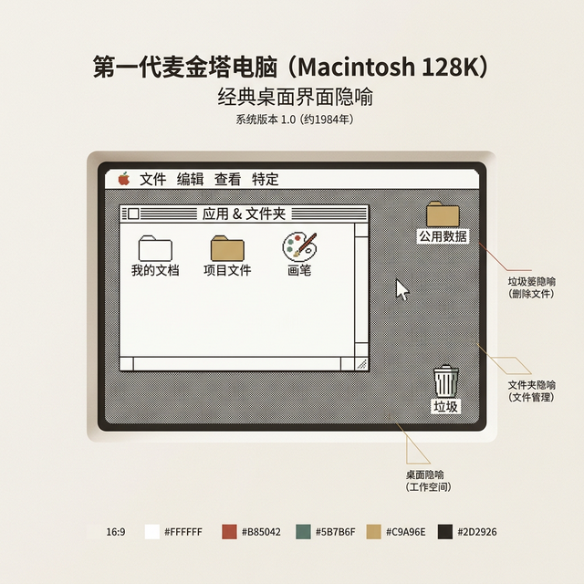
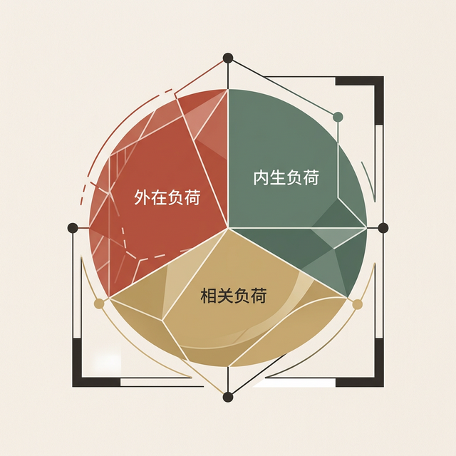
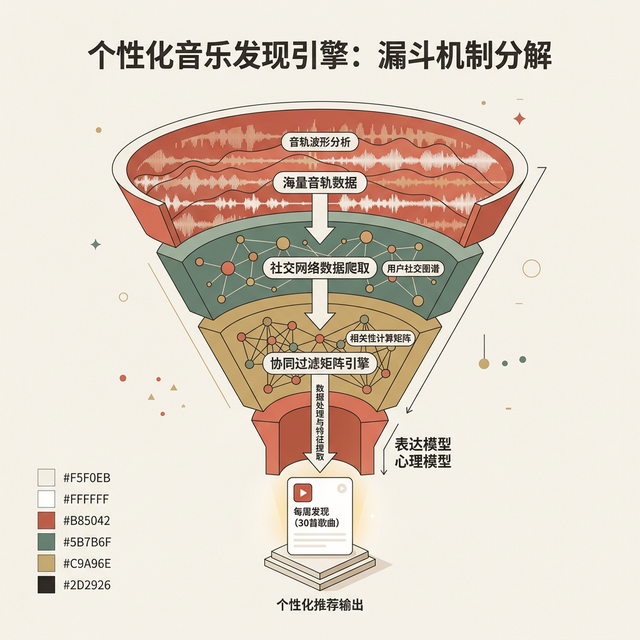

## 模块 3: 破解认知失调 —— 重要的三大模型 (约 35 分钟)
<!-- BUDGET: 6300 chars | SLIDES: ≥12 | STATUS: done -->

### 3.1 模型的分野：我们与机器的代沟
> [VISUAL]
> **Slide**: W01_S03
> **Layout**: `Diagram`
> *   **Asset**: 
> **Scene**: 一个三环交叉的文氏图或者阶梯图：工程实施模型 (底部/齿轮) -> 表现模型 (中间/界面层) -> 用户心理模型 (顶部/大脑结构)。
> **List**: 工程实施模型 (Implementation Model) · 用户心理模型 (Mental Model) · 表现模型 (Represented Model)

这是本节课最重要的理论概念。为什么程序员觉得很简单的东西，用户觉得像天书？原因在于模型的错位：

**(Pause: 3s)**

**灾难的根源**，在于表现模型无限贴近工程实施模型（即：程序员直接把数据库表单映射成了界面）。比如一个网络共享文件服务器，如果表现模型直接展示"SMB 协议路径"和"权限位掩码"，用户看到的就是满屏的技术天书。

**成功的交互**，在于设计师把表现模型塑造得**与用户的心理模型完全一致**。同样是文件共享，如果界面把远程文件夹映射成"我的电脑"里的一个普通磁盘图标，用户就会用操作本地文件的方式来操作远程文件——拖拽、复制、粘贴，一切自然而然。这就是为什么早期的阅读软件要做成翻书的拟物化动画，因为那完美契合了人类当时对"阅读"的心理预期。

> [VISUAL]
> **Slide**: W01_S03a
> **Layout**: `Diagram`
> *   **Asset**: 
> **Scene**: 三层蛋糕概念图剖面。底层：坚硬不规则的齿轮组（工程实施模型）。中层：平整光滑的糖霜层，带有一个可左右调节的滑块（表现模型）。顶层：大脑/云朵气泡（用户心理模型）。
> **List**: 工程模型 (底层机制) / 表现模型 (可视界面) / 心理模型 (用户预期)

想象一下这"三层蛋糕"。最底层是**工程实施模型 (Implementation Model)**——代码是怎么写的，数据是怎么存的。比如对于文件服务器，数据就是树状目录、权限表、字节流。这一层充满了技术人员才能看懂的结构。

最顶层是**用户心理模型 (Mental Model)**——用户脑子里对这个事物运作方式的预期和信念。比如，一个老奶奶眼里的云盘，可能就是一个可以装无数照片的"魔术相册"。她脑子里没有"文件夹层级"或"文件格式"的概念。心理模型有一个核心特征：**它不需要正确，只需要够用。**

> [LIFE CONNECT]

> [VISUAL]
> **Slide**: W01_S03b
> **Layout**: `Split`
> *   **Asset**: 
> **Scene**: 电影类比。左侧：复杂的放映机内部结构图，标注"每秒 24 帧+全黑间隔"（工程模型）。右侧：观众吃爆米花看大银幕连贯画面的插画，标注"连续运动的画面"（心理模型。中央：光束。

Cooper 在教材中给了几个绝妙的类比来说明心理模型的本质。第一个：**电影观众**。请看屏幕。当你坐在电影院里看大片时，你不需要了解放映机的链轮、光阀和每秒 24 帧的切换机制——你的心理模型就是"投影仪把动态画面打在大银幕上"。这个模型从技术层面看是错误的（实际上每帧之间有一瞬间的全黑），但它完全不影响你享受电影。

> [VISUAL]
> **Slide**: W01_S03c
> **Layout**: `Split`
> *   **Asset**: 
> **Scene**: 电力类比。左侧：复杂交流电波形频率图示，标注"每秒极性反转 120 次"（工程模型）。右侧：卡通手握水管插图，水流进入灯泡发光，标注"像水流一样的电能"（心理模型错误但够用）。

第二个更精彩：**家用电力**。绝大多数人以为电流像水一样通过电线从发电厂"流"到你家的灯泡里。这个心理模型其实大错特错——交流电每秒极性反转 120 次，电子并不是单向流动的。但这个"水流"心理模型**完美地够用了**：你知道插上插头灯就亮，知道湿手碰电线很危险，知道电费和用电量成正比。这就是心理模型的力量——**它让你能在不理解底层机制的前提下安全而高效地操作。**

第三个与你们日常最相关：**手机信号**。当你走路时手机从一个基站切换到另一个基站时，你完全无感——你的心理模型是"我的手机无论在哪里都能打电话"。但一个通信工程师知道，这背后是极其复杂的信号切换 (Handover)、频率调整和功率控制协议。如果有一天手机界面突然弹出"正在执行 S1 Handover 至基站 eNB#4578，请勿移动"——你会怎么想？没错，你会觉得这台手机疯了。

> [LIFE CONNECT]

> [VISUAL]
> **Slide**: W01_S03d
> **Layout**: `Image`
> *   **Asset**: 
> **Scene**: 两张日常场景照片拼接：左边是电梯的"关门"按钮（磨损痕迹明显），右边是斑马线人行横道旁的"过街按钮"。中心印有大大的红色"安慰剂 (Placebo)"印章。底部标注："控制幻觉：行为本身降低了等待焦虑"。

还有一个你每天都在体验却从未注意过的心理模型案例——**电梯关门按钮**。你有没有在等电梯时疯狂按"关门"键？坏消息是：自 1990 年美国《残疾人法案》（ADA）生效以来，大多数电梯的关门按钮就是一个"安慰剂"——电梯门必须保持打开至少 3 秒，按钮按下后并不会加速关门。人行横道的"过街"按钮也是如此——大量路口的信号灯由预设定时器控制，按钮完全不起作用。但人们的心理模型告诉自己："按下按钮→得到反馈"。当反馈没有立即出现，大脑归类为"输入失败"并触发重复行为。心理学家称此为"控制幻觉"（illusion of control）——即使理性上知道无效，行为本身也能降低等待焦虑。设计者正是利用了这一点：安慰剂按钮提升了"感知控制感"，让等待体验变得可忍受。这是一个心理模型"错误但够用"的完美日常例证——你以为按钮有用，这个信念让你感觉良好，而设计者也乐见其成。

好，现在到了中间那层——**表现模型 (Represented Model)**：设计师创造出的软件界面形式。Cooper 在 About Face 中用一张经典的 **Figure 1-4** 来描述三者的空间关系：工程实施模型和用户心理模型分别站在天平的两端，中间的滑块就是表现模型。

### 3.2 设计师的终极任务

> [VISUAL]
> **Slide**: W01_S03e
> **Layout**: `Comparison`
> *   **Asset**: 
> **Scene**: 天平与滑块插画。上方：滑块靠向代表齿轮的"工程模型"，天平倾斜，红色骷髅警示标志，标注"灾难"。下方：滑块完美靠向代表大脑气泡的"心理模型"，天平平衡，绿色勾号，标注"成功"。
> **List**: ❌ 表现模型趋向工程模型 = 认知灾难 / ✅ 表现模型趋向心理模型 = 流畅交互

**灾难的根源**，在于表现模型无限贴近工程实施模型（即：程序员直接把数据库表单映射成了界面）。比如一个网络共享文件服务器，如果表现模型直接展示"SMB 协议路径"和"权限位掩码"，用户看到的就是满屏的技术天书。

**成功的交互**，在于设计师把表现模型塑造得**与用户的心理模型完全一致**。就像 Cooper 这个滑块隐喻——设计师的使命就是通过隐喻将滑槽拨向心智模型那一端。

让我用一个极其常见的日常案例来生动说明。大家打车一定用过滴滴。当你叫了一辆网约车，屏幕上会出现一个动画小车图标，还有一行字："司机距离您 1.2 公里，预计 3 分钟到达"。你的心理模型是："哇，这个界面正在卫星直播这辆车的行驶实况。"

但工程实施模型是什么？是极其复杂的 A* 寻路算法，是每 5 秒甚至更久才回传一次的 GPS 坐标漂移点，是处理几十万并发请求的分布式服务器集群。如果在郊区信号不好，实际传回的只是断断续续的点。如果滴滴把真实的工程模型展现给你，你看到的是一张静态地图，上面每过几秒突然闪现一个可能偏离马路的红点，那你会极度焦虑乃至取消订单。

所以，滴滴的设计师是怎么做的？他们做了一个完美的"表现模型"。他们用动画将那些断断续续的断点强制吸附到地图道路上（这叫平滑插值算法），让小车按照极其匀速、平滑的曲线移动。这个表现模型不仅优雅地掩盖了工程模型的粗糙，而且**完美地投喂了你的心理模型**——让你获得了强烈的确定性和控制感。表现模型不仅隐藏了复杂性，甚至在此基础上**重构了比现实更美好的幻象**。这就是好设计的魔力。

同样是文件共享，如果界面把远程文件夹映射成"我的电脑"里的一个普通磁盘图标，用户就会用操作本地文件的方式来操作远程文件——拖拽、复制、粘贴，一切自然而然。这就是为什么早期的阅读软件要做成翻书的拟物化动画，因为那完美契合了人类当时对"阅读"的心理预期。

> [STORY TIME]

来看一个更极端的案例。早期的电子表格软件（如 VisiCalc 和后来的 Excel）为什么能够席卷全球的会计行业？因为它的表现模型完美地映射了会计师脑中几个世纪以来形成的心理模型——**一张巨大的、带有行列的纸质账簿**。你在屏幕上看到的就是一格一格的单元格，你可以在里面填数字，就像在纸上写一样。VisiCalc 的天才之处在于它**从未试图教育用户什么是"数组"或"单元格引用"**——它只是说："这就是你熟悉的账簿，只不过它会自动帮你算总数。"

我们需要通过调研去挖掘心理模型，然后在表现模型中把它具象化，同时把工程实施模型的复杂性深深隐藏在幕后。还记得我们模块 1 讲的 Therac-25 吗？那个案例的根本问题就是**表现模型欺骗了操作员的心理模型**——屏幕显示"no dose"，操作员的心理模型告诉她"一切正常"，但工程实施模型已经失控了。表现模型不仅要贴近心理模型，还必须**诚实地**贴近。

> [CASE STUDY]

> [VISUAL]
> **Slide**: W01_S03f
> **Layout**: `Image`
> *   **Asset**: 
> **Scene**: 波音 737 MAX 驾驶舱插画。画面被切割为三个层级："飞行员的心智"（脑海思考着安全的老式737）、"表现模型面板"（虚假的正常反馈表盘）、"工程系统 MCAS"（一只巨大的隐形手生硬地将机头按向地面）。红色警告："346 遇难，隐藏工程模型所致"。

Therac-25 并不是孤例。2018-2019 年，**波音 737 MAX** 接连发生两起坠机事故——狮航 610 和埃航 302——共造成 **346 人遇难**。灾难的核心是一个名为 MCAS（机动特性增强系统）的自动控制模块。波音为 737 MAX 安装了更大、更前置的发动机，导致飞机在高攻角时有抬头倾向。MCAS 的工程模型设计为自动压低机头来补偿。但为了让 737 MAX 保持与旧款 737 相同的飞行员资格认证、避免昂贵的模拟器培训，波音做了一个致命的决定——**在飞行手册和培训中故意隐瞒了 MCAS 的存在**。

于是灾难性的"模型错位"出现了：飞行员的**心理模型**是"我在驾驶一架标准 737，我对它的行为了如指掌"。飞机的**工程模型**是"我有一个你完全不知道的自动系统在持续操控机头"。而**表现模型**——驾驶舱仪表盘和警报系统——没有向飞行员清晰地显示 MCAS 正在激活。更糟的是，MCAS 依赖单一迎角传感器，构成了关键的单点故障。当传感器故障触发 MCAS 反复压低机头时，飞行员在与一个他们**完全不知道存在**的系统搏斗。这是"表现模型欺骗心理模型"在航空史上最惨烈的案例。NASA 人因分析报告后来将其定性为"严重的人因工程失败"。

> [CASE STUDY]

> [VISUAL]
> **Slide**: W01_S03g
> **Layout**: `Split`
> *   **Asset**: 
> **Scene**: 左侧：极简全黑控制台界面，一行白字 `rm -rf *` 输入错误参数（代表薄弱的表现模型）。右侧：如多米诺骨牌般倒塌的巨型服务器阵列，上方漂浮各大网站宕机的红色标志（Slack/Quora），底部数字："1.5 亿美元损失"。

工程模型暴露的危险不只存在于航空领域。2017 年 2 月 28 日，亚马逊 **AWS** 一名工程师在调试 S3 存储服务的计费系统时，一条命令的参数输入错误，导致删除的服务器数量远超预期。被误删的服务器恰好支撑着 S3 的索引子系统和存储分配子系统——这两个关键组件已经**多年未经历完整重启**。重启过程耗时约 4 小时，期间 Slack、Quora、Medium、Coursera 等大量网站全部瘫痪。讽刺的是，AWS 自己的服务状态面板也因依赖 S3 而无法更新——团队不得不用 Twitter 来通知用户。事后估计 S&P 500 公司因此损失约 **1.5 亿美元**。根本原因：命令行工具的表现模型完全暴露了工程模型的危险——没有"你确定要删除这么多吗？"的安全确认。

那表现模型做得好是什么样子呢？来看一个**成功的反面案例**。

> [CASE STUDY]

> [VISUAL]
> **Slide**: W01_S03h
> **Layout**: `Diagram`
> *   **Asset**: 
> **Scene**: 漏斗插画机制分解。上方（工程实施）：由海量音轨波形、社交网络爬虫数据网、协同过滤复杂矩阵构成的三层庞大分析引擎。下方出口处（表现模型与心理模型交汇）：一个简洁明亮的播放列表卡片 UI 界面生成，写着"Weekly Discover (30 songs)"。

每周一，全球数亿 **Spotify** 用户会收到一个 30 首歌的"每周发现 (Discover Weekly)"歌单。用户的心理模型极其简单："Spotify 了解我的口味，每周给我推荐我可能喜欢的新歌。"但背后的工程模型是三层算法的协同：第一层**协同过滤**——分析数亿用户的收听行为，找到与你品味相似的"味觉集群"；第二层 **NLP 自然语言处理**——爬取全网音乐博客和评论，理解描述音乐的语义标签；第三层**音频卷积神经网络**——直接分析歌曲的原始音频波形，提取节奏、调性、能量等"声学指纹"。系统甚至知道你听了 30 秒就跳过的歌是"差评"，而完整播放并加入歌单的是"好评"。整个三层算法决策链的复杂度，被一个简洁的 30 首歌单**完美隐藏**。用户永远不需要知道什么是"协同过滤"或"卷积神经网络"——他们的心理模型就是"Spotify 懂我"，而表现模型完美地维护了这个信念。这就是 Cooper 所说的理想状态——表现模型紧贴心理模型，工程模型被深深隐藏在幕后。

**(Pause: 3s)**

### 3.3 深层驱动力：目标 ≠ 任务 ≠ 活动

在你们着手 实验1(Exp1) 之前，我需要帮你们理清一个极为关键的概念层级。很多新手设计师犯的第一个错误就是问用户："你平时做什么任务？"然后围着任务去设计界面。Cooper 在《About Face》中反复告诫我们：**任务 (Tasks) 是会随技术更迭而消亡的，但目标 (Goals) 不会。**

他举了一个精彩的穿越时代的例子：1850 年，一个拓荒者要从圣路易斯到旧金山，他的**目标**是快速、舒适、安全地到达。为达成这个目标，他的**任务**是驾驶篷车、携带猎枪防身。而在 2024 年，一个商人同样的出差行程，他的**目标**丝毫未变——依然是快速、舒适、安全。但他的**任务**完全反转了：乘坐喷气式飞机，而且必须把枪留在家里才能完成安检。

> [VISUAL]
> **Slide**: W01_S04
> **Layout**: `Diagram`
> *   **Asset**: 
> **Scene**: 金字塔三层图。顶层"目标 (Goals)"标注"为什么？不随技术变化"；中层"活动 (Activities)"标注"做什么大事？"；底层"任务 (Tasks)"标注"具体步骤？随技术变化"。旁边有 1850 马车 vs 2024 飞机的对比。

**为什么这对你们至关重要？**

如果你在 实验1(Exp1) 中只做"任务分析"——去列举用户目前的操作步骤，然后把每个步骤翻译成一个界面——你就陷入了 Cooper 所说的"被过时技术绑架"的陷阱。你设计出来的产品，充其量只是对现有流程的数字化搬运。

但如果你往上追问一层：**用户做这些事的目标到底是什么？** 你就有可能发现，有些任务根本不需要存在。一个好的设计，应该能够用更好的技术消灭那些本不应由人类执行的冗余任务。

> [TEACHING MOMENT]
> 目标不随技术更迭消亡，但任务会。设计的真正使命不是优化步骤，而是直接回应用户的底层目标。

Norman 在他的理论中进一步细化了这个层级，他提出了四层结构：**操作 (Operations) → 动作 (Actions) → 任务 (Tasks) → 活动 (Activities)**。操作是最小的不可再分的步骤（如点击鼠标、移动手指）；动作是操作的有意义的组合（如拖拽一个文件图标到文件夹）；任务是动作的集合（如整理桌面上的文档）；活动是最高层的、有明确目标驱动的行为（如"准备下周的客户汇报"）。

如果设计者无法穿透任务看到目标，就会产生极具破坏性的"**局部最优解**"陷阱。这就引出了著名的（虽然可能是虚构的）亨利·福特名言："如果我问人们想要什么，他们会说想要一匹更快的马。"在福特时代，用户的任务是"喂马、清理马厩、驾驶马车"，他们的目标是"更快地从 A 点到达 B 点"。如果采用以活动/任务为中心的设计，福特的产出将是**培育一匹跑得更快的基因突变马**，或者是**设计一个更轻的马车车厢**。这就是大多数平庸产品的诞生逻辑——拿着秒表去优化现有任务的每一个步骤。

但福特是目标导向设计的宗师。他直接越过了所有的"马车操作任务"，直击"更快的点对点移动"这个核心目标，于是他的解决方案是：**消灭马，发明汽车**。这给你们 实验1(Exp1) 最具震撼力的指导原则是：**最好的设计不一定是让任务变得更容易，而是让任务变得不必要。**

> [VISUAL]
> **Slide**: W01_S04b
> **Layout**: `Comparison`
> *   **Asset**: 
> **Scene**: 福特汽车的反事实推演对比图。左侧："优化任务 (Task-Driven)"，画面是一只装着喷气背包、跑得极快的马，标注"局部的荒诞"。右侧："直击目标 (Goal-Driven)"，画面是福特 T 型车，标注"全局的范式转移"。

我们再来看一个更现代的例子：去银行转账。15 年前，用户的任务可能包括：去网点领号、排队、填写密密麻麻的汇款单、把单子和现金递给柜员、拿到回执纸条。如果遵循"以任务为中心"的设计，银行创新部会怎么做？——他们会发明自动叫号机（优化排队任务）、设计更大字体的汇款单（优化填写任务）、引入更快的点钞机（优化柜员验证任务）。这一切都在让任务变得"更好"。

但这完全错了。支付宝或微信支付的做法，就是典型的目标导向设计。用户的目标是什么？不是去填单子，甚至不是去银行——他们的目标仅仅是"把我的 100 块钱所有权转移给张三"。于是移动支付直接在这个目标上下刀：**把整个物理转账任务彻底抹去**，变成在聊天窗口输入一个金额，然后刷脸。这就是穿透任务直击目标的威力。

> [PHILOSOPHY]

这里有一个微妙但极其关键的洞见——**用户的真正目标往往是隐蔽的**。Cooper 区分了三种目标层级：**个人目标**（如"不要觉得自己很蠢"）、**实用目标**（如"快速完成任务不加班"）和**企业目标**（如"提高团队产出"）。一个会计的**实用目标**是"高效录入发票"，但他的**个人目标**可能是"证明自己工作高效、保住饭碗"——后者永远不会出现在需求文档里，却可能是最强的行为驱动力。同时要注意，**客户 (Customer)** 并不总是**用户 (User)**——购买企业软件的 IT 主管和每天使用它的一线员工，他们的目标可能截然对立。

这就引出了 Cooper 最著名的类比之一——**设计师-医生类比**：

> [CASE STUDY]

一个病人走进诊所，对医生说："我觉得是阑尾炎，赶紧给我切了。"一个负责任的医生会怎么做？他**不会**仅凭病人的请求就动刀——病人能准确描述自己的症状（"这里疼，吃东西就恶心"），但他**没有专业能力**做出正确的诊断和处方。也许他的疼痛根本不是阑尾炎，而是胆囊问题。

设计也是如此：**倾听用户的问题（症状）比采纳用户的方案（自我处方）更有价值。** 用户能告诉你什么让他们痛苦，但他们通常无法告诉你最佳的解决方案是什么——那是设计师的专业领域。在你们做 实验1(Exp1) 的定性访谈时，请牢记这个原则：**你是医生，不是服务员。你要做诊断，而不是接单。不要问用户"您想要个什么功能"，而要问"当您试图完成那项工作时，什么让您感到最挫败"。**

**(Pause: 3s)**

### 3.4 缩短代沟的桥梁：界面隐喻与对象-动作矩阵
如何快速让表现模型贴近小白用户的心理模型？最有效的工具是寻找生活中的物理**隐喻**。比如：操作系统中的“回收站”和“文件夹”，或者汽车屏幕上的“仪表盘”——寻找那个能让用户秒懂的“物理现实映射”。

> [STORY TIME]

Cooper 讲了一个关于隐喻威力的绝佳故事。想象你来自外太空，从未见过吸尘器。你走进一间地球上的房子，看到一台 Dyson 无线吸尘器——加长的管状把手、底部有旋转刷头、侧面有大大的红色触发器——你的心理模型几乎不需要说明书就能建立：这是一个需要用手握住、对着地面操作、按下触发器启动的清洁工具。它的物理示能完美地引导了你的心理模型。但现在打开一个清洁管理 App：一个列表、几个标签页、一个加号图标。你能一眼就知道"从哪里开始打扫"吗？大概率不能。数字界面天生缺乏物理示能的引导力——这就是为什么我们需要用隐喻来弥补鸿沟。

> [STORY TIME]

隐喻对齐心理模型最经典的案例或许是 **iPhone 的"滑动解锁"**。2007 年初代 iPhone 发布时面临一个设计挑战：如何防止口袋里的误触解锁，同时让用户无需说明书就能上手？苹果团队试过双指缩放、旋转门把手等方案，但 Steve Jobs 坚持要"单手、一次滑动"。最终方案是一个发光的滑块条，视觉上模拟了现实世界中的门闩——用户的心理模型是"像推门闩一样滑开"。这个拟物化设计让从未见过触摸屏的人也能在 2 秒内学会解锁。2013 年 iOS 7 全面转向扁平化后"滑动解锁"被取代，但它作为**"表现模型完美对齐心理模型"**的经典案例永载交互设计史。

但隐喻也是一把双刃剑。Rogers 在教材中特别警告：当隐喻被过度延伸时，它会从帮手变成障碍。经典的例子是苹果早期的拟物化设计——日历 App 做成了皮质封面加撕页效果，备忘录 App 做成了黄色法律笺纸。对于初次接触数字设备的用户，这些隐喻极具亲和力。但当功能需要超越物理世界的限制时——比如"同时查看三个月的日程"或"在备忘录中插入图片"——皮质日历的隐喻就成为了枷锁。这也是为什么苹果在 iOS 7 中彻底抛弃了拟物化，转向扁平化设计。

> [DID YOU KNOW]

三大模型和心理模型的讨论直接指向了 Norman 另一个经典框架——执行与评估的海湾 (Gulf of Execution and Gulf of Evaluation)。简单预告一下：执行海湾描述的是“用户想做一件事”和“用户知道如何操作界面来做这件事”之间的距离；评估海湾描述的是“系统给出了反馈”和“用户理解这个反馈意味着什么”之间的距离。这两个海湾越窄，界面越好用。我们在下周的第二章中会深入展开这个框架。

但对于初学者而言，仅有隐喻可能过于抽象。在即将进入的 实验1(Exp1) 实操中，很多同学往往一动手画线框图，就又掉进了程序员的“增删改查 (CRUD)”逻辑（比如生硬地设计出：“数据列表页”、“新增按钮”、“修改表单”）。

为了防止这种工程实施模型的反噬，我们在教学执行中引入一个专为实操设计的简单工具：**对象-动作矩阵 (Object-Action Matrix)**。这对数字媒体艺术 (DMA) 专业的同学尤其有效，因为它可以极大地降低转化时的认知负荷，将你们擅长捕捉的感性“意象”平移为严谨的界面结构。

**矩阵构建三步法：**
1. **提取核心对象 (Objects)**：提炼目标用户心理模型中的实体。例如：在老奶奶的心里，只有“相册”和“照片”，没有“图库数据库”和“文件目录”。
2. **列举自然动作 (Actions)**：基于对象，符合用户真实生活预期的动作是什么？例如：老奶奶期望的是“翻看照片”、“把照片放进相册”、“扔弃拍坏的照片”，而不是“执行 Delete 语句”或“Update 数据行”。
3. **界面元素映射**：将这些“对象+动作”直接映射为界面上的视觉焦点和交互控件。确保界面是围绕“感知对象”展开的，而不是围绕“系统后台功能”铺陈的。

> [VISUAL]
> **Slide**: W01_S04c
> **Layout**: `Table`
> *   **Asset**: 
> **Scene**: 微信抢红包对象-动作矩阵拆解图表。左侧列呈现普通工程师视角，右侧展示 OAM 转换结果。
> **List**: 工程师视角：数据表 (Transaction) / 系统动作 (Insert Record, Check Balance) | OAM 视角：核心对象 (红色的纸包) / 自然动作 (塞钱、封口、发进私聊/群、拆开、看大家抢了多少) 

这里我用一个足以载入产品史册的案例，来演示对象-动作矩阵 (OAM) 的魔力——**微信“抢红包”**。

在 2014 年春节除夕夜那个爆库狂欢之前，如果把“过年线上给亲戚发钱”这个需求发给银行工程师，他们画出的原型绝对是一个“线上转账系统”：
*   **工程师对象**：账户余额、收款人名单、流水记录。
*   **工程师动作**：选择收款人、输入金额、短信验证、确认转账。
*   **最终界面**：一个刻板的表单。效率极高，毫无情感。

但微信之父张小龙团队是怎么做的？他们敏锐地抓住了中国人在春节“发红包”的心理模型，并在矩阵中完美重构：
*   **提炼核心对象 (Objects)**：中国用户心里根本没有“交易数据”，只有一个红彤彤的纸张包着钱的东西——**红包**。
*   **列举自然动作 (Actions)**：人们怎么发红包？**塞钱**（放金额进入系统）、**包住**（隐去金额，制造盲盒感）、**递给别人/扔在桌上**（发给个人/发到群里）、最核心的动作——**拆开**（享受揭晓谜底的瞬间），以及**看别人抢了多少**（攀比炫耀）。
*   **界面映射**：在这个矩阵指导下，红包被拟物化地设计成了一个真实的黄色按钮加上红色的封套。当你发群红包时，你不是在“配置多人转账参数”，你是在输入总金额和个数，系统自动执行随机算法模拟“抢”的过程。最绝妙的是那个硕大的、甚至刻意加入了一秒钟过渡动画的“开”字按钮。**那不是一个 Submit 按钮，那就是“拆开纸信封”这个物理动作在数字世界的投射。**

微信抢红包之所以成为春节现象级事件，彻底颠覆中国移动支付格局，正是因为它用一种天才般的表现模型，完美承接了十四亿中国人的跨年心理模型。这就是对象-动作矩阵的终极奥义——别在业务逻辑的泥潭里打滚，回到人味里去寻找对象与动作。

> [ACTIVITY]
> **Type**: `Practice`
> **Duration**: `课后延展`
> **Desc**: 绘制对象-动作矩阵与心智错位对比（课后任务）
> 各小组课后挑选一个常见的软件工具（如：老年人在线挂号系统），画出程序员视角的"工程实施模型"流转图，再深入目标用户"心理模型"绘制**对象-动作矩阵**，最后构思"界面隐喻"弥合断层。下周课前提交。

---
