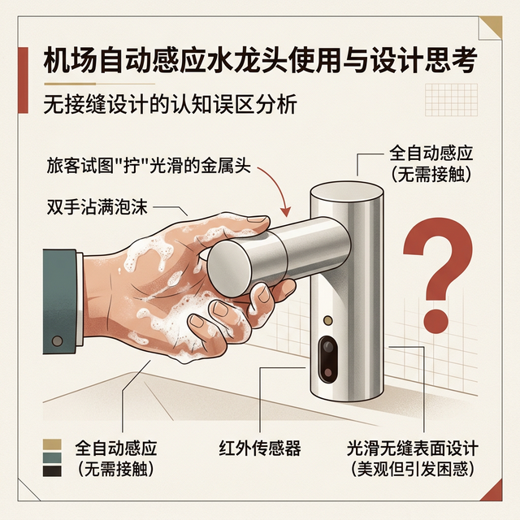
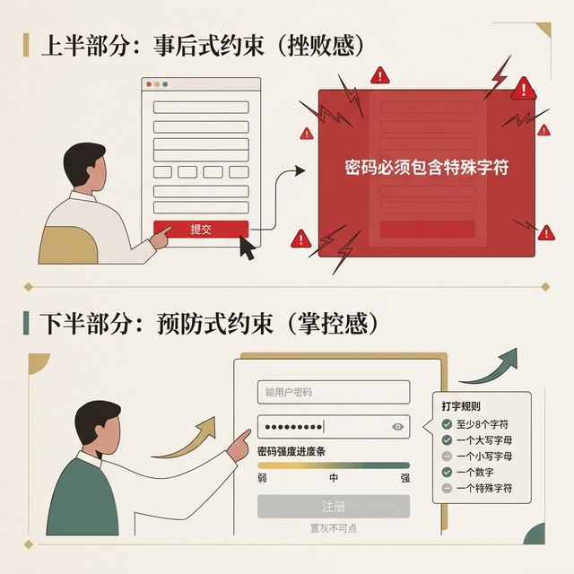
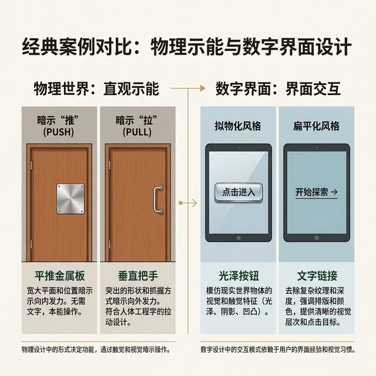
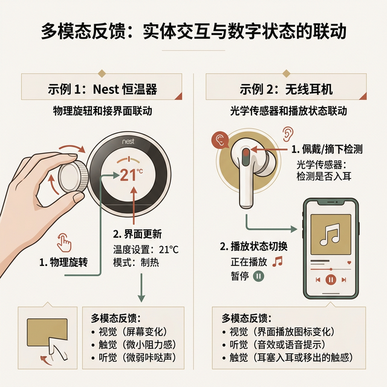

## 模块 4: 防止摩擦的五把武器：设计原则 (约 35 分钟)
<!-- BUDGET: 5400 chars | SLIDES: ≥10 | STATUS: done -->

掌握了心理模型，我们需要战术武器来打造表现模型。Yvonne Rogers 给出了经典的设计五原则：

### 4.1 可见性 (Visibility) 与 反馈 (Feedback)

> [CASE STUDY]

> [VISUAL]
> **Slide**: W01_S05a
> **Layout**: `Image`
> *   **Asset**: 
> **Scene**: 机场自动感应水龙头特写，一个困惑的旅客手持满是泡沫的双手，正试图去"拧"那个完全没有接缝的平滑金属装饰头。旁边打上一个巨大的红色问号。

先讲一个关于可见性的荒诞真实故事。Cincinnati 国际机场的卫生间里安装了自动感应水龙头——理论上很好，减少细菌传播。但问题来了：很多旅客站在洗手台前，根本**不知道水龙头是自动的**。他们反复扭动那个装饰性的金属头，敲打出水口，甚至翻看水龙头底部找开关。因为这些水龙头的外观完全看不出它是感应式的——**没有任何视觉线索告诉用户"把手伸到下面就会出水"。** 这就是可见性为零的设计。

*   **可见性**：重要的操作和状态必须显而易见。如果一个关键的"提交"按钮被折叠在了汉堡菜单里，它的可见性就是负分。更糟糕的是，如果连功能本身的存在都不可见——就像那个机场水龙头一样——用户对着一个完美的技术方案束手无策。

*   **反馈 (Feedback)**：每一个用户的动作，系统都必须给出即时的、明确的响应。Rogers 在教材中用了一组极具感官穿透力的类比来说明什么是好的反馈——

> [LIFE CONNECT]

> [VISUAL]
> **Slide**: W01_S05b
> **Layout**: `Split`
> *   **Asset**: 
> **Scene**: 左侧：切面包特写，标注三种感官输入（视觉：面包屑掉落；听觉：咔嚓声；触觉：刀刃受到的阻力）。右侧：缺乏反馈的数字黑洞，用户按下一个毫无反应的灰色按钮，头顶冒出问号。
> **List**: 物理世界的即时多模态反馈 / 数字界面的反馈黑洞

想一想你弹吉他的感觉：手指拨弦的瞬间，你同时感受到弦的振动（触觉）、听到音符的回响（听觉）、看到琴弦的颤动（视觉）——三种感官通道**同步**给你反馈，**零延迟**。再想想你用刀切面包：刀刃入面包的阻力、切过硬壳时的咔嚓声、面包屑簌簌掉落的画面——你的大脑在毫秒级别内就整合了这些信息，形成了对"切割进度"的完整感知。或者更简单的：用笔在纸上写字，笔尖和纸面的摩擦感直接映射了你"正在写"的行为。

这些物理世界中的**多模态即时反馈**，正是我们在数字产品中需要还原的东西。当一个按钮按下后没有任何视觉变化，当一个表单提交后页面只是静静地转了一圈圈——用户就像在无声的真空中弹吉他，完全不知道自己的动作有没有生效。

（讲师口述）：
同学们，作为数字媒体艺术专业的学生，大家不要把交互窄化为"眼睛的艺术"。在一个优秀的交互体系中，**声音（Audio）**绝不是 UI 最后的点缀，它是反馈回路中最敏锐、最具有情感穿透力的部分。

**1. 听觉示能 (Sonic Affordance)：不看屏幕的指挥棒**
在物理世界中，木头撞击声暗示了材质的厚重，金属破碎声预示了危险。在数字产品中，我们同样可以利用声音示能。
*   **物理隐喻的延伸**：当你拖拽文件到回收站时，OS X 那个标志性的"纸张揉捏声"是在告诉你：这个动作是不可逆的、物理性的破坏。
*   **材质感与反馈**：如果你正在设计一个复古风格的合成器 App，按钮按下的声音应该是带有机械物理感的"咔嗒"声，而不是电子合成的"哔"声。这能瞬间对齐用户的心理模型。

**2. 反馈的层次：从"确定"到"警示"**
声音反馈必须有清晰的等级，否则就会变成干扰（Noise）。
*   **确认音 (Confirmation)**：轻快、上扬、短促。例如移动支付成功的"叮"声，它能给用户带来多巴胺奖励。
*   **负面约束 (Negative Constraints)**：沉闷、低频或不协和音。当你尝试在不可拖动区域释放图标时，系统给出的闷响是在不占用视觉空间的前提下，温柔地告诉你"此路不通"。

**3. 声音交互剧场 (Sonic Interaction Theatre)**
交互不仅仅是功能的呈现，更是一场表演。想象一下，如果你在设计一个沉浸式的声音剧场或交互装置，声音的延迟、空间感（Spatial Audio）都会直接影响用户的操控感。一个好的交互设计师，应该像混音师一样，去调配界面的"信噪比"。

> [DID YOU KNOW]

听觉反馈在现实世界中最诗意的应用来自**日本铁路系统**。每个车站都有自己独特的出发音乐——5 到 10 秒的旋律在列车关门时播放。JR 高田马场站播放的是《铁臂阿童木》主题曲，秋叶原站则是 AKB48 的《恋爱幸运饼干》。但这不仅是城市名片——它更是一套精巧的**无障碍听觉导航系统**。东京地铁为视障乘客设计了分层听觉引导：出入口和检票口使用"乒乓"声，岛式月台的阶梯处播放"草地鹨"的叫声，侧式月台则使用"夜莺"或"布谷鸟"叫声——**不同鸟鸣对应不同的月台类型**，视障乘客仅凭声音就能判断自己在哪种月台上。这是"反馈"原则在无障碍设计中最优雅的实现。

**(Pause: 3s)**

> [ACTIVITY]
> **Type**: `Practice`
> **Duration**: `5min`
> **Desc**: 盲听挑战：声音背后的交互逻辑
> 讲师播放 3 段经典数字产品音效（如：Windows 报错音、Slack 消息提示音、特斯拉锁车声）。
> 要求学生闭眼倾听，并在白板上快速写下：
> 1. 这个声音暗示了什么物理材质？（示能信号）
> 2. 它在反馈什么级别的系统状态？（可用性目标中的安全性、有效性或警告）

### 4.2 约束 (Constraints) 与 一致性 (Consistency)

> [VISUAL]
> **Slide**: W01_S05c
> **Layout**: `Comparison`
> *   **Asset**: 
> **Scene**: 上半部分：事后式约束（用户填完长表单点击提交后，弹出全屏红框报错"密码必须包含特殊字符" = 挫败感）。下半部分：预防式约束（密码输入框下方实时显示密码强度进度条和已满足的打字规则，未满足前"注册"按钮置灰不可点 = 掌控感）。

*   **约束**：通过设计，直接阻止用户在特定时刻做出错误的操作。比如，日期选择器里让不合理的日期（比如 2 月 30 日）变灰不可点击，这比用户填完后报错要高级得多。不仅减少了挫败，更是**安全性 (Safety)** 目标的直接体现。Rogers 在教材中将约束分为两种：**预防式约束**（灰显菜单项，让你根本无法选择错误选项）和**事后式约束**（填完表单后弹出错误提示）。前者永远优于后者，因为它从根源上杜绝了错误的可能性。

> [CASE STUDY]
这在工业设计界有一个极富盛名的专门术语，叫做 **Poka-yoke（防呆设计）**，最早由丰田汽车的工程师新乡重夫 (Shigeo Shingo) 提出。最典型的防呆设计就是你们电脑主板上的 CPU 插槽或者老式的 VGA 视频线接口——它们的形状被设计成了不对称的梯形，或者是缺了一个角的方形。这意味着什么？意味着无论用户怎么"瞎试"，只要方向不对，物理上就**根本插不进去**。这就是防呆界面的最高境界：**不依赖用户的注意力和智商，直接在物理结构或交互逻辑上切断犯错的路径。** 我们在设计 App 时，"置灰不可点"的按钮，就是信息时代的 Poka-yoke。
*   **一致性**：相似的操作应该使用相似的元素以完成相似的任务。内部一致性（同一个 App 内按钮风格统一）和外部一致性（遵循 iOS/Android 的统一下拉刷新习惯）。不要去重新发明轮子，打破一致性会直接拉低**可学习性 (Learnability)**。

> [TEACHING MOMENT]

但一致性并非铁律——它存在一个**简单 vs 复杂的权衡**。Rogers 指出，对于一个简单的设备（如收音机），一致性几乎是绝对优先的：所有旋钮都应该用同样的操作方式。但对于一个功能极其丰富的复杂系统（如 Word 文字处理器），**过度的一致性反而可能妨碍效率**。想想 Word 里的快捷键：Ctrl+B 加粗、Ctrl+I 斜体——这些快捷键并不"一致"（没有统一的字母逻辑），但它们利用了**首字母缩写的记忆规律**，从而在高频用户的效率上取得了巨大优势。好的设计需要在一致性与高级用户效率之间找到平衡。

#### 4.2.1 约束的反面：暗黑模式 (Dark Patterns) —— 设计师的职业底线

> [VISUAL]
> **Slide**: W01_S05d
> **Layout**: `Grid`
> *   **Asset**: 
> **Scene**: 三个典型暗黑模式截图拼图：(1) 退订流程被设计成 5 步迷宫，(2) 购物车自动勾选了额外保险，(3) "删除账号"按钮被故意做成灰色极小文字。
> **List**: 偷加购物车 (Sneak into Basket) / 退订地狱 (Roach Motel) / 虚假紧迫感 (False Urgency)

讲到"约束"，有一个必须在第一课就埋下的种子——**暗黑模式 (Dark Patterns)**。这个概念由 Harry Brignull 首次命名（参见 darkpatterns.org），它描述的是：设计师**故意利用设计原则来欺骗或操控用户**，让他们做出不符合自身利益的决策。

> [DID YOU KNOW]

Blake et al. (2020) 进行了一项覆盖**数百万用户**的超大规模实验，研究暗黑模式的商业诱惑力。结果令人震惊：不预先显示费用的用户（被隐藏费用"突袭"的用户）比预先显示费用的用户多花费了 **21%** 的金额，完成购买的概率高出 **14%**。这就是为什么暗黑模式如此诱人——它真的能在短期内提升营收。但 Brignull 指出，这是以**用户信任**为代价的透支行为。

常见的暗黑模式包括：
*   **偷偷往你的购物车里加东西 (Sneak into Basket)**：你明明只想买一张机票，结账时发现购物车里多了保险、加急配送、VIP 贵宾室——这些都是默认勾选的，你必须一个个手动取消。
*   **退订地狱 (Roach Motel)**：注册只需一键，退订却需要点击 5 个页面、填写退出原因、接受挽留弹窗、等待 48 小时确认邮件——进来容易出去难。
*   **虚假紧迫感 (False Urgency)**："仅剩 2 间房！""3 人正在浏览此商品！"——这些数字很可能是编造的，目的只是制造购买焦虑。

> [!WARNING] 这门课的职业底线
> 本课程的素养目标中明确写着：**培养防范暗黑模式的职业底线**。而且这已经不只是职业道德问题，**它正在成为法律红线**。2024 年，欧盟《数字服务法案》(DSA) 全面生效，明确禁止暗黑模式——虚假紧迫感、艰难退订、预勾选同意框全部违法。同年，国际消费者保护执法网络 (ICPEN) 联合审查发现：**76% 的受检网站和 App 使用了至少一种暗黑模式**。美国 FTC 已对 Adobe 和 Amazon 提起诉讼。作为数字媒体艺术专业的学生，你们在 W12 的启发式评估实验中，将会系统地学习如何识别和审计暗黑模式。但从第一天起，你就应该建立一个铁律：**用约束来保护用户，而不是用约束来剥削用户。** 一个设计如果只对老板有利而对用户有害，那它就不是设计，是陷阱。

> [DID YOU KNOW]

2025 年 12 月，欧盟委员会依据 DSA 对 **X（原 Twitter）开出了 1.2 亿欧元罚单**——这是 DSA 生效以来首张真正落地的重大罚单。核心指控正是"欺骗性设计"：X 的付费蓝勾认证让用户误以为蓝勾账户经过了权威身份验证，但实际上只要付费就能获得，平台并未执行真实身份核验。同年，Meta（Instagram/Facebook）、TikTok、AliExpress、Temu 也都被启动了暗黑模式调查。DSA 第 25 条第 1 款明确规定：在线平台不得以"欺骗或操纵"方式设计界面，不得"实质性损害用户自由知情决策的能力"。法律正在追赶设计——作为新一代设计师，你们必须跑在法律前面。

**(Pause: 3s)**

### 4.3 示能 (Affordance) 与 示能信号 (Signifier)
> [VISUAL]
> **Slide**: W01_S05e
> **Layout**: `Split`
> *   **Asset**: 
> **Scene**: 经典案例对比。左侧：一扇带有平推金属板的门（物理示能暗示“推”），和一扇带有垂直把手的门（暗示“拉”）。右侧：数字屏幕上的拟物化光泽按钮与扁平化文字链接。

“示能 (Affordance)”是指一个物体的物理属性直接决定或提供了某种操作可能。例如，对于带有平推金属板的门，其物理构造天然只允许“推”这个动作。然而，这其中存在一个常常被新手忽视的**术语“代沟”**：唐纳德·诺曼在《设计心理学》修订版中作出了极为重要的澄清——**在数字屏幕上，几乎不存在真正的“物理示能”**。一块平滑的玻璃屏幕，它本质的物理示能仅仅只有“被触摸”或“被擦拭”。

因此，我们在数字界面中看到的设计，例如带有阴影和圆角的光泽矩形（假装自己是个立体的按钮），或是带有下划线的蓝色文字，实际上应该被称为**“示能信号 (Signifier)”**。我们作为设计师，并不是在创造真实的物理推拉，而是在利用视觉层面的信号（比如色彩、阴影、层级结构），来“暗示”和“指引”用户这里有一个可以点击的交互触发点。

在这个数字空间里指引用户，还有一个不可撼动的底层物理定律——**费茨定律 (Fitts's Law)**。它是一个描述人类操作屏幕效率的数学公式：`T = a + b log2(1 + D/W)`。不用死记公式，你们只需要记住它的核心推论：**目标越大，距离越近，用户点击它所需的时间就越短。**

这就解释了为什么特斯拉 Model 3 这块惊艳的 15 英寸中控巨屏在发布初期遭遇了强烈吐槽：那些调节雨刮器、后视镜和空调风向的按钮，在行驶颠簸的车厢里显得太小，而且离驾驶员的视线中心太远 (距离 D 大而 面积 W 小)。这违反了费茨定律，极大地拉长了视线离开路面的时间，直接威胁驾驶安全。设计师必须明白：**大屏幕不仅仅是放大界面元素，而是必须重新计算关键示能信号在屏幕坐标系中的尺寸和相对距离。**

> [VISUAL]
> **Slide**: W01_S05f
> **Layout**: `Image`
> *   **Asset**: 
> **Scene**: 动态展示 Nest 恒温器（实体旋钮与温控界面的联动），以及 AirPods（光学传感器与播放状态的联动），强调多模态反馈。

**区分物理交互与视觉引导（软硬结合）**：对于数字媒体艺术专业的同学而言，在早期建立起清晰的概念切分，对未来的创新设计极具价值。当你们在后续课程中开展软硬结合（Physical Computing）或智能硬件产品设计时，必须能够精准判断：何时该发挥材质的“物理示能”（如旋钮真实的物理阻尼感、机械按键的回弹行程），何时又该辅以设备上的“指示信号”（如 UI 动画的微反馈、呼吸灯的发光系统引导）。试想一下能够自动感知用户靠近并亮屏的 Nest 恒温器，或者是摘下即暂停的 AirPods 入耳检测。顶级的交互方案总是能够跨越软硬边界，将客观的物理属性与屏幕内的数字信号完美对接，在无声中向用户发出极其自然的操作邀请。

> [DID YOU KNOW]

示能信号一旦传递了错误信息，后果可以非常严重。1979 年三哩岛核电站事故中，控制室有一个**红色指示灯**——全世界公认的“危险”信号。但在这套系统里，红灯的含义恰恰相反：它表示水位**正常**。操作员看到红灯亮起，本能地判断“水位危高”，关掉了正在正常工作的紧急冷却系统。反应堆核心因此部分熔毁。设计心理学奠基人 Don Norman 后来评价这个控制室的界面为“极度令人困惑”(profoundly confusing)——约 1900 个显示器，布局混乱，颜色编码自相矛盾，维护标签甚至遮挡了重要的指示灯。**一个颜色选择的错误，差点酿成核灾难。**

> [ACTIVITY]
> **Type**: `Practice`
> **Duration**: `课后延展`
> **Desc**: 诺曼门设计审查（课后任务）
> 课后分发若干 UI 截图（含迷惑性无边框按钮、隐藏双击触发等），独立找出"虚假的示能"和"隐藏的可见性"并写出改进意见，下周课前提交。

### 4.4 无障碍与包容性设计 (Accessibility & Inclusiveness)

> [VISUAL]
> **Slide**: W01_S08
> **Layout**: `Grid`
> *   **Asset**: 
> **Scene**: 三列对比图。永久残障（失明者使用屏幕阅读器）、临时残障（手臂骨折者单手操作手机）、情境残障（嘈杂地铁中听不见语音提示）。底部标注"设计一个好的无障碍方案，受益的远不止残障人士"。

Yvonne Rogers 在教材中特别强调：**无障碍 (Accessibility)** 指的是让尽可能多的人——包括残障人士——都能使用产品。**包容性设计 (Inclusive Design)** 则是一种更宏观的设计哲学：从一开始就为最广泛的人群而设计。

残障的分类远比你想象的复杂：
*   **感官障碍 (Sensory)**：视觉损失（如色盲、全盲）、听觉损失
*   **肢体障碍 (Physical)**：肢体功能丧失（如中风后、脊髓损伤）
*   **认知障碍 (Cognitive)**：学习障碍、阿尔茨海默病导致的记忆丧失

更关键的是，残障有**三种时间维度**：
1.  **永久性**：长期轮椅使用者
2.  **临时性**：手术后恢复期的患者
3.  **情境性**：在嘈杂环境中听不清的任何人、在强光下看不清屏幕的任何人

这意味着什么？**每个人在一生中都会经历"情境性残障"。** 当你在拥挤的地铁里单手握着扶手、另一只手试图操作手机时，你就是一个"临时的肢体障碍者"。

> [DID YOU KNOW]

一个常被忽略的历史脉络：短信 (SMS) 技术虽非专为听障者而生，但**听障社群最先敏锐地拥抱了它**——在此之前，他们只能依赖笨重的电传打字机 (TTY) 进行文字通信。SMS 让他们第一次可以随时随地、独立地与任何人文字对话，TTY 设备因此迅速被淘汰，而短信也从一个冷门的信令通道功能演变为全球数十亿人的主流通信方式。同样，语音助手最初是为视障用户设计的无障碍功能，如今已成为 Siri 和 Alexa 的核心体验。而 2024 年，一款名为 **Be My Eyes** 的 App 接入了 GPT-4 视觉能力，让视障用户可以把手机摄像头对准任何东西——药瓶标签、路牌、超市货架——AI 会实时用语音告诉他们看到了什么。**极端用户的需求，往往最先揭示出最具普适价值的设计方向。**

> [STORY TIME]

2014 年，微软工程师 Matt Hite 在 Twitter 上看到一张照片——一个非营利组织为三肢截肢老兵制作了自制游戏手柄。他意识到全球数百万肢体障碍玩家被标准手柄排斥在游戏之外。经过两次 Hackathon 迭代，2018 年 9 月 **Xbox 自适应手柄**正式发售（$99.99）。它是一个巨大的白色平板，拥有两个超大按钮和 **19 个 3.5mm 接口**，用户可以连接任何第三方辅助设备——脚踏板、嘴含式摇杆、眼动追踪器。团队与 AbleGamers、脑瘫基金会等 5 家非营利组织深度合作，甚至重新设计了包装盒使其**可单手打开**。2019 年超级碗上的广告《We All Win》展示了残障儿童用自适应手柄与朋友一起玩游戏的画面，成为当年最感人的商业广告。这不只是一个手柄——它是包容性设计从理念到产品的完整实践。

> [CASE STUDY]

另一个值得关注的前沿项目是 Google 的 **Project Euphonia**。标准语音识别系统对清晰发音的识别准确率可达 95%+，但对渐冻症（ALS）、帕金森、脑瘫等导致言语障碍的患者几乎完全失效——这意味着数百万人被语音助手、智能家居等技术排斥在外。Project Euphonia 专门收集非典型语音数据，截至 2025 年 2 月已积累来自约 3000 名说话者的超过 **150 万条语音样本**，覆盖英语、西班牙语、日语等多种语言。系统先用标准语音预训练，再用个人语音数据微调，为每个用户创建**定制化语音识别模型**。其衍生应用 Project Relate 已上架 Android 平台。当 AI 技术被用来弥合而非制造差距时，它才真正实现了"以人为本"。

这也是为什么我们在 实验1(Exp1) 的选题中强烈建议你们关注视障人士、非母语使用者等非自身熟悉的群体——不仅是为了训练同理心，更是因为在这些极端场景中，你能发现常规设计根本触达不到的创新空间。

**(Pause: 3s)**

---
