# W02 人类认知与心智摩擦

> **本节目标**
> 1. 深入理解人类认知局限与短时记忆负荷
> 2. 掌握心智模型与界面隐喻的映射规律

*Tags*: `[THEORY]` `[CASE STUDY]` `[COGNITIVE FRAMEWORK]` `[ACTIVITY]`

---

## 复习：W01 回顾 (10 min)

<!-- BUDGET: 1800 chars | STATUS: done -->

### 0.1 温故知新：原则死守产品底线，体验决定产品上限

> [VISUAL]
> **Slide**: w02-slide-01
> **Layout**: Split
> *   **Asset**: 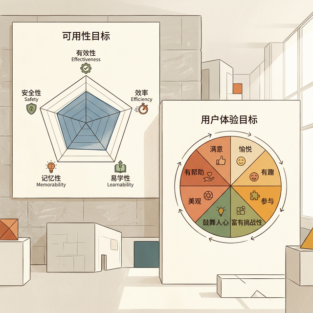
> **Scene**: 左侧为可用性目标（有效性/效率/安全性等）五边形雷达图，右侧为用户体验目标（满意/愉悦/有趣等）情感色轮图
> **List**: 可用性目标：有效·高效·安全·易学·易记 | 体验目标：满意·愉悦·有趣·有价值
> **Text**: 可用性五维 vs 体验四象限
> **Heading**: 复习——可用性与体验目标

上周我们说，交互设计有两把尺子——**可用性目标**量"用着顺不顺"，**用户体验目标**量"感受好不好"。可用性五根支柱——有效、高效、安全、易学、易记——是及格线；体验目标——满意、愉悦、有趣——是让用户从"能用"跃迁到"爱用"的催化剂。

**(Pause: 3s)**

> [VISUAL]
> **Slide**: w02-slide-01b
> **Layout**: `Split`
> *   **Asset**: 
> **Scene**: 五条设计原则的图标化卡片列表，每条配一句核心定义
> **List**: 可见性 Visibility：让用户看见能做什么 | 反馈 Feedback：让用户知道做了什么 | 约束 Constraints：让用户不能做错什么 | 一致性 Consistency：让用户不必重学什么 | 示能 Affordance：让物体自己说话
> **Text**: 五大设计原则——让物体自己说话
> **Heading**: 复习——五大设计原则

我们还握住了五把设计武器——**可见性**（让用户看见能做什么）、**反馈**（让用户知道做了什么）、**约束**（让用户不能做错什么）、**一致性**（让用户不必重学什么）、**示能**（让物体自己说话）。

> [ACTIVITY: 脑内微演习 - 办公室咖啡机]
> **Type**: `Practice`
> **Duration**: `3min`
> **Desc**: 快速情境代入测试
> `操作`：讲师描述一个日常抓狂场景，要求学生瞬间匹配对应的设计原则失误。
> `引导词`："光背定义没用，我们来做一个 10 秒钟的体检演习。想象一下你刚入职，走向茶水间那台高级的意大利全自动咖啡机。"
> "场景 1：你按下了『浓缩』键，机器毫无反应，屏幕没亮音效也没响。你不知道它是坏了还是正在加热，于是你又按了四次，结果机器突然连续出了五杯浓缩流了一地。——这是什么原则断裂？" （**反馈缺失**）
> "场景 2：机器上有一排黑色的方形平面贴片，没有突起，没有边框。你看半天都不知道这到底是装饰性的反光板，还是可以按下去的触摸按键。——这没做到什么？" （**示能微弱/可见性差**）
> "场景 3：你终于摸清了套路，长按左边第一个键是出水。第二天换了一台同品牌不同型号的机器，你长按左边第一个键，结果喷出来的是滚烫的蒸汽烫了手。——这违背了什么原则？" （**一致性破裂**）

> [!NOTE]
> **复习段** · 本段回链 **知识目标 1**：系统理解可用性五维与体验目标四象限。

刚才三个场景，你们秒判出了反馈缺失、示能微弱、一致性破裂——说明这五条原则作为"快速体检清单"非常好使。但它们只能告诉你**哪里扣分了**，却回答不了一个更深的问题。

**(Pause: 2s)**

> [VISUAL]
> **Slide**: w02-slide-01c
> **Layout**: `Comparison`
> *   **Asset**: 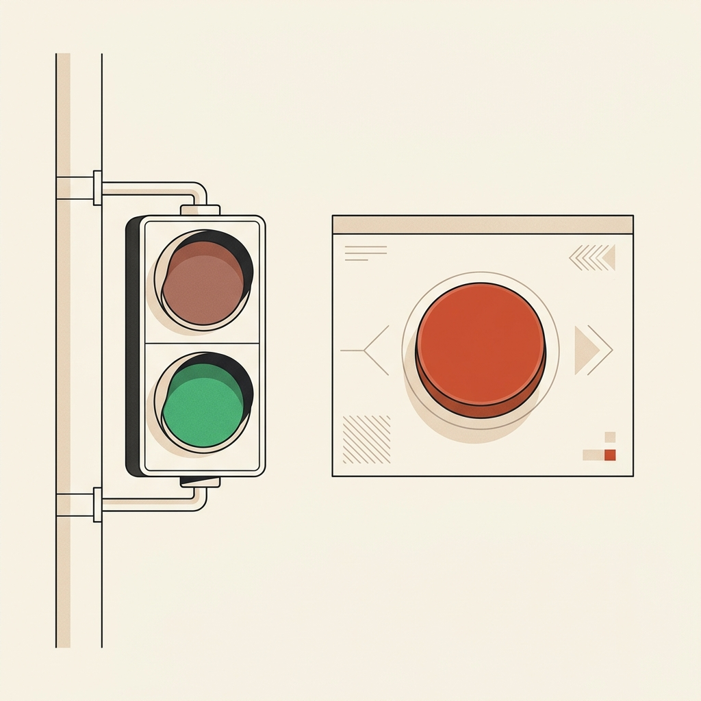
> **Scene**: 左侧为红绿灯的现实隐喻（绿行红停），右侧为违背一致性的 App 界面（红色作为确认提交按钮），呈现刺眼的认知冲突。
> **List**: 现实隐喻：红绿灯（危险与通行） | 界面反馈：违规的App（危险操作标红却作为确认）
> **Text**: 从外科查体到病理切片

还记得上周这个红绿灯案例吗？红色既当"删除"又当"确认"——我们判定它违反了一致性原则。

> [VISUAL]
> **Slide**: w02-slide-01e
> **Layout**: `Flow`
> *   **Asset**: 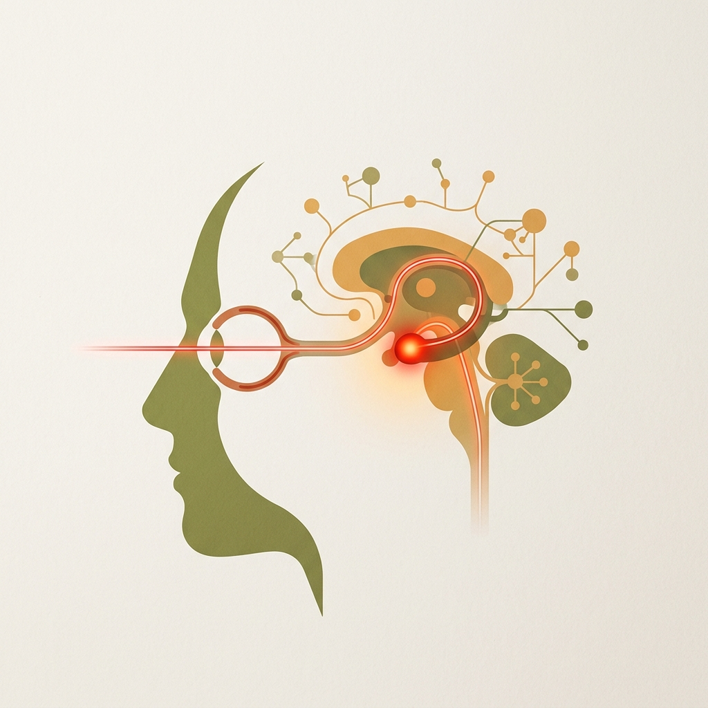
> **Scene**: 神经反射链图示，将红色的视觉信号链接到大脑杏仁核（危险应激反应）
> **List**: 视觉信号接收 | 杏仁核危机预警 | 血压升高与应激反应
> **Text**: 颜色-行为-后果的神经反射链

但清单说不清一个更要命的问题：**这个违规为什么会让用户血压飙升？** 因为红色从你出生第一天起，就被生物进化和社会文化双重编码为"停下来、危险"的预警信号。把它用作"提交"按钮，不只是违反一条规则——它在**直接触发大脑深处的应激反应**。清单可以告诉你"哪里违规"，但说不清违规究竟**动了大脑的哪根筋**。要追到这一层，就得从可用性的"外科查体"，深入到认知的"病理切片"。

> [VISUAL]
> **Slide**: w02-slide-02
> **Layout**: `Center`
> *   **Asset**: 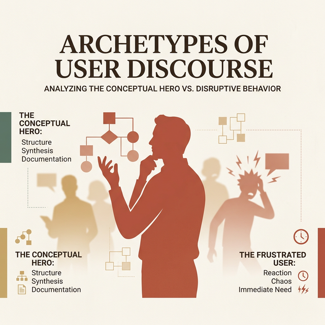
> **Scene**: 过渡页，大字"WHY?"配以模糊的抓狂用户剪影背景
> **Text**: WHY？为什么好看的产品依然抓狂
> **Heading**: 今日聚焦：为什么

今天的核心问题——**为什么那些功能完备、界面精美的产品，用起来依然让人抓狂？**

> [TEACHING MOMENT]
> 答案不在代码里，不在像素里。它藏在你的脑子里。今天，我们正式进入人类认知科学的领地。

---

## 导入：看似好用却令人抓狂 (15 min)

<!-- BUDGET: 2700 chars | STATUS: done -->

### 0.2 现状诊断：功能完备无法掩盖认知的灾难

> [VISUAL]
> **Slide**: w02-slide-03
> **Layout**: Grid
> *   **Asset**: 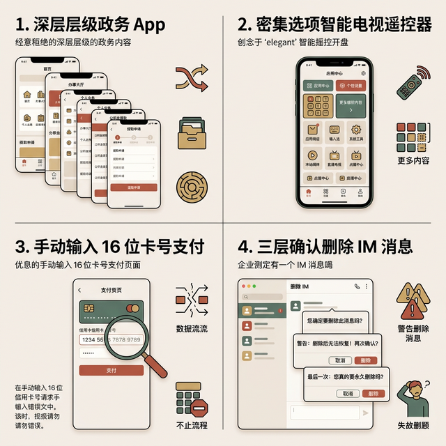
> **Scene**: 2×2 网格展示四个"看似精美但体验糟糕"的界面截图：一个层级深达五层的政务 App 首页、一个满屏密密麻麻选项的智能电视遥控器、一个需要手动输入 16 位银行卡号的支付页面、一个弹出三层确认对话框才能删除一条消息的企业 IM
> **Text**: 功能完备 ≠ 体验优秀
> **Heading**: 导入——精美却抓狂的产品
> **List**: 层级深的政务 App | 满屏键的电视遥控器 | 16 位裸卡号支付页 | 三层弹窗删消息的企业 IM

请打开你手机上最常用的三个 App。随便挑一个你**最近骂过**的操作——找了半天的设置项、莫名其妙的报错弹窗、或者一个明明简单却硬要你点击五次才能完成的流程。

**(Pause: 5s)**

> [LIFE CONNECT]
> 如果你用过 12306 的早期版本订过火车票，你一定记得那种滋味。
> 
> 验证码——扭曲的字符、杂乱的背景线、分不清 O 和 0——你的**注意力**不是花在"完成目标"上，而是花在"猜谜"上。

> [VISUAL]
> **Slide**: w02-slide-03_1b
> **Layout**: `Center`
> **Scene**: 用户面对密密麻麻、模糊不清的验证码，眉头紧锁，脑子里全是问号
> **List**: 注意力被窃取 | 目标偏移
> **Text**: 注意力的无端消耗
> *   **Asset**: 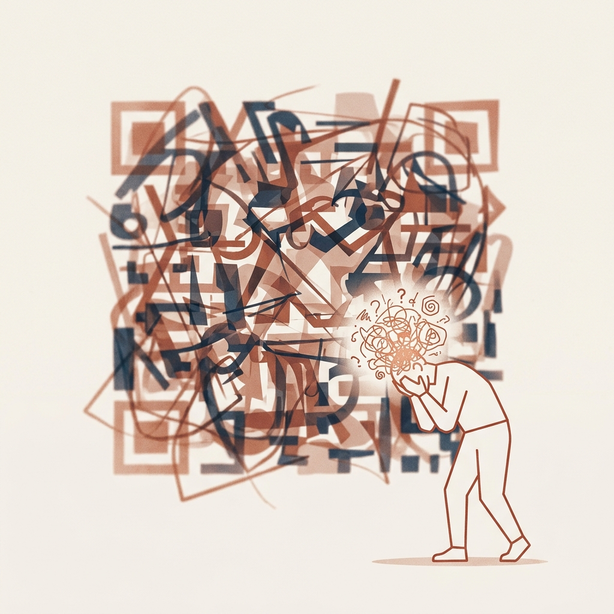

> 密码规则要求大小写字母、数字和特殊符号，还不能和最近五次密码重复——你的**工作记忆**被规则碎片塞满，腾不出"认知带宽"去思考正事。最后是 30 分钟倒计时，黄色数字一秒一秒地跳动——验证码折磨注意力，密码规则压垮记忆，倒计时制造焦虑——三板斧加在一起，把一个功能完备的系统变成了一台**认知绞肉机**。

> [VISUAL]
> **Slide**: w02-slide-03_2
> **Layout**: `Flow`
> **Scene**: 12306 早期的订票流程三道难关：视力测试验证码 -> 高负荷密码规则 -> 倒计时压迫，合成一台"绞肉机"的隐喻图形
> **List**: 注意力折磨 (验证码) | 记忆力压垮 (密码规则) | 焦虑制造 (倒计时)
> **Text**: 功能完备的认知绞肉机
> *   **Asset**: 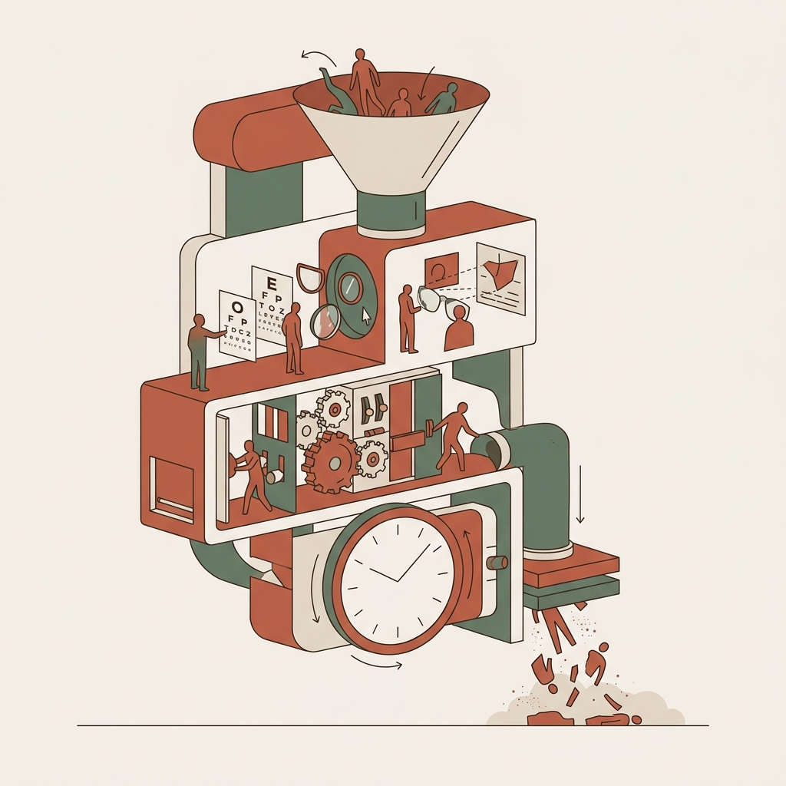

**功能完备 ≠ 体验优秀**。12306 能买到票吗？能。但在买到票之前，你的大脑已经被拧干了。类似的摩擦无处不在——**医院自助挂号机**同时显示"门诊挂号""预约挂号""当日挂号""专科挂号"四种入口，一个只想看感冒的患者，被迫做了一道关于"中国医疗行政分类体系"的判断题。

**(Pause: 3s)**

> [VISUAL]
> **Slide**: w02-slide-04
> **Layout**: `Full`
> *   **Asset**: 
> **Scene**: 全屏深色背景，中央巨大的白色文字"心智摩擦 Mental Friction"，下方小字"——当人类大脑撞上机器逻辑"
> **Text**: 心智摩擦 Mental Friction

大多数烂体验的病根不在按钮颜色或字号大小——它埋在**你的大脑里**。

<!-- [SSOT-MAIN] 心智摩擦在此为系统性展开（认知心理学视角）。W01 M01 为先导预告（灾难叙事视角）。 -->
交互设计领域有一个精准的诊断词，叫**心智摩擦**（Mental Friction）——当人类天生的认知方式，与机器冷冰冰的运行逻辑发生碰撞时，用户内心产生的那股无形阻力。哲学家海德格尔早在百年前就预见了这种断裂——他称之为从"上手状态"（工具透明）到"在手状态"（工具碍手）的坠落。心智摩擦，就是这种坠落在数字世界的复现。

> [ACTIVITY]
> **Type**: `QA`
> **Duration**: `1min`
> **Desc**: 快速检验心智摩擦直觉
> `操作`："大家刚刚听完定义，脑子里第一秒浮现出来的『心智摩擦』App 是哪个？"（开放提问 2-3 个学生）

> [VISUAL]
> **Slide**: w02-slide-04b
> **Layout**: `Comparison`
> *   **Asset**: 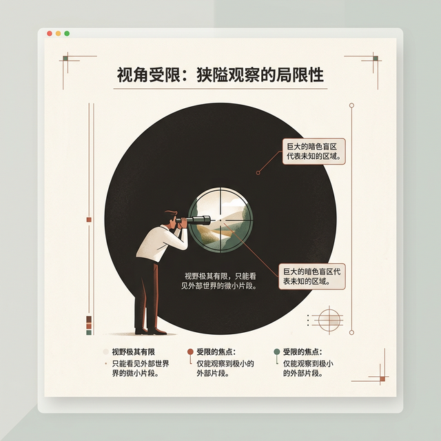
> **Scene**: 左列"快思考 System 1"——直觉/自动/不费力，配刷短视频和开车的图标；右列"慢思考 System 2"——理性/刻意/耗能，配做数学题和填税表的图标
> **List**: 快思考：刷抖音·滑解锁·语音输入 | 慢思考：填表单·学新软件·手动排版
> **Text**: 快思考 vs 慢思考——大脑的两套引擎
> **Heading**: 快思考与慢思考
> **Source**: [Don Norman](../public/assets/don_norman.png)
> **no_ai_flag**: true

要理解摩擦的根源，先认识大脑的两套引擎。诺贝尔经济学奖得主 Daniel Kahneman 将人类认知分为**系统 1（快思考）**和**系统 2（慢思考）**。快思考是直觉的、不费力的——刷短视频、滑解锁、开车上班；慢思考是刻意的、费力的——做微积分、学新软件、填报销单。

> [VISUAL]
> **Slide**: w02-slide-04b_2
> **Layout**: `Center`
> **Scene**: 大脑引擎切换的隐喻图：从轻快节能的绿色齿轮（系统1）到沉重耗能的红色重型齿轮（系统2）
> **List**: 系统1：轻快节能 | 系统2：沉重耗能 | 切换成本：意志力损耗
> **Text**: 认知引擎的切换成本
> *   **Asset**: 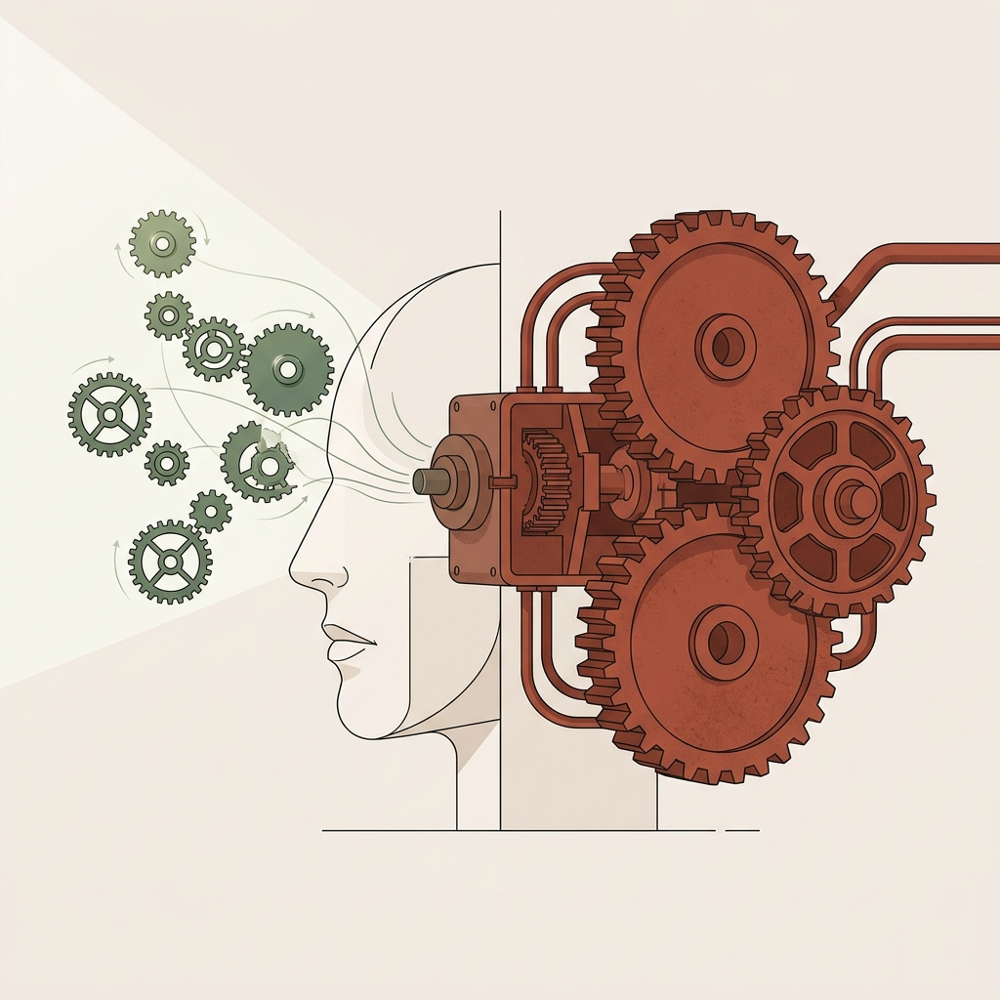

> [DID YOU KNOW: 认知税]
> Kahneman 有一个经典演示：先问"2+2 等于多少？"全场脱口而出；再问"21×19 等于多少？"全场死寂。第一题用快思考秒杀，第二题强行切入慢思考——前额叶从低能耗待机切换到全功率运算，这个过程消耗的不仅是时间，更是宝贵的**意志力**。每一次强迫用户动用慢思考，你都在征收高昂的**认知税（Cognitive Tax）**。税收得太狠，用户就会破产离开。

周五晚上刷抖音两小时不觉累（系统 1 自动驾驶），周一填报销单五分钟就烦躁（系统 2 强行启动）——同一个大脑，截然不同的能耗模式。**数字抓狂的本质：设备在不当场景下透支了稀缺的高级认知能量。**

> [VISUAL]
> **Slide**: w02-slide-04c_2
> **Layout**: `Split`
> **Scene**: 左侧是平滑顺畅的用户旅程曲线（尽量维持快思考），右侧是频繁被打断波折的认知消耗曲线（频繁跌入慢思考）
> **List**: 优质设计：维持快思考，顺滑直觉 | 糟糕设计：逼迫慢思考，消耗意志力
> **Text**: 设计的使命：减少不必要的切换
> *   **Asset**: 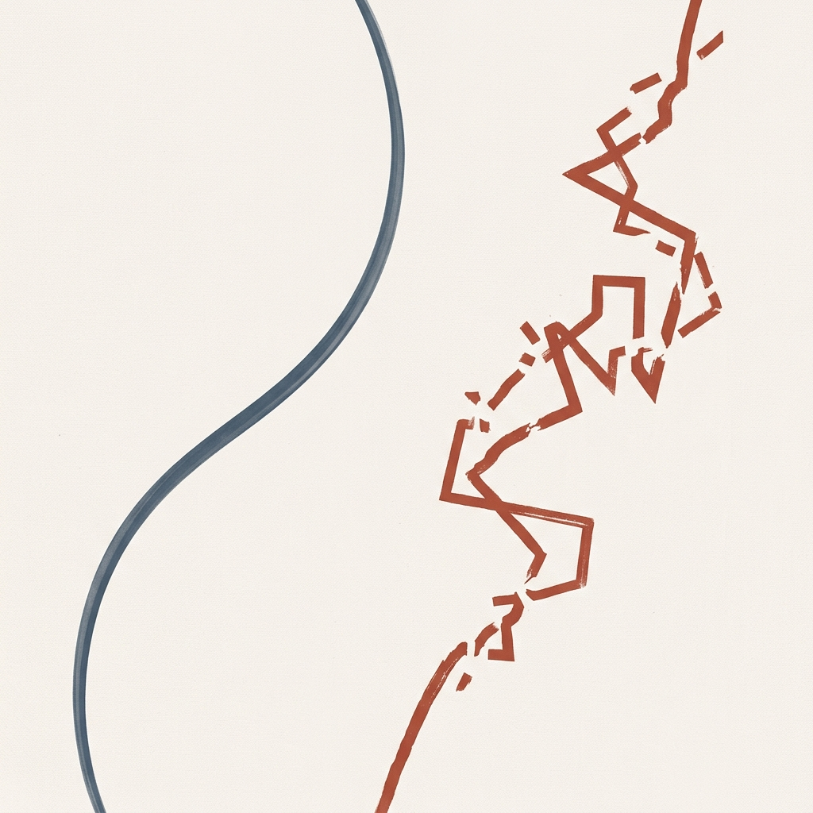

优秀的交互设计，让用户**尽可能多地停留在快思考模式**——直觉、顺滑、凭肌肉记忆推进；糟糕的设计不断制造理解障碍，**强迫用户频繁切换到慢思考**——停顿、困惑、消耗意志力。

> [ACTIVITY]
> **Type**: `QA`
> **Duration**: `2min`
> **Desc**: 认知系统快测
> `操作`：讲师快速抛出三个常见数字场景，要求学生举手回答这调用的是系统 1 还是系统 2。
> 1. "不看屏幕，单手将手机静音键拨下。"（系统1，经验/肌肉记忆）
> 2. "收到一条短信验证码，然后在 App 里找到输入框填进去。"（系统2，工作记忆/跨平台调度）
> 3. "在微信里下滑找到小程序列表。"（系统1，上手状态）

> [VISUAL]
> **Slide**: w02-slide-04d
> **Layout**: `Center`
> **Scene**: 红色高危的 `DELETE Database` 终端输入框，提示"必要的心智摩擦"
> **Text**: 驾驭必要的摩擦
> *   **Asset**: 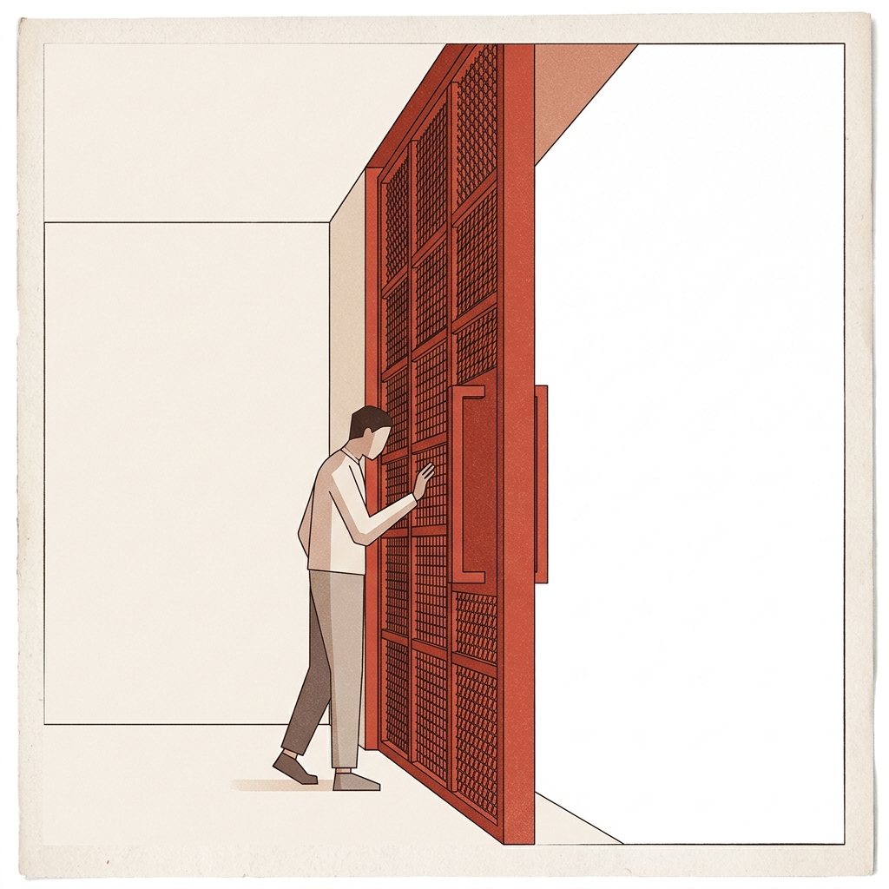

但有时候摩擦是**故意的良药**。当用户执行毁灭性操作（如清空数据库），高阶设计师会要求他在空白输入框里一字不差地打出 `DELETE Database-Production`——强行唤醒前额叶，把操作从快思考拽回慢思考。**好的设计消灭无谓的摩擦，高阶的设计驾驭必要的摩擦。**

> [TEACHING MOMENT]
> 今天这节课的核心使命，就是教你们认清并拆解心智摩擦的四大病理性根源：**认知框架的天然局限**、**意图与反馈的链路断裂**、**心理模型与实现模型的底层错位**，以及**界面隐喻的失效与用户记忆的超载**。把这些致病机制看清楚了，你才有能力拿手术刀。

我们先从根源讲起——你的大脑，究竟是怎么工作的？

---
