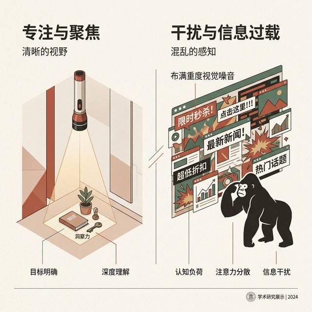
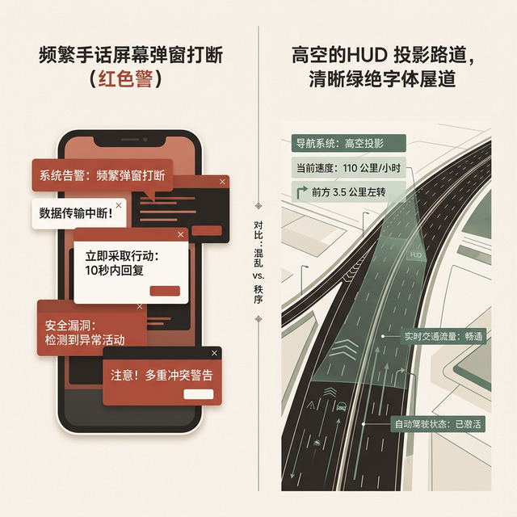
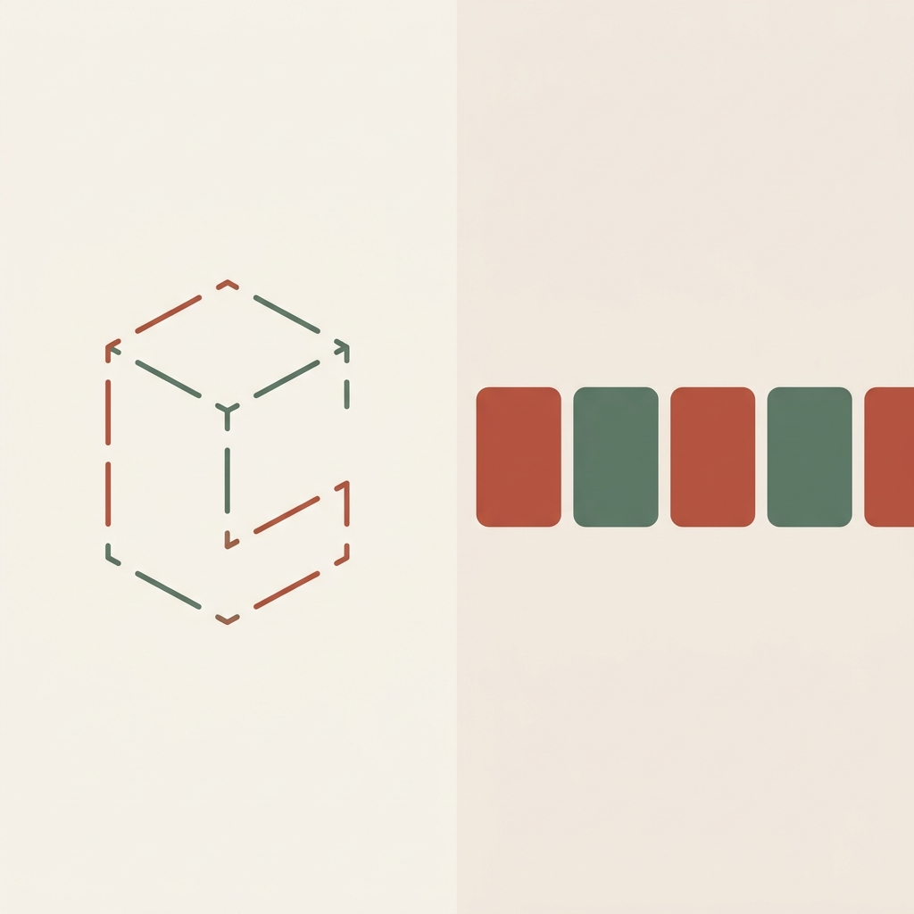
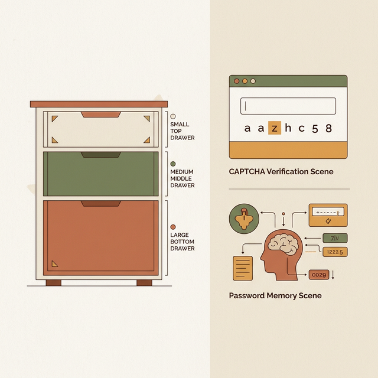
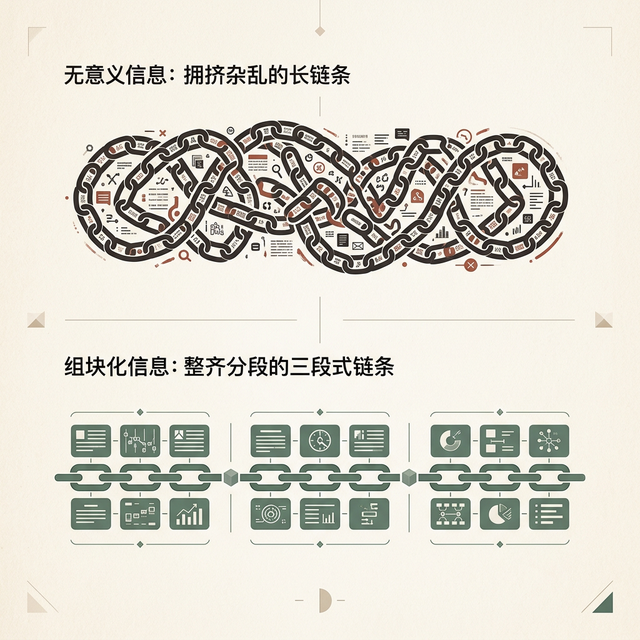
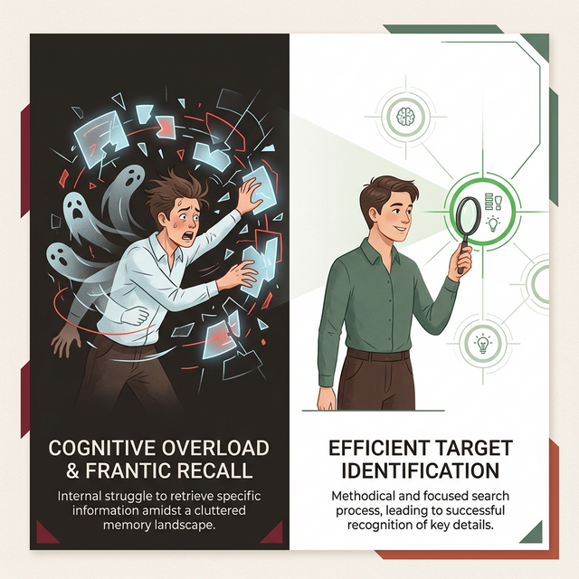
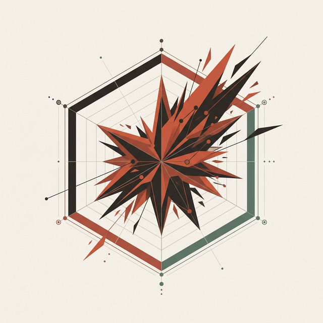

## 模块 1: 认知框架——你的大脑不是处理器 (25 min)

<!-- BUDGET: 4500 chars | STATUS: done -->

> **知识节点**: `ch04-cognitive-aspects`

> [VISUAL]
> **Slide**: w02-slide-05
> **Layout**: `Flow`
> *   **Asset**: 
> **Scene**: 一张简洁的三层金字塔图：底层"注意力 Attention"、中层"感知 Perception"、顶层"记忆 Memory"，每层配有微型图标（眼睛/拼图/硬盘），箭头从底层向上贯穿
> **Text**: 大脑的三道滤网

### 1.1 注意力漏斗：大脑皮层的探照灯

要理解心智摩擦，我们得先搞清楚大脑处理信息的基本管线。从纷繁复杂的物理世界到你的意识深处，一切信息都要闯过三道极其严苛的滤网。

第一关，叫**注意力**。

人类的注意力不是探照灯，不是均匀地照亮整个世界。它更像一根**手电筒**——光束极窄，打在哪里，哪里才有光，其余的全是黑暗。认知心理学管这叫**选择性注意**（Selective Attention）。你不能"同时注意所有事"，这是大脑为了节省能量进化出的生存本能。

> [CASE STUDY: 看不见的大猩猩]
> 1999 年，伊利诺伊大学的 Daniel Simons 和 Christopher Chabris 做了一个著名实验（Simons & Chabris, 1999, *Perception*）：他让受试者数视频里穿白衣服的人传了几次球。结果精确数据是——**46% 的受试者**完全没有注意到视频中间有一个穿黑色大猩猩套装的人大摇大摆走过画面，停留了整整 9 秒钟，还对着镜头拍了拍胸膛。接近一半的人，对一个 9 秒钟的黑色大块头视而不见。这就是"非注意盲视"——Inattentional Blindness——的经典实验证据。你的大脑不是没"看见"，而是主动选择了"忽略"。

**(Pause: 3s)**

> [VISUAL]
> **Slide**: w02-slide-05b
> **Layout**: Split
> *   **Asset**: 
> **Scene**: 左侧是极窄手电筒光束照亮一小块区域；右侧是一个布满重度视觉噪音的网页横幅，横幅外有一个大猩猩剪影
> **List**: 1️⃣ 选择性注意 (Selective Attention) | 2️⃣ 非注意盲视 (Inattentional Blindness) | 3️⃣ 横幅盲视 (Banner Blindness)

如屏幕左侧的视觉隐喻所示，这件事告诉我们一个残酷的设计事实：**你放在界面上的每一个元素，都在和其他元素争夺用户那根手电筒的光束**。当信息太多、视觉刺激太密集的时候，用户不是"看漏了"——是大脑的生存本能帮他**主动屏蔽**了。

> [CASE STUDY: Banner Blindness]
> 这种屏蔽在网页设计中有一个专门的名字：**横幅盲视**，Banner Blindness。Nielsen Norman Group 2018 年的眼动追踪研究给出了冰冷的数据：用户在 **65% 的情况下**完全没有注视广告位区域——即使那里放的是关键功能入口或重要通知。用户通过元素的尺寸、形状和位置来判断"这看起来像广告"，然后大脑的选择性注意机制会自动将其屏蔽。更讽刺的是，动态闪烁的横幅比静态横幅更容易被忽略——你越拼命闪，用户越坚决地不看。这意味着，注意力的分配不是由设计师决定的，而是由用户的**生存直觉**和**习惯模型**共同决定的。

**(Pause: 3s)**

更棘手的是注意力的**切换成本**。美国心理学会（APA）综述了大量任务切换研究后指出：频繁在认知任务之间切换，生产力损失最高可达 **40%**。这不是比喻，是实证数据。切换过程涉及两步认知操作——"目标转移"（决定做另一件事）和"角色激活"（加载新任务的规则）——每次切换都要消耗大脑极为稀缺的执行控制资源。

教材引用了一项研究发现，一边阅读教材一边收发即时消息的学生，完成相同阅读量所花的时间比不受打扰的学生多出了约 **50%**。你以为自己在同时做两件事，但人脑根本不支持真正的并行处理（Multitasking）——只有约 **2.5%** 的人口是所谓的"超级多任务者"（Supertaskers）。对于剩下的 97.5% 的人类来说，"多任务处理"其实只是在极其快速地**切换注意力**。

这就是为什么弹出式打断（如应用内评分弹窗）如此有害。每当你用一个弹窗打断用户的核心任务流，你不仅偷走了他们的时间，更偷走了他们重建认知状态需要消耗的血压与意志力。

> [VISUAL]
> **Slide**: w02-slide-05c
> **Layout**: Split
> *   **Asset**: 
> **Scene**: 左侧展示手机屏幕频繁弹窗打断（红色告警）；右侧展示高空 HUD 投影路面，绿色字体清晰叠加
> **Text**: 顺应注意力的漏斗

这就引出了我们如何解决它的问题。请看右侧幻灯片。

> [CASE STUDY: 高德地图的 HUD 与绿波模式]
> 怎么顺应而不是对抗注意力的漏斗？看看车载导航系统。驾驶是一个极高视觉负荷的任务，司机的"注意力手电筒"必须锁定在前方路面上。高德地图的 HUD（平视显示器）模式，将最重要的导航箭头和车速直接投影在挡风玻璃上，就是为了让司机**不转移视线就能分配注意力**。近期推出的"绿波路段"提示——用语音告诉你"保持 50km/h 就能一路绿灯"——更是直接将信息从已经过载的**视觉通道**转移到了空闲的**听觉通道**，完美避开了注意力的单通道拥挤危机。

注意力筛下来的信息，进入第二道滤网。记住这个核心洞察：**感知不是在被动地接收世界，而是在主动地构建世界。**

> [ART/AESTHETICS]
> 著名的美国"光与空间运动"先驱，当代艺术家**詹姆斯·特瑞尔（James Turrell）**甚至把这一机制变成了艺术。他有一个全球著名的天光装置系列《Skyspaces》——在一个纯白的房间顶部切出一个正方形的洞，让观众看天空。因为剔除了树木、楼房等所有的参照物边界，当你盯着那块天空看时，你的大脑会因为"缺乏上下文关联法则"而陷入崩溃，天空看起来不再是高高在上的苍穹，而是一块触手可及的二维蓝色实体发光板。特瑞尔利用人类"感知的主观构建性"证明了：只要改变外部参照，大脑就会乖乖地重构现实。

明白了感知是构建出来的，我们来看人类最常用的大脑"构建外挂"——**格式塔（Gestalt）**原则。

> [VISUAL]
> **Slide**: w02-slide-06
> **Layout**: Grid
> *   **Asset**: 
> **Scene**: 2×3 网格展示格式塔六大原则的简洁图示：邻近性（分组的点阵）、相似性（颜色分组的形状）、连续性（交叉的曲线）、闭合性（缺口圆形）、图形-背景（鲁宾花瓶）、共同命运（同向箭头群）
> **List**: 邻近 Proximity | 相似 Similarity | 连续 Continuity | 闭合 Closure | 图形与背景 Figure-Ground | 共同命运 Common Fate

### 1.2 自动拼图：格式塔的潜意识感知

通过了注意力的筛选之后，信息进入第二关——**感知**。

你的大脑不是按像素读取世界的。它天生就是一个贪心的**模式识别机器**，拼命地要在混乱的视觉输入中找到秩序。100 多年前，德国心理学家们发现了这个规律，取了一个名字叫**格式塔原则**，Gestalt Principles。

我们来逐条拆解这六大原则，看看每一条是怎么直接指导甚至宣判你的界面生死的：

- **邻近性（Proximity）**：放得近的东西，大脑会自动认为它们是一伙的。你看看任何一个表单设计——标签（Label）和输入框（Input）靠得越近，用户就越清楚谁属于谁。反例是什么？把"确认密码"的标签放在上一行输入框的正下方、下一行输入框的正上方——等距排列——用户就会犹豫：这个标签到底属于上面还是下面？这就是邻近性失效制造的微小摩擦。

- **相似性（Similarity）**：长得像的东西，大脑会归为同类。你看 iOS 的设置页面——蓝色图标的全是苹果自带工具集，绿色图标的全是通信与网络状态类。你不需要读文字就能区分类别。所有可点击的按钮如果都采用 8px 圆角和微弱背景色，用户一看就知道"这些都能按"。反过来，如果你把一段极度普通的不可点击文本设成蓝色加下划线，用户会条件反射地去点它——因为它长得像自古以来的超级链接，你打破了相似性预期。

> [VISUAL]
> **Slide**: w02-slide-06b
> **Layout**: Split
> *   **Asset**: 
> **Scene**: 左侧展示一个 80% 满的进度条和因为强迫症渴望闭合而伸出的虚拟手；右侧展示一个画廊（Carousel）露出的 10% 下一张图的边缘
> **List**: 闭合的内在渴望 | 连续的无声指令

仔细观察大屏幕上左侧和右侧的两个典型案例：

- **闭合性（Closure）**：大脑痴迷于"补完"不完整的图形。一个缺了角的圆，你仍然会把它看成圆。屏幕左侧的进度条之所以有效，就是利用了大脑对"闭合"的**强迫性渴望**——你看到一个 80% 的进度条，大脑会产生一种"差一点就满了"的内在瘙痒，驱动你完成最后的注册步骤。

- **连续性（Continuity）**：人会倾向于把视觉元素看成沿着连续路径排列的。为什么横向滑动的画廊（Carousel）要故意在这张图的右侧**露出下一张图的 10% 边缘**？那不是没排好版，那是如屏幕右侧展示的利用连续性原则，给用户的视觉系统下达一个无声的指令："这里还没完，请向左划"。

- **图形与背景（Figure-Ground）**：大脑会瞬间把视觉场景分为前景的"图形"（你关注的焦点）和后景的"背景"（被忽略的环境）。模态对话框（Modal Dialog）为什么要把背后的主页面变灰或用毛玻璃模糊掉？就是利用图形-背景原则，让弹窗成为整个认知域里唯一的"图形"，把原本凌乱的主界强行降维成"背景"，迫使用户的注意力**强制锁定在一点**。

- **共同命运（Common Fate）**：一起运动的物体会被视为一个整体。当你在 iOS 主屏幕向右滑动，一整层的 App 图标以绝对相同的加速度和轨迹一起滑出屏幕——大脑瞬间认定，这一屏幕里的所有图标是一个共同体。这就是为什么动效设计中，关联信息出现的时间和节奏必须完全一致的原因。

> [DID YOU KNOW]
> 格式塔——Gestalt——这个德语单词没有准确的英文对等词。它大致的意思是"整体形态"——暗示人类理解事物的方式永远是"整体先于部分"，而非把零件一个个拼起来。这恰恰解释了为什么"拍脑袋加功能"的堆砌式设计注定失败——用户理解的不是你的功能列表，是你的**整体印象**。

因为你的大脑不是硬盘，它是极易挥发的动态 RAM。设计的一项核心义务就是：**帮助用户外接这部分极易过载的工作记忆**。

> [DID YOU KNOW: 阿波罗 11 号 1202 警报与认知防线的终极胜利]
> 让我们把认知负荷的极限测试放在一个最极端的场景里：1969 年 7 月 20 日，人类首次登月。
> 当阿波罗 11 号登月舱（登月舱代号"鹰"）距离月球表面只有不到 10000 英尺，阿姆斯特朗和奥尔德林正处于人类历史上最高压、认知负荷即将爆表的着陆阶段时。突然，导航计算机的主警报灯亮起，屏幕上闪烁着陌生的代码：`1202 Program Alarm`。
> 注意力管线瞬间被劫持。几秒钟后，又闪电般暴露出新的 `1201 Alarm`。此刻，两位宇航员的视觉感知系统被满屏报警信号充斥，而他们的短时记忆里根本没有关于 1202 代表什么的知识（因为这是一次极其罕见的交会雷达误开启导致的数据溢出错误）。
> 按照常规航空界面的逻辑，系统遇到不明致命错误，宇航员应该立刻中止着陆并按下逃逸按钮。如果当时这台阿波罗制导计算机（AGC）的设计师采用的是"一旦资源耗尽就全盘崩溃"的实现模型，人类的首次登月就在距月表几千英尺的地方以耻辱的逃逸告终了。
> 但 MIT 的系统设计先驱玛格丽特·汉密尔顿（Margaret Hamilton）在设计这套软件时，极其天才地考虑到了一种"认知与计算系统双重过载"的兜底方案——**异步优先级调度引擎**。当雷达传来的无用数据填满内存产生 1202 警报时，这台仅有几兆赫兹可怜算力的计算机并没有死机，它只是通过简陋的界面向宇航员诚实地抱怨："我已经完全超载了！"但与此同时，它在底层自动**切断了所有低优先级的非关键计算任务**，把全部算力仅仅保留给了维持登月舱姿态和控制下降引擎的 P63 着陆程序。
> 地面控制中心的年轻工程师史蒂夫·贝尔斯（Steve Bales）在关键的三秒钟内做出了判断，通过无线电向登月舱大喊："我们在 1202 警报下可以继续！我们对该警报放行（We're Go on that alarm）！"
> 在这场惊心动魄的历史时刻中，人类和机器同时面临着由于大量意外并发信息涌入而造成的**记忆和注意力缓冲区溢出**。但正是因为伟大的工程界面设计提前在逻辑底座里预置了一种**"降级运行但保持核心心流完全可见的宽恕度"**的系统反馈，他们硬生生抗住了这次生死存亡的认知风暴。这就是我们在谈论"认知防线"时，最高级别的设计信仰：即便在系统的极端盲穿状态下，你也要通过界面的宽容性，赋予操作者最核心、最高意图的存活通道。

**(Pause: 3s)**

以上就是人类认知的三个自然生理限制。面对这套自带缺陷的出厂配置，体验设计师无法篡改人类基因去扩充脑容量，唯一能做的是在这个先天框架下游刃有余地布置缓冲垫与指示牌。

> [VISUAL]
> **Slide**: w02-slide-07
> **Layout**: Split
> *   **Asset**: 
> **Scene**: 左侧为三层抽屉柜示意图——顶层小抽屉标注"感觉记忆 ~0.5s"、中层标注"工作记忆 ~30s / 7±2 块"、底层大抽屉标注"长期记忆 ∞"，右侧展示一个验证码输入场景和一个密码记忆场景
> **List**: 感觉记忆 ≈ 0.5s | 工作记忆 ≈ 30s · 容量 7±2 | 长期记忆 ≈ 永久

注意力筛完、感知拼完，最后通关的信息才有机会进入**记忆**。

但记忆可不是一个大硬盘。它至少分三层。

**感觉记忆**只撑半秒钟——你的视网膜闪过的图像、耳朵掠过的声音，一晃就没。**长期记忆**容量近乎无限，但存取速度极慢——想想你上次回忆高中同学名字用了多久。

而交互设计最关注的，是夹在中间的那层——**工作记忆（Working Memory）**。它是用来做推理和决策的暂存区，是大脑真正的 CPU 缓存。

1956 年，认知心理学家 George Miller 发表了一篇改变历史的论文，标题就叫《神奇的数字 7±2》。他发现，人类的工作记忆同一时间只能处理大约 **7 个**（上下浮动 2 个）独立的信息块。后来的认知神经科学利用 fMRI 成像技术把这个数字修正得更保守、更残酷——在没有重度排练的情况下，纯粹的工作记忆可能只能容忍大约 **4 个**组块（chunk）同时存活。

> [VISUAL]
> **Slide**: w02-slide-07c
> **Layout**: `Comparison`
> *   **Asset**: 
> **Scene**: 对比图。上方是一串无意义的 11 位数字（被红叉标示）；下方是 3-4-4 分段的手机号码（被绿色对勾标示）
> **Text**: Chunking 视觉与逻辑的降维

这也是为什么如屏幕上对比图展示的小技巧能完全拯救糟糕体验：

> [TECH NOTE: Chunking 组块化]
> Miller's Law 的「7±2」是被误解最深的理论之一。很多人以为它指的是"界面上只能放七个按钮"。错。Miller 说的容量单位是 **chunk（信息块）**——大脑能够赋予其**单一意义的组合单元**。
>
> 举个致命的例子。一串随机数字 `1-3-0-2-2-5-8-1-9-8-4` 有 11 个独立数位，对大脑来说是 11 个 block，直接**爆内存**。
> 但如果你把它按 3-4-4 的节奏空开：`130 2258 1984`，并且发现它是一个手机号，它就瞬间变成了 **3 个 chunk**，你的大脑就能在 10 秒钟内背下来。
> **设计的本质，很大程度上就是帮用户在这个界面上做视觉和逻辑的 chunking。**

> [CASE STUDY: 银行卡与验证码的输入灾难]
> 这个心理学原理是如何切切实实影响千万级用户的呢？去看看各大银行的 App 吧。那些老旧的系统，在让你输入 16 到 19 位银行卡号时，是一个没有任何空格的长文本框。你的眼睛需要在卡片和屏幕之间来回四五次，每次看个 3-4 位数，然后战战兢兢地核对。一旦输错一位，满盘皆输。
> 而优秀的现代支付组件怎样做？**自动 4 位分段**。你敲到四位数，它自动帮你敲一个空格：`6222 0212 3456 7890`。四个独立数字被捆绑成了一个视觉 Chunk，大大降低了工作记忆刷新时丢失比特的概率。短信验证码同理，为什么从早期的 6 位紧密排列变成了现在常见的 4 位分开输入框？全都是在向这可怜的"4个组块"低头。

换句话说，你的工作记忆就像一张只能贴 4 张便签纸的小桌子。旧的还没处理完，新的又来了，大脑就**崩溃**了。

> [VISUAL]
> **Slide**: w02-slide-07d
> **Layout**: `Comparison`
> *   **Asset**: 
> **Scene**: 左侧是满屏纯黑的命令行界面，一个人正抓狂地背诵命令；右侧是现代 GUI 放大镜图标和搜索框
> **Text**: 让用户看到线索，而不是背诵咒语

如大屏幕上的对比所揭示的，图形界面相比命令行有降维打击的优势。

> [TECH NOTE: 识别胜于回忆 Recognition over Recall]
> 为了拯救这张小小的"便签桌"，交互设计史上诞生了一条最伟大的金科玉律：**让用户去"识别"（Recognition），而不是"回忆"（Recall）。**
>
> 什么是回想？回想是你必须从大脑深处的长期记忆库里，生生地打捞出一条毫无线索的信息。比如在命令行界面（CLI）时代，你想在文件夹里找一个包含 "error" 这个词的日志文件，你必须在大脑里凭空回想出一长串咒语：`grep -r "error" /var/log/`。少一个空格，少一个横杠，系统就拒绝执行。这极度消耗脑力。
> 什么是识别？识别是你看到一个视觉线索，唤起了记忆。比如在今天的图形界面（GUI）里，你不需要背诵咒语，你只需要**看到**右上角有一个放大镜图标，**点击**它，然后在搜索框里输入 "error"。
> 
> **GUI（图形界面）之所以在上世纪 80 年代掀起计算革命，根本原因不是因为它"好看"，而是因为它把计算机的交互模式从"强制回忆"降维成了"轻松识别"。**
> 这是生物学决定的。人类的视觉识别皮层经过了几百万年的进化，极度发达——你可以在 0.1 秒内从人群中认出一张老同学的脸（识别），但你可能憋了 3 分钟也叫不出他的名字（回想）。如果你的系统依赖用户凭空背诵快捷键、记住复杂的文件路径、或者在没有任何提示的搜索框里猜测关键词，你就是在公然对抗人类的生物学本能。

和工作记忆容量密切相关的，还有一条叫 **Hick's Law（席克定律）** 的法则——**选项越多，决策时间越长**。注意，这和 Miller's Law 说的不是一回事。Miller 说的是你能同时"捏住"多少个小球不掉下来，Hick 说的是你在面对一堆小球时"挑出一个特定的球"有多慢。
Hick's Law 的公式是：决策时间 ≈ a + b·log₂(n + 1)，其中 n 是选项数量。也就是说，从 2 个选项增加到 4 个，决策时间的增长不到一倍；但从 4 个增加到 32 个，决策时间将呈对数级暴涨。这就是为什么**渐进式披露（Progressive Disclosure）**如此重要——这也是 Apple 设计哲学中最爱用的一招：不要一次性把 50 个高级设置项平铺给用户，而是只显示最常用的 5 个，然后给一个"高级选项..."的折叠入口。把复杂的选项藏在第二层，也就是用空间换取了用户宝贵的认知时间。

> [VISUAL]
> **Slide**: w02-slide-07b
> **Layout**: `Flow`
> *   **Asset**: 
> **Scene**: 展示 NASA-TLX 任务负荷指数的六边形雷达图，各个维度用醒目的颜色标出异常峰值，图示一个"糟糕表单"如何在这个雷达图上爆表
> **List**: 脑力需求 MD | 体力需求 PD | 时间压力 TD | 自我绩效 OP | 努力程度 EF | 挫败感 FR

认知心理学还有一个终极的度量方式：**认知负荷（Cognitive Load）**。简单来说，它衡量的是当前任务对你那台可怜"工作记忆 CPU"的占用率。
早在 20 世纪 80 年代，NASA（美国宇航局）为了评估宇航员在驾驶航天飞机时的极限状态，开发了一个标准化的主观评估工具，叫 **NASA-TLX（任务负荷指数）**。这个模型至今被交互设计界奉为圭臬。它用六个残酷的维度来量化一个人的认知负荷水平：
1. **脑力需求（Mental Demand）**：思考、计算、记忆、查找的量有多大？（填 100 项的问卷）
2. **体力需求（Physical Demand）**：点击、滑动、拖拽有多费劲？（需要在屏幕两端来回长距离移动鼠标）
3. **时间压力（Temporal Demand）**：时间给人的紧迫感？（支付界面的 30 秒倒计时）
4. **自我绩效（Performance）**：用户觉得自己做得好不好？（没提示哪里填错了，用户感到自己很蠢）
5. **努力程度（Effort）**：为了达到上述绩效，用户付出了多大努力？
6. **挫败感（Frustration）**：操作过程中感到的不安全、气馁、愤怒或压力有多大？

对合格的日常产品设计师来说，降低系统固有的认知负荷几乎是所有可用性优化的**元目标**。而对高等级产品的设计师（比如医疗设备、核电站控制台、飞行 HUD 控制系统）来说，确保系统界面在极端高压下**绝不能引发认知超载**，是底线中的底线。

**(Pause: 3s)**

这三道滤网——注意力的极度狭窄、感知的强行拼图癖、工作记忆的极小容量池——就是人类认知系统的天然局限，是我们作为生物出厂时就锁死的硬件参数。所有的心智摩擦，归根结底，都是因为不学无术的产品设计**胆敢违背这三条生理铁律**。

明白了人脑的底层操作系统，我们就可以开始看它是怎么被糟糕的机器界面给"卡住"的了。第一个致命卡点，发生在人类隐秘的意图与系统冰冷的反馈这两者交汇的**链路**上。

---
