## 模块 1: 认知框架——你的大脑不是处理器 (25 min)

<!-- BUDGET: 4500 chars | STATUS: done -->

> **知识节点**: `ch04-cognitive-aspects`

### 1.0 认知机制：三道滤网构筑心智底座

> [VISUAL]
> **Slide**: w02-slide-05
> **Layout**: `Flow`
> *   **Asset**: 
> **Scene**: 一张水平方向的连续过滤通道（流水线）示意图：信息流从左侧涌入，依次穿过三道并排的滤网/闸门（第一道"注意力 Attention"、第二道"感知 Perception"、第三道"记忆 Memory"），每一层配有微型图标（眼睛/躯体/大脑）。向右每经过一道滤网，信息量剧烈衰减。
> **List**: 注意力（眼睛筛选外部事物） | 感知（身体解读感官意义） | 记忆（大脑暂存认知推理）
> **Text**: 三道核心生理滤网
> **Heading**: 三道认知滤网

从物理世界到意识深处，一切信息必须依次闯过三道核心滤网：

- **注意力（Attention）**：第一道外部守门人。负责筛选物理世界中庞杂的环境信号，决定**眼睛**等视觉器官能捕捉到哪些外部事物。
- **感知（Perception）**：第二道身体翻译机。负责将捕捉到的光影声波，转化为能被**身体**感官解读并产生直觉反应的物理意义。
- **记忆（Memory）**：第三道认知便签桌。负责将身体送来的意义交由**大脑**进行深度推理和逻辑暂存，但其容量极小且极易挥发。

这三道生理“滤网”，正是界面心智摩擦频发的物理底座。

### 1.1 选择注意：注意力是一束极窄的手电光

> [VISUAL]
> **Slide**: w02-slide-05_1
> **Layout**: `Center`
> **Scene**: 一张从广阔森林（物理世界）到细小锁孔（注意力通道）的漏斗示意图，暗示信息被急剧压缩
> **List**: 物理世界的全量信息 | 选择性注意的狭窄通道
> **Text**: 注意力：过滤与压缩的开端
> *   **Asset**: 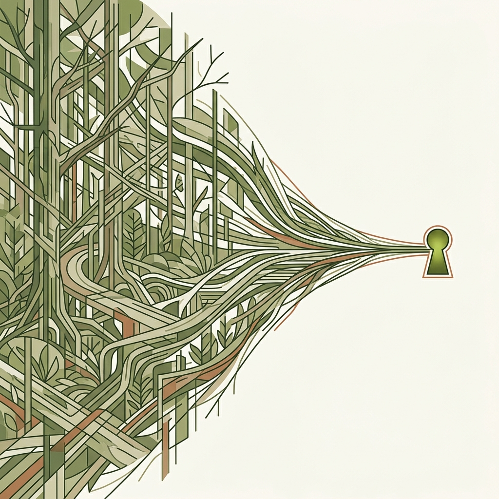

要理解心智摩擦，我们得先搞清楚大脑处理信息的基本管线。从纷繁复杂的物理世界到你的意识深处，一切信息都要闯过三道极其严苛的滤网。

> [VISUAL]
> **Slide**: w02-slide-05_2
> **Layout**: `Center`
> **Scene**: 聚光灯隐喻：黑暗的舞台上只有一束极窄的聚光灯打在主角身上，其余部分完全隐没在黑暗中
> **List**: 选择性注意 | 生存本能过滤
> **Text**: 注意力是一束极窄的手电光
> *   **Asset**: 

第一关，叫**注意力**。

人类的注意力不是探照灯，不是均匀地照亮整个世界。它更像一根**手电筒**——光束极窄，打在哪里，哪里才有光，其余的全是黑暗。认知心理学管这叫**选择性注意**（Selective Attention）。你不能"同时注意所有事"，这是大脑为了节省能量进化出的生存本能。

> [VISUAL]
> **Slide**: w02-slide-05_3
> **Layout**: `Full`
> **Asset**: 
> **Scene**: 播放《看不见的大猩猩》经典实验视频：6个人互相传球，中间穿梭着大猩猩
> **Text**: 选择性注意与非注意盲视
> **Source**: `Video` — Simons & Chabris 经典实验
> **Duration**: `0m45s`
> **TimeCategory**: `activity`

> [CASE STUDY: 看不见的大猩猩]
> 1999 年的经典「看不见的大猩猩」实验中：受试者被要求专注数视频里穿白衣服的人传了多少次球。结果令人震惊——**46% 的受试者**完全没有注意到视频中间有一个穿黑色大猩猩套装的人大摇大摆走过画面。接近一半的人，对一个停留了 9 秒的黑色大块头视而不见。这就是"非注意盲视"（Inattentional Blindness）的经典实验证据。你的大脑不是没"看见"，而是主动选择了"忽略"。

**(Pause: 3s)**

> [VISUAL]
> **Slide**: w02-slide-05b
> **Layout**: Split
> *   **Asset**: 
> **Scene**: 左侧是极窄手电筒光束照亮一小块区域；右侧是一个布满重度视觉噪音的网页横幅，横幅外有一个大猩猩剪影
> **List**: 1️⃣ 选择性注意 (Selective Attention) | 2️⃣ 非注意盲视 (Inattentional Blindness) | 3️⃣ 横幅盲视 (Banner Blindness)
> **Text**: 注意力的窄光束与盲视陷阱

这件事告诉我们一个残酷的设计事实：**你放在界面上的每一个元素，都在和其他元素争夺用户那根手电筒的光束**。当信息太多、视觉刺激太密集的时候，用户不是"看漏了"——是大脑的生存本能帮他**主动屏蔽**了。

> [VISUAL]
> **Asset**: 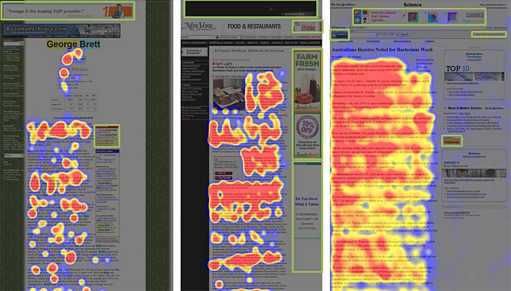
> **Layout**: `Full`
> **no_ai_flag**: true

> [CASE STUDY: Banner Blindness]
> 这种屏蔽在网页设计中有一个专门的名字：**横幅盲视**（Banner Blindness）。眼动追踪研究给出了冰冷的数据：用户在 **65% 的情况下**完全没有注视广告位区域——即使那里放的是关键功能入口或重要通知。用户通过元素的尺寸、形状和位置来判断"这看起来像广告"，然后大脑的选择性注意机制会自动将其屏蔽。更讽刺的是，动态闪烁的横幅比静态横幅更容易被忽略——你越拼命闪，用户越坚决地不看。这意味着，注意力的分配不是由设计师决定的，而是由用户的**生存直觉**和**习惯模型**共同决定的。

**(Pause: 3s)**

> [VISUAL]
> **Slide**: w02-slide-05b_2
> **Layout**: `Flow`
> **Scene**: 具象的生活隐喻：一个学生正试图一边看厚重的教材，一边用手机回复消息。每当他的视线在书本和手机之间切换时，头顶就会出现一个沉重的红色“Loading...”进度条图标，直观展现大脑在两项任务间来回跳转时所经历的严重卡顿与“重载损耗”。
> **List**: 目标转移延迟 | 规则重新激活 | 生产力断崖式下跌
> **Text**: 任务切换的高昂成本
> *   **Asset**: 

更棘手的是注意力的**切换成本**。美国心理学会 APA 综述了大量任务切换研究后指出：频繁在认知任务之间切换，生产力损失最高可达 **40%**。这不是比喻，是实证数据。切换过程涉及两步认知操作——"目标转移"（决定做另一件事）和"角色激活"（加载新任务的规则）——每次切换都要消耗大脑极为稀缺的执行控制资源。

教材引用了一项研究发现，一边阅读教材一边收发即时消息的学生，完成相同阅读量所花的时间比不受打扰的学生多出了约 **50%**。你以为自己在同时做两件事，但人脑根本不支持真正的并行处理（Multitasking）——只有约 **2.5%** 的人口是所谓的"超级多任务者"（Supertaskers）。对于剩下的 97.5% 的人类来说，"多任务处理"其实只是在极其快速地**切换注意力**。

> [VISUAL]
> **Slide**: w02-slide-05d
> **Layout**: `Comparison`
> *   **Asset**: 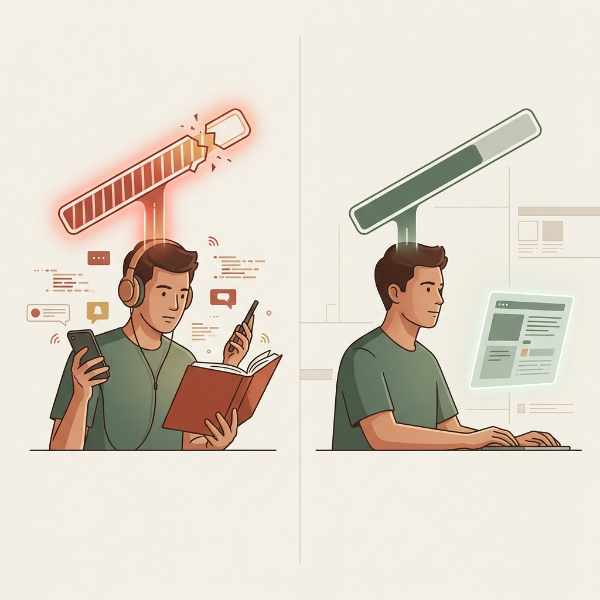
> **Scene**: 对比图。左列标题"多任务幻觉"——一个人同时看书、刷手机、听耳机，大脑中间的 CPU 进度条爆红至 100%；右列标题"单任务专注"——同一个人排除干扰、专注单屏，CPU 进度条稳定绿色 60%，旁边标注 APA 研究数据"切换损失高达 40%"
> **List**: 多任务幻觉 → 任务切换 → 生产力 -40% | 单任务专注 → 深度心流 → 效率最大化
> **Text**: 注意力切换的生产力代价

这就是为什么弹出式打断（如应用内评分弹窗）如此有害。每当你用一个弹窗打断用户的核心任务流，你不仅偷走了他们的时间，更偷走了他们重建认知状态需要消耗的血压与意志力。

> [VISUAL]
> **Slide**: w02-slide-05c
> **Layout**: Full
> *   **Asset**: 
> **Source**: `Video` — Bilibili (高德地图 HUD 绿波模式)
> **Duration**: `0m39s`
> **TimeCategory**: `activity`
> **Scene**: 视频演示高德地图的 HUD 投影效果以及绿波路段的语音播报提示。
> **Text**: 顺应注意力的漏斗：听觉与 HUD 分流

> [CASE STUDY: 高德地图的 HUD 与绿波模式]
> 怎么顺应而不是对抗注意力的漏斗？看看车载导航。驾驶是一个极高视觉负荷的任务，司机的"注意力手电筒"必须锁定在前方路面上。高德地图的 HUD 模式将最重要的导航箭头直接投影在挡风玻璃上，让司机**不转移视线就能获取信息**。近期的"绿波路段"功能更是将"保持 50km/h 就能一路绿灯"的提示通过语音播报，直接将信息从过载的**视觉通道**转移到了空闲的**听觉通道**，完美避开了单通道的拥挤危机。

> [ACTIVITY: 理解检验——视觉与听觉的分流]
> **Type**: `QA`
> **Duration**: `1min`
> **Desc**: 提问用户：在拥挤的地铁上单手回微信时，你的"手电筒光束"在哪里？应用应该通过什么通道给你反馈？

### 1.2 主观构建：感知是大脑的主动拼图机

> [VISUAL]
> **Slide**: w02-slide-05c_2
> **Layout**: `Center`
> **Scene**: 头脑主动构建拼图的抽象图形：眼睛摄入杂乱无章的色块碎片，大脑将其拼合成完整的正方形
> **List**: 被动接收现实 ❌ | 主动构建秩序 ✅
> **Text**: 感知是大脑的主动拼图
> *   **Asset**: 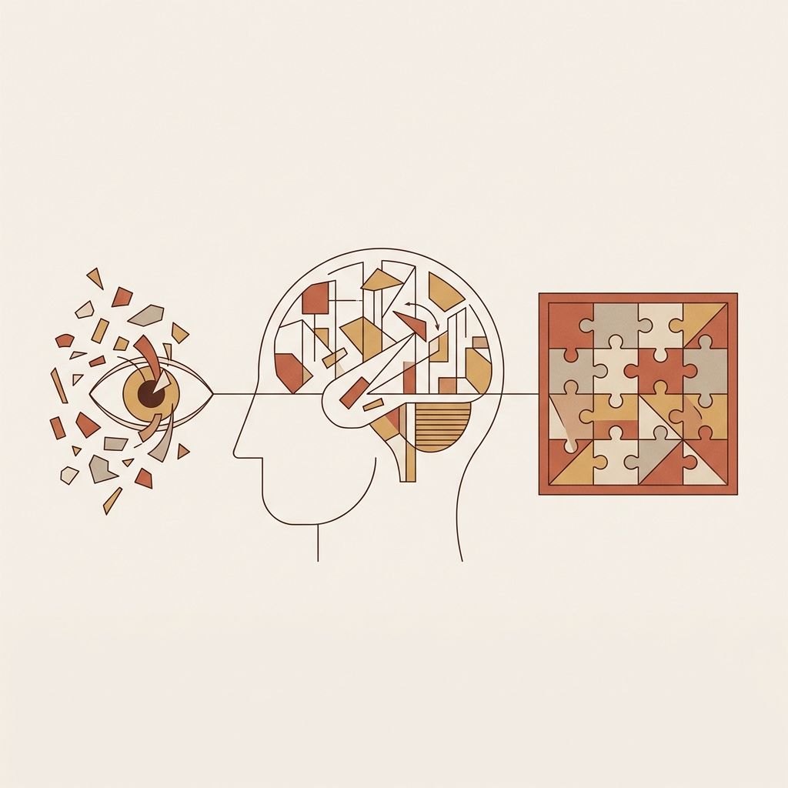

通过了注意力的筛选之后，信息进入第二关——**感知**。记住这个核心洞察：**感知不是在被动地接收世界，而是在主动地构建世界。**

你的大脑不是按像素读取世界的。它天生就是一个贪心的**模式识别机器**，拼命地要在混乱的视觉输入中找到秩序。

> [VISUAL]
> **Slide**: w02-slide-05c_3
> **Layout**: `Full`
> **Asset**: 
> **Source**: `Video` — James Turrell, Skyspace, The Way of Color
> **Duration**: `4m41s`
> **TimeCategory**: `activity`
> **Scene**: 詹姆斯·特瑞尔的天光装置系列《Skyspaces》视频片段
> **Text**: 只要改变外部参照，大脑就会乖乖地重构现实

> [ART/AESTHETICS]
> 艺术家詹姆斯·特瑞尔在《Skyspaces》装置中，在一个纯白的房间顶部切出一个没有任何参照物的正方形天窗。结果，观众眼中的天空不再是深邃的苍穹，而变成了一块触手可及的二维发光板。
> 
> 这正是大脑的本能：**当外部参照被剥离时，大脑会根据自身规律强行重构现实。**

> [VISUAL]
> **Slide**: w02-slide-06_2
> **Layout**: `Center`
> **Scene**: 一台充满贪婪食欲的“模式识别机器”插画：拼命地在混乱信号中拉取规律线条
> **List**: 寻找秩序 | 模式识别 | 格式塔
> **Text**: 贪心的模式识别机器
> *   **Asset**: 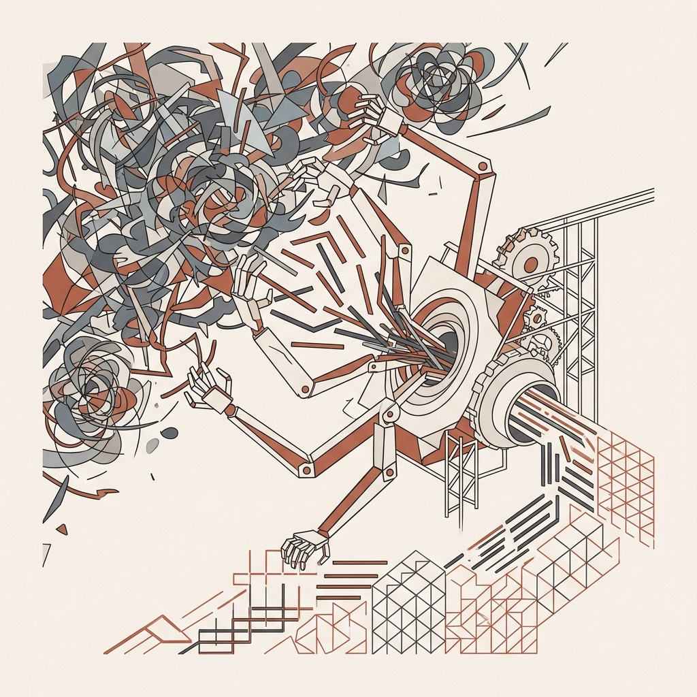

在数字界面中，大脑同样遵循一套天生的“重构外挂”来理解这些零散的像素块。100 多年前，德国心理学家们发现了这个规律，并将其命名为**格式塔（Gestalt）**原则。

> [VISUAL]
> **Slide**: w02-slide-06
> **Layout**: Grid
> *   **Asset**: 
> *   **Resource**: 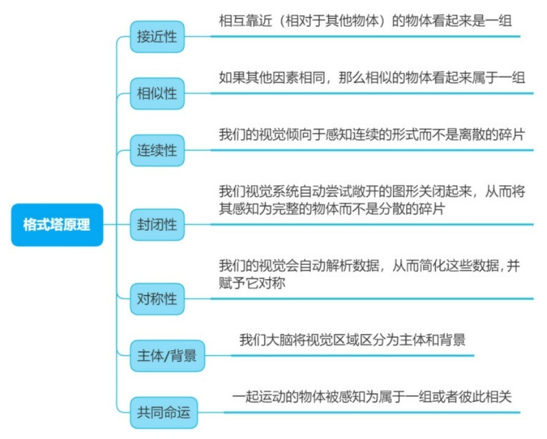
> **Source**: Textbook
> **Scene**: 2×3 网格展示格式塔六大原则的简洁图示：邻近性（分组的点阵）、相似性（颜色分组的形状）、连续性（交叉的曲线）、闭合性（缺口圆形）、图形-背景（鲁宾花瓶）、共同命运（同向箭头群）
> **List**: 邻近 Proximity | 相似 Similarity | 连续 Continuity | 闭合 Closure | 图形与背景 Figure-Ground | 共同命运 Common Fate
> **Text**: 格式塔六原则——大脑的拼图捷径

这就是统治了人类视觉感知一百多年的**格式塔六大原则**全家福。

这六条潜意识规则不是设计师选用与否的"可选项"，而是人类大脑的"硬件出厂配置"。每一条都在潜意识底层直接宣判着界面的生死：

> [VISUAL]
> **Slide**: w02-slide-06e
> **Layout**: `Split`
> **Scene**: 静态排版原则。左侧展示邻近性失效的反例（电商列表中的商品价格与上下两张商品图等距排列，导致归属不清）；右侧展示相似性失效的反例（将所有不可点击的普通正文全部设为与超链接相同的醒目高亮色，导致交互预期混乱）。
> **List**: 邻近性：等距排列导致归属模糊 | 相似性：滥用交互色打破点击预期
> **Text**: 静态排版的认知摩擦
> *   **Asset**: 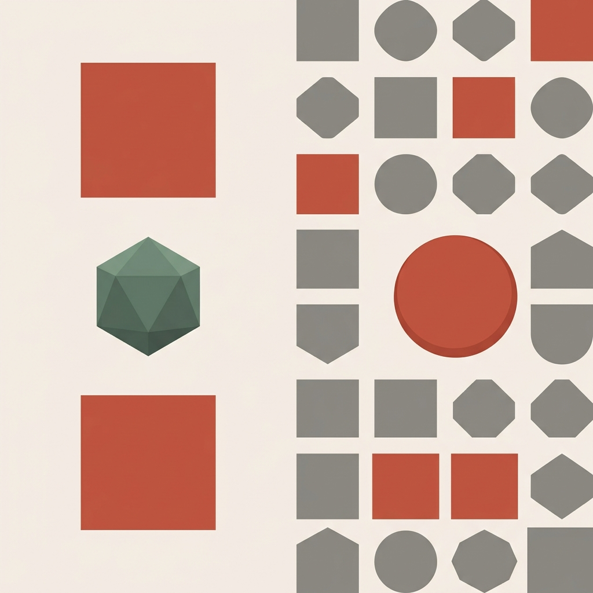

对比这组静态排版案例：

- **邻近性（Proximity）**：放得近的东西，大脑会自动认为它们是一伙的。比如浏览电商商品列表：一张图、一行标题、一个价格，为什么你一眼就知道它们属于同一件商品？因为它们靠得足够近。反例是什么？如果把商品的价格标签，放在上下两个商品的正中间——等距排列——你的大脑就会瞬间卡壳：这个 99 元到底是上面那个包的，还是下面那双鞋的？这就是邻近性失效制造的摩擦。

- **相似性（Similarity）**：长得像的东西，大脑会归为同类。你看任何优秀的 App 底部导航栏——当前选中的图标会变成高亮的主题色，其他则是灰色的线框。不需要读文字，单凭颜色你就能区分状态。反例是什么？如果你为了所谓的"视觉统一"，把页面里普通的不可点击正文，也设成和超链接一样的醒目颜色，用户就会条件反射地去狂点它——因为你打破了相似性预期，制造了交互混乱。

> [VISUAL]
> **Slide**: w02-slide-06b
> **Layout**: `Split`
> **Scene**: 视线引导原则。左侧展示一个现代风格的断线极简图标（例如一个不封口的铃铛图标），尽管线条断开，大脑依然能瞬间识别出完整形状；右侧展示一个画廊（Carousel）右侧故意露出 10% 的下一张图边缘，暗示连续。
> **List**: 闭合的视觉脑补 | 连续的无声指令
> **Text**: 视线引导与完形心理
> *   **Asset**: 

第二组，关于视线的引导与完形：

- **闭合性（Closure）**：大脑痴迷于"补完"不完整的视觉图形。一个缺了角的圆，你仍然会把它看成圆。在现代 UI 设计中，为什么现在流行的极简图标（Icon）经常会故意在线条交汇处断开一小截？因为只要轮廓特征足够，你的大脑会自动用视觉把断点"连起来"。这种利用闭合本能的留白，反而降低了视觉拥挤感。

- **连续性（Continuity）**：人会倾向于把视觉元素看成沿着连续路径排列的。为什么横向滑动的画廊（Carousel）要故意在这张图的右侧**露出下一张图的 10% 边缘**？那不是没排好版，那是利用连续性原则，给用户的视觉系统下达一个无声的指令："这里还没完，请向左划"。

> [VISUAL]
> **Slide**: w02-slide-06b_2
> **Layout**: `Split`
> **Scene**: 层级与动态原则。左侧是弹出模态框将背景压暗的图示，右侧是多个图标统一步伐向右滑动的动效分解图。
> **List**: 图形提取（背景虚化） | 共同命运（同步运动）
> **Text**: 锁定焦点与建立整体
> *   **Asset**: 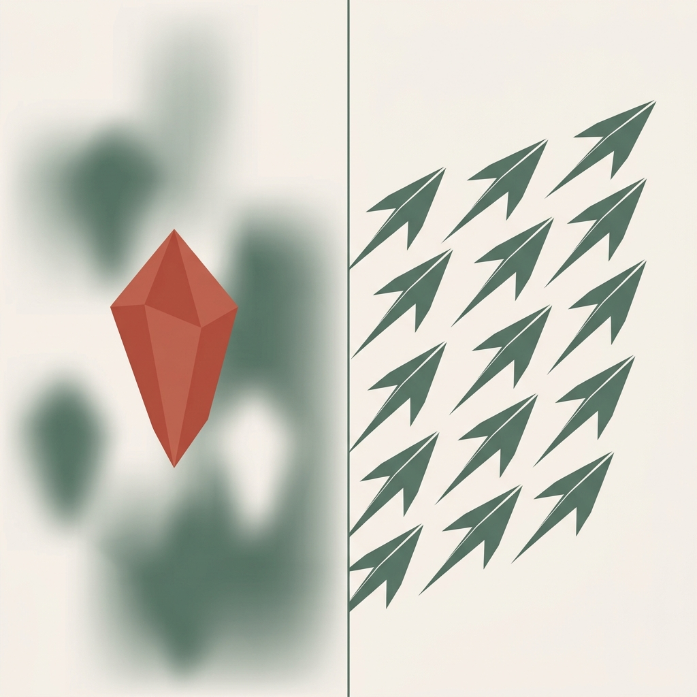

第三组，关于层级与动态：

- **图形与背景（Figure-Ground）**：大脑会瞬间把视觉场景分为前景的"图形"（你关注的焦点）和后景的"背景"（被忽略的环境）。模态对话框（Modal Dialog）为什么要把背后的主页面变灰或用毛玻璃模糊掉？就是利用图形-背景原则，让弹窗成为整个认知域里唯一的"图形"，把原本凌乱的主界强行降维成"背景"，迫使用户的注意力**强制锁定在一点**。

- **共同命运（Common Fate）**：一起运动的物体会被视为一个整体。当你在 iOS 主屏幕向右滑动，一整层的 App 图标以绝对相同的加速度和轨迹一起滑出屏幕——大脑瞬间认定，这一屏幕里的所有图标是一个共同体。这就是为什么动效设计中，关联信息出现的时间和节奏必须完全一致的原因。

> [DID YOU KNOW]
> 格式塔——Gestalt——这个德语单词没有准确的英文对等词。它大致的意思是"整体形态"——暗示人类理解事物的方式永远是"整体先于部分"，而非把零件一个个拼起来。这恰恰解释了为什么"拍脑袋加功能"的堆砌式设计注定失败——用户理解的不是你的功能列表，是你的**整体印象**。

> [VISUAL]
> **Slide**: w02-slide-07
> **Layout**: Split
> *   **Asset**: 
> **Scene**: 左侧为三层抽屉柜示意图——顶层小抽屉标注"感觉记忆 ~0.5s"、中层标注"工作记忆 ~30s / 7±2 块"、底层大抽屉标注"长期记忆 ∞"，右侧展示一个验证码输入场景和一个密码记忆场景
> **List**: 感觉记忆 ≈ 0.5s | 工作记忆 ≈ 30s · 容量 7±2 | 长期记忆 ≈ 永久
> **Text**: 记忆的三层抽屉

### 1.3 脆弱记忆：工作记忆是被锁死的瓶颈

注意力筛完、感知拼完，最后通关的信息才有机会进入**记忆**。

但记忆可不是一个大硬盘。它至少分三层。

**感觉记忆**只撑半秒钟——你的视网膜闪过的图像、耳朵掠过的声音，一晃就没。**长期记忆**容量近乎无限，但存取速度极慢——想想你上次回忆高中同学名字用了多久。

而交互设计最关注的，是夹在中间的那层——**工作记忆（Working Memory）**。它是用来做推理和决策的暂存区，是大脑真正的 CPU 缓存。

> [VISUAL]
> **Slide**: w02-slide-07c_1
> **Layout**: `Center`
> **Scene**: 脑力工作记忆的隐喻。一个极其微小且不稳定的“便签桌”，上面只能放 4 张脆弱的便签。
> **List**: 感觉记忆：0.5s | 工作记忆：暂存推理区（4个组块上限） | 长期记忆：无限但提取极慢
> **Text**: 脆弱的工作记忆瓶颈
> *   **Asset**: 

1956 年，认知心理学家 George Miller 发表了一篇改变历史的论文，标题就叫《神奇的数字 7±2》。他发现，人类的工作记忆同一时间只能处理大约 **7 个**（上下浮动 2 个）独立的信息块。后来的认知神经科学利用 fMRI 成像技术把这个数字修正得更保守、更残酷——在没有重度排练的情况下，纯粹的工作记忆可能只能容忍大约 **4 个**组块（chunk）同时存活。

> [VISUAL]
> **Slide**: w02-slide-07c
> **Layout**: `Comparison`
> *   **Asset**: 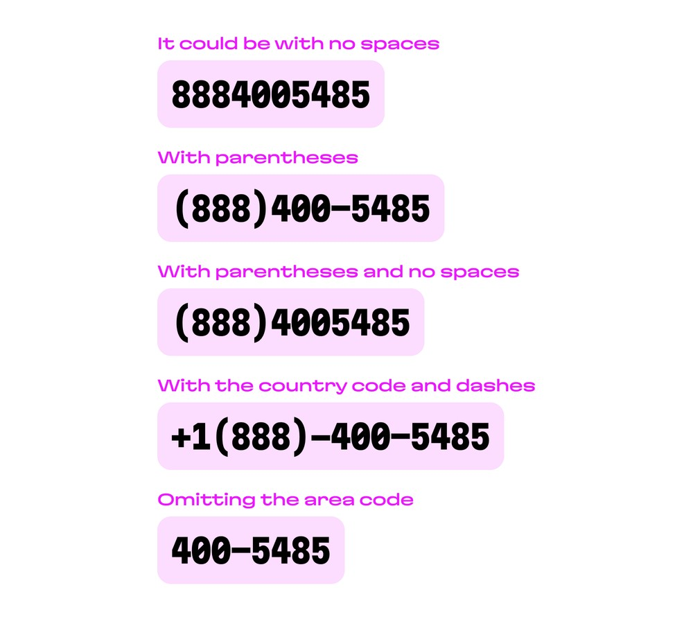
> *   **Asset (AI fallback)**: 
> **Scene**: 对比图。上方是一串无意义的 11 位数字（被红叉标示）；下方是 3-4-4 分段的手机号码（被绿色对勾标示）
> **Text**: Chunking 视觉与逻辑的降维
> **List**: 11 位无序数字 → 11 个 chunk → 爆内存 | 3-4-4 分段手机号 → 3 个 chunk → 秒记忆
> **Source**: Web Source

对比这两个版本：上方那串挤在一起的 11 位数字 `13022581984`，对你的大脑来说是 11 个独立信息块——已经爆掉了工作记忆 4 块的容量上限，所以你必须反复回看才能记住；下方按 3-4-4 节奏分段的 `130 2258 1984`，瞬间被你识别为"一个手机号"，从 11 块压缩成了 3 块，记忆负担直接砍掉了 73%。这就是 Chunking（组块化）——通过排版上的呼吸空隙，把 11 个原始数字打包成 3 个有意义的组合单元。

> [TECH NOTE: Chunking 组块化]
> Miller's Law 的「7±2」是被误解最深的理论之一。很多人以为它指的是"界面上只能放七个按钮"。错。Miller 说的容量单位是 **chunk（信息块）**——大脑能够赋予其**单一意义的组合单元**。
>
> 举个致命的例子。一串随机数字 `1-3-0-2-2-5-8-1-9-8-4` 有 11 个独立数位，对大脑来说是 11 个 block，直接**爆内存**。
> 但如果你把它按 3-4-4 的节奏空开：`130 2258 1984`，并且发现它是一个手机号，它就瞬间变成了 **3 个 chunk**，你的大脑就能在 10 秒钟内背下来。
> **设计的本质，很大程度上就是帮用户在这个界面上做视觉和逻辑的 chunking。**

> [VISUAL]
> **Slide**: w02-slide-07c_2
> **Layout**: `Comparison`
> **Scene**: 左侧是16位无间隔密集字符的古老ATM界面，右侧是优雅地每4位空一格、并随着输入自动分段的现代移动支付输入框
> **List**: 无视极限：16位连续字符 | 顺应极限：自动4位组块
> **Text**: 银行卡号的输入灾难与救赎
> *   **Asset**: 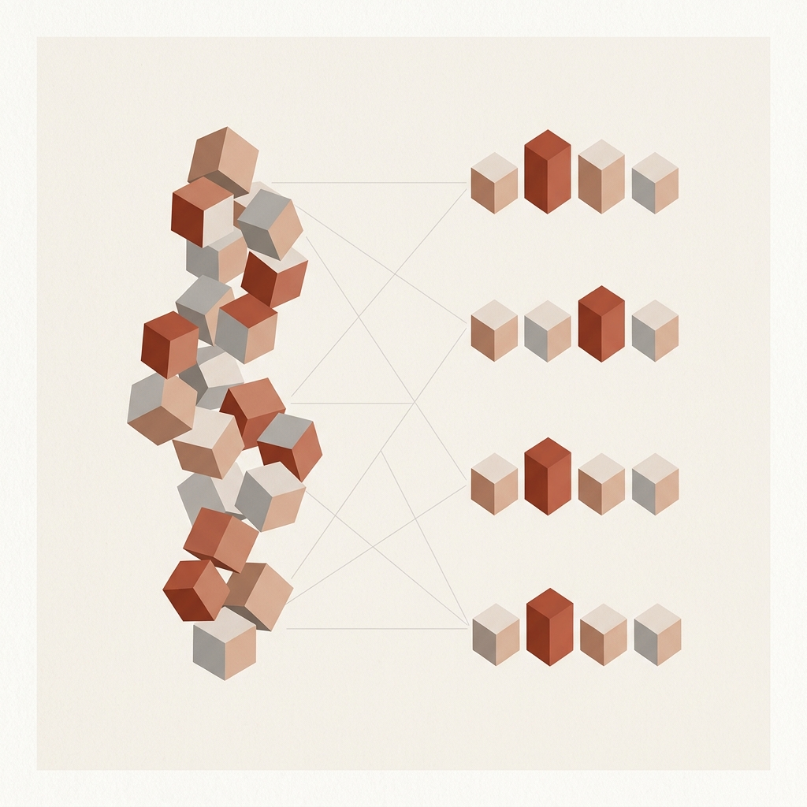

> [CASE STUDY: 银行卡与验证码的输入灾难]
> 这个心理学原理是如何切切实实影响千万级用户的呢？去看看各大银行的 App 吧。那些老旧的系统，在让你输入 16 到 19 位银行卡号时，是一个没有任何空格的长文本框。你的眼睛需要在卡片和屏幕之间来回四五次，每次看个 3-4 位数，然后战战兢兢地核对。一旦输错一位，满盘皆输。
> 而优秀的现代支付组件怎样做？**自动 4 位分段**。你敲到四位数，它自动帮你敲一个空格：`6222 0212 3456 7890`。四个独立数字被捆绑成了一个视觉 Chunk，大大降低了工作记忆刷新时丢失比特的概率。短信验证码同理，为什么从早期的 6 位紧密排列变成了现在常见的 4 位分开输入框？全都是在向这可怜的"4个组块"低头。

记住这个极其脆弱的设定：工作记忆的上限被牢牢锁死在 4 个组块上。旧的信息还没处理完，新的数据又涌进来，系统就会立刻过载**崩溃**。

> [VISUAL]
> **Slide**: w02-slide-07d
> **Layout**: `Comparison`
> *   **Asset**: 
> **Scene**: 左侧是满屏纯黑的命令行界面，一个人正抓狂地背诵命令；右侧是现代 GUI 放大镜图标和搜索框
> **Text**: 让用户看到线索，而不是背诵咒语
> **List**: 命令行：凭空背咒语 → 高负荷 | 图形界面：看见图标 → 低负荷

左侧是 1980 年代的命令行界面，用户必须从大脑深处死记硬背 `grep -r "error" /var/log/` 这种语法严苛的咒语，少一个空格、少一个连字符，系统就拒绝执行；右侧是现代图形界面，用户只需用眼睛识别屏幕上那个放大镜图标、点击它、在搜索框里敲下"error"——所有可能的命令都以可见的图标形式静静摆在那里等用户挑选。图形界面本质上就是把"凭空回忆"转化成了"看到即识别"——把抽象指令翻译成了可点击的图标，**可见性**直接碾压了**不可见性**。

> [TECH NOTE: 识别胜于回忆 Recognition over Recall]
> 为了拯救这张小小的"便签桌"，交互设计史上诞生了一条最伟大的金科玉律：**让用户去"识别"（Recognition），而不是"回忆"（Recall）。**
>
> 什么是回想？回想是你必须从大脑深处的长期记忆库里，生生地打捞出一条毫无线索的信息。比如在命令行界面（CLI）时代，你想在文件夹里找一个包含 "error" 这个词的日志文件，你必须在大脑里凭空回想出一长串咒语：`grep -r "error" /var/log/`。少一个空格，少一个横杠，系统就拒绝执行。这极度消耗脑力。

> [VISUAL]
> **Slide**: w02-slide-07d_3
> **Layout**: `Center`
> **Scene**: 从痛苦回忆到轻松识别。上面是一个人在绞尽脑汁地想密码；下面是看到面容ID后露出轻松笑容瞬间解锁
> **List**: 回想：凭空打捞 | 识别：线索触发
> **Text**: 识别与回忆的天壤之别
> *   **Asset**: 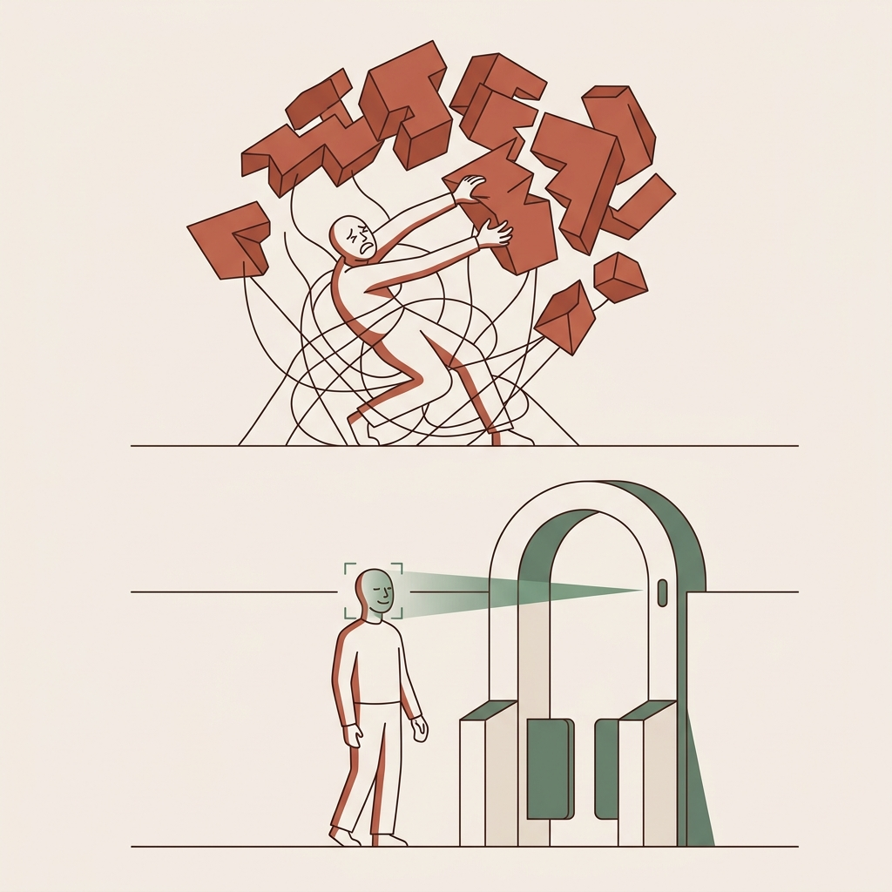

> 什么是识别？识别是你看到一个视觉线索，唤起了记忆。比如在今天的图形界面（GUI）里，你不需要背诵咒语，你只需要**看到**右上角有一个放大镜图标，**点击**它，然后在搜索框里输入 "error"。
> 
> **GUI（图形界面）之所以在上世纪 80 年代掀起计算革命，根本原因不是因为它"好看"，而是因为它把计算机的交互模式从"强制回忆"降维成了"轻松识别"。**
> 这是生物学决定的。人类的视觉识别皮层经过了几百万年的进化，极度发达——你可以在 0.1 秒内从人群中认出一张老同学的脸（识别），但你可能憋了 3 分钟也叫不出他的名字（回想）。如果你的系统依赖用户凭空背诵快捷键、记住复杂的文件路径、或者在没有任何提示的搜索框里猜测关键词，你就是在公然对抗人类的生物学本能。

> [VISUAL]
> **Slide**: w02-slide-07d_2
> **Layout**: `Center`
> **Scene**: 面前铺满无数个杂乱的各种球类，一个人在其中费力地想要挑出一颗红色的高尔夫球，表现出陷入缓慢决策的挣扎状态
> **List**: 选项繁杂 | 筛选困难 | 耗时指数暴涨
> **Text**: 选项越多，决策越慢
> *   **Asset**: 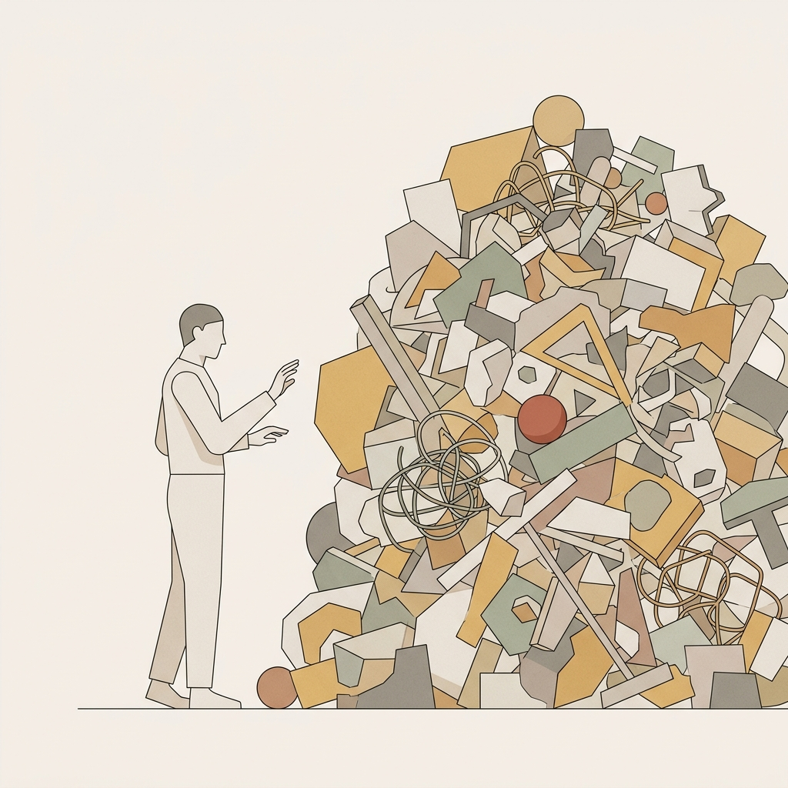

和工作记忆容量密切相关的，还有一条叫 **Hick's Law（席克定律）** 的法则——**选项越多，决策时间越长**。注意，这和 Miller's Law 说的不是一回事。Miller 说的是你能同时"捏住"多少个小球不掉下来，Hick 说的是你在面对一堆小球时"挑出一个特定的球"有多慢。

> [VISUAL]
> **Slide**: w02-slide-07e
> **Layout**: `Flow`
> *   **Asset**: 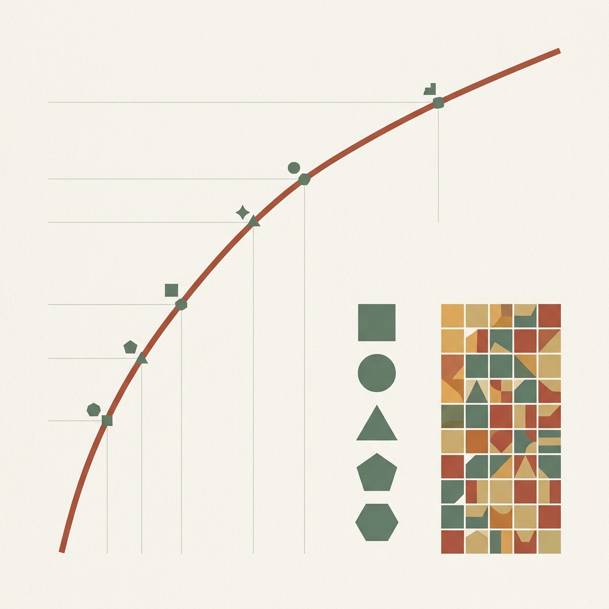
> *   **Resource**: 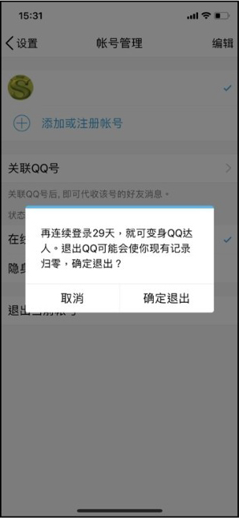
> **Source**: Textbook
> **Scene**: 展示席克定律的对数增长曲线图。X 轴为选项数量（2、4、8、16、32），Y 轴为决策时间（ms）。曲线呈对数上扬。图右侧配两个界面对比：左侧是 5 个按钮的精简导航条（快速决策区），右侧是 50 个平铺选项的设置面板（超载决策区），后者对应曲线末端的高平台
> **List**: 选项 ×2 → 决策时间仅 +1步 | 选项 ×16 → 决策时间显著拖长 | 渐进式披露 → 锁定在曲线低区
> **Text**: Hick's Law——选择数量增加的决策代价

根据 Hick's Law，当选项从 4 个翻倍到 32 个时，用户的决策时间会被显著拖长。如果一次性把 50 个高级设置项全部平铺在界面上，巨大的认知负担会让决策极其缓慢。因此，高阶体验必须依靠**渐进式披露（Progressive Disclosure）**来救场——这也是 Apple 设计哲学中最爱用的一招：不要一次性把 50 个高级设置项平铺给用户，而是只显示最常用的 5 个，然后给一个"高级选项..."的折叠入口。把复杂的选项藏在第二层，实质上是用系统深度换取了用户宝贵的认知时间。

> [VISUAL]
> **Slide**: w02-slide-07b
> **Layout**: `Flow`
> *   **Asset**: 
> **Scene**: 展示 NASA-TLX 任务负荷指数的六边形雷达图，各个维度用醒目的颜色标出异常峰值，图示一个"糟糕表单"如何在这个雷达图上爆表
> **List**: 脑力需求 MD | 体力需求 PD | 时间压力 TD | 自我绩效 OP | 努力程度 EF | 挫败感 FR
> **Text**: NASA-TLX 六维认知负荷

### 1.4 认知负荷：衡量系统的脑力占用率

认知心理学还有一个终极的度量方式：**认知负荷（Cognitive Load）**。简单来说，它衡量的是当前任务对你那台可怜"工作记忆 CPU"的占用率。
> [VISUAL]
> **Slide**: w02-slide-07b_1
> **Layout**: `Center`
> **Scene**: 认知负荷的天平。一边是界面呈现的选项复杂度，一边是大脑的实时计算负荷，指针濒临过载红区。
> **List**: 系统固有负荷 | 视觉与决策双重负担
> **Text**: 认知负荷：系统的脑力占用率
> *   **Asset**: 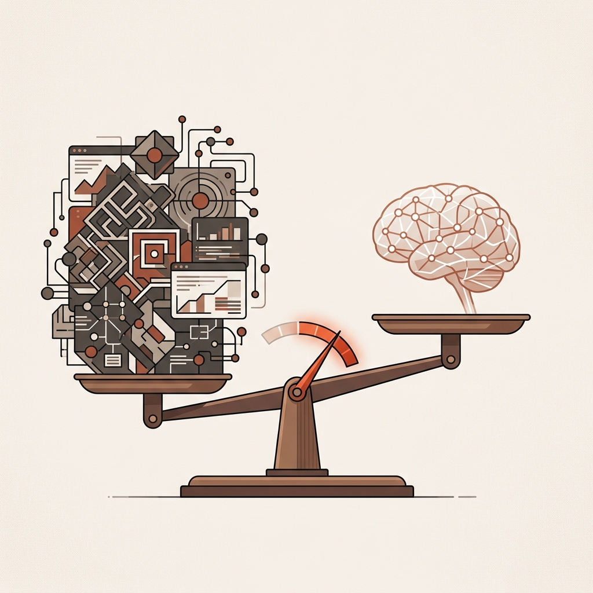

早在 20 世纪 80 年代，NASA（美国宇航局）为了评估宇航员在驾驶航天飞机时的极限状态，开发了一个标准化的主观评估工具，叫 **NASA-TLX（任务负荷指数）**。这个模型至今被交互设计界奉为圭臬。它用六个残酷的维度来量化一个人的认知负荷水平：
1. **脑力需求（Mental Demand）**：思考、计算、记忆、查找的量有多大？（填 100 项的问卷）
2. **体力需求（Physical Demand）**：点击、滑动、拖拽有多费劲？（需要在屏幕两端来回长距离移动鼠标）
3. **时间压力（Temporal Demand）**：时间给人的紧迫感？（支付界面的 30 秒倒计时）
4. **自我绩效（Performance）**：用户觉得自己做得好不好？（没提示哪里填错了，用户感到自己很蠢）
5. **努力程度（Effort）**：为了达到上述绩效，用户付出了多大努力？
6. **挫败感（Frustration）**：操作过程中感到的不安全、气馁、愤怒或压力有多大？

> [VISUAL]
> **Slide**: w02-slide-07f
> **Layout**: `Center`
> **Scene**: 天平隐喻：一端是机器的计算负荷，一端是人类的认知负荷，天平向人类一侧倾斜表示过载
> **Text**: 降低系统固有负荷是元目标
> *   **Asset**: 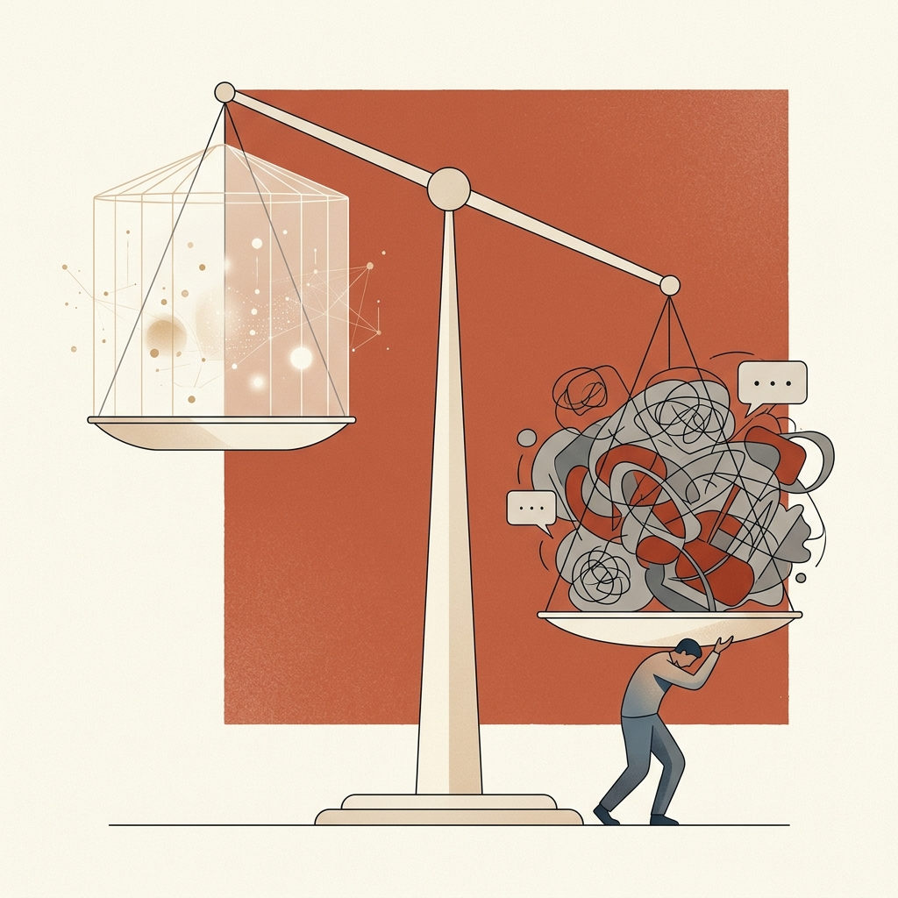

对日常产品设计师来说，降低系统固有的认知负荷是所有可用性优化的**元目标**。而对高风险系统（如医疗设备、航天器）来说，确保系统在极端压力下**绝不让人脑认知崩溃**，则是底线中的底线。

> [VISUAL]
> **Slide**: w02-slide-06c
> **Layout**: Split
> *   **Asset**: 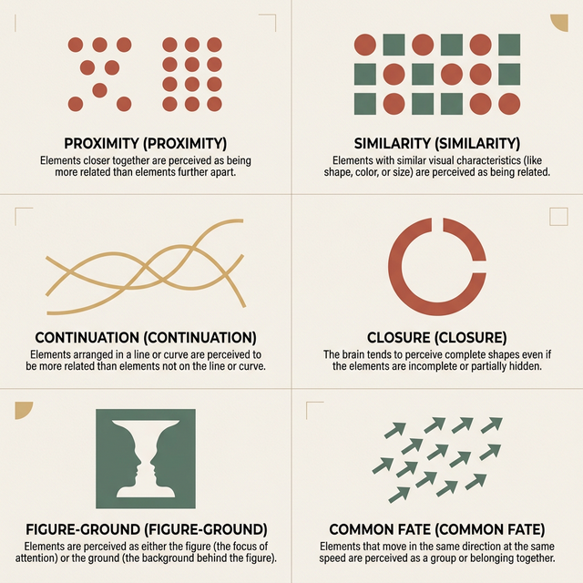
> **Scene**: 左侧是阿波罗 11 号登月舱在月球表面上空即将着陆的惊险画面，右侧是一台显示着 "1202 Program Alarm" 闪烁报警文本的老式指令计算机屏幕
> **List**: 登月着陆：极高的视觉操作负荷 | 1202警报：突发的未知认知强光
> **Text**: 阿波罗 1202 警报的认知过载
> **Source**: [NASA 历史档案](../public/assets/nasa_archive.png)
> **no_ai_flag**: true

> [VISUAL]
> **Slide**: w02-slide-06c_video
> **Layout**: `Full`
> **Asset**: 
> **Scene**: 播放阿波罗11号登月舱内视角视频，闪烁 1202 Program Alarm 警报
> **Text**: 阿波罗 11 号的认知防线
> **Source**: `Video` — Apollo 11 landing - Go/No-Go, 1201 alarm - 102:42:05 GET
> **Duration**: `0m56s`
> **TimeCategory**: `activity`

> [CASE STUDY: 阿波罗 11 号与认知防线]
> 1969 年阿波罗 11 号距月表仅一万英尺时，宇航员的 NASA-TLX 认知负荷已近极值。突然，屏幕闪烁未知代码：`1202 Program Alarm`。突发的高密度信息瞬间击穿了宇航员脆弱的工作记忆。
> 
> 如果按常规“资源耗尽即死机”的设计，登月将以灾难告终。但系统设计师预判了**认知与计算的双重过载**，提前写好了降级容错逻辑：系统并未死机，而是主动切断所有低优先级的视觉与数据干扰，只把算力留给控制下降的核心程序。
> 
> 在人机双双逼近极限时，这道**认知防线**挽救了任务。这也是认知负荷理论的最高启示：**优秀的界面必须在人类大脑“死机”时，依然留出一条完成核心任务的求生通道。**

**(Pause: 3s)**

> [VISUAL]
> **Slide**: w02-slide-06c_2
> **Layout**: `Center`
> **Scene**: 悬崖边排列的安全护栏隐喻，象征在极其有限的人类生理局限边缘搭建的安全冗余设计
> **List**: 狭窄注意 | 主观感知 | 脆弱记忆 | 搭建缓冲垫
> **Text**: 顺应出厂配置，搭建认知缓冲
> *   **Asset**: 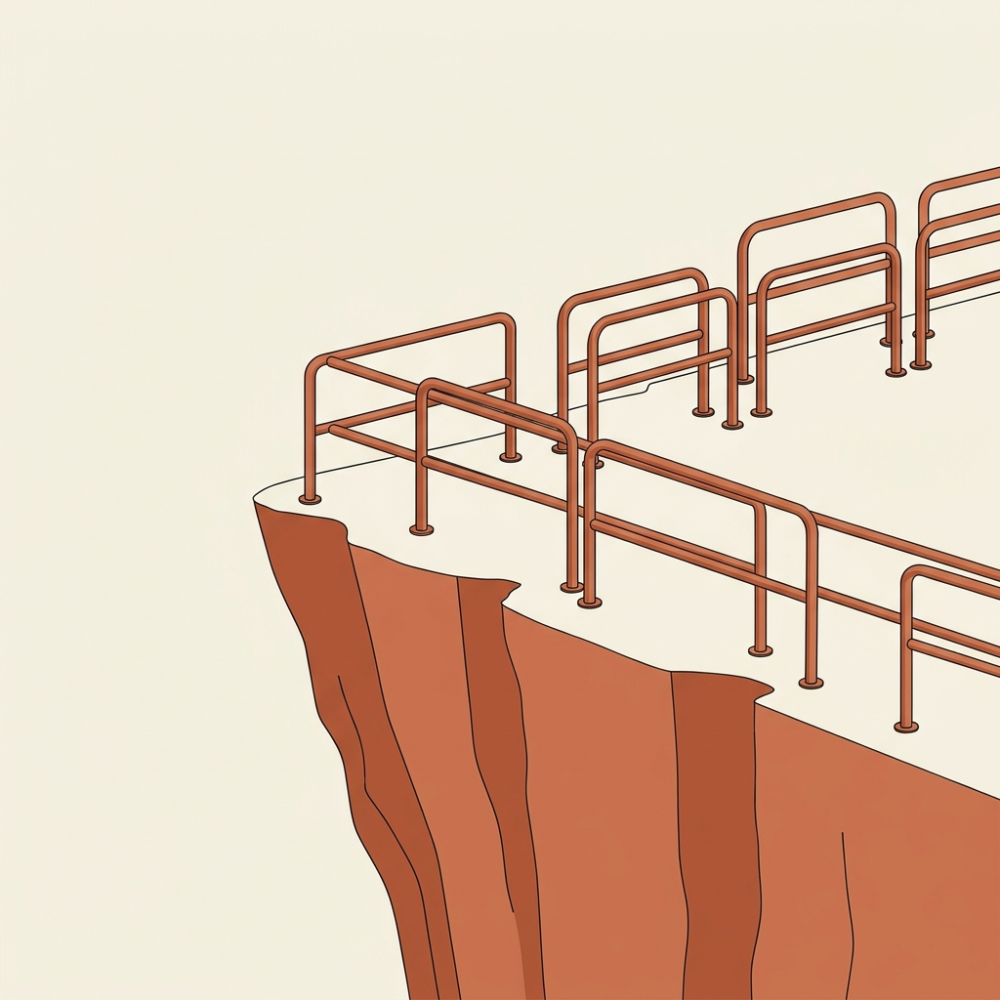

狭窄的注意、主观的感知、脆弱的记忆——面对这套无法篡改的“出厂配置”，设计就是为其布置认知缓冲垫。无视这些生理铁律，必定催生心智摩擦。

> [ACTIVITY: 生活反思——你大脑的缓冲垫]
> **Type**: `QA`
> **Duration**: `1min`
> **Desc**: 快速生活反思——把抽象认知模型映射到自身经验
> 引导词：回想一下，在你最近使用的一款软件或产品中，有没有哪个设计不符合你的生理直觉，让你感到认知过载甚至想崩溃的瞬间？它到底违背了我们刚讲过的哪一条底线原则？
> 
> **提示 (Hint)**：可参考以下认知底线（即便刚才没听清，对照以下原则也能找到共鸣）：
> - **注意力的窄光束**：界面弹窗乱飞，强行打断你的当前操作（多任务切换损耗）。
> - **格式塔排版失效**：元素间距混乱、按钮与正文颜色相似，导致你点错或找不到归属（违背邻近性/相似性）。
> - **工作记忆爆内存**：让你一口气阅读或输入一大串没有分隔的长数字/文本（缺乏 Chunking 组块化）。
> - **强制回忆而非识别**：隐藏很深的操作没有界面线索，必须靠死记硬背才能找出来。
> - **席克定律过载**：一个界面密密麻麻平铺几十个选项，让你瞬间选择困难。

既然摸清了人脑的底层认知架构，便能一眼看透它是如何被机器界面所"卡住"的。第一个致命卡点，发生在人类意图与系统反馈交汇的**链路**上。

---
