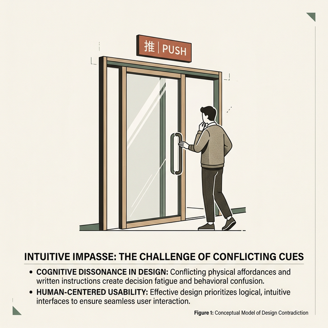
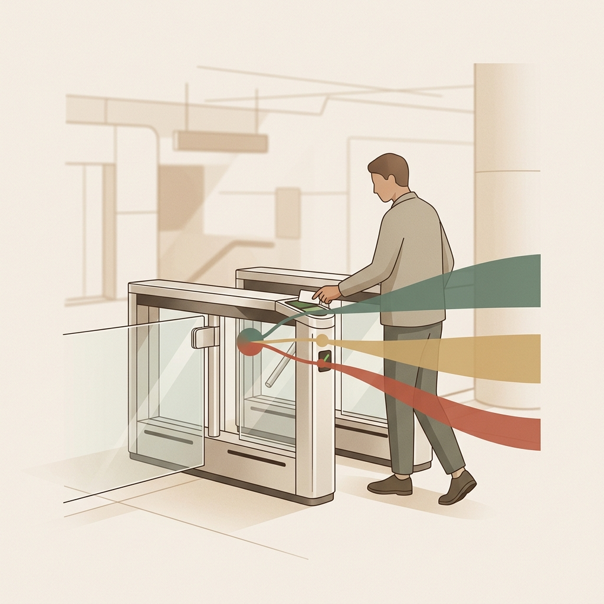

## 模块 2: 意图与反馈的断裂 (25 min)

<!-- BUDGET: 4500 chars | STATUS: done -->

> **知识节点**: `ixd-gulfs-of-execution-and-evaluation`

> [VISUAL]
> **Slide**: w02-slide-08
> **Layout**: `Flow`
> *   **Asset**: 
> **Scene**: 一个环形流程图展示 Norman 的七阶段行动模型：用户目标 → 意图 → 行动序列 → 执行 →⟨执行鸿沟⟩→ 感知 → 解释 → 评估 →⟨评估鸿沟⟩→ 回到目标。两处鸿沟位置用红色警示标注
> **Text**: Norman 的行动循环与两道鸿沟

Donald Norman，认知科学家、《设计心理学》的作者——如果说交互设计有教父的话，这个人就是。

Norman 提出了一个极其有力的模型来描述人与任何系统的交互过程。他说，人做任何事，都在经历一个**七步循环**。我们来逐步拆解。

**上半圈——从目标到手——属于"执行"侧**。第一步：你在脑子里形成一个模糊的**目标**——"我要给老妈转 500 块钱"。第二步：把目标翻译成更具体的**意图**——"用银行 App 转账"。第三步：意图分解成**行动序列**——打开 App → 点转账 → 输入金额 → 确认。第四步：手指按照这个序列**执行**物理操作。

**下半圈——从屏幕到脑——属于"评估"侧**。第五步：你的眼睛**感知**屏幕上的变化——页面跳转了、出现了动画。第六步：你的大脑**解释**这些变化的含义——"这个绿色勾号应该表示成功了"。第七步：你把解释与最初的目标做**评估**——"妈妈收到了吗？我的目标达成了吗？"

**(Pause: 3s)**

这个循环看着挺顺畅。但它的脆弱之处在于——**链条上有两个极容易断裂的缺口**。Norman 给它们取了一个精准的名字：**鸿沟**，英文叫 Gulf。

### 2.1 执行鸿沟：阻断意图的物理陷阱

> [VISUAL]
> **Slide**: w02-slide-09
> **Layout**: Split
> *   **Asset**: 
> **Scene**: 左侧为一个满布按钮的老式录像机遥控器照片，右侧为携程 App 日期选择器界面——返程日期早于出发日期的选项已置灰
> **List**: 鸿沟本质：用户心里有目标，但不知道怎么让系统动起来 | 解法：可供性 + 约束 + 智能默认值

执行鸿沟是什么感觉？就是你盯着界面，心里在喊：**"我到底该按哪个？"**

你有明确的意图：我要录像。但遥控器上黑压压五六十个按钮，没有哪个写着"开始录像"或者标着红点。你的意图和系统的操作界面之间，横着一条深不见底的沟。这就代表意图无法被轻易**翻译**为具体操作。

> [VISUAL]
> **Slide**: w02-slide-09b
> **Layout**: `Full`
> *   **Asset**: 
> **Scene**: 一扇装有巨大拉向把手、却贴着"推"（Push）标签的玻璃门，一个人正尴尬地拉着门把手
> **Text**: 诺曼门：当物理界面给出错误的线索

这也是屏幕上这幅尴尬日常画面的来源：

> [DID YOU KNOW: 诺曼门 (Norman Doors)]
> 交互设计界有一个极度出圈的梗叫"诺曼门"（Norman Doors）。指的是那些明明该推、却装了一个巨大把手（暗示你拉）的门；或者没有把手只有一块平板、却要求你拉的门。当你每天在办公楼里尴尬地撞在门上、或者用力拉门却拉不动时，你不应该觉得"我真蠢"——你遇到了典型的诺曼门。诺曼门是物理世界里执行鸿沟的究极体：它的外观结构（物理界面）给出了完全错误的**操作线索**。如果一扇门都需要贴上"推（Push）"或者"拉（Pull）"的使用说明书，那这扇门的设计就是彻底失败的。

在数字产品里也是一样。当一个企业级后台的导航层级深达五层，每个入口的命名都用着缩写（如 "CRM-PL-02"）等只有后端程序员才懂的内部系统术语，用户就会在第二层开始迷路——你明明知道你想干嘛，但你不知道鼠标该点哪。这就是执行鸿沟在吞噬用户的认知带宽与时间。

> [VISUAL]
> **Slide**: w02-slide-09c
> **Layout**: Split
> *   **Asset**: 
> **Scene**: 左侧是让用户填错日期后弹出的红色报错弹窗；右侧是携程 App 中将无效返程日期提前置灰禁用的日历组件
> **List**: 错误发生前干预 | 消灭耻辱循环

这就引出了如大屏幕右侧所示的解决方案：

> [CASE STUDY: 携程的前置约束]
> 优秀的设计用"前置约束"来抢先填平鸿沟。当你在携程预订往返机票选择日期时，系统会直接将所有早于出发日的返程日期**置灰禁用**。这种设计在错误发生之前就消灭了犯错的可能性——用户永远不需要经历"填了个逻辑冲突的日期 → 被弹窗骂一顿 → 重新填"的耻辱循环。这才叫为人类的认知局限买单。

> [VISUAL]
> **Slide**: w02-slide-09d
> **Layout**: `Grid`
> *   **Asset**: 
> **Scene**: 三列卡片。左侧"可供性"（3D凸起按钮）；中间"信号标识"（带"请输入"字样的输入框）；右侧"约束"（防呆USB插头）
> **Text**: 可供性 | 信号标识 | 约束

如屏幕上的三连卡片所示，让我们把填平执行鸿沟的工具箱展开。Norman 提出了三个极其关键的防御概念：

**可供性**（Affordance）——物体自身结构所直接暗示的可能用法。生态心理学家 J.J. Gibson 最早提出了这个词。对于一只猴子来说，一根树枝提供了"可抓握"和"可攀爬"的可供性；对于现代人来说，一个门把手的扁平形状强烈暗示你该"推"，而一个弯曲的把手则暗示你该"拉"。一个按钮的 3D 凸起质感让你知道它能按下去。在纯文字的数字二维平面界面中，一个蓝色亮色带下划线的文字在人类经验里强烈暗示"我是通往另一个页面的链接"，一个带扩散阴影和圆角的矩形色块强烈暗示"我是可交互的浮动按钮"。可供性建立的是一种不需要大脑翻译的**直觉物理映射**。

**信号标识**（Signifier）——明确告诉你"在哪里做"的线索。一个输入框里浅灰色的占位文字"请输入手机号"，就是信号标识——它不是可供性本身，它是可供性的**路标**。注意区分：可供性是本体论的（事物本身具有的属性），信号标识是认识论的（帮你发现这个属性）。

**约束**（Constraints）——杜绝"做错了怎么办"。携程的日期置灰就是约束。USB 接口只能以正确方向插入也是约束。约束的极端形态叫做**强制性功能**（Forcing Function）——比如微波炉门没关好就无法启动。

> [DID YOU KNOW]
> 可供性和信号标识是两个最容易被混淆的概念。Norman 自己在后来的著作里都对这个混淆做了修正。简单记：**可供性是"能做什么"，信号标识是"怎么发现能做什么"**。一扇玻璃门天生"可供"推开（可供性存在），但如果没有"请推"的标签（信号标识缺失），人们会对着它困惑甚至撞上去。

**(Pause: 3s)**

### 2.2 评估鸿沟：缺乏反馈的状态黑箱

> [VISUAL]
> **Slide**: w02-slide-10
> **Layout**: Split
> *   **Asset**: 
> **Scene**: 左侧为一个点击"提交订单"后毫无反馈的空白页面，右侧为 Gmail 底部浮现的黑色 Toast 提示条"会话已归档 · 撤销"
> **List**: 鸿沟本质：操作完了，但不知道到底发生了什么 | 解法：即时反馈 + 可逆操作 + 状态可见性

执行鸿沟发生在操作**之前**，评估鸿沟则发生在操作**之后**。

它是什么感觉？**——"刚才到底发生了什么？"**

你点了"提交订单"。页面纹丝不动。没有 Loading 动画，没有弹窗，没有欢呼。你的大脑陷入巨大的不确定性："钱扣了吗？我该不该再点一次？"——然后你真的又点了一次，然后你被扣了两次钱。

缺乏反馈，或者反馈延迟甚至反馈造假，会让用户的心智直接**悬空**。这是最暴力的摩擦制造机，它迫使用户自己去瞎猜系统的内在状态。

缺乏反馈，或者反馈延迟甚至反馈造假，会让用户的心智直接**悬空**。这是最暴力的摩擦制造机，它迫使用户自己去瞎猜系统的内在状态。

> [VISUAL]
> **Slide**: w02-slide-10b
> **Layout**: `Flow`
> *   **Asset**: 
> **Scene**: 一名乘客刷卡通过地铁闸机的瞬间，画面中拆解出三条不同颜色的反馈射线：眼睛看到绿灯、耳朵听到"嘀"声、身体感受到闸门打开
> **Text**: 视觉 × 听觉 × 动觉的三重保障

我们可以看看现实中最成功的反馈设计，请看大屏幕的闸机拆解图：

> [CASE STUDY: 地铁闸机的多模态反馈设计]
> 你们每天刷卡或扫码进地铁的时候可能没留意，但闸机的反馈设计其实是一个顶级的教科书案例。在你刷卡判定成功的一瞬间，系统极其奢侈地同时给出了**三种感知模态（Modality）**的高频反馈：屏幕变绿并显示余额（视觉通道）、发出一声清脆的区别于错误的"嘀"声（听觉通道）、闸门瞬间打开（物理/动觉通道）。
> 为什么要做这么冗余的反馈？因为这消灭了哪怕只有 0.1 秒的评估鸿沟——你**永远不会怀疑**自己刷成功了没有。现在想象一下，如果闸机只发出一声微弱的"嘀"，屏幕背光坏了，闸门延迟整整两秒才开——你是不是会原地石化，会犹豫不决地回头看一眼，不敢立刻跨步，甚至会换个码再刷一次导致重复扣费？只要两秒钟的反馈延迟，就足够切断意图链路，制造一整个评估鸿沟。
> 设计界有一个关于反馈的**"三根支柱"理论（Three Pillars of Predictability）**：即时性（必须在 400 毫秒内响应）、清晰性（模态明确无歧义）、可解释性（告诉用户当前状态，而不是抛出一个纯粹的 16 进制错误代码）。

> [VISUAL]
> **Slide**: w02-slide-10c
> **Layout**: `Full`
> *   **Asset**: 
> **Scene**: 黑色代码终端界面，一行简短的命令被执行，背景是全球大量红色断网标识的服务器群，充满"蝴蝶效应"的压抑感
> **Text**: 当操作失去"可解释性"反馈

> [STORY TIME: 亚马逊 AWS S3 的世纪大宕机]
> 评估鸿沟缺乏"可解释性"和"清晰性"的极限破坏力，在 2017 年亚马逊 AWS S3 存储桶的全球大宕机事件中表现得淋漓尽致。当时，一名 AWS 工程师原本只是想在这个全球最大的云服务控制台里删除几台计费子系统的冗余服务器资源。他敲下了一行极其简单的命令，然后按下了回车。
> 但由于这台庞大机器的控制台界面在"可见性"和"状态反馈"设计上存在巨大的盲区，系统并没有用任何人类能清晰理解的模态向工程师展示即将发生的连锁破坏："警告！你当前操作指令波及的并非几个计费节点，而是整个美东一区海量核心子系统的路由架构！"
> 没有任何高清晰度弹窗确认，没有任何破坏预览警告，只有一个生硬且迟钝的执行结束。就在那条沉默的命令敲下之后，评估鸿沟彻底吞噬了这名工程师的认知：他以为自己只删除了少量后台进程，实际上他通过那个糟糕的界面连击，触发了整个美东一区 S3 核心底座的连环物理雪崩。长达几个小时的时间里，包括苹果 iCloud的部分服务、Netflix、Slack 在内的全球半个互联网随之瘫痪，造成了数以亿计的美元经济损失。事发几周后，AWS 官方极其诚恳地发布了极其详尽的复盘说明报告——令人敬佩的是，他们没有把这归咎于"操作员的愚蠢"或直接开除那名输错参数的工程师，而是坦承：这是系统控制台工具交互设计的底层失败。因为其系统在工程师执行毁灭级操作时，未能提供任何有效地、符合人类直觉且具有清晰后果可解释性的状态评估反馈，致使高级工程师在茫茫的数据黑盒前发生了不可挽回、且毫无知觉的心智彻底脱轨。

> [VISUAL]
> **Slide**: w02-slide-10d
> **Layout**: Split
> *   **Asset**: 
> **Scene**: 左侧是波音 737 驾驶舱中隐形坠落的飞机轮廓，右侧是 Therac-25 控制台冷漠闪烁的"Malfunction 54"
> **Text**: 隐藏状态与敷衍反馈的极限杀伤力

而在安全攸关的领域，如大屏幕上这两场人类历史上的悲剧：

> [STORY TIME: 当评估鸿沟导致杀人——Therac-25 与三哩岛核事故]
> 大多数时候，评估鸿沟只会让你少点两次赞或买错一次东西。但在安全关键系统（Safety-critical Systems）里，评估鸿沟会立刻转变为杀人事故。
> 我们先看著名的**波音 737 MAX 坠机惨剧**。那套臭名昭著的 MCAS（机动特性增强系统）其最致命的设计缺陷，就是它在后台悄无声息地疯狂接管并下压机头，却**没有在驾驶舱的仪表盘上向飞行员提供任何关于 MCAS 正在激活并夺权的明确视觉或触觉评估反馈**！飞行员的物理拉杆意图，与系统的隐蔽干预之间，横亘着一条巨大而沉默的评估鸿沟，最终导致数百人随飞机坠毁。
> 同样血淋淋的教训还有 1985 到 1987 年间，加拿大导致多名患者惨死的 Therac-25 放射治疗机事故。机器内部的微处理器在快速输入时发生了竞态条件，导致患者暴露在致死剂量的 X 射线中。但这机器到底错在哪？错在它的**界面反馈设计**。当事故发生时，控制台纯黑色的终端屏幕上只冷漠地闪过一句：`Malfunction 54`（故障 54）。操作员根本不知道这个晦涩的报错代码代表过载辐射，加上以往机器经常毫无理由地报错，操作员产生了**习惯化麻木（Habituation）**。就像条件反射一样，她按下 `P` 键清除了警告，又按下了回车键继续发射——她以为机器因为一个小毛病没发射成功。系统明明发生了致命级别的状态改变，界面上却没有给出任何足够惊悚的、能建立解释的评估反馈。
> 
> 再往前看，1979 年美国三哩岛核事故（Three Mile Island accident），堆芯熔毁的物理起因是一个极其微小的泄压阀卡住无法关上。但是！控制室操作员之所以几个小时都无法采取正确措施，是因为控制台上几百个密密麻麻的红色指示灯**掩盖了关键信号**，而且用来指示那个泄压阀状态的灯，**逻辑竟然是反的**！灯灭了，操作员就评估为"阀门已关闭"，但由于机械卡死，实际上阀门还在大量泄漏冷却水。物理世界的真实状态，与系统界面渲染出来的"表现状态"彻底脱节——这就是人类工业史上最昂贵的一条评估鸿沟。

现代 UX 怎样温和地处理日常评估鸿沟？看看 Gmail 或微信传输。你点了"归档"或者"删除"，邮件瞬间从列表消失。没有中置弹出"您确定要删除吗"打断你的心流。但在屏幕底部，静静浮现一个黑色的 **Toast 提示条**——"会话已归档"，旁边紧跟着一个"**撤销（UNDO）**"按钮。
这种设计堪称交互美学：它**瞬间提供确定性的视觉反馈**告诉你结果确实发生了（消灭评估鸿沟），同时用极低的系统成本给予了用户**反悔的安全感**（可逆操作）。

这种方案背后的设计原则叫做**宽恕式设计（Forgiving Design）**。它的哲学是：不要在行动之前用弹窗恐吓用户，而要在行动之后用撤销给用户兜底兜好。系统应该建设性地相信，用户在绝大多数时候清楚自己在做什么；你要保护的不是每一次无聊的点击，而是那极少数手滑的瞬间。

> [TEACHING MOMENT]
> 从这里我们可以提炼出一个核心的设计第一原则：**状态可见性（Visibility of System Status）**——这更是 Jakob Nielsen 轰动业界的十大可用性原则的头牌。系统的每一次状态变化、数据加载、事务处理，都必须在合理的时间内（通常需要小于 400 毫秒），用用户能听懂的方式，告知用户。永远记住这句话：**沉默的系统，就是在系统性地制造评估鸿沟。**

> [DID YOU KNOW: 苹果单键鼠标的执念与右键鸿沟的三十年博弈]
> 为了深刻理解这"两道鸿沟"在真实商业硬件迭代里的拉扯，我们来看看鼠标这部微型科技史。
> 早在施乐 PARC 发明 GUI 和鼠标原型时，鼠标是有三个甚至更多按键的。那是标准的工程师思维：很多功能就需要很多键来触发（完全没有约束）。
> 当乔布斯将鼠标引入 Macintosh 时，他做出了一个在当时工程师看来简直是发神经的决定：**鼠标强制只能有一个物理按键**。苹果内部的人机界面先驱 Jef Raskin 其实是反对的，他认为有些复合操作需要更多按键。但乔布斯的逻辑极其粗暴但也极其洞悉人性本质——如果鼠标有三个键，新手用户看到鼠标就会陷入"执行鸿沟"的深渊：我该用哪个指头？左边的是确认还是右边的？中间那个按了会不会爆炸？
> 乔布斯把执行鸿沟**彻底从硬件层面抹除了**——因为只有一个键，用户不用选，按就对了。这种极端的物理**约束（Constraint）**造就了初代 Mac 极其平缓的瞎子式上手曲线。
> 但代价是什么？代价是随着后来软件系统复杂度的爆炸式增长，苹果被迫制造了另一种深深的鸿沟。因为没有右键，那些"上下文菜单（Context Menu）"、那些高级属性面板，用户必须通过"按住键盘某个修改键（比如 Option 或 Ctrl）再同时点击鼠标"才能呼出。这种组合键操作在屏幕上是**没有任何视觉可供性（Affordance）提示的**。用户如果不看说明书，永远都发现不了这个操作。这其实是另一种更隐蔽的"执行鸿沟"——因为目标被深埋，用户甚至不知道这个功能存在。
> 微软 Windows 则走了另一条路。两键鼠标加右侧上下文菜单，牺牲了刚上手时一丁点的纯粹性（执行摩擦略微增加），但换来了无限扩展的上下文菜单系统的易发现性。
> 于是，苹果在这个没有右键的执念上挣扎和妥协了长达三十年。从后来的 Mighty Mouse 这颗神奇的球，到今天 MacBook 上那块巨大且完美的玻璃触控板（Magic Trackpad），苹果用软件层面的"双指轻点（Two-finger Tap）"完美模拟了右键的高级呼出，这才在这场长达半个世纪的执行鸿沟填补之战中画上了句号。这里面蕴含的设计反思是：**填补一条缝隙的土，极有可能在别处挖出另一个大坑。你不可能消灭所有的系统复杂性，你只能决定把复杂性转移（或隐藏）给谁。**

**(Pause: 3s)**

Norman 的鸿沟理论给了我们一个强大的诊断工具：任何让用户感到挫败的交互瞬间，你都可以追问——**是意图到操作的链条断了（执行鸿沟），还是操作到理解的链条断了（评估鸿沟）？** 这两个问题切下去，病因基本就暴露了。

但鸿沟只是表象。更深层的问题是：**为什么这些鸿沟会存在？** 答案藏在一个更根本的矛盾里——人类理解世界的方式，和机器运行的方式，天生就不兼容。

---
