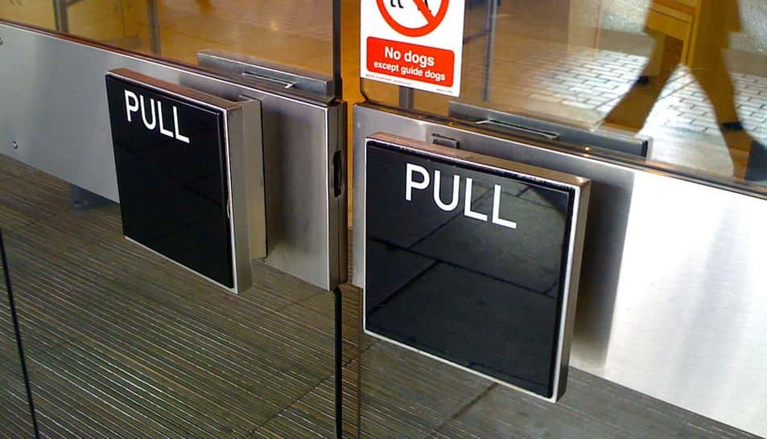
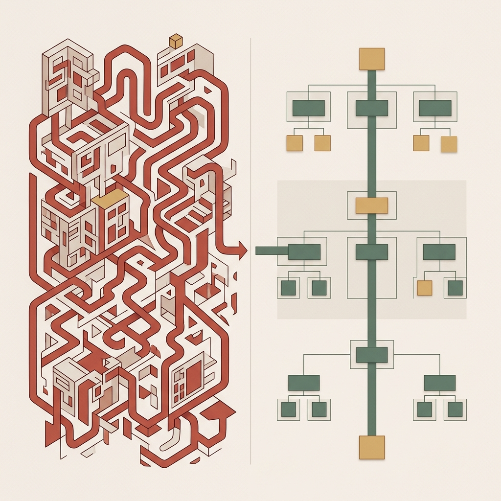
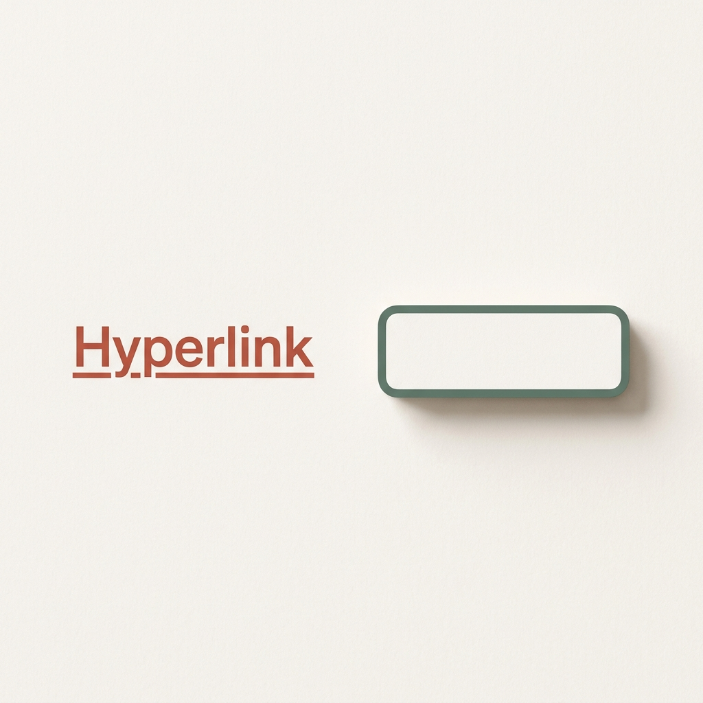
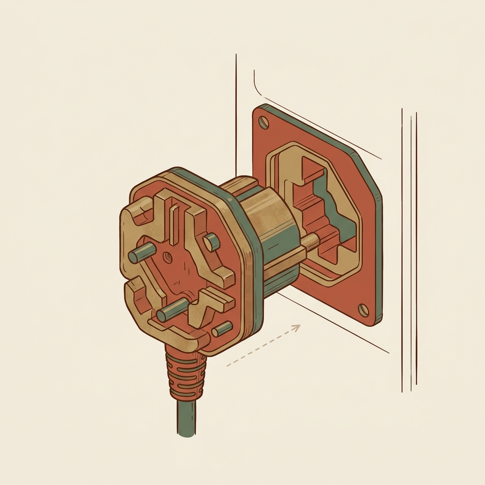
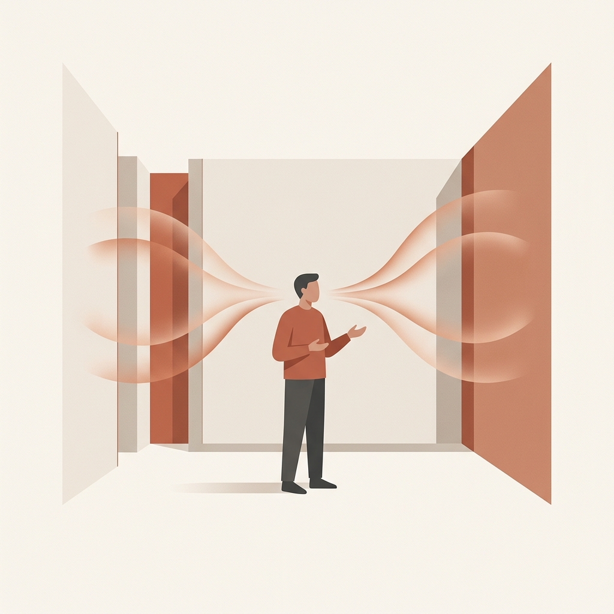
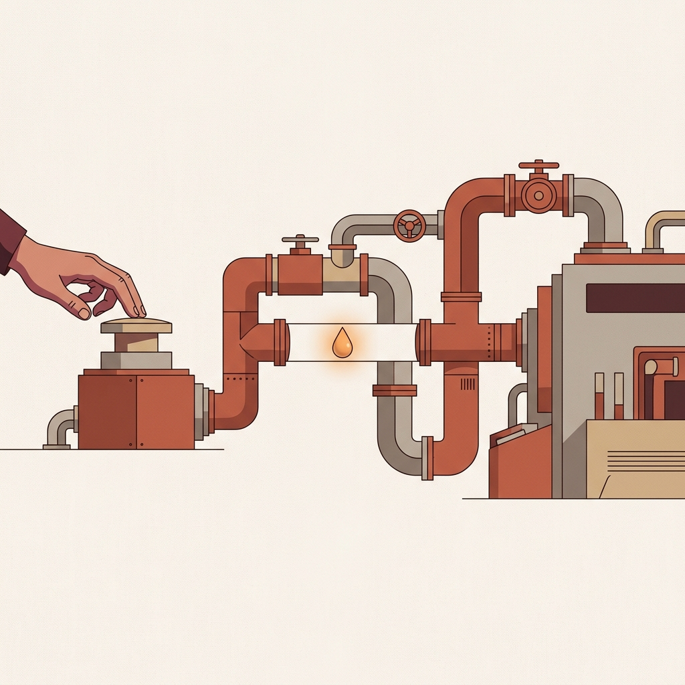
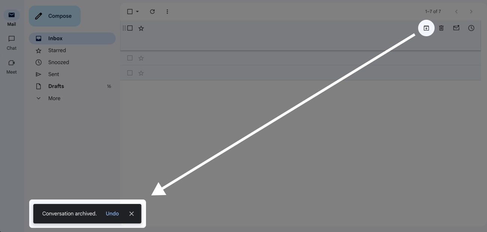
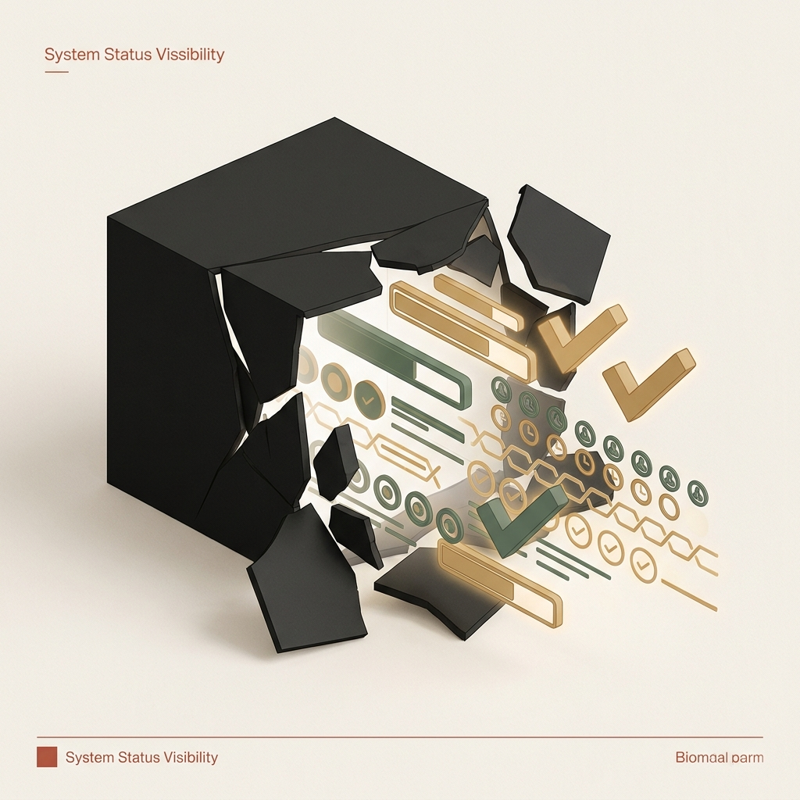
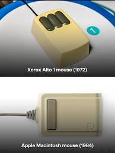
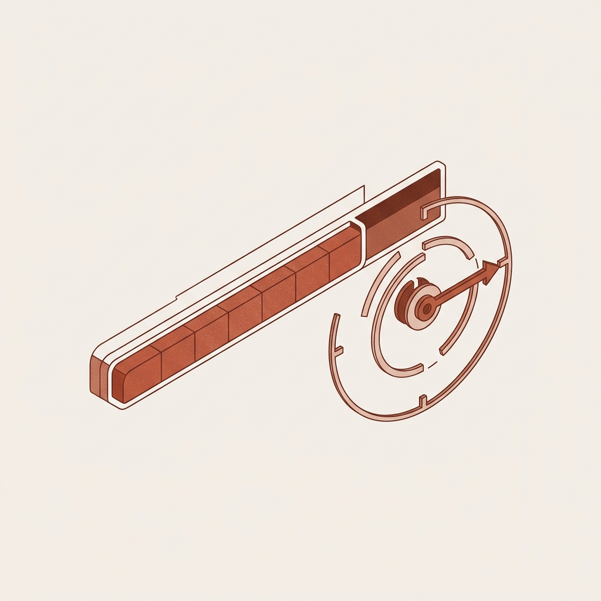

## 模块 2: 意图与反馈的断裂 (25 min)

<!-- BUDGET: 4500 chars | STATUS: done -->

> **知识节点**: `ixd-gulfs-of-execution-and-evaluation`

> [VISUAL]
> **Slide**: w02-slide-08
> **Layout**: `Center`
> **Asset**: 
> **Scene**: 一个环形流程图展示 Norman 的七阶段行动模型：用户目标 → 意图 → 行动序列 → 执行 →⟨执行鸿沟⟩→ 感知 → 解释 → 评估 →⟨评估鸿沟⟩→ 回到目标。两处鸿沟位置用红色警示标注
> **Text**: "执行"侧——目标到手
> **List**: 目标 → 意图 → 行动序列 → 执行

Donald Norman，认知科学家、《设计心理学》的作者——如果说交互设计有教父的话，这个人就是。

Norman 提出了一个极其有力的模型来描述人与任何系统的交互过程。他说，人做任何事，都在经历一个**七步循环**。我们来逐步拆解。

**上半圈——从目标到手——属于"执行"侧**。第一步：你在脑子里形成一个模糊的**目标**——"我要给老妈转 500 块钱"。第二步：把目标翻译成更具体的**意图**——"用银行 App 转账"。第三步：意图分解成**行动序列**——打开 App → 点转账 → 输入金额 → 确认。第四步：手指按照这个序列**执行**物理操作。

> [VISUAL]
> **Slide**: w02-slide-08_1
> **Layout**: `Center`
> **Scene**: 评估侧的放大图：屏幕闪过绿光，人的大脑正在紧张地解释反馈信号。
> **Text**: 评估侧——从屏幕到大脑的反馈循环
> **Asset**: 
> **List**: 感知 → 解释 → 评估

**下半圈——从屏幕到脑——属于"评估"侧**。第五步：你的眼睛**感知**屏幕上的变化——页面跳转了、出现了动画。第六步：你的大脑**解释**这些变化的含义——"这个绿色勾号应该表示成功了"。第七步：你把解释与最初的目标做**评估**——"妈妈收到了吗？我的目标达成了吗？"

**(Pause: 3s)**

这个循环看着挺顺畅。但它的脆弱之处在于——**链条上有两个极容易断裂的缺口**。Norman 给它们取了一个精准的名字：**鸿沟**，英文叫 Gulf。

### 2.1 执行鸿沟：阻断意图的物理陷阱

> [VISUAL]
> **Slide**: w02-slide-09
> **Layout**: Split
> *   **Asset**: 
> **Scene**: 左侧为一个满布按钮的老式录像机遥控器照片，右侧为携程 App 日期选择器界面——返程日期早于出发日期的选项已置灰
> **List**: 鸿沟本质：用户心里有目标，但不知道怎么让系统动起来 | 解法：可供性 + 约束 + 智能默认值
> **Text**: 执行鸿沟——我该按哪个？

执行鸿沟是什么感觉？就是你盯着界面，心里在喊：**"我到底该按哪个？"**

你有明确的意图：我要录像。但遥控器上黑压压五六十个按钮，没有哪个写着"开始录像"或者标着红点。你的意图和系统的操作界面之间，横着一条深不见底的沟。这就代表意图无法被轻易**翻译**为具体操作。

> [VISUAL]
> **Slide**: w02-slide-09b
> **Layout**: `Full`
> *   **Asset**: 
> *   **Asset (AI fallback)**: 
> **Scene**: 一扇装有巨大拉向把手、却贴着"推"（Push）标签的玻璃门，一个人正尴尬地拉着门把手
> **Text**: 诺曼门：当物理界面给出错误的线索

这也是屏幕上这幅尴尬日常画面的来源：

> [VISUAL]
> **Slide**: w02-slide-09b_video
> **Layout**: `Full`
> **Asset**: 
> **Scene**: 播放《诺曼门》演示视频：男子试图推开标着"拉"的玻璃门
> **Text**: 诺曼门：物理空间的执行鸿沟
> **Source**: `Video` — 经典诺曼门演示
> **Duration**: `5m32s`
> **TimeCategory**: `activity`

> [DID YOU KNOW: 诺曼门 (Norman Doors)]
> 交互设计界有一个著名的梗叫"诺曼门"（Norman Doors）。指的是那些明明该推、却装了一个巨大把手（暗示你拉）的门；或者没有把手只有一块平板、却要求你拉的门。当你每天在办公楼里尴尬地撞在门上、或者用力拉门却拉不动时，你不应该觉得"我真蠢"——你遇到了典型的诺曼门。诺曼门是物理世界里执行鸿沟的典型表现：它的外观结构给出了完全错误的**操作线索**。如果一扇门都需要贴上"推"或者"拉"的使用说明书，那这扇门的设计就是失败的。

> [VISUAL]
> **Slide**: w02-slide-09b2
> **Layout**: `Comparison`
> *   **Asset**: 
> **Scene**: 左右对比图。左侧标题「执行鸿沟 · 高风险」——五层深度嵌套的后台菜单截图，每级用「CRM-PL-02」式缩写命名，用红色箭头标注迷路节点；右侧标题「填平鸿沟」——同一功能经过重构后以三级扁平导航呈现，关键入口用动词+目标命名（「新建客户」「查看报表」），绿色路径一气呵成
> **List**: 执行鸿沟：意图 ≠ 可见操作 → 用户迷路 | 填平策略：动词命名 + 扁平层级 + 可见信号
> **Text**: 执行鸿沟的高风险区与填平策略

在数字产品中，我们同样每天都在推拉着无数扇“数字诺曼门”。请看大屏幕这组对比图：当你登录一个企业级后台，明确想要“新建客户”（意图），面对的却是深达五层的嵌套菜单，且入口全标着“CRM-PL-02”这种内部开发术语。界面不仅没有提供正确的操作线索，反而制造了认知噪音——你明明知道想干嘛，却不知道鼠标该点哪。

这就是执行鸿沟。大屏幕右侧给出了它的**第一种填平策略——重建清晰的信号标识（Signifiers）与映射**：把神秘代码翻译成“动词+目标”（如：新建客户），把深不可测的层级拍扁。当意图能被用户的常识轻易翻译成可见的操作时，这道第一鸿沟就被跨越了。

> [VISUAL]
> **Slide**: w02-slide-09c
> **Layout**: Split
> *   **Asset**: 
> **Scene**: 左侧是让用户填错日期后弹出的红色报错弹窗；右侧是携程 App 中将无效返程日期提前置灰禁用的日历组件
> **List**: 错误发生前干预 | 消灭耻辱循环
> **Text**: 前置约束消灭错误输入

但仅仅指引方向还不够。如果用户走对了入口，但在执行操作的过程中依然容易犯逻辑错误呢？这就引出了比“信号标识”更底层、更强硬的第二种防御策略：

> [CASE STUDY: 携程的前置约束]
> 优秀的设计用"前置约束"来抢先填平鸿沟。当你在携程预订往返机票选择日期时，系统会直接将所有早于出发日的返程日期**置灰禁用**。这种设计在错误发生之前就消灭了犯错的可能性——用户永远不需要经历"填了个逻辑冲突的日期 → 被弹窗骂一顿 → 重新填"的耻辱循环。这才叫为人类的认知局限买单。

> [VISUAL]
> **Slide**: w02-slide-09d
> **Layout**: `Center`
> **Scene**: 鸿沟填平的隐喻。深渊上正在构建一座坚实的桥梁，桥面由三块核心基石组成，分别清晰地标注为：“可供性”、“信号标识”与“约束”。
> **List**: 可供性 (Affordance) | 信号标识 (Signifiers) | 约束 (Constraints)
> **Text**: 填平执行鸿沟的工具箱
> *   **Asset**: 

如屏幕上深渊桥梁的三块基石所示，让我们把填平执行鸿沟的工具箱展开。Norman 提出了三个极其关键的防御概念：

**可供性**（Affordance）——物体自身结构所直接暗示的可能用法。生态心理学家 J.J. Gibson 最早提出了这个词。对于一只猴子来说，一根树枝提供了"可抓握"和"可攀爬"的可供性；对于现代人来说，一个门把手的扁平形状强烈暗示你该"推"，而一个弯曲的把手则暗示你该"拉"。一个按钮的 3D 凸起质感让你知道它能按下去。

> [VISUAL]
> **Slide**: w02-slide-09_2
> **Layout**: `Center`
> **Scene**: 数字二维平面的可供性隐喻。纯文本的链接被高亮为醒目颜色并添加下划线，旁边悬浮着带扩散阴影和圆角的矩形按钮，下方标注“不需要大脑翻译的直觉映射”。
> **List**: 亮色文字与下划线 | 扩散阴影与矩形色块
> **Text**: 数字二维界面的可供性
> *   **Asset**: 

在纯文字的数字二维平面界面中，一个带有主题高亮色并加下划线的文字在人类经验里强烈暗示"我是通往另一个页面的链接"，一个带扩散阴影和圆角的矩形色块强烈暗示"我是可交互的浮动按钮"。可供性建立的是一种不需要大脑翻译的**直觉物理映射**。

> [VISUAL]
> **Slide**: w02-slide-09g
> **Layout**: `Center`
> **Scene**: 信号标识的隐喻。一个极其干净的矩形输入框，输入框内出现了一个羽毛笔的虚影符号，作为视觉路标指引用户在此处输入。
> **List**: 缺乏标识：不知道在哪操作 | 明确标识：提供清晰的交互线索
> **Text**: 信号标识——操作的视觉路标
> *   **Asset**: 

**信号标识**（Signifier）——明确告诉你"在哪里做"的线索。一个输入框里浅灰色的占位文字"请输入手机号"，就是信号标识——它不是可供性本身，它是可供性的**路标**。注意区分：可供性是本体论的（事物本身具有的属性），信号标识是认识论的（帮你发现这个属性）。

**约束**（Constraints）——杜绝"做错了怎么办"。携程的日期置灰就是约束。USB 接口只能以正确方向插入也是约束。约束的极端形态叫做**强制性功能**（Forcing Function）——比如微波炉门没关好就无法启动。

> [VISUAL]
> **Slide**: w02-slide-09h
> **Layout**: `Center`
> **Scene**: 约束与强制性功能的隐喻。一个非对称结构的物理插座与插头，仅允许唯一正确方向插入，从物理结构上杜绝了操作错误。
> **List**: 缺乏约束：极易发生人为失误 | 强制性功能：从物理结构上杜绝错误
> **Text**: 约束——预防错误的强制手段
> *   **Asset**: 

> [DID YOU KNOW]
> 可供性和信号标识是两个最容易被混淆的概念。Norman 自己在后来的著作里都对这个混淆做了修正。简单记：**可供性是"能做什么"，信号标识是"怎么发现能做什么"**。一扇玻璃门天生"可供"推开（可供性存在），但如果没有"请推"的标签（信号标识缺失），人们会对着它困惑甚至撞上去。

> [ACTIVITY]
> **Type**: `QA`
> **Duration**: `1min`
> **Desc**: 快速检验理解——在教室里找一个典型的"诺曼门"或能体现"错误可供性"的设计例子。

**(Pause: 3s)**

### 2.2 评估鸿沟：缺乏反馈的状态黑箱

> [VISUAL]
> **Slide**: w02-slide-10
> **Layout**: Split
> *   **Asset**: 
> **Scene**: 左侧为一个点击"提交订单"后毫无反馈的空白页面，右侧为 Gmail 底部浮现的黑色 Toast 提示条"会话已归档 · 撤销"
> **List**: 鸿沟本质：操作完了，但不知道到底发生了什么 | 解法：即时反馈 + 可逆操作 + 状态可见性
> **Text**: 评估鸿沟——刚才发生了什么？

执行鸿沟发生在操作**之前**，评估鸿沟则发生在操作**之后**。

它是什么感觉？**——"刚才到底发生了什么？"** 比如你点了"提交订单"，页面纹丝不动，没有 Loading 动画或弹窗。你的大脑陷入巨大的不确定性："钱扣了吗？我该不该再点一次？"——然后你又点了一次，导致重复扣款。

缺乏反馈或反馈延迟，会让用户的心智直接**悬空**。这种体验迫使用户动用宝贵的工作记忆去瞎猜系统的内在状态，导致了极高的**认知盲区成本**。

> [VISUAL]
> **Slide**: w02-slide-10b
> **Layout**: `Flow`
> *   **Asset**: 
> **Scene**: 一名乘客刷卡通过地铁闸机的瞬间，画面中拆解出三条不同颜色的反馈射线：眼睛看到绿灯、耳朵听到"嘀"声、身体感受到闸门打开
> **Text**: 视觉 × 听觉 × 动觉的三重保障

我们可以看看现实中最成功的反馈设计，请看大屏幕的闸机拆解图：

> [CASE STUDY: 地铁闸机的多模态反馈设计]
> 你们每天刷卡或扫码进地铁的时候可能没留意，但闸机的反馈设计堪称教科书案例。在你刷卡判定成功的一瞬间，系统同时给出了**三种感知模态（Modality）**的即时反馈：屏幕变绿并显示余额（视觉通道）、发出一声清脆的区别于错误的"嘀"声（听觉通道）、闸门瞬间打开（物理/动觉通道）。
> 为什么要做这么冗余的反馈？因为这消灭了哪怕只有 0.1 秒的评估鸿沟——你**永远不会怀疑**自己刷成功了没有。现在想象一下，如果闸机只发出一声微弱的"嘀"，屏幕背光坏了，闸门延迟整整两秒才开——你是不是会原地石化，会犹豫不决地回头看一眼，不敢立刻跨步，甚至会换个码再刷一次导致重复扣费？只要两秒钟的反馈延迟，就足够切断意图链路，制造一整个评估鸿沟。

> [VISUAL]
> **Slide**: w02-slide-10b_2
> **Layout**: `Center`
> **Scene**: 三根柱子支撑起一座名为“可预测性”的桥梁：即时性（表）、清晰性（喇叭）、可解释性（文档）
> **List**: 即时性 | 清晰性 | 可解释性
> **Text**: 反馈设计的三根支柱
> *   **Asset**: 

> 设计界有一个关于反馈的**"三根支柱"理论（Three Pillars of Predictability）**：即时性（必须在 400 毫秒内响应）、清晰性（模态明确无歧义）、可解释性（告诉用户当前状态，而不是抛出一个纯粹的 16 进制错误代码）。

> [VISUAL]
> **Slide**: w02-slide-10c
> **Layout**: `Full`
> *   **Asset**: 
> *   **Asset (AI fallback)**: 
> **Scene**: 黑色代码终端界面，一行简短的命令被执行，背景是全球大量红色断网标识的服务器群，充满"蝴蝶效应"的压抑感
> **Text**: 当操作失去"可解释性"反馈
> **Source**: AI Generated

> **Scene**: 展示「反馈三根支柱」的流程图：三个圆形节点从左到右依次排列——「即时性 ≤400ms」（绿色秒表图标）→「清晰性：模态无歧义」（蓝色对号图标）→「可解释性：人话状态」（橙色说话气泡图标）。每个节点下方用红叉案例对比：延迟反馈 / 模糊错误码 / 16进制报错
> **List**: 即时性 ≤400ms | 清晰性：模态明确 | 可解释性：状态透明
> **Text**: 反馈三根支柱——评估鸿沟的防火墙

> [STORY TIME: 亚马逊 AWS S3 的世纪大宕机]
> 评估鸿沟缺乏"可解释性"的破坏力，在 2017 年亚马逊 AWS S3 的宕机事件中暴露无遗。当时，一名工程师只是想在控制台删除少量冗余服务器。
> 
> 但这名工程师敲下命令后，系统**没有任何弹窗确认或破坏预览**，仅仅给出了一个生硬的结束提示。系统未能提供**可解释的状态反馈**，没有警告他这个操作将波及整个美东一区的路由架构。
> 
> 这条评估鸿沟让工程师以为操作无害，实际上却触发了 S3 核心底座的物理雪崩，导致大半个互联网瘫痪。AWS 复盘时坦承：这不是操作员的愚蠢，而是控制台**底层交互设计的失败**（缺乏状态评估反馈）。

> [VISUAL]
> **Slide**: w02-slide-10d
> **Layout**: Split
> *   **Asset**: 
> **Scene**: 左侧是波音 737 驾驶舱中隐形坠落的飞机轮廓，右侧是 Therac-25 控制台冷漠闪烁的"Malfunction 54"
> **Text**: 隐藏状态与敷衍反馈的极限杀伤力

在安全攸关的领域，评估鸿沟往往是致命的。我们在上周的课程中已经见证了这两起悲剧的杀伤力，现在用"评估鸿沟"的视角为它们做最终的病理定性：

> [STORY TIME: 评估鸿沟的致命病理]
> [SPIRAL-FINAL] 针对 W01 已讲过的波音 737 MAX、Therac-25 等案例，进行"评估鸿沟"视角的收口。
> 
> *   **波音 737 MAX（毫无反馈）**：系统自动下压机头，仪表盘却没有给出任何状态改变的提示。飞行员死于**隐藏的系统干预**。
> *   **Therac-25（敷衍反馈）**：辐射过载时仅显示晦涩的 `Malfunction 54`，导致操作员产生习惯性麻木。患者死于**无效的评估信息**。
> 
> 它们的共同特征：**系统发生了致命的状态改变，界面却没有给出清晰、可解释的反馈。**

> [VISUAL]
> **Slide**: w02-slide-10d_2
> **Layout**: `Center`
> *   **Asset**: 
> **Scene**: 真实照片：密密麻麻亮着红灯和绿灯的控制面板，红绿灯互相交织干扰，导致无法看清真正的核心警告（信号淹没在噪音中）
> **List**: 信号淹没 | 逻辑反直觉 | 物理状态脱节
> **Text**: 三哩岛的噪音灾难

> 最后看 1979 年三哩岛核事故。堆芯熔毁起因是一个泄压阀卡死。但操作员数小时无法补救，是因为控制台几百个指示灯**掩盖了关键信号**，且阀门指示灯的**逻辑是反的**。灯灭了，操作员评估为"阀门已关闭"，但实际上仍在泄漏。物理状态与界面的"表现状态"彻底脱节。

> [VISUAL]
> **Slide**: w02-slide-10d_3
> **Layout**: `Full`
> **Scene**: 轻量化反馈与心流保护的图示。在界面的底部，温和地悬浮着一个深色的 Toast 提示条“会话已归档”，旁边带有醒目的“撤销（UNDO）”操作，未打断主界面流程。
> **List**: 中置弹窗：粗暴打断 | 底部Toast：温和护航
> **Text**: 温和地处理日常评估鸿沟
> *   **Asset**: 

现代 UX 怎样温和地处理日常评估鸿沟？看看 Gmail 或微信传输。你点了"归档"或者"删除"，邮件瞬间从列表消失。没有中置弹出"您确定要删除吗"打断你的心流。但在屏幕底部，静静浮现一个黑色的 **Toast 提示条**——"会话已归档"，旁边紧跟着一个"**撤销（UNDO）**"按钮。
这种设计堪称交互美学：它**瞬间提供确定性的视觉反馈**告诉你结果确实发生了（消灭评估鸿沟），同时用极低的系统成本给予了用户**反悔的安全感**（可逆操作）。

> [VISUAL]
> **Slide**: w02-slide-10d_4
> **Layout**: `Center`
> **Scene**: 宽恕式设计的隐喻。一张巨大的安全网稳稳接住了从高处掉落的用户，象征着系统撤销(UNDO)功能的兜底保护，而非事前恐吓。
> **List**: 消除恐惧 | 可逆操作 | 建设性信任
> **Text**: 宽恕式设计：兜底而非恐吓
> *   **Asset**: 

这种方案背后的设计原则叫做**宽恕式设计（Forgiving Design）**。它的哲学是：不要在行动之前用弹窗恐吓用户，而要在行动之后用撤销给用户兜底兜好。系统应该建设性地相信，用户在绝大多数时候清楚自己在做什么；你要保护的不是每一次无聊的点击，而是那极少数手滑的瞬间。

> [VISUAL]
> **Slide**: w02-slide-10d_5
> **Layout**: `Center`
> **Scene**: 状态可见性的抽象模型。一个原本封闭的深色黑箱被打破，从中流淌出各种清晰的状态指示（如发光的进度条、完成的绿标、系统数据流），让内部状态变得彻底透明可见。
> **List**: 状态可见性 | 拒绝沉默系统
> **Text**: 系统的状态必须可见
> *   **Asset**: 

> [TEACHING MOMENT]
> 从这里我们可以提炼出一个核心的设计第一原则：**状态可见性（Visibility of System Status）**——这更是 Jakob Nielsen 轰动业界的十大可用性原则的头牌。系统的每一次状态变化、数据加载、事务处理，都必须在合理的时间内（通常需要小于 400 毫秒），用用户能听懂的方式，告知用户。永远记住这句话：**沉默的系统，就是在系统性地制造评估鸿沟。**

### 2.3 案例分析：鼠标设计的鸿沟博弈与复杂性转移

> [VISUAL]
> **Slide**: w02-slide-10e
> **Layout**: `Image`
> *   **Asset**: 
> **Scene**: 乔布斯在施乐 PARC 参观 Alto 计算机
> **Text**: 鼠标单键与多键的鸿沟博弈

> [DID YOU KNOW: 苹果单键鼠标的执念与右键鸿沟的三十年博弈]
> 既然执行鸿沟和评估鸿沟如此致命，那把界面设计得极其极简是不是就万事大吉了？为了理解填平鸿沟背后需要付出的设计代价，我们来看看鼠标这部微型科技史。
> 早在施乐 PARC 发明 GUI 和鼠标原型时，鼠标是有三个甚至更多按键的。那是标准的工程师思维：很多功能就需要很多键来触发（完全没有约束）。
> 当乔布斯将鼠标引入 Macintosh 时，他做出了一个大胆的决定：**鼠标强制只能有一个物理按键**。苹果内部的人机界面先驱 Jef Raskin 其实是反对的，他认为有些复合操作需要更多按键。但乔布斯的逻辑直指核心——如果鼠标有三个键，新手用户看到鼠标就会陷入"执行鸿沟"的深渊：我该用哪个指头？左边的是确认还是右边的？中间那个按了会不会爆炸？

> [VISUAL]
> **Slide**: w02-slide-10e_2
> **Layout**: `Center`
> **Scene**: 极端物理约束的隐喻：一条笔直的单行道，没有任何分岔路口，车辆只能向前开
> **List**: 强制单键 | 物理约束 | 消除执行鸿沟
> **Text**: 抹除物理鸿沟的极端策略
> *   **Asset**: 

> 乔布斯把执行鸿沟**彻底从硬件层面抹除了**——因为只有一个键，用户不用选，按就对了。这种极端的物理**约束（Constraint）**造就了初代 Mac 极其平缓的瞎子式上手曲线。
> 但代价是什么？代价是随着后来软件系统复杂度的爆炸式增长，苹果被迫制造了另一种深深的鸿沟。因为没有右键，那些"上下文菜单（Context Menu）"、那些高级属性面板，用户必须通过"按住键盘某个修改键（比如 Option 或 Ctrl）再同时点击鼠标"才能呼出。这种组合键操作在屏幕上是**没有任何视觉可供性（Affordance）提示的**。用户如果不看说明书，永远都发现不了这个操作。这其实是另一种更隐蔽的"执行鸿沟"——因为目标被深埋，用户甚至不知道这个功能存在。

> [VISUAL]
> **Slide**: w02-slide-10e_3
> **Layout**: `Center`
> *   **Asset**: 
> **Scene**: Windows 鼠标的右键菜单像一把瑞士军刀一样展开，提供了无数的上下文操作
> **List**: 牺牲纯粹性 | 换取易发现性 | 复杂性的转移
> **Text**: 右键菜单的妥协与扩张

> 微软 Windows 则走了另一条路。两键鼠标加右侧上下文菜单，牺牲了刚上手时一丁点的纯粹性（执行摩擦略微增加），但换来了无限扩展的上下文菜单系统的易发现性。
> 于是，苹果在这个没有右键的执念上妥协了长达三十年。直到今天 MacBook 上的玻璃触控板，苹果才用"双指轻点"的手势完美模拟了右键呼出，为这场鸿沟填补之战画上句号。这里面蕴含的设计反思是：**你不可能消灭所有的系统复杂性，你只能决定把复杂性转移（或隐藏）给谁。**

**(Pause: 3s)**

> [VISUAL]
> **Slide**: w02-slide-10f
> **Layout**: `Split`
> **Scene**: 左侧是用户点击按钮（执行鸿沟），右侧是系统不反馈（评估鸿沟），中间是用户的困惑表情
> **List**: 执行鸿沟：不知道怎么做 | 评估鸿沟：不知道发生了什么
> **Text**: 两道鸿沟的根本反思
> *   **Asset**: 

Norman 的鸿沟理论不仅是一个模型，更是交互设计的**第一层诊断手术刀**：任何让用户感到挫败的瞬间，你只需追问——**是意图到操作的链条断了（执行鸿沟），还是操作到理解的链条断了（评估鸿沟）？**

但鸿沟只是表象。更深层的问题是：**为什么这些鸿沟会存在？** 答案藏在一个更根本的认知摩擦里——人类理解世界的方式，和机器运行的逻辑，天生就不兼容。

> [ACTIVITY: M02 理解检查 · 鸿沟自查]
> **Type**: `QA`
> **Duration**: `1min`
> **Desc**: 快速点名两位同学回答——你最近一次"评估鸿沟"是什么场景？是哪个 App、哪一步操作之后，让你感到"我刚才到底干了啥"的悬空？

---
