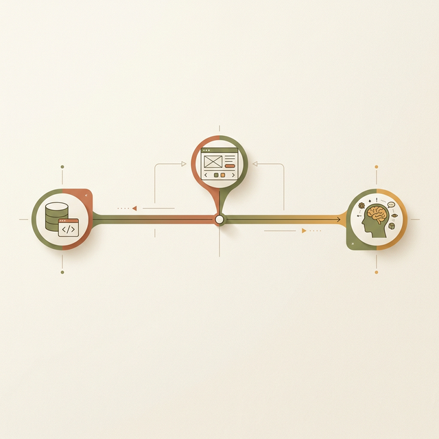
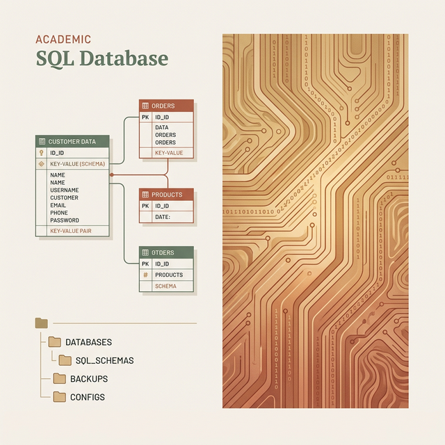
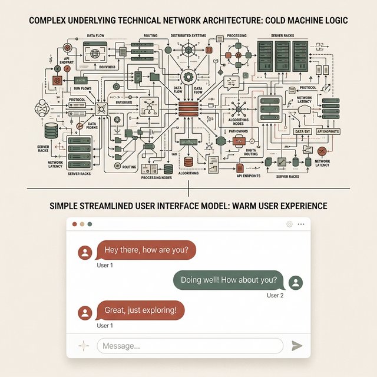
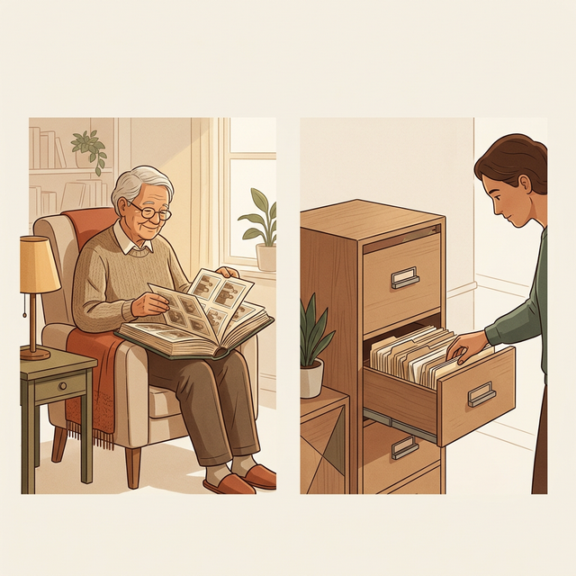
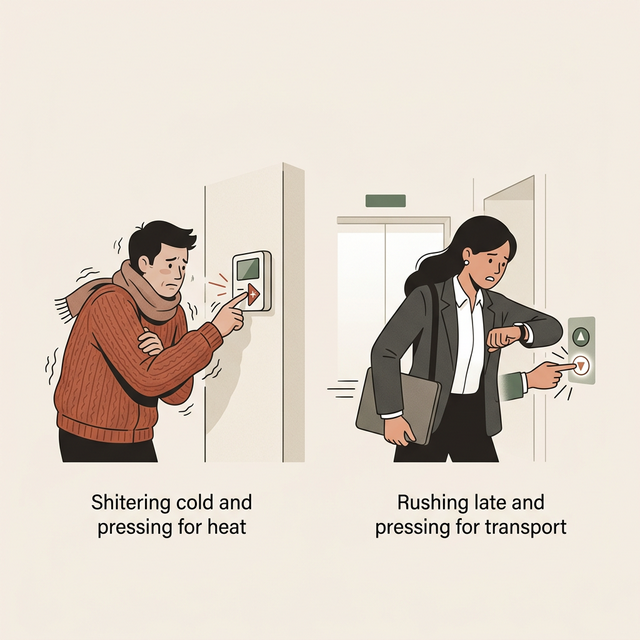
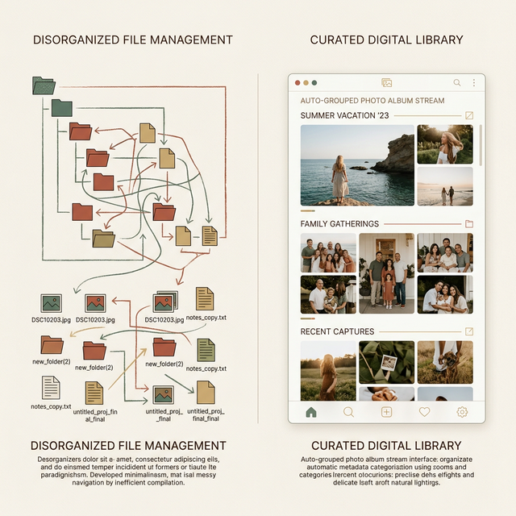
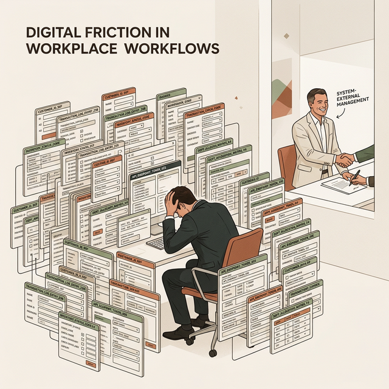
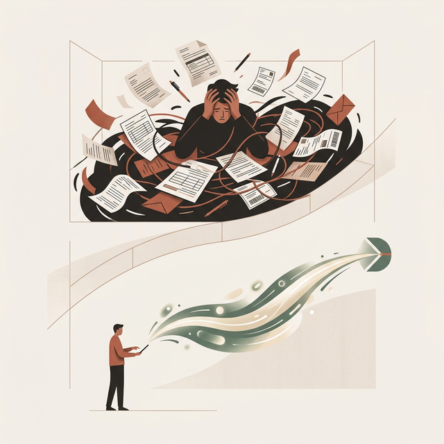

## 模块 3: 三种模型的战争 (25 min)

<!-- BUDGET: 4500 chars | STATUS: done -->

> **知识节点**: `about-face-mental-models`

> [VISUAL]
> **Slide**: w02-slide-11
> **Layout**: `Flow`
> *   **Asset**: 
> **Scene**: 一条水平光谱图。最左端标注"实现模型 Implementation Model"（配数据库/代码图标），最右端标注"用户心理模型 Mental Model"（配人脑/生活场景图标），中间用可滑动的指针标注"表现模型 Represented Model"（配 UI 界面图标）。指针越靠右即设计越优秀
> **Text**: Cooper 的三种模型博弈

鸿沟的深层根源是什么？Alan Cooper——《About Face》的作者，目标导向设计的奠基人——给出了一个直击灵魂的解答。

他说：**工程师建造的世界，和用户理解的世界，本质上是两个不同的宇宙**。它们之间的冲突，才是一切心智摩擦的元凶。这里存在着"三种模型"的拉锯战。

**(Pause: 3s)**

### 3.1 实现模型：工程代码的残酷逻辑

> [VISUAL]
> **Slide**: w02-slide-12
> **Layout**: Split
> *   **Asset**: 
> **Scene**: 左侧展示一段 SQL 数据库表结构代码和文件系统树状目录，右侧展示一个布满二进制流和电路板纹路的抽象背景
> **Text**: 冰冷的机器真相

这是机器**真实的运转方式**。在工程师眼中，这个世界是由离散的、确定性的结构组成的：数据库就是几十张互相关联的主键外键表格，你在屏幕上看到的"朋友圈"，在底层只是一串包含用户 ID、内容哈希值和时间戳的 JSON 字符流；一张温情的家庭合影，本质上就是一段写入在硅片晶体管或磁盘磁道上的二进制序列。实现模型天生就是碎片化的、高度抽象的、遵循严密数理逻辑的。

工程师每天和这套逻辑打交道，由于长期浸泡其中，他们往往会患上一种叫"知识的诅咒"的职业病——认为把底层的存储结构和运行状态直接暴露出来是"理所当然"且"最高效"的。但对普通最终用户来说——这是一门来自外星的语言。

顺便说一下由 Norman 提出的鸿沟理论和 Cooper 提出的模型论之间的共振关系。你可能已经注意到了——**鸿沟是表象，模型错位才是病根**。
当执行鸿沟出现时，往往是因为产品的表现模型太靠近实现模型——系统强迫用底层的工程术语（比如"输入端口"或"配置路径"）和用户对话，用户听不懂也无从下手。当评估鸿沟出现时，往往是因为表现模型没有如实且人性化地反映系统的真实改变——用户的期望无法和系统冷冰冰的执行结果对齐。Norman 的鸿沟是临床上的**症状诊断工具**，告诉你"血流在哪断了"；而 Cooper 的三种模型则是**病理学框架**，从基因层面告诉你"为什么会断"。

> [VISUAL]
> **Slide**: w02-slide-12b
> **Layout**: `Comparison`
> *   **Asset**: 
> **Scene**: 对比图。上方是充满 OAuth 2.0、消息分发队列架构的技术架构图；下方是微信圆润气泡的聊天界面。
> **Text**: 工程师的实现模型 vs 用户的表现模型

再比如大屏幕上展示的这个所有人再熟悉不过的例子：

> [CASE STUDY: 微信的两种宇宙结界]
> 打开微信开发者平台（WeChat Open Platform）的技术文档：你看到的是满屏幕的 OAuth 2.0 异步授权流程、Token 半衰期刷新机制、分布式消息队列架构以及高并发限流策略。这是极其硬核的实现模型宇宙。
> 但再打开你手机上的微信客户端：你看到的是圆润的绿色聊天气泡、随着指尖滑动的瀑布流朋友圈、以及春节抢红包时充满张力的动画特效。
> 请注意，这两个完全割裂的宇宙，描述的其实是**同一个数字系统**——它们之间唯一的区别在于，作为普通用户的你，这一辈子都不需要、也不应该知道 Token 到底是个什么东西。工程师必须面对丑陋但精确的实现模型；而你所面对的，是有一群名叫交互设计师的人，用代码为你苦心营造的一场**表现模型幻梦**。

### 3.2 心理模型：不求真理的生存直觉

> [VISUAL]
> **Slide**: w02-slide-13
> **Layout**: Split
> *   **Asset**: 
> **Scene**: 左侧为一位老人翻看实体相册的温馨照片，右侧为一个人凭直觉在抽屉柜里找文件的场景
> **Text**: 人类的朴素直觉

这是用户**脑子里的东西**。它来自物理世界的经验，来自常识，来自直觉。

老人觉得照片就应该被"放进"一本相册——按时间排、按人物分、翻到某一页就能看到去年春节的全家福。而不是"点击 D 盘 → Users → Photos → 2025 → 03 → IMG_20250301_143522.jpg"。

> [VISUAL]
> **Slide**: w02-slide-13b
> **Layout**: `Full`
> *   **Asset**: 
> **Scene**: 一个人闭着眼睛，头脑上方的思考气泡里有一个微缩的三维城市沙盘，他正在拨动沙盘里的交通信号灯
> **Text**: 不求真理，只求管用的微缩模型

> [DID YOU KNOW: Craik 与微缩世界模型]
> 心理模型（Mental Model）这个伟大的概念最早由苏格兰认知科学家 Kenneth Craik 在 1943 年提出。他惊人地指出：人类的大脑之所以进化到今天，是因为它能够在大脑皮层里构建一个外部物理世界的"小型计算模型"。就像你在脑子里玩沙盘推演一样，你用这个微缩模型来预测事物的走向，并在现实发生之前预判风险。

心理模型有一个非常核心的特征：**不求真理上的精确，只求生存上的"管用"**。
Alan Cooper 在《About Face》里举过一个极其绝妙的例子——**电影插电的心理模型**。问一个普通人："当你看一部电影素材时，电影是怎么动起来的？"大多数人的心理模型是：放映机里有一卷长长的胶片，光线穿过连续滑动的胶片，在银幕上投射出连贯的影子。这个模型"管用"，但它是**完全错误**的。电影的实现模型根本不是连续的，而是由每秒 24 张静止的单帧画面以特定的频率闪烁切换，加上黑色遮片遮挡拉片过程，最后依靠人眼的"视觉暂留"（Persistence of Vision）神经生理现象，强行拼凑出了一场会动的幻觉。
但用户需要知道视网膜暂留原理才能看电影吗？不需要。那个"连贯滑动胶片"的错误心理模型，完美支撑了倒带、快进、暂停等一系列交互操作。

再比如**家用插座模型**。你把吸尘器的插头拔出来，然后小心翼翼地不想让手碰到金属插脚，你潜意识里的模型往往是："电"就像水管里的自来水，储存在墙壁的插座孔里，插上去水流就进机器了。这在物理学上荒谬透顶（电流是闭合回路里自由电子的定向漂移），但作为一种日常生活的心理模型，它极其高效地保护你不被电死。

**(Pause: 3s)**

但这种建立在日常物理经验上的模型，在遭遇纯逻辑的数字空间时，有一半的概率会遭遇**史诗级的翻车**。人类的心理模型不仅顽固，而且极度依赖路径惯性。想一想从诺基亚实体键盘时代跨越到初代 iPhone 全触屏时代，有多少人因为"屏幕按下去没有物理反弹的咔哒声"而感到深深的焦虑与不安全感？那个时候人们的心理模型还是"打字必须是一个有物理行程的按压动作"，直到苹果通过极其优秀的视觉动画和高频振动马达反馈，花了整整三代产品的时间，才帮人类强行重构了"在玻璃平面上打字"的全新心理模型。

> [VISUAL]
> **Slide**: w02-slide-13c
> **Layout**: Split
> *   **Asset**: 
> **Scene**: 左侧是一个瑟瑟发抖的人把空调恒温器狂按到 32°C；右侧是快迟到的白领对着发亮的电梯下行按键开启狂按模式
> **List**: 阀门模型错用于开关式系统 | 人际催促模型错用于二进制回路

如屏幕上的这两个荒诞却真实的场景所示：

> [CASE STUDY: 恒温器与电梯按钮的心理延误]
> 我们来看心理系统的顽固引发的经典错误操作。寒冷的冬夜你回到家，屋子像冰窖，你急着给冻得发抖的婴儿取暖。在这个火烧眉毛的关头，你会怎么操作墙上的空调恒温器？绝大多数人的本能做法是：**一路狂按，直接把目标温度调到最高（比如 32°C）**。
> 为什么？因为这批人潜意识里调取了他们在物理世界里控制老式煤气灶或者水龙头的心理模型——**"阀门模型（More is More）"**。他们理所当然地认为，只要把温度指示阈值设置得越高，系统输出的热量或动能就越猛烈，房间暖得就越快。
> 但现代家用恒温空调的**实现模型**究竟是什么？它是极其死板的**开关式（Bang-Bang control）**逻辑。空调压缩机并没有所谓的"大中小排量"，它只会以出厂设定的单一最大功率疯狂制热，直到室温传感器探测到环境达到目标温度后，瞬间彻底切断电源停止工作。所以，如果你想让房间达到舒适的 25°C，直接设置 25°C 和夸张地设置 32°C，升温到 25°C 所消耗的**物理时间是完全一模一样的**！你不仅没有加速过程，反而会因为睡着后忘记调回温度而被活活热醒。
> 同样的心理模型错用，还出现在你等办公楼老式电梯的那个早上。当你快迟到时，你一定疯狂地连续狂按那颗已经亮起来的下行按钮。人们潜意识里认为"多按几次电梯会意识到我更着急"，将人际交往中的"催促声量模型"强行套用在了只会识别"0"和"1"的二进制继电器回路上。这就是心理模型带来的典型心智摩擦：**用户的本能常识，在遭遇机器逻辑时，变成了彻头彻尾的阻碍和无用功。**

### 3.3 表现模型：掩盖复杂的终极谎言

这就是你——设计师和开发团队——最终做出来的**用户界面**。它是实现模型和心理模型之间的**翻译层**。

> [VISUAL]
> **Slide**: w02-slide-14
> **Layout**: `Comparison`
> *   **Asset**: 
> **Scene**: 左列标题"灾难"——复杂的企业级 ERP 系统截图（满屏的必填表单项、数据库逻辑赤裸暴露），右列标题"典范"——iPhone 照片 App 界面（按年/月/日自动分组的照片流，无任何文件路径暴露）
> **List**: 灾难：表现模型 ≈ 实现模型 → 用户被迫学习工程逻辑 | 典范：表现模型 ≈ 心理模型 → 技术复杂性被隐藏

**最灾难的设计，就是彻底摆摆手的工程师思维：把表现模型做得等同于实现模型。**

这是上一代开发工程师最习以为常的做法——"我知道底层的数据集是怎么存储的，节点是怎么遍历的，所以我就原封不动把这套存储和遍历结构映射到屏幕上。"早期的 PC 文件管理器就是**实现模型的终极裸奔**：C 盘、D 盘、根目录、文件夹套文件夹、还有诡异的隐藏系统文件——这完全就是对磁盘物理分区和文件系统树（File System Tree）的逐字节忠诚转译。

> [VISUAL]
> **Slide**: w02-slide-14b
> **Layout**: `Full`
> *   **Asset**: 
> **Scene**: 一个被成百上千个类似"数据库字段"级别的输入框淹没的崩溃业务员，背景是微笑着签单的非用户老板
> **Text**: 当表现模型堕落为实现模型

这也是为什么大屏幕上的这种悲剧每天都在企业中上演：

> [CASE STUDY: 买家暴政下的 ERP 灾难]
> 这种无套路裸奔在今天的企业级 B2B 软件（如 ERP 或 CRM 系统）中依然大行其道。交互设计界有一种说法叫"买家暴政"（Tyranny of the Buyer）：因为拍板买软件的老板，自己并不需要每天去使用这个软件。于是，软件开发商为了中标，就会把所有他们能实现的底层功能、数据库接口、成百上千的复杂参数配置统统平铺到界面上，以此来向客户证明"我们的系统无比庞大且无所不能"——这导致了满屏犹如驾驶舱仪表盘般令人窒息的输入框和下拉菜单。最终，那个可怜的一线业务员，本来的心理模型只是简简单单的"把这笔货物出库发走"，却被迫要去面对诸如"选择出库栈单节点"、"勾选仓库流转批次锁状态"这种纯粹底层数据库建表层面的实现逻辑。这种表现模型的堕落，是导致企业员工每天被软件折磨得痛不欲生的万恶之源。

**(Pause: 3s)**

**而在这个时代，最顶尖的体验设计，其唯一使命就是将表现模型死命地推向用户心理模型的那一端。**

早期 iPhone 的 "照片"（Photos）App 为什么极具划时代意义？因为它做了一个当时 PC 端不敢做的决定——**彻底埋葬文件系统**。你手里拿着 iPhone，你根本不知道任何一张照片保存在 iOS 的哪个隐藏文件夹或哈希路径里。苹果的交互设计师强行用代码构造了一个完全顺应用户心理模型的表现层：照片被提取了 EXIF 元数据，然后自动按照**年、月、日**这种人类感知时间的尺度，或者按照**人脸识别、GPS 地点**这种人类感知社会关系和空间的尺度，平铺成了一道回忆流。
在这里，你不需要发动慢思考去"寻找特定文件"，你只需要靠直觉快思考去"浏览过去的回忆"。这就是对那套冰冷工程复杂性进行的最优雅的一次**数字降维打击**。

> [VISUAL]
> **Slide**: w02-slide-14c
> **Layout**: Split
> *   **Asset**: 
> **Scene**: 左侧用户的心理气泡是"把消息扫进纸篓，还能找回"；右侧服务器真实的动作是"把数据块送进粉碎机物理抹除"
> **Text**: 表现模型隐瞒了真实的破坏力

> [CASE STUDY: 微信长按删除的心理模型陷阱]
> 再看一个每天都发生在你身边的博弈。当你长按微信里的一条长语音消息，弹出菜单并选择"删除"时——你的心理模型其实非常宽容，你认为这就像收拾书桌，只是"把它从当前的视线中移到废纸篓里，只要我想，以后还能找回来"。
> 但微信服务器端的**实现模型**执行的是冷血的永久物理删除（为了服务器成本和隐私合规）：一旦删除指令下达，数据块即刻抹除，**不可恢复**。有多少人在这个轻描淡写的操作上翻过车，甚至丢失过极其重要的法律证据或者已故亲人的语音？
> 这就是一个典型的表现模型没有诚实传达实现模型破坏力后果的悲剧。界面上那个视觉份量感极弱的"删除"二字，完全没有匹配它背后"永久从这个宇宙消失"的严重程度。

> [VISUAL]
> **Slide**: w02-slide-14d
> **Layout**: `Comparison`
> *   **Asset**: 
> **Scene**: 流程对比图。上方代表过去：用户手动填表 → 找快递 → 填单号的满屏任务节点；下方代表现在：点击退款 → 快递员默默收走 → 秒退款的极简目标
> **Text**: 掩盖操作节点，直达用户的最终目标

与之相反，我们来看看真正优秀的设计是如何脱胎换骨的：

> [CASE STUDY: 淘宝极速退换货的表现模型跃迁]
> 十年前的淘宝退货流程，简直是让用户当了一回仓储物流操作员操作手册：你自己要去茫茫汪洋里找到历史订单 → 点击一个隐蔽的"退货退款"申诉链 → 填写冗长的退货原因表单与纠纷凭证 → 等待商家 48 小时复核并手动发来退货地址 → 你自己找顺丰快递员上门取件、手写地址 → 最后还要像填验证码一样把 15 位快递单号敲回淘宝系统里。整个流程就是一套**臃肿的实现模型展示窗**——每一步都在强迫用户去学习和操纵阿里庞大的底层物流履约节点。
> 但今天的淘宝或京东做了什么？你点"我要退货"，然后——**结束了**。系统自动匹配履约记录生成快递子账号取件码，菜鸟或京东快递员收到系统派单直接在你预约的时间上门扫码取件——包裹拿走那一刻，钱就自动退回你的账户了。
> 这是一个伟大的表现模型跃迁：交互界面从"**逼着用户一步步操纵底层功能节点**"（Task-directed），彻底进化到了"**只关注并直接满足用户的最终目标**"（Goal-directed）。

> [TEACHING MOMENT: 预告目标导向设计]
> Cooper 有一句极其霸道的名言：**"设计的终局博弈，只有一个解，那就是让表现模型无限逼近且伪装成用户的心理模型，同时把实现模型的一切痕迹就地掩埋。"** 
> 每当你在界面上暴露出一个只有网管才懂的技术术语、一个必须依赖开发文档才能看懂的系统状态、一个仅仅为了方便后端建表而设定的无意义必须填写项，你都是在把用户粗暴地推向实现模型的炼狱——你，就是心智摩擦的缔造者。而淘宝退货流程中展现出来的那种"只管目标，掩埋操作"的设计哲学，就是大名鼎鼎的**目标导向设计（Goal-Directed Design）**。它将是我们 W05 要探讨的绝对核心。
>
> 用教材里 Norman 的话说：**设计师的模型**(Designer's Model) 是设计团队心中理想的系统运作方式；**系统映像**(System Image) 是系统通过界面、文档和帮助展现出来的样子；**用户的模型**(User's Model) 是用户通过系统映像所构建的理解。三者对齐，用户自如；三者错位，摩擦丛生。Norman 的三角框架和 Cooper 的三种模型论殊途同归——核心都是在说：**设计的本质，是翻译。**

> [DID YOU KNOW: 苹果 Vision Pro 与空间计算时代的心理模型真空]
> 理论总是美好的，但在前沿科技落地的真空区，三种模型的灾难经常以最狂野的形态爆发。
> 今天硅谷最疯狂的战场是 XR 空间计算平台（Spatial Computing）。当我们带上类似 Apple Vision Pro 这类头显，置身于一个四周没有任何实体边界的全息投影环境里时，由于这个新世界完全没有给用户灌输过任何成熟的"系统映像"（因为一切都在摸索期），导致用户的**心理模型在这个新位面里是一片彻底茫然的废墟真空**。
> 比如在一个没有任何墙面或桌子的空虚客厅里，浮着一个全息的虚拟浏览器窗口。如果你想把它"关闭"，你会怎么做？有的人的心理模型是去寻找右上角的红叉（沿用了 PC 桌面的遗迹），有的人则会像扔飞镖一样用手把它"甩出去"。
> 这时因为空间计算技术本身的感知识别实现模型极其复杂且存在延迟与视觉误差，导致经常发生严重的错误对齐。人类在现实中**拿取一个苹果的物理模型**是三维触觉与肌肉力反馈的完美闭环（你能感受到其实体重量与外壳的粗糙阻尼）；但在目前的光场投射技术中，你去"捏取"一个虚拟 3D 物体，捏到的只是一团虚幻的光谱，你的指腹没有得到任何实质阻力的压感阻尼——这种严重的反馈错位，瞬间将人类几十万年进化出来的物理抓取心理模型击得粉碎，带来了长足强烈的虚无感与幻灭感。
> 在新的范式完全沉淀之前，所有的第一代拓荒设计都在极力用一些非常拙劣的物理世界比喻（比如强行在虚拟空间里画一双手或渲染一根激光射线光束）去勉强维持用户的掌控感。这场关于表现模型是否能成功骗过人类古老中枢神经元的跨物种世纪欺诈战，才刚刚打响。

**(Pause: 3s)**

但如何让冰冷的数字世界贴近人类的常识？设计师们发明了一把双刃剑——**界面隐喻**。

---
