## 模块 3: 三种模型的战争 (25 min)

<!-- BUDGET: 4500 chars | STATUS: done -->

> **知识节点**: `about-face-mental-models`

> [VISUAL]
> **Slide**: w02-slide-12c
> **Layout**: `Comparison`
> *   **Asset**: 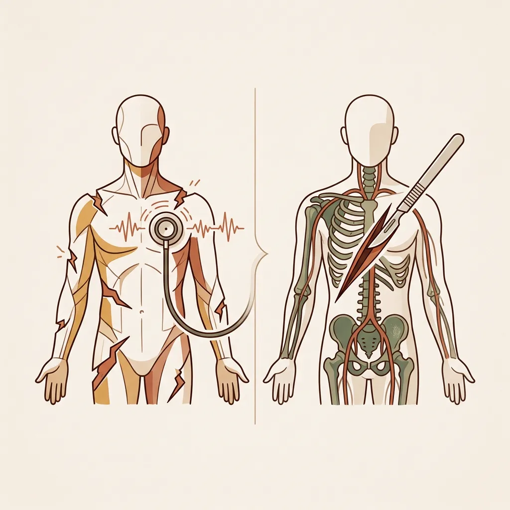
> **Scene**: 听诊器与解剖刀的比喻。左侧展示 Norman 的执行/评估鸿沟（症状表现）；右侧展示 Cooper 的模型错位（病理根源）
> **List**: Norman 鸿沟：血流断裂的症状 | Cooper 模型：基因错位的病根
> **Text**: 症状与病根

Norman 告诉我们"血流在哪断了"——它是一副听诊器，诊断出用户是卡在了执行还是评估环节。但**为什么会断**？Cooper 举起了解剖刀，追问了更深一层：断裂的根源，不在操作步骤本身，而是工程师建造的系统，和用户脑中理解的世界，**根本不在同一个频道上**。鸿沟只是表面裂缝，底层思维模型的错位才是地基问题。

那么，到底是什么在发生错位？

> [VISUAL]
> **Slide**: w02-slide-11_v2
> **Layout**: `Flow`
> *   **Asset**: 
> **Scene**: 一条清晰的水平滑块条（Slider）界面隐喻。滑条的最左端是一个代表"机器逻辑"的几何图标（如硬朗的数据块），最右端是一个代表"人类感知"的有机图标（如柔软的树叶/头脑），在滑条轨道中间有一个大而清晰的可滑动按钮（Slider Thumb）。这三个元素直观地呈现出机器、用户与UI界面的滑动博弈关系。整体呈现学术极简的纯净图示风格，无文字排版。
> **List**: 实现模型：机器冰冷逻辑 | 表现模型：中间翻译层 | 心理模型：人类朴素直觉
> **Text**: Cooper 的三种模型博弈

Cooper 提出了著名的**三种模型博弈**框架。大家请看这条光谱：在它的最左端，是代表着机器冰冷运转逻辑的**实现模型（Implementation Model）**；在它的最右端，是代表着人类朴素经验直觉的**心理模型（Mental Model）**。这两个平行宇宙之间天然存在着巨大的断层。

而夹在它们中间，那个可以在光谱上左右滑动的指针，就是我们每天面对的 UI 界面——Cooper 称之为**表现模型（Represented Model）**。交互设计的全部战争，就是看这个表现模型，究竟是向左堕落为机器的帮凶，还是向右进化为人类的贴心翻译。

让我们先走到光谱的最左端，看看那个冰冷的地基。

**(Pause: 3s)**

### 3.1 实现模型：底层代码暴露机器逻辑

> [VISUAL]
> **Slide**: w02-slide-12
> **Layout**: Split
> *   **Asset**: 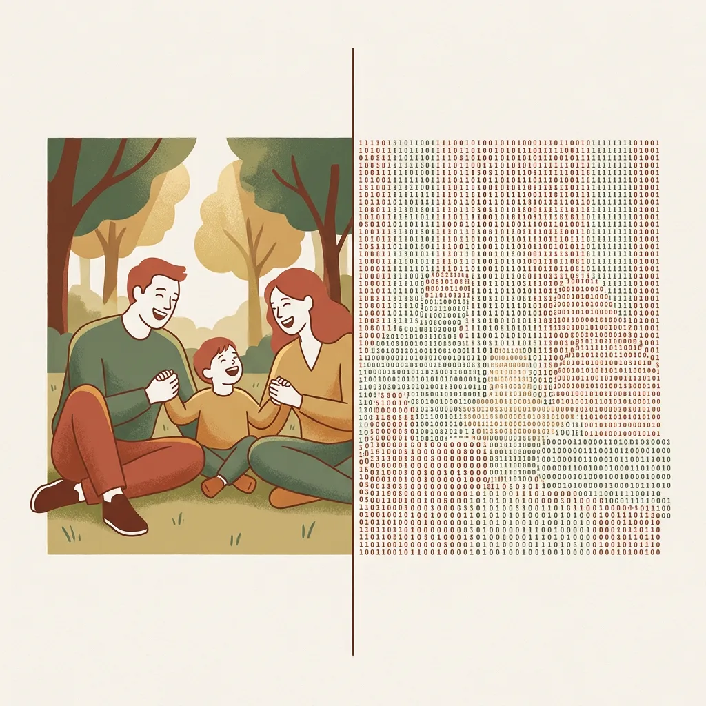
> **Scene**: 左侧是一张充满人情味的温馨家庭合影（如父母和孩子在公园大笑），右侧是这张照片在机器眼中的真实形态——由密密麻麻的 0 和 1 组成的无休止的二进制数据流，形成强烈的认知反差
> **Text**: 冰冷的机器真相

这是机器**真实的运转方式**。在工程师眼中，世界是由精确的数据结构构成的：你眼中温馨的家庭合影，在底层只是磁盘上的二进制序列；你看到的"朋友圈"，本质只是一串串字符流。

工程师每天浸泡在这套逻辑里，极易患上"知识的诅咒"——他们认为把底层结构直接暴露给用户是"理所当然"且"最高效"的。但这套冰冷的机器语言，对普通人而言就是认知灾难。

> [VISUAL]
> **Slide**: w02-slide-12b
> **Layout**: `Comparison`
> *   **Asset**: 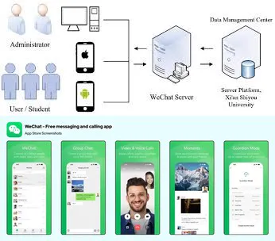
> *   **Asset (AI fallback)**: 
> **Scene**: 对比图。上方是充满 OAuth 2.0、消息分发队列架构的技术架构图；下方是微信圆润气泡的聊天界面。
> **Text**: 工程师的实现模型 vs 用户的表现模型
> **List**: 工程师视角：实现模型 = 真实运转 | 用户视角：心理模型 = 朴素直觉

> [CASE STUDY: 微信的两种宇宙结界]
> 打开微信开发者平台（也就是微信的 WeChat Open Platform）的技术文档：你看到的是满屏幕的 OAuth 2.0 异步授权流程、Token 半衰期刷新机制、分布式消息队列架构以及高并发限流策略。这是极其硬核的实现模型宇宙。
> 但再打开你手机上的微信客户端：你看到的是圆润的绿色聊天气泡、随着指尖滑动的瀑布流朋友圈、以及春节抢红包时充满张力的动画特效。
> 请注意，这两个完全割裂的宇宙，描述的其实是**同一个数字系统**——它们之间唯一的区别在于，作为普通用户的你，这一辈子都不需要、也不应该知道 Token 到底是个什么东西。工程师必须面对丑陋但精确的实现模型；而你所面对的，是有一群名叫交互设计师的人，用代码为你苦心营造的一场**表现模型幻梦**。

### 3.2 心理模型：生存直觉无视系统真理

> [VISUAL]
> **Slide**: w02-slide-13
> **Layout**: Split
> *   **Asset**: 
> *   **Asset (AI fallback)**: 
> **Scene**: 左侧为一位老人翻看实体相册的温馨照片，右侧为一个人凭直觉在抽屉柜里找文件的场景
> **Text**: 人类的朴素直觉

当普通用户面对系统时，他们脑子里到底装了什么？左侧的老人翻看实体相册、右侧的人凭直觉在抽屉柜里找文件——这就是用户**脑子里的东西**。它来自物理世界的经验，来自日常常识，来自肌肉直觉，未经任何工程加工。

老人觉得照片就应该被"放进"一本相册——按时间排、按人物分、翻到某一页就能看到去年春节的全家福。而不是"点击 D 盘 → Users → Photos → 2025 → 03 → IMG_20250301_143522.webp"。

> [VISUAL]
> **Slide**: w02-slide-13b
> **Layout**: `Full`
> *   **Asset**: 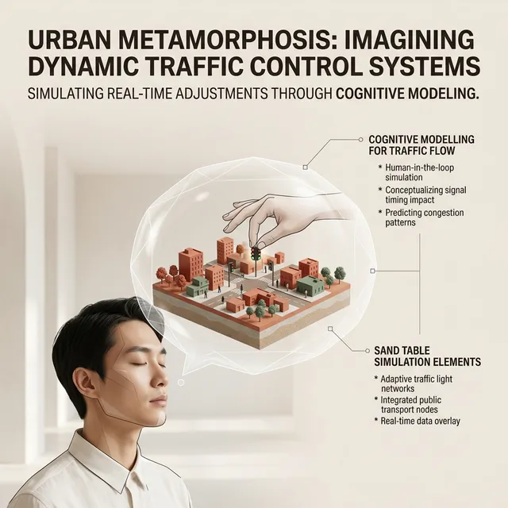
> **Scene**: 一个人闭着眼睛，头脑上方的思考气泡里有一个微缩的三维城市沙盘，他正在拨动沙盘里的交通信号灯
> **Text**: 不求真理，只求管用的微缩模型
> **Source**: AI Generated

> [DID YOU KNOW: Craik 与微缩世界模型]
> 心理模型——英文叫 Mental Model——这个伟大的概念最早由苏格兰认知科学家 Kenneth Craik 在 1943 年提出。他惊人地指出：人类的大脑之所以进化到今天，是因为它能够在大脑皮层里构建一个外部物理世界的"小型计算模型"。就像你在脑子里玩沙盘推演一样，你用这个微缩模型来预测事物的走向，并在现实发生之前预判风险。

心理模型有一个非常核心的特征：**不求真理上的精确，只求生存上的"管用"**。
> [VISUAL]
> **Slide**: w02-slide-13e
> **Layout**: `Split`
> *   **Asset**: 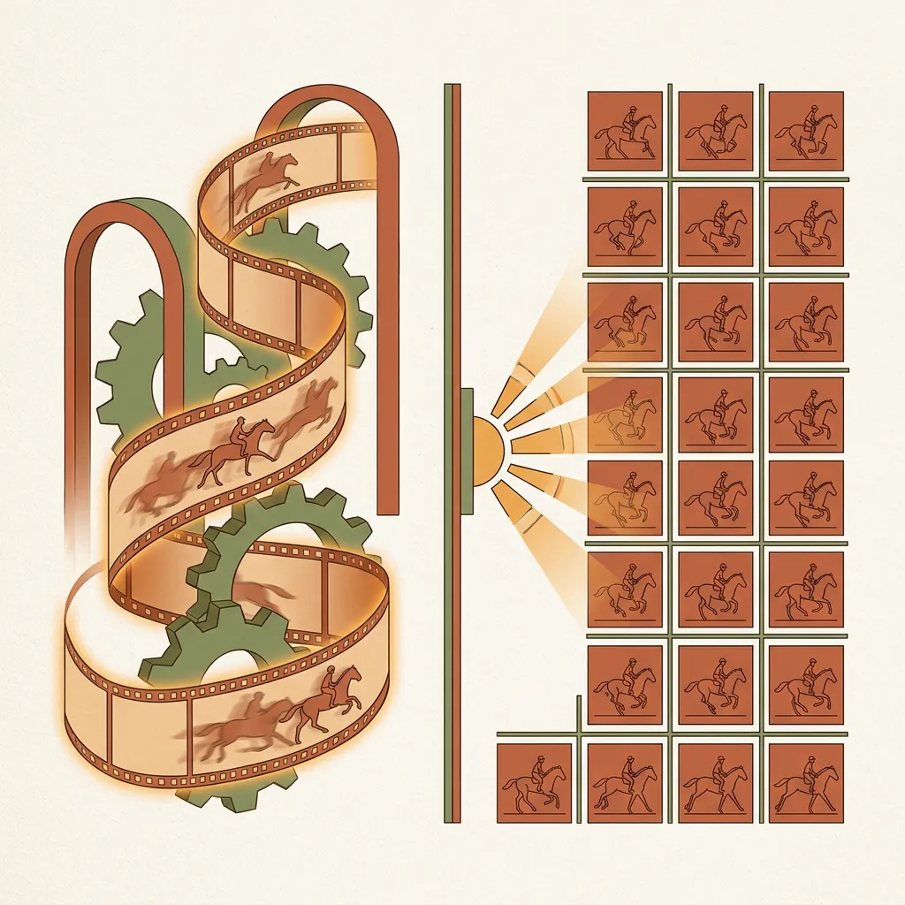
> **Scene**: 电影放映心理模型与实现模型对比。左侧是用户脑补的"连续滑动的胶片"；右侧是真实物理实现"每秒 24 帧静止画面闪烁"
> **List**: 用户的直觉：连续滑动 | 机器的真相：离散闪烁
> **Text**: 管用但错误的心理模型

问一个普通人："电影是怎么动起来的？"多数人的心理模型是：胶片连续滑过光源，投射出连贯的影子。这个模型"管用"，却**完全错误**——电影实际是每秒 24 帧静止画面的高速闪烁，靠人眼的视觉暂留拼凑出运动幻觉。但用户需要知道这些吗？不需要。错误的心理模型照样支撑了倒带、快进、暂停。

> [VISUAL]
> **Slide**: w02-slide-13e_2
> **Layout**: `Comparison`
> *   **Asset**: 
> **Scene**: 物理插座与电流模型对比。左侧是用户脑补的"插座里装着水一样的电"；右侧是真实的"闭合回路电子漂移"物理真相
> **List**: 心理直觉：电如自来水 | 物理真相：闭合回路电子流
> **Text**: 日常生活中的微缩模型

再比如**家用插座模型**。拔插头时我们常会刻意避开金属插脚，因为潜意识把"电"当成了"水"——认为只要碰到插脚，电就会像水一样"漏"到自己身上。尽管物理真相是"闭合回路才会触电"，但这种"接触即漏水"的简单直觉，恰好帮助我们本能地避开了危险。

**(Pause: 3s)**

> [VISUAL]
> **Slide**: w02-slide-13d
> **Layout**: `Comparison`
> *   **Asset**: 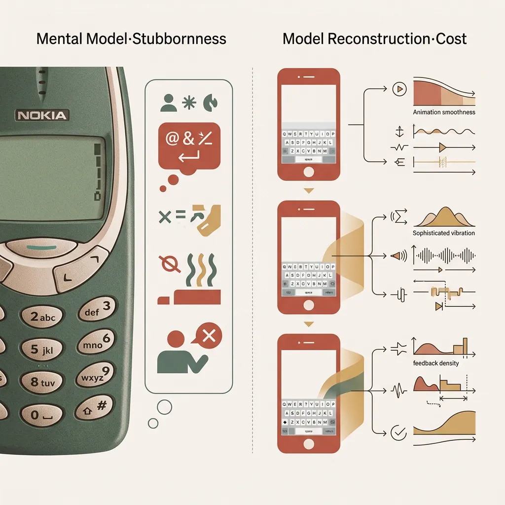
> **Scene**: 左右对比图。左列标题「心理模型·顽固」——诺基亚实体键盘手机的按键特写，旁边标注老用户心理气泡「这才叫打字，需要忍火」；右列标题「模型重构·代价」——iPhone 早期触屏键盘连续三代的演进过程，每代产品列表旁边标注造就新模型的设计投入（动画、振动、反馈密度逐代加强）
> **List**: 心理模型顽固：物理经验全面入侵 | 模型重构：需要多代产品的连续训练
> **Text**: 心理模型的顽固性——重构的代价

但建立在日常物理经验上的模型，在遭遇数字空间时，极易遭遇**严重的错位**。人类的心理模型不仅顽固，而且依赖路径惯性。从实体键盘跨越到全触屏时代，许多人因为"没有物理按键的反馈"而感到不适应与焦虑。当时的心理模型还是"打字必须有物理按压行程"，直到苹果通过视觉动画和振动反馈，花了三代产品的时间，才帮用户重构了"在屏幕平面打字"的新模型。

> [VISUAL]
> **Slide**: w02-slide-13c
> **Layout**: Split
> *   **Asset**: 
> **Scene**: 左侧是一个瑟瑟发抖的人把空调恒温器狂按到 32°C；右侧是快迟到的白领对着发亮的电梯下行按键开启狂按模式
> **List**: 阀门模型错用于开关式系统 | 人际催促模型错用于二进制回路
> **Text**: 心理模型错用——阀门 vs 开关

这种基于路径惯性的盲目应用，直接导致了现实中荒诞却真实的系统对抗：

> [CASE STUDY: 恒温器与电梯按钮的心理延误]
> 冬夜回家急着取暖，你怎么调恒温器？绝大多数人的本能是：**一路狂按到 32°C**。为什么？因为潜意识调取了水龙头式的**"阀门模型（More is More）"**——越拧越大，越热越快。

> [VISUAL]
> **Slide**: w02-slide-13c_3
> **Layout**: `Center`
> *   **Asset**: 
> **Scene**: 阀门模型与开关模型的对比：左边是越拧越大的水龙头，右边是只有“开”和“关”两个死板状态的空调压缩机
> **List**: 用户的阀门模型：越多越快 | 机器的开关模型：恒定输出
> **Text**: 恒温器的认知错位

> 但现代家用恒温空调的**实现模型**究竟是什么？它是死板的**开关式逻辑——工程上称为 Bang-Bang control**。空调压缩机并没有大中小排量，它只会以单一功率持续制热，直到室温传感器探测到环境达到目标温度后，瞬间彻底切断电源停止工作。所以，如果你想让房间达到舒适的 25°C，直接设置 25°C 和夸张地设置 32°C，升温到 25°C 所消耗的**物理时间是完全一模一样的**！你不仅没有加速过程，反而会因为睡着后忘记调回温度而被活活热醒。

> [VISUAL]
> **Slide**: w02-slide-13c_2
> **Layout**: `Split`
> *   **Asset**: 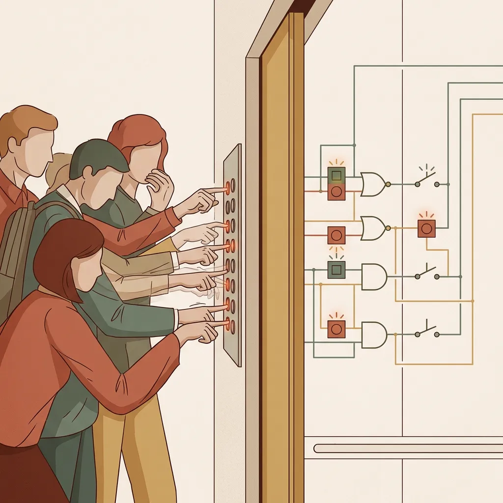
> **Scene**: 电梯按钮的人际博弈隐喻。左侧是人们焦急地狂按电梯键；右侧是电梯背后冰冷的 0/1 继电器回路系统
> **List**: 人的直觉：急促呼唤 | 机器的事实：只认 0 和 1
> **Text**: 狂按电梯键的心理延误

> 同理，快迟到时你狂按已经亮了的电梯下行键——这是将人际"催促声量"模型套用在了只认 0 和 1 的继电器上。**用户的本能常识遭遇机器逻辑，就变成了无用功。**

这就是你——设计师和开发团队——最终做出来的**用户界面**。它是实现模型和心理模型之间的**翻译层**。

> [ACTIVITY: M03 理解检查 · 日常心理模型拆解]
> **Type**: `QA`
> **Duration**: `1min`
> **Desc**: 快速检验：大家在操作家用微波炉的转盘旋钮时，脑子里用的是什么心理模型？是"发条倒计时"还是"火力控制阀"？

### 3.3 表现模型：终极谎言掩盖底层复杂

> [VISUAL]
> **Slide**: w02-slide-14f
> **Layout**: `Flow`
> *   **Asset**: 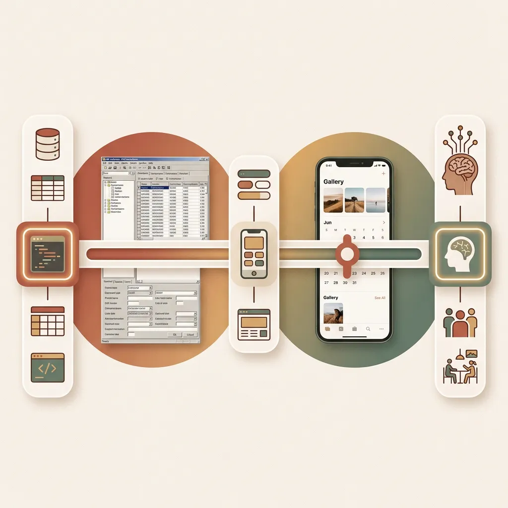
> **Scene**: 一条水平光谱图。最左端标注「实现模型」（配数据库表结构代码图标），最右端标注「心理模型」（配人脑/生活场景图标），中间可滑动的指针标注「表现模型」（配 UI 界面图标）。左侧圆弧区域放置 ERP 截图（极差），右侧圆弧区域放置 iPhone Photos 截图（极优），指针越靠右设计越优秀
> **List**: 灾难：表现模型 ≈ 实现模型 → 用户学机器逻辑 | 典范：表现模型 ≈ 心理模型 → 工程复杂性隐藏
> **Text**: Cooper 表现模型光谱——越靠右越优秀

最灾难的设计，就是彻底摆摆手的工程师思维：把表现模型做得等同于实现模型。

#### 1. 偷懒的翻译官：堕落为实现模型

这是上一代开发工程师最习以为常的做法——"我知道底层的数据集是怎么存储的，节点是怎么遍历的，所以我就原封不动把这套存储和遍历结构映射到屏幕上。"早期的 PC 文件管理器就是**实现模型的终极裸奔**：C 盘、D 盘、根目录，这完全就是对物理磁盘和文件系统树（File System Tree）的逐字节忠诚转译。

> [VISUAL]
> **Slide**: w02-slide-14b
> **Layout**: `Full`
> *   **Asset**: 
> **Scene**: 一个被成百上千个类似"数据库字段"级别的输入框淹没的崩溃业务员，背景是微笑着签单的非用户老板
> **Text**: 当表现模型堕落为实现模型

> [CASE STUDY: 买家暴政下的 ERP 灾难]
> 这种无套路裸奔在今天的企业级 B2B 软件——例如 ERP 或 CRM 中依然大行其道。交互设计界称之为"买家暴政"（Tyranny of the Buyer）：拍板买软件的老板自己不用，软件开发商为了中标，就会把所有复杂的数据库接口和参数配置统统平铺到界面上。最终，那个可怜的一线业务员本来的心理模型只是简简单单的"把货物出库"，却被迫去面对诸如"选择栈单节点"这种纯底层实现的逻辑。表现模型的堕落，带来了灾难级的认知负荷。

**(Pause: 3s)**

#### 2. 贴心的翻译官：向心理模型的终极跃迁

> [VISUAL]
> **Slide**: w02-slide-14b_2
> **Layout**: `Center`
> *   **Asset**: 
> **Scene**: 破茧重生的表现模型：从左侧代表代码、数据的生硬外壳，逐渐过渡到右侧自然、感性的人类视角界面
> **List**: 掩埋工程底层 | 重塑心理直觉
> **Text**: 表现模型向心理模型的终极跃迁

**而在体验至上的时代，最顶尖的设计，其唯一使命就是将表现模型死命地推向用户心理模型的那一端。**

> [VISUAL]
> **Slide**: w02-slide-14g
> **Layout**: `Comparison`
> *   **Asset**: 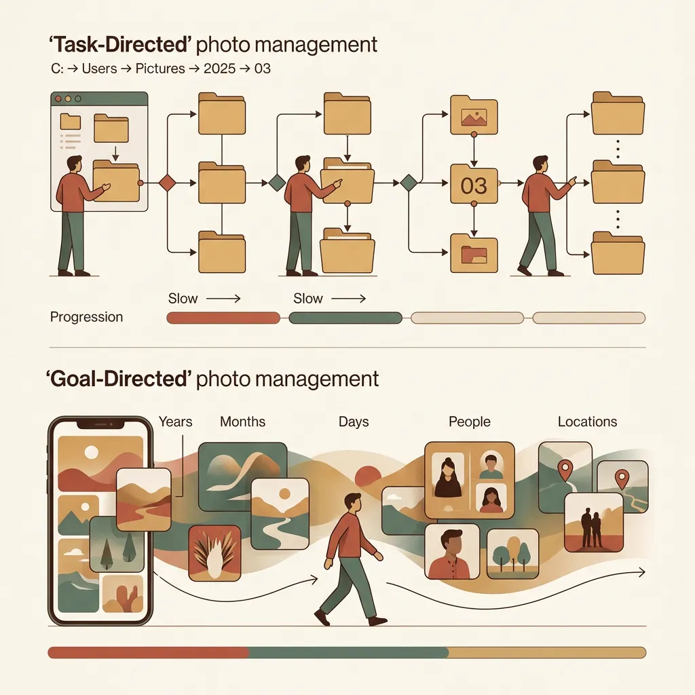
> **Scene**: 上下对比图。上方标题「任务导向 Task-Directed」——早期 PC 照片管理界面，用户必须点击「C盘 → Users → Pictures → 2025 → 03」逐层导航；下方标题「目标导向 Goal-Directed」——iPhone Photos 自动按「年月/地点」分组的回忆流，文件路径完全消失
> **List**: 任务导向：用户操纵底层功能节点 | 目标导向：界面包裹底层操作节点
> **Text**: 任务导向 vs 目标导向的表现模型跃迁

早期 iPhone 的 "照片"（Photos）App 为什么极具划时代意义？因为它做了一个当时 PC 端不敢做的决定——**彻底埋葬文件系统**。你手里拿着 iPhone，根本不知道照片保存在哪个隐藏的哈希路径里。苹果用代码构造了一个完全顺应心理模型的表现层：自动按**年、月、日**或**空间地点**这种人类感知尺度，平铺成一道回忆流。在这里你不需要去"寻找特定文件" ，只需要"浏览过去回忆"。这便是最优雅的翻译：用人类的尺度，覆盖机器的尺度。

> [VISUAL]
> **Slide**: w02-slide-14d
> **Layout**: `Comparison`
> *   **Asset**: 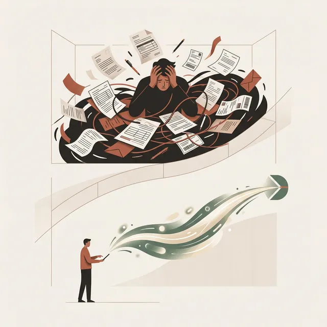
> **Scene**: 流程对比图。上方：用户找快递 → 填单号的满屏任务节点；下方：点击退款 → 快递员默默收件 → 秒退款的极简目标
> **Text**: 掩盖操作节点，直达用户的最终目标
> **List**: 过去：手动找快递 + 填单号 | 现在：点退款 + 快递员收件

同样的跃迁也发生在服务流程的设计上：

> [CASE STUDY: 淘宝极速退换货的表现模型跃迁]
> 十年前的淘宝退货流程，是一套暴露实现模型的展示窗：找订单 → 点退货 → 等复核 → 找快递 → 填单号。它强迫用户去学习底层的物流流转节点。
> 但今天的淘宝，你点"我要退货"，结束了。系统自动匹配履约记录派单，快递员上门取走包裹那一刻钱就退回了。交互界面从"**逼着用户一步步操纵底层功能节点**"（Task-directed），进化到了"**只关注并直接满足最终目标**"（Goal-directed）。

> [TEACHING MOMENT: 预告目标导向设计]
> Cooper 对此有一个核心论断：**"设计的终局，就是让表现模型无限逼近用户的心理模型，同时把实现模型的痕迹就地掩埋。"**
> 无论是 iPhone 的文件隐藏，还是淘宝的节点掩埋，都是业界著名的**目标导向设计（Goal-Directed Design）**。它将是我们 W05 要探讨的绝对核心。

> [VISUAL]
> **Slide**: w02-slide-14d_2
> **Layout**: `Center`
> *   **Asset**: 
> **Scene**: 设计师手握"翻译机"，将左边极度复杂的机器模型，翻译成右边符合直觉的心理沙盘模型
> **List**: 隐藏实现 | 拟合直觉 | 翻译机器语言
> **Text**: 设计的终局博弈：做好翻译工作

#### 3. 说谎的翻译官：表现模型的危险边界

但是，将表现模型无限推向心理模型，就永远正确吗？并不是。

> [VISUAL]
> **Slide**: w02-slide-14c
> **Layout**: Split
> *   **Asset**: 
> **Scene**: 左侧用户的心理气泡是"把消息扫进纸篓，还能找回"；右侧服务器真实的动作是"把数据块送进粉碎机物理抹除"
> **Text**: 表现模型隐瞒了真实的破坏力

> [CASE STUDY: 微信长按删除的心理模型陷阱]
> 当你长按微信语音并选择"删除"时，你的心理模型非常宽容，认为这就像收拾书桌："把它移到废纸篓里，以后还能找回来"。
> 但微信服务器端的**实现模型**执行的是冷血的永久物理删除（为了服务器合规与成本）：数据块即刻抹除，不可恢复。有多少人因此丢失过极其重要的法律证据？
> 这就是**表现模型过度迎合轻量心理模型，却没有诚实传达底层破坏力**的悲剧。界面上轻描淡写的"删除"二字，完全没有匹配它背后"从宇宙中永久消失"的严重程度。这，同样是缔造心智摩擦的根源。

#### 4. 没有字典的翻译官：在真空里重建模型

> [VISUAL]
> **Slide**: w02-slide-14e_1b
> **Layout**: `Center`
> *   **Asset**: 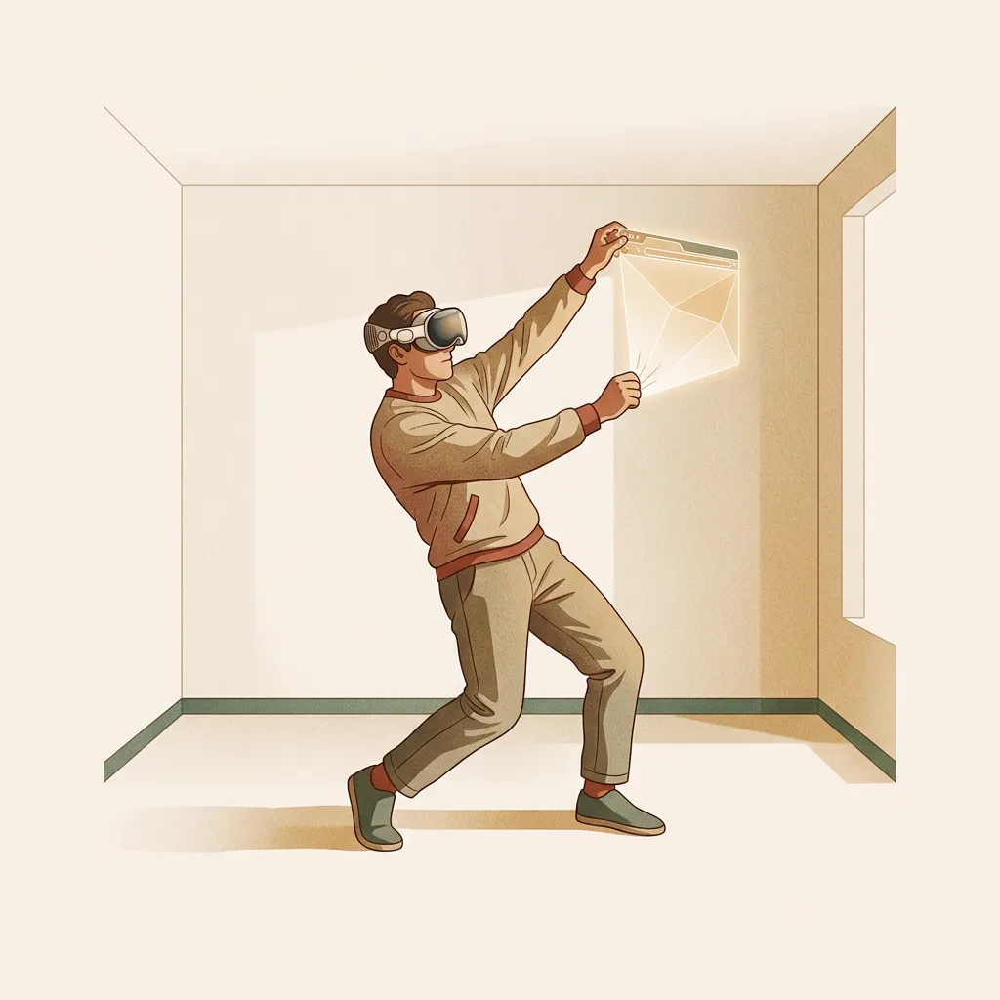
> **Scene**: 一个人带着 Vision Pro，在空无一物的真实客厅里，对着空气手舞足蹈地去抓一个全息浏览器窗口
> **List**: 缺乏系统映像 | 心理模型空白 | 空间直觉失效
> **Text**: 全息环境下的空白心理模型

最后，当我们面对一个全新的空间计算平台时，过去数十年的屏幕交互习惯全部失效，表现模型又该如何搭建？

> [DID YOU KNOW: 苹果 Vision Pro 与空间计算时代的心理模型真空]
> 在 XR 早期的拓荒阶段，成熟的"系统映像"尚未建立，用户的**心理模型处于真空**。

> 比如现实中拿苹果是触觉与力反馈的完整闭环，能感受到重量；但"捏取"虚拟窗口时，指腹没有任何压感阻尼。这种触觉缺失打破了物理世界的抓取模型。

> [VISUAL]
> **Slide**: w02-slide-14e_2
> **Layout**: `Split`
> *   **Asset**: 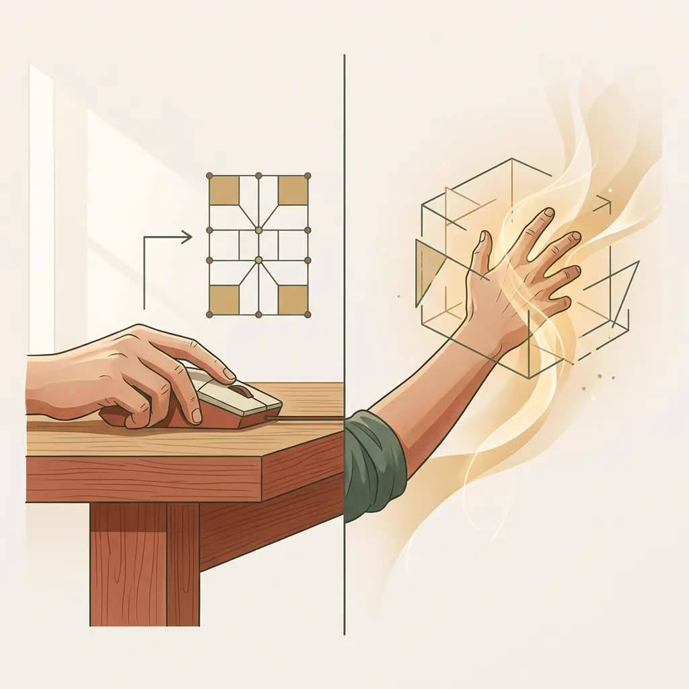
> **Scene**: 左侧是传统点击鼠标建立的确定性反馈模型；右侧是空间计算中挥手抓取光团带来的模型失配与落差感
> **List**: 传统反馈：物理点击有边界 | 空间计算：虚无抓取无阻尼
> **Text**: 表现模型重塑的探索

在新的范式完全沉淀之前，表现模型不得不极力利用真实的物理比喻去维持用户的掌控感。表现模型的重塑之路，在这里才刚刚开始。

为了缝合这种鸿沟，让冰冷的数字世界贴近人类常识，设计师们不得不引入一把双刃剑——**界面隐喻**。

> [VISUAL]
> **Slide**: w02-slide-14e_video
> **Layout**: `Full`
> **Scene**: 苹果 Vision Pro 宣传片中展示核心的捏合（Pinch）手势操作
> **Text**: 隔空捏合：重构空间模型
> **Asset**: 
> **Source**: `Video` — Apple Vision Pro 空间手势
> **Duration**: `1m17s`
> **TimeCategory**: `activity`

> [ACTIVITY: M03 理解检查 · 三模型识别]
> **Type**: `Quiz`
> **Duration**: `2min`
> **Desc**: 给出 3 张产品截图（建议：12306 验证码页 / iPhone Photos / 银行 ERP 表单），让学生快速判断每张分别偏向"实现模型"、"心理模型"还是"表现模型"，并用一句话说明理由。

---
