## 模块 4: 隐喻的双刃剑 (20 min)

<!-- BUDGET: 3600 chars | STATUS: done -->

> **知识节点**: `ixd-interface-metaphors`, `ch03-conceptual-models`

> [VISUAL]
> **Slide**: w02-slide-15
> **Layout**: Grid
> *   **Asset**: 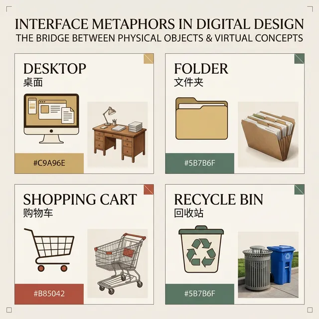
> **Scene**: 2×2 网格展示四个经典界面隐喻图标：桌面（Desktop）、文件夹（Folder）、购物车（Shopping Cart）、回收站（Recycle Bin），每个图标配以其来源的物理世界原型照片
> **List**: 桌面 Desktop | 文件夹 Folder | 购物车 Shopping Cart | 回收站 Recycle Bin
> **Text**: 经典界面隐喻——四把万能钥匙

为了让冰冷的数字世界贴近人类的常识，设计师们发明了界面设计史上最伟大的武器——**界面隐喻**，Interface Metaphors。

"桌面"、"文件夹"、"购物车"、"回收站"——这些词汇本身就来自物理世界。隐喻的天才之处在于：它利用你**已有的生活经验**来启动对全新系统的理解，把学习成本降到几乎为零。你不需要读说明书就知道：把文件拖进文件夹就是"归类"，把商品放进购物车就是"打算买"。

**(Pause: 3s)**

**然而，隐喻也是心智摩擦的重灾区。** 它有三种典型的失效模式。

### 4.1 隐喻破裂：物理常识与数字逻辑产生冲突

> [VISUAL]
> **Slide**: w02-slide-16
> **Layout**: Split
> *   **Asset**: 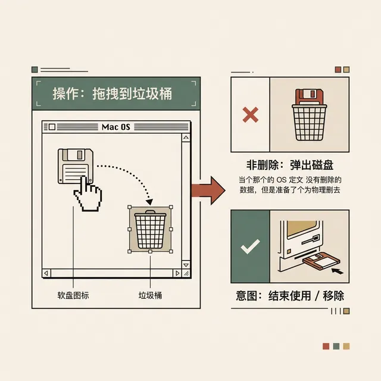
> **Scene**: 左侧为早期 Mac OS 上用户将软盘图标拖向垃圾桶的操作截图，右侧用大红叉标注"物理世界：扔垃圾桶 = 丢弃/毁灭"与绿色勾标注"系统逻辑：拖入垃圾桶 = 安全弹出"的认知冲突
> **Text**: 物理语义与系统逻辑的冲突

当数字逻辑与物理常识发生不可调和的冲突时，隐喻就会**碎裂**。

最经典的案例就在大屏幕上：在 1984 年的初代 Macintosh 系统中，"安全弹出"一张软盘的方式，竟然是把它拖进**垃圾桶**。

在物理世界里，"塞进垃圾桶"明明意味着摧毁和丢弃；但在操作系统的逻辑中，它却被强行赋予了"中断连接"的含义。这种两套语义系统的剧烈冲撞，让当时无数的新手用户心惊胆战——"把软盘拖进去，我是要删掉里面的数据吗？"

> [VISUAL]
> **Slide**: w02-slide-16b
> **Layout**: Split
> *   **Asset**: 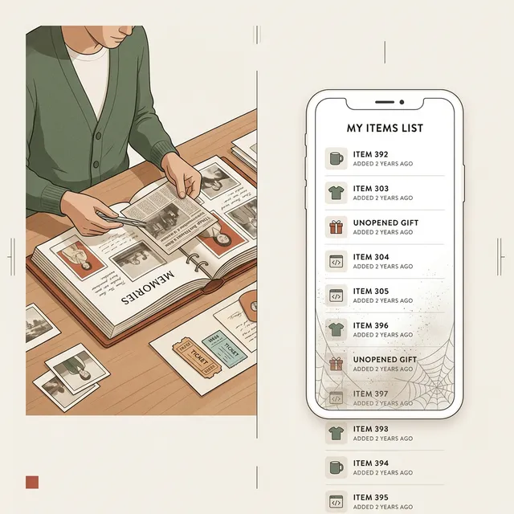
> **Scene**: 左侧是一位女性小心翼翼地把剪报夹进收藏册（暗示珍视与反复观看）；右侧是一个电商 App 里吃灰的、没有任何降价动态通知的死板收藏列表
> **Text**: 物理语义与数字意图的脱节

如果说“垃圾桶”的隐喻引发的是恐惧，那么另一个至今仍在滥用的隐喻，带来的则是长期的困惑：

> [CASE STUDY: 电商的"加入收藏"陷阱]
> 同样的破裂也发生在你身边的日常应用中：当电商 App 用"爱心"代表收藏，却只提供静态列表而不做降价提醒时，物理世界的"珍视"语义与系统仅仅"做个标记"的逻辑就产生了令人失望的错位。

### 4.2 隐喻老化：从物理遗迹到原生接管

> [VISUAL]
> **Slide**: w02-slide-17a
> **Layout**: `Grid`
> *   **Asset**: 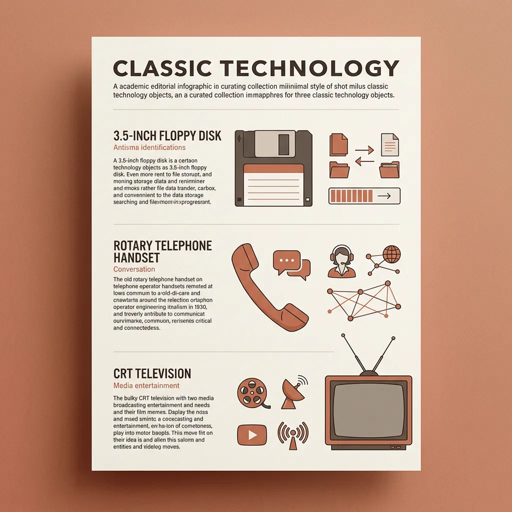
> **Scene**: 3个格子的网格图。展示经典的活化石图标：第一格是带有金属滑盖的3.5英寸物理软盘（代表保存）；第二格是老式带线的机械拨号听筒（代表通话）；第三格是带两根天线的笨重显像管CRT电视（代表视频）。
> **List**: 存储：3\.5英寸软盘 | 通话：老式机械听筒 | 视频：天线CRT电视
> **Text**: 认知断层的“活化石”

**隐喻的寿命其实非常短**，因为物理世界淘汰原型的速度，远比系统更新迭代的速度快。

请看大屏幕上的这三个图标：软盘、老式听筒、天线电视。在它们刚被设计出来时，完美映射了"保存"、"通话"和"视频"。但今天，面对从未见过这些物理古董的"数字原生代"（10后年轻人），隐喻的魔法就失效了。

> [VISUAL]
> **Slide**: w02-slide-17b
> **Layout**: `Comparison`
> *   **Asset**: 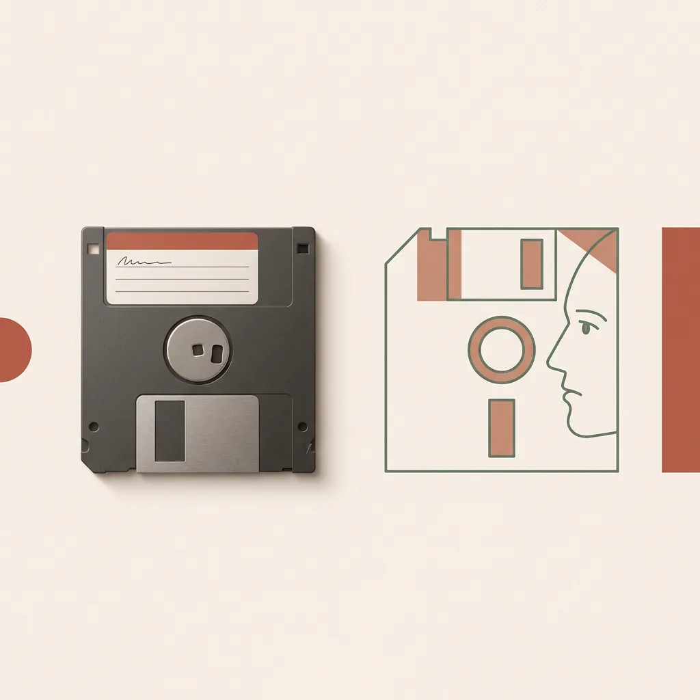
> **Scene**: 左侧为1990年代极具真实物理质感的3.5英寸软盘照片，标注"认知脚手架"；右侧为现代UI中极为抽象、只有一个缺口的极简线条保存图标，旁边是一张困惑的人脸，标注"抽象的死记符号"。
> **List**: 物理原型：降低学习门槛 | 原型灭绝：死记硬背的抽象符号
> **Text**: 第一阶段：遗迹化（Skeuomorph decay）

以最经典的"软盘"为例。对 Z 世代来说，它根本不是什么"存储介质"，仅仅是一个**名字叫保存的、带底边缺口的奇怪几何图形**。

这在符号学上被称为**遗迹化 (Skeuomorph decay)**。当物理原型在现实中灭绝后，隐喻就蜕变成了一个完全依靠死记硬背的抽象符号。它最初"消除学习成本"的使命彻底破产了。

> [VISUAL]
> **Slide**: w02-slide-17b_2
> **Layout**: `Split`
> *   **Asset**: 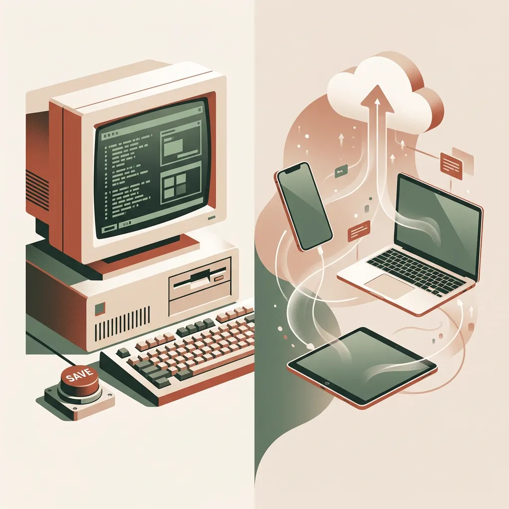
> **Scene**: 左侧是一个老式的带有"Save"软盘按钮的文档编辑界面，用户需要手动去点击；右侧是现代协作文档（如Notion）顶部闪烁的"All changes saved"状态提示，背景是云端实时同步的数据流。
> **List**: 隐喻时代：手动执行动作 | 数字原生时代：实时云端同步
> **Text**: 第二阶段：数字原生接管

更高级的老化方式是：**概念本身被数字原生协议击杀**。

在 Google Docs、Notion 或 Figma 中，"保存"这个**动作概念**已经死了。在长连接和云端实时同步的**数字原生范式** (Digital Native Paradigm) 下，你打下一个字，服务器就写入一次。隐喻不需要被更新，它被无摩擦的数字技术直接淘汰了。

> [ACTIVITY] Type: QA | Duration: 1min | Desc: 快速检验理解 - 现实中你还见过哪些“活化石隐喻”？

### 4.3 路径依赖：过度隐喻锁死想象力

> [VISUAL]
> **Slide**: w02-slide-17c
> **Layout**: `Full`
> *   **Asset**: 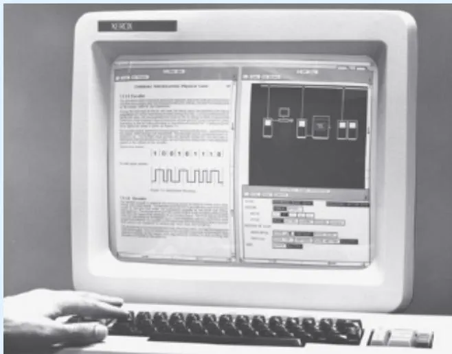
> *   **Asset (AI fallback)**: 
> **Scene**: 1981 年施乐 Xerox Star 的古典黑白桌面界面，界面上清楚画着文件柜和废纸篓的像素图标
> **Text**: 物理限制如何被原封不动搬进数字世界
> **Resource**: Interaction Design: Beyond HCI
> **Source**: Textbook

过度依赖隐喻还有一个行业级的副作用：它会形成强大的路径依赖，**限制原本数字世界该有的创新空间**。

我们在取得伟大开局的同时也被禁锢了：

> [VISUAL]
> **Slide**: w02-slide-17c_video
> **Layout**: `Full`
> **Scene**: 电影《硅谷传奇》(1999) 中乔布斯参观施乐 PARC 的戏剧化重现场景，展示了他初次见到鼠标与图形界面（GUI）时的极度震撼
> **Text**: 乔布斯的“顿悟”：看见界面的未来
> **Asset**: 
> **Source**: `Video` — 电影《硅谷传奇》(Pirates of Silicon Valley, 1999) 节选
> **Duration**: `2m42s`
> **TimeCategory**: `activity`

> [CASE STUDY: Xerox Star 与四十年的桌面局限]
> 刚才这段出自电影《硅谷传奇》的片段，还原了科技史上最著名的“顿悟”时刻。1979 年，当乔布斯参观施乐帕罗奥多研究中心（Xerox PARC）时，他看到了未来的雏形。施乐的工程师们首次确立了 GUI 时代的"桌面"（Desktop）隐喻，巧妙地把满是命令行代码的屏幕，伪装成了一张物理办公桌。
> 纸张（文档）、文件夹（目录）、文件柜（磁盘）、垃圾桶被一比一地搬进了屏幕，这让从未接触过电脑的文员瞬间理解了机器的工作原理。乔布斯立刻把这套隐喻带回了苹果，造就了 Mac 和随后的 Windows。
> 这是一个伟大的开局。但代价是什么？**四十多年过去**，计算能力翻了数千万倍，但我们依然被困在"桌面-文件夹"这套隐喻框架里。

> [VISUAL]
> **Slide**: w02-slide-17c_2
> **Layout**: `Center`
> *   **Asset**: 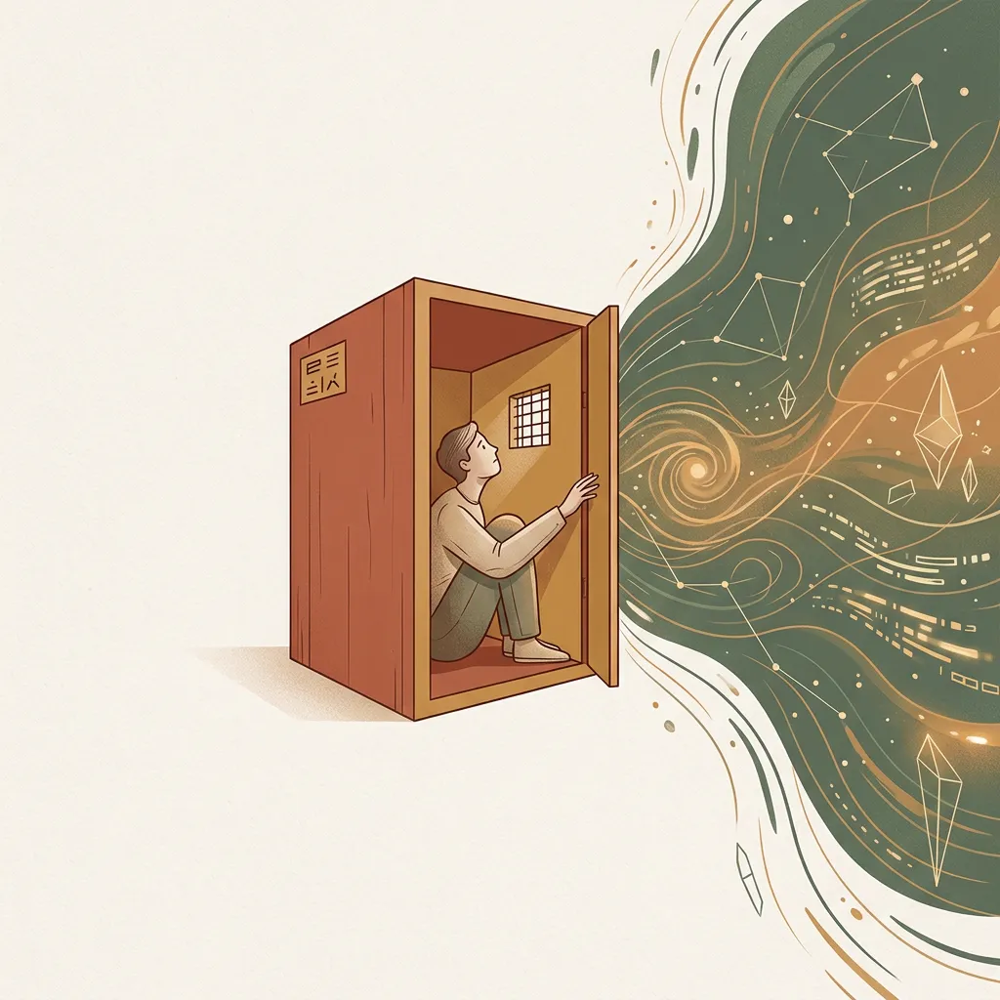
> **Scene**: 一个人被锁在一个名叫“桌面隐喻”的狭小木盒子里，外面的数字宇宙无边无际，但他却出不去
> **List**: 物理界限 | 四十年的禁锢 | 想象力锁死
> **Text**: 隐喻变成思维的牢笼

> 为什么电脑启动后的第一屏必须叫"桌面"且上面只能平铺网格状的图标？因为真实的桌面就是一块平坦的木板。为什么一份文件原则上必须被硬塞进某一个"文件夹"里？因为物理世界的纸张无法同时出现在两个实体抽屉里。
> 这些物理世界的低级限制，通过隐喻，被原封不动且毫无必要地搬进了原本可以超越时空的数字逻辑里——**但数字代码根本没有实体厚度和空间体积的限制！** 数据可以被打上无数个标签，同一个文件可以同时存在于"工作"和"私人"两个分类下。隐喻让我们在造汽车的时候，还在前面给它装了一个假马头。

> [VISUAL]
> **Slide**: w02-slide-17c1
> **Layout**: `Comparison`
> *   **Asset**: 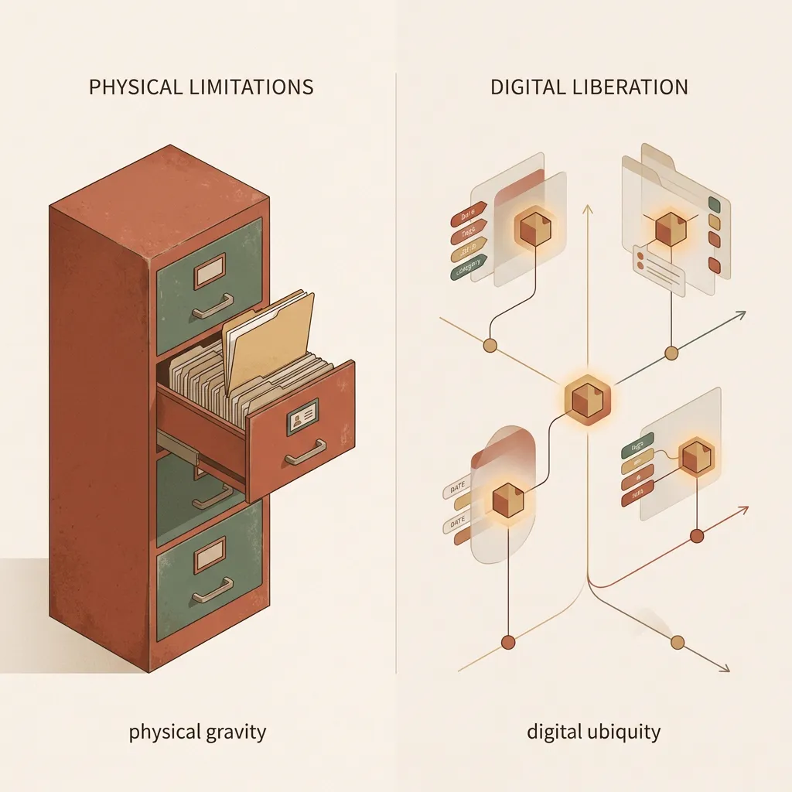
> **Scene**: 物理限制 vs 数字魔法。左侧为受限的实体文件夹（文件只能在一个抽屉）；右侧为标签化、时间轴化的发光数据流（同一文件可以存在于多重维度）
> **List**: 物理限制：单一位置，空间占用 | 数字魔法：多重标签，时间河流，全局秒搜
> **Text**: 突破物理引擎的数字魔法

如果我们永远死守物理世界的规矩，就不会诞生"无限撤销"——因为物理世界可没有"Ctrl+Z"这种时光倒流的超能力；也不会诞生毫秒级的"全局搜索"——你能想象在一栋总面积 10 万平米的真实双一流大学图书馆里，在 0.3 秒内精确找到包含特定长句的某一本书的某一页吗？魔法只能脱离物理隐喻才能实现。

> [VISUAL]
> **Slide**: w02-slide-17c1_2
> **Layout**: `Center`
> *   **Asset**: 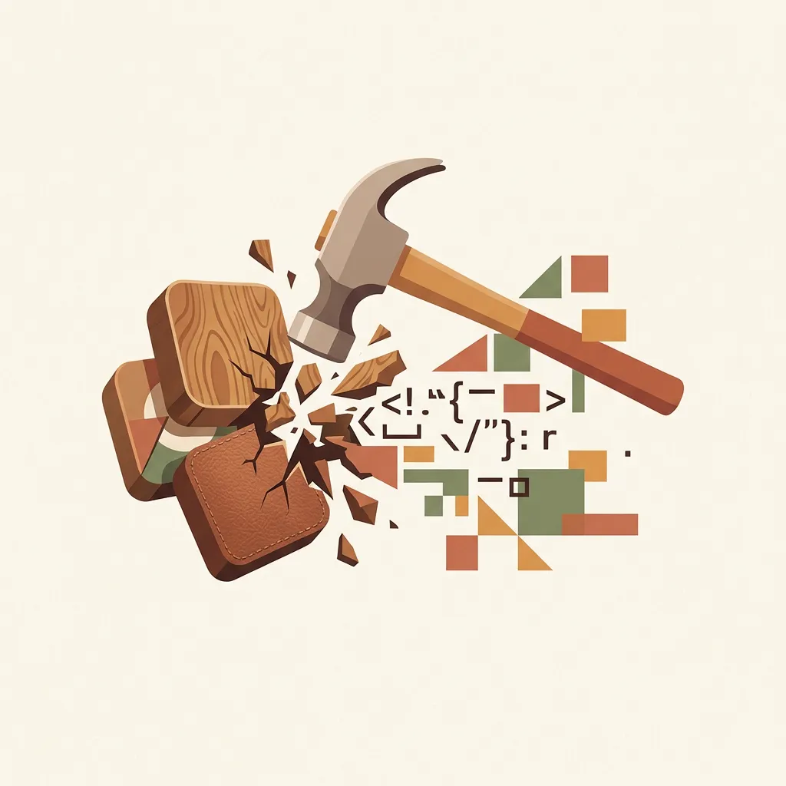
> **Scene**: 扁平化反叛物理世界：锤子砸碎了具有3D拟物质感（木纹、皮革）的图标，露出了背后纯粹由矢量代码构成的极简几何色块
> **List**: 抛弃物理包袱 | 拥抱数字原生功能 | 扁平化运动的本质
> **Text**: 抛弃拟物化隐喻的呼声

正因如此，Alan Cooper 断言：**是时候彻底抛弃物理界面隐喻了。**
对于文字处理，"办公桌"隐喻尚可；但面对"购买联程机票"、"配置 Docker"或"生成 AI 视频"等现代复合任务，物理世界中**根本不存在对应的操作原型**。

> [VISUAL]
> **Slide**: w02-slide-17c2
> **Layout**: `Comparison`
> *   **Asset**: 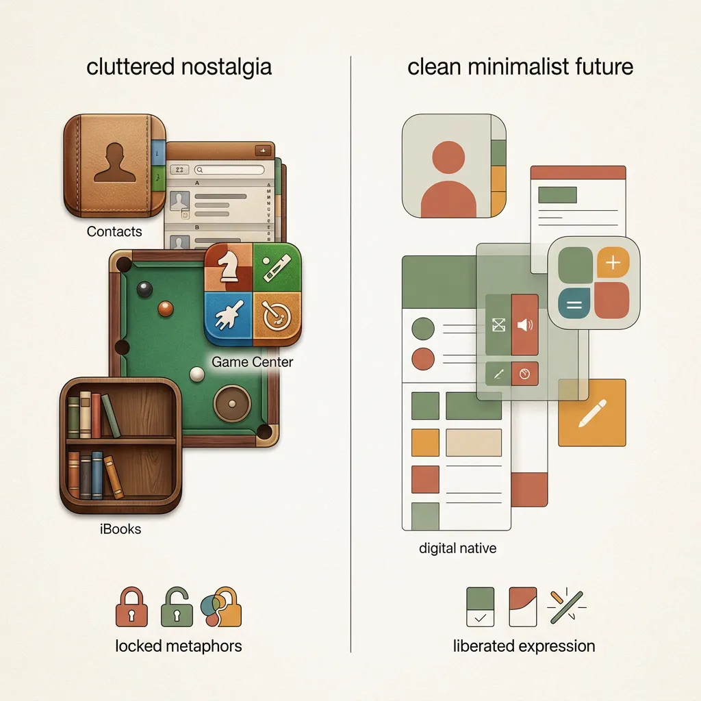
> **Scene**: 左右对比图。左列标题「拟物化时代（iOS 6）」——真皮质感的通讯录、绿色绒布台球桌的 Game Center、书架木纹的 iBooks，物理材质堆砌；右列标题「扁平化时代（iOS 7+）」——同一批 App 重设计后的干净几何色块界面，数字概念直接表达，无任何物理材质模拟。两侧底部各标注「隐喻锁死设计想象力」vs「数字原生解放表达空间」
> **List**: 拟物化：物理材质 = 认知脚手架 | 扁平化：数字概念 = 直接表达
> **Text**: 从拟物化到扁平化——杀死自己创造的隐喻

与其生搬硬套物理操作（比如把订机票设计成"翻找柜台账本"），不如直接用**数字原生的功能逻辑**来构建界面。这种对拟物化隐喻的反叛，直接催生了席卷全球的**扁平化设计 (Flat Design)**。

### 4.4 隐喻篡改：当数字原生背叛物理直觉

> [VISUAL]
> **Slide**: w02-slide-17e
> **Layout**: Split
> *   **Asset**: 
> **Scene**: 左侧展示物理世界里凌乱但可堆叠翻阅的明信片与扑克牌；右侧展示被算法强行抽出打乱的社交媒体卡片式信息流瀑布
> **List**: 物理直觉：边界坚固,可翻阅 | 算法干预：非线性、概率涌现
> **Text**: 卡片隐喻的进化与断裂

在扁平化运动之后，隐喻的演进进入了一个更为隐蔽的阶段：表面上保留了物理直觉，但底层逻辑已被彻底篡改。最典型的代表就是**卡片隐喻 (Card Metaphor)**。

看看你手机里的应用：Twitter 的推文、Pinterest 的灵感板、美团外卖的商家列表，全是卡片式界面。卡片大行其道，是因为它提供了**恰到好处的抽象**——它保留了物理直觉中坚固的边缘边界，可以无限度地翻阅、堆叠和独立排序，但又不像"桌面"那样带有太多空间体积包袱，完美适应了移动端的手势滑动。

> [VISUAL]
> **Slide**: w02-slide-17e_2
> **Layout**: `Split`
> *   **Asset**: 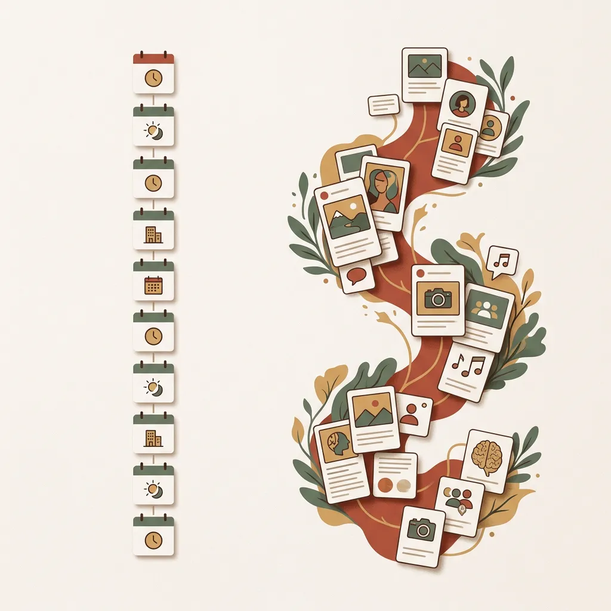
> **Scene**: 算法时间线 vs 线性时间线。左侧是按严格先后顺序排列的日历卡片；右侧是被推荐算法打破顺序、根据用户兴趣动态重组的卡片流
> **List**: 线性卡片：符合物理时间预期 | 算法卡片：打破物理规律的主动涌现
> **Text**: 卡片隐喻的非线性进化

卡片隐喻的进化还有一个最近的产品级注脚——2023 年 Meta 推出的 Threads 与 2024 年 X 平台主推的"为你推荐"算法时间线，都在悄悄打破"卡片必须按时间线性堆叠"的物理直觉。当 Threads 把一条贴文的所有回复折叠成可以下钻展开的"会话卡片"，再用算法把它从严格的时间序列里抽出来插入到你的首页——卡片不再是被动等你翻阅的"明信片"，它成了一个**会主动游动到你眼前的概率单元**。

> [VISUAL]
> **Slide**: w02-slide-26_1
> **Layout**: `Center`
> *   **Asset**: 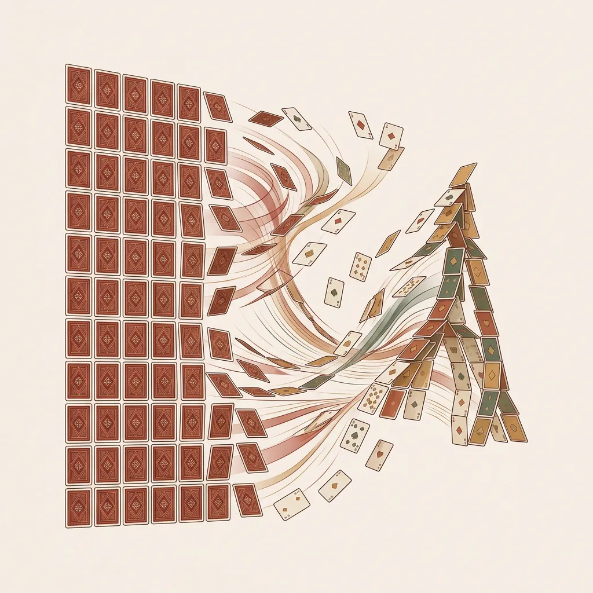
> **Scene**: 一张被打乱的扑克牌墙：原本按顺序排列的卡片突然被一只代表“算法”的无形之手洗牌重组。
> **List**: 物理世界的连续性 | 算法干预后的逻辑撕裂
> **Text**: 从认知脚手架到认知陷阱

这种"非线性卡片"的代价是显而易见的：你失去了"我刷到哪儿了"的物理坐标，每一次下拉刷新都不再是翻到下一张明信片，而是被算法重新洗了一次牌。

> [VISUAL]
> **Slide**: w02-slide-26_2
> **Layout**: `Center`
> *   **Asset**: 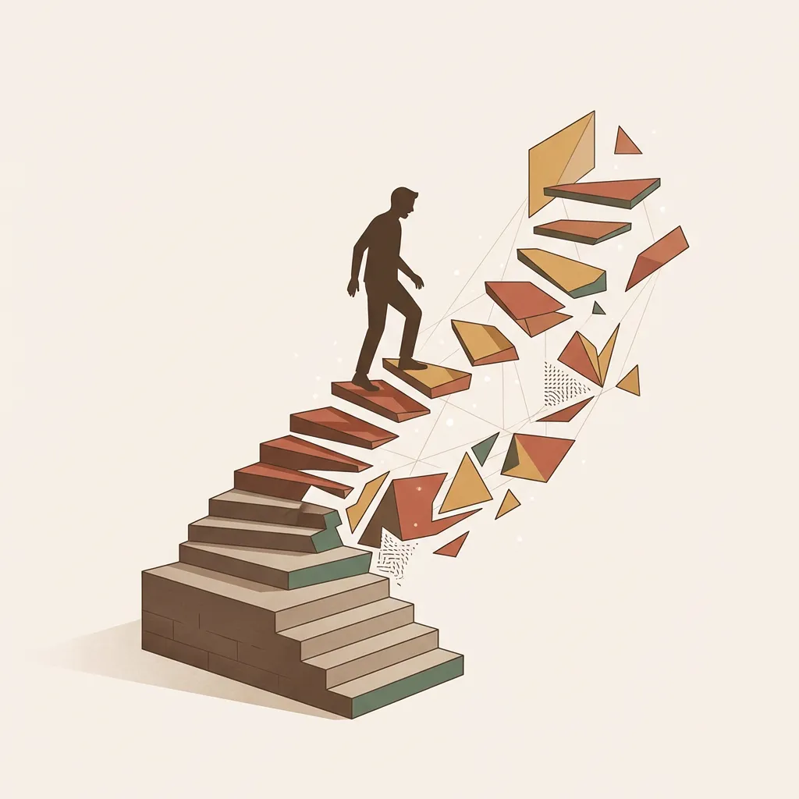
> **Scene**: 隐喻陷阱的示意图。用户脚下原本坚实的阶梯突然变成了由算法控制的不稳定踏板。
> **List**: 物理规律被篡改 | 隐蔽的认知偏差
> **Text**: 隐蔽的算法背叛

这就是“隐喻”最危险的陷阱：**披着物理世界的外衣，底层却执行着反物理的算法逻辑。**
数字卡片看起来像扑克牌，但它的排序却不再受真实世界的时间或空间规则控制。如果设计师不给这种“算法干预”加上明确的视觉提示（比如加个“为你推荐”的微小标签），用户的心理模型就会当场崩溃——因为他们以为自己在按时间线“翻牌”，实际上却是算法在暗中“洗牌”。

> [VISUAL]
> **Slide**: w02-slide-17e1_2
> **Layout**: `Center`
> *   **Asset**: 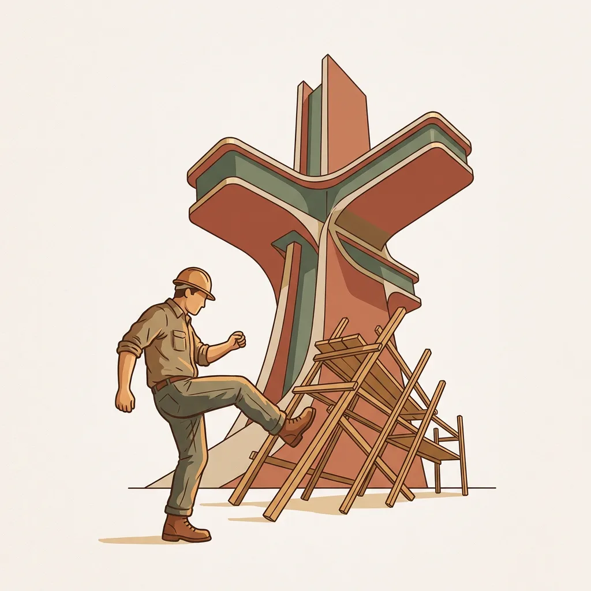
> **Scene**: 一名建筑工人在大楼建成后，主动拆除并踢开用来搭建框架的木质脚手架，大楼展现出超越重力限制的未来感结构
> **List**: 隐喻是脚手架 | 过渡期后必须拆除 | 迎接数字原生
> **Text**: 杀死自己创造的隐喻

> [TEACHING MOMENT]
> 隐喻只是引路的**脚手架**，绝非设计的终点。它帮新手快速过河，但当用户熟练后，继续模仿真实世界反而会变成效率的拖累。优秀的设计团队，懂得在合适的时机**拆除脚手架**，用纯粹数字原生的方式（如手势滑动、全局搜索）来替代笨拙的物理模拟。敢于“杀死”自己创造的隐喻，才是交互进化的必经之路。

这正是隐喻的“双刃剑”特性：它是新手入门的捷径，却也极易变成逻辑冲突的温床。

至此，我们已经拆解了认知滤网、行动鸿沟以及模型冲突。接下来，我们要面对最后一个让用户抓狂的底层病因——**认知过载下的记忆崩溃**。

---
