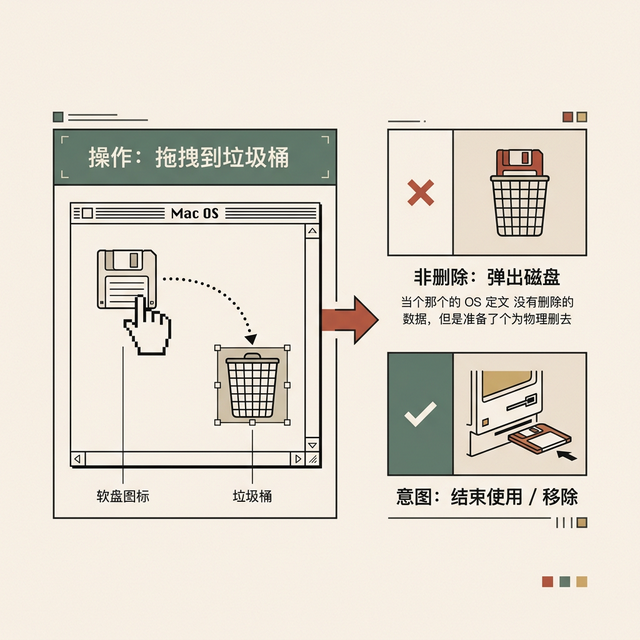
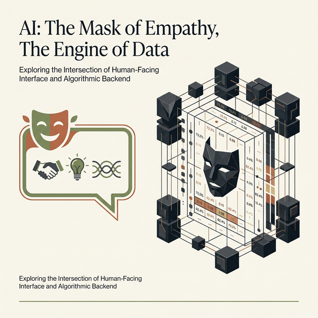
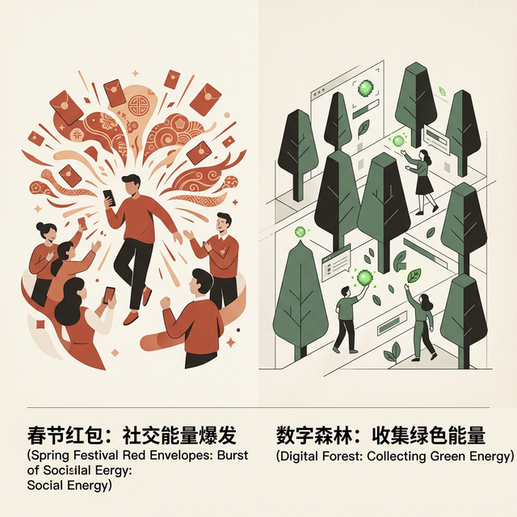

## 模块 4: 隐喻的双刃剑 (20 min)

<!-- BUDGET: 3600 chars | STATUS: done -->

> **知识节点**: `ixd-interface-metaphors`, `ch03-conceptual-models`

> [VISUAL]
> **Slide**: w02-slide-15
> **Layout**: Grid
> *   **Asset**: 
> **Scene**: 2×2 网格展示四个经典界面隐喻图标：桌面（Desktop）、文件夹（Folder）、购物车（Shopping Cart）、回收站（Recycle Bin），每个图标配以其来源的物理世界原型照片
> **List**: 桌面 Desktop | 文件夹 Folder | 购物车 Shopping Cart | 回收站 Recycle Bin

为了让冰冷的数字世界贴近人类的常识，设计师们发明了界面设计史上最伟大的武器——**界面隐喻**，Interface Metaphors。

"桌面"、"文件夹"、"购物车"、"回收站"——这些词汇本身就来自物理世界。隐喻的天才之处在于：它利用你**已有的生活经验**来启动对全新系统的理解，把学习成本降到几乎为零。你不需要读说明书就知道：把文件拖进文件夹就是"归类"，把商品放进购物车就是"打算买"。

**(Pause: 3s)**

**然而，隐喻也是心智摩擦的重灾区。** 它有三种典型的死法。

### 4.1 隐喻破裂：物理与代码的语义脱节

> [VISUAL]
> **Slide**: w02-slide-16
> **Layout**: Split
> *   **Asset**: 
> **Scene**: 左侧为早期 Mac OS 上用户将软盘图标拖向垃圾桶的操作截图，右侧用大红叉标注"物理世界：扔垃圾桶 = 丢弃/毁灭"与绿色勾标注"系统逻辑：拖入垃圾桶 = 安全弹出"的认知冲突

当数字逻辑与物理常识不可避免地发生冲突时，隐喻就会**碎裂**。

最经典的案例：早期 Macintosh 系统中，"安全弹出"一张软盘的方式是——把它拖进**垃圾桶**。在物理世界里，"塞进垃圾桶"意味着摧毁或丢弃；在操作系统的逻辑里，它却意味着"中断连接"。这种巨大的语义错位让无数新手用户心惊胆战——"我要扔掉我的数据吗？"

> [VISUAL]
> **Slide**: w02-slide-16b
> **Layout**: Split
> *   **Asset**: 
> **Scene**: 左侧是一位女性小心翼翼地把剪报夹进收藏册（暗示珍视与反复观看）；右侧是一个电商 App 里吃灰的、没有任何降价动态通知的死板收藏列表
> **Text**: 物理语义与数字意图的脱节

另外一个至今仍大量存在的误用，请看大屏幕：

> [CASE STUDY: 电商的"加入收藏"陷阱]
> 隐喻破裂今天仍在发生。许多电商 App 用"爱心"图标表示"收藏商品"，但用户预期"收藏"意味着"我以后还想看到它"。当 App 把"收藏"仅当作一个静态列表、不做价格提醒或库存预警时，用户就会困惑——"我都收藏了，你怎么不通知我降价？"物理世界的"收藏"隐含着"珍视和关注"的语义，数字系统却只完成了"标记"这一步。

### 4.2 隐喻老化：符号退化的抽象遗迹

> [VISUAL]
> **Slide**: w02-slide-17
> **Layout**: `Comparison`
> *   **Asset**: 
> **Scene**: 左列标题"活化石隐喻"——3.5 英寸软盘保存图标、老式转盘电话接听图标、带天线的 CRT 电视视频图标，右列标题"数字原生"——自动保存的转圈动效文字"所有更改已云端同步"
> **List**: 过代遗迹：软盘 / 老式听筒 / 放大镜 | 原生范式：自动同步 / 隔空投送 / 瀑布流反馈

隐喻的寿命其实非常短，因为物理世界在加速淘汰。
今天绝大多数 00 后、10 后年轻人根本没见过真实的 3.5 英寸软盘（Floppy Disk），但它的正方形倒角图标依然在无数企业级软件（比如 Office 早期版本甚至许多工业软件）里坚如磐石地担任"保存"按钮。
对 Z 世代来说，那根本不是什么隐喻了，那只是一个"名字叫保存的、奇怪的带底边缺口的几何图形"。这在符号学上叫**遗迹化（Skeuomorph decay）**——当原型在物理世界灭绝后，隐喻本身就蜕变成了一个任意的、纯粹需要靠死记硬背的抽象符号，它最初"降低认知负荷"的使命彻底破产。同样变成遗迹的还有：用带天线的显像管电视机表示"视频"，用老式机械齿轮表示"设置"，用红色拨号盘电话机的实体听筒来表示"挂断"。

更高级的死亡方式是——**概念本身被数字原生协议击杀**。
在 Google Docs、Notion、Figma 这些现代协作工具里，"保存"这个**动作概念**都已经死了。它们是实时云端同步、WebSocket 长连接的：你打下一个字，服务器就写入了一次。用户根本不需要主动"保存"。这就是隐喻老化到极致之后，被纯粹的、无摩擦的**数字原生范式（Digital Native Paradigm）**所取代的幸福结局。

### 4.3 路径依赖：过度隐喻锁死想象力

**(Pause: 3s)**

过度依赖隐喻还有一个极其隐蔽但致命的行业级副作用：它会形成巨大的路径依赖，**锁死整个时代的创新空间**。

> [VISUAL]
> **Slide**: w02-slide-17b
> **Layout**: Split
> *   **Asset**: 
> **Scene**: 左侧是 ChatGPT 友好的第一人称气泡对话窗（被加上一个面具图标）；右侧揭示面具背后冷酷的、只有不断输出下一个概率预测词汇的数学张量矩阵
> **Text**: 它是一台概率缝合机器，不是一个人

> [DID YOU KNOW: AGI 时代的险恶隐喻——"它是个人"]
> 假如我们将视线推向今天处于风暴眼的生成式人工智能（Generative AI，特别是类似 ChatGPT 这类 LLM 模型）。我们立刻就会撞上整个文明史上最宏大、最危险的界面隐喻——**拟人化隐喻（Anthropomorphism）**。
> OpenAI 是怎么把大语言模型如此深不可测的 Transformer 高维张量计算架构打包给大众使用的？他们用了最古老、最粗暴但也是最管用的隐喻——一个类似微信聊天界面的对话窗。这个隐喻界面具有不可逆转的暗示性：当屏幕上出现一个个吐着字元的对话气泡，并且开始用"你好，我是 ChatGPT" 的第一人称语气来回答你问题时，它向人类的远古脑部投射了一个难以抗拒的核心隐喻："在这个屏幕后面，住着一个极其聪明、无所不知且善解人意的（人类或灵魂实体）。"
> 我们几乎所有跟 ChatGPT 的交互摩擦，甚至是所谓的"提示词工程（Prompt Engineering）"的痛苦，全部源头都来自于这个该死的拟人化隐喻诱发的**极度错误心理预期对齐**。
> 你潜意识里把它当成"一个人"来进行自然语言交流，但它的底层实现模型根本不是具备逻辑推理和自我意识的生命体，它仅仅是一台依靠统计概率在推算下一个可能出现字串符（Next-token Prediction）的大型数学缝合机器。所以，当你抱怨"为什么它连小学算术都算不对？为什么有些指令它听不懂反而胡言乱语产出幻觉（Hallucination）"时，摩擦就此爆发。因为人类在现实世界里沟通的经验模型是依靠常识、同理心与常理推断的；但对于这台数学概率机，它根本不知道"1+1=2"这个命题的逻辑含义，它仅仅是预测在海量训练语料中，"1+1="后面接一个"2"这个符号的概率为 99.999% 而已。
> 这种以假乱真的高智商拟人化对话框隐喻，将我们带入了巨大的伦理迷雾与认知盲区。它过度拔高了大众对 AI 正确性的信任，导致了在代码生成、病例诊断这种极度要求溯源和严密逻辑排查的场景中，引发了极其惨烈的系统性信赖危机。在这个语境下，隐喻不再是仅仅让我们更好上手电脑的善意设计，隐喻成了技术狂欢与商业包装中，掩盖底层暴力随机性的一把极具危险性的温柔障眼法。
> 像 Alan Cooper 或者唐·诺曼这样的先驱早就警告过：在强人工智能真正到来成为物理或虚拟世界的全新原生造物之前，如果我们仍执迷于强行用"人"的隐喻去框定甚至束缚那些完全依靠非人类碳基神经元逻辑运转的新纪元硅基算法机器时，我们的文明迟早会遭受这种认知摩擦断裂带来的一次全面反噬。

> [VISUAL]
> **Slide**: w02-slide-17c
> **Layout**: `Full`
> *   **Asset**: 
> **Scene**: 1981 年施乐 Xerox Star 的古典黑白桌面界面，界面上清楚画着文件柜和废纸篓的像素图标
> **Text**: 物理限制如何被原封不动搬进数字世界

回望历史，我们在取得伟大开局的同时也被禁锢了。请看历史倒影：

> [CASE STUDY: Xerox Star 与四十年的桌面局限]
> 1981 年，施乐帕罗奥多研究中心（Xerox PARC）推出了神作 Xerox Star，首次确立了 GUI 时代的"桌面"（Desktop）隐喻。它天才地把满是代码的屏幕，伪装成了一张物理办公桌。纸张（文档）、文件夹（目录）、文件柜（磁盘）、垃圾桶被一比一地搬进了屏幕，让从未接触过电脑的办公室文员瞬间理解了在这个发光盒子里该怎么工作。
> 后来乔布斯参观了 PARC，把这套隐喻带回了苹果，造就了 Mac 和随后的 Windows。
> 这是一个伟大的开局。但代价是什么？**四十多年过去了**，人类的计算能力翻了数千万倍，但我们依然被死死困在"桌面-文件夹"这套简陋的隐喻框架里出不来。
> 为什么电脑启动后的第一屏必须叫"桌面"且上面只能平铺网格状的图标？因为真实的桌面就是一块平坦的木板。为什么一份文件原则上必须被硬塞进某一个"文件夹"里？因为物理世界的纸张无法同时出现在两个实体抽屉里。
> 这些物理世界的低级限制，通过隐喻，被原封不动且毫无必要地搬进了原本可以超越时空的数字逻辑里——**但数字代码根本没有这些质量与空间的限制！** 数据可以被多重打标签、可以映射成图数据库、可以按时间河流式涌现。隐喻让我们在造汽车的时候，还在前面给它装了一个假马头。

如果我们永远死守物理世界的规矩，就不会诞生"无限撤销"——因为物理世界可没有"Ctrl+Z"这种时光倒流的超能力；也不会诞生毫秒级的"全局搜索"——你能想象在一栋总面积 10 万平米的真实双一流大学图书馆里，在 0.3 秒内精确找到包含特定长句的某一本书的某一页吗？魔法只能脱离物理隐喻才能实现。

正因为隐喻充满这些诅咒，Alan Cooper 在 2020 年的一篇力战前沿的博文中提出了一个看似大逆不道的观点：**我们早就该彻底抛弃物理界面隐喻了。**
他的论据极具说服力：对于古典的文字处理和图表制作，办公桌隐喻或许有效；但对于很多现代复合任务——比如"购买一张联程机票"、"配置一个云端 Docker 容器"、或者"用 AI 生成一条视频"——你在这个地球上**根本找不到任何一个合适的物理世界操作原型**来做类比。
与其勉强套用一个滑稽蹩脚的比喻（试图把订机票设计得像是在"翻阅柜台账本"），不如直接用**清晰的数字概念、纯粹的输入反馈和功能逻辑**来直白地解释界面。这种抛弃拟物化隐喻的运动，也直接催生了后来席卷全球的扁平化设计（Flat Design）。

> [VISUAL]
> **Slide**: w02-slide-17d
> **Layout**: Split
> *   **Asset**: 
> **Scene**: 左侧是红底黄字、带有"拆"字金币特效的微信红包；右侧是绿意盎然的支付宝蚂蚁森林，有人正在偷取能量球
> **List**: 抢红包：社交模因降维支付壁垒 | 种树：游戏化连接碳补偿

我们再来看看隐喻是如何在不同的文化土壤里生根发芽的：

> [CASE STUDY: 隐喻的中国本土演化]
> 在批判隐喻的同时，我们也必须承认，当隐喻与特定民族的文化母题结合时，会爆发出惊人的破冰威力。
> 2014 年春节的**微信红包**就是中国互联网史上最不可思议的隐喻战役。它没有教大妈们什么是"P2P C2C 小额高频数字转账"，它甚至没有提"转账"两个字。它只是极其精准地抓住了中国社会几千年的社交模因："发红包"与"抢红包"。红底、黄字、拆开那个金币按钮的动效——它用一个极度喜庆的文化隐喻完爆了支付宝耕耘十年的支付心智。
> 同样成功的还有**支付宝蚂蚁森林**。它把极其抽象的"低碳减排积分与个人碳账户"，隐喻成了"起早贪黑去偷朋友的绿色能量球，最后在内蒙古沙漠里种下真实的梭梭树"。这两个本土案例证明，隐喻的最高境界往往不是模仿物理外观，而是**唤醒文化剧本里的社会关系**。

> [DID YOU KNOW: 抽象的胜利——卡片隐喻]
> 还有一种进化的正面案例。教材中提到了**卡片隐喻（Card Metaphor）**——看看你手机里的应用：Twitter 的推文、Pinterest 的灵感板、美团外卖的商家列表、Apple Pay 或微信卡包里的电子凭证，全是卡片式界面。
> 为什么卡片大行其道？卡片来自我们对"名片、扑克牌、明信片"的物理直觉：有坚固的边缘边界、大小统一、可以无限度地翻阅、堆叠、洗牌和独立排序。这个隐喻之所以大杀四方，是因为它**恰到好处的抽象**——它不像"桌面"那样带来太多关于房间、木板和抽屉的物理包袱，同时又提供了刚好够用的空间组织直觉来适应手势滑动。

> [TEACHING MOMENT]
> 界面隐喻绝对不是终点，它只是引路的**脚手架**。它帮助新手跨过心智门槛、快速建立心理模型，但在用户熟练掌握这套电子系统之后，物理原型的限制就应该被毫不留情地打破，被**更高效、反直觉、违背物理定律的数字原生交互**所取代。优秀设计团队的技术使命，就是学会在正确的时机、用正确的方式，**杀死自己创造的隐喻**。

这就是隐喻的双刃剑：用得巧，它是连接常识与代码的黄金大桥；用得老套、用得刻板、用得不顾文化语境，它反而会制造令人智熄的新型摩擦。

认知三道滤网讲清楚了、Norman 行动鸿沟理论拆完了、Cooper 三重模型对抗理解了、隐喻的诅咒也解毒了。这堂课最后的一块拼图，我们要面对那个让无数人焦虑到抓狂的压轴病因——**认知过载下的记忆崩溃**。

---
