## 模块 5: 记忆负荷与认知过载 (15 min)

<!-- BUDGET: 4000 chars | STATUS: done -->
<!-- NOTE: H2 BUDGET 含 5.3 实践引导 + 5.4 小结收网，承载 15min讲授 + 10min小结 -->

> **知识节点**: `ixd-memory-load`

> [VISUAL]
> **Slide**: w02-slide-18
> **Layout**: `Full`
> *   **Asset**: 
> **Scene**: 全屏展示 LingsCars.com 首页截图——满屏闪烁的 GIF 动图、刺眼的撞色、密密麻麻的文字和视频广告，代表极端认知过载
> **Search**: LingsCars.com homepage screenshot
> **Text**: 认知过载的极端样本

来，大家看大屏幕。

你现在有什么感觉？眼花缭乱？大脑皮层发热？完全不知道眼睛该往哪里放？

**这就是认知过载——Cognitive Overload——的极端案例。**

> [VISUAL]
> **Slide**: w02-slide-18_video
> **Layout**: `Full`
> **Scene**: 录屏演示 LingsCars 网站令人眼花缭乱的闪烁动效，导致极度认知负荷
> **Text**: 认知崩溃的极端体验
> **Asset**: 
> **Source**: `Video` — LingsCars 网站真实录屏
> **Duration**: `0m25s`
> **TimeCategory**: `activity`

> [CASE STUDY: LingsCars]
> LingsCars.com 是英国一个真实存在的汽车租赁网站。它的首页被视觉设计界当作"反面教材中的反面教材"——满屏闪烁的动图、刺眼的色彩、密密麻麻的文字和无处不在的弹窗。讽刺的是，这个网站的老板声称它的转化率极高。但从认知科学的角度来看，它几乎触犯了每一条人类认知的天然限制。

还记得刚才讲的工作记忆吗？只有大约 4 个组块的容量。当一个界面对你倾泻成百上千个视觉刺激——数据点、图表、按钮、弹窗——你的工作记忆会被**瞬间击穿**。

**(Pause: 3s)**

过高的认知负荷会让用户逃离，那么，是不是应该将所有的交互变得"一点就灵"、"零挑战"呢？不是的。

> [VISUAL]
> **Slide**: w02-slide-18a
> **Layout**: `Image`
> *   **Asset**: 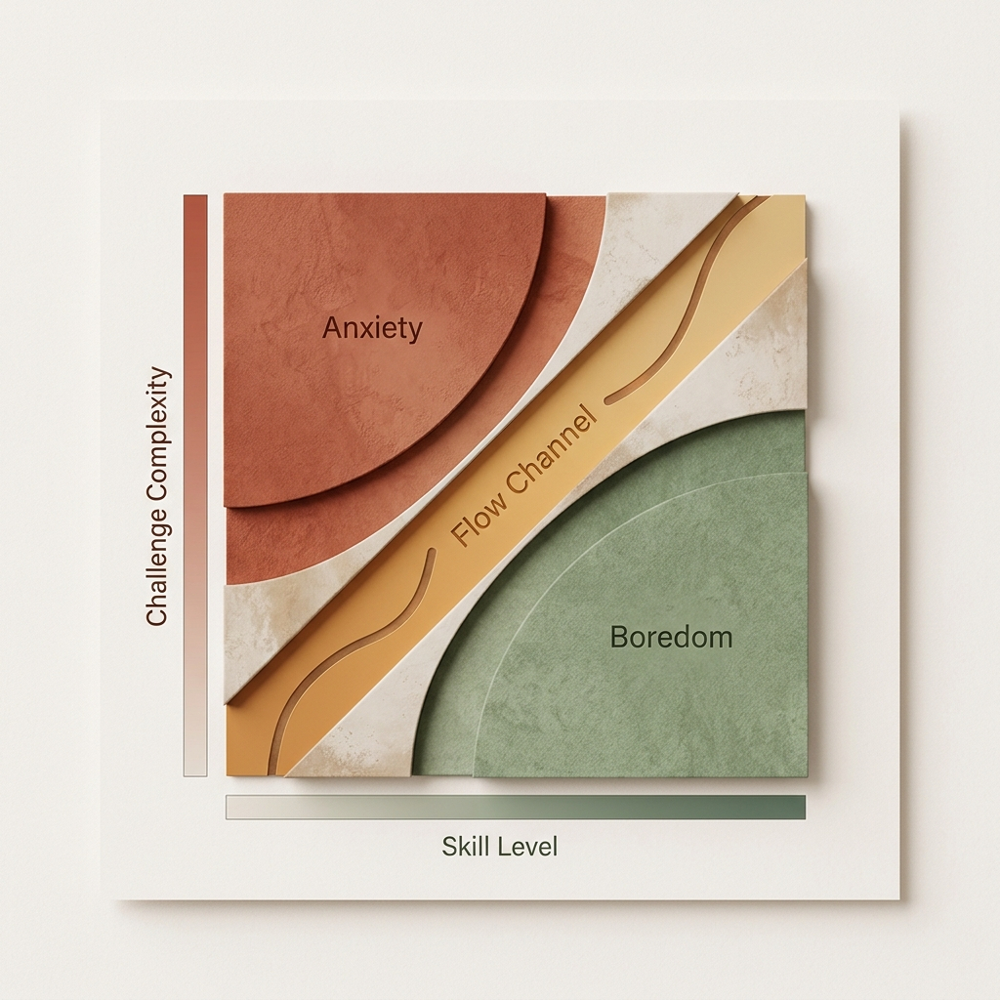
> **Scene**: 极简的心流理论（Flow Theory）坐标轴图表。横轴是"技能水平"（Skill），纵轴是"挑战难度"（Challenge）。中间的对角线通道被高亮标记为"心流通道"（Flow Channel），左上角是"焦虑"，右下角是"无聊"。
> **Text**: 完美认知负荷——将用户锁定在心流通道

> [PHILOSOPHY]
> 心理学家 Mihaly Csikszentmihalyi 提出了著名的**"心流"（Flow Theory）**。他指出，真正的沉浸和愉悦并不来自于绝对的轻松，而是来自**"挑战"与"技能水平"的完美匹配**。如果界面复杂度和认知挑战过高，用户会陷入焦虑（Anxiety）；如果系统替用户做完了一切，挑战为零，用户又会陷入无聊（Boredom）。优秀的游戏、优秀的复杂生产力工具（如 Figma 或 Premiere），从来不会过度削减信息，而是利用层级递进（渐进式展示）和即时反馈机制，把认知负荷调控到刚刚好，将用户精确地锁定在心流"通道"中。

> [VISUAL]
> **Slide**: w02-slide-18b
> **Layout**: `Flow`
> *   **Asset**: 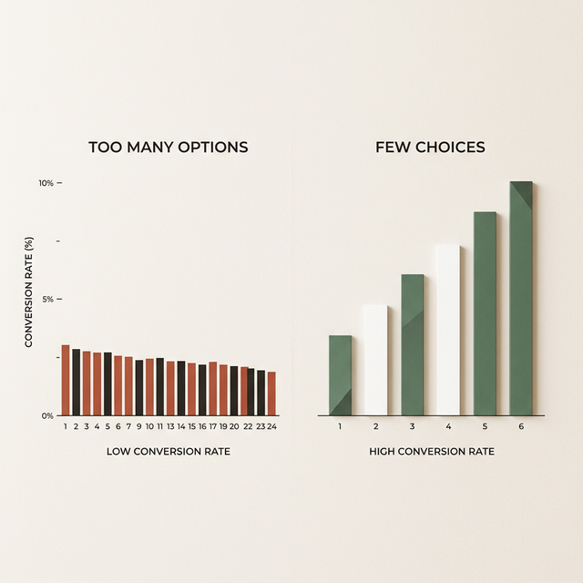
> **Scene**: 两组柱状图对比。左边展示 24 种果酱（高驻足 60%，极低购买 3%）；右侧展示 6 种果酱（低驻足 40%，极高购买 30%）
> **Text**: 更多选择 = 更大负荷 = 更少转化

然而，一旦你把握不好这条界线，越过了临界点，过高的认知负荷会引发**决策瘫痪**（Choice Paralysis）。选择太多，反而什么都选不了。正如屏幕上的数据对比所揭示的：哥伦比亚大学的经典果酱实验给出了精确数据：在超市里，展示 24 种果酱时，60% 的路人被吸引驻足，但最终只有 **3%** 购买；展示 6 种果酱时，驻足率降至 40%，但购买率飙升到 **30%**——整整十倍的差距。更多选择意味着更多注意力，但也意味着更大的认知折磨。

> [VISUAL]
> **Slide**: w02-slide-18c
> **Layout**: Split
> *   **Asset**: 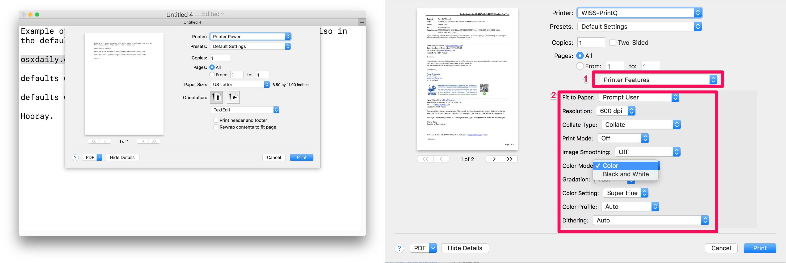
> *   **Asset (AI fallback)**: 
> **Scene**: 左侧是极简的初始打印菜单（只展示打印机、色彩、份量）；右侧是点击"显示详细信息"后向下如折叠伞般翻出几十个专业选项的高级面板
> **List**: 初始状态：兼顾快思考的低带宽 | 展开状态：兼顾慢思考的高精度
> **Text**: 渐进式披露——折叠的解药
> **Source**: Web Source

所以我们如何拯救这些天生复杂的业务场景？

> [TEACHING MOMENT: 渐进式披露的解药]
> 既然不能零负荷，也不能超负荷，设计师如何处理那些天生就存在极高复杂度的专业软件呢？答案是**渐进式披露（Progressive Disclosure）**。
> 它的核心哲学是："在任何一个时间截面上，只给用户当前任务**最需要的那一点点信息**；其余的复杂性，像折叠伞一样藏起来，只有当用户明确要求时才展开。"
> 看看 macOS 或 Windows 里的高级打印机设置：第一屏永远只有干干净净的三项（选打印机、黑白/彩色、打几份），底端藏着一个不起眼的"显示详细信息 / 高级属性"的按钮。普通用户在第一屏就能安全着陆，而需要调校色彩配置文件和纸张涂层微距的专业设计师，点开那个复杂的高级面板，也能得到满足。这就叫在单一界面内**兼顾快思考的低带宽与慢思考的高精度**。

**(Pause: 3s)**

> [VISUAL]
> **Slide**: w02-slide-18e
> **Layout**: `Comparison`
> *   **Asset**: 
> *   **Asset (AI fallback)**: 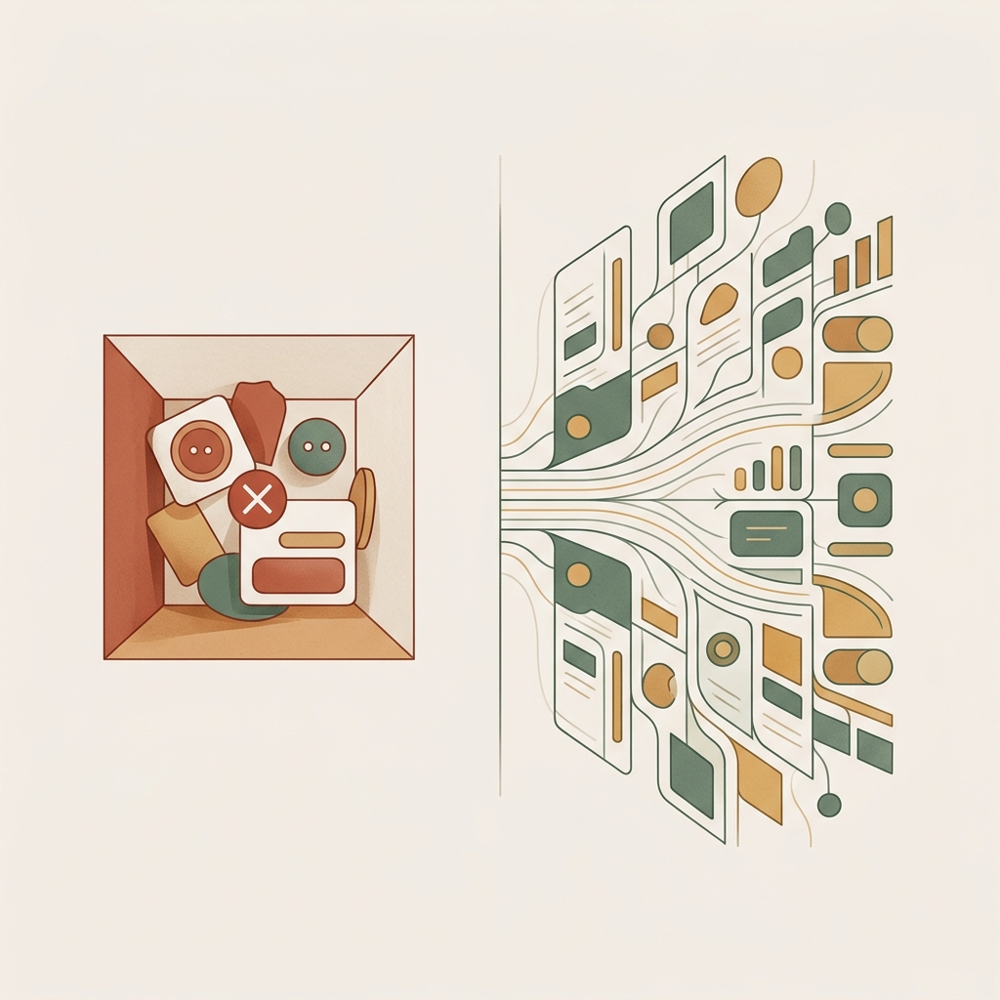
> **Scene**: 左右对比图。左列标题「Miller误用」——设计师错误地将「7个菜单项上限」标注在一个只有7个按钮的贫血导航栏上，旁边用红叉标注「错！Miller说的是闭眼记忆」；右列标题「正确应用」——一个包含30个分类的大型超级菜单（Mega Menu），用户眼睛扫视路径以绿色箭头标注「扫视 = 识别，不需要记忆」
> **List**: 误用：7±2 = 菜单上限 | 正确：7±2 = 闭眼短时记忆容量 | 菜单扫视 = 识别不需要记忆
> **Text**: Miller's Law 误用解毒——识别 ≠ 记忆
> **Source**: Web Source

> [STORY TIME: 7±2 的百年误会]
> 但这里我要给你们打一针重要的"解毒针"。心理学史上最有名的数字——George Miller 1956 年提出的"神奇的 7±2"——被设计界**普遍误用**了几十年。许多设计师根据这个理论得出教条结论："菜单选项不应超过 7 个，标签页不应超过 7 个"。但这完全不对。Miller 的实验测量的是**短时记忆容量**——你听到或看到一串毫无逻辑关联的数字串后，闭上眼睛能凭空记住多少个。实验的关键词是"凭空记住"。

> [VISUAL]
> **Slide**: w02-slide-18e_2
> **Layout**: `Center`
> *   **Asset**: 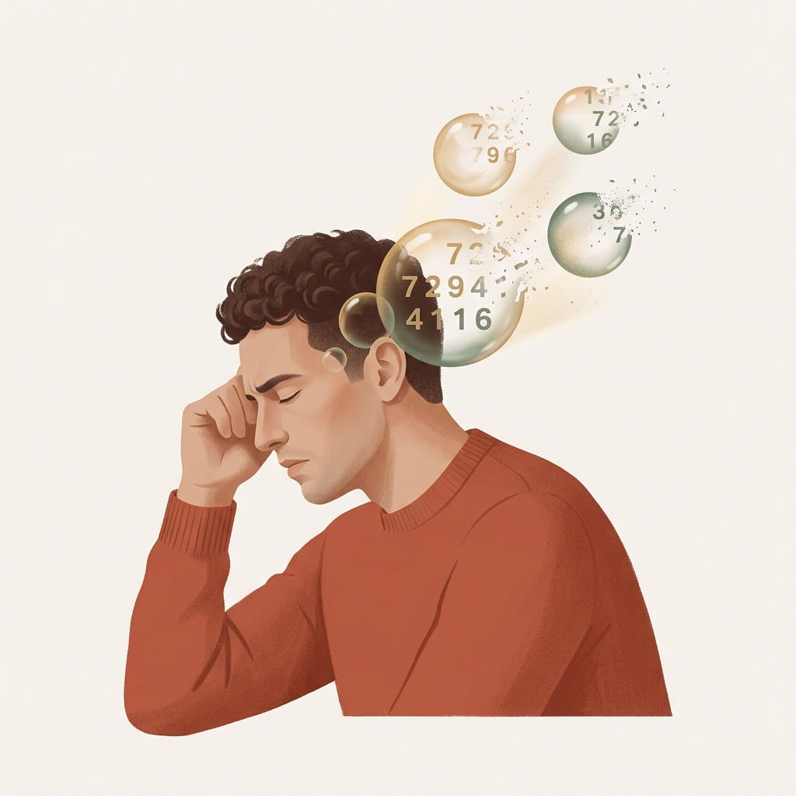
> **Scene**: 短时记忆的真正限制：一个人闭着眼睛，脑海里的几个数字泡沫正在不断破裂消失
> **List**: 闭眼实验 | 无逻辑字符串 | 凭空提取
> **Text**: 7±2 实验的真实环境

> 但请注意，当你在使用网页导航或下拉菜单时，选项是**一直物理地摆在你面前的**！你根本不需要把这七个选项塞进有限的大脑缓存里去死记硬背——你只需要进行**扫视和视觉识别**。在有良好信息分类架构（Information Architecture）的前提下，扫视一个包含 30 个选项的大型超级菜单（Mega Menu）来找到你要找的类目，和凭空被动记住 30 个抽象项目，是截然不同的两项认知任务。所以，如果以后你们去面试交互设计师，请绝对不要在面试官面前说出"根据 Miller's Law，这个下拉菜单最多只能放 7 个选项"这种话——这暴露出对认知原理的机械式照搬。

> [VISUAL]
> **Slide**: w02-slide-18d
> **Layout**: Split
> *   **Asset**: 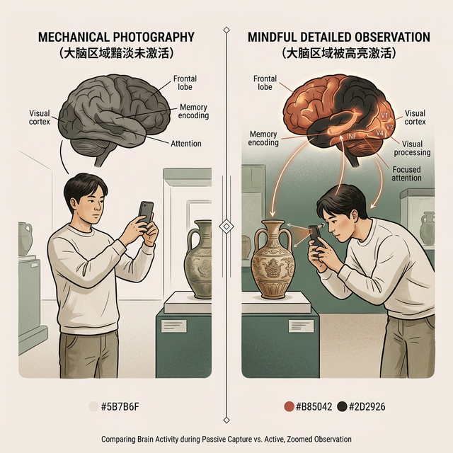
> **Scene**: 左侧是一个人在博物馆里机械地对着展品咔咔拍照，大脑皮层一片暗淡；右侧是他举着手机放大（Zoom In）寻找特定纹理，大脑区域被高亮激活
> **Text**: 让用户在关键节点主动投入认知

最后，请别将"减少负荷"和"剥夺参与"混为一谈：

> [CASE STUDY: 拍照与遗忘]
> Fairfield 大学心理学家 Linda Henkel 2014 年发表在 *Psychological Science* 上的研究报告了一个反直觉的发现：参观博物馆时，你对着展品拍照反而会让你记住**更少的展品**和**更少的细节**——包括展品的位置。Henkel 称之为"拍照损害记忆效应"，photo-taking impairment effect。机制是：你把"记住"的任务**卸载**给了相机，大脑的深层编码过程就被跳过了。但有一个精彩的反转——当受试者被要求**放大（zoom in）**拍摄展品的某个细节时，记忆损害**消失了**。放大操作迫使你做出选择和聚焦，重新激活了深层认知加工。这个发现对设计的启示是：**被动代劳不等于有效辅助**。真正降低认知负荷的设计，不是替用户做所有事，而是引导用户**在关键节点上主动投入注意力**。

> [VISUAL]
> **Slide**: w02-slide-19
> **Layout**: `Comparison`
> *   **Asset**: 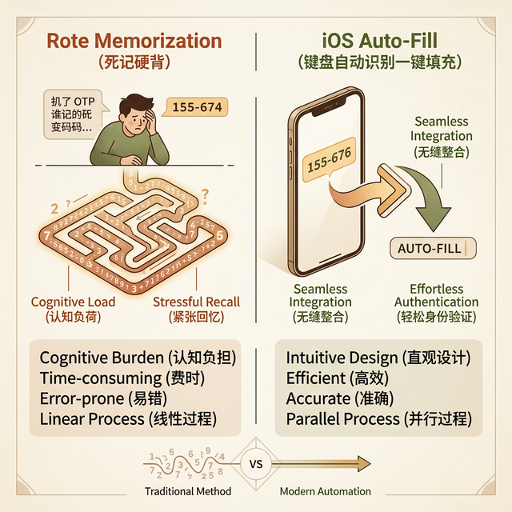
> **Scene**: 左列标题"回忆 Recall"——展示用户从短信弹窗死记硬背 6 位验证码的痛苦场景，右列标题"识别 Recognition"——展示 iOS 键盘上方自动浮出验证码胶囊按钮的便捷场景
> **List**: 回忆：凭空提取 → 高负荷 → 易出错 | 识别：看见即选择 → 低负荷 → 高效率
> **Text**: 回忆 vs 识别——记忆负荷的分水岭

> [VISUAL]
> **Slide**: w02-slide-28_1
> **Layout**: `Comparison`
> **Scene**: 对比画面。左侧是用户在两个应用间来回切换背诵验证码的繁琐操作；右侧是系统级悬浮的“一键填充”胶囊按钮。
> **List**: 强迫回忆：极易出错的背诵 | 识别提取：系统接管识别负担
> **Text**: 把凭空提取换成看见即选择

请看大屏幕上的左右对比：左侧是用户从短信弹窗里凭空背诵一串 6 位验证码的痛苦场景——眼睛在弹窗与键盘之间来回 4 次，每次都担心记错一位数字，整个过程极易出错；右侧是 iOS 系统级的"自动填充"功能——系统识别到短信里的验证码后，把它做成一颗胶囊按钮悬浮在键盘上方，用户只需轻点一下就完成输入。从左到右的差距，就是把"凭空提取"换成了"看见即选择"，把脑力负担从用户的工作记忆卸载到了系统的自动检测机制上。为什么仅仅是把输入框变成候选按钮，体验就发生了质变？这引出了我们将要揭示的核心机制——识别法则。

> [VISUAL]
> **Slide**: w02-slide-28_2
> **Layout**: `Center`
> **Scene**: 一个人脑负重前行，系统化作机械臂接过了大脑身上的重担。
> **List**: 回想的痛楚 | 识别的轻盈
> **Text**: 核心机制：识别法则

### 5.1 识别法则：将记忆负担卸载给系统识别

人的大脑提取信息有两套路径。

**回忆**——像在终端里凭空输入 `tar -zxvf filename.tar.gz`，需要从长期记忆中不借助任何线索地提取出完整信息。这极其耗费脑力，也极容易出错。

**识别**——看到选项，确认就好。现代手机的"验证码自动填充"就是典范：系统识别到短信后，把验证码做成胶囊按钮悬浮在键盘上方，你只需**轻点一下**。

> [VISUAL]
> **Slide**: w02-slide-19a
> **Layout**: `Split`
> *   **Asset**: 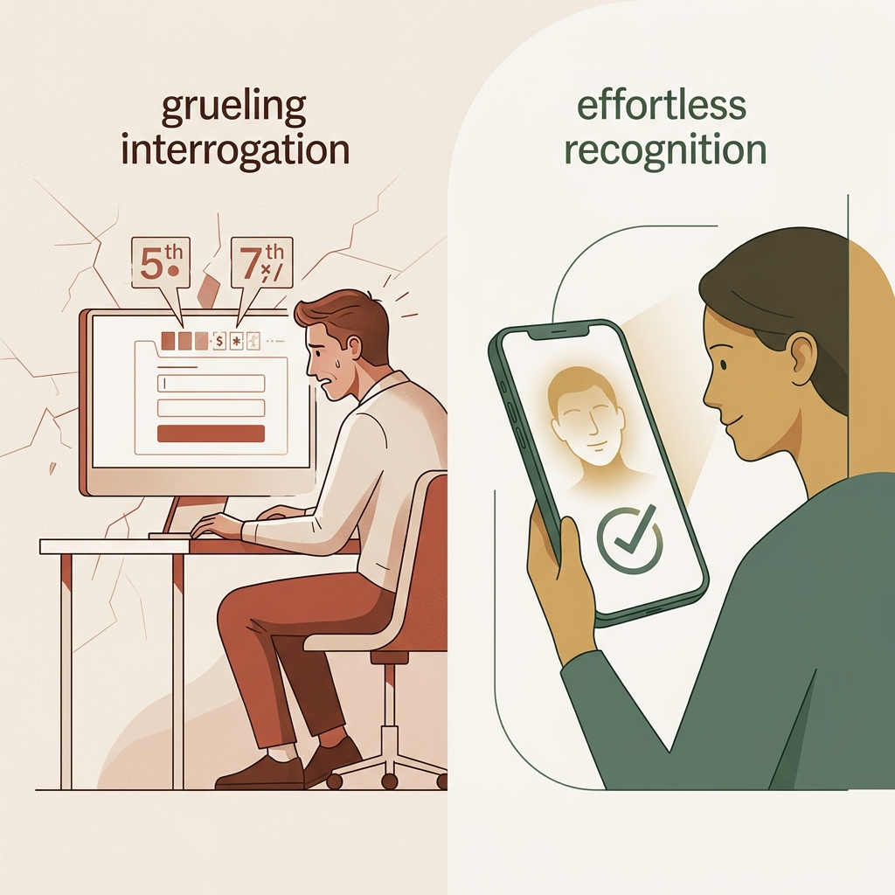
> **Scene**: 左侧是传统的网上银行登录界面，弹出要求输入"密码的第5位和第7位字母"；右侧是现代的 Face ID 人脸识别登录界面，带有清脆的绿色打勾解锁动画。
> **Text**: 失败的安全机制：用回忆对抗记忆限制

> [CASE STUDY: 银行密码的记忆折磨]
> 教材举了一个扎心的例子。网上银行为了安全，要求你设一个 5-10 位的密码——比如"interaction"。但它不会让你整个输入，而是随机要求你输入"第 7 个和第 5 个字母"。你试试——"interaction"的第 7 个字母是什么？你是不是得从头一个一个数过去？这种安全机制强迫用户进入了高负荷的回忆模式。结果呢？大量用户把密码写在一张纸上贴在电脑旁边——安全措施反过来制造了最大的安全漏洞。后来的生物识别登录（Face ID、指纹识别）正是用"识别"彻底取代了"回忆"，把认证的负担从人脑转移给了手机。

> [VISUAL]
> **Slide**: w02-slide-19b
> **Layout**: `Full`
> *   **Asset**: 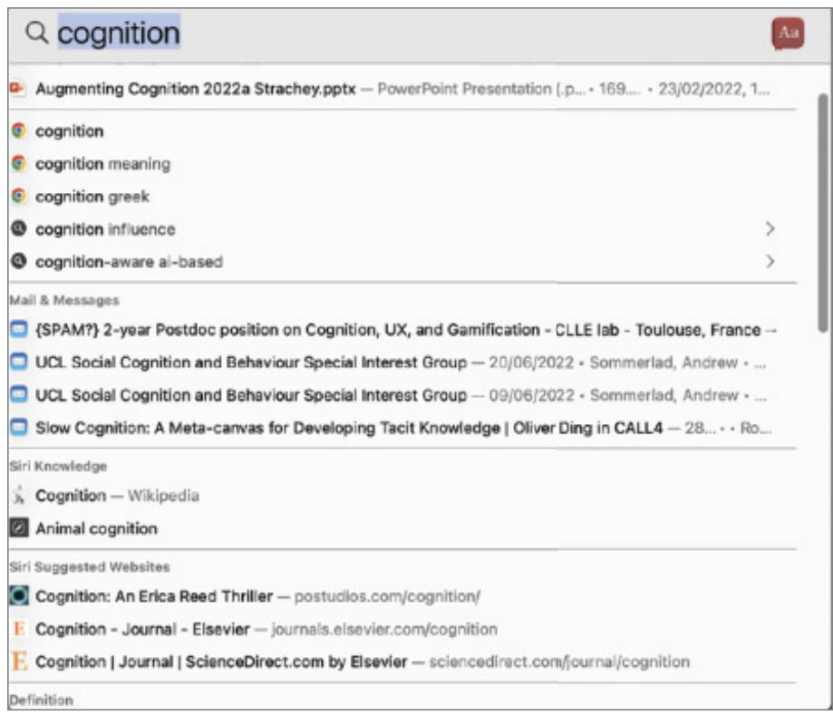
> *   **Asset (AI fallback)**: 
> **Scene**: Apple Spotlight 搜索框，作为模糊输入、识别法则的典型案例
> **Text**: 模糊输入，秒级识别挑选
> **Resource**: Interaction Design: Beyond HCI
> **Source**: Textbook

> [VISUAL]
> **Slide**: w02-slide-19b_video
> **Layout**: `Full`
> **Scene**: 录屏展示用户使用 Cmd+K 快捷键唤出 Raycast 面板并秒速搜索，将复杂操作转化为视觉识别
> **Text**: 万能命令面板：识别代替回忆
> **Asset**: 
> **Source**: `Video` — Raycast 快捷指令操作
> **Duration**: `0m30s`
> **TimeCategory**: `activity`

> [CASE STUDY: Cmd+K 命令面板]
> 现代生产力工具里无处不在的 `Cmd+K` 万能命令面板把这个原则推到了极致。在 Notion、VS Code、Linear 中，你只需敲两三个首字母，系统就基于上下文**模糊匹配**出所有可能的操作，供你肉眼挑选。你本来需要在六七层菜单里逐级翻找的功能，现在一秒搞定。这就是把"回忆"转化为"识别"——把命令行时代的"凭空背咒语"压缩成了图形界面时代的"看见即点击"。

> [TEACHING MOMENT]
> 优秀交互设计的底线之一：**把所有需要痛苦"回忆"的任务，转化为轻松的"识别操作"**。不要强迫你的用户用他们有限的瞬时记忆，去应对复杂的数字系统。

**(Pause: 3s)**

### 5.2 外部认知：利用环境和工具扩展工作记忆

> [VISUAL]
> **Slide**: w02-slide-19c
> **Layout**: Grid
> *   **Asset**: 
> **Scene**: 三个网格：写在便签上的购物清单（外部化）、正在计算的计算器（计算卸载）、地图上画满红圈的标记（注释追踪）
> **List**: 外部化 | 计算卸载 | 注释追踪
> **Text**: 外部认知——外包大脑机能

> [VISUAL]
> **Slide**: w02-slide-31_1
> **Layout**: `Center`
> **Scene**: 外部认知的隐喻。人类的大脑连接着几根虚拟导线，导线连接着外部的纸笔便签、计算器屏幕、以及地图导航图标。
> **List**: 外部化：释放工作记忆 | 计算卸载：外包计算任务 | 认知追踪：降低标记负担
> **Text**: 借用工具扩展大脑的能力

讲到这里，你可能会觉得人类的大脑太弱了——注意力窄、记忆小、容易过载。但人类有一个了不起的对策：我们会**借用外部工具来扩展大脑的能力**。认知科学把这叫做**外部认知**——External Cognition。

> [VISUAL]
> **Slide**: w02-slide-31_2
> **Layout**: `Flow`
> **Scene**: 外部认知的流转过程，从大脑内部的模糊想法，转变为便签上的文字，再到电子屏幕上的智能导航。
> **List**: 外部化 | 计算卸载 | 认知追踪
> **Text**: 外部认知的核心路径

教材指出了外部认知的三种基本形式。第一种是**外部化**——把脑子里的信息搬到外面。你把待买清单写在纸上，你的工作记忆就腾出了空间。设计师在白板上画原型图，他的思路就从模糊变成了可见。第二种是**计算卸载**——让工具替你做计算。你不用心算 37×83，用计算器就行。导航 App 替你规划路线就是计算卸载。第三种是**注释和认知追踪**——在已有信息上做标记。你在书上划重点，在地图上标记去过的地方，本质上都是在利用外部标记来**减轻大脑的追踪负担**。

> [VISUAL]
> **Slide**: w02-slide-19c1_2
> **Layout**: `Center`
> *   **Asset**: 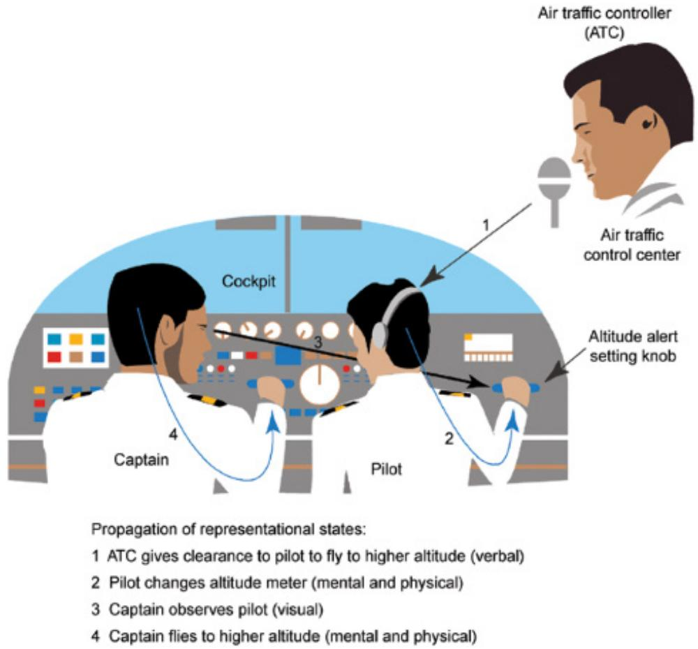
> **Scene**: 分布式认知网络：人脑、发光的显示屏、桌面上写满便签的图纸、以及旁边正说话的同事之间，用光纤连接成一个庞大的思考网络
> **List**: 认知不只在脑中 | 跨越人-机-环境的分布式网络
> **Text**: 突破大脑的边界：分布式认知
> **Resource**: Interaction Design: Beyond HCI
> **Source**: Textbook

> [DID YOU KNOW]
> 教材还介绍了一个更广义的框架叫**分布式认知**，Distributed Cognition。它认为认知活动不仅仅发生在一个人的脑子里，而是**分布在**人、工具和环境之间的。一个航空管制员的工作不是一个人完成的——它分布在管制员的大脑、雷达屏幕、纸质飞行条、同事的口头通报，以及标准化操作流程之间。任何一个环节失灵，整个认知系统就会崩溃。这个视角对设计师的启示是：**你设计的不是一个孤立的界面，而是一个包含了用户、设备和环境的认知生态系统。** 界面上的每一个视觉线索、每一个快捷方式、每一个提示文案，都是这个分布式认知系统的一部分。

> [VISUAL]
> **Slide**: w02-slide-19c2
> **Layout**: `Image`
> *   **Asset**: 
> *   **Asset (AI fallback)**: 
> **Scene**: 东京 teamLab 无界美术馆的沉浸式空间摄影。观众的身体周围绽放出光影花朵，水流的投影在人们脚下自动分开。
> **Text**: 分布式认知——身体就是交互的媒介
> **Source**: Web Source

> [VISUAL]
> **Slide**: w02-slide-19c2_video
> **Layout**: `Full`
> **Scene**: 视频展示观众在 teamLab 美术馆中，用身体动作与花朵、水流等虚拟光影产生互动
> **Text**: 用身体感知环境：分布式认知
> **Asset**: 
> **Source**: `Video` — teamLab 官方纪录片
> **Duration**: `0m45s`
> **TimeCategory**: `activity`

> [ART/AESTHETICS]
> 日本国际艺术团体 **teamLab** 2024 年在东京重新开幕的**无界美术馆（Borderless）**就是分布式认知的顶级商业实践。他们的理念是"身体主动感知"（Body Active Perception）——他们拒绝将观众固定在"看"这个单向动作上，而是让花朵因人的触摸而盛开、让水流因人的驻足而改道。观众的身体就是触发世界变化的媒介，艺术作品的形态被分布并**卸载**到了每一位经过的人群身上。这本质上也是一种高阶的分布式认知和物理反馈交互。

所以，好的交互设计本质上就是**外部认知的设计**——你在帮用户的大脑"装外挂"，把那些容易出错、容易遗忘、容易过载的认知任务，用界面元素替代掉。待办事项列表、日历提醒、自动保存、智能推荐——这些功能本质上都是外部认知。

> [VISUAL]
> **Slide**: w02-slide-19d
> **Layout**: `Grid`
> *   **Asset**: 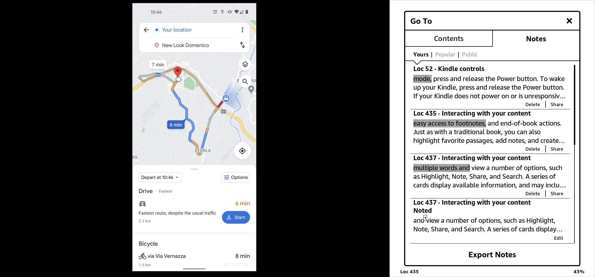
> *   **Asset (AI fallback)**: 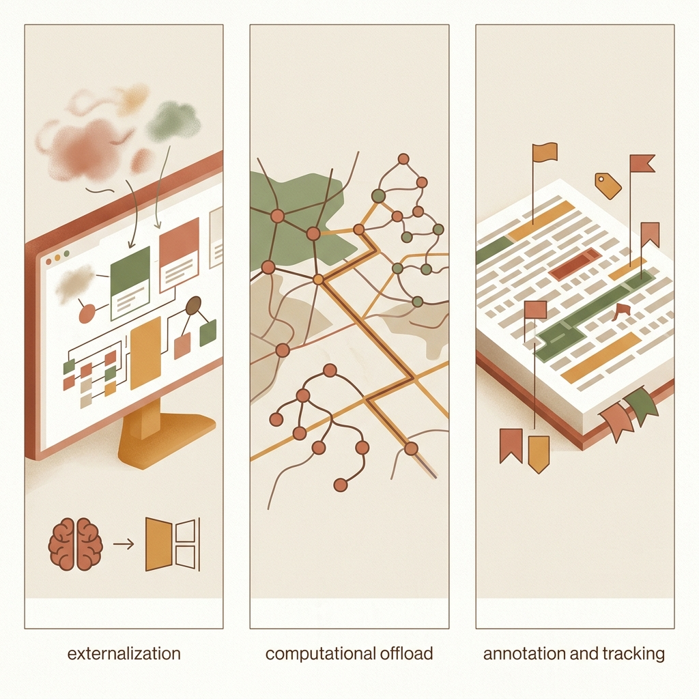
> **Scene**: 3×1 横向网格展示外部认知三种形式的产品级实例：左格「外部化」——Notion 页面的白板便签墙，设计师思路从模糊变成可见，旁边标注「工作记忆腾空」；中格「计算卸载」——Google Maps 导航路线自动规划，标注「路线算法 = 思维替代」；右格「注释追踪」——Kindle 电子书上的高亮标记和批注，标注「让外部标记减轻大脑追踪负担」
> **List**: 外部化：信息搬出大脑 | 计算卸载：工具替你推算 | 注释追踪：标记减轻追踪负担
> **Text**: 外部认知三形式——为大脑装外挂
> **Source**: Web Source

**(Pause: 3s)**

> [ACTIVITY]
> **Type**: `QA`
> **Duration**: `1min`
> **Desc**: 快速检验理解——"谁能用一句话总结，自动登录属于哪种外部认知？"

理论讲够了。是时候拿起这些工具，去切割现实了。

### 5.3 摩擦搜查：用认知原理逆向诊断产品病灶

<!-- BUDGET: 1500 chars | STATUS: done -->

> [ACTIVITY]
> **Type**: `Practice`
> **Duration**: `35min`
> **Desc**: 认知摩擦大搜查——寻找并剖析身边的"反面教材"

> [VISUAL]
> **Slide**: w02-slide-20
> **Layout**: Split
> *   **Asset**: 
> **Scene**: 实践活动引导页，标题"认知摩擦大搜查"，配以放大镜与裂纹界面的图形化图标
> **List**: 🔍 猎手寻踪 10min | 🔬 诊断解构 15min | 🎤 提案时刻 10min
> **Text**: 认知摩擦大搜查 · 三阶段实战

> [VISUAL]
> **Slide**: w02-slide-33_1
> **Layout**: `Center`
> **Scene**: 侦探放大镜与手术刀组合的图形。背景隐约浮现四个图标：鸿沟、心理模型、隐喻、认知负荷。
> **List**: 猎手寻踪：捕捉日常摩擦 | 诊断解构：四把理论手术刀
> **Text**: 将理论变为剖析现实的手术刀

好。你们刚才吸收了大量抽象的认知理论。现在，是时候把这些理论变成**手术刀**，去剖析现实了。

**任务说明**：

以小组为单位，完成以下三个步骤：

**第一阶段 · 猎手寻踪（10 min）**

快速在手机 App、网页，甚至教室周围的实体产品中，找出 **3 个**让你们产生强烈"心智摩擦"的反面案例。投影仪遥控器够不够奇葩？空调面板是不是反人类？手机里哪个 App 让你骂过最多次？

> [VISUAL]
> **Slide**: w02-slide-33_2
> **Layout**: `Center`
> **Scene**: 显微镜下的解剖图，隐喻着深入分析界面的底层结构与交互断层。
> **List**: 执行鸿沟 vs 评估鸿沟 | 表现模型 vs 实现模型
> **Text**: 用四把钥匙精准开锁

**第二阶段 · 诊断解构（15 min）**

用今天学到的四把钥匙去精准开锁，不要只停留在表面的抱怨：
首先，判断它究竟栽在了**执行鸿沟**还是**评估鸿沟**？
其次，检查它是否把底层的**实现模型**强行暴露给了用户？
再次，审视它的**界面隐喻**是不是用错了、或者已经严重老化？
最后，确认是否是**信息层级**的缺失，最终导致了严重的**认知过载**？

> [VISUAL]
> **Slide**: w02-slide-20a_2
> **Layout**: `Center`
> *   **Asset**: 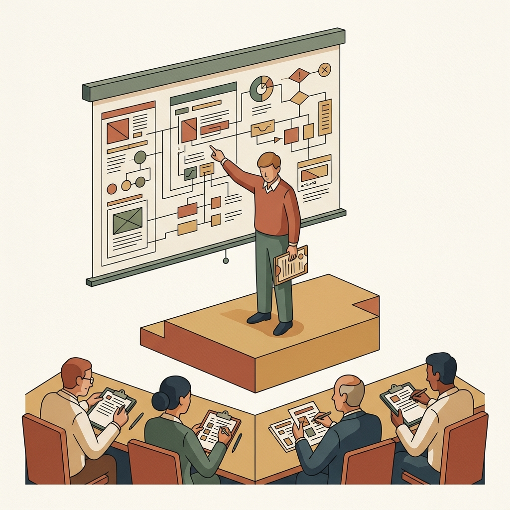
> **Scene**: 学生站在讲台上，屏幕上投射着他们拆解的反人类界面，手里拿着诊断书，下面坐着正在记录的“主刀医生”评委们
> **List**: 1分钟痛点展示 | 1句话精准定性 | 1个改良处方
> **Text**: 提案要求：精准定性，开出处方

**第三阶段 · 提案时刻（10 min）**

每组挑选最典型的一个案例，上台做 **2 分钟**的快速脱稿批判。请用一句话点透它的"病因"，再用一句话给出你的"处方"。

> [VISUAL]
> **Slide**: w02-slide-20b
> **Layout**: `Stat`
> *   **Asset**: 
> **Scene**: 一张干净的统计卡片，高对比度显示核心数据：大字号的 "1.56 亿" 银发网民数量，以及 "3000+" 适老化改造的 App 数量。背景隐约有几位老年人轻松使用智能手机的剪影。
> **Text**: 包容性设计不是可选项，是底线

> [PHILOSOPHY]
> 当我们讨论"心智摩擦"时，请把目光再放远一步。那些视觉障碍、认知障碍或高龄用户——对健全用户来说只是"不太方便"的设计缺陷，对他们可能意味着**完全无法使用**。
> 截至 2024 年底，工信部已推动超过 3000 个老年人常用的网站和 App 完成适老化改造，超过 1 亿台国产智能手机和智能电视上线了"长辈模式"。中国 60 岁以上"银发网民"已达 1.56 亿。无障碍设计与包容性设计——不是锦上添花的可选项，而是法律义务和数字公民社会的基本底线。

### 5.4 认知收网：用四大原理重构数字生态

<!-- BUDGET: 1800 chars | STATUS: done -->

> [VISUAL]
> **Slide**: w02-slide-21
> **Layout**: Grid
> *   **Asset**: 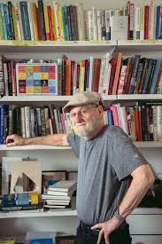
> *   **Asset (AI fallback)**: 
> **Scene**: 2×2 网格卡片，每张卡片标注一个根源——左上"注意力·感知·记忆的天然局限"（大脑图标），右上"执行鸿沟与评估鸿沟"（断裂链条图标），左下"实现模型 vs 心理模型"（对抗箭头图标），右下"隐喻的破裂·老化·限制"（碎裂的图标）
> **List**: 1️⃣ 认知管线的三道滤网 | 2️⃣ Norman 的两道鸿沟 | 3️⃣ Cooper 的三种模型 | 4️⃣ 隐喻的三种死法
> **Text**: 心智摩擦四大病因总览
> **Source**: Web Source

> [VISUAL]
> **Slide**: w02-slide-35_1
> **Layout**: `Grid`
> **Scene**: 四块完整的核心拼图严丝合缝地拼接在一起。四块拼图分别带有微型标志：漏斗（认知限制）、深渊（鸿沟）、三齿轮（模型冲突）、旧磁带（隐喻老化）。
> **List**: 漏斗与便签桌 | 执行与评估鸿沟 | 三模型大战 | 老化的双刃剑
> **Text**: 破防心智摩擦的四大元凶

由于时间关系，系统学习就到这里。在过去两小时里，我们拆解了导致"心智摩擦"的四大认知根源：

**第一块拼图**：人类认知管线的三道先天滤网。注意力是漏斗（盲点 + 横幅盲视）、感知是格式塔拼图机、记忆是只能贴 4 张便签的小桌——设计师的最高道德是**不要考验用户的记忆力**，识别永远胜过回忆。

**第二块拼图**：Don Norman 的两条行动鸿沟。**执行鸿沟**拦在操作之前，用显性可供性 + 前置约束去填平；**评估鸿沟**拦在操作之后，用即时、多模态、可撤销的反馈去接住。

> [VISUAL]
> **Slide**: w02-slide-35_2
> **Layout**: `Center`
> **Scene**: 三个齿轮疯狂对冲，代表三种模型间的激烈战争，火花四溅。
> **List**: 实现模型：机器真理 | 心理模型：用户朴素直觉 | 表现模型：界面伪装
> **Text**: 模型大战：弥合认知错位

**第三块拼图**：Alan Cooper 的三模型大战。实现模型是机器真理，心理模型是用户朴素直觉。伟大体验设计的唯一出路——把**表现模型推向心理模型**，把工程术语永远埋在视线之外。

**第四块拼图**：隐喻这把双刃剑。桌面/文件夹/购物车搭起了几十亿用户的入口，但在 AI 与空间计算的时代，**敢于杀死自己创造的旧隐喻**才是设计师的成年礼。

> [VISUAL]
> **Slide**: w02-slide-21b
> **Layout**: `Center`
> *   **Asset**: 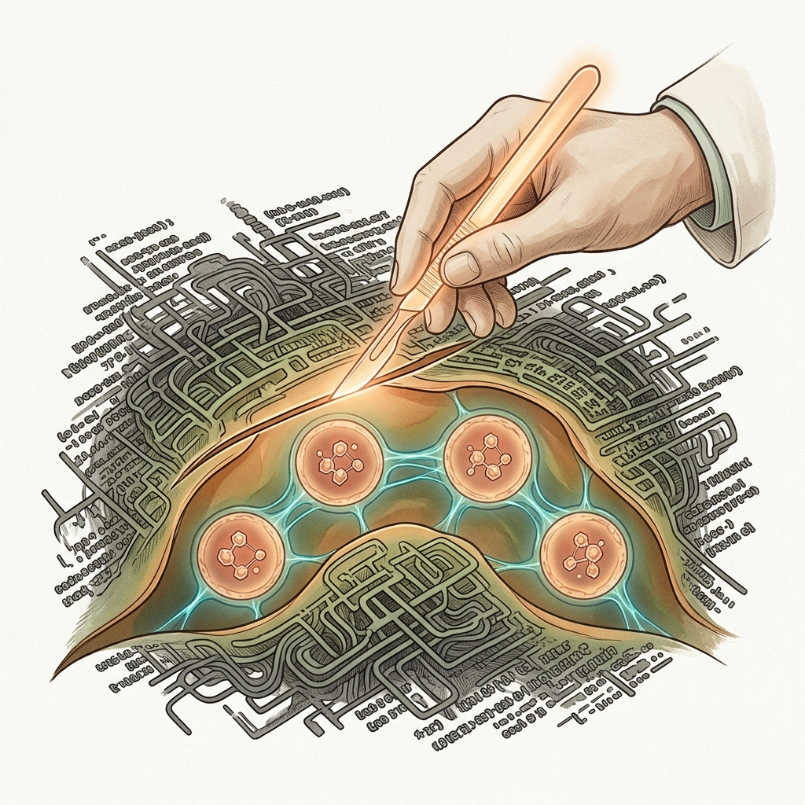
> **Scene**: 一名医生拿着发光的手术刀，切开由代码组成的乱码表层，暴露出底层的四个病灶核心节点
> **List**: 穿透表象 | 定位四大病灶 | 开出重构处方
> **Text**: 从受害者到主刀医生的蜕变

**(Pause: 3s)**

从今天起，当你再遇到一个让你卡壳、抓狂、迷路的数字界面时，停下来三秒，立刻问自己四个硬核问题：
**摩擦究竟发生在哪一条认知管线上？是注意力被无效刺激耗尽了？是评估鸿沟因反馈断层拉开了？是设计师把实现模型当表现模型在裸奔？还是这个界面的旧隐喻跟不上你的文化潜意识了？**
唯有能够客观且精确地穿透表象、定位病灶，你们才有资格作为主刀医生，开出一张重构数字世界的代码处方。

> [VISUAL]
> **Slide**: w02-slide-22
> **Layout**: `Split`
> *   **Asset**: 
> **Scene**: 粗犷硬核的深色任务板，带有发光的扫描准星
> **List**: 📋 锁定一个典型认知过载界面（软硬件皆可） | 🔥 P图绘制出它的认知热力图与注意力黑洞 | 📌 锚定四大理论，至少定性三处摩擦节点 | 💡 提交基于心智模型原理视角的降维重构草图（至少3条改点）
> **Text**: 课后任务——绘制你的认知热力图

**课后任务**：
选取一个让你身受其害的、存在严重**认知过载**的界面（甚至包括你校园里的某些教务系统或者打卡机器）。不用写代码，直接把界面截图，用红笔绘制出它的**认知热力盲区**，锚定所有引发摩擦的操作节点。并在你的报告最后，提出至少 **3 条**基于今天所学四大心智模型理论视角的防御性重构建议。

> [VISUAL]
> **Slide**: w02-slide-23
> **Layout**: `Center`
> *   **Asset**: 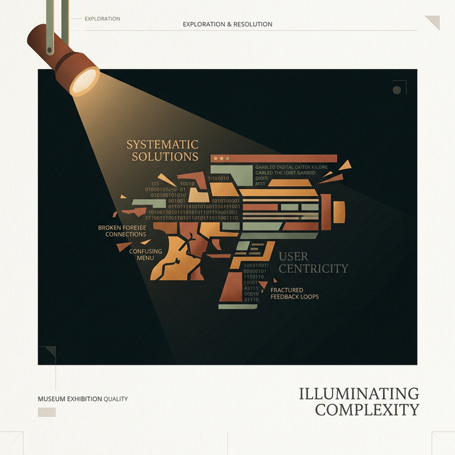
> **Scene**: 广角镜头拍摄的拥挤城市十字路口，人头攒动，色调略微压抑，中心有一个鲜亮的指南针指针
> **Text**: W03 · 产品洞察与痛点切入

今天的理论探讨，本质上是在做**"解构"**——我们在学习如何将病灶清晰地剥离出来。
但在工程世界里，破坏永远只是前奏。从下节课，也就是 W03 开始，我们要拿回工具，开始真正的**"建设"**。我们将离开无菌的教室，走进泥沙俱下的丛林法则里，去学习如何运用定性与定量并行的用研方法（User Research），去真实的世界里切中那些最具商业价值的隐性痛点。

伟大体验设计的第一步，永远是从**学会精准地感受痛楚**开始的。

很高兴和你们一起完成这次认知的探索。下课。
