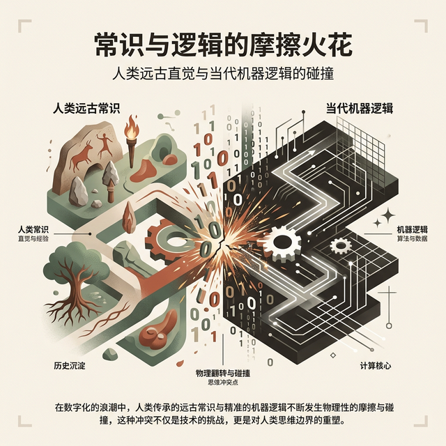
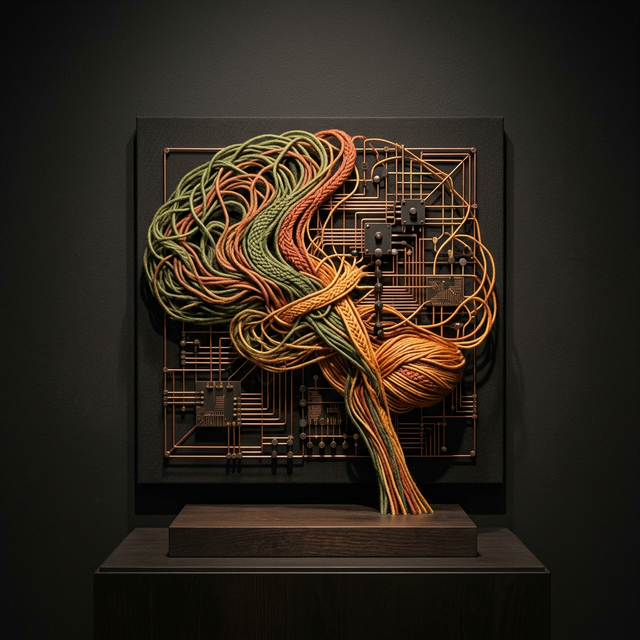

# W02 人类认知与心智摩擦

> **本节目标**
> 1. 深入理解人类认知局限与短时记忆负荷
> 2. 掌握心智模型与界面隐喻的映射规律

*Tags*: `[THEORY]` `[CASE STUDY]` `[COGNITIVE FRAMEWORK]` `[ACTIVITY]` `[PHILOSOPHY]`

---

## 复习：W01 回顾 (10 min)

<!-- BUDGET: 1800 chars | STATUS: done -->

> [VISUAL]
> **Slide**: w02-slide-01
> **Layout**: Split
> *   **Asset**: 
> **Scene**: 左侧为可用性目标（有效性/效率/安全性等）五边形雷达图，右侧为用户体验目标（满意/愉悦/有趣等）情感色轮图
> **List**: 可用性目标：有效·高效·安全·易学·易记 | 体验目标：满意·愉悦·有趣·有价值

上周我们撕开了一个口子。

我们说，交互设计不是画界面，它是在打造一段**人与数字世界之间的对话**。而这段对话的质量，有两把尺子——一把量"用着顺不顺"，叫**可用性目标**；另一把量"感受好不好"，叫**用户体验目标**。

**(Pause: 3s)**

快速回忆一下。可用性的五根支柱——有效、高效、安全、易学、易记——像一张及格线：做不到，产品直接出局。而体验目标——满意、愉悦、有趣——则是加分项，是让用户从"能用"跃迁到"爱用"的催化剂。

> [VISUAL]
> **Slide**: w02-slide-01b
> **Layout**: List
> *   **Asset**: 
> **Scene**: 五条设计原则的图标化卡片列表，每条配一句核心定义
> **List**: 可见性 Visibility：让用户看见能做什么 | 反馈 Feedback：让用户知道做了什么 | 约束 Constraints：让用户不能做错什么 | 一致性 Consistency：让用户不必重学什么 | 示能 Affordance：让物体自己说话

另外，我们还认识了五把武器——**设计原则**。快速过一遍。

**可见性（Visibility）**——功能存在却看不见，等于不存在。当一个关键的退订按钮隐藏在三级菜单的灰色小字里，它和不存在有什么区别？系统必须把用户的操作选项"亮"出来。
**反馈（Feedback）**——用户的每一次操作都应该得到系统的明确回应，哪怕只是一个微妙的颜色变深、一声清脆的"咔哒"音效或一个短暂的物理振动。沉默的系统就是在实施**冷暴力**。
**约束（Constraints）**——好的设计不是靠写长篇大论的警告教用户不犯错，而是通过物理或逻辑的限制，让犯错变得**在物理上不可能**。USB-C 接口不分正反面，三相插头插不反，这就是约束的极致。
**一致性（Consistency）**——同一个 App 里，红色代表危险的删除，结果到了设置页面，红色变成了确认保存……这种视觉语言的不一致会让用户的大脑短路。不仅要内部一致，还要与用户的外部经验一致。
**示能（Affordance）**——一把好椅子不需要说明书，你看到靠背的倾斜度就知道往哪坐；一个好按钮不需要"请点击这里"的标签，你看到它的材质光泽和凸起质感，手指就会本能地按下去。让物体自己说话。

**(Pause: 3s)**

> [DID YOU KNOW: 为什么要有两把尺子？苹果 1993 年的血泪觉醒]
> 我们为什么要极其苛刻地区分"可用性"和"用户体验"？这并非学术圈的无聊文字游戏，而是一次价值上亿美元的商业血泪教训。
> 1990 年代初的个人电脑市场，工程师文化占据绝对统治地位。"可用性"工程其实早就存在了——当时的软件公司会请所谓的"人因工程师（Human Factors Engineers）"来测试软件，但他们的测试极其机械：只看用户能不能在 5 分钟内点到正确的按钮、错误率是多少。只要测试通过，软件就发售。
> 结果呢？全彩屏、超多功能的软件被造出来，它们绝对"可用"、有效且安全，但用户在家里用的时候，依然感到枯燥、厌烦、甚至觉得这台机器在嘲笑他们的智商。
> 真正的转折点发生在 1993 年。唐·诺曼（Don Norman）正式以"User Experience Architect（用户体验架构师）"这个人类历史上第一次出现的新头衔加入苹果公司。他带来的最核心洞察是：人不只是一台输入输出的处理机，人是有情绪的动物。当你在拆开一台 Mac 的包装盒、摸到那极具阻尼感的纸张、闻到新机器的气味、按下电源键听到的那声经典的「Dang——」开机和弦音时，那一刻的**感受（Emotion）**和用表格测出来的点击效率同样重要，甚至在购买决策上占据了绝对主导权。
> 可用性保证了你的产品不会在发布第一天被用户骂着退货；而用户体验，特别是我们在右侧圈出的"愉悦、有趣、有情感共鸣"这些指标，才是决定用户会不会向他的三个好朋友疯狂安利你产品的核心引擎。这两把尺子，一把是产品的绝命生死线，一把是产品的无形护城河。

> [ACTIVITY: 脑内微演习 - 办公室咖啡机]
> **Type**: `Practice`
> **Duration**: `3min`
> **Desc**: 快速情境代入测试
> `操作`：讲师描述一个日常抓狂场景，要求学生瞬间匹配对应的设计原则失误。
> `引导词`："光背定义没用，我们来做一个 10 秒钟的体检演习。想象一下你刚入职，走向茶水间那台高级的意大利全自动咖啡机。"
> "场景 1：你按下了『浓缩』键，机器毫无反应，屏幕没亮音效也没响。你不知道它是坏了还是正在加热，于是你又按了四次，结果机器突然连续出了五杯浓缩流了一地。——这是什么原则断裂？" （**反馈缺失**）
> "场景 2：机器上有一排黑色的方形平面贴片，没有突起，没有边框。你看半天都不知道这到底是装饰性的反光板，还是可以按下去的触摸按键。——这没做到什么？" （**示能微弱/可见性差**）
> "场景 3：你终于摸清了套路，长按左边第一个键是出水。第二天换了一台同品牌不同型号的机器，你长按左边第一个键，结果喷出来的是滚烫的蒸汽烫了手。——这违背了什么原则？" （**一致性破裂**）

看到了吗？这些原则是我们上周从"外部视角"得出的——作为一个旁观者，拿着检查清单逐条给一个产品的"体态"打分。它们告诉你**正确的设计应该长什么样**、**错误的表象如何归类**，但没有回答一个更具破坏性的根本问题——

**为什么错误的设计会让你在按下咖啡机的那一瞬间，血压飙升、感到抓狂？**

> [VISUAL]
> **Slide**: w02-slide-02
> **Layout**: Title
> *   **Asset**: 
> **Scene**: 过渡页，大字"WHY?"配以模糊的抓狂用户剪影背景

换句话说，上周我们开的是"清单式"的诊断——逐条盘点一个产品的可用性得分。今天，我们要切换到**病理学视角**：不是"哪里扣分了"，而是——人类的大脑到底是怎么处理信息的？它在什么条件下必然崩溃？搞清楚这个，你才能从"头痛医头"升级到"治未病"。

**(Pause: 3s)**

今天要回答一个更狠的问题——

**为什么那些看起来功能完备、界面精美的产品，用起来依然让人抓狂？**

答案不在代码里，不在像素里。这个"为什么"，藏在人的脑子里。今天，我们正式进入认知科学的领地。

---

## 导入：看似好用却令人抓狂 (15 min)

<!-- BUDGET: 2700 chars | STATUS: done -->

> [VISUAL]
> **Slide**: w02-slide-03
> **Layout**: Grid
> *   **Asset**: 
> **Scene**: 2×2 网格展示四个"看似精美但体验糟糕"的界面截图：一个层级深达五层的政务 App 首页、一个满屏密密麻麻选项的智能电视遥控器、一个需要手动输入 16 位银行卡号的支付页面、一个弹出三层确认对话框才能删除一条消息的企业 IM

来，先做一个实验。

请打开你手机上最常用的三个 App。随便挑一个你**最近骂过**的操作——可能是找了半天找不到的设置项，可能是一个莫名其妙的报错弹窗，也可能是一个明明简单却硬要你点击五次才能完成的流程。

**(Pause: 5s)**

> [LIFE CONNECT]
> 如果你用过 12306 的早期版本订过火车票，你一定记得那种滋味。我们来做一次完整的"认知解剖"。首先，验证码——那不是字母，那是一道**视力测试加阅读理解的混合卷**。扭曲的字符、杂乱的背景线、模糊到你分不清 O 和 0 的辨识度——你的**注意力**不是花在"完成目标"上，而是花在"猜谜"上。然后是密码——系统要求你的密码同时包含大小写字母、数字和特殊符号，而且不能和最近五次使用的密码重复。你的**工作记忆**被强行塞满了规则碎片，以至于你根本腾不出"认知带宽"去思考正事——选座位、比价格。最后是倒计时——系统给你 30 分钟完成支付，黄色数字在页面顶端一秒一秒地跳动。你不是在"使用"系统，你是在和系统**赛跑**，焦虑感把你的理性决策能力压缩到最低。验证码折磨注意力，密码规则压垮记忆，倒计时制造焦虑——这三板斧加在一起，就把一个功能完备的系统变成了一台**认知绞肉机**。

看到了吗？**功能完备 ≠ 体验优秀**。12306 能买到票吗？能。但在买到票之前，你的大脑已经被拧干了。

**(Pause: 3s)**

> [LIFE CONNECT: 日常数字摩擦三连]
> 其实 12306 不算孤例。你们的日常里充满了"看似应该简单、实际上令人崩溃"的数字摩擦。第一个，**医院自助挂号机**——屏幕上同时显示"门诊挂号"、"预约挂号"、"当日挂号"、"专科挂号"四种入口，每个入口里还藏着二级分类。一个只想看个感冒的患者，被迫在挂号机前做了一道关于"中国医疗行政分类体系"的判断题。第二个，**银行 ATM 的转账流程**——你需要依次选择"转账业务"→"行内转账"或"跨行转账"→"实时转账"或"普通转账"→ 手动输入对方完整的银行账号。你明明只想做一件事——把钱给朋友——但 ATM 硬要你了解银行间结算体系的运作方式。第三个，你们一定遇到过的——**某些 App 的注销账号流程**：先在设置里找到"账号安全"，再点"注销账号"，然后被跳转到一个需要你手动输入"我确认注销"六个字的页面，接着是 15 天的冷静期等待。产品经理不是不知道这很反人类——**他们是故意的**。这种摩擦被设计行业称为"暗黑模式"（Dark Patterns），将来的课上我们会专门解剖。

> [VISUAL]
> **Slide**: w02-slide-04
> **Layout**: Image
> *   **Asset**: 
> **Scene**: 全屏深色背景，中央巨大的白色文字"心智摩擦 Mental Friction"，下方小字"——当人类大脑撞上机器逻辑"
> **Text**: 心智摩擦 Mental Friction

大多数烂体验的根源，不是按钮颜色不对、字号不够大这些表面问题。它的病根埋得更深——**在你的大脑里**。

交互设计领域有一个精准的诊断词，叫**心智摩擦**，英文叫 Mental Friction。它指的是：当人类天生的认知方式，与机器冷冰冰的运行逻辑发生碰撞时，用户内心产生的那股无形阻力。

**(Pause: 3s)**

这种摩擦看不见、摸不着，但它无处不在。它是你盯着一个界面三秒钟却不知道该点哪里的那一刻；它是你完成了操作却不确定到底成没成功的那种悬空感；它是你明明想做一件简单的事，系统却硬要你按照它的逻辑绕一大圈的那种窒息。

> [PHILOSOPHY: 从海德格尔看人机边界]
> 德国哲学家海德格尔（Martin Heidegger）在《存在与时间》里提出了两个伟大的概念——**"上手状态"（Ready-to-hand）**和**"在手状态"（Present-at-hand）**。这个诞生在将近 100 年前、看似和计算机毫无关系的哲学洞察，却精准地预言了 21 世纪的交互设计挑战。
> 当你熟练地用锤子砸铁钉时，你的注意力全在铁钉上，锤子对你来说是透明的、隐形的，这就叫"上手状态"（Ready-to-hand）；但当锤子突然断了、或者太滑握不住时，你被迫停下来端详这把锤子，它就成了一个让你分心、客观存在的冰冷物体，这就叫"在手状态"（Present-at-hand）。"心智摩擦"，本质上就是把用户从流畅的"上手状态"生生拽出来，变成充满挫败感的"在手状态"的那个瞬间。

用海德格尔的镜头来审视你手边的数字工具：当你用微信聊天聊得兴起的时候，你根本意识不到"手机"或"App"这段物理与代码堆积物的存在——它是透明的，是"上手"的，你感觉自己是在直接和屏幕背后的那个人讲话。但当微信突然弹出一个"存储空间不足，请清理缓存"的系统级弹窗，或者当你发送图片卡在 99% 进度条死活不动时——砰，你被粗暴地拽回了现实。手机瞬间从一个透明的沟通媒介，退化成了一台需要你手动维护参数和处理故障的机器。**这个从透明媒介到冰冷机器"跌落"的砰然巨响，就是心智摩擦发作的瞬间。**

> [VISUAL]
> **Slide**: w02-slide-04b
> **Layout**: Comparison
> *   **Asset**: 
> **Scene**: 左列"快思考 System 1"——直觉/自动/不费力，配刷短视频和开车的图标；右列"慢思考 System 2"——理性/刻意/耗能，配做数学题和填税表的图标
> **List**: 快思考：刷抖音·滑解锁·语音输入 | 慢思考：填表单·学新软件·手动排版

在正式拆解摩擦之前，我们需要先理解一个大脑的底层能耗模型。认知科学家 Don Norman 区分了两种认知模式：**经验型认知（Experiential Cognition）**和**反思型认知（Reflective Cognition）**。经验型认知是直觉的、快速的、不费力的——这就好比你每天开车上下班、刷朋友圈、看短视频时的状态。反思型认知则是刻意的、缓慢的、费力的——这好比你撰写年度述职报告、做微积分演算、或者学习一套极度复杂的工业造价软件时的状态。

后来，诺贝尔经济学奖得主 Daniel Kahneman 用更通俗且风靡全球的说法，把这两种模式称为**系统 1（快思考）**和**系统 2（慢思考）**。

> [DID YOU KNOW: 认知税与自我损耗]
> Kahneman 有一个经典的课堂演示。他在讲座上先问听众："2+2 等于多少？"全场观众几乎不假思索地脱口而出。然后他话锋一转问："21×19 等于多少？"全场陷入死寂。区别在哪？第一题用"快思考"可以直接从记忆库里秒杀，毫不费力；第二题则强制切断了快思考，强行启动了引擎沉重的"慢思考"。
> 你们当时的脸上写满了系统切换的痛苦——前者的表情是放松的、甚至带着一丝不屑，后者的表情是眉头紧锁、目光向上、甚至屏住呼吸。这就是两套认知系统的**"切换成本"**。你的前额叶皮层需要从"低能耗待机模式"切换到"全功率运算模式"，这个过程消耗的不仅是时间，更是极度宝贵的**意志力**——心理学上称之为"自我损耗"（Ego Depletion）。每一次强迫用户动用慢思考，你都在向他们征收高昂的**认知税（Cognitive Tax）**。税收得太狠，用户就会破产离开。

> [STORY TIME: 从"连刷短视频"到"填报销单"的无缝血管迷走神经反应]
> 我们把 Kahneman 的理论直接映射到你们每天的数字生活里。
> 想象周五晚上 11 点，你躺在床上刷抖音或者小红书。这个时候，你的大脑完全托付给了**系统 1（快思考）**。你的大拇指在屏幕上极其丝滑地向上滑动，视网膜接受高频多巴胺刺激，整个过程你的心率是平稳的，你的大脑因为处于极度节能的"自动驾驶（Autopilot）"状态而感到无比舒适。在这个状态下，你可以连续刷两个小时而不觉得累，甚至根本感觉不到时钟的走动。
> 但如果在周一下午 3 点，公司 HR 突然发来一个极其原始的 Excel 报销单表单系统，要求你在这个拥有 40 多个密集输入框、没有任何占位符提示、且只支持强校验格式的网页里，录入你上个月出差的每一笔打车费和发票号。当你点开这个网页的瞬间，你的瞳孔会不自觉地放大，你的深呼吸频率改变，你的大脑被粗暴地踢出了节能模式，强行挂上了**系统 2（慢思考）**的高速挡。你需要动用工作记忆去核对发票号码，用反思认知去推测那些不说人话的报错弹窗究竟是什么意思。
> 短短五分钟后，你可能已经觉得筋疲力尽，甚至感到轻微的愤怒和头痛。这并不是矫情，这是真实的生理现象：剧烈耗能的脑前额叶在疯狂抽取你身体里的葡萄糖，这种强制的意志力消耗（Ego Depletion）诱发了轻微的应激反应。那个极其难用的报销系统，实际上是在对你的中枢神经系统进行一次小规模的生理虐待。
> 这就是为什么"看似好用却令人抓狂"的核心答案——数字界面的"抓狂"，其本质永远是计算设备在不合时宜的场景下，强行霸占、肆意透支了人类大脑进化了几百万年才抠抠搜搜攒下来的一点点高级认知能量。

**(Pause: 3s)**

优秀的交互设计，就是努力将工具维持在透明的"上手状态"，让用户**尽可能多地停留在快思考模式**——直觉、顺滑、凭肌肉记忆推进；而糟糕的设计，会不断制造界面的突兀感和理解障碍，**强迫用户频繁切换到慢思考**——停顿、困惑、查阅文档、消耗意志力。

但这里有一个极其重要的高阶推论：**心智摩擦，有时候是设计师故意制造的良药。**
如果用户正在执行一个具有毁灭性后果的操作（比如清空整个公司的数据库、或者转移巨额财产），你还让他顺滑地"快思考"通过吗？绝不。这时候，高阶设计师会**刻意引入心智摩擦**，例如要求用户手动在一片空白的输入框里，一字不差地打出 `DELETE Database-Production` 这几个大写字母。这个粗暴打断，就是为了强行唤醒处于怠速状态的前额叶皮层，把操作从无意识的快思考状态，硬生生拽回需要高度审视的反思型慢思考状态。**好的设计消灭无谓的摩擦，高阶的设计驾驭必要的摩擦。**

> [TEACHING MOMENT]
> 今天这节课的核心使命，就是教你们认清并拆解心智摩擦的四大病理性根源：**认知框架的天然局限**、**意图与反馈的链路断裂**、**心理模型与实现模型的底层错位**，以及**界面隐喻的失效与用户记忆的超载**。把这些致病机制看清楚了，你才有能力拿手术刀。

我们先从根源讲起——你的大脑，究竟是怎么工作的？

---
