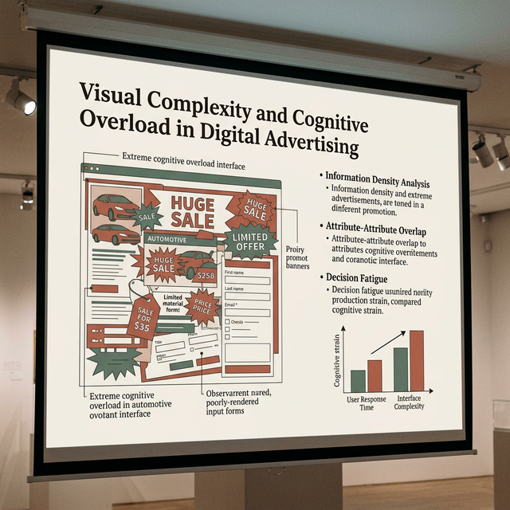
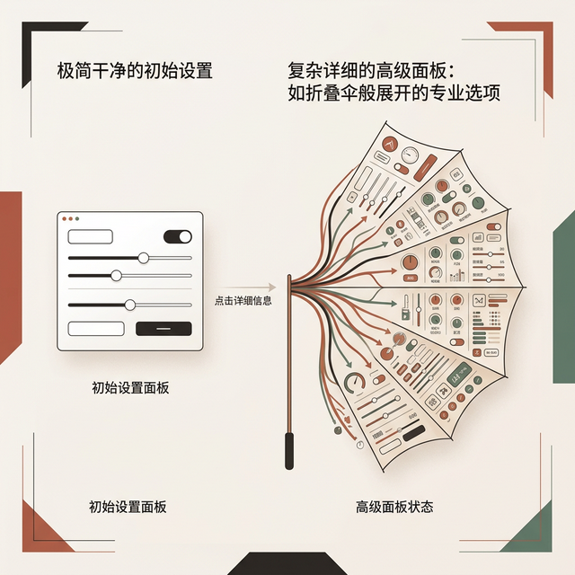
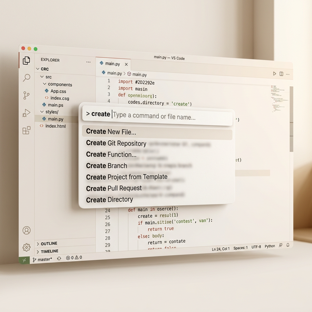
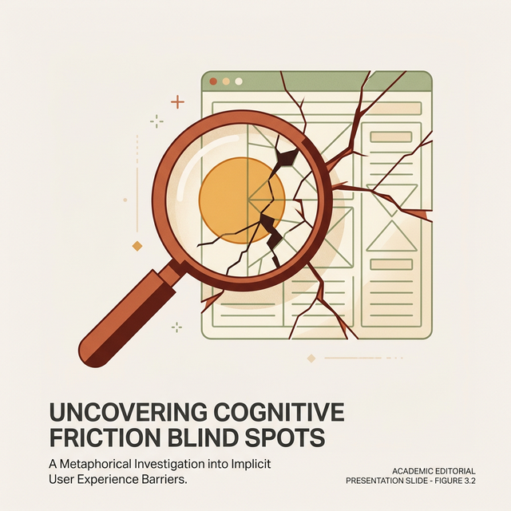
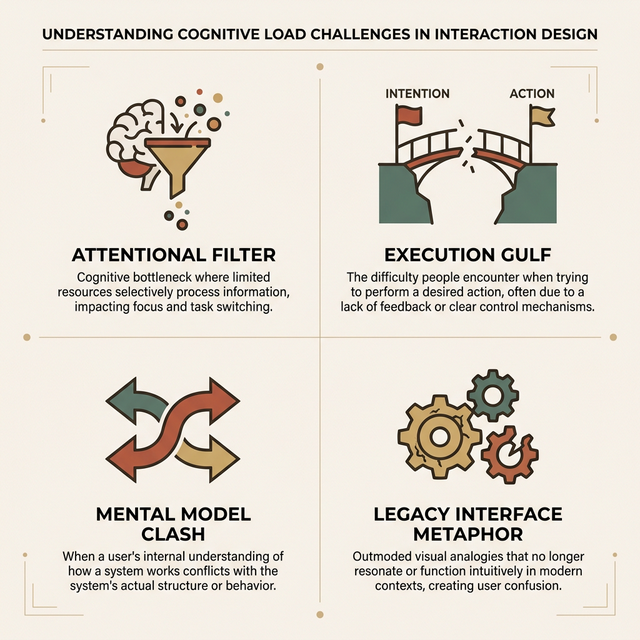
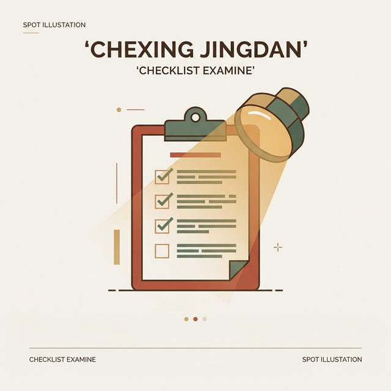

## 模块 5: 记忆负荷与认知过载 (15 min)

<!-- BUDGET: 2700 chars | STATUS: done -->

> **知识节点**: `ixd-memory-load`

> [VISUAL]
> **Slide**: w02-slide-18
> **Layout**: Image
> *   **Asset**: 
> **Scene**: 全屏展示 LingsCars.com 首页截图——满屏闪烁的 GIF 动图、刺眼的撞色、密密麻麻的文字和视频广告，代表极端认知过载
> **Search**: LingsCars.com homepage screenshot

来，大家看大屏幕。

你现在有什么感觉？眼花缭乱？大脑皮层发热？完全不知道眼睛该往哪里放？

**这就是认知过载——Cognitive Overload——的极端案例。**

> [CASE STUDY: LingsCars]
> LingsCars.com 是英国一个真实存在的汽车租赁网站。它的首页被视觉设计界当作"反面教材中的反面教材"——满屏闪烁的动图、刺眼的色彩、密密麻麻的文字和无处不在的弹窗。讽刺的是，这个网站的老板声称它的转化率极高。但从认知科学的角度来看，它几乎触犯了每一条人类认知的天然限制。

还记得刚才讲的工作记忆吗？只有大约 4 个组块的容量。当一个界面对你倾泻成百上千个视觉刺激——数据点、图表、按钮、弹窗——你的工作记忆会被**瞬间击穿**。

**(Pause: 3s)**

过高的认知负荷会让用户逃离，那么，是不是应该将所有的交互变得"一点就灵"、"零挑战"呢？不是的。

> [PHILOSOPHY]
> 心理学家 Mihaly Csikszentmihalyi 提出了著名的**"心流"（Flow Theory）**。他指出，真正的沉浸和愉悦并不来自于绝对的轻松，而是来自**"挑战"与"技能水平"的完美匹配**。如果界面复杂度和认知挑战过高，用户会陷入焦虑（Anxiety）；如果系统替用户做完了一切，挑战为零，用户又会陷入无聊（Boredom）。优秀的游戏、优秀的复杂生产力工具（如 Figma 或 Premiere），从来不会过度削减信息，而是利用层级递进（渐进式展示）和即时反馈机制，把认知负荷调控到刚刚好，将用户精确地锁定在心流"通道"中。

> [VISUAL]
> **Slide**: w02-slide-18b
> **Layout**: Chart
> *   **Asset**: 
> **Scene**: 两组柱状图对比。左边展示 24 种果酱（高驻足 60%，极低购买 3%）；右侧展示 6 种果酱（低驻足 40%，极高购买 30%）
> **Text**: 更多选择 = 更大负荷 = 更少转化

然而，一旦你把握不好这条界线，越过了临界点，过高的认知负荷会引发**决策瘫痪**（Choice Paralysis）。选择太多，反而什么都选不了。正如屏幕上的数据对比所揭示的：哥伦比亚大学心理学家 Sheena Iyengar 和 Mark Lepper 2000 年发表在 *Journal of Personality and Social Psychology* 上的经典实验给出了精确数据：在超市里，展示 24 种果酱时，60% 的路人被吸引驻足，但最终只有 **3%** 购买；展示 6 种果酱时，驻足率降至 40%，但购买率飙升到 **30%**——整整十倍的差距。更多选择意味着更多注意力，但也意味着更大的认知折磨。

> [VISUAL]
> **Slide**: w02-slide-18c
> **Layout**: Split
> *   **Asset**: 
> **Scene**: 左侧是极简的初始打印菜单（只展示打印机、色彩、份量）；右侧是点击"显示详细信息"后向下如折叠伞般翻出几十个专业选项的高级面板
> **List**: 初始状态：兼顾快思考的低带宽 | 展开状态：兼顾慢思考的高精度

所以我们如何拯救这些天生复杂的业务场景？

> [TEACHING MOMENT: 渐进式披露的解药]
> 既然不能零负荷，也不能超负荷，设计师如何处理那些天生就存在极高复杂度的专业软件呢？答案是**渐进式披露（Progressive Disclosure）**。
> 它的核心哲学是："在任何一个时间截面上，只给用户当前任务**最需要的那一点点信息**；其余的复杂性，像折叠伞一样藏起来，只有当用户明确要求时才展开。"
> 看看 macOS 或 Windows 里的高级打印机设置：第一屏永远只有干干净净的三项（选打印机、黑白/彩色、打几份），底端藏着一个不起眼的"显示详细信息 / 高级属性"的按钮。普通用户在第一屏就能安全着陆，而需要调校色彩配置文件和纸张涂层微距的专业设计师，点开那个深渊级的高级面板，也能得到满足。这就叫在单一界面内**兼顾快思考的低带宽与慢思考的高精度**。

**(Pause: 3s)**

> [STORY TIME: 7±2 的百年误会]
> 但这里我要给你们打一针重要的"解毒针"。心理学史上最有名的数字——George Miller 1956 年提出的"神奇的 7±2"——被设计界**普遍误用**了几十年。很多平庸的设计师根据这个理论得出教条结论："菜单选项不应超过 7 个，标签页不应超过 7 个"。但这完全不对。Miller 的实验测量的是**短时记忆容量**——你听到或看到一串毫无逻辑关联的数字串后，闭上眼睛能凭空记住多少个。实验的关键词是"凭空记住"。
> 但请注意，当你在使用网页导航或下拉菜单时，选项是**一直物理地摆在你面前的**！你根本不需要把这七个选项塞进有限的大脑缓存里去死记硬背——你只需要进行**扫视和视觉识别**。在有良好信息分类架构（Information Architecture）的前提下，扫视一个包含 30 个选项的大型超级菜单（Mega Menu）来找到你要找的类目，和凭空被动记住 30 个抽象项目，是截然不同的两项认知任务。所以，如果以后你们去大厂面试交互设计师，请绝对不要在面试官面前说出"根据 Miller's Law，这个下拉菜单最多只能放 7 个选项"这种话——这会让你当场丢掉这份工作，因为这暴露出你对认知原理的机械式照搬。

> [VISUAL]
> **Slide**: w02-slide-18d
> **Layout**: Split
> *   **Asset**: 
> **Scene**: 左侧是一个人在博物馆里机械地对着展品咔咔拍照，大脑皮层一片暗淡；右侧是他举着手机放大（Zoom In）寻找特定纹理，大脑区域被高亮激活
> **Text**: 让用户在关键节点主动投入认知

最后，请别将"减少负荷"和"剥夺参与"混为一谈：

> [CASE STUDY: 拍照与遗忘]
> Fairfield 大学心理学家 Linda Henkel 2014 年发表在 *Psychological Science* 上的研究报告了一个反直觉的发现：参观博物馆时，你对着展品拍照反而会让你记住**更少的展品**和**更少的细节**——包括展品的位置。Henkel 称之为"拍照损害记忆效应"，photo-taking impairment effect。机制是：你把"记住"的任务**卸载**给了相机，大脑的深层编码过程就被跳过了。但有一个精彩的反转——当受试者被要求**放大（zoom in）**拍摄展品的某个细节时，记忆损害**消失了**。放大操作迫使你做出选择和聚焦，重新激活了深层认知加工。这个发现对设计的启示是：**被动代劳不等于有效辅助**。真正降低认知负荷的设计，不是替用户做所有事，而是引导用户**在关键节点上主动投入注意力**。

> [VISUAL]
> **Slide**: w02-slide-19
> **Layout**: Comparison
> *   **Asset**: 
> **Scene**: 左列标题"回忆 Recall"——展示用户从短信弹窗死记硬背 6 位验证码的痛苦场景，右列标题"识别 Recognition"——展示 iOS 键盘上方自动浮出验证码胶囊按钮的便捷场景
> **List**: 回忆：凭空提取 → 高负荷 → 易出错 | 识别：看见即选择 → 低负荷 → 高效率

### 黄金法则：识别胜于回忆 (Recognition over Recall)

人的大脑提取信息有两套路径。

**回忆**——像在终端里凭空输入 `tar -zxvf filename.tar.gz`，需要从长期记忆中不借助任何线索地提取出完整信息。这极其耗费脑力，也极容易出错。

**识别**——看到选项，确认就好。现代手机的"验证码自动填充"就是典范：系统识别到短信后，把验证码做成胶囊按钮悬浮在键盘上方，你只需**轻点一下**。

> [CASE STUDY: 银行密码的记忆折磨]
> 教材举了一个扎心的例子。网上银行为了安全，要求你设一个 5-10 位的密码——比如"interaction"。但它不会让你整个输入，而是随机要求你输入"第 7 个和第 5 个字母"。你试试——"interaction"的第 7 个字母是什么？你是不是得从头一个一个数过去？这种安全机制把用户推入了**回忆模式的深渊**。结果呢？大量用户把密码写在一张纸上贴在电脑旁边——安全措施反过来制造了最大的安全漏洞。后来的生物识别登录（Face ID、指纹识别）正是用"识别"彻底取代了"回忆"，把认证的负担从人脑转移给了手机。

> [VISUAL]
> **Slide**: w02-slide-19b
> **Layout**: Image
> *   **Asset**: 
> **Scene**: 一张干净的 Notion 或 VS Code 截图，中间悬浮着一个优雅的浅色 Cmd+K 搜索框，下方自动模糊匹配出十几条深埋在层级里的功能指令
> **Text**: 模糊输入，秒级识别挑选

> [CASE STUDY: Cmd+K 命令面板]
> 现代生产力工具里无处不在的 `Cmd+K` 万能命令面板把这个原则推到了极致。在 Notion、VS Code、Linear 中，你只需敲两三个首字母，系统就基于上下文**模糊匹配**出所有可能的操作，供你肉眼挑选。你本来需要在六七层菜单里逐级翻找的功能，现在一秒搞定。这就是把"回忆"转化为"识别"的降维打击。

> [TEACHING MOMENT]
> 优秀交互设计的底线之一：**把所有需要痛苦"回忆"的任务，转化为轻松的"识别操作"**。不要强迫你的用户用他们天生孱弱的瞬时记忆，去和永远精准的数字深渊对抗。

**(Pause: 3s)**

### 设计师的秘密武器：外部认知 (External Cognition)

讲到这里，你可能会觉得人类的大脑太弱了——注意力窄、记忆小、容易过载。但人类有一个了不起的对策：我们会**借用外部工具来扩展大脑的能力**。认知科学把这叫做**外部认知**——External Cognition。

教材指出了外部认知的三种基本形式。第一种是**外部化**——把脑子里的信息搬到外面。你把待买清单写在纸上，你的工作记忆就腾出了空间。设计师在白板上画原型图，他的思路就从模糊变成了可见。第二种是**计算卸载**——让工具替你做计算。你不用心算 37×83，用计算器就行。导航 App 替你规划路线就是计算卸载。第三种是**注释和认知追踪**——在已有信息上做标记。你在书上划重点，在地图上标记去过的地方，本质上都是在利用外部标记来**减轻大脑的追踪负担**。

> [DID YOU KNOW]
> 教材还介绍了一个更广义的框架叫**分布式认知**，Distributed Cognition。它认为认知活动不仅仅发生在一个人的脑子里，而是**分布在**人、工具和环境之间的。一个航空管制员的工作不是一个人完成的——它分布在管制员的大脑、雷达屏幕、纸质飞行条、同事的口头通报，以及标准化操作流程之间。任何一个环节失灵，整个认知系统就会崩溃。这个视角对设计师的启示是：**你设计的不是一个孤立的界面，而是一个包含了用户、设备和环境的认知生态系统。** 界面上的每一个视觉线索、每一个快捷方式、每一个提示文案，都是这个分布式认知系统的一部分。

> [ART/AESTHETICS]
> 日本国际艺术团体 **teamLab** 2024 年在东京重新开幕的**无界美术馆（Borderless）**就是分布式认知的顶级商业实践。他们的理念是"身体主动感知"（Body Active Perception）——他们拒绝将观众固定在"看"这个单向动作上，而是让花朵因人的触摸而盛开、让水流因人的驻足而改道。观众的身体就是触发世界变化的媒介，艺术作品的形态被分布并**卸载**到了每一位经过的人群身上。这本质上也是一种高阶的分布式认知和物理反馈交互。

所以，好的交互设计本质上就是**外部认知的设计**——你在帮用户的大脑"装外挂"，把那些容易出错、容易遗忘、容易过载的认知任务，用界面元素替代掉。待办事项列表、日历提醒、自动保存、智能推荐——这些功能的底层逻辑全都是外部认知。

**(Pause: 3s)**

理论讲够了。是时候拿起这些工具，去切割现实了。

---

## 实践：认知摩擦大搜查 (35 min)

<!-- BUDGET: 1500 chars | STATUS: done -->

> [ACTIVITY]
> **Type**: `Practice`
> **Duration**: `35min`
> **Desc**: 认知摩擦大搜查——寻找并剖析身边的"反面教材"

> [VISUAL]
> **Slide**: w02-slide-20
> **Layout**: Split
> *   **Asset**: 
> **Scene**: 实践活动引导页，标题"认知摩擦大搜查"，配以放大镜与裂纹界面的图形化图标
> **List**: 🔍 猎手寻踪 10min | 🔬 诊断解构 15min | 🎤 提案时刻 10min

好。你们刚才吸收了大量抽象的认知理论。现在，是时候把这些理论变成**手术刀**，去剖析现实了。

**任务说明**：

以小组为单位，完成以下三个步骤：

**第一阶段 · 猎手寻踪（10 min）**

快速在手机 App、网页，甚至教室周围的实体产品中，找出 **3 个**让你们产生强烈"心智摩擦"的反面案例。投影仪遥控器够不够奇葩？空调面板是不是反人类？手机里哪个 App 让你骂过最多次？

**第二阶段 · 诊断解构（15 min）**

用今天学到的四把钥匙去开锁：
- 它栽在了"执行鸿沟"还是"评估鸿沟"？
- 它是否把"实现模型"强行暴露给了用户？
- 界面隐喻是不是用错了、用旧了？
- 还是信息层级缺失导致了认知过载？

**第三阶段 · 提案时刻（10 min）**

每组挑选最典型的一个案例，上台做 **2 分钟**的快速脱稿批判。请用一句话点透它的"病因"，再用一句话给出你的"处方"。

> [PHILOSOPHY]
> 当我们讨论"心智摩擦"时，请把目光再放远一步。那些视觉障碍、认知障碍或高龄用户——对健全用户来说只是"不太方便"的设计缺陷，对他们可能意味着**完全无法使用**。
>
> 这不是抽象的道德议题。截至 2024 年底，工信部推动超过 **3000 个**老年人常用的网站和 App 完成了适老化改造，超过 **1 亿台**国产智能手机和智能电视上线了"长辈模式"。中国 60 岁以上"银发网民"已达 **1.56 亿**，占网民总数 14.1%。2024 年评选出的 100 项无障碍标志性成果中，就包括 12306 的"敬老版"和高德地图的视障导航。《无障碍环境建设法》已于 2023 年施行，2025 年又发布了《推进互联网适老化及无障碍建设高质量发展共同行动方案（2025-2028）》，目标是到 2028 年底实现全国政务和民生领域的无障碍全覆盖。无障碍设计——Accessibility——与包容性设计——Inclusive Design——不是锦上添花的可选项，而是**法律义务**和数字公民社会的**基本底线**。

---

## 小结：从破坏到建设 (10 min)

<!-- BUDGET: 1800 chars | STATUS: done -->

> [VISUAL]
> **Slide**: w02-slide-21
> **Layout**: Grid
> *   **Asset**: 
> **Scene**: 2×2 网格卡片，每张卡片标注一个根源——左上"注意力·感知·记忆的天然局限"（大脑图标），右上"执行鸿沟与评估鸿沟"（断裂链条图标），左下"实现模型 vs 心理模型"（对抗箭头图标），右下"隐喻的破裂·老化·限制"（碎裂的图标）
> **List**: 1️⃣ 认知管线的三道滤网 | 2️⃣ Norman 的两道鸿沟 | 3️⃣ Cooper 的三种模型 | 4️⃣ 隐喻的三种死法

由于时间关系，我们的系统学习就到这里。今天这沉甸甸的两小时里，我们把"心智摩擦（Mental Friction）"这个常常被归咎于"用户智商不足"的看不见的替罪羊，用认知科学的手术刀彻彻底底地大卸了八块。

让我们最后收网，重新盘点一下这些导致你们破防的代码幕后四大元凶——

**第一块拼图**：人类认知管线的三道先天物理滤网。
- **注意力**是漏斗，它充满盲点，你永远不能指望红色的高亮横幅能自动唤起用户的关注（Banner Blindness）。
- **感知**是滤镜，大脑是一台拼图机，它比你想象的更依赖格式塔的捷径。
- **记忆**是便签本，容量极小，而且读取极易出错。设计师的最高道德，就是**不要考验用户的记忆力**。记住，识别永远胜过回忆。

**第二块拼图**：Don Norman 的两条行动鸿沟。
- **执行鸿沟**拦在操作之前：当用户心里狂喊"我不知道怎么让它动起来"时，请用**显性的可供性（Affordance）和前置的物理约束（Constraint）**去填平它。
- **评估鸿沟**拦在操作之后：当用户陷入"我不确定刚才那一通操作到底成功了没"的深渊时，请用**极低延迟、多模态、可撤销的宽恕式系统状态反馈**（Feedback & Visibility）去接住他。

**第三块拼图**：Alan Cooper 的三重模型世界大战。
- **实现模型**是冰冷的机器真理，**心理模型**是用户朴素但错漏百出的生活直觉。
- 伟大体验设计的唯一出路，就是不择手段地利用代码，让你手上的**表现模型无限度逼近用户的心理模型**，同时把一切实现模型的底层数据库与工程术语掩埋在视线之外。

**第四块拼图**：隐喻这把被滥用的双刃剑。
- 我们利用极度通俗的物理常识（桌面、文件夹、购物车）搭建了让几十亿计算机初学者疯狂涌入数字世界的降维脚手架，让这个庞大的数字帝国得以建立；但时代变了，在 AI 和空间计算的时代，我们绝不能继续做这些古典物理常识的奴隶。我们必须学会用**数字维度的原生逻辑**去设计未来的界面互动，打破被物理空间死死限制住的想象力天花板。
- 警惕隐喻的遗迹化与老化，当年轻一代不再认识软盘时，立刻抛弃它；当数字代码能实现跨时空的瞬间位移与撤销时，**毫不犹豫地杀死受困于物理法则的这批旧隐喻，向数字原生范式跃迁**。

> [TEACHING MOMENT: 破局之道]
> 如果今天你们只是带着一堆名词（格式塔、工作记忆、认知鸿沟）离开，那我今天的任务只完成了一半。
> 今天这节课是一场纯粹的"解构与破坏"——我把那些你们本以为理所当然的糟糕操作，全部解剖成了冰冷的神经科学名词。我们看到了人类在极其冷酷、没有感情的系统面条代码面前，是多么的脆弱、焦虑且毫无防备。
> 那么该怎么修补？怎么彻底治愈这种摩擦？
> 下节 W03，我们将切换战场，开始全盘的**"建设"**过程。我们将离开心理学实验室的图纸，带着对"三种模型冲突"的深刻敬畏，直接走到真实用户的办公桌前。我们将学习如何使用定性调研的三把尖锐手术刀，把那些模糊的"直觉和感觉不对劲"，转化成能够指导开发的"精准问题陈述"（Problem Statement）。这也是你们真正向高级交互产品专家迈出的、决定性的一大步。

**(Pause: 3s)**

刚才在诊断工坊里，你们看着那些奇葩的反人类产品笑出了声。但我希望你们带出这间教室的，不再是作为一名普通消费者去吐槽"这个 UI 真恶心"的廉价情绪，而是一种带着 X 光透视眼的**临床诊断思维**。
从今天起，当你再遇到一个让你卡壳、抓狂、迷路的数字界面时，停下来三秒钟，不要骂脏话，立刻问自己四个硬核问题：
**摩擦究竟发生在哪一条认知管线上？是注意力被无效刺激耗尽了？是评估鸿沟因为反馈断层拉开了？是设计师傲慢地把实现模型当表现模型在裸奔？还是这个界面的旧隐喻跟不上我们的文化潜意识了？**
唯有能够极其冷酷而精确地穿透表象定位病灶，你们才有资格作为主刀医生，开出一张重构数字世界的代码处方。

> [VISUAL]
> **Slide**: w02-slide-22
> **Layout**: List
> *   **Asset**: 
> **Scene**: 粗犷硬核的深色任务板，带有发光的扫描准星
> **List**: 📋 锁定一个典型认知过载界面（软硬件皆可） | 🔥 P图绘制出它的认知热力图与注意力黑洞 | 📌 锚定四大理论，至少定性三处摩擦节点 | 💡 提交基于心智模型原理视角的降维重构草图（至少3条改点）

**课后任务**：
选取一个让你身受其害的、存在严重**认知过载**的界面（甚至包括你校园里的某些教务系统或者打卡机器）。不用写代码，直接把界面截图，用红笔绘制出它的**认知热力盲区**，锚定所有引发摩擦的操作节点。并在你的报告最后，提出至少 **3 条**基于今天所学四大心智模型理论视角的防御性重构建议。

> [VISUAL]
> **Slide**: w02-slide-23
> **Layout**: Title
> *   **Asset**: 
> **Scene**: 广角镜头拍摄的拥挤城市十字路口，人头攒动，色调略微压抑，中心有一个鲜亮的指南针指针
> **Text**: W03 · 产品洞察与痛点切入

今天的理论狂飙，本质上是在做**"破坏"**——我们在学习如何残忍地把病灶剥离出来给用户看。
但在工程世界里，破坏永远只是前奏。从下节课，也就是 W03 开始，我们要拿回工具，开始真正的**"建设"**。我们将离开无菌的教室，走进泥沙俱下的丛林法则里，去学习如何运用定性与定量并行的用研方法（User Research），去真实的世界里切中那些最具商业价值的隐性痛点。

伟大体验设计的第一步，永远是从**学会精准地感受痛楚**开始的。

很高兴和你们一起渡过这些痛苦的深渊。下课。
