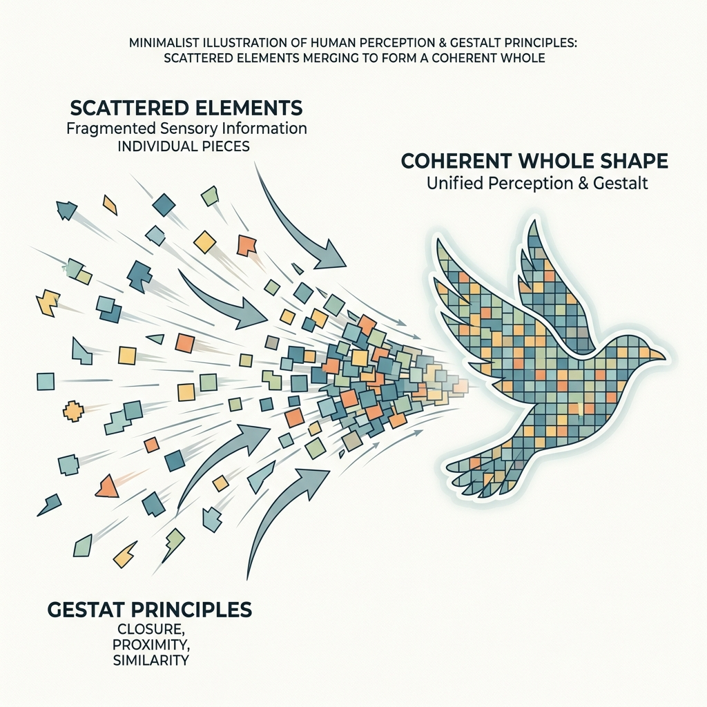
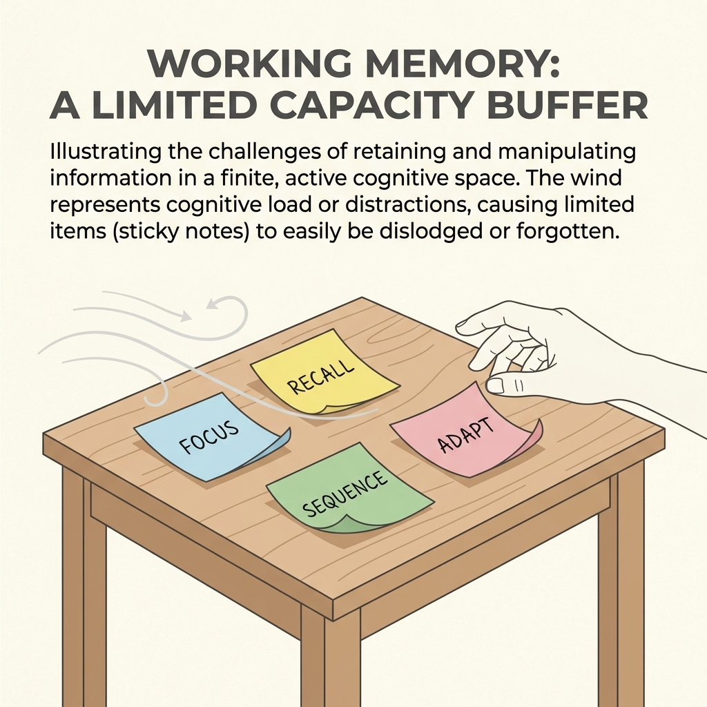
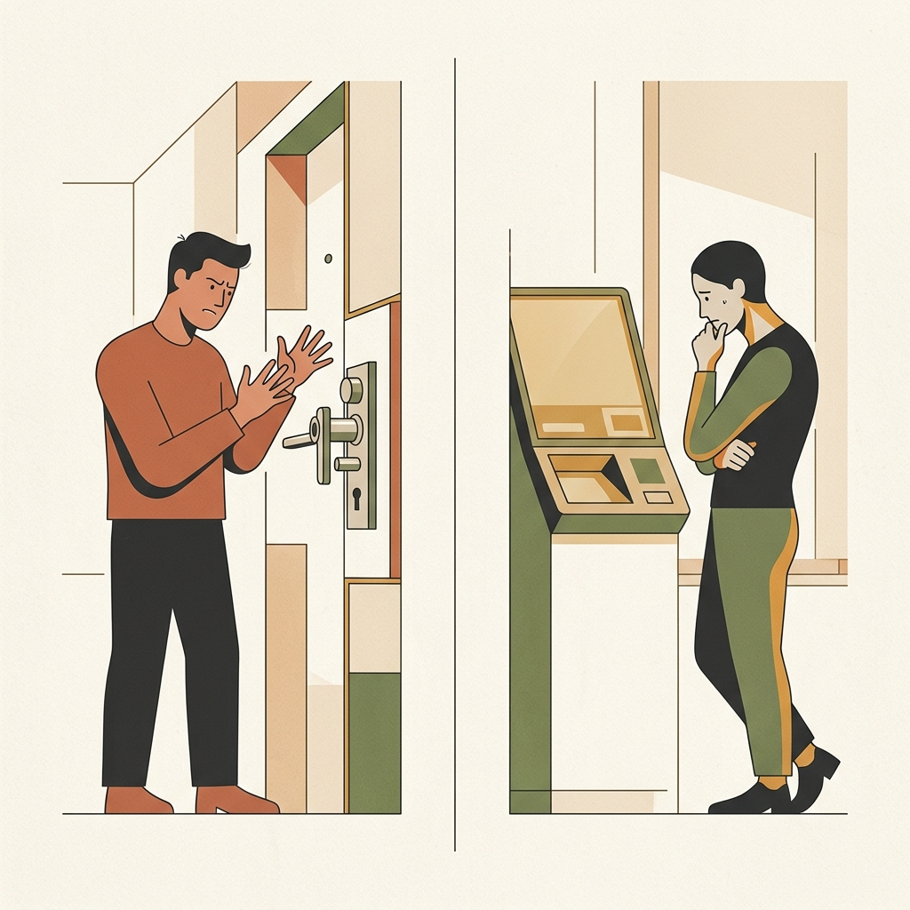
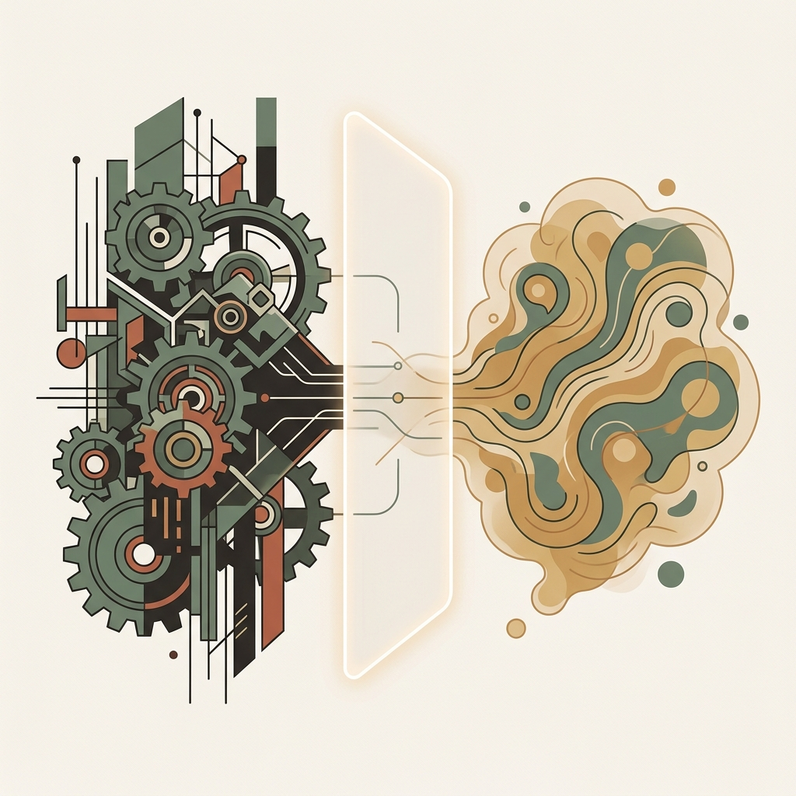
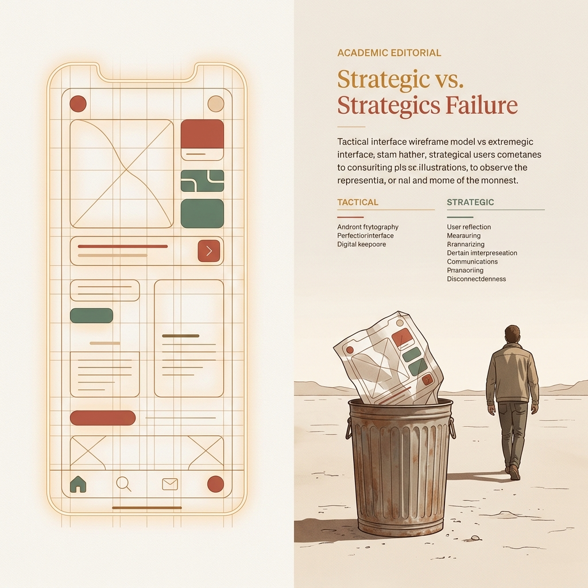
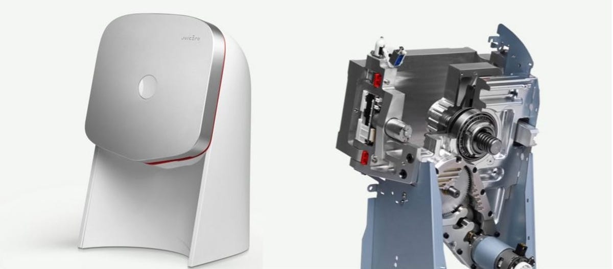
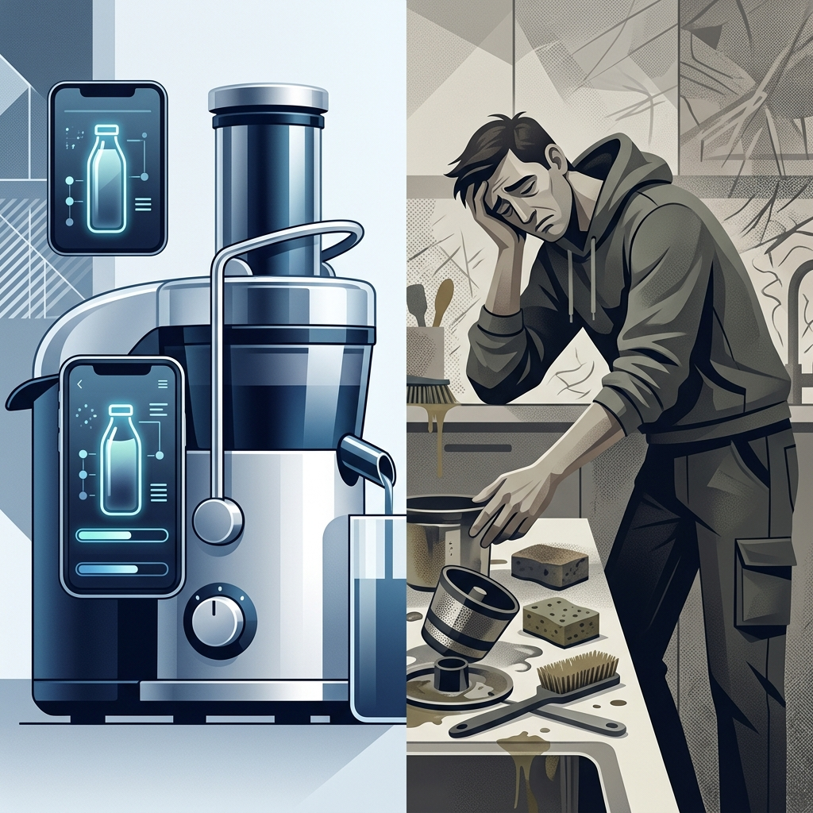
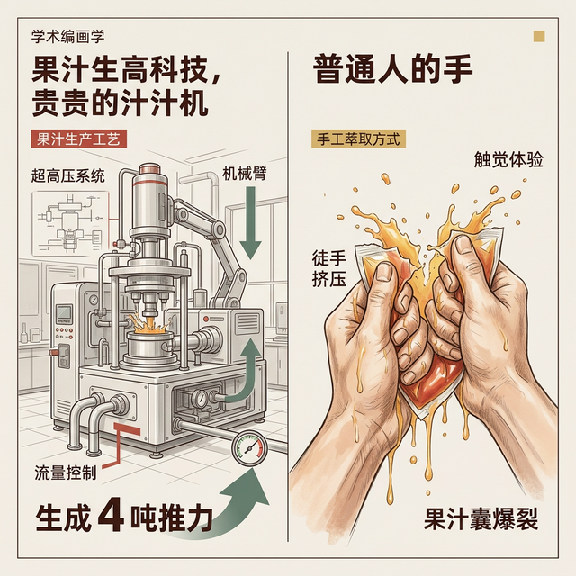
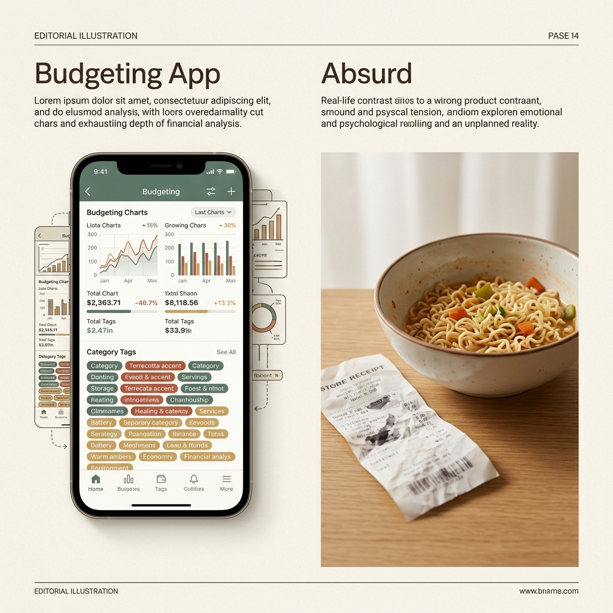

## 模块 1: 复习——从认知摩擦到商业洞察 (10 min)

<!-- BUDGET: 1800 chars | SLIDES: ≥4 | STATUS: done -->

### 1.1 体验裂痕：生理极限与机器逻辑的必然冲突

> [VISUAL]
> **Slide**: w03-slide-01
> **Layout**: `Center`
> *   **Asset**: 
> **Scene**: 巨大的黑底白字标题页，背景是模糊的焦躁人群与代码瀑布流交错（暗示混沌的真实需求与冰冷的机器逻辑）
> **Heading**: W03 课程开场
> **Text**: 产品洞察与痛点切入

欢迎回来各位。上周，我们做了一次对人类大脑非常冷酷的"暴力拆解"。

我们定义了一个贯穿整个职业生涯的词：**心智摩擦**（Mental Friction）。我们说，那不是因为代码写得不够优雅，那是由于人类五十万年进化而来的湿件系统（我们的大脑），硬生生地撞上了只有短短几十年历史的硅基逻辑。

**(Pause: 3s)**

> [VISUAL]
> **Slide**: w03-slide-02
> **Layout**: Grid
> *   **Asset 1**: 
> *   **Asset 2**: 
> *   **Asset 3**: 
> **Scene**: W02 核心概念回忆网格图，分别呈现代表注意力的狭窄手电筒、代表感知的主观拼图（格式塔）、以及代表工作记忆的便签纸小桌子。
> **Text**: 大脑的三道滤网
> **List**: 1️⃣ 注意力 (黑夜手电筒) | 2️⃣ 感知 (主观拼图引擎) | 3️⃣ 工作记忆 (便签纸与风)

我们快速把你们脑海里的短时缓存刷新一下。

我们探秘了大脑的三道滤网。还记得那个在人群中捶胸顿足，却没被将近一半人看见的大猩猩吗？那是第一道滤网——**注意力**（Attention）。它不是太阳，它是黑夜里一束非常狭窄的手电筒，照不到的地方都是绝对的黑暗。第二道是**感知**（Perception）——这是个疯狂的主观拼图引擎，格式塔法则让它痴迷于把零散的像素点强行脑补成有意义的整体，即使原本毫无意义。第三道，也是我们交互设计中最容易发生致命缓冲区溢出的——**工作记忆**（Working Memory）。它就像一张只能贴四张便签纸的小桌子，而且还有风在吹。塞满四张纸，再来新的信息，系统就会在你的脑子里无声地死机。

> [VISUAL]
> **Slide**: w03-slide-02b
> **Layout**: Comparison
> *   **Asset**: 
> **Scene**: 左侧是不知道怎么拉门的愤怒用户（执行鸿沟），右侧是按了付款按钮屏幕没反应的焦虑用户（评估鸿沟）
> **Text**: 两道致命裂缝：执行与评估鸿沟
> **List**: 执行鸿沟 (Gulf of Execution): 不知如何行动 | 评估鸿沟 (Gulf of Evaluation): 不知系统状态

然后，我们在人与机器的交互循环里，画了两道致命的裂缝。一条是在你想干事，却不知道该按哪里、或者门是该推还是该拉时产生的**执行鸿沟**（Gulf of Execution）。另一条，是你战战兢兢按下了按钮，屏幕却静若死水，你不知道钱到底扣没扣的**评估鸿沟**（Gulf of Evaluation）。

> [VISUAL]
> **Slide**: w03-slide-02c
> **Layout**: Image
> *   **Asset**: 
> **Scene**: 左侧是复杂的实现模型（数据库与齿轮），右侧是直觉的心理模型，中间是以薄薄发光屏幕作为桥梁的表现模型。
> **Text**: 三种模型的战争
> **List**: 实现模型 (复杂现实) | 表现模型 (桥梁) | 心理模型 (人类直觉)

最后，我们揭露了这一切惨剧的幕后主使：**三种模型的战争**。

*   **实现模型**（机器现实）：代码与数据库运作的底层技术逻辑。
*   **心理模型**（人类直觉）：用户基于日常经验，“想当然”的认知惯性。
*   **表现模型**（隐喻桥梁）：设计师构建的界面，用来伪装机器现实，迎合用户直觉。

**学透这三层模型，我们最大的收获是什么？**
我们拿到了**“把复杂技术转化为优雅体验”的底层密码**。
好用的本质不是“简单”，而是“符合预期”。只要你强迫自己屏蔽机器的技术束缚，让**表现模型无限贴近用户的心理模型**，就能打造出免学习、低客诉的产品。隐藏复杂性本身，就是最高级的商业壁垒。

来，我们用一道测试题，检验一下大家对这套“北极星指标”的诊断能力。

> [ACTIVITY]
> *   **Type**: `Quiz`
> *   **Duration**: `2min`
> *   **Desc**: 诊断基准：认知摩擦的病灶定位
> *   **Q**: 当产品被吐槽“非常难用”，用户在界面上频繁感到困惑时，按照《About Face》的三种模型理论，此时系统的状态通常是什么？
> *   **Options**: A. 表现模型完全匹配了用户的心理模型 | B. 表现模型向实现模型发生了坍缩，偏离了心理模型 | C. 心理模型比表现模型更复杂，导致用户过度思考 | D. 用户缺乏对实现模型的理解能力，需要增加说明书
> *   **Answer**: `B`
> *   **Explain**: 难用的根源在于系统将“实现模型”直接赤裸裸地暴露给了用户（坍缩）。当表现模型（界面）偏离了用户直觉（心理模型），而屈服于底层技术逻辑（实现模型）时，认知摩擦就会爆发。交互设计师的价值，就是做挡在人与机器之间那道坚不可摧的“翻译官”与“防波堤”。

> [VISUAL]
> **Slide**: w03-slide-03
> **Layout**: Split
> *   **Asset**: 
> **Scene**: 左侧是一位设计师正对着电脑疯狂调整界面圆角和阴影（追求正确地建造）；右侧是满仓库积灰的、设计精美却没人买的神奇产品（建造了错误的东西）
> **Text**: Build right vs Build the right thing
> **List**: 正确地建造产品 (Build the product right) | 建造正确的产品 (Build the right product)

好，上周我们算是拿到了一打怎么抹平界面摩擦的战术武器。大家都踌躇满志，准备大干一场。但今天，在这个关键的时间节点上，我要给你们浇一盆透心凉的冰水。我要推翻一个你们潜意识里非常危险的假设。

### 1.2 南辕北辙：完美的交互无法拯救虚假的需求

在这门课的前两周，包括你们在其他诸如 Web 开发、软件工程课里学到的所有东西，其实都在回答同一个技术问题：**"如何把一件东西设计好？"** 界面要符合格式塔原则、防错机制要做足、动效反馈要卡在微秒级的即时响应。这叫做**正确地建造产品（Build the product right）**。

但是，请你停下来想想。

如果那个你拼命想做好的"东西"本身，根本就不是用户想要的呢？如果在长达半年暗无天日的开发周期里，你们把界面的圆角打磨到了极致的像素级对齐，把所有的下拉菜单动画微调到了 60 帧的苹果级丝滑，最后满怀信心地把产品端给市场的时候——用户只是冷漠地看了一眼，扔下一句"这玩意有啥用"，然后转身走开呢？

> [VISUAL]
> **Slide**: w03-slide-04
> **Layout**: `Full`
> *   **Asset**: 
> **Scene**: 左侧是一台造型极具未来感、充满硅谷设计哲学的白色机器（Juicero 智能榨汁机），右侧是一双手直接粗暴地捏扁了机器专属的能量果汁包，榨出的汁水一样多
> **Text**: 完美执行的伪需求

这不是耸人听闻，而是互联网创业中最典型的失败路径。你设计了一把体验非常顺滑、符合所有人机工程学规则的昂贵冰梳子，但你悲哀地发现，你的目标用户是个根本不长头发的和尚。这种现象在学术界有个专业名词，叫**产品-市场错配（Product-Market Misfit）**——它是创业公司的头号死因。

你们以为这种低级错误只有菜鸟会犯？来，让你们见识一下硅谷同行的**四吨推力谎言**。

> [VISUAL]
> **Slide**: w03-slide-04a
> **Layout**: Center
> *   **Asset**: 
> **Scene**: 展示 Juicero 精致的外观设计和内部复杂的 4 吨推力机械结构
> **Text**: 战术上的完美设计：极致工程与伪需求的结合

> [CASE STUDY: Juicero —— 估值上亿的智商税陷阱]
> 2013 年，有一家叫 Juicero 的旧金山创业公司横空出世，他们凭着几张精美的产品图和宏大的愿景，拿下了包括 Google Ventures (谷歌风投) 在内的高达 1.2 亿美元的巨额融资。他们的王牌产品是一台对准中产阶级的"智能榨汁机"。
>
> [VISUAL]
> **Slide**: w03-slide-04_juicero_hardware
> **Layout**: Center
> **Scene**: Juicero 机器的内部结构透视图，重点高亮那个产生 4 吨推力的定制电机
> **Text**: 极致的工业垃圾：完美解决了一个根本不存在的痛点
>
> 仅从"正确建造产品"的战术角度看，这台机器堪称工业与交互设计的标杆：前苹果核心设计师操刀的极简铝合金外壳、单按钮优雅交互、带波浪动效的联网 App，甚至内置了一个能产生 4 吨推力的定制电机。科技美学、顶级交互、智能硬件，要素全部拉满。
> 
> 创始团队给资本讲的故事非常动听：现代城市人渴望喝新鲜健康的果汁，但他们深恶痛绝洗切蔬菜的繁琐，更对榨完汁后清洗满是果渣的榨汁机感到绝望。这个痛点存在吗？确实存在。于是 Juicero 的解决方案是：卖非常昂贵的、在工厂里已经被预处理并装在密闭防震袋子里的果蔬包。用户只要把它丢进这台 700 美元的高科技机器里，按下一个灯光迷人的按钮，机器就用 4 吨的重力直接压榨出新鲜果汁。完美，一滴水都不用洗。
> 
> [VISUAL]
> **Slide**: w03-slide-04_juicero_pitch
> **Layout**: Split
> *   **Asset**: 
> **Scene**: 左侧是极简高科技的 Juicero 机器和波浪动效 App 界面，右侧是极度讨厌清洗榨汁机的城市白领
> **Text**: 完美的执行：用最顶级的科技美学包装伪需求
> 
> [VISUAL]
> **Slide**: w03-slide-04b
> **Layout**: Video
> *   **Asset**: 
> **Scene**: 左侧是非常高科技、产生四吨推力的昂贵榨汁机，右侧是一双普通人的双手徒手捏爆了果汁袋
> **Text**: 两分钟短视频戳破一亿美元的估值神话
> **Source**: Video — Bloomberg Reporter Squeezes Juicero Bag Barehanded
> **Duration**: 44s
> **TimeCategory**: activity
> 
> 然而，泡沫在 2017 年破裂了。彭博社记者发了一条不到两分钟的短视频：他拿起那个 8 美元一袋的预切果蔬包，**没有把它放进机器，而是直接用双手用力挤压袋子本身**。结果一个成年人徒手在 90 秒内就挤出了满满一杯果汁，出汁量甚至比机器压得还要快。
> 
> 舆论哗然。Juicero 团队观察到了"人们讨厌清洗榨汁机"的表面行为，并耗费四年把机器的操作反馈和视觉一致性做到了满分，却弄错了底层的真实痛点。
> 用户的根本需求是"免清洗地喝到果汁"，而这个问题的终极解法实际上就是那袋预切好的**水果包装袋**！绝对**不是**一台提供冗余压力的昂贵硬件。在真实的商业逻辑面前，完美的交互设计也无法挽救虚假的产品需求。

好，我们趁热打铁，用一个最容易踩坑的案例来测试一下大家对这个概念的肌肉反应。

> [ACTIVITY]
> *   **Type**: `Quiz`
> *   **Duration**: `2min`
> *   **Desc**: 案例诊断：正确建造 vs 建造正确
> *   **Q**: 某初创团队花费半年时间，为一款售价上千元的“智能蓝牙冰梳子”打磨了极致丝滑的 App 交互界面，但上市后无人问津。根据产品-市场错配理论，他们犯了什么核心错误？
> *   **Options**: A. 表现模型与实现模型产生冲突 | B. 成功地“正确建造了产品”，但没有“建造正确的产品” | C. App 的交互体验没有完全消除执行鸿沟 | D. 没有在研发前进行大规模焦点小组问卷发放
> *   **Answer**: `B`
> *   **Explain**: 团队把精力耗费在“正确地建造产品”（战术上的交互打磨），却忽略了“建造正确的产品”（目标受众——例如和尚——根本不存在购买梳子的真实需求）。完美的交互无法拯救虚假的底层需求。

**(Pause: 3s)**

> [VISUAL]
> **Slide**: w03-slide-04_budget_app
> **Layout**: Split
> *   **Asset**: 
> **RenderMode**: themed
> **Scene**: [Emotional/Psychological Tension: overwhelming, exhausting] 左侧是一个极其复杂、布满一百多个彩色标签和精美折线图的智能手机记账界面；右侧是一个极其简陋的真实生活场景：一碗吃剩的拉面和一张揉皱的 15 元收据。两者形成强烈的荒诞对比。
> **Keywords**: smartphone showing complex UI, leftover ramen, crumpled receipt
> **Heading**: 战术精致 vs 战略懒惰
> **Text**: 完美交互无法战胜人类追求低能耗的生理本能

> [LIFE CONNECT]
> 看看你们手机里那些长满杂草、放在隐蔽文件夹里的 App 吧。比如那些你下载完只用过可怜的一两次的网红记账软件。它的过场动画可能比你的 iOS 原生界面还要惊艳，它的支出图表颜色搭配绝美，分类标签多达一百二十种。但它真的解决你"攒不下钱"的痛点了吗？你的核心痛点根本不是"我找不到一个能分出一百种花销账目的优美软件"，你真实的痛点是"每次吃完一碗 15 块钱的面条，都要像机器人一样掏出手机手动记录数字"——这件事本身**非常违反人类追求低能耗的生理本能**。当一个工具产品的设计团队没有看透这背后的天然阻力，没有试图去打通银行卡接口实现无感自动记账，而是一味地在那徒劳无功地死磕"选择餐饮类别的流畅滑动体验"时，这帮人就注定要在这个红海市场里被前浪淹死。

> [VISUAL]
> **Slide**: w03-slide-04c
> **Layout**: Title
> *   **Asset**: 
> **Scene**: 黑色背景，白色大字警示语
> **Text**: 缺乏真实洞察，完美的交互只是在沉船前摆放躺椅

> [TEACHING MOMENT]
> 在往届的设计答辩中，常有同学展示了上百张精美的高保真原型，却被评委几个问题问倒："**用户现有的替代方案有什么缺陷？他为什么必须用你的产品？**" 如果无法回答这个问题，再精美的设计也会瞬间失去说服力。
> 
> 在这门课里，我们不仅要教你如何设计符合心智模型的界面，更要教你如何通过客观的调研锁定真实的痛点。
> 因为，缺乏真实洞察的完美交互努力，就像是在泰坦尼克号沉没前的五分钟，非常投入且极具工匠精神地——将甲板上的躺椅摆得整整齐齐。

这，就是我们进入第三周核心内容的原因。我们要学会**逆向拆分用户的谎言与真相**。欢迎来到这场关于洞察的猎杀。
