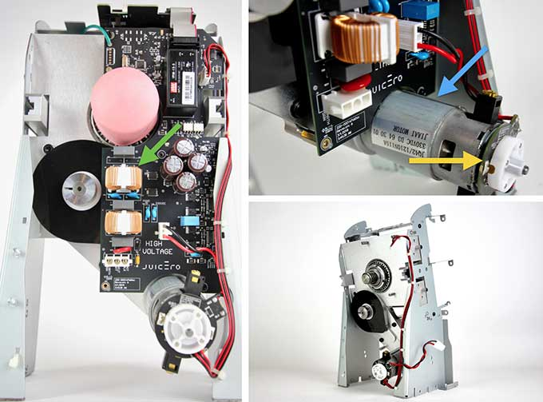
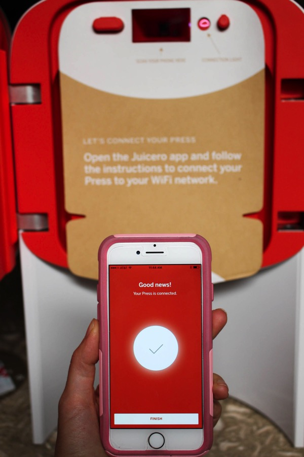
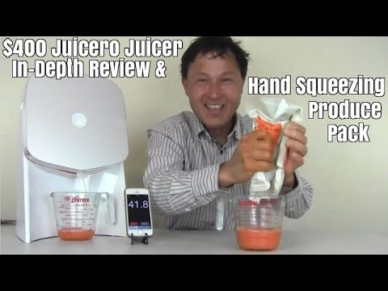
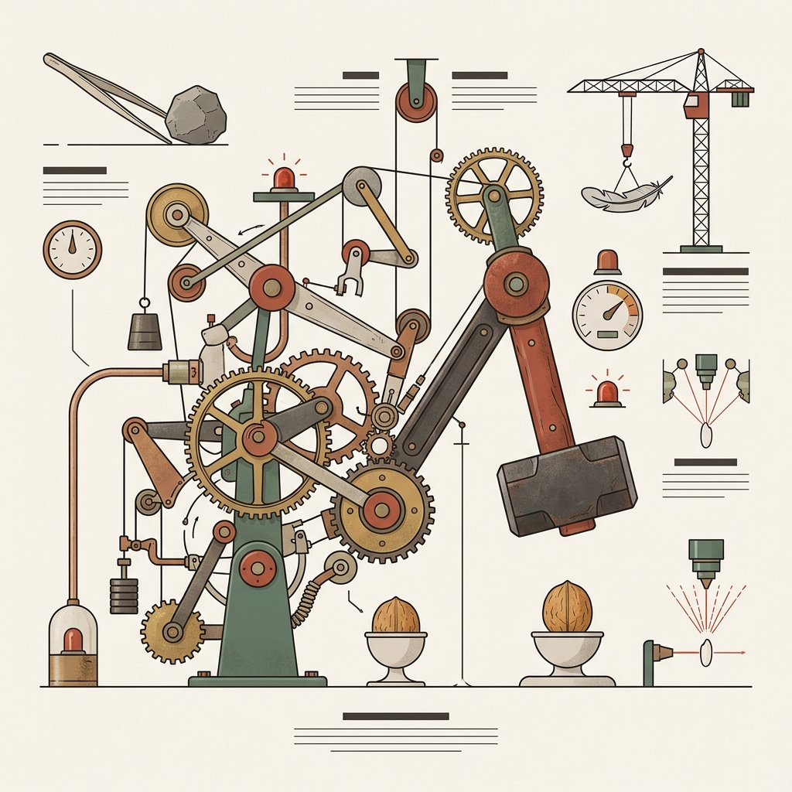
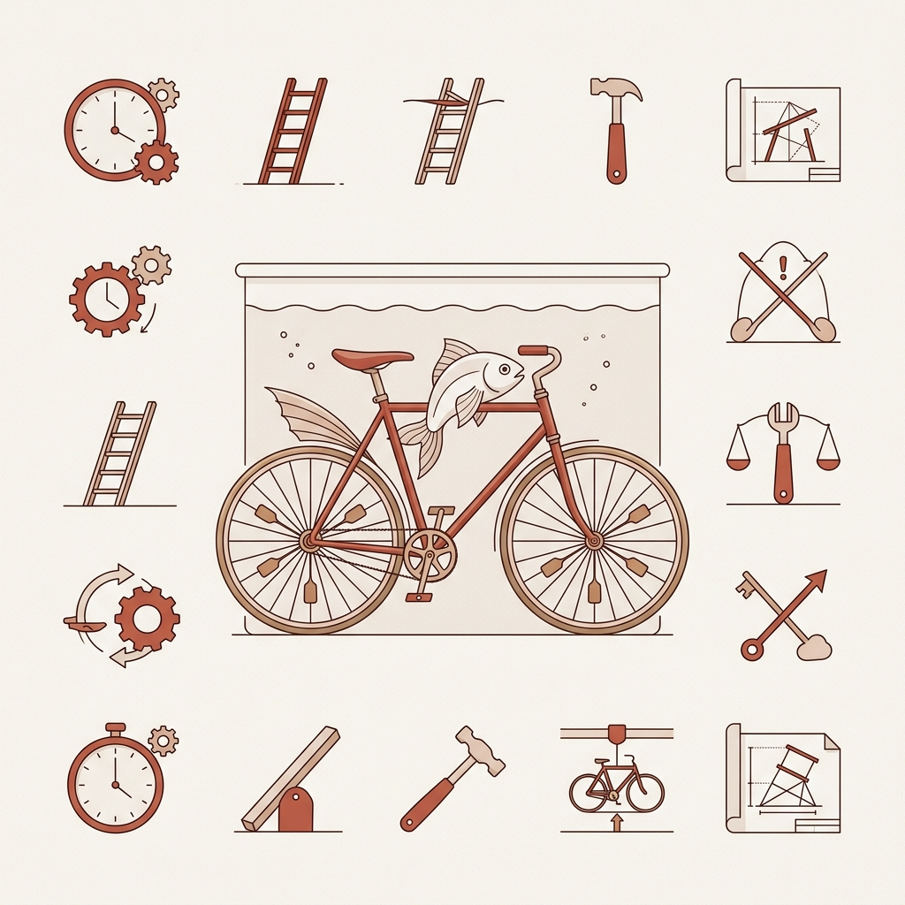

## 模块 1: 复习——从认知摩擦到商业洞察 (10 min)

<!-- BUDGET: 1800 chars | SLIDES: ≥4 | STATUS: done -->

### 1.1 体验裂痕：生理极限与机器逻辑的必然冲突

> [VISUAL]
> **Slide**: w03-slide-01
> **Layout**: Comparison
> **RenderMode**: themed
> **Asset**: 
> **Scene**: [High contrast tension, overwhelming] 左侧代表历经五十万年进化的原始人类大脑认知模型，包含如粗糙的石器、自然的纹理或原始洞穴的隐喻元素；右侧代表仅数十年历史的精密硅基技术逻辑，展现如冰冷的电路、纯净的几何代码晶体等元素。两者在中间产生强烈的视觉断层与摩擦裂痕。
> **Keywords**: prehistoric stone tools, primitive cave texture, glowing silicon circuit board, geometric code crystals, mental friction gap
> **Heading**: W03 课程开场
> **Text**: 心智摩擦：进化的认知 vs 技术的演进
> **List**: 认知体系 (五十万年进化) | 机器逻辑 (数十年历史)

欢迎回来各位。上周，我们做了一次对人类大脑非常冷酷的"暴力拆解"。

我们引入了“心智摩擦”（Mental Friction）这一概念，指的是用户在使用产品时，由于大脑的进化历程（约五十万年）形成的认知体系，与仅数十年历史的硅基技术之间的冲突所导致的体验不顺畅。并非代码不够优雅，而是人类的自然认知模型与快速迭代的技术实现之间产生了摩擦。例如，用户在面对复杂的设置界面时，需要记忆多层级选项，这种认知负荷就会产生心智摩擦。

**(Pause: 3s)**

> [VISUAL]
> **Slide**: w03-slide-02
> **Layout**: Grid
> **Asset 1**: 
> **Asset 2**: 
> **Asset 3**: 
> **Scene**: W02 核心概念回忆网格图，分别呈现代表注意力的狭窄手电筒、代表感知的主观拼图（格式塔）、以及代表工作记忆的便签纸小桌子。
> **Text**: 大脑的三道滤网
> **List**: 1️⃣ 注意力 (黑夜手电筒) | 2️⃣ 感知 (主观拼图引擎) | 3️⃣ 工作记忆 (便签纸与风)

我们快速把你们脑海里的短时缓存刷新一下。

我们探秘了大脑的三道滤网。还记得那个在人群中捶胸顿足，却没被将近一半人看见的大猩猩吗？那是第一道滤网——**注意力**（Attention）。它不是太阳，它是黑夜里一束非常狭窄的手电筒，照不到的地方都是绝对的黑暗。
第二道是**感知**（Perception）——这是个疯狂的主观拼图引擎，格式塔法则让它痴迷于把零散的像素点强行脑补成有意义的整体，即使原本毫无意义。
第三道，也是我们交互设计中最容易发生致命缓冲区溢出的——**工作记忆**（Working Memory）。它就像一张只能贴四张便签纸的小桌子，而且还有风在吹。塞满四张纸，再来新的信息，系统就会在你的脑子里无声地死机。

> [VISUAL]
> **Slide**: w03-slide-02b
> **Layout**: Comparison
> **Asset**: 
> **Scene**: 左侧是不知道怎么拉门的愤怒用户（执行鸿沟），右侧是按了付款按钮屏幕没反应的焦虑用户（评估鸿沟）
> **Text**: 两道致命裂缝：执行与评估鸿沟
> **List**: 执行鸿沟 (Gulf of Execution): 不知如何行动 | 评估鸿沟 (Gulf of Evaluation): 不知系统状态

除了三大认知滤网的内在限制，当这套生理系统尝试与外部机器对话时，还会产生两道致命的交互裂缝。
一条是在你想干事，却不知道该按哪里、或者门是该推还是该拉时产生的**执行鸿沟**（Gulf of Execution）。
另一条，是你战战兢兢按下了按钮，屏幕却静若死水，你不知道钱到底扣没扣的**评估鸿沟**（Gulf of Evaluation）。

> [VISUAL]
> **Slide**: w03-slide-02c
> **Layout**: Image
> **Asset**: 
> **Scene**: 左侧是复杂的实现模型（数据库与齿轮），右侧是直觉的心理模型，中间是以薄薄发光屏幕作为桥梁的表现模型。
> **Text**: 三种模型的战争
> **List**: 实现模型 (复杂现实) | 表现模型 (桥梁) | 心理模型 (人类直觉)

最后，我们揭露了这一切惨剧的幕后主使：**三种模型的战争**。

*   **实现模型**（机器现实）：代码与数据库运作的底层技术逻辑。
*   **心理模型**（人类直觉）：用户基于日常经验，“想当然”的认知惯性。
*   **表现模型**（隐喻桥梁）：设计师构建的界面，用来伪装机器现实，迎合用户直觉。

**学透这三层模型，我们最大的收获是什么？**
我们拿到了**“把复杂技术转化为优雅体验”的底层密码**。
好用的本质不是“简单”，而是“符合预期”。只要你强迫自己屏蔽机器的技术束缚，让**表现模型无限贴近用户的心理模型**，就能打造出免学习、低客诉的产品。隐藏复杂性本身，就是最高级的商业壁垒。

> [ACTIVITY]
> **Type**: `Quiz`
> **Duration**: `2min`
> **Desc**: 诊断基准：认知摩擦的病灶定位
> **Q**: 当产品被吐槽“非常难用”，用户在界面上频繁感到困惑时，按照《About Face》的三种模型理论，此时系统的状态通常是什么？
> **Options**: A. 表现模型完全匹配了用户的心理模型 | B. 表现模型向实现模型发生了坍缩，偏离了心理模型 | C. 心理模型比表现模型更复杂，导致用户过度思考 | D. 用户缺乏对实现模型的理解能力，需要增加说明书
> **Answer**: `B`
> **Explain**: 难用的根源在于系统将“实现模型”直接赤裸裸地暴露给了用户（坍缩）。当表现模型（界面）偏离了用户直觉（心理模型），而屈服于底层技术逻辑（实现模型）时，认知摩擦就会爆发。交互设计师的价值，就是充当机器与人之间的翻译官，通过对齐实现模型、表现模型和心理模型，帮助降低心智摩擦。

上周我们掌握了抹平界面摩擦的战术武器。这套战术非常重要，它是你吃饭的手艺。但所有战术都有一个隐含的前提——你必须先确认自己在解决一个**真正存在的问题**。如果这个前提是假的，后面所有精致的打磨都只是在美化一个没人需要的东西。今天，我要推翻一个极其危险的潜意识假设。

### 1.2 战术精致 vs 战略正确

> [VISUAL]
> **Slide**: w03-slide-03
> **Layout**: Split
> **RenderMode**: pedagogical
> **Asset**: 
> **Scene**: [Contrast, Irony] 左侧是数字界面圆角的极致放大，标有精密的像素网格和工程测量线（严格呼应“界面圆角打磨到像素级对齐”的战术精致）；右侧是这个精密的 UI 线框被直接丢进了一个简单的线框垃圾桶（呼应“用户扔下一句这玩意有啥用”的战略失败）。垃圾桶使用瑞士红高亮。
> **Keywords**: pixel-perfect UI corner measurement, UI wireframe discarded in wastebasket
> **Text**: 战术精致 vs 战略失败
> **List**: 完美执行 (把功能做漂亮) | 毫无价值 (非用户所需)

前两周的课程都在回答一个技术问题：**"如何把一件东西设计好？"** 界面要符合格式塔原则、防错机制要做足、动效反馈要即时响应。这叫做**战术精致（Build the product right）**。

但是请停下来想想，如果你拼命做好的"东西"，根本不是用户想要的呢？如果你们把界面圆角打磨到像素级对齐，下拉菜单做到 60 帧丝滑，满怀信心地推向市场——用户却只扔下一句"这玩意有啥用"，转身走开呢？

> [VISUAL]
> **Slide**: w03-slide-04
> **Layout**: `Full`
> **Asset**: 
> **Scene**: 左侧是一台造型极具未来感、充满硅谷设计哲学的白色机器（Juicero 智能榨汁机），右侧是一双手直接粗暴地捏扁了机器专属的能量果汁包，榨出的汁水一样多
> **Text**: 完美执行的伪需求

这不是耸人听闻，而是互联网创业中最典型的失败路径。这种现象在学术界叫**产品-市场错配（Product-Market Misfit）**——它是创业公司的头号死因。

### 1.3 案例诊断：Juicero 的四吨推力谎言

你们以为这种低级错误只有菜鸟会犯？来见识一下硅谷同行耗资上亿的教训。

> [VISUAL]
> **Slide**: w03-slide-04a
> **Layout**: Center
> **Asset**: 
> **Scene**: 展示 Juicero 极简优雅的 App 界面设计（波浪动效、单按钮配对）与其对应的物理榨汁机外观
> **Text**: 战术上的完美设计：极致交互与伪需求的结合

> [CASE STUDY: Juicero —— 估值上亿的智商税陷阱]
> 2013 年，旧金山创业公司 Juicero 凭着一台“智能榨汁机”，拿下了 1.2 亿美元融资。

> [VISUAL]
> **Slide**: w03-slide-04_juicero_hardware
> **Layout**: Split
> **Asset 1**: 
> **Asset 2**: 
> **Source**: External
> **Scene**: 强烈的荒诞反差：右侧是用户正在操作精美的 Juicero App（扫码、优雅地点击按钮）；左侧是机器内部隐藏的那个产生 4 吨推力的复杂机械巨兽。
> **Text**: 战术极致掩盖不了底层的伪需求

仅从“战术”看，它是**交互标杆**：极简外壳、蓝牙无缝配对、丝滑的联网 App，完美抹平了执行与评估鸿沟。

> [VISUAL]
> **Slide**: w03-slide-04_juicero_pitch
> **Layout**: Split
> **Asset**: 
> **Scene**: 左侧是极简高科技的 Juicero 机器和波浪动效 App 界面，右侧是极度讨厌清洗榨汁机的城市白领
> **Text**: 完美的执行：用最顶级的科技美学包装伪需求

他们讲的故事是：城市白领渴望新鲜果汁，但深恶痛绝洗机器。**痛点确实存在**。于是他们给出了极客解法：卖专属预切果蔬包，用户扫码配对，丢进 700 美元的机器，按下按钮出汁。全程免洗。

> [VISUAL]
> **Slide**: w03-slide-04b
> **Layout**: Center
> **Asset**: 
> **Scene**: 一名男子正用普通人的双手徒手挤爆了 Juicero 的果汁袋，挤出了大量的新鲜果汁
> **Text**: 两分钟短视频戳破一亿美元的估值神话
> **Source**: Bloomberg Reporter Squeezes Juicero Bag Barehanded

但在 2017 年，彭博社记者发了条短视频：他拿起果蔬包，**直接徒手用力挤压**，出汁比机器还快！舆论哗然。Juicero 团队耗费四年打磨了完美的 App 动效，却弄错了真实解法。用户的痛点是“免洗喝果汁”，终极解法就是**水果包装袋本身**。徒手捏爆袋子的零交互，彻底击溃了完美的 App 流程。在商业逻辑面前，完美的交互也无法挽救产品形态过度的伪需求。

我们用一个案例测试一下肌肉反应。

> [ACTIVITY]
> **Type**: `Quiz`
> **Duration**: `2min`
> **Desc**: 案例诊断：初创智能硬件的死局
> **Q**: 某初创团队花费半年时间，试图将一款“智能物联网饮水杯”打造成用户的“健康伴侣”——为其打磨了像呼吸一样自然的喝水提醒动效，以及精美的饮水目标追踪 App，但销量惨淡。根据产品-市场错配理论，他们犯了什么核心错误？
> **Options**: A. 表现模型向实现模型坍缩，偏离了心理模型 | B. 痛点真实，但产品形态过度（可用极简物理方式解决） | C. App 的交互体验没有完全消除执行鸿沟 | D. 成功实现了战术精致，但战略上痛点根本不存在
> **Answer**: `B`
> **Explain**: 设计师陷入了“赋予产品生命感”的战术浪漫中，试图把它打造成有温度的健康伴侣；但这违背了人类极度追求低能耗的生理本能（水杯需要经常充电、蓝牙配对、打开 App 查看，流程过于繁琐）。用户的核心痛点仅仅是“追踪饮水量并提醒自己按时喝够”，解决该痛点最极简的解法——直接在一个透明大水壶上印上“时间与容量刻度线”（例如杯身印着“上午9点喝到此处”）。这种用繁琐的智能软硬件去解决一个物理刻度就能搞定的问题，属于典型的产品形态错配。

**(Pause: 3s)**

### 1.4 避坑指南：产品-市场错配的三种死法

你看，同样是“产品-市场错配”，其实有很多种死法。做设计前，先拿这三个坐标系排一次雷。

> [VISUAL]
> **Slide**: w03-slide-04_summary
> **Layout**: Grid
> **RenderMode**: pedagogical
> **Asset 1**: 
> **Asset 2**: 
> **Asset 3**: 
> **Scene**: 产品-市场错配的三种死法网格。图1是杀鸡用牛刀的过度设计（Juicero），图2是完全没用处的鸡肋发明（给鱼设计自行车），图3是逆着水流划船的艰辛（违反低能耗本能）。
> **Text**: 伪需求：产品-市场错配的三种死法
> **List**: 1️⃣ 形态错配 (痛点真实，但过度交互/硬件如 Juicero) | 2️⃣ 需求不存在 (纯属臆想，如给鱼设计自行车) | 3️⃣ 违反人性 (解决路径违背低能耗本能如记账 App)

第一种，**产品形态过度（形态错配）**。痛点确实存在，但杀鸡用了牛刀。比如 Juicero 或测试题里的智能水杯，用繁琐的交互和硬件去解决一个物理刻度线就能秒杀的问题。

第二种，**需求根本不存在**。这是纯属臆想的伪痛点，就好比给一条鱼设计一辆自行车一样荒谬。

> [VISUAL]
> **Slide**: w03-slide-04_budget_app
> **Layout**: Split
> **Asset**: 
> **RenderMode**: themed
> **Scene**: [Emotional/Psychological Tension: overwhelming, exhausting] 左侧是一个极其复杂、布满一百多个彩色标签的智能手机记账界面；右侧是一个极其简陋的真实生活场景：一碗吃剩的拉面和一张揉皱的 15 元收据。两者形成强烈的荒诞对比。
> **Keywords**: smartphone showing complex UI, leftover ramen, crumpled receipt
> **Heading**: 战术精致 vs 战略懒惰
> **Text**: 完美交互无法战胜人类追求低能耗的生理本能

第三种，**解决路径违反人性**。比如手机里那些过场动画精美、分类标签上百种的记账软件。痛点有，但解法是让你每次吃完面条，都像机器人一样掏出手机手动录入数字。这极大地违背了人类“追求低能耗”的生理本能。如果不绕过手动输入的摩擦，交互做得再好也会被市场淘汰。

> [VISUAL]
> **Slide**: w03-slide-04c
> **Layout**: Center
> **Asset**: 
> **Scene**: 黑色背景，白色大字警示语
> **Text**: 缺乏真实洞察，完美的交互只是在沉船前摆放躺椅

> [TEACHING MOMENT]
> 在往届答辩中，常有同学展示精美的高保真原型，却被评委问倒："**用户现有的替代方案有什么缺陷？他为什么必须用你的产品？**" 如果答不上来，再精美的设计也会失去说服力。
> 
> 缺乏真实洞察的交互努力，就像是在沉没前的泰坦尼克号上，把甲板躺椅摆得整整齐齐。

所以，这门课不仅教你设计界面，更教你通过客观调研锁定真实的痛点。这就是我们进入第三周核心内容的原因——我们要学会**逆向拆解真实需求**。
