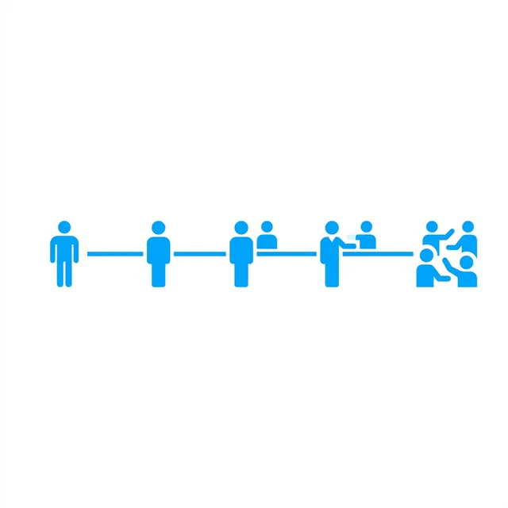
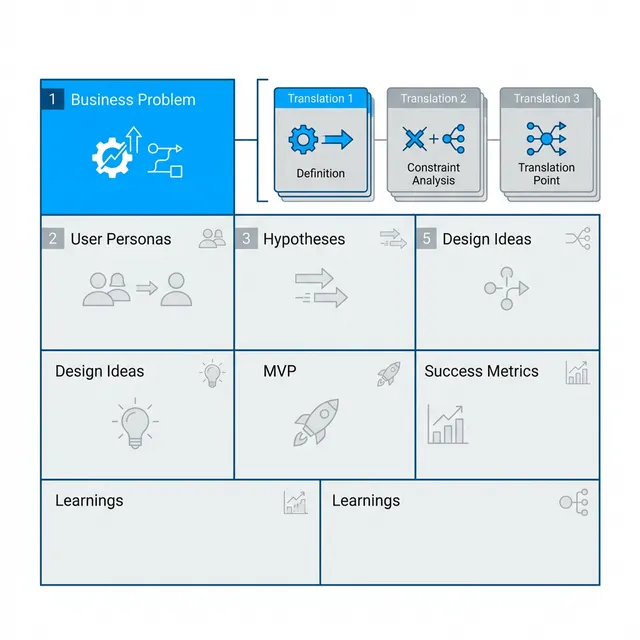
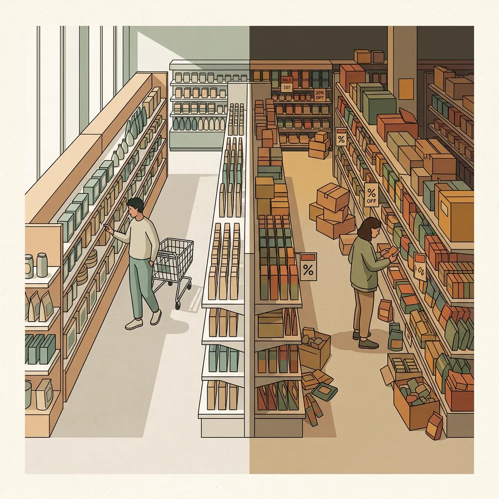
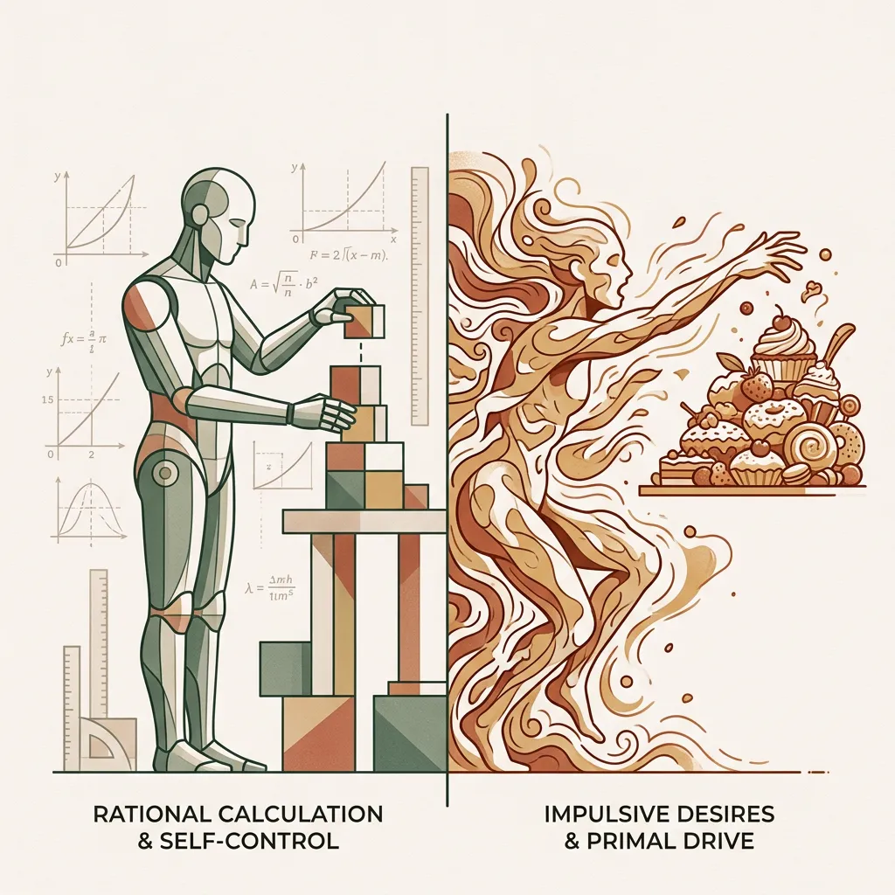
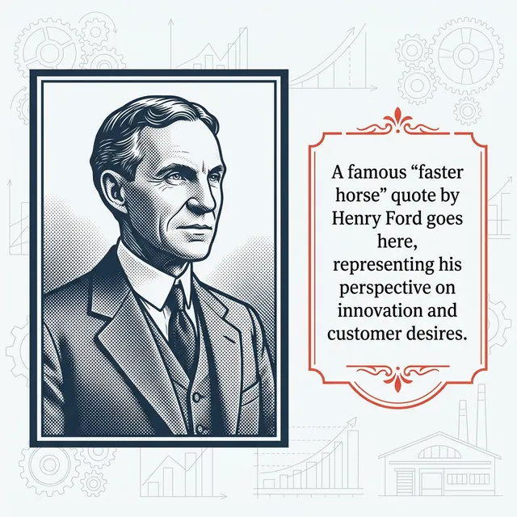

## 模块 2: 导入——认知摩擦的终极变种与言行不一 (10 min)

<!-- BUDGET: 1800 chars | SLIDES: ≥4 | STATUS: done -->

> [VISUAL]
> **Slide**: w03-slide-05
> **Layout**: Split
> **Asset**: 
> **Scene**: 左侧是一个用户满脸笑容地说"我非常喜欢并且需要这个功能"，右侧是监控录像里他把截然相反的东西偷偷揣进了口袋
> **Text**: 认知摩擦的终极变种：言行鸿沟 (Say-Do Gap)

### 2.1 言行鸿沟：社会期望导致了普遍的表象说谎

上周我们讲了执行鸿沟和评估鸿沟，那是发生在**人机界面**上的物理断裂。但今天，我们要面对一条更深、更黑、更可怕的心理侧沟壑——发生在你和用户之间的**言行鸿沟**（Say-Do Gap）。

所有刚入行的产品经理和年轻设计师，都会在第一年毫无例外地犯下同一个初级错误：**他们竟然真的把用户嘴里说出来的话当成真实需求。**

**(Pause: 3s)**

> [VISUAL]
> **Slide**: w03-slide-05b
> **Layout**: Center
> **Asset**: 
> **Scene**: 焦点小组访谈的虚假繁荣：用户热烈举手投票选择黄色的概念图
> **Text**: "请相信他们会撒谎"：Sony 经典焦点小组实验

> [DID YOU KNOW: 索尼的黄色收音机谎言]
> 给你们讲一个市场消费者调研圈里，被奉为圭臬的经典老故事。很多年前，巨头索尼（Sony）准备推出一款全新的运动型便携收音机（Boombox）。为了决定第一批主打什么颜色，他们非常严谨地招募了一群目标消费者，把大家关在一个典型的焦点小组（Focus Group）访谈室里。
> 
> 主持人拿出黑色的和明黄色的两套方案，热情地问大家："你们更喜欢哪一个？"
> 参与者们纷纷热烈地举起手，满脸放光地称赞："当然是明黄色！黄色代表运动、代表活力、代表年轻人的朝气！在户外运动时我们太需要一款亮色的电子产品了！" 座谈会气氛空前热烈，详尽的调研报告上一边倒地支撑了黄色必须成为首发方案。
>
> 如果故事到这里结束，索尼就会开足马力生产几百万台明黄色收音机，然后发向全球市场死得很惨。
 
> [VISUAL]
> **Slide**: w03-slide-05_sony_twist
> **Layout**: Center
> **Asset**: 
> **Scene**: 测试结束后，满桌子无人问津的黄色收音机与被一抢而空的黑色收音机对比
> **Text**: 调研室外的残酷真相：身体的诚实背叛了嘴上的热烈
> 
但负责这场调研的首席心理学家做了一个天才的举动。在会议结束时，他微笑着对所有参与者说："感谢大家的宝贵建议。作为报酬，出门的时候，**每个人可以在门口的桌子上免费拿走一台收音机**作为礼物。黑色和黄色都在那儿，随便挑。"

结果呢？等会议室空了以后，工作人员惊讶地发现：**桌子上的黄色收音机原封不动，几乎所有的参与者，都悄悄拿走了那台沉稳、低调、不会在公众场合让自己显得过于突兀的黑色收音机。**

> [VISUAL]
> **Slide**: w03-slide-05_textbook_focusgroup
> **Layout**: Center
> **Asset**: 
> **Scene**: 经典漫画：焦点小组讨厌这个设计，所以产品经理去找了一组"失焦小组"
> **Text**: [TEXTBOOK-REF] Rogers (2023) Fig 8.1 — 焦点小组的天然缺陷
> **Source**: Textbook

就像《交互设计》教材里指出的那样：焦点小组天生带有“社会期望偏差”，每个人都在迎合主流声音。

> [VISUAL]
> **Slide**: w03-slide-06
> **Layout**: `Flow`
> **Asset**: 
> **Scene**: 一座经典的深海冰山图模型。水面上的冰山极小尖端标注"人们怎么说 (Say)"，水面下巨大的冰山主干沉没在深海中，标注"人们怎么做 (Do)"和"人们隐秘的感觉 (Feel/Dream)"
> **Text**: Say ≠ Do：冰山下的行为真相
> **List**: 表达层 (Say) - 受社会期望污染 | 行为层 (Do) - 本能与现实驱动 | 潜意识层 (Feel/Dream) - 最深刻的隐秘动机

这就是横亘在所有产品洞察面前，最厚的一堵叹息之墙。人们嘴里说出来的，往往是他们认为"在社会眼光下看起来更体面"、或者仅仅是"你希望听到"的礼貌答案；而他们身体诚实做出的，才是被千万年基因和底层真实欲望支配的本能动作。这种言语表达与物理行动的剧烈断裂，就是 **Say-Do Gap**。

如果你把产品立项的基石建立在用户的"Say"（口服）上，你就等于在**一片沙滩上建造摩天大楼**。

> [VISUAL]
> **Slide**: w03-slide-06b
> **Layout**: Split
> **Asset**: 
> **Scene**: 左侧是宽敞明亮、毫无障碍的高级超市过道，右侧是堆满打折商品的杂乱过道（伴随顾客冲动拿取）
> **Text**: 沃尔玛过道悖论：言语的体面 vs 行为的冲动

> [CASE STUDY: 沃尔玛惨痛的过道悖论]
> 我们再看一个更特殊的真金白银惨案。全世界最大的零售商业巨头沃尔玛，曾经发起过一次大规模的门店顾客满意度问卷调查。成千上万的顾客在问卷上愤怒地抱怨同一件事："你们的货架过道实在太拥挤了！过道里堆满了乱七八糟的**促销售卖车**，推着购物车连转身都困难。太糟心了！我们强烈要求宽敞明亮的过道！"
> 
> 沃尔玛的总部高管们一看数据，痛定思痛。对啊，用户体验第一原则！于是，他们斥资数百万美元，强行下令把无数家门店过道里的促销端架（End-cap displays）和堆头全部撤走，把主动线过道拓宽了整整一倍。视线非常通透，空间无比豁亮，充满了极简高级感。顾客们在复访中也纷纷给出好评："太棒了，这才是国际超市该有的完美体验！"
 
> [VISUAL]
> **Slide**: w03-slide-06_walmart
> **Layout**: Center
> **Asset**: 
> **Scene**: 沃尔玛高管看着暴跌 15% 销售额季报流冷汗的场景
> **Text**: 倾听的代价：迎合言语体验，摧毁了利润引擎
> 
结果在下个季度的财报中，沃尔玛整体销售额**暴跌了 15%**。
> 
为什么？因为那些被问卷抱怨“非常妨碍通行”的促销车，正是激发顾客**冲动消费的核心武器**。顾客在填写问卷时用慢思考理性地写下“讨厌拥挤”，但他们的快思考系统却在路过时本能地拿起了打折糖果。沃尔玛迎合了问卷上的体面回答，却破坏了支撑销量的**真实行为模型**。

在进入行为经济学之前，我们先用一个实战场景来看看大家会不会掉进言行鸿沟的陷阱。

> [ACTIVITY]
> **Type**: `Quiz`
> **Duration**: `2min`
> **Desc**: 情境诊断：规避 Say-Do Gap
> **Q**: 某美妆品牌在推出新款抗老面霜前，发出了五千份问卷。90% 的受访女性强烈表示“成分表是否环保”是她们购买抗老面霜的最重要决定因素。作为产品经理，为了避免跌入“言行鸿沟”，你下一步最应该怎么做？
> **Options**: A. 立即让研发部将环保成分作为核心卖点，并印在包装最显眼处 | B. 放弃这款面霜的研发，因为环保材料成本过高会导致亏损 | C. 去商场专柜，实地观察女性顾客购买面霜时真实关注和询问的内容 | D. 举办一场焦点小组，把她们请到会议室详细追问为什么喜欢环保成分
> **Answer**: `C`
> **Explain**: 问卷上的“支持环保”是为了迎合社会期望（Say）。如果选 C，当你潜伏在专柜观察时，可能会发现一个极具讽刺意味的真实结局：顾客拿着标榜“100%可降解”的面霜看了两眼，转身却毫不犹豫地买下旁边过度包装、但导购悄悄承诺“三天淡化细纹”的强效竞品，并在付款时要求多拿一个极不环保的精美礼品袋。在刷卡的瞬间，她们完全被“对衰老的恐惧与对见效的渴望”这一底层本能驱使（Do）。只有回归真实场景，捕捉这种“身体诚实”的反差，才能识破语言的伪装。

> [VISUAL]
> **Slide**: w03-slide-07
> **Layout**: `Comparison`
> **Asset**: 
> **Scene**: 左侧标注：古典经济学里绝对理性的"经济人"（Homo Economicus）；右侧标注：行为经济学里受限的、充满偏见的"现实人"（配以一个面对诱惑抓耳挠腮、充满世俗欲望的“猪八戒”形象，代表被本能支配）
> **Text**: 行为经济学：认清人类的荒诞本能
> **List**: 经济人 (Homo Economicus): 完美理性计算 · 效用最大化 | 现实人 (Humans): 损失厌恶 · 社会人设 · 荷尔蒙驱动

### 2.2 行为陷阱：被荷尔蒙与偏见支配的现实人类

> [PHILOSOPHY: 行为经济学里消失的理性人]
> 造成这道巨大鸿沟的跨学科解释是什么？在很长一段时间里，传统的古典经济学把人类假设为**绝对理性的"经济人"（Homo Economicus）**——认为人们总是能像计算机一样完美计算得失，根据最大化效用的严密原则诚实地行动。

但 2017 年诺贝尔经济学奖得主理查德·泰勒（Richard Thaler）用**行为经济学（Behavioral Economics）**重重地打碎了这个百年幻想。他无情地指出，真实世界里的人，根本没有那么完美的自控力，反而更像是那个面对诱惑总是管不住手、充满弱点与世俗欲望的"猪八戒"。

我们会因为极微小的虚荣心而盲目买单，因为**损失厌恶（Loss Aversion）**而做出非常非理性护短的选择。甚至会为了维护一个"我是一个环保/健康的人"的高尚社会人设，而在长达十几页的调研问卷上撒下弥天大谎，转头一出门再去买碳排放极高的大排量汽车和毫无营养的全糖奶茶。
 
> [VISUAL]
> **Slide**: w03-slide-07_thaler
> **Layout**: Center
> **Asset**: 
> **Scene**: 一个西装革履的人正在填写环保问卷，背后的影子里却是一只疯狂喝全糖奶茶的大猩猩
> **Text**: 理查德·泰勒的洞察：人类是充满偏见与矛盾的真实动物

作为数字体验设计师，我们必须认清并且接受这个无奈的现实：你面对的绝对不是一排排能在数据库里精确运行的算法参数，而是一群体内充满了荷尔蒙、偏见、恐惧和高度矛盾欲望的哺乳动物。

### 2.3 拆解伪装：洞察的第一准则是剥离表象方案

> [VISUAL]
> **Slide**: w03-slide-07b
> **Layout**: `Split`
> **Asset**: 
> **Scene**: 工业时代伟人亨利·福特的经典黑白复古照片，旁边印着他那句被产品圈引用了无数次的金句
> **Text**: "如果我当年去问顾客他们想要什么，他们只会告诉我：一匹更快的马。" —— 亨利·福特 (Henry Ford)

**(Pause: 3s)**

既然人类总是陷入言行不一的陷阱，那洞察该如何做？看屏幕上福特这句名言。
"如果我当年去问顾客他们想要什么，他们只会告诉我：一匹更快的马。"
这绝对不是说, 顾客是没什么远见的笨蛋.

这是对名言的曲解。福特这句话真正的内核，是揭示了**洞察的第一准则**：用户只能基于现有认知框架提出方案（更快的马），而专业设计师的核心任务，绝不是盲从具体的表面方案，而是要敏锐地剖析出隐藏在方案背后的永恒诉求——**"我想用更短时间从 A 点移动到 B 点"**。

这就是我们今天要讲的最核心的方法论跨越："更快的马"，是用户提出的**具体解决方案（Solution）**；而"更快地移动"，才是人类跨越时代的**真痛点（Job to be Done）**。

> [VISUAL]
> **Slide**: w03-slide-08
> **Layout**: Split
> **RenderMode**: pedagogical
> **Asset**: 
> **Scene**: [Metaphor: X-ray/Scanning] 左侧是一匹马的实物轮廓（代表表面提出的“具体解决方案 Solution”）；右侧是透过充满科技感的 X 光扫描后，剥离了马的生物实体，只剩下极简的从 A 点到 B 点加速移动的物理轨迹图（代表底层的“核心痛点 Job to be Done”）。
> **Keywords**: outline of a horse, glowing X-ray scan, abstract A to B movement trajectory, minimal blueprint
> **Text**: 剥离表象：从 Solution 到 Job to be Done
> **List**: 表面诉求: 更快的马 (Solution) | 核心痛点: 更快地移动 (Job to be Done)

> [TEACHING MOMENT]
> 因此，停止机械的倾听，开始客观地观察。**洞察的第一准则：不要满足于表面方案，而是去寻找跨越时代的永恒诉求。** "更快的马"是伪装，"更快地移动"才是真相。接下来的时间，我们将学习一套系统的方法，帮助你们拨开现象的迷雾，精准锁定核心痛点。
