## 模块 3: 讲授一——反直觉定性调研与问题发掘 (35 min)

<!-- BUDGET: 5400 chars | SLIDES: ≥10 | STATUS: done -->
### 3.1 抛弃问卷：焦点小组无法触及真实的私密痛点
> [VISUAL]
> **Slide**: w03-slide-08
> **Layout**: Split
> **RenderMode**: themed
> **Asset**: 
> **Scene**: 左侧是大面积平铺的抽象细线网格与微小散点矩阵（代表定量的表面广度）；右侧则是从网格中提取出的单个节点的三维深度剖面图，核心处散发着暖琥珀色光芒（代表定性研究向下挖掘深度的本质）。纯粹的几何抽象隐喻。
> **Keywords**: uniform flat grid of dots, deep 3D cross-section of a single node, warm amber glowing core, architectural minimalist geometric abstraction
> **Text**: 定量告诉你有多少人，定性告诉你为什么
> **List**: 定量调研 (Quantitative): 关注"有多少人"做这件事 | 定性调研 (Qualitative): 关注"为什么"做这件事

既然我们已经验证了"绝不能听用户怎么说"这条铁律，那在这个真假难辨的世界里，我们到底该怎么做产品调研呢？

商业世界里有两大流派，就像武当和少林：**定量调研（Quantitative）** 和 **定性调研（Qualitative）**。
简单粗暴地划分：定量告诉你"有多少人"在买单，定性告诉你他们到底"为什么"要买单。如果数据大盘显示购物车跳出率激增了 30%——这是**定量**的功劳，它像报警器一样告诉你哪里出了问题。但它无法告诉你问题的原因是什么。

要找到业务痛点的终极本质，我们必须依靠**定性调研**。不是通过发上万份问卷，而是深入真实场景，去观察具体用户的行为。

**(Pause: 3s)**

但在这个寻找真相的过程中，很多大公司踩了第一个巨坑——他们迷信一种被传统营销学奉为神明的工具：**焦点小组（Focus Group）**。

> [VISUAL]
> **Slide**: w03-slide-09_focus_group_flaw
> **Layout**: Center
> **Asset**: 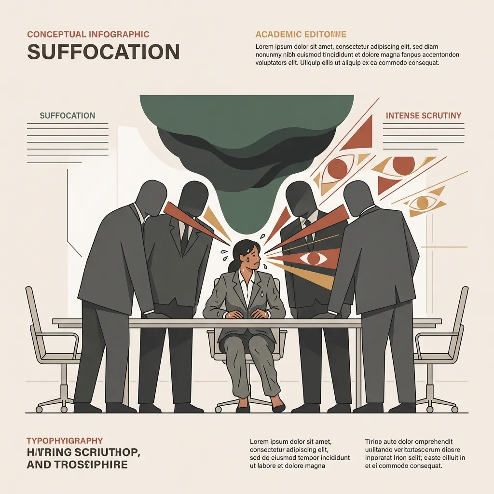
> **Scene**: 坐在会议桌前紧张出汗的用户，面对几个穿着西装的观察者
> **Text**: 痛点的私密性：无人愿意在公开场合承认自己是傻瓜

还记得我们在模块 2 里讲的索尼收音机的故事吗？那就是一场典型的焦点小组灾难。把八个陌生人关在带有单向玻璃的会议室里，发点车马费，让他们对着产品高谈阔论。这听起来高效，仿佛一个下午就能收集所有声音，但它在洞察真实痛点上却是一剂**致命毒药**。

焦点小组可以用来快速测试广告语的通俗度，但**不能用来挖掘底层痛点**。从社会心理学来看，它存在两个无法克服的缺陷：

第一是**表演型人格陷阱**。当受访者意识到自己被观察时，会自动戴上面具，给出为了讨好研究员的**致命迎合**。真正的痛点带有极强的**私密性与脆弱感**，没有人愿意在明亮的会议室里当着陌生人的面坦承：“因为实在看不懂你们的提示语，我觉得自己很笨。”

> [VISUAL]
> **Slide**: w03-slide-09_group_polarization
> **Layout**: Center
> **Asset**: 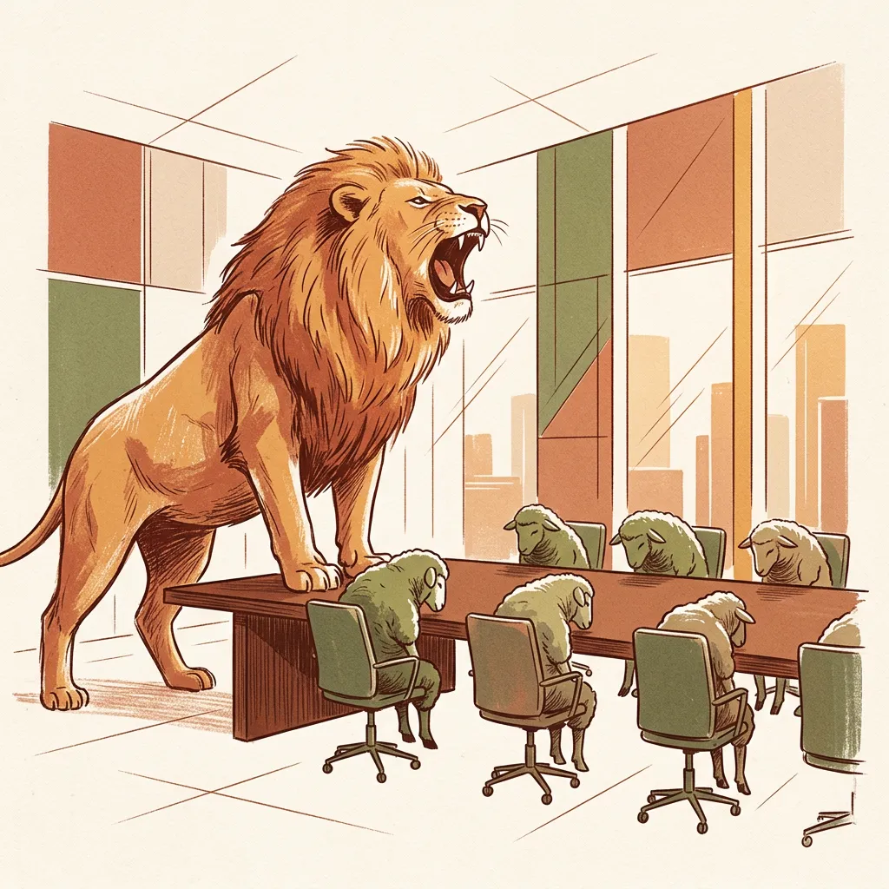
> **Scene**: 一只巨大的狮子在会议室咆哮，周围的小绵羊全部在低头附和
> **Text**: 焦点小组的灾难：群体极化与意见领袖霸权

第二是**群体极化（Group Polarization）**。这种迎合在群体互动中会被成倍放大。人类有为了生存而迎合大多数的从众本能，只要组内出现一个声音最大、最自信的强势个体，其他人就会迫于社交压力本能地闭嘴顺从。这就是为什么你在那种会议室里，永远听不到底层的异见真相。

### 3.2 走出大楼：真实世界的摩擦只存在于第一现场

> [VISUAL]
> **Slide**: w03-slide-10
> **Layout**: `Split`
> **Asset**: 
> **Scene**: 纯黑底色，用非常醒目的巨大亮黄色字体写着一行英文，背景是一个产品经理推开玻璃门走向车水马龙的街头背影
> **Text**: Get Out of the Building (走出大楼) —— Steve Blank

所以，敏捷创业之父 Steve Blank 曾提出过一条核心法则：**Get Out of the Building（走出大楼）**。

办公室里没有事实，只有主观猜测。要想获取一手的真实痛点，产品团队必须进入用户的**实际物理环境**中。为此，定性调研依赖于两大核心工具：**参与式观察（Observation）** 和 **深度访谈（In-depth Interview, 简称 IDI）**。

**(Pause: 3s)**

> [VISUAL]
> **Slide**: w03-slide-11
> **Layout**: Split
> **Asset**: 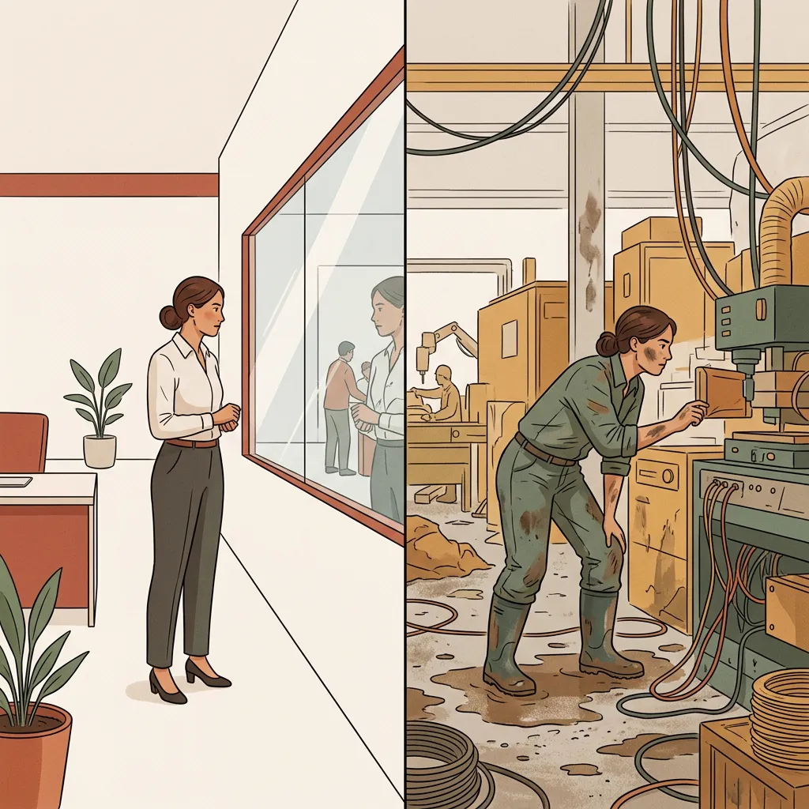
> **Scene**: 左侧是隔着单向玻璃的无菌观察室；右侧是充满噪音与杂乱的真实工作现场，调研员近距离观察用户的操作
> **Text**: 参与式观察：进入真实的物理环境
> **List**: 办公室视角：隔绝物理摩擦的二手猜测 | 现场视角：直面突发状况的真实操作痕迹

第一个核心工具是**参与式观察**。它要求调研者离开无菌的观察室，直接进入用户实际操作的复杂环境中。在真实行动的现场，用户口头上的伪装会自然失效，你能直接观察到他们为了克服产品缺陷而留下的**物理痕迹**。

> [VISUAL]
> **Slide**: w03-slide-10_anthropology
> **Layout**: Center
> **Asset**: 
> **Scene**: 一本厚重的人类学田野笔记，上面用红笔画着叉号
> **Text**: 借用人类学的顶级武器, 民族志与人类学的田野调查

参与式观察并非互联网行业的原创，而是源自**人类学（Anthropology）**的核心方法论：**民族志（Ethnography）**。

> [VISUAL]
> **Slide**: w03-slide-10_ethnography
> **Layout**: Split
> **Asset**: 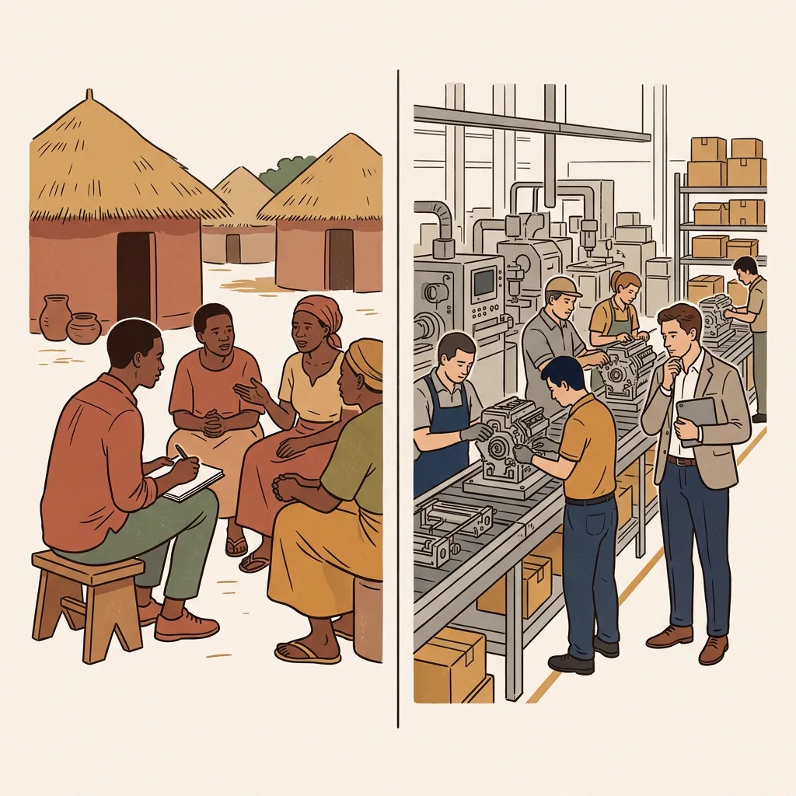
> **Scene**: 左侧是现代人类学家在非洲原始部落记录笔记，右侧是互联网产品经理在杂乱的车间里观察工人
> **Text**: 田野调查的降维打击：从部落到现代工厂

早期的人类学家在研究土著部落时，绝不会把他们请进城市的宽敞实验室里填写问卷。

> [VISUAL]
> **Slide**: w03-slide-11_activity
> **Layout**: Center
> **Asset**: 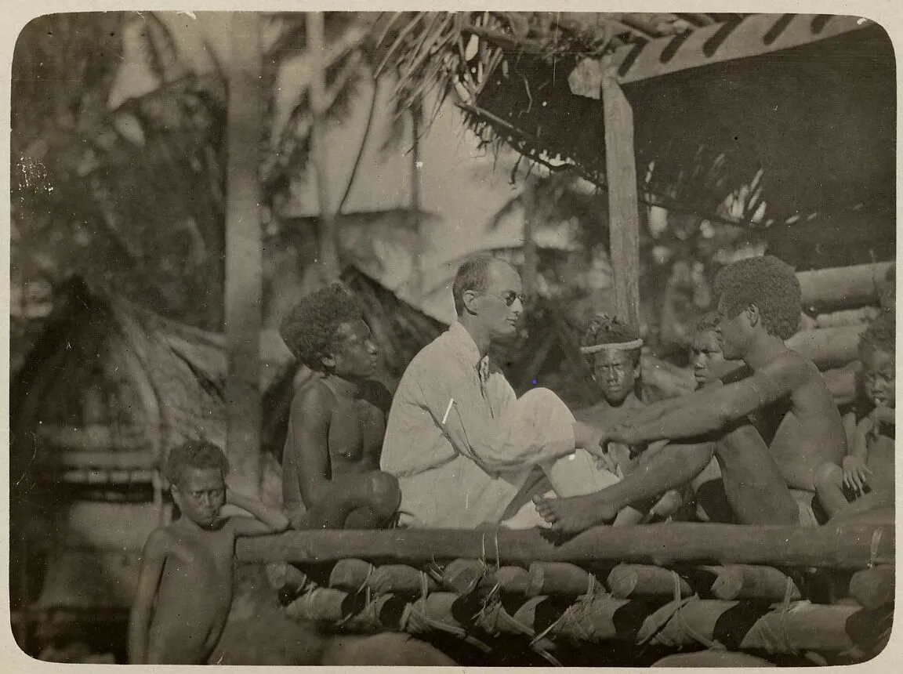
> **Scene**: 原始马林诺夫斯基在部落中与土著共处的老照片
> **Text**: 人类学现场：把自己变成系统的一部分

现代人类学奠基人马林诺夫斯基（Bronisław Malinowski）确立了真正有效的研究范式：直接前往特罗布里恩群岛，与土著共同居住了一年。在这一年里，他不再是高高在上的"观察者"，而是让自己成为了这个环境系统内的"一部分"。这就叫人类学不可磨灭的火种——**田野调查（Fieldwork）**。

> [ACTIVITY]
> **Type**: `Quiz`
> **Duration**: `2min`
> **Desc**: 快速回忆——焦点小组的基因缺陷
> **Q**: 为什么在真实的用户洞察中，把目标用户关在带单向玻璃的会议室里做"焦点小组"访谈，往往无法挖掘到底层真实痛点？
> **Options**: A. 因为单向玻璃会让用户感到被监视的愤怒 | B. 样本量不足，无法得出显著的定量结论 | C. 群体极化与表演型人格导致用户说出顺从谎言 | D. 产品原型通常不够高保真，用户无法代入
> **Answer**: `C`
> **Explain**: 焦点小组存在两大结构性缺陷：群体极化（只要出现强势的意见领袖，其他人就会迫于社交压力附和）和表演型人格（用户意识到被观察时，会自动戴上面具给出体面的虚假评价）。真实痛点具有私密性，必须通过田野调查进入真实物理环境捕获。

这种把自己变成系统一部分的田野调查法，不仅适用于百年前的原始部落，在高度现代化的今天依然是交互设计师最致命的破局武器。让我们把视线从非洲丛林拉回现代都市里高压运转的急诊室。

> [VISUAL]
> **Slide**: w03-slide-11_nurse_case
> **Layout**: Split
> **Asset**: 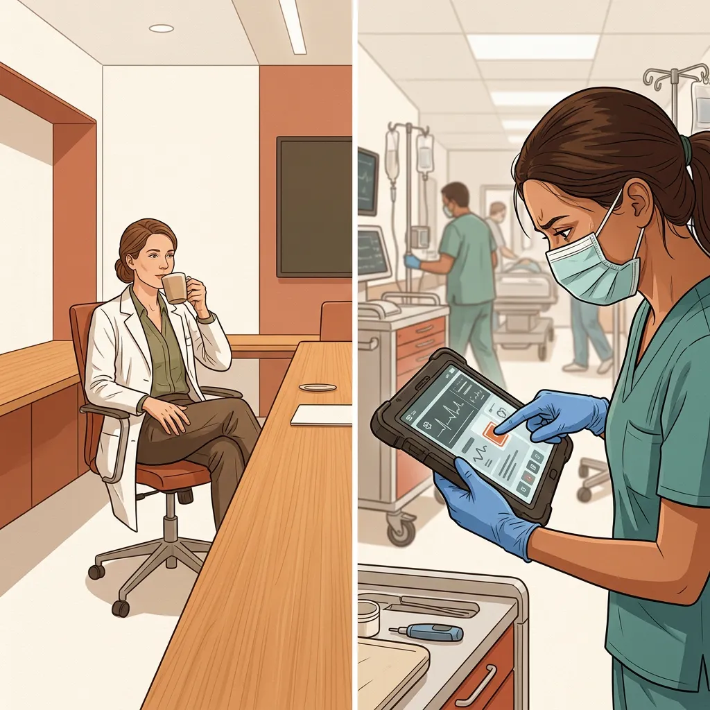
> **Scene**: 会议室里优雅喝咖啡提需求的护士长 vs 急诊室凌晨三点满手是血戴着手套疯狂点不中按钮的崩溃护士
> **Text**: 场景摧毁了假设：无菌手套与 16 像素下拉菜单的惨烈碰撞

同理，如果要设计一款给急诊室护士用的医疗信息录入平板，你不能把护士长请进宽敞的会议室里"回忆"她的操作流程，而是应该在一个周五的晚上，站在急诊室的角落里观察她整整三个小时。这种方法在用户研究中被称为**情境沉浸式观察（Contextual Inquiry）**。

> [VISUAL]
> **Slide**: w03-slide-11_nurse_struggle
> **Layout**: Center
> **Asset**: 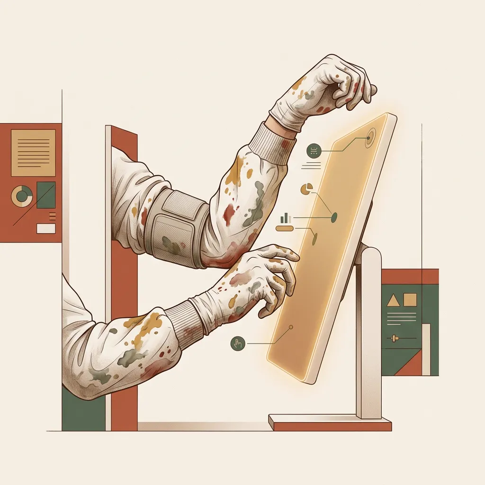
> **Scene**: 护士满手鲜血和污渍，绝望地试图用胳膊肘去按平板屏幕上的小按钮
> **Text**: 物理极限下的环境摩擦：办公室里永远看不到的失控

在实际的田野观察中你会发现：护士根本没有时间去用食指精准点击 Figma 里设计好的 44px 圆角按钮，因为她的双手可能沾满了药物污渍或戴着无菌手套；为了在跑动中查房，她只能把平板夹在腋下**盲打**。

> [VISUAL]
> **Slide**: w03-slide-11a
> **Layout**: `Full`
> **Asset**: 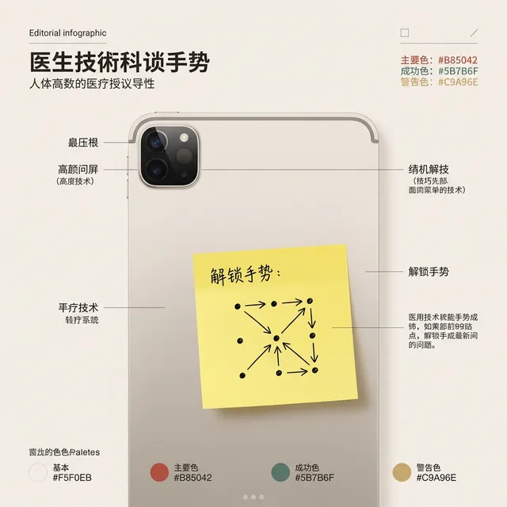
> **Scene**: 一台昂贵的高科技医疗平板电脑背面，被非常违和、粗暴地贴上了一张写着巨大九宫格开锁手势密码的明黄色便利贴
> **Text**: 只有实地观察才能捕获的"物理摩擦"

为了对抗系统"每五分钟自动锁屏"的安全机制，护士甚至会在平板背面直接贴上写着开锁密码的便利贴。这些破坏了产品底层设想的物理摩擦，只有通过**民族志式的实地观察**才能被捕获。

> [VISUAL]
> **Slide**: w03-slide-11b
> **Layout**: Split
> **Asset**: 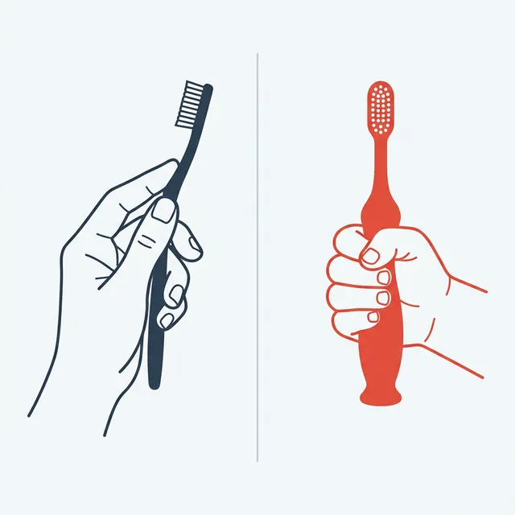
> **Scene**: 左侧是成年人灵活拿普通牙刷的姿态（三点手指灵活捏着笔杆），右侧是小孩子满手抓握非常粗壮的橡胶把手牙刷的暴躁姿态（整个拳头死死紧握）
> **Text**: 只有观察才能看见的物理真相：IDEO 儿童牙刷革命

> [CASE STUDY: IDEO 与欧乐-B 的儿童牙刷革命]
> 1996 年，IDEO 为欧乐-B 设计新款儿童牙刷。当时整个行业的逻辑非常线性：既然儿童的手和嘴都很小，那么儿童牙刷就应该是成人牙刷的"等比例缩小版"——刷头变小，刷柄变细。

> [VISUAL]
> **Slide**: w03-slide-11_ideo_intro
> **Layout**: Center
> **Asset**: 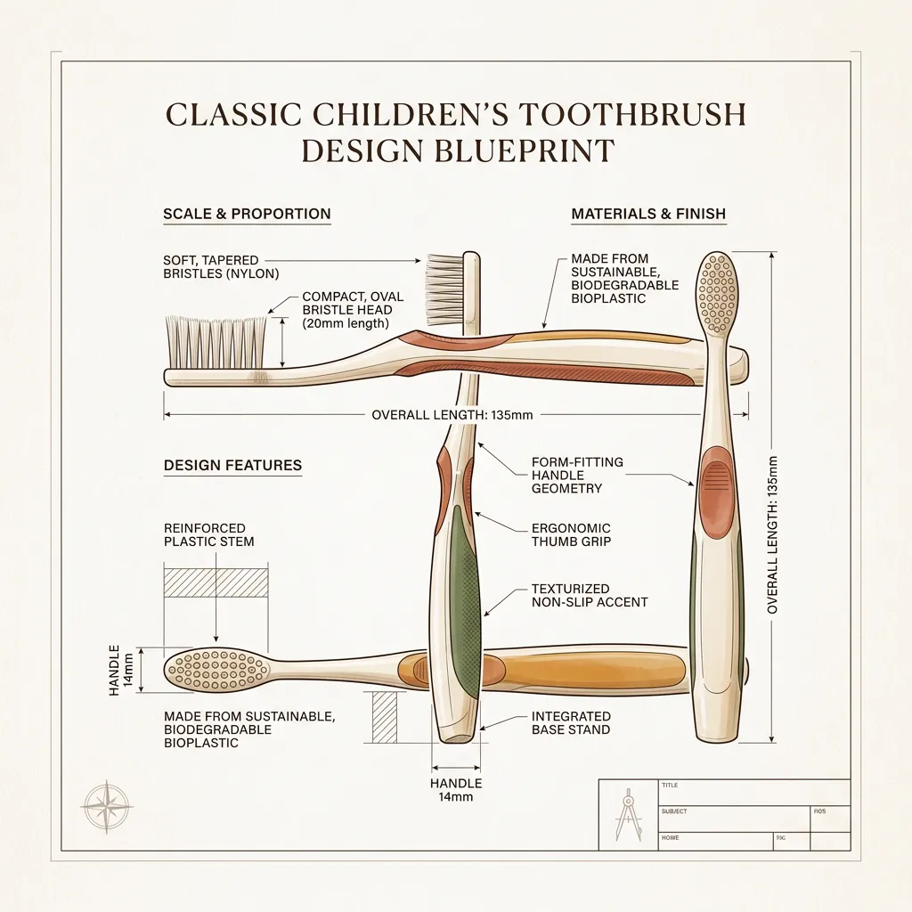
> **Scene**: 欧乐-B 经典的儿童牙刷设计图稿：完美的等比例缩小版
> **Text**: 线性逻辑的盲区：等比例缩小的设想

IDEO 并没有去问卷调查父母，而是派出研究员拿着摄像机，直接进入普通家庭的浴室，记录 5 岁小孩早晨洗漱的真实物理过程。
 
> [VISUAL]
> **Slide**: w03-slide-11_ideo_toothbrush
> **Layout**: Comparison
> **Asset**: 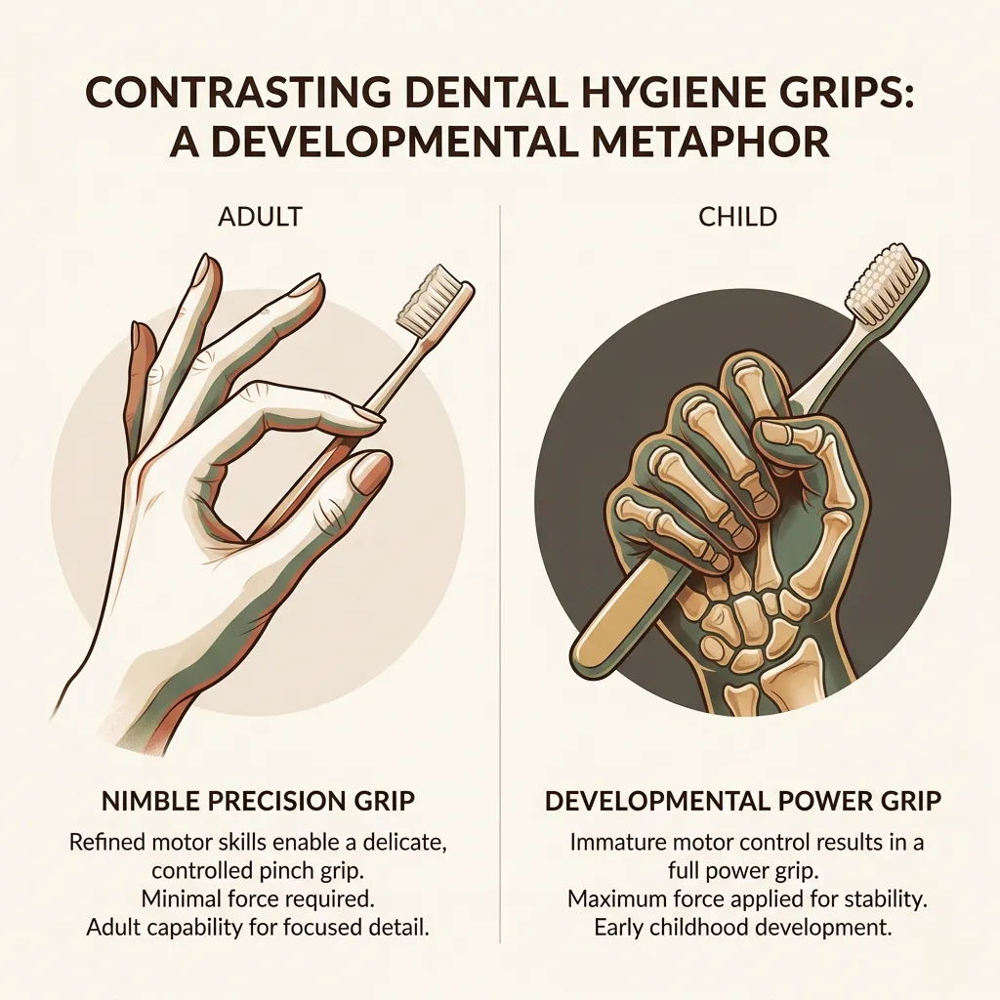
> **Scene**: 成年人灵巧的手指捏着细牙刷 vs 儿童像握拳头一样死死握住粗牙刷的X光透视图
> **Text**: 肌肉发育的隐藏真相：儿童与成人的物理差异
> **List**: 成人握姿：指尖灵巧捏持 | 儿童握姿：拳头死死紧握

回放录像时，他们发现了核心细节。成年人的精细运动神经发达，刷牙时是用**指腹和指尖的灵巧力量**"捏"着牙刷柄转动，因此细长的刷柄非常科学。

> [VISUAL]
> **Slide**: w03-slide-11c
> **Layout**: Split
> **Asset**: 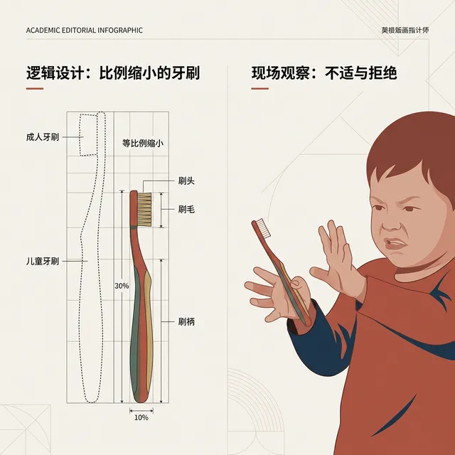
> **Scene**: 左侧是父母们理所当然的逻辑（大人牙刷等比例缩小）；右侧是田野影像中儿童拿着牙刷抗拒的场景
> **Text**: 录像带回放中发现的生理学细节

但 5 岁儿童的手部精细神经尚未发育完全，他们根本无法用指尖"捏"住牙刷。录像显示，孩子们通常是**用整个拳头紧紧握住**牙刷柄。由于缩小版的手柄太细，不符合儿童拳握的力学支撑，导致牙刷容易在沾水的掌心里打滑脱落，这就是孩子们抗拒刷牙的物理原因。

基于这个深刻的实地洞察，IDEO 颠覆性地设计了一款刷柄粗壮、包裹防滑软胶的全新儿童牙刷——"Squish Grip"。这款产品迅速统治了市场，成为经典创新案例。

这种"因生理发育引发的握姿差异"，在焦点小组里发一百份问卷也无法获得。**产品设计的真相，永远存在于第一现场的物理摩擦之中。**

> [VISUAL]
> **Slide**: w03-slide-12
> **Layout**: `Full`
> **Asset**: 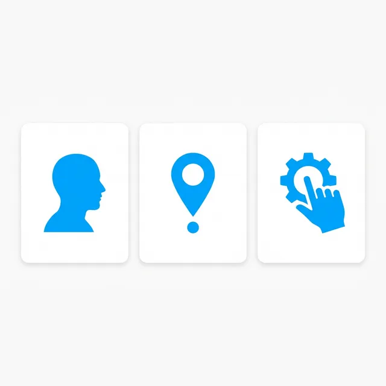
> **Scene**: 一名探长在阴冷的高压审讯室里，用非常有压迫感的姿态拿刺眼强光灯直射嫌疑人的眼睛，嫌疑人被迫低头
> **Text**: 访谈的死穴：验证式审问

### 3.3 深度访谈：诱导式的封闭提问只会换来顺从谎言

观察是"用眼看"，我们再来拔出第二把刀："用嘴问"，也就是**深度访谈（In-depth Interview）**。

这是调研中最容易翻车的地方。大多数初级访谈者在拿到任务后，会不知不觉把"用户访谈"变成一场**带高度偏见的诱导式审讯**。

最经典的**验证式提问**通常长这样："李先生，如果我们在右上角加一个闪烁的一键导出功能，极大地提升您的效率，您会在工作中高频使用它吗？如果这个功能每月只收 5 块钱，您愿意掏钱支持吗？"

这根本不是提问，而是**诱导性封闭问题**的典型反面案例——问题本身已经把答案预设好了。被**社交压力**裹挟的用户，为了早点结束谈话或照顾你的面子，一定会向你保证："这功能太棒了，我天天都会用，5 块钱根本不是问题！"

然后你拿着"用户 100% 愿意付费"的报告要求研发加班。但当系统真正上线那天，你会发现**付费转化率是零**。如果你以为"获取了虚假的承诺"就是诱导式提问的全部代价，那你就大错特错了。

> [VISUAL]
> **Slide**: w03-slide-12_loftus_experiment
> **Layout**: Video
> **Asset**: 
> **Source**: Video — YouTube (Full Uncut)
> **Duration**: 00:22
> **TimeCategory**: lecture
> **Scene**: 1974年洛夫特斯车祸虚假记忆实验的完整历史撞车录像。
> **Text**: 诱导性提问不仅获取谎言，更会销毁真实的记忆

> [CROSS-DISCIPLINARY: 认知心理学与虚假记忆实验]
> 1974 年，认知心理学家伊丽莎白·洛夫特斯（Elizabeth Loftus）做了一个著名的车祸录像实验。当她提问"汽车**轻撞 (hit)** 时速度多快"时，受试者估算的车速相对保守。但当她把动词换成"汽车**猛烈撞击 (smashed)**"时，受试者不仅估算的平均车速飙升，甚至在一周后无中生有地"回忆"出录像中并不存在的碎玻璃。
> 产品经理在访谈中使用的"诱导性词汇"，不仅会收集到错误数据，更会直接污染和重塑受访者原本真实的记忆。

> [VISUAL]
> **Slide**: w03-slide-12b
> **Layout**: Center
> **Asset**: 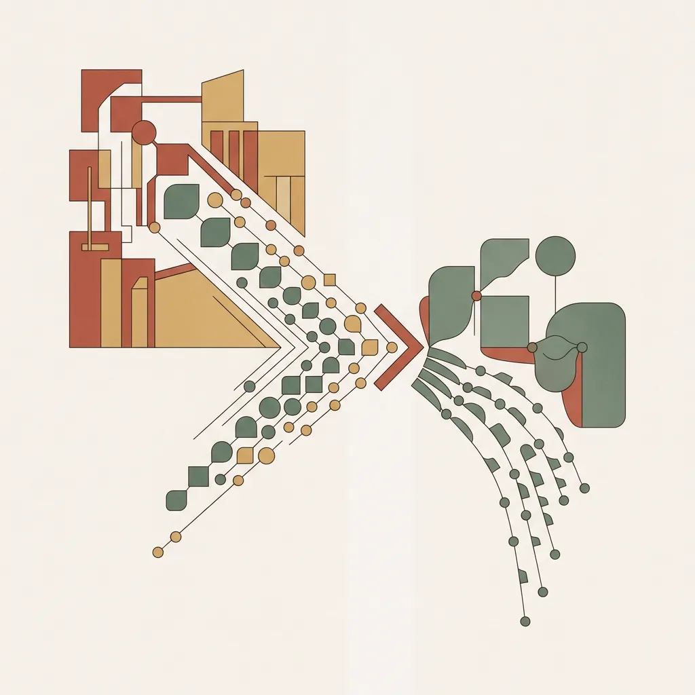
> **Scene**: 产品经理拿着诱导式问卷逼问用户，用户敷衍点头
> **Text**: 永远不要要求人类预测未来的行为

> [TEACHING MOMENT]
> 永远记住定性调研的一条铁律：**绝对不要让用户去预测他们自己未来的行为**。
> 人类在认知演化中由于缺乏对抗长周期风险的评估算力，往往无法准确预测自身的未来偏好。今天受访者信誓旦旦表示"一定会购买"的功能，上线后很可能无人问津。
> 因此，深度访谈的法则是：**不要去问将来，只深挖过去的真实经历；不要去打听态度，只追问发生过的事实。**

> [ACTIVITY]
> **Type**: `QA`
> **Duration**: `2min`
> **Desc**: 快速知识点回顾
> 教师提问互动，校验此前核心法则的理解情况。

既然让用户预测未来是死路一条，那么我们该如何提问？其实，优秀的深度访谈与其说是一场严肃的审问，不如说是一次权力的倒转。在这个过程中，你必须克制住自己想要评价的冲动。

> [VISUAL]
> **Slide**: w03-slide-13
> **Layout**: `Comparison`
> **Asset**: 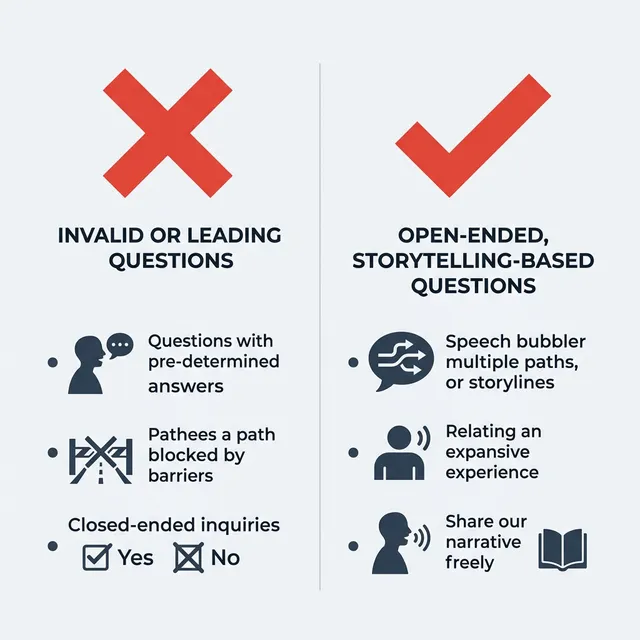
> **Scene**: 左右对比提问方式，左侧是大红叉，右侧是通行绿勾
> **Text**: 别让用户当高高在上的评委，请引诱他们讲出带体温的故事
> **List**: ❌ 法官审判式：封闭打分 · 预设诱导 · 用户被动应答 | ✅ 故事引导式：开放叙述 · 场景重播 · 用户主动回忆

看屏幕上这组对比。左侧那个巨大的红叉，是所有初级调研员天天在犯的致命错误——他们像法官一样端坐在审判席上，把用户逼成了一个只能举牌打分的沉默评委。而右侧那个绿色的通行勾，代表的是完全相反的**权力翻转**：不要让他评价，让他叙述。别问他好不好用，问他**经历了什么**。把话筒递给他，让他成为自己故事里唯一的主角。

> [VISUAL]
> **Slide**: w03-slide-13b
> **Layout**: `Split`
> **Asset**: 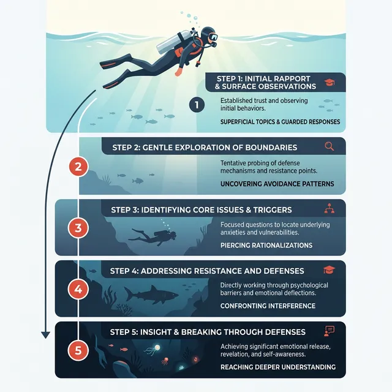
> **Scene**: 潜水员从阳光明媚的浅水区一步步下潜到深不见底的马里亚纳深渊的五步下降图，代表深访的五个渐进剥除心理防御的阶段
> **Text**: 深访五步法：破冰 → 探寻 → 剥洋葱 → 还原 → 收拢
> **List**: 1. 破冰 (Ice-breaking) | 2. 探寻 (Exploration) | 3. 剥洋葱 (Deep-dive) | 4. 还原 (Reconstruction) | 5. 收拢 (Wrap-up)

这五个步骤，就是逐步卸下用户防御的战术核心。你要明白，每一个坐到你面前的受访者，身上都穿着厚厚的一层社会体面盔甲。你的访谈不是在走流程，而是在利用心理学技巧，非常耐心地、一层一层地**瓦解这套防御机制**，直到他向你展露最脆弱的痛点。

> [VISUAL]
> **Slide**: w03-slide-13_five_steps
> **Layout**: Center
> **Asset**: 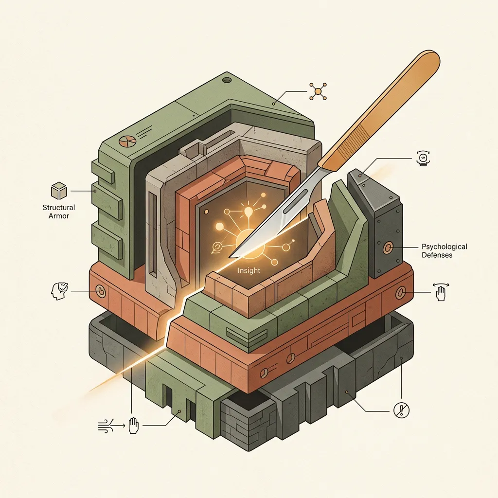
> **Scene**: 手术刀正准备切开一层层极其坚固的防御装甲（隐喻用户的心理防御层）
> **Text**: 深入虎穴的战术：深访五步法

那么，既然不能问未来，一场高质量的深度访谈应该如何推进？我们在行业实践中总结了一套精准的**深访五步法**。它不是单纯去问问题，而是一次对用户心理防御机制的逐步渗透与瓦解。

**(Pause: 3s)**

#### 1. 下潜破冰：日常闲聊能有效瘫痪受访者的社会防御

> [VISUAL]
> **Slide**: w03-slide-13_icebreaking
> **Layout**: Split
> **Asset**: 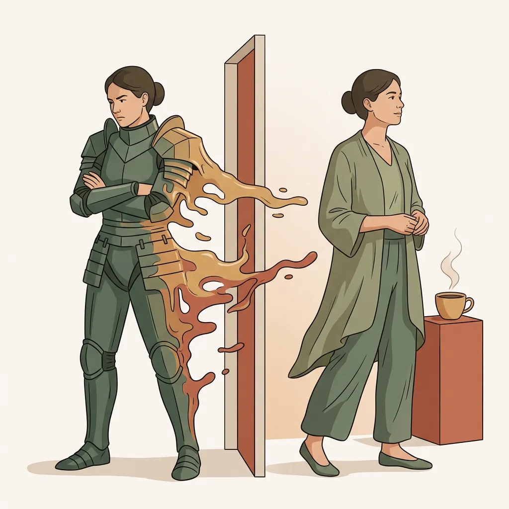
> **Scene**: 左侧是充满防御姿态的双臂交叉用户，右侧是被一杯咖啡和日常闲聊卸下防备的放松姿态
> **Text**: 破冰的战术目的：强制切换至系统 1 聊天模式

**第一步：破冰探寻（Ice-breaking & Exploration）**。
记住我说的，访谈的前三分钟，绝不允许谈论你们的那个破产品。一个字都别提。你要谈今天的雷阵雨天气、谈他带来的那只非常可爱的金毛狗、甚至谈他外套上印着的某个小众摇滚乐队 Logo。

为什么要做这种看似非常浪费时间的废话？因为当一个对你来说完全陌生的个体坐到你这个"官方调查人员"面前时，他脑子里的**社会自我防御机制**是全部闪着红灯、最高战备开启的。他处于一种高度耗能的**系统 2（慢思考）**的防备状态，随时准备应对一次你对他的智商或者习惯的粗暴考察。

破冰的唯一目的，是用与利益无关的日常闲聊，让他紧绷的背部肌肉放松靠在椅背上，卸下防弹盔甲，骗他切回到漫不经心、会说漏嘴的**系统 1 聊天模式**。

> [VISUAL]
> **Slide**: w03-slide-13_exploration
> **Layout**: Split
> **Asset**: 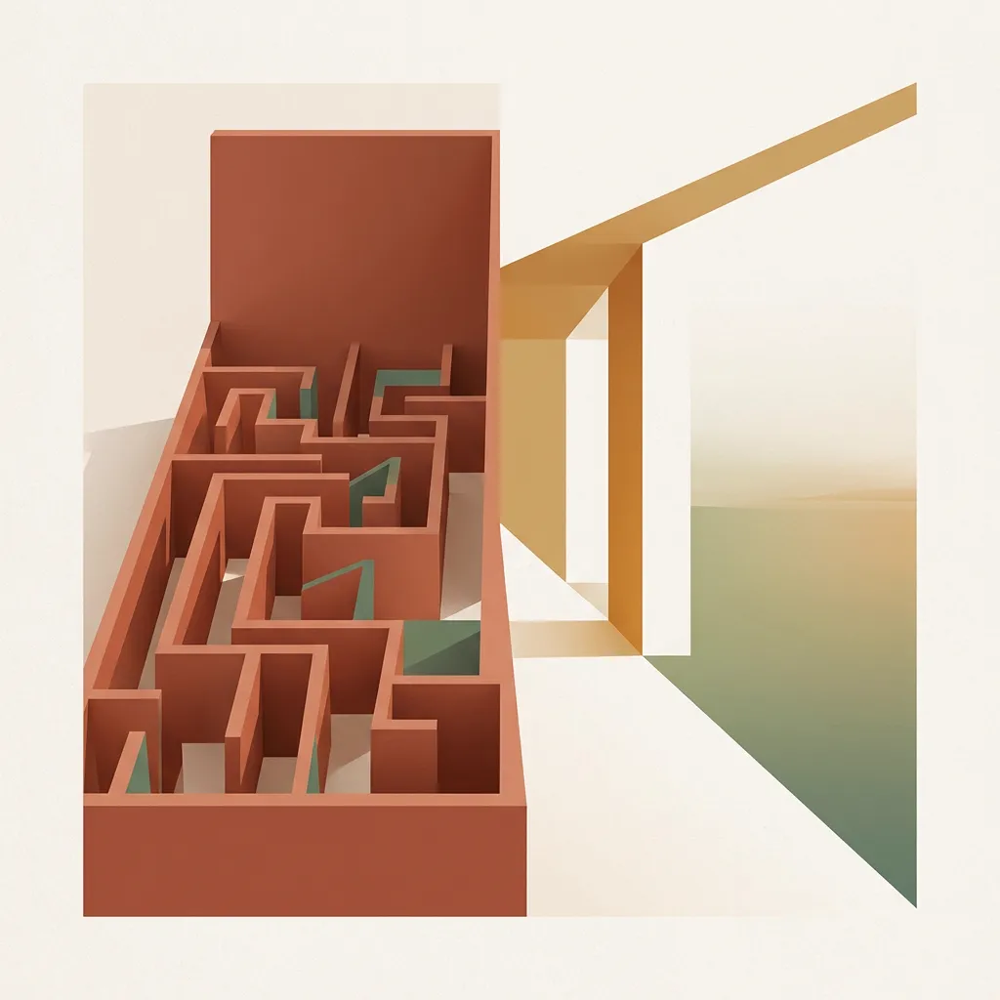
> **Scene**: 左侧是封闭式问题的迷宫死胡同，右侧是开放式问题打开的一扇大门
> **Text**: 探寻法则：用开放式场景撕开防御

**第二步：探寻（Exploration）**。
防御卸下后，开始切入。但切记，用非常**开放的、不带任何道德或倾向预设**的宽泛问题投石问路。
> [VISUAL]
> **Slide**: w03-slide-13c
> **Layout**: Comparison
> **Asset**: 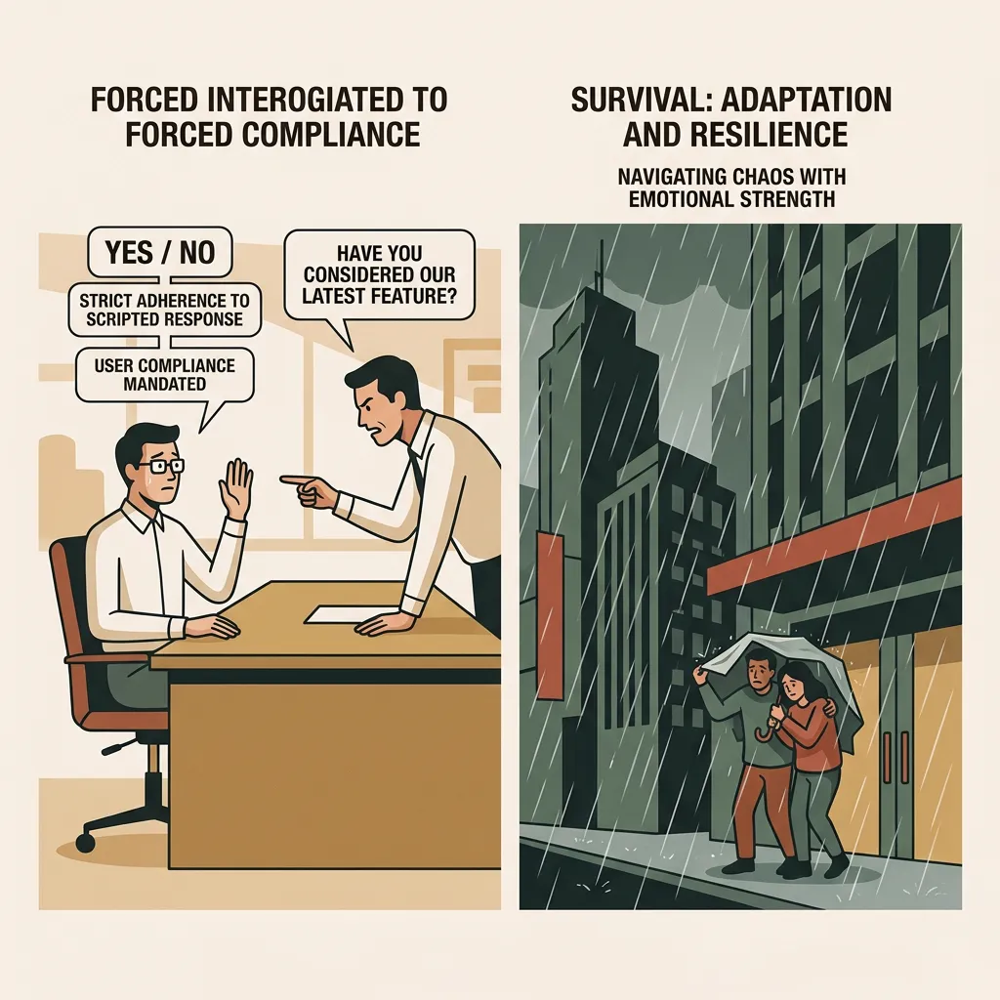
> **Scene**: 左侧是一个被产品经理逼问、只能像机器人一样被动回答“好/不好”的局促用户；右侧是一个身处暴雨CBD、充满戏剧冲突和情绪的求生画面
> **Text**: 探寻问题设计：封闭测试 vs 开放重现
> **List**: ❌ 封闭测试："觉得某某打车软件好用吗？" | ✅ 开放场景："上周暴雨瘫痪时，你在CBD是怎么挣扎回家的？"

请看大屏幕上这两组提问方式的鲜明对比。
❌ 左侧是毁灭式的**封闭式问法**。你用“好坏”强行设置了议程，用户只能像机器人一样机械应答。
✅ 右侧是收割式的**开放式场景问法**。你不设前提，直接把时空拉回极具冲突的物理现场，强制他重播一整段充满鲜活情绪的录像。

#### 2. 夺命连问：连续追问才能榨干伪需求背后的真恐惧

**第三步：剥洋葱（Deep-dive）——这是决定访谈质量的最核心环节**。
在这里，我们要开始深入挖掘。我们要动用丰田汽车在工业流水线上发明的工具：**连续追问 5 个 Why (5 Whys)**。
当用户在回答中抛出一个表象的抱怨节点时，绝不能就此停下记录。我们要紧盯不放，连续递进地问为什么，逐层剥开表象，直到找出最深层的动机。

> [VISUAL]
> **Slide**: w03-slide-14
> **Layout**: `Flow`
> **Asset**: 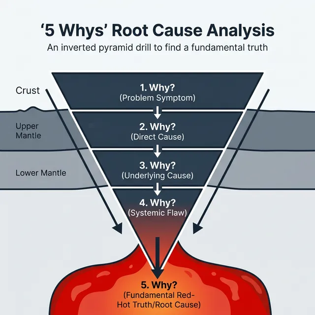
> **Scene**: 一个由表象尖端不断向下突破硬土层、深挖到地心岩浆的倒金字塔图例。每一次看似完美的回答，都是下一次无情"Why"的起跳点，直到触及红色的沸腾底层
> **Text**: 丰田 5-Why：榨干浮浅动机的致命剥洋葱法

我们要敏锐地识别并粉碎**企业级软件的伪效率陷阱**。这是剥洋葱的最佳试金石。

> [CASE STUDY: 5-Whys 榨干网盘伪需求的底层恐惧]
> 假设我们调研下一代网盘工具。受访的资深设计师抱怨："网盘上传进度条像蜗牛，每天传文件慢得我要崩溃！"

> [VISUAL]
> **Slide**: w03-slide-14_why1
> **Layout**: Split
> **Asset**: 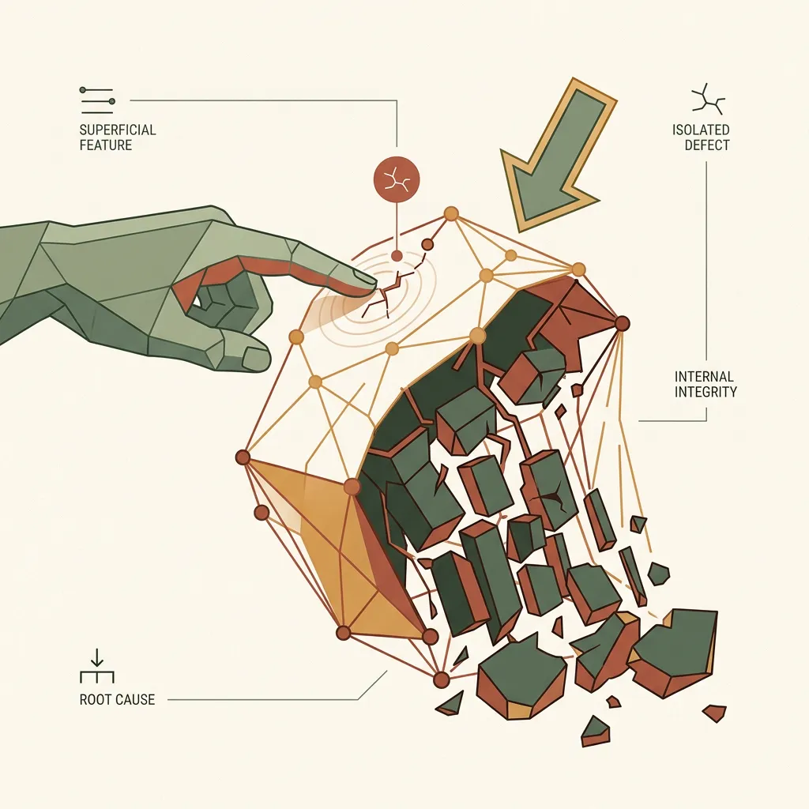
> **Scene**: 崩溃摔键盘的用户与只顾着记下"加个进度条"的平庸产品经理
> **Text**: 5-Why 追问的浅层陷阱：停留在代码故障层

这是一个典型的**表象需求**，即**"更快的马"**。如果听信这种伪需求陷阱，初级产品经理可能会立刻要求研发：增加机房带宽，优化多线程上传算法。然后错误地认为**大功告成**。
 
> [VISUAL]
> **Slide**: w03-slide-14_dialogue
> **Layout**: Center
> **Asset**: 
> **Scene**: 表面需求是"上传进度太慢"，对应第一层冰山
> **Text**: 致命 5-Why 实录：网盘伪需求的底层恐惧剥离

真正有效的深访，要敏锐地**锁定冲突瞬间**。不要关心代码出了什么 Bug，你要关心这个 Bug 是在什么**极端的物理场景**下触发的：

> [VISUAL]
> **Slide**: w03-slide-14_why2
> **Layout**: Split
> **Asset**: 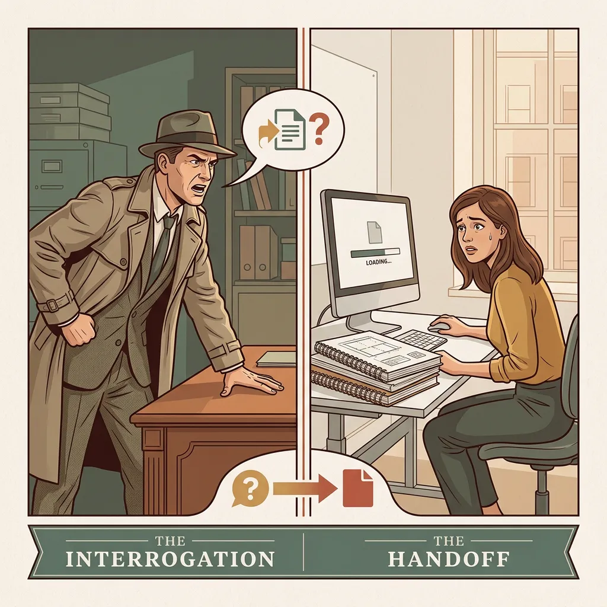
> **Scene**: 左侧是侦探步步紧逼询问“传什么文件”，右侧是焦躁的设计师正在缓慢上传几百兆的 PSD
> **Text**: 锁定高冲突现场：深挖“传文件慢”的源头
> **List**: 问："上次网盘让你愤怒时，你在传什么文件？" | 答："给甲方发几百兆的 PSD 源文件预览时。"

大家看屏幕，这是**追问一**：锁定高冲突物理场景。我们不去问网络环境，而是追问动作细节。
🗣️ 设计师回答：“给甲方发几百兆的 PSD 源文件预览时。”

> [VISUAL]
> **Slide**: w03-slide-14_why2b
> **Layout**: Split
> **Asset**: 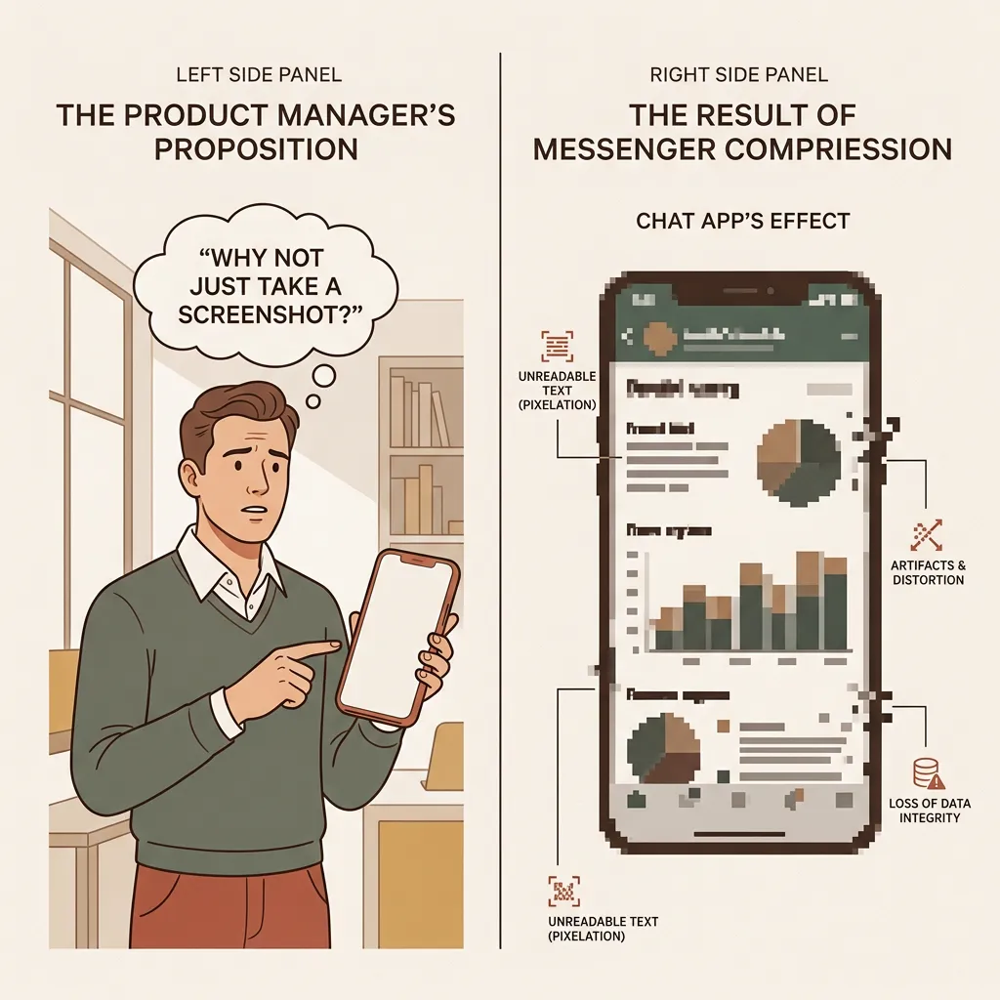
> **Scene**: 左侧是疑惑的产品经理询问为何不截图，右侧是微信里被无情压缩成马赛克的糟糕截图画面
> **Text**: 追踪断点：为什么常规的截图动作失效了？
> **List**: 问："仅仅看视觉效果，为何要传巨大源文件？" | 答："因为客户非要放大看细节，直接截图发微信会糊掉！"

接着是**追问二**：识别常规动作为何失效。
🎙️ 我们紧追不舍：“仅仅看视觉效果，为何要传巨大的源文件？”
🗣️ 他抛出了一个极其具体的物理断点：“因为直接截图发微信会被压缩糊掉。”

> [VISUAL]
> **Slide**: w03-slide-14_why3
> **Layout**: Split
> **Asset**: 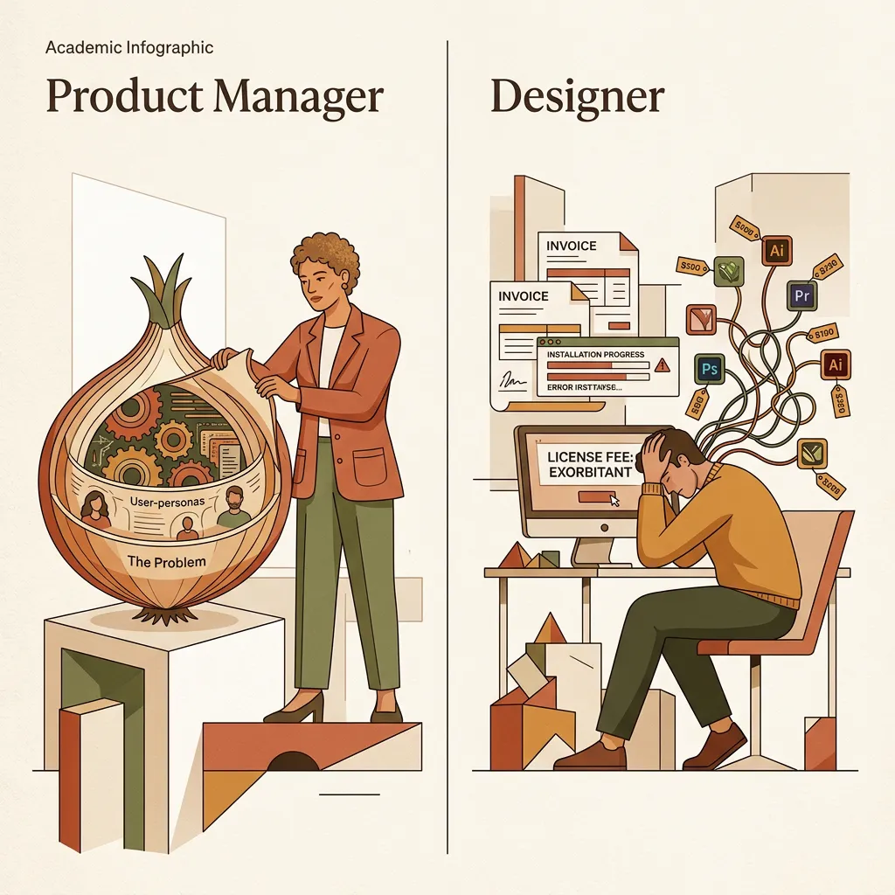
> **Scene**: 左侧是产品经理再次剥开一层表象，右侧是面对高昂正版软件费用和复杂安装流程而崩溃的设计师
> **Text**: 逼近真实动机：伪需求正式破裂
> **List**: 问："既然只为了看细节，为什么非要把核心源文件发给他？" | 答："因为没有其他免安装且低成本的高清大图查看方案！"

走到这里，**追问三**开始逼近真正的深层动机。
🎙️ 我们单刀直入：“既然只为了看细节，为什么非要把核心源文件发给他？”
🗣️ 答：“因为目前**没有其他免安装专业软件且低成本的查看高清大图方案**。”
请大家看屏幕上这段最终的对话反转。
> [VISUAL]
> **Slide**: w03-slide-14_why4
> **Layout**: Split
> **Asset**: 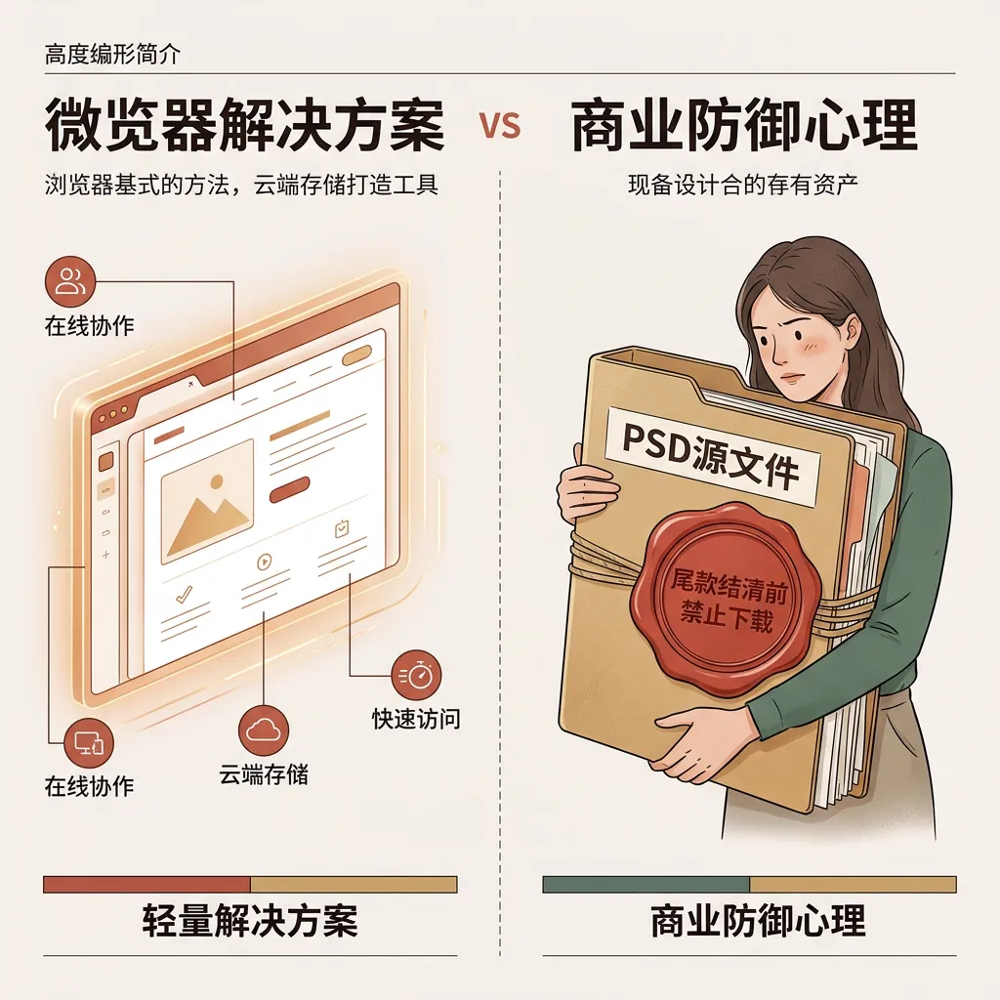
> **Scene**: 左侧是一个发光的浏览器网页链接界面（象征轻量解法）；右侧是一个死死把厚重的 PSD 源文件抱在怀里、文件上贴着巨大红色封条写着“尾款结清前禁止下载”的设计师（象征商业防御心理）
> **Text**: 连续追问的终点：击穿技术表象，挖出真实恐惧
> **List**: 问："如果给个网页链接就能看无损图呢？" | 答："太好了！我根本不想把源文件发给没付尾款的客户！"

🎙️ 当我们抛出**追问四**，给出一个“网页看无损大图”的解法假设时，设计师脱口而出的回答揭开了真正的冰山底座。
🗣️ 他说：“那太好了！其实我潜意识里**根本不想把源文件发给还没付尾款的客户**，发源文件是被迫妥协！”

这就是 5-Whys 追问的力量。在持续的引导下，关于“上传速度慢”的浅层技术抱怨坍塌了，用户卸下了防御，吐露了最真实的深层诉求。

> [VISUAL]
> **Slide**: w03-slide-14b
> **Layout**: `Full`
> **Asset**: 
> **Scene**: 冰山的表面被击碎，表层的"上传速度慢"碎裂成粉末，暴露出深海底层的隐秘痛点："源文件主权"
> **Text**: 这不是单纯的体验 Bug，这是深层心理安全感缺失

通过这连续的 5-Why 追问，我们发现核心痛点**根本不是"网盘上传速度慢"**，而是 **"缺乏一种既能高保真展示细节，又能捍卫创作者源文件主权的轻量交付方案"**。
如果团队耗费一年时间将网盘上传带宽提升一百倍，其实是在加剧设计师内心"害怕源文件被剽窃"的恐惧。只有深邃到这一层的洞察，才能催生出像 Figma 这种主打"基于全浏览器链接实时渲染，绝不泄露本地源文件"的跨时代协作工具。

在进入下一个技巧前，我们来做个快速检验，看看大家是不是真的掌握了 5-Whys 的发力方向。

> [ACTIVITY]
> **Type**: `Quiz`
> **Duration**: `2min`
> **Desc**: 情境诊断：5-Whys 的正确追问方向
> **Q**: 在一次针对网约车司机的访谈中，司机强烈抱怨：“你们这个抢单按钮太小了，我经常点不到！” 根据 5-Whys 追问法，你接下来的第一个问题最应该是以下哪一项？
> **Options**: A. “那您觉得我们把按钮的长宽各增加 20 像素合适吗？” | B. “您当时觉得按钮小的时候，是在什么具体的物理场景下操作的？” | C. “除了按钮太小之外，您还觉得界面上有其他难用的地方吗？” | D. “是不是因为您开车的时候没有戴眼镜导致看不清屏幕？”
> **Answer**: `B`
> **Explain**: 5-Whys 的精髓在于锁定“高冲突的物理场景”，而不是去探讨解决方案或横向发散。只有通过追问具体的物理场景（如：一边单手握方向盘高速行驶，一边要抢 0.5 秒就消失的优质订单），才能发现底层的真实痛点是“驾驶安全与抢单速度的极端冲突”，而非简单的 UI 尺寸问题。

#### 3. 物理还原：肌肉的场景重演能够直接戳穿言语伪装

> [VISUAL]
> **Slide**: w03-slide-15
> **Layout**: Flow
> **Asset**: 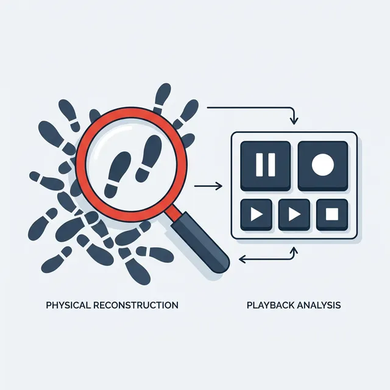
> **Scene**: 错综复杂的混乱脚印上放置着巨大的放大镜，旁边是一个暂停的录像机按钮。象征着案发现场的足迹强制物理重构
> **Text**: 场景重建：让用户在你的面前，把过去的动作重新做一遍

深访剥洋葱之后，我们来到**还原与收拢（Reconstruction & Wrap-up）**。

要想彻底还原真相，我们还需要配合场景重现的技巧。

> [VISUAL]
> **Slide**: w03-slide-14_wrapup
> **Layout**: Split
> **Asset**: 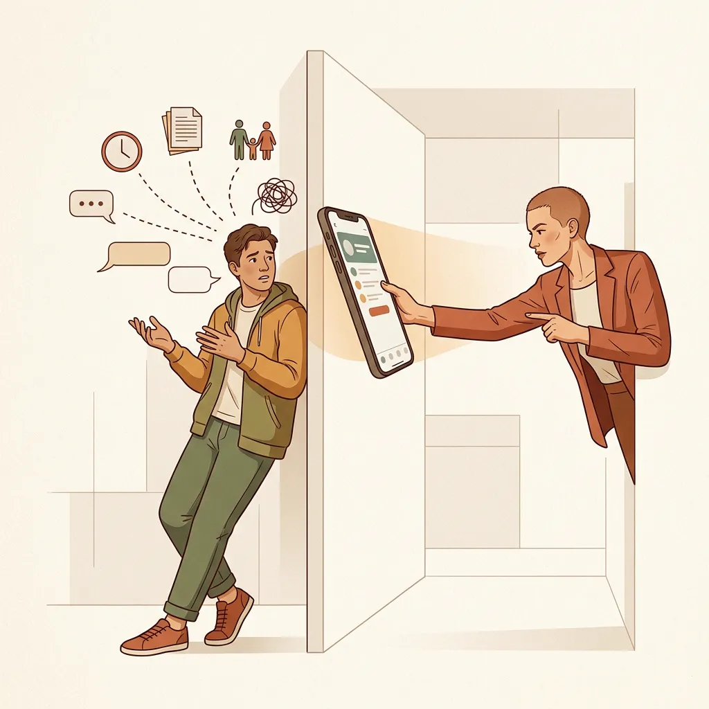
> **Scene**: 左侧是试图用编造谎言敷衍过关的用户；右侧是强硬的产品经理将一部手机直接推到用户面前，强制其重演
> **Text**: 记忆篡改对抗术：截断虚伪的高级反击
> **List**: 杀手锏话术："张先生先别说了。能不能现在就当着我的面，把你昨晚被卡住的过程，原封不动地重新操作一遍？"

这是面对记忆偏差时，对抗"Say-Do Gap"的有效方法。当受访用户开始为了面子编造，或者记不清细节用模糊的话搪塞时，你立刻打断他，抛出大屏幕上这句杀手锏要求。

这在定性调研中被称为"关键事件追溯（Critical Incident Technique）"。让用户掏出手机，向你真人演示他当时是怎么因为一个弹窗而彻底卡死的。人类的语义记忆是不可靠的，但当他们亲自接触真实屏幕时，手指的**肌肉记忆**会非常诚实地重播当时下意识的愤怒、困惑和妥协。就在他眉头再次下意识皱起的那一秒，你会抓到最真实的洞察。

> [VISUAL]
> **Slide**: w03-slide-15_magic_wand
> **Layout**: Split
> **Asset**: 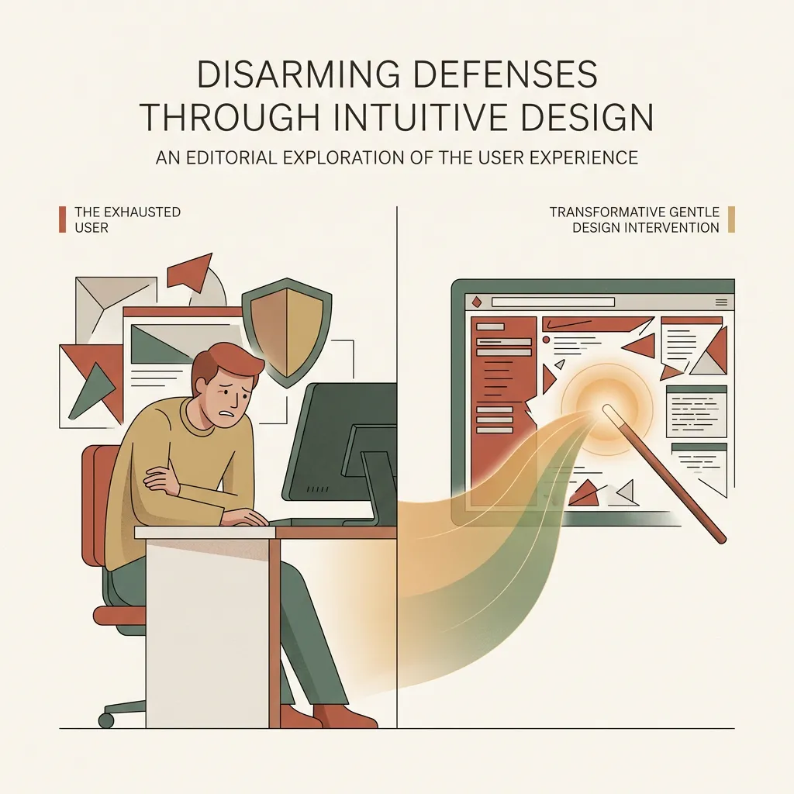
> **Scene**: 左侧是紧绷防御一整天的疲惫用户；右侧是一根散发着光芒的魔法棒轻轻点在极度难用的产品界面上，让其彻底卸下防备
> **Text**: 魔术棒测试：超越现实限制的终极欲望探测
> **List**: 终极试探："如果给你一根魔术棒，瞬间改变产品的一处体验（不考虑任何技术和成本），你会改哪里？"

访谈即将结束时，双方的精力消耗极大。作为缓解气氛的致谢，你可以抛出大屏幕上这句最后一个俗套但极其管用的“魔术棒测试”。

你要知道，抛出这个问题，并不是为了回公司照着他的方案开发，而是为了在访谈最后，用这种天马行空的方式，测出他**内心最渴望解决的痛点**究竟在哪。

**(Pause: 3s)**

> [VISUAL]
> **Slide**: w03-slide-15_activity
> **Layout**: Center
> **Asset**: 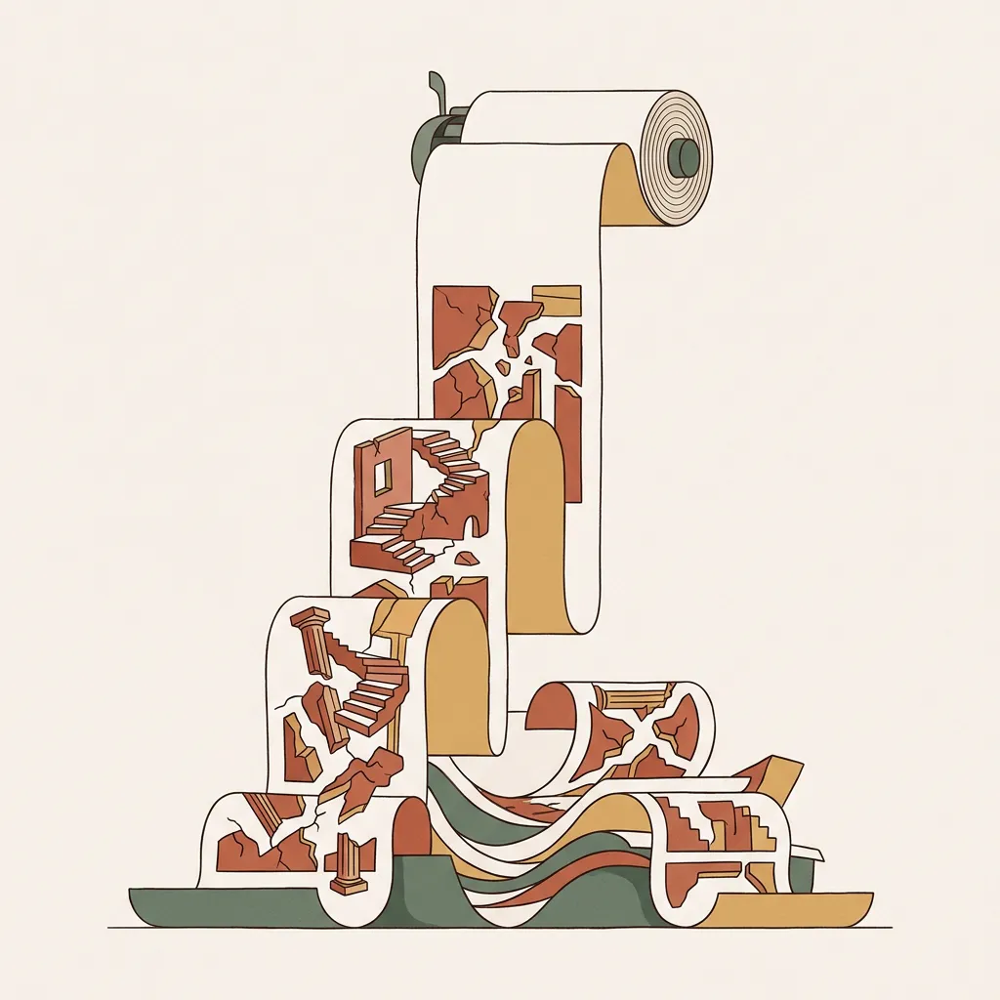
> **Scene**: 高速打字机的纸张上写满各种被驳回的提问方式
> **Text**: 实战演练：死亡提问极速诊断

> [ACTIVITY: 死亡提问极速诊断室]
> **Type**: `Practice`
> **Duration**: `5min`
> **Desc**: 快速甄别诱导性提问
> `操作`：请全场看大屏幕，屏幕上会依次打出三个在企业实战中高度真实、看似没有任何毛病的初级调研问题。我要求全场的各组学生代表，在 10 秒倒计时内，像找茬一样站起来大声指出其违反了定性调研的哪条致命红线。
> 问题 1："您平时使用我们 App 的功能频率高吗？您当时觉得这个最新体验到底如何？" 
> （**抢答痛批：高危复合错误！不仅一次抛出两个大问题，而且“高”的标准极其模糊。“体验如何”更是抽象，逼迫用户做文学评论，毫无执行价值。**）
> 问题 2（经典找死）："如果我们在接下来的大规模改版中，把这个底部的提交按钮变成显眼的红色，并且放大两倍字体，您觉得您在紧急情况下会更容易点击它吗？" 
> （**抢答痛批：这是要求人类预测未来的狂妄，叠加强烈的视觉心理幸存者偏差诱导。任何人都会对这种假设性的免费视觉增强说'会'，毫无任何事实基石。**）

刚才这两道题只是开胃菜。在真实的会议室里，有些高级产品经理会使用一种更为隐蔽、也更为恶毒的"潜意识绑架术"。请全班看着这张图，我们来进入今天最难的终极诊断。

> [VISUAL]
> **Slide**: w03-slide-15_diagnosis
> **Layout**: Split
> **Asset**: 
> **Scene**: 左侧是法官拿着惊堂木逼问，右侧是产品经理把"对吗"两个字像盗梦空间一样植入用户大脑
> **Text**: 潜意识绑架：剥夺用户说出荒谬真相的权利

> [ACTIVITY: 终极找死诊断]
> **Type**: `Practice`
> **Duration**: `2min`
> **Desc**: 潜意识绑架极速诊断
> 问题 3（潜意识绑架）："监控显示您上周五在这个购物结算页面停留了整整 5 分钟最后却狠心关闭了没有购买，是因为当时觉得那个附加服务费的价格太贵了超出了预算，对吗？" 
> （**抢答痛批：这是恶劣的潜意识绑架！调研员提前把“价格太贵”的预设强行塞进用户嘴里。一句“对吗”，彻底剥夺了用户说出真实物理原因（如“选卡控件在 iOS 上鬼畜抖动根本点不中”）的机会！**）

这就是定性调研的意义所在。不要依赖冰冷的量化问卷，而是去剖析真实场景中活生生的用户摩擦。

然而，哪怕你完美执行了观察与访谈，你收集到的依然只是一堆**孤立的现象**——比如用户抱怨上传慢、护士贴密码纸。这些零散的现象本身无法直接指导系统功能的设计。它们只是未经提炼的原始素材。要让这些现象转化为切实可行的产品策略，我们必须引入一套**结构化的需求分析工具**。

> [VISUAL]
> **Slide**: w03-slide-15b
> **Layout**: Split
> **Asset**: 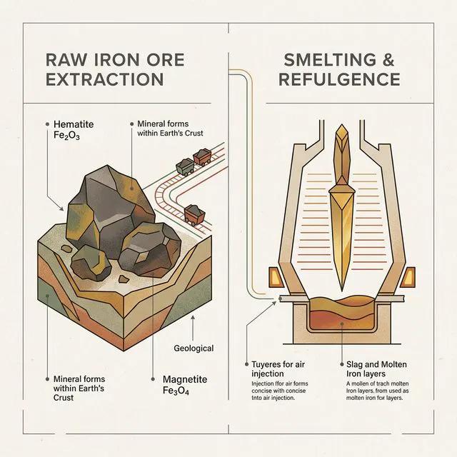
> **Scene**: 左侧是刚搜集回来的零碎原矿石；右侧是经过高温冶炼后，流出非常纯净的金属溶液
> **Text**: 现象只是素材，经结构化提炼方能指导设计

接下来，我们将进入一套关键的商业分析模型，它能把杂乱的现象系统性地提炼为精准的市场切入点。

这套框架就是 **Jobs-to-be-Done (JTBD) 断点分离框架**。
