## 模块 4: 讲授二——JTBD 框架与需求的维度剥离 (35 min)

<!-- BUDGET: 5400 chars | SLIDES: ≥10 | STATUS: done -->

> [VISUAL]
> **Slide**: w03-slide-16
> **Layout**: `Center`
> **Asset**: 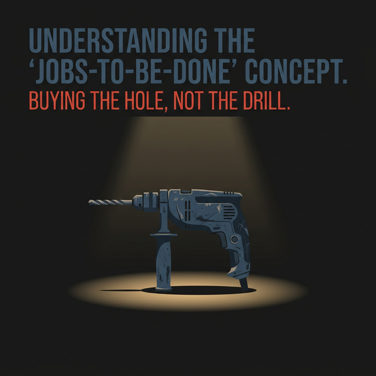
> **Scene**: 漆黑的背景上，只亮着一盏昏黄的聚光灯，照亮了一把孤独的、满是伤痕的工业电钻
> **Text**: JTBD (Jobs-to-be-Done)：从"卖电钻"到"买墙洞"

### 4.1 JTBD法则：用户只雇佣能解决眼前麻烦的产品

商业史上有一句被广泛引用的名言，来自哈佛商学院教授西奥多·莱维特（Theodore Levitt）："人们其实根本不想买一个四分之一英寸长的电钻，他们只是想要一个四分之一英寸宽的墙洞。"

这句话是整个 **Jobs-to-be-Done (JTBD)** 方法论的灵魂发源地。
中文世界通常将其翻译为"**目标导向的待办任务**"。它的核心观念极为犀利：永远记住，用户根本不在乎你的产品、使命或华丽功能。

他们在乎的唯一一件事是：在生活的某个特定时刻遇到了麻烦，需要走进市场，**Hire（雇佣）** 你的产品来帮他们完成任务。

在这个临时契约中，一旦任务完结，或者他们发现了更高效的竞品，就会毫不犹豫地将你的产品 **Fire（解雇）**。

> [VISUAL]
> **Slide**: w03-slide-16_fix1
> **Layout**: Split
> **Asset**: 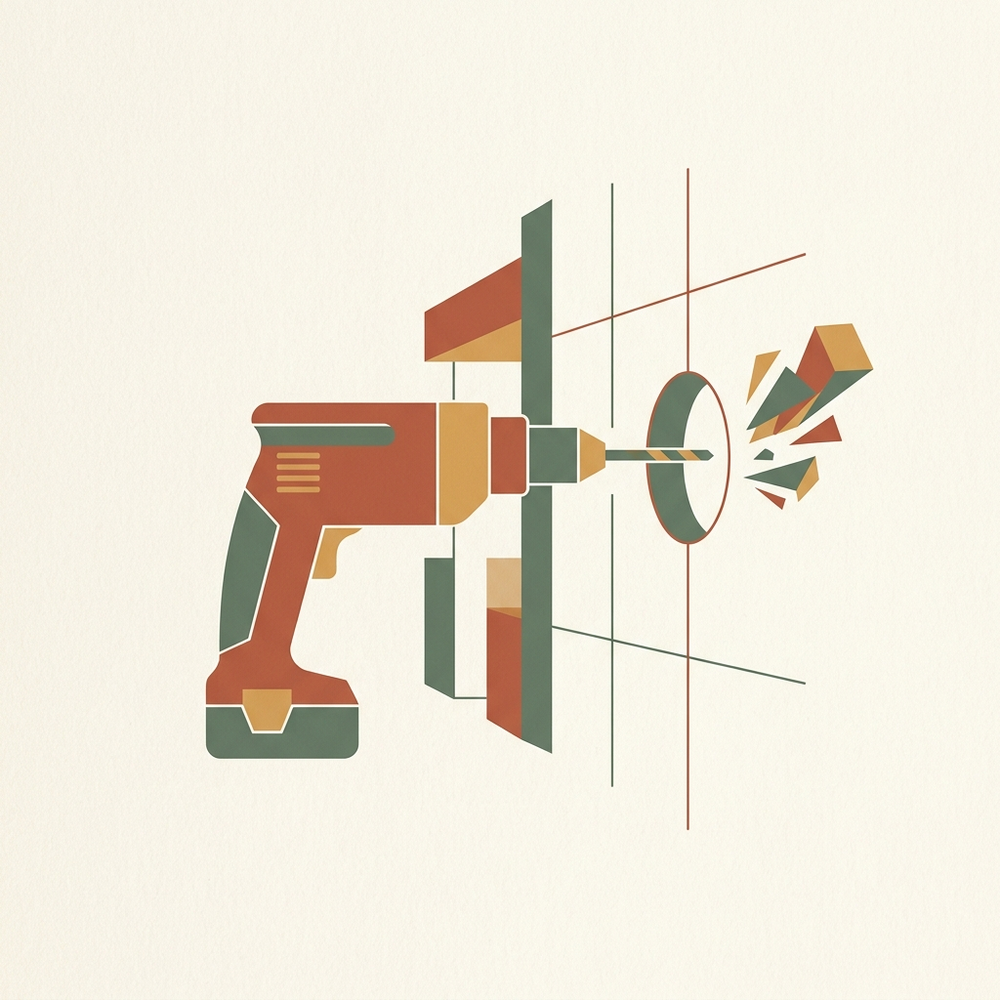
> **Scene**: 用户拿着电钻，注视着墙上必须打出的圆洞，电钻仅被视为耗材
> **Text**: 经典 JTBD 隐喻：没人想买四分之一英寸的电钻

这也就意味着，当你接手一个产品需求，比如"我们要给这个电钻增加一个蓝牙联网功能"，或者"我们要把电钻的外壳换成粉色"时，你真正的考量绝不是"这些功能酷不酷"，而是："当用户需要打一个完美的墙洞时，蓝牙和粉色能帮上什么忙吗？"

传统的视角是怎么做产品的？他们常常盯着产品特征（Features）和人口统计学（Demographics）数据。比如典型的立项报告："我们要为 25-35岁、年薪20万的白领女性开发一款高浓度玻尿酸面霜。"

这种表面宽泛的描述，在真实的购买决策面前缺乏解释力。她花掉半个月工资买面霜的真相，未必是因为"玻尿酸"。而是因为她明天要参加前男友的婚礼，那一刻唯一的"待办任务"是：**"我必须雇佣这个产品，让我在明天的场合展现出最佳状态。"**

> [VISUAL]
> **Slide**: w03-slide-16_fix2
> **Layout**: Center
> **Asset**: 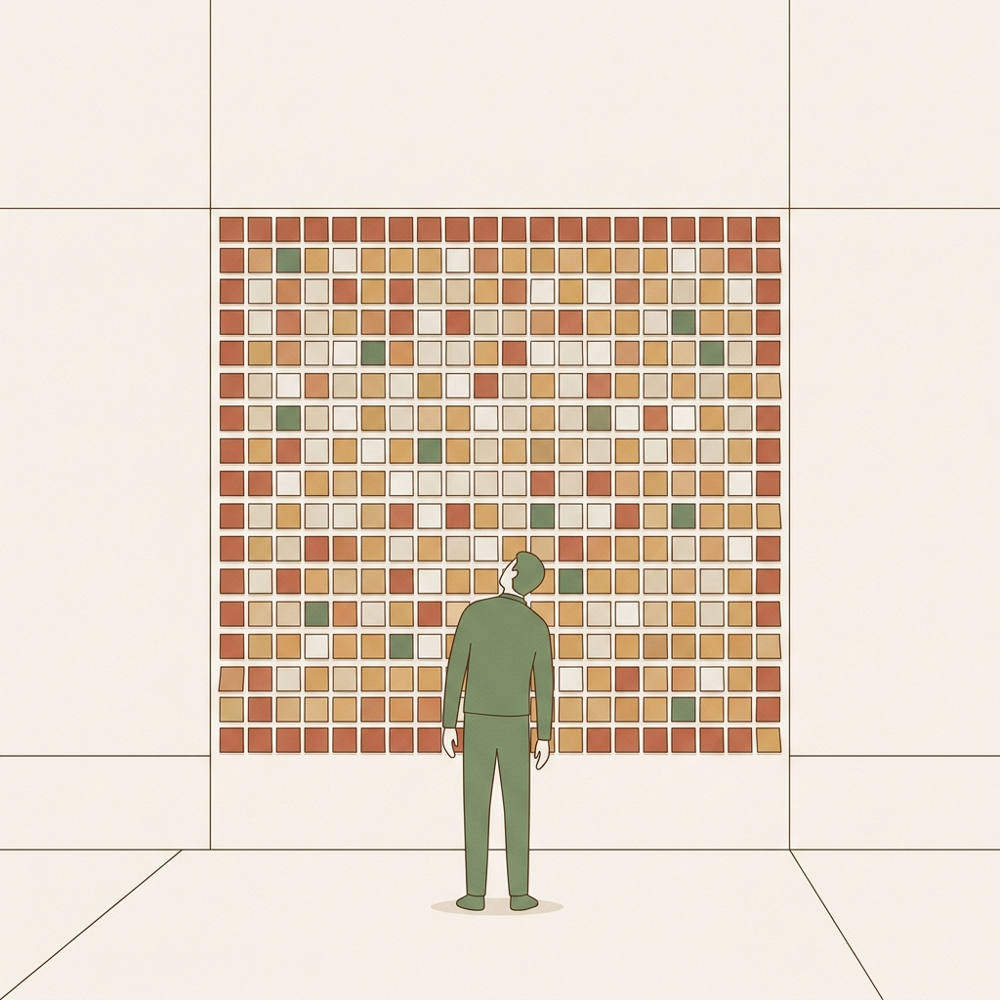
> **Scene**: 产品经理盯着满满一墙的产品功能特征便利贴
> **Text**: 堆砌功能特征无法触及痛点核心

这就是 JTBD 的威力。它强行剥离产品的物理表象，直接切入用户在特定情境（Context）下的真实诉求。如果你还对着墙上的产品功能清单沾沾自喜，那你永远无法触及用户的真实痛点。

为了让大家更直观地感受这套理论的商业爆发力，我们来看一段珍贵的影像资料。将 JTBD 推向商学院神坛的，是哈佛教授克莱顿·克里斯坦森（Clayton Christensen）。

> [CASE STUDY: 克莱顿·克里斯坦森与那杯麦当劳奶昔]
> 这也是整个 **JTBD 理论体系**中最不可错过的第一手真实调研原声。

> [VISUAL]
> **Slide**: w03-slide-16_christensen_milkshake
> **Layout**: Video
> **Asset**: 
> **Source**: Video — Clayton Christensen 原声第一手资料
> **Duration**: 07:10
> **TimeCategory**: activity
> **Scene**: 克莱顿·克里斯坦森教授完整讲述《奶昔营销》的真实调研案例。
> **Text**: 第一手资料补充：奶昔是被"雇佣"来打发通勤时间的

> 这段视频展示了他当年接到跨国快餐巨头求助时的破局过程。餐厅当时下达了硬性指标，希望提高**奶昔**的单店销量。按照常规做法，他们找来经常购买奶昔的顾客做焦点小组访谈："您想要更浓稠一点的奶昔吗？还是更甜的？或者是想要加入更多果肉碎片？"
> 拿到调研数据后，公司花费数月改良了配方，推出了更浓、更甜、更丰富的奶昔。结果产品上市后，销量毫无起色。
 
> [VISUAL]
> **Slide**: w03-slide-17b
> **Layout**: Split
> **Asset**: 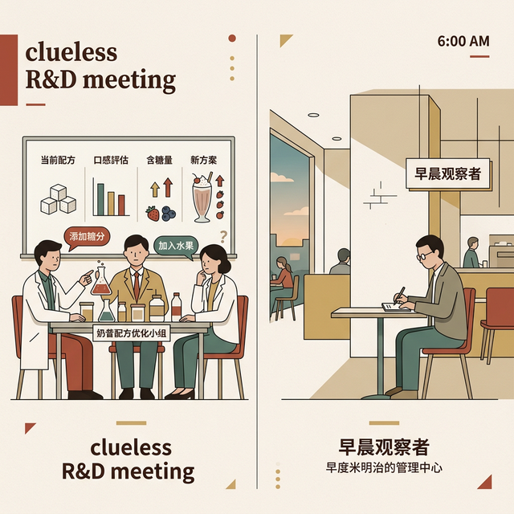
> **Scene**: 左侧是试图通过加糖加果肉来"优化配方"的研发会议；右侧是早上六点多，观察员坐在餐厅角落记录
> **Text**: 放弃问卷，回归田野观察
> 
克里斯坦森的团队接手后，叫停了盲目的配方优化，转而派出观察员坐在餐厅记录早高峰顾客的行为。
很快，他们发现了一个反常现象：**将近一半的奶昔是在早上 8 点半前售出的。**这批通勤者通常只买一杯奶昔，且从不在店里喝，而是直接带着杯子钻进汽车，驶入早高峰车流。

> [VISUAL]
> **Slide**: w03-slide-18
> **Layout**: Flow
> **Asset**: 
> **Scene**: 拥堵的高速公路上，一名司机一边单手握着方向盘，一边用吸管喝着一杯浓稠的奶昔
> **Text**: 破案："雇佣"奶昔去对抗漫长无聊的早高峰通勤

你看，当我们将视野从"食品配方"拉升到"**通勤时间杀手**"时，整个商业逻辑就被彻底颠覆了。产品研发的焦点不再是糖分和水果，而是如何极致地满足**消耗无聊时间**这个底层的 **JTBD 核心任务**。

> [VISUAL]
> **Slide**: w03-slide-17_fix1
> **Layout**: Center
> **Asset**: 
> **Scene**: 凌晨的高速公路与通勤司机
> **Text**: 第一段奶昔故事的启示：产品是为了消磨漫长的通勤

> [CASE STUDY: 麦当劳奶昔的下半场革命]
> 洞察到此并没有结束。观察员第二天早上在路口拦住了这群通勤者："您今天早上为什么要**雇佣**这杯奶昔？"
> 调研揭示了真相：这些通勤者面临着长达 30 分钟到一小时、枯燥乏味的高速公路驾驶任务。他们需要在保持专注的同时，找一件能单手操作、打发无聊时间的事情。最关键的是，吃下去后必须有饱腹感，能让他们抗饿撑到中午。
>
> 竞争对手是谁？在这个特殊的时空场景下，竞争对手根本不是其他品牌的奶昔，也不是咖啡！
 
> [VISUAL]
> **Slide**: w03-slide-18_alt
> **Layout**: Grid
> **Asset**: 
> **Scene**: 香蕉、甜甜圈、干贝果面包三种食物在车厢内的尴尬食用场景
> **Text**: 竞争对手根本不是其他奶昔
> **List**: 香蕉：吃得太快 | 甜甜圈：弄脏方向盘 | 贝果：太干难以下咽
> 
通勤者曾尝试"雇佣"香蕉，但一分钟就吃完了；尝试过甜甜圈，却弄脏了方向盘；也尝试过干贝果，但没有水难以下咽。
> 
只有浓稠的冰镇奶昔完美解决了痛点：浓稠导致需要 20 多分钟才能吸完，完美消磨了通勤时光；杯子能稳放车内不洒出；高热量还提供了早晨所需的饱腹感。
> 
基于这个洞察，餐厅彻底推翻了最初的计划，**完成了一次经典的产品反向重构**。

> [VISUAL]
> **Slide**: w03-slide-18b
> **Layout**: `Comparison`
> **Asset**: 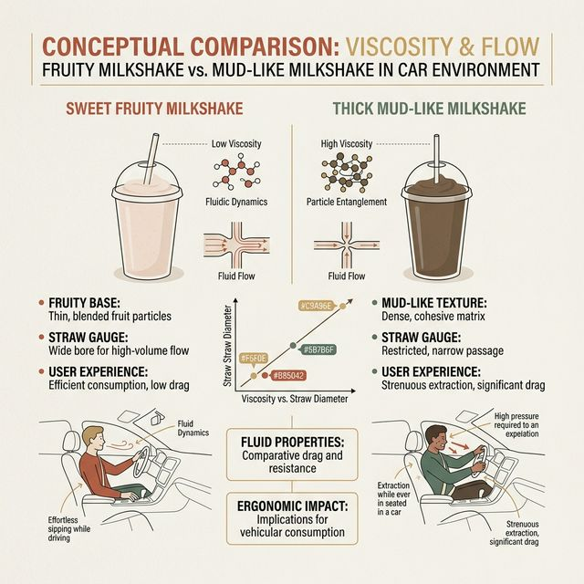
> **Scene**: 对比图。传统解法思维：把奶昔变甜、加果肉；JTBD解法：让奶昔变粘稠，配细吸管，以及快取车道
> **Text**: 颠覆直觉的重构：为填补无聊时间而生的反向设计
> **List**: 传统解法: 变甜加果肉 | JTBD解法: 浓稠加细吸管与快取车道

> 改良方案精准且反直觉：让早上的奶昔变得**更加浓稠**（核心目的是延长单次吸吮时间），配备一根**更坚固但孔径更小的细吸管**，并且直接把奶昔机搬到了点餐台最前面，打通 Drive-Thru 车道，让通勤者能瞬间拿走。结果，销量迅速暴涨。

这，就叫看透了用户的 **Job to be Done (待办任务)**。在 JTBD 视角下，产品不再是一杯甜品，而是帮助驾驶员消磨 30 分钟无聊早高峰的解决方案。

但这只是第一层，我们还需要向心理学的更深处挖掘。

> [VISUAL]
> **Slide**: w03-slide-19
> **Layout**: `Split`
> **Asset**: 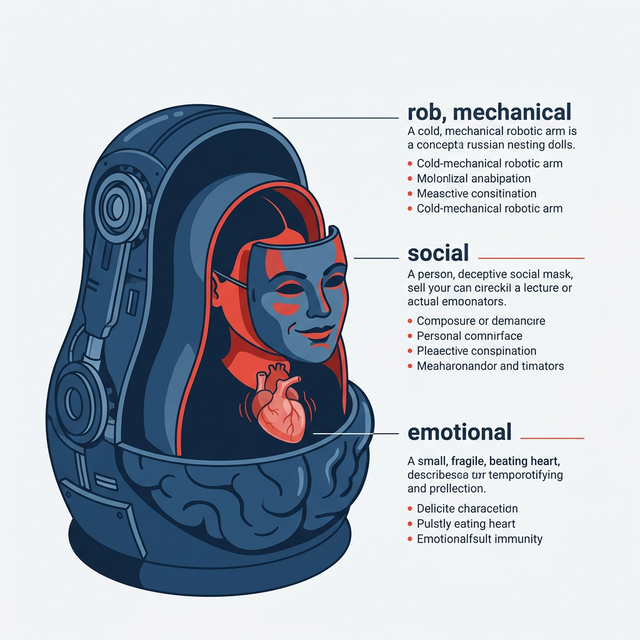
> **Scene**: 用户大脑皮层的三维分解图，如同俄罗斯套娃：最外层是机械臂（功能），中间层是戴着面具的人（社会），最深层是一颗跳动的心脏（情感）
> **Text**: 需求的三维解绑：功能、社会与情感
> **List**: 1. 功能性（Functional） | 2. 社会性（Social） | 3. 情感性（Emotional）

这三个维度如同套娃般层层包裹：最外层是功能满足，中间层是社会人设，最深处则是安抚隐秘的情感恐惧。因此，优秀的交互设计师绝不能只盯着产品参数，而必须**像心理学家一样洞察用户完整的生活主线**。

> [VISUAL]
> **Slide**: w03-slide-18_fix1
> **Layout**: Center
> **Asset**: 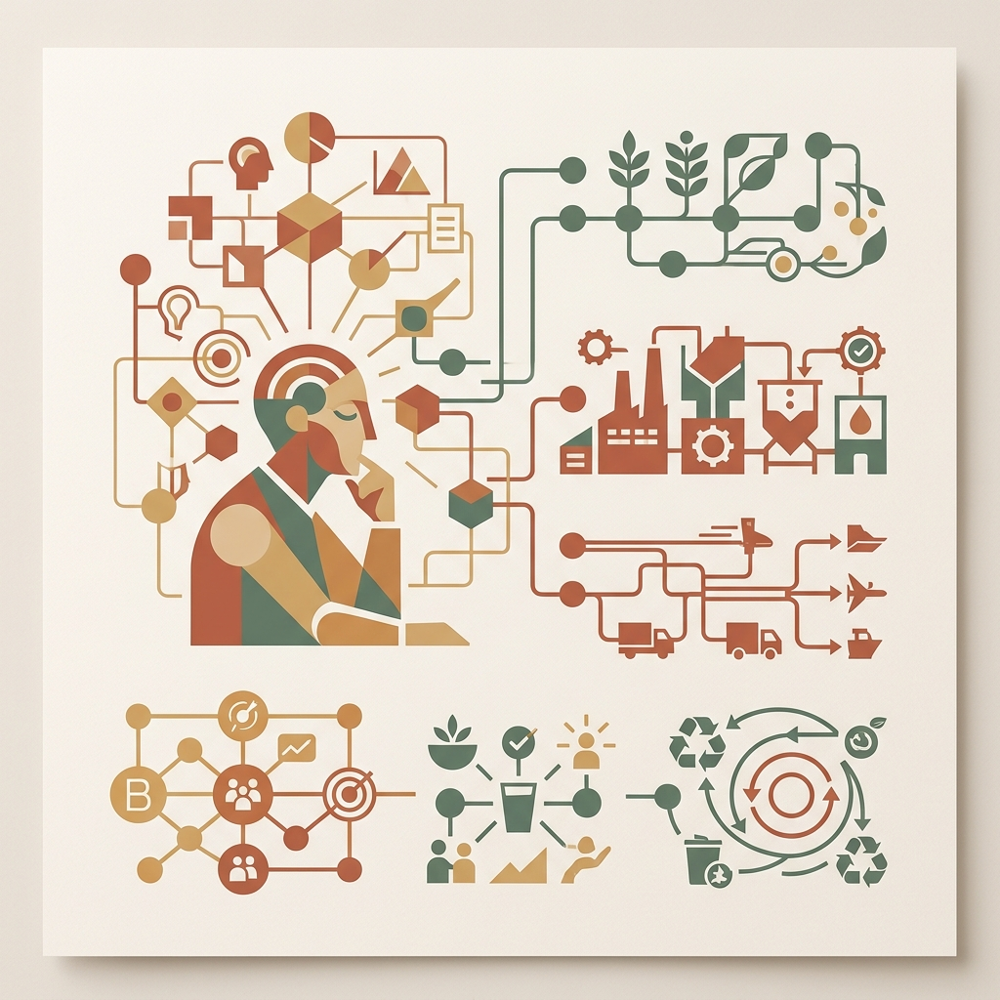
> **Scene**: 产品经理必须跳出"喝"这个动作，思考整个生命周期
> **Text**: 不要盯着"奶昔"，盯紧用户的"生活主线"

> [ACTIVITY]
> **Type**: `QA`
> **Duration**: `1min`
> **Desc**: 麦当劳奶昔案例的本质反转点
> 提问："为什么买甜甜圈不行？奶昔解决的'雇佣'任务本质上是什么？"（引导答出：打发时间和提供饱腹感，而非口味）

### 4.2 三维解绑：购买决策受制于三层动机

如果在座的各位听完奶昔的故事后，只记住了"能吸多久"这个单一的**功能性满足**，那就把人机交互的深度看得太简单了。
人类作为高度社会化的群居动物，在掏钱雇佣一个产品时，大脑会同时进行**三个维度的考量**。

#### 1. 功能底线：物理可用性只是维持生存的基础门槛

> [VISUAL]
> **Slide**: w03-slide-19_functional_failure
> **Layout**: Split
> **Asset**: 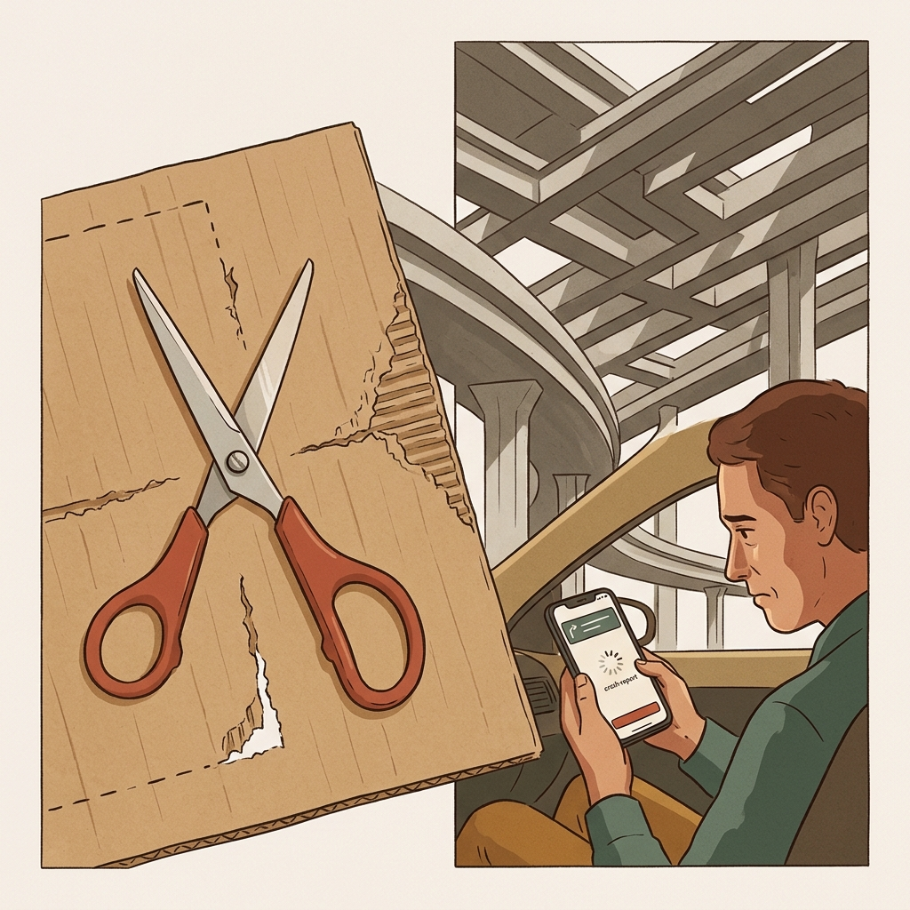
> **RenderMode**: themed
> **Scene**: [Emotional/Psychological Tension: frustrating, broken, dead-end] 左侧是一把在剪纸板时直接从转轴处崩裂的廉价剪刀；右侧是在迷宫般的陌生高架桥下，司机绝望地看着手机导航 App 突然宕机死屏的画面。
> **Keywords**: broken scissors, navigation app crash, frustrated driver
> **Text**: 维度一：功能底线 (Functional Job)
> **List**: 物理可用性 / 保底生存线 / 无竞争壁垒

**第一层，也是最基础的底线，是功能性任务（Functional Job）。**这是维持一个产品不被抛弃的**保底生存维度**。这把剪刀能不能顺滑地剪开纸板？这款地图导航能不能在最短时间内规划出最优路线？
如果基础功能失效，所有的用户体验都将无从谈起。然而，在技术高度成熟的当下市场，绝大多数竞品都能做到功能及格。因此，单纯的可用性永远无法形成真正的**竞争壁垒**。

#### 2. 社交假面：产品必须维护用户的社会人设

> [VISUAL]
> **Slide**: w03-slide-20_social
> **Layout**: Split
> **Asset**: 
> **Scene**: 维系社交体面的虚荣面具
> **Text**: 维度二：社交假面 (Social Job)
> **List**: 维护社会人设 / 面子文化 / 阶层宣告

**第二层，是维持体面的社会性任务（Social Job）。**这是每一个处于社会网络节点上的用户，在按下"下单付款"按钮前，潜意识深处对自己的那句致命拷问：**"如果我今天使用了这个产品，我在圈子里看起来会是一个什么样形象的人？"**
我们为什么放着结实耐磨的帆布包不买，去买昂贵且容量极小、毫无倒角的所谓奢侈品手袋？因为她真正雇佣的社会属性是："我必须让今晚晚宴上的前同事们第一眼就确认，我已经脱离了十年前寒酸的底层阶层"。
在许多市场环境下，受**面子文化**影响，**社会性任务**的权重往往会超越单纯的功能性任务。

#### 3. 情感幽灵：最高壁垒是提供安全感与掌控感

> [VISUAL]
> **Slide**: w03-slide-20_emotional
> **Layout**: Split
> **Asset**: 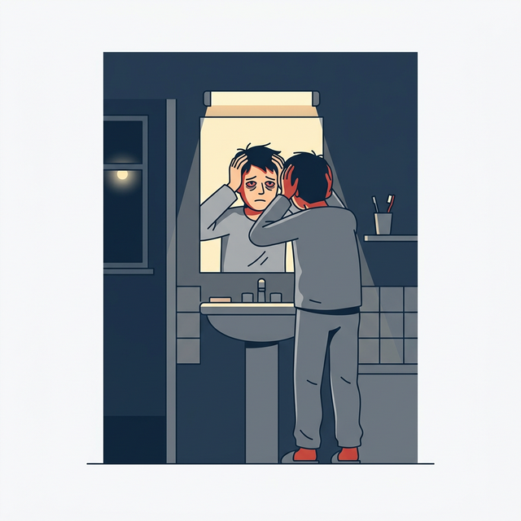
> **Scene**: 极度孤独、灯光暗淡的凌晨三点浴室里，一个人卸下所有防备站在镜子前，深深地凝视着自己布满血丝和绝望疲惫的双眼
> **Text**: 维度三：情感幽灵 (Emotional Job)
> **List**: 缓解隐秘恐惧 / 避免失控焦虑 / 建立最高壁垒

**第三层，也就是最深处的内核，是极其隐蔽的情感性任务（Emotional Job）。**这种在深夜里凝视自己、不愿被任何人看到的脆弱，就是情感任务的绝对内核。无论是害怕在同事面前显得愚蠢的焦虑，还是担心被时代淘汰的恐慌，**缓解隐秘的恐惧与失控感**，是卓越产品建立**极高替换成本**的秘密。

在褪去外部的社交面具后，这是用户在私密层面的核心诉求。当他们使用产品时，潜意识深处在寻找一个答案：**"在使用这个系统时，我是感受到了一丝踏实的安全感，还是面临失控边缘的焦虑感？"**
提供免于失控的**掌控感**，是产品获得用户深度信任的**最高壁垒**。

> [CASE STUDY: 医疗器械面板上的 B 端终极尊严]
> 让我们跳出消费品软件，来看一个严肃的医疗 B 端系统案例。
> 假设你们团队中标了，要在接下来的一年里，重新设计下一代精密、价值上千万美元的"达芬奇"外科手术机械臂的中央触控监控大屏系统。

> [VISUAL]
> **Slide**: w03-slide-20_medical_func
> **Layout**: Center
> **Asset**: 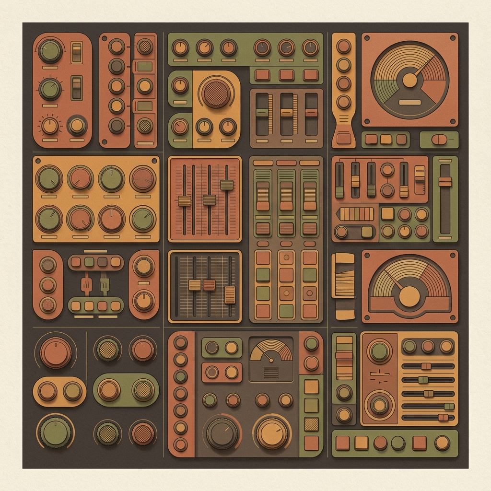
> **Scene**: 8K分辨率下放大显示微小血管断层的高科技屏幕
> **Text**: 【功能维度】绝不允许一微米的漂移

> 首先，**它的功能性任务**要求：在超高 8K 分辨率下零延迟地显示微小血管断层，机械臂必须精准跟随主刀医生的指令，确保无偏移的物理精确度。这直接关乎患者的生命安全。

> [VISUAL]
> **Slide**: w03-slide-20_medical_social
> **Layout**: Split
> **Asset**: 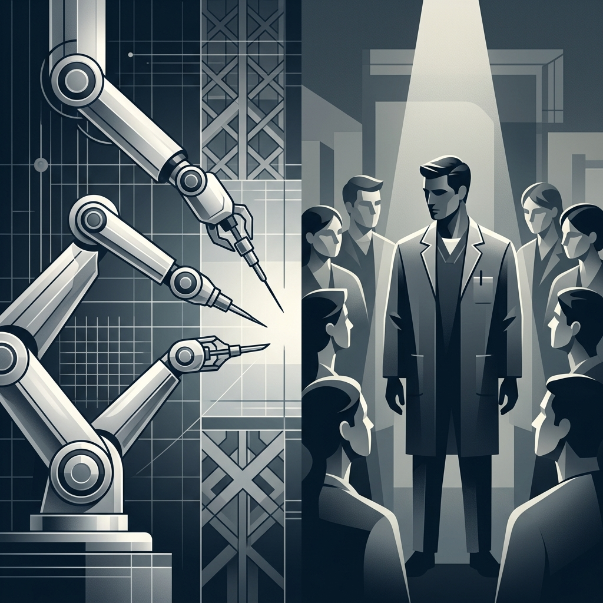
> **Scene**: 左侧是复杂精密的机械臂操作，右侧是主刀医生被一群实习医生崇拜注视的急诊室场景
> **Text**: 【社交维度】维持顶级精英的绝对掌控力

**那它的社会性任务呢？** 在这扇全凭专业技术的外科手术室大门内，依然存在社会性："作为顶级三甲医院的主刀大夫，当实习医生们围观我的操作时，我不能因为找不到菜单而显得手忙脚乱！总控屏幕极简清晰的 UI，必须能完美彰显我作为主刀医生的**专业掌控力**！"

> [VISUAL]
> **Slide**: w03-slide-21
> **Layout**: `Comparison`
> **Asset**: 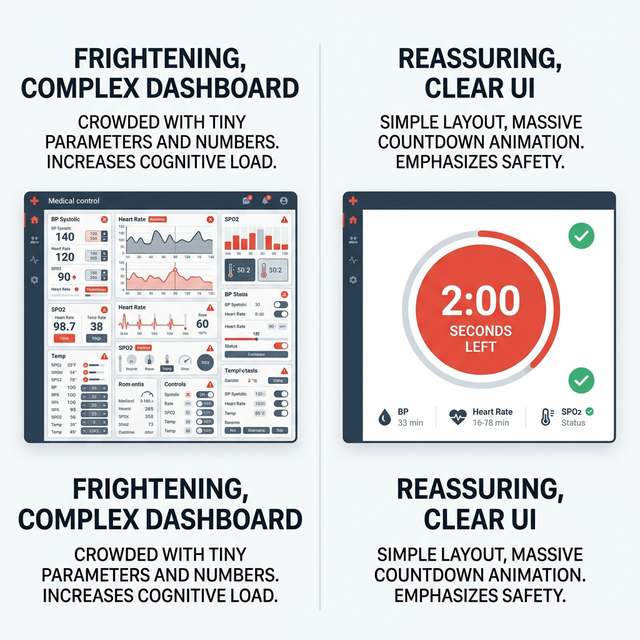
> **Scene**: 医疗控制端对比：左侧是密密麻麻参数的仪表盘，右侧是带有防误触确认界面的清晰 UI
> **Text**: 【情感维度】建立安全感与掌控力
> **List**: 传统仪表盘: 密集恐惧 | 改进版 UI: 防误触确认

> 那么**最核心的情感性任务**呢？这是主刀医生对操作失控的潜在担忧。在这个系统深处，情感性任务是："请在这个高压手术中，用稳定可靠的反馈机制，给我一种安全感，让我确信自己能完全掌控机器，**不用担心误操作带来的医疗事故**。"

当你们学会用这三个维度重新审视需求列表时，就会意识到：我们在屏幕上设计的每一个微小交互、撰写的每一行安抚文案，本质上是在**回应用户高压下的情绪起伏，建立人机信任的最高壁垒**。

> [VISUAL]
> **Slide**: w03-slide-21_fix1
> **Layout**: Center
> **Asset**: 
> **Scene**: B端系统操作界面与紧张的用户
> **Text**: 多维解绑的商业终极意义

所以在极其理性的 B 端企业级设计中，情感维度的尊严依然不可妥协。如果你让一个高管在使用系统时显得像个连按钮都找不到的白痴，那么无论你的系统性能多高，他都会在下次续费时毫不犹豫地将你解雇。这，就是**多维需求解绑**的终极商业意义。

> [VISUAL]
> **Slide**: w03-slide-22
> **Layout**: Grid
> **Asset**: 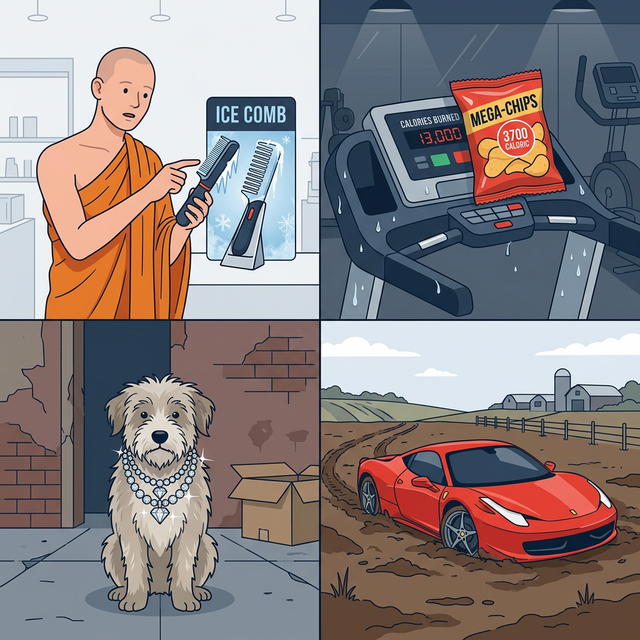
> **Scene**: 四宫格展示违和的产品场景实验：左上是试图把木梳卖给寺庙里的和尚，右上是一个大汗淋漓的健身房跑步机面板上放了一包高热量薯片，左下是一根昂贵的宝格丽钻石项链戴在一只流浪宠物狗脖子上，右下是一辆拉风的法拉利跑车卡死在积满泥水的农村下雨农田里
> **Text**: 致命前置：情境（Context）决定了一切高级功能的生死
> **List**: 场景1: 把木梳卖给和尚 | 场景2: 跑步机上面吃薯片 | 场景3: 宠物狗戴钻石项链 | 场景4: 法拉利陷在泥地

### 4.3 环境制约：情境（Context）能瞬间逆转需求

我们刚才拆解了用户雇佣产品时的三大维度，但包裹在这三个维度之上，还有一个能一锤定音的系统级变量：**情境（Context）**。

在交互体验法则里，脱离了用户所处的具体时间、物理地点以及心理状态去谈需求，所有的功能推演都只是**纸上谈兵**。
比如最简单的："购买一杯咖啡"。如果此时的情境是"早上拥挤的地铁站出口、距离打卡时间还剩 3 分钟冲刺"。那这位打工人的核心痛点只有一个：**极速交付与免密刷脸支付**。哪怕杯盖略微盖斜了他也不会在意。

> [VISUAL]
> **Slide**: w03-slide-22_coffee
> **Layout**: Comparison
> **Asset**: 
> **Scene**: 左侧是焦急看表在冷雨中等咖啡的迟到打工人，右侧是阳光明媚的下午在户外悠闲喝拉花咖啡的约会情侣
> **Text**: Context 的致命反转：时间、地点与情绪状态重塑了痛点
> **List**: 场景一：极限通勤 (极速交付) | 场景二：悠闲约会 (阶层质感拉花)

但是，如果情境切换，变成了"周六阳光明媚的下午两点、坐在高级街角咖啡馆的户外椅上、进行重要的约会"。这个时候，出杯速度就不再是核心痛点了。他极度需要的是：**穿着刺绣围裙的咖啡师优雅的拉花动作，以及一杯端在手里能彰显自己审美品位的精致咖啡**。

如果你的系统不能因地制宜，它就会在**情境转换时失效**。所以，必须始终将"（在什么样具体的环境下）"这个**强制前置条件**，牢牢锁定在所有痛点陈述语句的最前方！

> [VISUAL]
> **Slide**: w03-slide-23
> **Layout**: Split
> **Asset**: 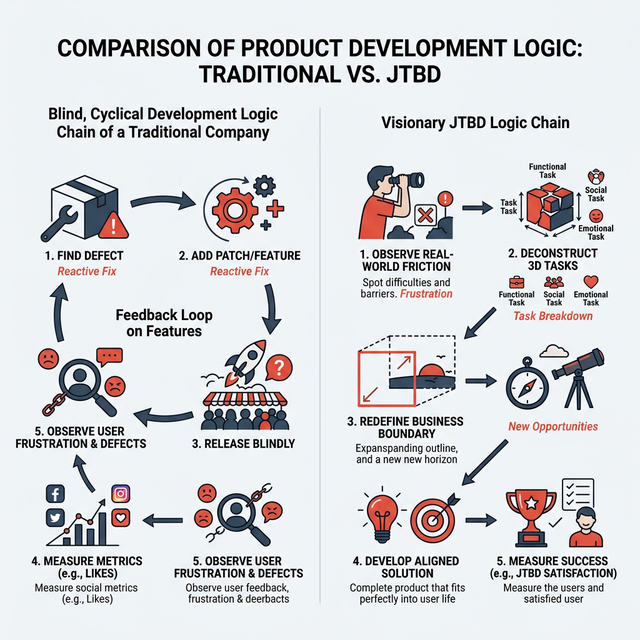
> **Scene**: 左侧是传统工业产品公司的盲目的开发逻辑链：发现自己机器的小缺陷 -> 拼命添加补丁新功能 -> 盲目测试排期发布。右侧是拥有 JTBD 上帝视角高手的逻辑链：敏锐观察真实世界阻力 -> 无情解构任务三维度 -> 彻底重新定义业务边界
> **Text**: 突破竞争的死亡边界：因为你的对手根本从来不是同行

> [PHILOSOPHY: 跳出特征与跨界替代]
> 最致命的跨界竞争，往往来自不可见的方向。一旦你掌握了 JTBD 框架，你会发现：竞争的边界将发生重大改变。

### 4.4 跨界猎杀：真正的竞争对手往往来自不同行业

在传统视角下，我们以为竞争只存在于同行之间：星巴克最大的竞争对手，理所应当是街对面的 Costa 或瑞幸咖啡。各大咖啡馆高管们在比拼谁的咖啡豆更好，谁的奶泡更绵密。

> [VISUAL]
> **Slide**: w03-slide-23_coffee_war
> **Layout**: Center
> **Asset**: 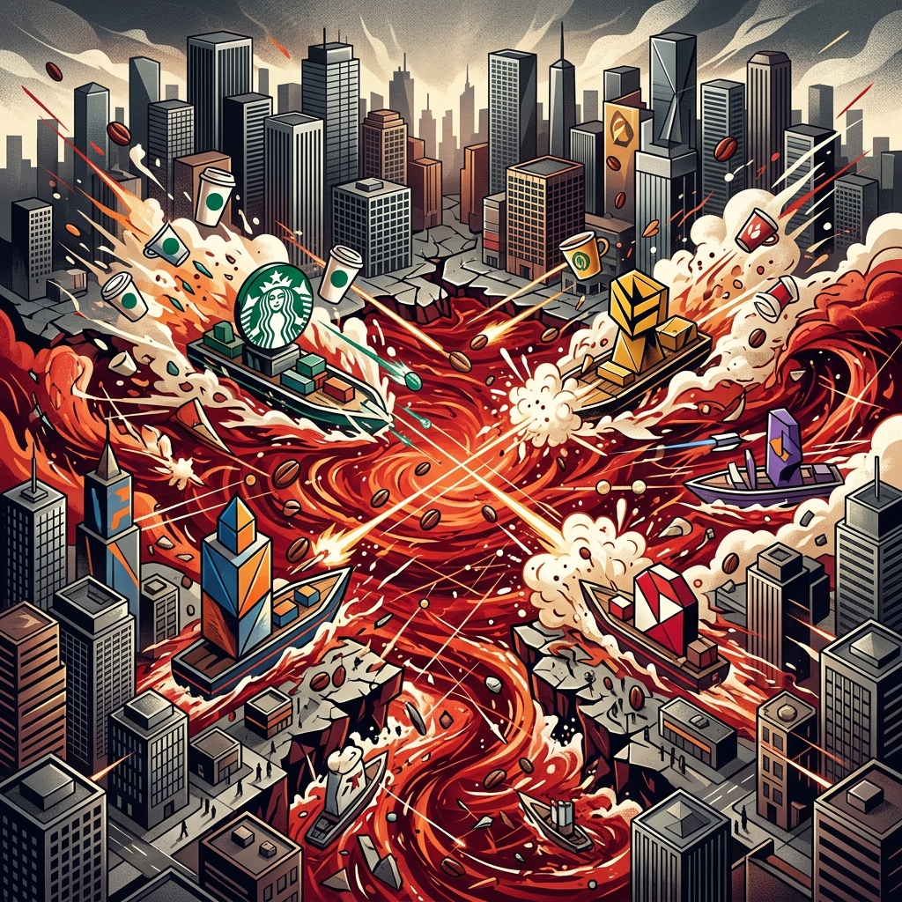
> **Scene**: 星巴克、Costa、瑞幸咖啡在CBD楼下激烈肉搏的价格战与发泡牛奶比拼
> **Text**: 传统视角的盲区：在同质化特征里陷入红海厮杀
> 
如果我们运用 JTBD 框架重新审视，当观察员深入观察星巴克里戴着降噪耳机敲击电脑的白领时，他们雇佣星巴克底层完成的核心任务，并不是获取咖啡因，而是：**"我迫切需要逃离充满压迫感的格子间，找一个环境舒适的第三空间（Third Place），让我能不受打扰地专注工作两小时。"**
>
如果目标已经被定义为"获取私人第三空间"，那么能真正取代星巴克的跨界对手，根本就不是瑞幸咖啡！

> [VISUAL]
> **Slide**: w03-slide-23b
> **Layout**: `List`
> **Asset**: 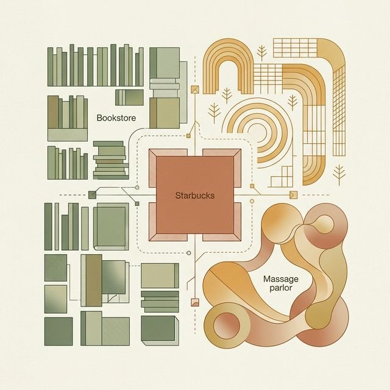
> **Scene**: 星巴克在中心，包围它的是跨界竞争者：西西弗书店、隐秘下沉中庭、深睡按摩馆
> **Text**: 跨界猎杀：当对手不再是同行
> **List**: 1. 公共书店 (安静阅读) | 2. 下沉中庭 (隐秘休息) | 3. 按摩 SPA (沉浸安眠)

> 真正能跨界满足这个替代方案的，可能是拥有安静阅读桌的**西西弗书店**；也可能是大楼底层的高级**下沉中庭**；甚至可能是一家能让人深度放松的**按摩 SPA 馆**。
>
> 这就是剥离需求维度的价值。它能让你跳出产品特征的局限，站在更高维度看清潜在的跨界竞争者。

来，我们立刻用这个“跨界猎杀”的视角来做一个思维小测验。

> [ACTIVITY]
> **Type**: `Quiz`
> **Duration**: `2min`
> **Desc**: 情境诊断：基于 Context 的跨界竞争
> **Q**: 晚上 10 点，一位刚结束连续 14 小时高压会议的互联网白领，极其疲惫地走进一家精酿酒吧，点了一杯最烈的威士忌。如果此时她的底层 JTBD 任务是“快速麻痹大脑，强行切断工作焦虑的连接”，那么在这个特定情境（Context）下，这杯威士忌真正的跨界竞争对手最可能是以下哪一个？
> **Options**: A. 隔壁便利店卖的另一款便宜 50% 的精酿啤酒 | B. 另一家灯光更亮、放着轻音乐的红酒体验馆 | C. 手机里能让人大脑瞬间放空、沉迷刷两小时的短视频 App | D. 她家里冰箱里存放的纯净水
> **Answer**: `C`
> **Explain**: 在这个极度疲惫、急需“切断大脑工作连接”的情境下，威士忌解决的是“情绪麻痹与逃离”的任务。短视频 App 同样能提供即时的高刺激和大脑放空，完美替代了这种心理需求。A 和 B 依然停留在“酒精饮料”的物理品类里竞争（没有跳出产品特征），而短视频则是基于 JTBD 视角的**深度替代**。

> [VISUAL]
> **Slide**: w03-slide-24
> **Layout**: `Full`
> **Asset**: 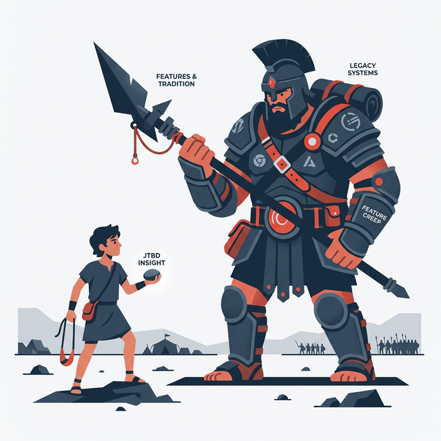
> **Scene**: 少年大卫握着普通石块对峙装甲巨无霸歌利亚的油画
> **Text**: 切入垂直市场：寻找未被满足的深层痛点

看屏幕上这幅油画。左半边是包裹重甲的歌利亚——代表拥有庞大资源的行业巨头。右半边是少年大卫，手里的石头就如同 JTBD 视角。与其在巨头最擅长的护甲上拼资源，不如找到他们忽略的、**未被满足的核心任务**，以此切入市场。

> [VISUAL]
> **Slide**: w03-slide-25
> **Layout**: Flow
> **Asset**: 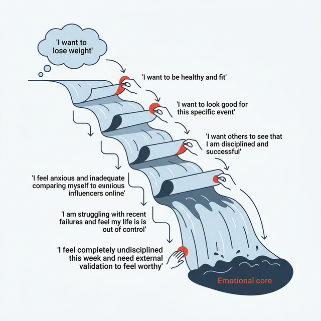
> **Scene**: 一张从表层需求逐步剥茧，直到触及底层心理动机的推演逻辑图
> **Text**: 1. 拆除表象标签 -> 2. 田野行为观测 -> 3. 三维剥离核心 -> 4. 锁定情境 -> 5. 跨界替代

在这个从表象向内核逐层剥茧的过程中，你会逐渐发现，真正的核心痛点从来不是工整地写在调研问卷上的，而是深藏在用户每一次犹豫、每一次妥协和每一次下意识的肢体动作里。

> [VISUAL]
> **Slide**: w03-slide-29_jtbd_universe
> **Layout**: Center
> **Asset**: 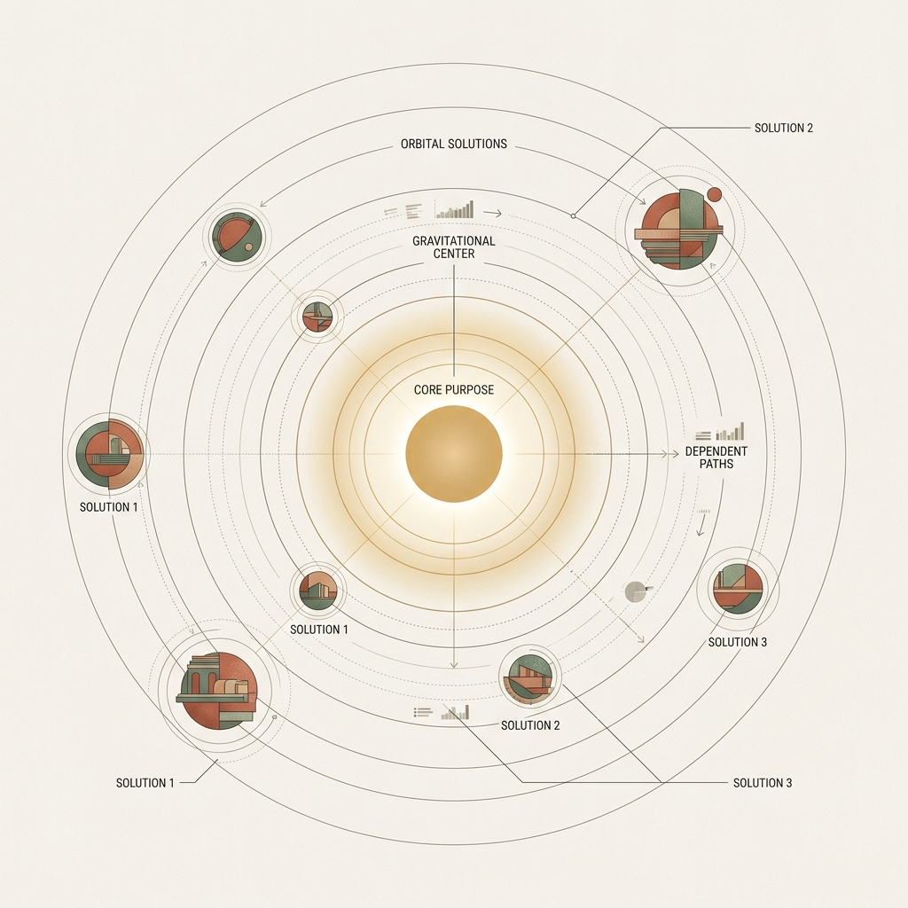
> **Scene**: 一幅深邃如星图般的架构图，从表层的产品特征层层下钻，直至人性深渊的原始需求
> **Text**: JTBD 宇宙全貌：在真实时空中捕获底层雇佣关系

至此，我们完成了对 **JTBD 框架** 从表层到内核的完整拆解。

> [TEACHING MOMENT]
> 我要求你们从走出这扇门开始，当有人向你炫耀他的产品堆叠了多少个高级 AI Feature，或者交互圆角有多么丝滑像素对齐时，请毫不留情地用 JTBD 框架反问他一句：
> **"请问，你这个精密的系统，究竟是想被哪个困境群体，在什么具体情境下，出于什么样的面子或内心情感，花多少钱雇佣来完成什么底层的物理任务？"**
> 如果他答不上来，那我可以保证，这个产品无论堆砌得多么华丽，最后一定会在商业竞争中黯然退场。不要迷恋产品特征，永远追问用户在具体情境下的生存任务。

**(Pause: 3s)**

好，在进入动手实践之前，我们先来做一道快速测验，检验一下大家刚才有没有真正理解 JTBD 的精髓。

> [ACTIVITY]
> **Type**: `Quiz`
> **Duration**: `2min`
> **Desc**: JTBD 三维解绑：识别隐藏的社会性需求
> **Q**: 小明买了一台戴森吸尘器，当天晚上在朋友圈发了一条精心构图的开箱照片。根据 JTBD 框架，他发朋友圈这个行为属于什么维度的需求？
> **Options**: A. 功能性需求 (Functional) | B. 个人情感需求 (Emotional) | C. 社会性需求 (Social) | D. 情境性需求 (Contextual)
> **Answer**: `C`
> **Explain**: 发朋友圈是为了向外界展示生活品质、获得点赞与社交认同，属于社会性需求（Social Job）。与戴森吸尘器本身"吸灰"的功能性无关，也不同于个人内心的安全感/掌控感（Emotional）。D 选项"情境性需求"不是 JTBD 的三大维度之一，而是制约三大维度的前置条件。

> [VISUAL]
> **Slide**: w03-slide-29_activity_intro
> **Layout**: Center
> **Asset**: 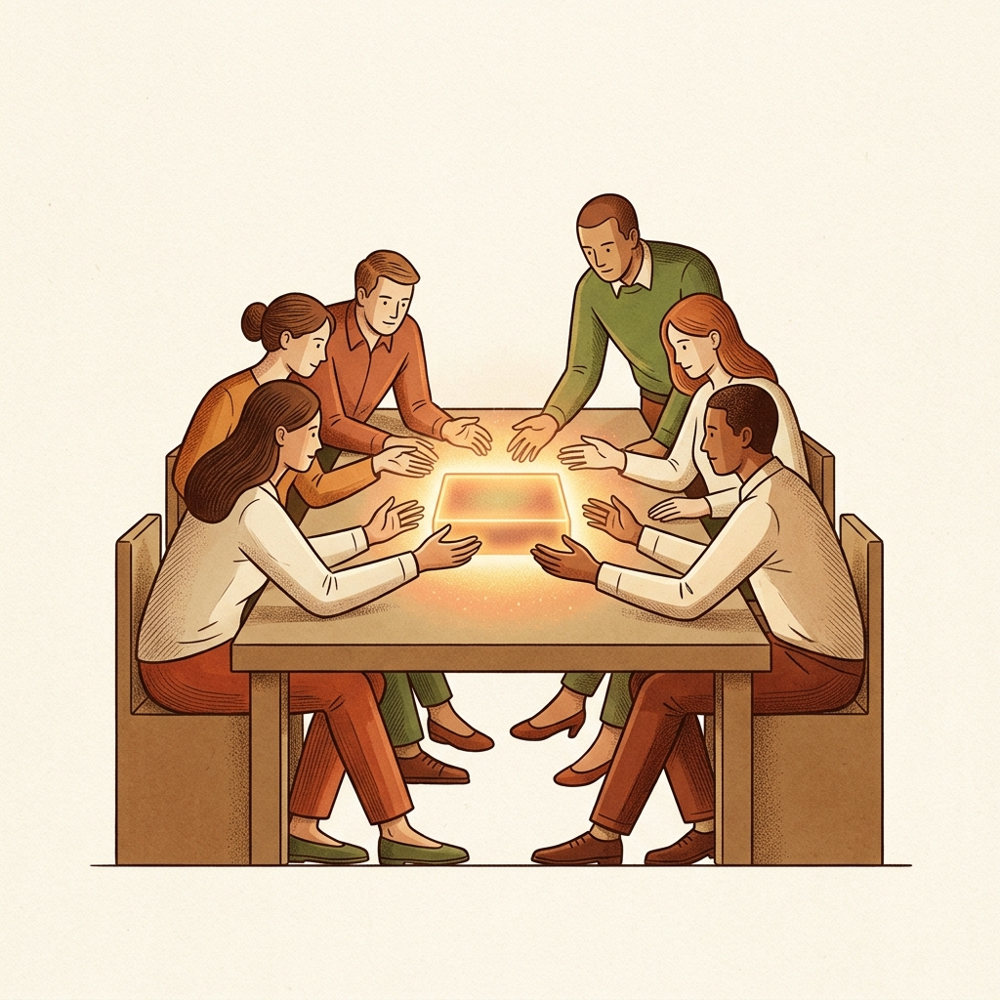
> **Scene**: 粗暴地把一个高科技产品大卸三块（功能、社会、情感）的解剖台
> **Text**: 战前准备：你们的直觉武器库

> [ACTIVITY: 三维解剖练习]
> **Type**: `Workshop`
> **Duration**: `5min`
> **Desc**: 现场拆解一款日用品的社会与情感维度
> `操作`：请各小组同学在桌面上任选一件正在使用的日常物品（例如：降噪耳机、无糖可乐、潮玩盲盒等）。
> 倒计时 3 分钟，分析当你购买并使用它时，它帮你完成了什么：
> 1. 最底层的**功能任务**（Functional）？
> 2. 维护社会形象的**社交任务**（Social）？
> 3. 隐秘的**情感任务**（Emotional）？

在动手拆解之前，我必须郑重提醒你们一个极其容易掉入的陷阱。请绝对不要用敷衍的表面逻辑来交差，去**挖掘表象下的隐秘动机**。

> [VISUAL]
> **Slide**: w03-slide-29_activity_warning
> **Layout**: Center
> **Asset**: 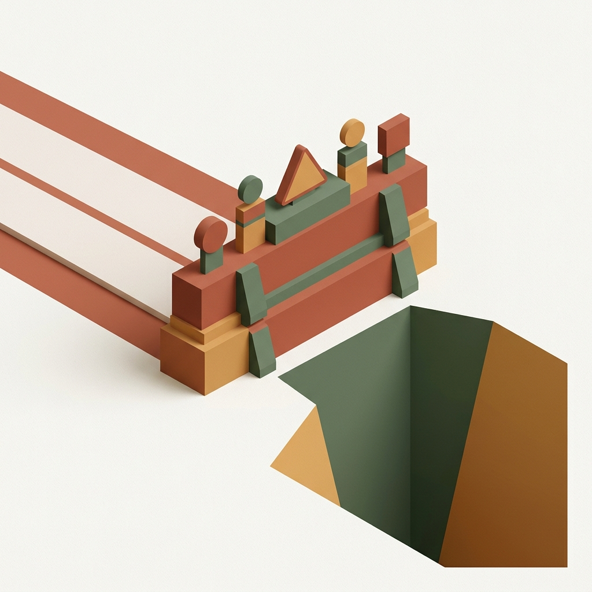
> **Scene**: 打工人在开放式工位上戴上降噪耳机，仿佛进入了一个专属的保护罩
> **Text**: 挖掘表象下的隐秘动机

提示：不要停留在"只是为了更清楚地听歌"这类表层理由。那副价格不菲的降噪蓝牙耳机，其情感任务极有可能是："在充斥着交谈声的开放式工位上，用戴上耳机这个动作，建立起一个旁人勿扰的边界，为自己创造片刻的独处空间"。
请坦诚地在纸上写下物品背后真实的雇佣动机。
