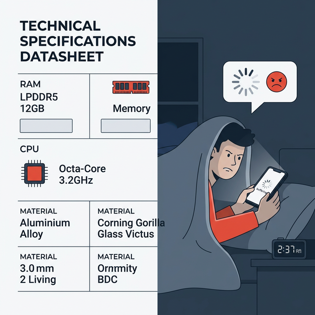

## 模块 4: 讲授二——JTBD 框架与需求的维度剥离 (35 min)

<!-- BUDGET: 5400 chars | SLIDES: ≥10 | STATUS: done -->

> [VISUAL]
> **Slide**: w03-slide-16
> **Layout**: `Center`
> *   **Asset**: 
> **Scene**: 漆黑的背景上，只亮着一盏极其昏黄的聚光灯，照亮了一把孤独的、满是伤痕的工业电钻
> **Text**: JTBD (Jobs-to-be-Done)：从"卖电钻"到"买墙洞"

### 4.1 JTBD法则：从卖电钻到出售墙洞

商业史上有句被引用烂了的名言来自于哈佛商学院知名教授西奥多·莱维特（Theodore Levitt）："人们其实根本不想买一个四分之一英寸长的电钻，他们只是想要一个四分之一英寸宽的墙洞。"

这句话就是整个 **Jobs-to-be-Done (JTBD)** 方法论的绝对灵魂发源地。
中文世界里，我们通常把它翻译为"**目标导向的待办任务**"。它的核心世界观极其冷酷，甚至是对开发者的巨大降维打击：永远记住，用户根本不在乎你的破产品、你的公司使命、你的品牌溢价，甚至完全不在乎你通宵熬夜极其费力加上去的那些华丽功能。
他们在乎的唯一一件事是：他们在生活的某一个极其特定、甚至陷入绝望的时刻，遇到了一个麻烦，然后他们走进这个名为"商业超市"的巨大的、冷酷无情的人才市场里，也就是咱们常说的 **Hire——雇佣**了你的产品，来帮他们极其廉价地完成那个该死的任务。
在这个临时契约里，只要这个任务一旦完结，或者只要他们明天早晨发现了一个干活更快、更顺手、更便宜的伙计（也就是你们的竞品），他们的大脑就会毫不犹豫地、没有任何心理负担地将你们极其残忍地 **Fire 掉也就是解雇**。

**(Pause: 3s)**

> [VISUAL]
> **Slide**: w03-slide-17
> **Layout**: Split
> *   **Asset**: 
> **Scene**: 左侧：一张冰冷的产品属性表（内存大小、CPU处理速度、硅胶材质）；右侧：一个深夜在被窝里看视频不想因为卡顿而被突然硬生生破坏情绪的真实用户场景
> **List**: 传统视角：盲目聚焦产品特征与人口统计学 | JTBD 视角：聚焦真实情境 (Context) 中的进度阻力

### 4.2 下沉场景：锁定雇佣背后的真痛点

传统的视角是怎么做产品的？他们天天盯着那些所谓的产品特征也就是 Features，还有冷冰冰的人口统计学也就是 Demographics 数据。比如那些荒谬的立项报告："我们要为 25-35岁、年薪20万的都市白领女性群体，开发一款含有高浓度玻尿酸因子的抗衰老面霜。"
这种颗粒度粗糙到可笑的大宗描述，在真实的、充满荷尔蒙的残酷购买决策面前，毫无任何杀伤力和解释力。那个 28 岁的白领女性，昨晚花掉半个月工资买下你们面霜的残忍真相，根本不是因为她在看成分表时注意到了"含高浓度玻尿酸"这个冰冷的化学名词。而是因为她惊恐地发现自己明天必须要去参加前男友的盛大婚礼，她那一刻唯一的"待办任务"是：**"我必须雇佣这个极其昂贵的瓶子，让我在明天早上的旧情人面前，强制展现出气血极度旺盛、丝毫没有被生活摧残过的胜利者姿态！"**

这就是 JTBD 的精神质变威力。它强行剥离产品的物理表象，像一根刺一样直接扎入用户在那个极其具体的时空情境（Context）下的挣扎。

> [CASE STUDY: 克莱顿·克里斯坦森与那杯麦当劳奶昔]
> 把这个看似极其简单、实则极难驾驭的理论推向硅谷商学院神坛的，是已故的哈佛颠覆式创新大师克莱顿·克里斯坦森（Clayton Christensen）。他曾经接到过一家跨国快餐巨头（类似于麦当劳）极其绝望的最高级别求助。
>
> 麦当劳当时下达了死命令，想强制提高**奶昔**的单店销量。怎么做呢？按照所有跨国大公司毫无灵魂的常规套路，他们找来了一堆平时在购买记录里显示经常喝奶昔的人做焦点小组，笑眯眯地问他们："先生，您想要更浓稠一点的奶昔吗？还是更甜的？或者是想要我们加入更多有嚼劲的果肉碎片？"
> 在拿到这些通过精密计算得出的大量"确凿"数据后，麦当劳花了几个月时间改良配料配方，隆重推出了更浓、更甜腻、更丰富的绝美奶昔。结果呢？产品上市之后，全美门店销量数据像停尸房里的死人心电图一样，拉出了一条极其平滑的直线，甚至在某些区域还略微跌了一点。
> 
> [VISUAL]
> **Slide**: w03-slide-17b
> **Layout**: Split
> *   **Asset**: 
> **Scene**: 左侧是试图通过加糖加果肉来"优化配方"的无头苍蝇研发会议；右侧是早上六点多，观察员面无表情地坐在餐厅角落记录
> **Text**: 放弃问卷，回归田野观察
> 
> 克里斯坦森的咨询团队接手后，立刻叫停了极其愚蠢的优化，彻底废弃了这些产品维度的属性调研表格。他大笔一挥，派出高级观察员，从早上寒冷的 6 点钟开始，不带任何预设、像没有生命的木头人一样坐在餐厅角落里，死死盯着每一个买奶昔的人长达十几个小时。
> 很快，他们发现了一个极度反常的诡异现象：**餐厅里竟然有将近一半比例的奶昔，是在早上极早的 8 点半之前被卖出去的。**而且这批人通常只单独买了这一杯孤独的奶昔，没有任何油腻的配餐。更诡异的是，他们从来不坐在餐厅那张舒服的沙发里喝，而是急匆匆地拿起杯子直接冲出大门，钻进自己的汽车，然后开车消失在早高峰浩浩荡荡、无比绝望的拥堵车流里。

> [VISUAL]
> **Slide**: w03-slide-18
> **Layout**: Flow
> *   **Asset**: 
> **Scene**: 极度拥堵、清晨空气混浊的高速公路上，一名极其无聊困倦的司机，一边单手生无均恋地握着方向盘（绝对不能沾上油污），一边艰难地用一根极细的吸管喝着一杯极其浓稠、半天吸不上来的奶昔
> **Text**: 破案："雇佣"那杯粘稠的液体去对抗漫长无聊的早高峰通勤

> [CASE STUDY: 麦当劳奶昔的下半场革命]
> 洞察到此并没有结束。观察员第二天早上天没亮，直接在高速路口拦住了这群神秘的人："先生，如果我不介意的话，您能不能告诉我一个极其私人的问题，您今天早上为什么要**雇佣**这杯奶昔？"
> 真相在此刻如同核弹般炸开。这些清晨面如死灰的通勤者，面临着一个极其极其漫长——长达 30 分钟到一小时、而且极其枯燥乏味的高速公路驾驶任务。他们需要在保持专注的同时，找一件绝对不费脑子、能完美解放一只手的事情，来打发这被禁锢在铁皮盒子里无聊的 40 分钟。最要命的是，这件打发时间的东西，吃下去以后肚子里必须得有极其强烈的饱腹感，能让他们一直抗饿撑到中午 12 点的午餐哨响。
>
> 竞争对手是谁？在这个极其特殊的时空场景下，竞争对手根本不是汉堡王的什么奶昔，也不是星巴克那杯极其昂贵的拿铁！
> 听听用户绝望的尝试：他们曾经尝试过"雇佣"一根纯天然的香蕉，但柔软的香蕉两口吞下去不到一分钟就吃碎了，剩下的 39 分钟依然无聊得想去撞车；
> 他们尝试过"雇佣"一个极其美味、裹着一层厚厚糖霜的甜甜圈，但弄得单手和方向盘上全是黏糊糊的白色糖粉，在车里根本无法洗手，极其狼狈；
> 他们也尝试过"雇佣"一把健康的干贝果面包，但在没有水的情况下干巴巴地难如下咽。
> 
> 只有那杯原本只是用来当甜点的、极其浓稠（甚至在低温下浓稠到吸管很难马上吸出液体）的冰镇奶昔，极其完美地解决了这个世纪痛点——正因为浓稠，它强制你需要花整整 20 多分钟才能极其艰难地靠肺活量全部吸完；它牢牢地塞在一个小巧的汽车杯架里一点液体都不会洒出；而且它那高热量的粘稠感在胃里带来了极其强烈的满腹感。
> 
> 得知了这个血淋淋的真相，麦当劳痛定思痛地掀翻了上周的计划。他们绝对不再去盲目往里加糖或者增加果肉碎片了。

> [VISUAL]
> **Slide**: w03-slide-18b
> **Layout**: `Comparison`
> *   **Asset**: 
> **Scene**: 对比图。传统解法思维：把奶昔变甜、加果肉；JTBD解法：让奶昔变泥一般粘稠，配上孔眼极窄的细吸管，以及立等可取的快取车道
> **Text**: 颠覆直觉的重构：为填补无聊时间而生的反向设计

> 他们做的改良极其精准且违反直觉：让早上的奶昔变得**更加无比的浓稠**（核心目的是为了史诗级地增加驾驶员打发时间的极限时长），并在杯盖里强行附赠一根**更坚固但孔径更小的极细吸管**（极大增加单次吸吮物理门槛和口腔阻力），并且直接把笨重的奶昔机从后厨搬到了点餐台的最前面，甚至打通了 Drive-Thru 车道，通勤者只要伸手刷卡就能在 5 秒内瞬间拿走，连车窗都不用摇到底。
> 结果，销量如火箭般瞬间暴涨。

这，就叫看透了用户藏在潜意识海沟最深处的 Job to be Done。你根本不是在贩卖一杯甜腻的卡路里液体，你是在向这个世界提供一个能打发无聊通勤时间并维持 4 小时饱腹感的伟大物理生存装置！

但这个理论远远没有结束，我们要向人类心理学的更深一层去挖掘。

> [VISUAL]
> **Slide**: w03-slide-19
> **Layout**: `Split`
> *   **Asset**: 
> **Scene**: 用户大脑皮层极其复杂的三维分解图，如同令人毛骨悚然的俄罗斯套娃：最外层是冰冷的机械臂（功能），中间层是戴着虚伪社交面具的人（社会），最深层是一颗流血跳动、极度没有安全感的心脏（情感）
> **List**: 1. 功能性（Functional） | 2. 社会性（Social） | 3. 情感性（Emotional）

### 4.3 三维解绑：功能、社交与情感的交织

如果在座的各位在听完奶昔的故事后，今天只记住了"能吸多久"这个单一的"功能性"满足，那你们就把这门伟大的学科和人机交互的深度看得太廉价了。
作为千万年进化中存活下来的终极狩猎者，人类也是地球上最装腔作势、但也最敏感胆怯的群居动物。我们在掏钱雇佣一个产品时，我们的大脑皮层和边缘系统会同时爆发三个维度的疯狂并行计算。

**(Pause: 3s)**

### 4.4 功能底线：维持不被拉黑的物理及格线

这是维持一个产品不下架、不被拉黑的最基础的保底生存维度。你的这把物理剪刀，到底能不能极其顺滑地把硬纸板剪开？你的这个地图导航 App，能不能用最短的耗时帮我完整规划出从 A 点到 B 点的最优公交换乘路线？
如果在这一层物理层面直接失效甚至宕机，一切用户体验免谈，直接火葬场。但在当下技术爆炸的市场，如果对手都能完美做到功能及格，红海厮杀将会极其残酷。功能，永远无法构成绝对护城河。

### 4.5 社交假面：维系阶层体面的隐秘虚荣

这是每一个处于社会网络节点上的用户，在按下"下单付款"按钮前，潜意识深处对自己的那句致命拷问：**"如果我今天使用了这个产品，我在圈子里看起来会是一个什么样形象的人？"**
我们为什么放着结实耐磨的帆布包不买，去买极其昂贵且容量极小、毫无倒角的所谓奢侈品手袋？因为她真正雇佣的社会属性是："我必须让今晚晚宴上的前同事们第一眼就确认，我已经脱离了十年前寒酸的底层阶层"。
在中国广袤的市场环境下，由于极强的面子文化，社会性任务的权重经常极其残暴地碾压功能性任务。

> [VISUAL]
> **Slide**: w03-slide-20
> **Layout**: `Full`
> *   **Asset**: 
> **Scene**: 极度孤独、灯光暗淡的凌晨三点浴室里，一个人卸下所有防备站在镜子前，深深地凝视着自己布满血丝和绝望疲惫的双眼
> **Text**: 情感性任务：在这个极其残酷冷漠的世界上，让我暂时觉得一切还在我的掌控之中

### 4.6 情感幽灵：直面深夜失控的本能恐慌

在这个极度私密的核反应堆里，外界的社交面具被硬生生剥落。这是每一个脆弱的用户深夜独自面对镜子时，对自己发出的灵魂拷问：**"当我用手指划过这个东西的屏幕时，我内心最深处，是感受到了一丝踏实的安全感，还是那种面临失控边缘的巨大恐慌感？"**
这才是唯一能决定一个伟大产品能否获得绝对黏性、甚至让用户产生信仰崇拜的最高壁垒。

> [CASE STUDY: 医疗器械面板上的 B 端终极尊严]
> 为了震慑你们的专业神经，让我们直接跳出毫无风险的轻量消费品软件，看一个极其冰冷、一招不慎就会死人的严肃医疗 B 端系统案例。
> 假设就在现在，你们团队中标了，要在接下来的一年里，重新设计一把下一代极其精密、价值上千万美元的"达芬奇"外科机械腹腔手术刀的中央触控监控大屏系统。
> 
> 首先，它的功能性任务是什么？极度明确：在超高 8K 分辨率下毫无一丝物理跳帧延迟地显示器官组织和微小血管的断层，机械臂必须跟随主刀医生的手柄指令，一刀切下去绝对不能存在哪怕一微米的漂移偏差。这关乎流血的生命。
> 那它的社会性任务呢？难道你天真的以为，在这扇关闭的、全凭最硬核专业技术的急诊室铁门里就没有名利场的社会性吗？极其无知！这台机器的社会性任务是："当我是这家顶级三甲医院的主刀大夫时，当旁边那一群用极其崇拜目光注视着我的小实习医生和极其挑剔的巡回护士们围观我的操作时。该死的，我绝对不能因为找不到一个该死的菜单按钮，而在他们面前像个手忙脚乱找不到北的蠢货！这块总控屏幕极简、高冷、充满工业秩序感的深色克制 UI，必须完美配得上我作为这个科室一把手、那种掌握生杀予夺绝对权力的顶级精英掌控力！"
> 
> 那么，最惊心动魄最核心的、深海里的情感性任务呢？！这是一个顶级主刀医生死死压在心底的终极失控恐惧。在这座系统的灵魂深处，它的情感性任务是哀号的："上帝啊，请在今天这个长达 6 个小时、满眼是血、极度消耗脑力的高压腹腔恶性肿瘤多重剥离手术中，用极其稳定可靠的按键物理声光回馈，和哪怕按错也有二次弹窗确认的兜底容错机制，给我一种安全感！让我在这台冷冰冰的巨大机器面前，极其踏实地觉得自己这双布满老茧的手绝对能掌控一切，让我确认我绝对不会因为系统的一次该死的崩溃卡顿而在手术台上亲手杀掉我的这个倒霉病人。在这个全宇宙似乎只剩下我一个人的孤独无影灯下，请用绿色的呼吸灯温柔地告诉我，我不再是孤军奋战。"

> [VISUAL]
> **Slide**: w03-slide-21
> **Layout**: `Comparison`
> *   **Asset**: 
> **Scene**: 医疗极危控制端左侧全是被密密麻麻参数包围的仪表盘，右侧则是极其清晰且带有巨大的防误触倒计时动画界面的对比图
> **Text**: 最高级的设计，是贩卖安全感与生命尊严

各位闭上眼睛想一想，一旦你们被迫学会了用这种近乎变态的三维解构透视眼，来重新看待那张单薄的需求列表，你们就会彻底觉醒：
你们每天在屏幕上死磕画出来的每一个边框拉拽像素点，设计的每一个用来表示加载的微小过渡动效，写的每一行在极端报错情况下用于安抚用户的文案。这根本不再像纺织女工一样是在交付一个毫无生气的"Feature"，而是在极其小心翼翼地，缝合一个活生生、充满焦虑的人身上的情感撕裂。

**(Pause: 3s)**

> [VISUAL]
> **Slide**: w03-slide-22
> **Layout**: Grid
> *   **Asset**: 
> **Scene**: 四宫格展示极其违和的产品场景实验：左上是一个和尚正在店里买极其锋利的冰梳子，右上是一个大汗淋漓的健身房跑步机面板上放了一包高热量薯片，左下是一根极其昂贵的宝格丽钻石项链戴在一只流浪宠物狗脖子上，右下是一辆极其拉风的法拉利跑车卡死在积满泥水的农村下雨农田里
> **Text**: 致命前置：情境（Context）决定了一切高级功能的生死

### 4.7 致命环境变量：决定功能生死的 Context

我们刚才深度暴力解剖了人类雇佣机器的三大神经维度，但我必须提醒一点，永远不要忽略了包裹在这三大维度之上、一个极其隐秘但却能一指定生死的系统级变量，那就是**情境（Context）**。

在交互体验的法则里，脱离了用户所处的极其具体的发生时间段、物理限制地点、以及使用者当时处于崩溃还是狂喜的心理剧本状态的情境去谈需求，所有看似无懈可击的功能推演，全部都是毫无价值的纸上谈兵。
比如最简单的："快速购买一杯咖啡"。如果此时此刻输入的情境是"早上严寒的八点半、在一个极其拥挤还飘着雨雪的地铁站出口、距离全勤奖打卡时间还剩可怜的 3 分钟冲刺"。那这位打工人的超级痛点就只剩下一个：**这杯黑色液体必须绝对的速度交付、一秒钟都不能多花，并且极其需要一个毫无界面步骤的免密刷脸支付**。哪怕杯盖略微盖斜了洒出一滴他连眉头都不会皱一下。
但是，如果第二天情境强行切换，变成了"周六阳光极其明媚的下午两点、坐在全城最昂贵的街角咖啡馆户外椅上、和自己整整三年没见的初恋女友首次约见"。这个时候那区区两分钟的出杯速度根本他妈的不重要！他那可怜的虚荣心极度需要的是：**穿着带有刺绣围裙的咖啡师极其优雅、如同表演杂技一般的极其复杂奶泡拉花动作，以及一杯极其昂贵、端在手里能极大彰显自己非凡审美品位和阶层质感的暗黑色马克杯**。

如果你的系统不能因地制宜，它就会在某个情境下轰然崩塌。所以，必须像用订书钉一样，死死地把"（在什么样极其具体的环境下）"这个强制前置条件锁链，死死钉在所有痛点陈述语句的最前方！

> [VISUAL]
> **Slide**: w03-slide-23
> **Layout**: Split
> *   **Asset**: 
> **Scene**: 左侧是传统工业产品公司的极其盲目的开发逻辑链：发现自己机器的小缺陷 -> 拼命添加补丁新功能 -> 盲目测试排期发布。右侧是拥有 JTBD 上帝视角高手的逻辑链：敏锐观察真实世界阻力 -> 无情解构任务三维度 -> 彻底重新定义业务边界
> **Text**: 突破竞争的死亡边界：因为你的对手根本从来不是同行

> [PHILOSOPHY: 认知升维与跨界降维打击]
> 
> ### 4.8 跨界猎杀：粉碎同行的超维打击图鉴
> 
> 这个世界上最可怕的暗杀，往往来自不可见的方向。一旦你在未来的职业生涯中，大脑神经潜移默化地熟练掌握并且肌肉记忆了 JTBD 框架，你会极其震撼地发现：你所在的战场的地理边界，瞬间发生了极其恐怖的引力空间级别重力扭曲。
> 在传统的"产品特征和品类锁死"视角下，我们以为的竞争是极其惨烈肉搏的：星巴克最大的竞争对手，理所应当就是街对面的 Costa、楼底下的瑞幸咖啡、连绵不绝的 Tim Hortons 和附近那家疯狂烧钱打惨烈九块九价格战的独立精品咖啡店。全球所有极具商业经验的咖啡馆高管们，天天坐在装有巨型落地窗的 CBD 顶楼会议室里，像看财报一样杀红了眼，拼命比拼谁从危地马拉空运来的阿拉比卡咖啡豆种类更丰富，谁打的发泡牛奶气孔密度更绵密口感更高级。
>
> 简直可笑至极。如果今天我们运用 JTBD 框架来降维打击，当观察员像黑客一样深入底层数据网络时，如果去星巴克那群极其安静并且戴着价值上千元降噪耳机疯狂敲击苹果电脑的高薪白领，他们雇佣星巴克底层真实完成的核心任务，并不是在追求什么舌尖上极其细微的咖啡因豆子酸度变化，而是：**"我迫切地、极度绝望地需要逃离办公大楼那个充斥着键盘声的充满压迫感的格子间，以及那个每隔十分钟就要令人窒息打断我的愚蠢主管。我要找一个有免费高速宽带、环境稍微有点低奢、甚至自带白噪音背景声的隐蔽第三空间（Third Place），让我能体面地、不用任何眼神交流地消耗掉起码两个小时的下午时光，强制逃避这个极其操蛋的现实职场压力"**。
>
> 看出极其恐怖的降维落差了吗？如果目标已经被定义为"逃离工位与获取私人第三空间"，那么在这个需求维度上能够将星巴克瞬间致命摧毁的跨界暗杀对手，此时此刻根本就不是对面的廉价瑞幸咖啡！

> [VISUAL]
> **Slide**: w03-slide-23b
> **Layout**: `Flow`
> *   **Asset**: 
> **Scene**: 令人绝望的跨界战争地图，星巴克在中心，而包围它的并不是咖啡馆，而是致命的跨界屠杀者：西西弗书店、隐秘下沉中庭、深睡按摩馆
> **Text**: 跨界屠杀：当对手不再是同行

> 这把用来割开消费者时间和金钱的极其锋利的暗杀之刃，极有可能是离写字楼只隔着两条街的一家灯光极佳并且拥有大量私人深色木质阅读桌的、24小时免费供暖的大型**公共西西弗书店**；也有可能是他们大楼底层那个巨大的、里面充满绿色真实植物和无人打扰的隐蔽宽大长椅的高级**购物广场下沉中庭**；甚至极有可能是在转角巷子里的一家只需要 199 元就能换取一次长达两小时深度沉浸式安眠的**泰式按摩 SPA 馆**！
>
> 这就是我们为什么要逼迫你们去掌握维度剥离痛点技术的唯一原因。它能像摘掉眼罩一样让你不再像个可怜的蠢货工业附庸，天天只是死死盯着同行的微末枝节来跟风抄袭做所谓的迭代功能，而是让你瞬间坐上电梯站到万米高空，拿着极其高倍率的战术望远镜，看清楚在这个庞大残酷、充满黑天鹅巨变的市场生存丛林里，到底还有哪些令人毛骨悚然的跨界物种，在极其贪婪地张大嘴巴抢夺属于你这片领地的底层利润营养。

> [VISUAL]
> **Slide**: w03-slide-24
> **Layout**: `Full`
> *   **Asset**: 
> **Scene**: 少年大卫只握着一块极其普通石块对峙浑身装甲巨无霸歌利亚的油画
> **Text**: 刺穿巨头的咽喉：利用 JTBD 刀法从尸体上切割出深不见底的垂直市场

看屏幕上这幅油画。左半边是那个浑身包裹着青铜重甲、手持巨盾、似乎坚不可摧的歌利亚——他就是你们眼里那些拥有无限资金和万人研发军团的行业巨头。右半边是少年大卫，赤脚站在尘土里，手里只握着一块极其普通的、从河边捡来的光滑石头。这块石头，就是你手里的 JTBD 精准分析。不要在巨头最擅长的厚重护甲上浪费时间拼刺刀——那是资源的自杀式消耗。找到他们盔甲缝隙里暴露出来的、那个从未被满足的核心痛点，一击毙命。

> [VISUAL]
> **Slide**: w03-slide-25
> **Layout**: Flow
> *   **Asset**: 
> **Scene**: 一张从最愚蠢浅薄的"我想变瘦"层层极其暴力血腥剥茧、直到触及心底"我想用一堆昂贵的有机沙拉装盘拍照发社交网络来对抗我这周极度匮乏的自律失控感"的可怕心智逻辑推演瀑布图
> **Text**: 1. 拆除谎言表象标签 -> 2. 田野行为观测 -> 3. 三维剥离核心 -> 4. 极端情境锁定 -> 5. 跨界物理打击

这就全貌。我们用短短几块黑压压的屏幕，给这一整个庞大而深不见底的 JTBD 宇宙画上了极其沉重但锋利的句号。
我要求你们从今天走出这扇教室的铁大门开始，当任何一个外行再向你得意洋洋地炫耀他的产品堆叠了多少个极其高级的牛逼 AI Feature，或者他的交互圆角度数倒角有多么令强迫症舒适的丝滑像素对齐的时候。
请你收起虚伪的客套，毫不留情地用这套极高维度的冰冷刀法反切他一句：
**"对不起，打断一下。你这个精密复杂的高科技玩具，究竟是想被哪个处于具体困境群体的人，在哪个绝望无依的下雨天场景，由于什么样的极其可笑的社会面子或是极度深层惊恐的内心情感，花掉他们多少该死的钱来雇佣去完成什么破破烂烂的最底层物理任务？"**

如果他支支吾吾半天答不上来，或者只会跟你讲界面美学。那我可以极其肯定地向你保证，这个产品系统无论堆砌得多么华丽无暇，最后一定会在不到一年之内、在极端残酷的商业流血坟场上，落个死无全尸、连一块完整的代码骨头都找不着的凄凉下场。

**(Pause: 3s)**

> [ACTIVITY: 三维解剖极端工具箱]
> **Type**: `Workshop`
> **Duration**: `5min`
> **Desc**: 极其粗暴残酷地现场拆解一款日用品的隐秘社会与情感三个维度
> `操作`：这是对你们直觉系统的一次闪电战突袭。请各小组的同学们立刻站起来，在现在这张混乱的桌子上随便找出一件正在使用的日常物品（例如：极度昂贵充满划痕的苹果降噪耳机、一罐冰冷的无糖可乐、一本布满灰尘的纸质笔记本、或者你电脑角落那个做工粗糙但售价高昂的潮玩盲盒）。
> 倒计时 3 分钟！用纸和笔极其无情、不加修饰地写下：
> 当你在掏空钱包购买和每天把它塞进包里极其艰难地带出门使用它时，它到底是帮你极其可悲地完成了什么：
> 1. 最底线的**机械功能任务**（Functional）？
> 2. 获取点赞虚荣的社会精英**面具任务**（Social）？
> 3. 极度缺爱的、只在深夜自己一个人舔伤口的隐秘**情感抚慰任务**（Emotional）？
> 
> 警告：千万别给我用"就只是为了更清楚地听歌"这种白痴借口来糊弄我！那副高达 1500 块的高级降噪蓝牙耳机，它的情感性防备任务极有可能是要在潜意识里："我不堪重负了。我要在这个充斥着极度令人崩溃的密集交谈声、打字机键盘敲打声以及毫无私人边界感的廉价开放式巨型工位上，用戴上耳机的这个极具仪式感的动作，强行为我自己建立起一个旁人勿扰的黑色安静量子结界，假装在这个物理世界里，我是暂时安全的，我暂时独自在这个平行的安静时空里拥有一间属于我自己的巨大私人办公室"。
> 不要给我粉饰太平！就在这里，在小组纸上，极其勇敢且坦诚地！写下你们生活里、人机关系里最毒辣隐秘的原始实话大实话！
